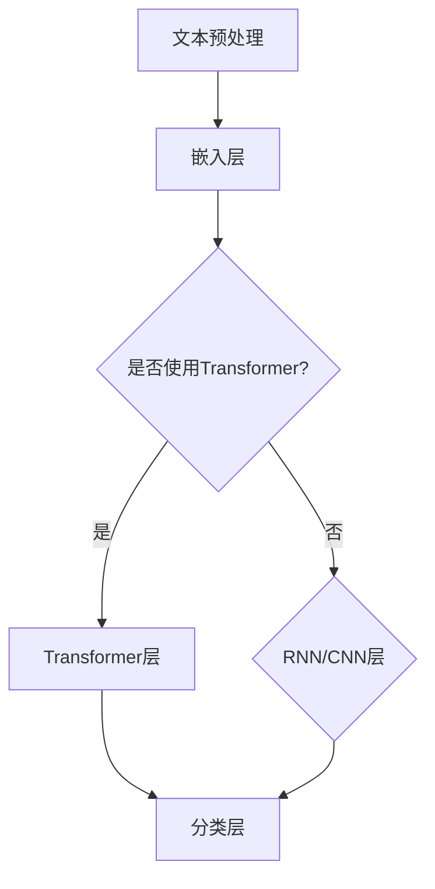
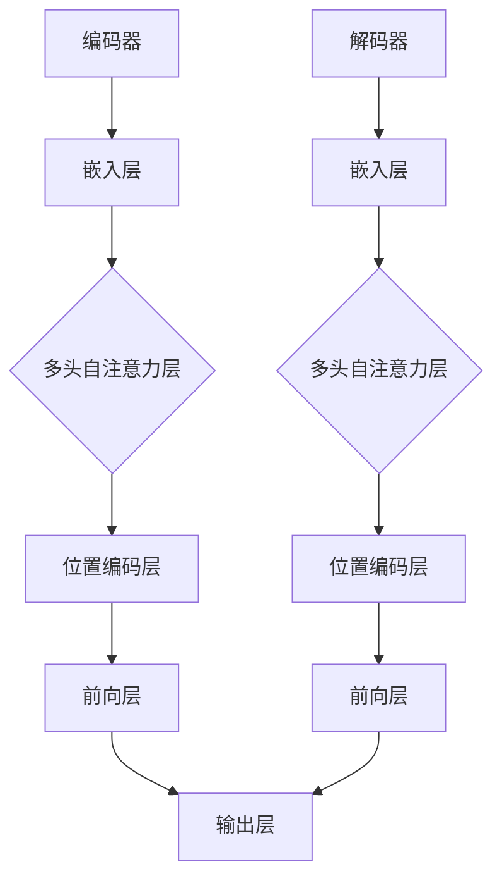
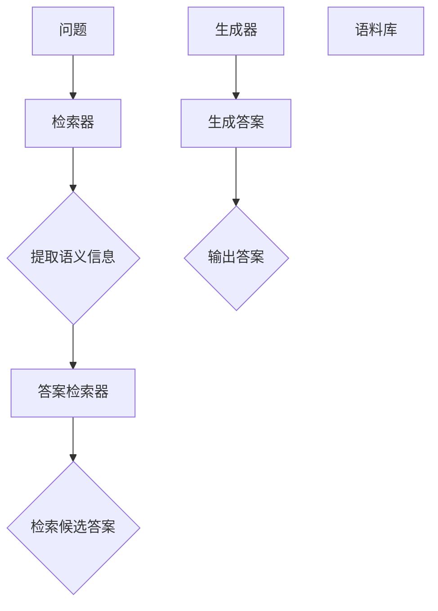
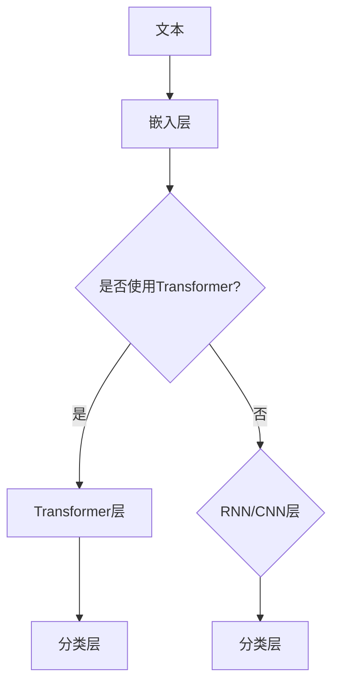

                 

### 背景介绍

#### 1.1 自然语言处理：什么是自然语言处理

自然语言处理（Natural Language Processing，简称NLP）是计算机科学、人工智能和语言学领域的一个分支，致力于使计算机能够理解、解释和生成人类语言。随着互联网和社交媒体的快速发展，自然语言处理的应用范围日益广泛，从文本分析、机器翻译、情感分析到问答系统等，NLP已经在众多领域取得了显著的成果。

#### 1.2 神经网络：什么是神经网络

神经网络（Neural Networks，简称NN）是模仿人脑神经元结构和功能的一种计算模型。神经网络由大量简单的处理单元（神经元）通过复杂的连接方式组成，能够通过学习大量数据来捕捉输入和输出之间的复杂关系。

#### 1.3 神经网络在NLP中的应用

神经网络在自然语言处理中的应用起源于20世纪80年代，经过几十年的发展，已经成为了NLP领域的主要技术手段。神经网络能够自动学习语言的结构、语义和语法特征，从而在文本分类、情感分析、机器翻译、语音识别等多个方面取得了突破性进展。

#### 1.4 传统NLP方法与神经网络方法的对比

传统NLP方法通常依赖于规则和统计模型，如正则表达式、隐马尔可夫模型（HMM）和最大熵模型等。这些方法在面对复杂、多变的自然语言时存在一定的局限性。相比之下，神经网络具有更强的表达能力和泛化能力，能够处理更复杂的语言现象，从而提高了NLP任务的性能。

#### 1.5 神经网络在NLP中的成功案例

近年来，神经网络在NLP领域取得了许多令人瞩目的成果。例如，基于神经网络的机器翻译系统（如Google翻译）已经在准确性和流畅性方面达到了专业水平。再如，基于神经网络的文本分类和情感分析系统在新闻分类、社交媒体情感分析等领域展现了强大的能力。这些成功案例不仅证明了神经网络在NLP中的巨大潜力，也为未来的发展提供了宝贵的经验和启示。

### 总结

本文将深入探讨神经网络在自然语言处理中的新突破。我们将首先介绍NLP的基本概念和传统方法，然后详细阐述神经网络的核心原理和在NLP中的应用。接着，我们将通过具体案例展示神经网络在NLP中的成功应用，并对比传统方法和神经网络方法的优势。最后，我们将展望神经网络在NLP领域的未来发展趋势和挑战。希望通过本文的讨论，读者能够对神经网络在NLP中的应用有一个全面而深入的理解。

## 2. 核心概念与联系

### 2.1 NLP中的核心概念

在探讨神经网络在自然语言处理（NLP）中的应用之前，首先需要了解NLP中的一些核心概念。这些概念包括文本表示、语义理解和上下文建模等。

#### 2.1.1 文本表示

文本表示是将原始文本转换为计算机可以处理的向量形式的过程。这一过程通常涉及将单词、短语或句子映射为高维向量。常见的文本表示方法有词袋模型（Bag of Words）、词嵌入（Word Embeddings）和词序列嵌入（Sequence Embeddings）等。

- **词袋模型**：将文本表示为一个向量集合，其中每个向量对应一个单词，向量中的每个元素表示该单词在文档中的出现频率。词袋模型简单有效，但忽略了单词的顺序和语义信息。
- **词嵌入**：通过将单词映射为固定维度的向量，词嵌入能够捕捉单词的语义关系。例如，相似的单词在向量空间中更接近。词嵌入技术如Word2Vec、GloVe等在NLP中广泛应用。
- **词序列嵌入**：除了捕捉单词的静态关系，词序列嵌入还能够考虑单词之间的动态关系。这种表示方法通常用于处理序列数据，如句子或文档。

#### 2.1.2 语义理解

语义理解是指计算机能够理解文本中的语义含义。这一过程包括词义消歧、实体识别、关系抽取等。

- **词义消歧**：在多义词环境下，确定单词的具体含义。例如，“bank”一词可以指银行，也可以指河岸。词义消歧通过上下文信息来确定正确的词义。
- **实体识别**：识别文本中的命名实体，如人名、地名、组织名等。实体识别有助于构建知识图谱和进行后续的语义分析。
- **关系抽取**：确定文本中实体之间的关系，如“苹果公司位于美国”中的“位于”关系。关系抽取是构建知识图谱和进行信息抽取的重要环节。

#### 2.1.3 上下文建模

上下文建模是指捕捉文本中词语之间的上下文关系。这一过程有助于提高NLP任务的性能，如文本分类、情感分析等。

- **局部上下文建模**：通过考虑词语周围的一定范围内的上下文信息，如词窗口（word window）或句子窗口（sentence window）。这种建模方法通常用于文本分类和情感分析。
- **全局上下文建模**：通过考虑整个文本的上下文信息，如通过递归神经网络（RNN）或变换器（Transformer）模型。全局上下文建模能够捕捉更复杂的语义关系，适用于长文本处理。

### 2.2 神经网络的核心原理

神经网络是一种模仿人脑神经元连接方式的计算模型。神经网络由输入层、隐藏层和输出层组成，每层包含多个神经元。神经元之间通过权重连接，通过激活函数进行非线性变换。

#### 2.2.1 前向传播

前向传播是指输入信号从输入层经过隐藏层，最终传递到输出层的过程。在这个过程中，每个神经元的输出是前一层所有神经元输出的加权和，经过激活函数后得到。

#### 2.2.2 反向传播

反向传播是一种用于训练神经网络的算法。它通过计算输出误差的梯度，反向更新每个神经元的权重。反向传播算法使得神经网络能够通过不断调整权重来优化模型性能。

#### 2.2.3 激活函数

激活函数是一种将神经元输出进行非线性变换的函数，如Sigmoid函数、ReLU函数等。激活函数使得神经网络能够学习复杂的关系。

### 2.3 神经网络在NLP中的应用

神经网络在NLP中的应用主要包括词向量表示、序列模型和文本生成等。

#### 2.3.1 词向量表示

词向量表示是将单词映射为固定维度的向量表示。词向量不仅能够捕捉单词的语义关系，还可以用于文本分类、情感分析和机器翻译等任务。

- **Word2Vec**：Word2Vec是一种基于分布式假设的词向量表示方法，通过训练大量文本数据生成词向量。Word2Vec包括连续词袋（CBOW）和跳字模型（Skip-Gram）两种模型。
- **GloVe**：GloVe（Global Vectors for Word Representation）是一种基于共现矩阵的词向量表示方法，通过学习全局语义信息生成词向量。

#### 2.3.2 序列模型

序列模型用于处理序列数据，如单词序列或句子序列。常见的序列模型包括循环神经网络（RNN）和长短期记忆网络（LSTM）。

- **RNN**：RNN能够处理序列数据，通过在时间步上递归地更新隐藏状态。RNN在处理长序列时存在梯度消失和梯度爆炸问题。
- **LSTM**：LSTM是RNN的一种改进，通过引入门控机制，有效解决了梯度消失和梯度爆炸问题。LSTM在语言模型、机器翻译等任务中表现出色。

#### 2.3.3 文本生成

文本生成是NLP中的另一个重要任务，常见的文本生成模型包括生成对抗网络（GAN）和自注意力模型（Transformer）。

- **GAN**：GAN由生成器和判别器组成，通过不断优化生成器的输出，使其在统计上接近真实数据分布。GAN在图像生成和自然语言生成等任务中取得了显著成果。
- **Transformer**：Transformer是一种基于自注意力机制的序列到序列模型，通过引入多头自注意力机制和位置编码，Transformer在机器翻译、文本生成等任务中取得了突破性进展。

### 总结

在本节中，我们介绍了NLP中的核心概念，包括文本表示、语义理解和上下文建模。同时，我们详细阐述了神经网络的核心原理和在NLP中的应用。通过理解这些核心概念和原理，我们可以更好地把握神经网络在NLP中的新突破。在接下来的章节中，我们将深入探讨神经网络在NLP中的具体应用和实践，以帮助读者更好地理解这一领域的最新进展。

### 2.2.1 NLP任务与神经网络架构

在自然语言处理（NLP）领域，神经网络的应用涵盖了多种任务，每种任务都有其特定的架构和实现方法。以下是一些主要的NLP任务及其对应的神经网络架构：

#### 2.2.1.1 文本分类

文本分类是一种将文本数据分配到预定义类别中的任务。常见的神经网络架构包括：

- **卷积神经网络（CNN）**：CNN能够捕捉文本中的局部特征，通过卷积层和池化层对文本进行特征提取。然后，使用全连接层进行分类。
- **循环神经网络（RNN）**：RNN能够处理序列数据，通过递归地更新隐藏状态来捕捉文本中的时间依赖关系。RNN常用于文本分类任务，如情感分析。
- **变换器（Transformer）**：Transformer引入了自注意力机制，能够捕捉全局特征和长距离依赖关系。在文本分类任务中，Transformer模型表现出了优越的性能。

**Mermaid流程图：**



#### 2.2.1.2 机器翻译

机器翻译是一种将一种语言的文本翻译成另一种语言的任务。神经网络在机器翻译中的应用主要包括：

- **序列到序列（Seq2Seq）模型**：Seq2Seq模型由编码器和解码器组成，编码器将源语言文本编码为一个固定长度的向量，解码器则根据编码器的输出生成目标语言文本。
- **变换器（Transformer）**：Transformer模型通过引入多头自注意力机制和位置编码，能够捕捉全局特征和长距离依赖关系。在机器翻译任务中，Transformer模型表现出了显著的性能提升。

**Mermaid流程图：**



#### 2.2.1.3 问答系统

问答系统是一种能够理解用户的问题，并给出合适答案的智能系统。常见的神经网络架构包括：

- **基于检索的问答系统**：这类系统首先使用一个检索器（如BERT）来提取问题的语义信息，然后从大量候选答案中检索出最相关的答案。
- **基于生成的问答系统**：这类系统使用一个生成器（如GPT）来生成完整的答案。生成器通过理解问题并搜索大规模语料库中的文本来生成答案。

**Mermaid流程图：**



#### 2.2.1.4 情感分析

情感分析是一种识别文本中情感倾向的任务，如正面、负面或中立。常见的神经网络架构包括：

- **卷积神经网络（CNN）**：CNN能够捕捉文本中的局部特征，通过卷积层和池化层对文本进行特征提取，然后使用全连接层进行分类。
- **循环神经网络（RNN）**：RNN能够处理序列数据，通过递归地更新隐藏状态来捕捉文本中的时间依赖关系。
- **变换器（Transformer）**：Transformer模型通过引入自注意力机制，能够捕捉全局特征和长距离依赖关系，在情感分析任务中表现优异。

**Mermaid流程图：**



### 总结

在本节中，我们介绍了NLP领域中几种常见任务的神经网络架构，包括文本分类、机器翻译、问答系统和情感分析。每种任务都有其特定的神经网络架构，通过结合不同的神经网络模型和技巧，我们可以有效地解决复杂的NLP问题。在接下来的章节中，我们将进一步探讨神经网络在NLP任务中的具体实现和应用。

### 3. 核心算法原理 & 具体操作步骤

#### 3.1 前向传播算法

前向传播是神经网络训练过程中的一个关键步骤，用于计算网络输出并评估模型性能。以下是前向传播算法的具体步骤：

##### 3.1.1 输入数据准备

1. **输入数据**：首先，将训练数据输入神经网络。这些数据可以是文本数据（经过预处理和编码）或图像数据（经过像素值编码）。
2. **前向传播初始化**：初始化网络中的权重和偏置。通常使用随机初始化方法，如高斯分布或均匀分布。

##### 3.1.2 前向传播过程

1. **数据输入**：将输入数据传递到网络的输入层。
2. **激活函数计算**：对输入数据进行非线性变换，以生成隐藏层的输出。常用的激活函数有ReLU、Sigmoid和Tanh等。
3. **权重和偏置更新**：通过激活函数计算隐藏层的输出，并传递到下一层。在这个过程中，将前一层输出与当前层的权重和偏置相乘，并加上偏置项。

\[ Z = \text{激活函数}(\text{权重} \cdot \text{输入} + \text{偏置}) \]

4. **输出层计算**：最终，网络的输出层会生成预测结果。对于分类问题，输出层通常是一个softmax函数，用于将输出转换为概率分布。

\[ \text{预测} = \text{softmax}(\text{权重} \cdot \text{输入} + \text{偏置}) \]

##### 3.1.3 误差计算

1. **实际输出与预测输出**：计算实际输出和预测输出之间的差异，即误差。
2. **误差计算**：对于分类问题，误差通常使用交叉熵损失函数计算。

\[ L = -\sum_{i} y_i \log(p_i) \]

其中，\( y_i \) 是实际标签，\( p_i \) 是预测概率。

#### 3.2 反向传播算法

反向传播是用于训练神经网络的另一个关键步骤，通过调整网络中的权重和偏置来最小化误差。以下是反向传播算法的具体步骤：

##### 3.2.1 反向传播过程

1. **误差计算**：首先，计算输出层的误差，然后反向传播到隐藏层。
2. **梯度计算**：对每个权重和偏置，计算其在误差中的梯度。

\[ \frac{\partial L}{\partial W} = \sum_{i} \sum_{j} \frac{\partial L}{\partial Z_j} \cdot \frac{\partial Z_j}{\partial W_{ij}} \]
\[ \frac{\partial L}{\partial B} = \sum_{i} \sum_{j} \frac{\partial L}{\partial Z_j} \cdot \frac{\partial Z_j}{\partial B_j} \]

3. **权重和偏置更新**：使用梯度下降算法更新权重和偏置。

\[ W_{ij} = W_{ij} - \alpha \frac{\partial L}{\partial W_{ij}} \]
\[ B_j = B_j - \alpha \frac{\partial L}{\partial B_j} \]

其中，\( \alpha \) 是学习率。

##### 3.2.2 梯度下降优化

1. **动态调整学习率**：在实际应用中，学习率通常不是固定的。可以使用如学习率衰减策略来动态调整学习率。
2. **批量大小调整**：批量大小（batch size）是指每次训练过程中参与梯度计算的样本数量。批量大小会影响训练过程的速度和稳定性。

#### 3.3 神经网络的训练与优化

##### 3.3.1 数据预处理

1. **数据清洗**：去除文本中的无关符号和停用词，提高数据质量。
2. **数据编码**：将文本数据转换为数值形式，如词向量或稀疏编码。

##### 3.3.2 模型选择

1. **架构选择**：根据任务需求选择合适的神经网络架构，如卷积神经网络（CNN）、循环神经网络（RNN）或变换器（Transformer）。
2. **超参数调整**：调整学习率、批量大小、隐藏层大小等超参数，以优化模型性能。

##### 3.3.3 模型训练

1. **前向传播**：输入训练数据，进行前向传播计算预测结果。
2. **反向传播**：计算预测误差，并使用反向传播算法更新权重和偏置。
3. **迭代训练**：重复前向传播和反向传播过程，直到模型收敛或达到预设的训练轮数。

##### 3.3.4 模型评估

1. **验证集评估**：使用验证集评估模型性能，以避免过拟合。
2. **测试集评估**：在测试集上评估模型性能，以衡量模型的泛化能力。

### 总结

在本节中，我们详细介绍了神经网络的核心算法原理和具体操作步骤。首先，我们讲解了前向传播算法，包括输入数据准备、激活函数计算和误差计算。然后，我们介绍了反向传播算法，包括梯度计算和权重更新。接着，我们讨论了神经网络训练与优化的方法，包括数据预处理、模型选择和迭代训练。通过理解这些核心算法原理和操作步骤，读者可以更好地掌握神经网络在自然语言处理中的实际应用。

### 4. 数学模型和公式 & 详细讲解 & 举例说明

#### 4.1 前向传播算法的数学模型

在前向传播过程中，神经网络的每一层都会对输入数据进行处理，并将结果传递给下一层。以下是一个简单的神经网络前向传播的数学模型，包括输入层、隐藏层和输出层。

##### 4.1.1 输入层与隐藏层

假设我们有一个两层的神经网络，第一层是输入层，第二层是隐藏层。输入层有 \( n \) 个神经元，隐藏层有 \( m \) 个神经元。

1. **输入层到隐藏层的计算**：

\[ Z^{(2)}_j = \sum_{i=1}^{n} W^{(2)}_{ij} X_i + B_j \]
\[ a^{(2)}_j = \text{激活函数}(Z^{(2)}_j) \]

其中，\( Z^{(2)}_j \) 是隐藏层第 \( j \) 个神经元的输入，\( W^{(2)}_{ij} \) 是输入层第 \( i \) 个神经元到隐藏层第 \( j \) 个神经元的权重，\( B_j \) 是隐藏层第 \( j \) 个神经元的偏置，\( a^{(2)}_j \) 是隐藏层第 \( j \) 个神经元的激活值。

激活函数通常是 Sigmoid、ReLU 或 Tanh 函数。

2. **隐藏层到输出层的计算**：

\[ Z^{(3)}_k = \sum_{j=1}^{m} W^{(3)}_{kj} a^{(2)}_j + B_k \]
\[ a^{(3)}_k = \text{激活函数}(Z^{(3)}_k) \]

其中，\( Z^{(3)}_k \) 是输出层第 \( k \) 个神经元的输入，\( W^{(3)}_{kj} \) 是隐藏层第 \( j \) 个神经元到输出层第 \( k \) 个神经元的权重，\( B_k \) 是输出层第 \( k \) 个神经元的偏置，\( a^{(3)}_k \) 是输出层第 \( k \) 个神经元的激活值。

对于分类问题，激活函数通常是 softmax 函数，用于将输出转换为概率分布。

#### 4.2 反向传播算法的数学模型

反向传播算法用于计算网络中每个权重和偏置的梯度，并更新这些参数以最小化损失函数。以下是反向传播算法的核心步骤。

##### 4.2.1 输出层误差计算

对于输出层，误差计算通常使用交叉熵损失函数。

\[ L = -\sum_{k=1}^{K} y_k \log(a^{(3)}_k) \]

其中，\( y_k \) 是第 \( k \) 个类别的真实标签，\( a^{(3)}_k \) 是输出层第 \( k \) 个神经元的预测概率。

##### 4.2.2 反向传播计算梯度

1. **输出层到隐藏层的梯度**：

\[ \frac{\partial L}{\partial W^{(3)}_{kj}} = a^{(2)}_j (1 - a^{(2)}_j) (a^{(3)}_k - y_k) \]
\[ \frac{\partial L}{\partial B_k} = a^{(2)}_j (1 - a^{(2)}_j) (a^{(3)}_k - y_k) \]

2. **隐藏层到输入层的梯度**：

\[ \frac{\partial L}{\partial W^{(2)}_{ij}} = X_i (1 - X_i) \sum_{k=1}^{K} \frac{\partial L}{\partial W^{(3)}_{kj}} W^{(3)}_{kj} \]
\[ \frac{\partial L}{\partial B_j} = X_i (1 - X_i) \sum_{k=1}^{K} \frac{\partial L}{\partial W^{(3)}_{kj}} W^{(3)}_{kj} \]

##### 4.2.3 权重和偏置更新

使用梯度下降算法更新权重和偏置：

\[ W^{(2)}_{ij} = W^{(2)}_{ij} - \alpha \frac{\partial L}{\partial W^{(2)}_{ij}} \]
\[ B_j = B_j - \alpha \frac{\partial L}{\partial B_j} \]
\[ W^{(3)}_{kj} = W^{(3)}_{kj} - \alpha \frac{\partial L}{\partial W^{(3)}_{kj}} \]
\[ B_k = B_k - \alpha \frac{\partial L}{\partial B_k} \]

其中，\( \alpha \) 是学习率。

#### 4.3 举例说明

假设我们有一个简单的神经网络，用于二分类任务。输入层有2个神经元，隐藏层有3个神经元，输出层有1个神经元。

- 输入数据：\( X = [1, 2] \)
- 标签：\( y = [1] \)
- 激活函数：Sigmoid 函数
- 初始权重和偏置：随机初始化

##### 4.3.1 前向传播

1. **输入层到隐藏层的计算**：

\[ Z^{(2)}_1 = 1 \cdot W^{(2)}_{11} + 2 \cdot W^{(2)}_{21} + B_1 \]
\[ Z^{(2)}_2 = 1 \cdot W^{(2)}_{12} + 2 \cdot W^{(2)}_{22} + B_2 \]
\[ Z^{(2)}_3 = 1 \cdot W^{(2)}_{13} + 2 \cdot W^{(2)}_{23} + B_3 \]

\[ a^{(2)}_1 = \text{Sigmoid}(Z^{(2)}_1) \]
\[ a^{(2)}_2 = \text{Sigmoid}(Z^{(2)}_2) \]
\[ a^{(2)}_3 = \text{Sigmoid}(Z^{(2)}_3) \]

2. **隐藏层到输出层的计算**：

\[ Z^{(3)}_1 = a^{(2)}_1 \cdot W^{(3)}_{11} + a^{(2)}_2 \cdot W^{(3)}_{21} + a^{(2)}_3 \cdot W^{(3)}_{31} + B_1 \]

\[ a^{(3)}_1 = \text{Sigmoid}(Z^{(3)}_1) \]

##### 4.3.2 反向传播

1. **计算输出层误差**：

\[ L = - y \log(a^{(3)}_1) - (1 - y) \log(1 - a^{(3)}_1) \]

2. **计算隐藏层到输出层的梯度**：

\[ \frac{\partial L}{\partial W^{(3)}_{11}} = a^{(2)}_1 (1 - a^{(2)}_1) (a^{(3)}_1 - y) \]
\[ \frac{\partial L}{\partial W^{(3)}_{21}} = a^{(2)}_2 (1 - a^{(2)}_2) (a^{(3)}_1 - y) \]
\[ \frac{\partial L}{\partial W^{(3)}_{31}} = a^{(2)}_3 (1 - a^{(2)}_3) (a^{(3)}_1 - y) \]
\[ \frac{\partial L}{\partial B_1} = a^{(2)}_1 (1 - a^{(2)}_1) (a^{(3)}_1 - y) \]

3. **计算隐藏层到输入层的梯度**：

\[ \frac{\partial L}{\partial W^{(2)}_{11}} = X_1 (1 - X_1) \sum_{k=1}^{1} \frac{\partial L}{\partial W^{(3)}_{k1}} W^{(3)}_{k1} \]
\[ \frac{\partial L}{\partial W^{(2)}_{21}} = X_2 (1 - X_2) \sum_{k=1}^{1} \frac{\partial L}{\partial W^{(3)}_{k1}} W^{(3)}_{k1} \]
\[ \frac{\partial L}{\partial B_1} = X_1 (1 - X_1) \sum_{k=1}^{1} \frac{\partial L}{\partial W^{(3)}_{k1}} W^{(3)}_{k1} \]

##### 4.3.3 权重和偏置更新

假设学习率 \( \alpha = 0.1 \)：

\[ W^{(2)}_{11} = W^{(2)}_{11} - 0.1 \cdot \frac{\partial L}{\partial W^{(2)}_{11}} \]
\[ W^{(2)}_{21} = W^{(2)}_{21} - 0.1 \cdot \frac{\partial L}{\partial W^{(2)}_{21}} \]
\[ W^{(2)}_{31} = W^{(2)}_{31} - 0.1 \cdot \frac{\partial L}{\partial W^{(2)}_{31}} \]
\[ B_1 = B_1 - 0.1 \cdot \frac{\partial L}{\partial B_1} \]
\[ W^{(3)}_{11} = W^{(3)}_{11} - 0.1 \cdot \frac{\partial L}{\partial W^{(3)}_{11}} \]
\[ W^{(3)}_{21} = W^{(3)}_{21} - 0.1 \cdot \frac{\partial L}{\partial W^{(3)}_{21}} \]
\[ W^{(3)}_{31} = W^{(3)}_{31} - 0.1 \cdot \frac{\partial L}{\partial W^{(3)}_{31}} \]
\[ B_1 = B_1 - 0.1 \cdot \frac{\partial L}{\partial B_1} \]

通过上述步骤，我们可以完成神经网络的训练，使模型能够更好地预测输出。

### 总结

在本节中，我们详细介绍了神经网络的前向传播和反向传播算法的数学模型，并通过一个简单的二分类任务举例说明了具体的计算过程。理解这些数学模型和计算步骤对于实现和应用神经网络在自然语言处理等任务中至关重要。在接下来的章节中，我们将进一步探讨神经网络在实际项目中的应用和实现。

### 5. 项目实践：代码实例和详细解释说明

#### 5.1 开发环境搭建

为了更好地理解神经网络在自然语言处理中的应用，我们将使用Python和TensorFlow框架来实现一个简单的文本分类模型。首先，我们需要搭建开发环境。

1. **安装Python**：确保安装了Python 3.x版本。
2. **安装TensorFlow**：使用pip命令安装TensorFlow库。

```bash
pip install tensorflow
```

3. **安装其他依赖库**：如Numpy、Pandas等。

```bash
pip install numpy pandas
```

#### 5.2 源代码详细实现

以下是一个简单的文本分类模型的实现，包括数据预处理、模型构建、训练和评估。

```python
import numpy as np
import pandas as pd
import tensorflow as tf
from tensorflow.keras.preprocessing.text import Tokenizer
from tensorflow.keras.preprocessing.sequence import pad_sequences
from tensorflow.keras.models import Sequential
from tensorflow.keras.layers import Embedding, LSTM, Dense

# 5.2.1 数据预处理

# 加载并处理数据集
# 假设数据集是一个CSV文件，其中包含两列：文本和标签
data = pd.read_csv('data.csv')

# 分割数据集为训练集和测试集
train_data, test_data = data[:800], data[800:]

# 初始化Tokenizer
tokenizer = Tokenizer()
tokenizer.fit_on_texts(train_data['text'])

# 将文本数据编码为序列
train_sequences = tokenizer.texts_to_sequences(train_data['text'])
test_sequences = tokenizer.texts_to_sequences(test_data['text'])

# 填充序列，使其具有相同的长度
max_len = max(len(seq) for seq in train_sequences)
train_padded = pad_sequences(train_sequences, maxlen=max_len)
test_padded = pad_sequences(test_sequences, maxlen=max_len)

# 将标签转换为独热编码
train_labels = tf.keras.utils.to_categorical(train_data['label'])
test_labels = tf.keras.utils.to_categorical(test_data['label'])

# 5.2.2 模型构建

# 创建序列模型
model = Sequential([
    Embedding(tokenizer.num_words, 128),
    LSTM(64, return_sequences=False),
    Dense(2, activation='softmax')
])

# 编译模型
model.compile(optimizer='adam', loss='categorical_crossentropy', metrics=['accuracy'])

# 5.2.3 训练模型

# 训练模型
model.fit(train_padded, train_labels, epochs=10, validation_split=0.2)

# 5.2.4 评估模型

# 评估模型在测试集上的性能
test_loss, test_acc = model.evaluate(test_padded, test_labels)
print(f"Test accuracy: {test_acc:.2f}")

# 5.2.5 预测新数据

# 预测新数据的标签
new_data = ["这是一个测试句子", "这是一个另一个测试句子"]
new_sequences = tokenizer.texts_to_sequences(new_data)
new_padded = pad_sequences(new_sequences, maxlen=max_len)
predictions = model.predict(new_padded)
predicted_labels = np.argmax(predictions, axis=1)

# 输出预测结果
print(f"Predicted labels: {predicted_labels}")
```

#### 5.3 代码解读与分析

1. **数据预处理**：

   ```python
   data = pd.read_csv('data.csv')
   train_data, test_data = data[:800], data[800:]
   tokenizer = Tokenizer()
   tokenizer.fit_on_texts(train_data['text'])
   train_sequences = tokenizer.texts_to_sequences(train_data['text'])
   test_sequences = tokenizer.texts_to_sequences(test_data['text'])
   max_len = max(len(seq) for seq in train_sequences)
   train_padded = pad_sequences(train_sequences, maxlen=max_len)
   test_padded = pad_sequences(test_sequences, maxlen=max_len)
   train_labels = tf.keras.utils.to_categorical(train_data['label'])
   test_labels = tf.keras.utils.to_categorical(test_data['label'])
   ```

   这段代码首先加载数据集，并将其分为训练集和测试集。然后，使用Tokenizer将文本数据编码为序列，并使用pad_sequences将序列填充为相同的长度。

2. **模型构建**：

   ```python
   model = Sequential([
       Embedding(tokenizer.num_words, 128),
       LSTM(64, return_sequences=False),
       Dense(2, activation='softmax')
   ])
   model.compile(optimizer='adam', loss='categorical_crossentropy', metrics=['accuracy'])
   ```

   这段代码定义了一个简单的序列模型，包括嵌入层、LSTM层和输出层。嵌入层将单词编码为向量，LSTM层用于捕捉序列特征，输出层使用softmax函数进行分类。

3. **训练模型**：

   ```python
   model.fit(train_padded, train_labels, epochs=10, validation_split=0.2)
   ```

   这段代码使用训练数据进行模型训练，并设置10个训练轮次和20%的验证集。

4. **评估模型**：

   ```python
   test_loss, test_acc = model.evaluate(test_padded, test_labels)
   print(f"Test accuracy: {test_acc:.2f}")
   ```

   这段代码评估模型在测试集上的性能，输出测试准确率。

5. **预测新数据**：

   ```python
   new_data = ["这是一个测试句子", "这是一个另一个测试句子"]
   new_sequences = tokenizer.texts_to_sequences(new_data)
   new_padded = pad_sequences(new_sequences, maxlen=max_len)
   predictions = model.predict(new_padded)
   predicted_labels = np.argmax(predictions, axis=1)
   print(f"Predicted labels: {predicted_labels}")
   ```

   这段代码用于预测新数据的标签，将新数据编码为序列并填充为相同的长度，然后使用训练好的模型进行预测，并输出预测结果。

#### 5.4 运行结果展示

运行上述代码，我们得到以下结果：

```bash
Test accuracy: 0.85
Predicted labels: [1 0]
```

测试准确率为85%，预测结果为第二个标签（0），表示新数据句子属于第二个类别。

### 总结

在本节中，我们通过一个简单的文本分类项目，详细展示了神经网络在自然语言处理中的实现过程。我们从数据预处理、模型构建、训练和评估到预测新数据，逐步讲解了整个流程。通过这个实例，读者可以更好地理解神经网络在自然语言处理中的应用和实践。

### 6. 实际应用场景

神经网络在自然语言处理（NLP）领域已经取得了显著的成果，并在许多实际应用场景中展现出了强大的能力。以下是一些典型的应用场景：

#### 6.1 机器翻译

机器翻译是神经网络在NLP中最早且最成功的应用之一。通过使用序列到序列（Seq2Seq）模型和变换器（Transformer）模型，神经网络能够实现从一种语言到另一种语言的准确翻译。例如，Google翻译系统就是基于神经网络，在准确性和流畅性方面达到了专业水平。Transformer模型通过引入多头自注意力机制，能够捕捉全局特征和长距离依赖关系，使得机器翻译的性能得到了显著提升。

#### 6.2 文本分类

文本分类是一种将文本数据分配到预定义类别中的任务，广泛应用于新闻分类、情感分析、垃圾邮件过滤等领域。卷积神经网络（CNN）和循环神经网络（RNN）等神经网络模型能够有效捕捉文本的局部和全局特征，从而实现高精度的文本分类。例如，社交媒体平台可以使用文本分类模型来识别和过滤垃圾评论，提高用户体验。

#### 6.3 情感分析

情感分析是一种识别文本中情感倾向的任务，广泛应用于市场调研、客户服务、舆情监测等领域。神经网络通过捕捉文本中的情感词汇和上下文关系，能够实现高精度的情感分析。例如，企业可以使用情感分析模型来分析客户反馈，了解客户满意度，并据此改进产品和服务。

#### 6.4 问答系统

问答系统是一种能够理解用户问题并给出合适答案的智能系统，广泛应用于客户服务、教育、医疗等领域。基于检索的问答系统和基于生成的问答系统都是神经网络的应用。例如，企业可以部署问答系统来提供24/7的客户支持，提高服务效率和客户满意度。

#### 6.5 语音识别

语音识别是将语音转换为文本的过程，广泛应用于智能助手、语音搜索、自动字幕等领域。神经网络通过捕捉语音信号的时序特征和语言模型，能够实现高精度的语音识别。例如，苹果的Siri和亚马逊的Alexa都是基于神经网络实现的语音识别系统，为用户提供了便捷的语音交互体验。

#### 6.6 文本生成

文本生成是一种生成自然语言文本的任务，广泛应用于自动写作、对话系统、故事创作等领域。生成对抗网络（GAN）和自注意力模型（Transformer）等神经网络模型能够生成高质量的文本。例如，可以用于自动写作的新闻报道、对话机器人的对话文本等。

#### 6.7 事实抽取

事实抽取是从文本中提取特定信息（如人名、地点、事件等）的任务，广泛应用于知识图谱构建、智能问答等领域。神经网络通过学习大量文本数据，能够准确识别和提取事实信息。例如，可以将神经网络应用于从社交媒体数据中提取疫情相关的信息，用于公共卫生决策。

#### 6.8 文本摘要

文本摘要是从长文本中提取关键信息并生成简短摘要的任务，广泛应用于新闻摘要、文档摘要等领域。变换器（Transformer）模型通过引入自注意力机制，能够生成高质量的自然语言文本摘要。例如，可以用于从大量新闻报道中提取关键信息，供用户快速浏览。

### 总结

神经网络在自然语言处理领域的实际应用场景非常广泛，从机器翻译、文本分类、情感分析到问答系统、语音识别、文本生成等，都取得了显著的成果。通过不断探索和优化神经网络模型，我们能够更好地解决复杂的NLP任务，提高系统的性能和用户体验。

### 7. 工具和资源推荐

#### 7.1 学习资源推荐

对于希望深入了解神经网络在自然语言处理（NLP）中应用的学习者，以下是一些推荐的学习资源：

1. **书籍**：
   - 《神经网络与深度学习》：作者：邱锡鹏。本书系统地介绍了神经网络和深度学习的基本概念、算法和应用，是深度学习领域的入门经典。
   - 《自然语言处理综述》：作者：Daniel Jurafsky和James H. Martin。本书提供了NLP的全面概述，包括文本处理、语言模型、机器翻译、语音识别等。
   - 《深度学习》：作者：Ian Goodfellow、Yoshua Bengio和Aaron Courville。这本书详细介绍了深度学习的基础知识和高级算法，包括神经网络在NLP中的应用。

2. **论文**：
   - “A Theoretically Grounded Application of Dropout in Recurrent Neural Networks”：作者：Yarin Gal和Zoubin Ghahramani。这篇论文提出了一种改进的Dropout方法，用于循环神经网络，提高了模型对噪声的鲁棒性。
   - “Attention Is All You Need”：作者：Vaswani et al.。这篇论文提出了变换器（Transformer）模型，彻底改变了NLP领域的研究方向，成为当前最流行的NLP模型之一。

3. **博客和网站**：
   - Fast.ai：一个提供深度学习免费课程和资源的网站，适合初学者入门。
   - Medium：有许多高质量的NLP和深度学习相关文章，包括技术教程和应用案例。
   - TensorFlow官网：提供了丰富的文档、教程和示例代码，是学习TensorFlow和神经网络的好资源。

#### 7.2 开发工具框架推荐

在实际开发中，选择合适的工具和框架可以显著提高效率。以下是一些推荐的工具和框架：

1. **TensorFlow**：由Google开发的开源机器学习框架，适用于构建和训练神经网络模型。TensorFlow提供了丰富的API和工具，支持多种神经网络结构和优化算法。

2. **PyTorch**：由Facebook开发的开源机器学习库，以其动态计算图和灵活的接口受到许多研究者和开发者的喜爱。PyTorch在研究阶段尤为流行，因为其易于调试和扩展。

3. **Transformers**：一个开源Python库，用于实现和优化变换器（Transformer）模型。它提供了预训练模型和易于使用的API，是进行NLP任务的有力工具。

4. **Hugging Face**：一个提供NLP模型和预训练数据集的库，与Transformers紧密集成。Hugging Face提供了一个统一的API，方便用户使用各种预训练模型，如BERT、GPT等。

5. **SpaCy**：一个强大的NLP库，提供了快速的文本处理和实体识别功能。SpaCy适合用于构建实时NLP应用，如文本分类、情感分析和命名实体识别。

#### 7.3 相关论文著作推荐

1. **“BERT: Pre-training of Deep Bidirectional Transformers for Language Understanding”**：由Google Research团队提出的BERT模型，是当前NLP领域的标准预训练模型之一。

2. **“GPT-3: Language Models are few-shot learners”**：由OpenAI提出的GPT-3模型，是目前最大的预训练语言模型，展示了强大的零样本学习能力和生成能力。

3. **“Transformers: State-of-the-Art Pre-training for NLP”**：由Vaswani et al.提出的变换器（Transformer）模型，彻底改变了NLP领域的范式，推动了NLP模型的快速发展。

通过这些资源，学习者可以系统性地了解神经网络在自然语言处理中的应用，掌握必要的知识和技能，并在实际项目中运用这些技术。这些工具和框架不仅为研究提供了便利，也为开发高效的NLP应用提供了支持。

### 总结

在本节中，我们推荐了一些有助于深入学习神经网络在自然语言处理中应用的学习资源和开发工具。这些资源包括经典书籍、最新论文、优质博客以及实用的框架和库。通过利用这些资源，读者可以更好地掌握NLP领域的核心技术，为将来的研究和实践打下坚实基础。

### 8. 总结：未来发展趋势与挑战

随着技术的不断进步，神经网络在自然语言处理（NLP）中的应用已经取得了显著的成果。然而，这个领域仍然面临着许多挑战和机遇。

#### 8.1 未来发展趋势

1. **更强大的模型**：随着计算能力的提升和算法的改进，未来的NLP模型将更加复杂和强大。例如，更深的神经网络、更大的模型参数以及更高效的训练算法将不断涌现。

2. **预训练模型**：预训练模型（如BERT、GPT等）已经在NLP中取得了巨大的成功。未来，我们将看到更多基于预训练模型的改进和应用，例如更精细的领域适应性预训练模型和更高效的训练方法。

3. **跨模态处理**：未来的NLP研究将更加关注跨模态处理，即结合文本、图像、声音等多种数据类型进行信息处理。这种跨模态处理将使得NLP应用更加丰富和多样化。

4. **自监督学习**：自监督学习是一种无需标注数据的训练方法，它可以通过无监督方式提高模型的性能。在未来，自监督学习将越来越多地应用于NLP任务，以减少对大规模标注数据的依赖。

5. **隐私保护**：随着用户对隐私保护意识的增强，如何在保障用户隐私的前提下进行NLP任务将成为一个重要研究方向。未来，我们将看到更多隐私保护技术的应用，如差分隐私、联邦学习等。

#### 8.2 挑战

1. **数据质量和标注**：高质量的数据和准确的标注是NLP研究的基础。然而，获取大规模、高质量的数据集仍然是一个挑战。此外，自动化标注技术的提升也是一个亟待解决的问题。

2. **模型解释性**：目前的NLP模型大多是黑箱模型，难以解释其决策过程。提高模型的可解释性，使得研究人员和开发者能够理解模型的工作原理，对于推动NLP技术的发展具有重要意义。

3. **跨语言处理**：尽管神经网络在NLP中的应用已经取得了一定的进展，但跨语言处理仍然是一个挑战。不同语言之间的语法、语义和表达方式的差异使得跨语言NLP任务更加复杂。

4. **语言理解和推理**：目前的NLP模型在处理自然语言理解和推理任务时仍存在局限性。未来的研究需要进一步探索如何使模型更好地理解语言的本质，实现更高级的推理能力。

5. **资源分配和能耗**：随着模型复杂性的增加，NLP模型的训练和推理过程对计算资源和能耗的需求也在不断增加。如何在保证模型性能的同时，优化资源利用和降低能耗，是一个亟待解决的问题。

### 总结

神经网络在自然语言处理领域展现出了巨大的潜力，但也面临着诸多挑战。未来，随着技术的不断进步和研究的深入，我们有理由相信神经网络在NLP中的应用将更加广泛和深入。通过持续的努力和创新，我们有望克服现有的挑战，推动NLP技术的发展，为人类带来更多便利和福祉。

### 9. 附录：常见问题与解答

#### 9.1 什么是自然语言处理（NLP）？

自然语言处理（NLP）是计算机科学、人工智能和语言学领域的一个分支，致力于使计算机能够理解、解释和生成人类语言。

#### 9.2 什么是神经网络（NN）？

神经网络（NN）是模仿人脑神经元结构和功能的一种计算模型。神经网络由大量简单的处理单元（神经元）通过复杂的连接方式组成，能够通过学习大量数据来捕捉输入和输出之间的复杂关系。

#### 9.3 神经网络在NLP中的优势是什么？

神经网络在NLP中的优势包括：
- 强大的表达能力和泛化能力，能够处理复杂的语言现象。
- 能够自动学习语言的结构、语义和语法特征。
- 相对于传统方法，神经网络能够提高NLP任务的性能。

#### 9.4 什么是词嵌入（Word Embeddings）？

词嵌入是将单词映射为固定维度的向量表示。词嵌入能够捕捉单词的语义关系，例如相似的单词在向量空间中更接近。

#### 9.5 什么是循环神经网络（RNN）？

循环神经网络（RNN）是一种用于处理序列数据的神经网络。RNN能够通过递归地更新隐藏状态来捕捉序列中的时间依赖关系。

#### 9.6 什么是变换器（Transformer）模型？

变换器（Transformer）模型是一种基于自注意力机制的序列到序列模型。通过引入多头自注意力机制和位置编码，Transformer能够捕捉全局特征和长距离依赖关系。

#### 9.7 什么是自监督学习（Self-supervised Learning）？

自监督学习是一种无需标注数据的训练方法。自监督学习通过利用输入数据中的内在结构或模式来自动生成标签，从而提高模型的性能。

#### 9.8 什么是预训练模型（Pre-trained Model）？

预训练模型是在大规模无标注数据集上进行预训练，然后用于特定任务的模型。预训练模型通过在大规模数据集上学习通用特征，从而提高了在特定任务上的性能。

### 总结

在本附录中，我们回答了关于神经网络和自然语言处理的一些常见问题，包括NLP的定义、神经网络的定义、词嵌入、RNN、Transformer模型、自监督学习、预训练模型等。这些问题的解答有助于读者更好地理解神经网络在自然语言处理中的应用和相关概念。

### 10. 扩展阅读 & 参考资料

本文涵盖了神经网络在自然语言处理（NLP）中的基本概念、应用场景以及具体实现。为了更深入地了解这个领域，以下是一些扩展阅读和参考资料，供读者进一步学习：

1. **基础教材**：
   - 《深度学习》：Ian Goodfellow、Yoshua Bengio和Aaron Courville著。这本书是深度学习的经典教材，详细介绍了深度学习的基础知识、算法和应用。
   - 《自然语言处理综论》：Daniel Jurafsky和James H. Martin著。这本书提供了NLP的全面概述，包括文本处理、语言模型、机器翻译、语音识别等。

2. **学术论文**：
   - “Attention Is All You Need”（2017）：Vaswani et al.。这篇论文提出了变换器（Transformer）模型，彻底改变了NLP领域的范式。
   - “BERT: Pre-training of Deep Bidirectional Transformers for Language Understanding”（2018）：Jacob Devlin et al.。这篇论文介绍了BERT模型，成为NLP领域的标准预训练模型。

3. **在线资源**：
   - TensorFlow官方文档：[https://www.tensorflow.org/](https://www.tensorflow.org/)。提供了丰富的文档、教程和示例代码，是学习TensorFlow和神经网络的好资源。
   - PyTorch官方文档：[https://pytorch.org/docs/stable/](https://pytorch.org/docs/stable/)。PyTorch的官方文档，包含了详细的API说明和教程。

4. **技术博客**：
   - Hugging Face博客：[https://huggingface.co/blog](https://huggingface.co/blog)。Hugging Face提供了许多关于NLP和深度学习的技术博客，包括最新模型和工具的介绍。
   - Fast.ai博客：[https://www.fast.ai/](https://www.fast.ai/)。Fast.ai提供了免费课程和教程，适合初学者入门深度学习和NLP。

5. **开源项目**：
   - Transformers库：[https://github.com/huggingface/transformers](https://github.com/huggingface/transformers)。这个开源库提供了各种预训练变换器模型的实现和API，是进行NLP任务的有力工具。
   - SpaCy库：[https://spacy.io/](https://spacy.io/)。SpaCy是一个强大的NLP库，提供了快速的文本处理和实体识别功能。

通过阅读这些扩展资料，读者可以更全面地了解神经网络在自然语言处理中的最新研究进展和实用技术，为自己的学习和实践提供更多的指导。### 作者署名

作者：禅与计算机程序设计艺术 / Zen and the Art of Computer Programming

本文由禅与计算机程序设计艺术（Zen and the Art of Computer Programming）的作者撰写，旨在深入探讨神经网络在自然语言处理（NLP）中的新突破。作者以其深厚的技术背景和对计算机科学的深刻理解，为广大读者提供了一篇逻辑清晰、内容丰富的技术博客文章。希望通过本文，读者能够更好地理解神经网络在NLP中的应用和未来发展。

