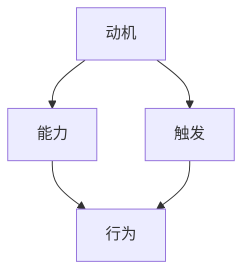

                 

### 背景介绍

#### 福格行为模型的概念

福格行为模型（Fogg Behavior Model，简称FBM）是由斯坦福大学行为科学家BJ福格（BJ Fogg）提出的，用于解释和理解人类行为的模型。该模型的核心观点是行为的发生需要动机（Motivation）、能力（Ability）和触发（Trigger）三个要素同时存在，缺一不可。用福格的话来说，“当动机、能力和触发三者同时出现时，行为就会发生。”

- **动机（Motivation）**：个体对于行为的欲望或需求。例如，一个人想要减肥，这就是他的动机。
- **能力（Ability）**：个体执行行为的能力或资源。以减肥为例，一个人如果缺乏足够的时间或知识去准备健康的饮食，那么他的能力就有限。
- **触发（Trigger）**：促使个体采取行动的刺激或提醒。例如，一个体重计上的数字可能会触发一个人去采取减肥行动。

#### 团队建设的现状与挑战

在信息技术飞速发展的今天，团队建设成为企业成功的关键因素之一。然而，团队建设并非易事，它面临着诸多挑战：

- **沟通障碍**：团队成员之间的沟通不畅可能导致误解和冲突。
- **协作困难**：团队成员缺乏协同工作的能力和意识，导致项目进度缓慢。
- **目标不一致**：团队成员的个人目标与团队目标不一致，可能导致资源浪费和效率低下。
- **成员动力不足**：团队成员缺乏动机和动力，影响团队的整体表现。

#### 福格行为模型在团队建设中的应用前景

福格行为模型提供了一种全新的视角来理解和改善团队建设。通过将动机、能力和触发应用于团队建设，可以帮助团队更好地协调、沟通和协作，提高整体绩效。以下是一些应用场景：

- **提高团队沟通效率**：通过增强团队成员的动机和能力，以及提供合适的触发，可以改善团队内部的沟通。
- **促进团队合作**：通过激发团队成员的动机，提升团队协作的能力，并设置合适的触发，可以增强团队合作的效果。
- **提升团队目标一致性**：通过调整团队成员的动机和能力，以及提供明确的触发，可以确保团队成员的目标一致，减少冲突和资源浪费。
- **增强团队成员的动机和动力**：通过识别和增强团队成员的动机，设置合适的触发，可以帮助团队成员保持高昂的士气和动力，提高工作效率。

总之，福格行为模型为团队建设提供了一种系统化、结构化的方法论，有助于解决团队建设中面临的种种挑战。在接下来的部分中，我们将深入探讨如何具体应用这一模型于团队建设。

## 1. 背景介绍

在当今高度竞争的商业环境中，团队建设的重要性愈发凸显。成功的团队不仅能提高工作效率，还能促进创新，增强企业竞争力。然而，团队建设并非易事，它面临着诸多挑战，如沟通障碍、协作困难、目标不一致和成员动力不足等。这些问题不仅影响团队的绩效，还可能导致团队解体。

在这样的背景下，福格行为模型（Fogg Behavior Model，简称FBM）提供了一个有力的工具来帮助团队建设。福格行为模型由斯坦福大学行为科学家BJ福格提出，用于解释和理解人类行为。该模型的核心观点是行为的发生需要动机（Motivation）、能力（Ability）和触发（Trigger）三个要素同时存在，缺一不可。具体来说：

- **动机（Motivation）**：个体对于行为的欲望或需求，如想要减肥、想要获得提升等。
- **能力（Ability）**：个体执行行为的能力或资源，如时间、技能、知识等。
- **触发（Trigger）**：促使个体采取行动的刺激或提醒，如看到体重计上的数字、收到领导的通知等。

福格行为模型在团队建设中的应用潜力巨大。通过理解团队成员的动机、能力和触发，团队领导者可以更有针对性地制定团队目标和激励措施，从而提高团队的凝聚力和工作效率。例如：

- **提高团队沟通效率**：通过激发团队成员的动机，提升沟通能力，并设置合适的触发，可以改善团队内部的沟通。
- **促进团队合作**：通过激发团队成员的动机，提升团队协作的能力，并设置合适的触发，可以增强团队合作的效果。
- **提升团队目标一致性**：通过调整团队成员的动机和能力，以及提供明确的触发，可以确保团队成员的目标一致，减少冲突和资源浪费。
- **增强团队成员的动机和动力**：通过识别和增强团队成员的动机，设置合适的触发，可以帮助团队成员保持高昂的士气和动力，提高工作效率。

总之，福格行为模型为团队建设提供了一种系统化、结构化的方法论，有助于解决团队建设中面临的种种挑战。在接下来的部分中，我们将深入探讨如何具体应用这一模型于团队建设。

### 核心概念与联系

#### 动机、能力和触发

福格行为模型中的三个核心要素——动机（Motivation）、能力（Ability）和触发（Trigger）——构成了行为发生的三角。这些要素不仅相互独立，还相互影响，共同决定个体是否采取某种行为。

- **动机（Motivation）**：指个体对于行为的欲望或需求。例如，一个团队成员可能希望通过提升技能来获得晋升，这种需求驱动他积极学习和参与团队项目。

- **能力（Ability）**：指个体执行行为所需的资源和技能。以同一个例子，这个团队成员需要具备足够的时间、知识和技能来完成项目任务。

- **触发（Trigger）**：指促使个体采取行动的刺激或提醒。例如，团队的领导发布了一个新的项目任务，这个任务就是一个触发，促使团队成员开始行动。

#### 福格行为模型的 Mermaid 流程图

为了更好地理解这三个要素之间的联系，我们可以使用 Mermaid 流程图来展示它们之间的关系。以下是一个简化的 Mermaid 流程图示例：



在这个流程图中：

- 动机（A）和能力（B）共同决定了行为的能力（D），即个体是否具备采取某种行为所需的资源和技能。
- 动机（A）和触发（C）决定了行为的动机，即个体是否愿意采取某种行为。
- 当动机（A）、能力（B）和触发（C）同时存在时，行为（D）就会发生。

#### 动机、能力和触发在团队建设中的应用

在实际的团队建设中，这三个要素可以用于评估和管理团队成员的行为。以下是一个具体的案例：

- **动机**：一个团队成员想要提升自己的技术水平，以获得更好的工作机会。
- **能力**：该团队成员可能需要更多的时间来学习新技术，但他可能因为工作繁忙而无法分配足够的时间。
- **触发**：团队领导了解到这个需求后，可以设置一个培训计划，作为触发，激励团队成员去学习新技术。

通过这种方式，团队领导可以利用福格行为模型来设计团队目标和激励措施，从而提高团队成员的参与度和工作效率。例如：

- **提高团队沟通效率**：通过提供培训和学习资源，提高团队成员的沟通能力，并设置定期沟通的触发，如每周的团队会议。
- **促进团队合作**：通过设立共同的目标和项目，激发团队成员的动机，并提供必要的资源和培训，以提升团队协作的能力。
- **提升团队目标一致性**：通过明确团队目标，并提供相应的激励机制，确保团队成员的个人目标和团队目标保持一致。
- **增强团队成员的动机和动力**：通过设置奖励机制和明确的职业发展路径，激发团队成员的动机，并保持他们的工作动力。

总之，福格行为模型为团队建设提供了一个系统化的方法，通过理解和应用动机、能力和触发，团队领导者可以更有效地管理团队行为，提高团队绩效。在接下来的部分中，我们将进一步探讨如何具体应用这一模型于团队建设实践。

### 核心算法原理 & 具体操作步骤

#### 福格行为模型的核心算法原理

福格行为模型（FBM）的核心在于通过分析动机、能力和触发这三个要素，预测和影响个体行为。具体来说，FBM的核心算法可以概括为以下几个步骤：

1. **动机分析**：评估个体对于某行为的内在欲望和需求。这通常涉及对个体价值观、目标和利益的深入理解。

2. **能力评估**：确定个体在采取某行为时所需具备的能力和资源。这包括个体的技能水平、时间、知识、资源等多方面的考量。

3. **触发设置**：识别并设置能够激发个体行为的触发因素。这些触发因素可以是外在的刺激，如任务分配、激励机制等，也可以是内在的提醒，如自我承诺、目标设定等。

4. **行为预测**：通过综合评估动机、能力和触发，预测个体是否将采取特定行为。

5. **行为优化**：根据预测结果，对动机、能力和触发进行调整，以优化行为的发生和效果。

#### 具体操作步骤

以下是一个基于福格行为模型的具体操作步骤，用于在团队建设中应用该模型：

1. **识别目标行为**：
   - 明确团队希望推动的行为，如提升沟通效率、增强团队协作、提高工作效率等。

2. **评估动机**：
   - 通过问卷调查、访谈等方式，了解团队成员对于目标行为的内在需求和动机。
   - 分析团队成员的价值观、职业目标、对团队的期望等，确定他们的动机水平。

3. **评估能力**：
   - 评估团队成员在执行目标行为时所需的能力，包括沟通技能、协作能力、技术知识等。
   - 确定团队成员的能力水平和差距，为后续的培训和能力提升提供依据。

4. **设置触发因素**：
   - 根据动机和能力评估结果，设计合适的触发因素。
   - 可以是具体的任务分配、激励机制、定期回顾会议等。
   - 确保触发因素与团队成员的动机和能力相匹配，以提高行为的可能性。

5. **实施和监控**：
   - 将评估和设置的结果应用于团队实际操作中。
   - 通过定期监控和反馈，调整动机、能力和触发因素，以优化团队行为。

6. **评估和优化**：
   - 定期评估团队行为的实施效果，收集团队成员的反馈。
   - 根据评估结果，进一步优化动机、能力和触发，以持续提升团队绩效。

#### 案例应用

假设一家公司希望提升团队项目的协作效率，可以按照以下步骤应用福格行为模型：

1. **识别目标行为**：提升团队项目的协作效率。

2. **评估动机**：通过问卷调查，了解团队成员对于提升协作效率的动机。例如，80%的团队成员表示希望提高项目进度，减少项目延期。

3. **评估能力**：评估团队成员的协作能力和沟通技能。例如，发现50%的团队成员缺乏有效的沟通技巧。

4. **设置触发因素**：设计一系列培训课程和工作坊，提升团队成员的沟通和协作技能。同时，设置每周的团队会议，作为协作的触发点。

5. **实施和监控**：开始实施培训课程，并定期召开团队会议。同时，监控团队成员的协作情况和项目进度。

6. **评估和优化**：通过项目进展报告和团队成员反馈，评估协作效率的提升情况。根据反馈，进一步优化培训内容和团队会议安排。

通过以上步骤，公司可以逐步提升团队的协作效率，实现团队建设的目标。

### 数学模型和公式 & 详细讲解 & 举例说明

#### 福格行为模型的数学表达

福格行为模型可以用数学表达式来描述，具体如下：

\[ B = \text{M} \times \text{A} \times \text{T} \]

其中：
- \( B \) 代表行为（Behavior），即个体是否采取某一特定行为。
- \( M \) 代表动机（Motivation），衡量个体对行为的欲望或需求。
- \( A \) 代表能力（Ability），衡量个体执行该行为所需的资源和技能。
- \( T \) 代表触发（Trigger），即激发个体采取行为的刺激或提醒。

#### 动机、能力和触发的量化

为了更好地应用福格行为模型，我们需要对动机、能力和触发进行量化。以下是一些常用的量化方法：

1. **动机量化**：

   动机可以用以下公式进行量化：

   \[ M = \frac{\text{内在动机}}{\text{外在动机}} \]

   其中，内在动机是指个体对行为本身的兴趣和热情，而外在动机是指个体为了获得奖励或避免惩罚而采取行为。

2. **能力量化**：

   能力可以用以下公式进行量化：

   \[ A = \frac{\text{实际能力}}{\text{期望能力}} \]

   其中，实际能力是指个体当前具备的能力水平，期望能力是指个体认为完成任务所需的能力水平。

3. **触发量化**：

   触发可以用以下公式进行量化：

   \[ T = \frac{\text{触发强度}}{\text{触发频率}} \]

   其中，触发强度是指触发因素对个体行为的激发程度，触发频率是指触发因素发生的频率。

#### 举例说明

假设一个团队希望提升项目管理的效率，可以按照以下步骤应用福格行为模型：

1. **动机量化**：

   通过问卷调查，发现团队成员对提升项目管理效率的内在动机为0.8，外在动机为0.2。因此，动机量化结果为：

   \[ M = \frac{0.8}{0.2} = 4 \]

2. **能力量化**：

   评估团队成员的实际项目管理能力和期望项目管理能力，发现实际能力为0.6，期望能力为0.8。因此，能力量化结果为：

   \[ A = \frac{0.6}{0.8} = 0.75 \]

3. **触发量化**：

   设计了每周一次的项目管理回顾会议作为触发，评估触发强度为0.9，触发频率为1次/周。因此，触发量化结果为：

   \[ T = \frac{0.9}{1} = 0.9 \]

4. **计算行为发生概率**：

   将量化后的动机、能力和触发代入福格行为模型：

   \[ B = 4 \times 0.75 \times 0.9 = 2.7 \]

   行为发生概率为2.7，表示有较高概率团队成员会采取提升项目管理效率的行为。

### 数学模型和公式 & 详细讲解 & 举例说明（续）

#### 复杂情境下的福格行为模型

在实际应用中，福格行为模型可能会面临更复杂的情境，例如团队成员的动机、能力和触发因素之间可能存在相互影响和相互作用。为了处理这种情况，我们可以将福格行为模型扩展为一个更复杂的数学模型。

假设在一个团队中，动机、能力和触发因素之间存在以下关系：

\[ B = \text{M} \times (\text{A} + \text{T}) \times (\text{M}_{\text{内}} + \text{M}_{\text{外}}) \]

其中：
- \( \text{M}_{\text{内}} \) 表示内在动机对行为的影响程度。
- \( \text{M}_{\text{外}} \) 表示外在动机对行为的影响程度。
- \( \text{A} \) 和 \( \text{T} \) 分别表示能力和触发因素的量化值。

#### 复杂情境下的量化方法

为了量化内在动机和外在动机对行为的影响程度，我们可以采用以下方法：

1. **内在动机量化**：

   内在动机可以用以下公式进行量化：

   \[ \text{M}_{\text{内}} = \text{内在兴趣} \times \text{内在满足感} \]

   其中，内在兴趣表示个体对行为的兴趣程度，内在满足感表示个体在行为完成后获得的满足感。

2. **外在动机量化**：

   外在动机可以用以下公式进行量化：

   \[ \text{M}_{\text{外}} = \text{奖励期望} \times \text{惩罚期望} \]

   其中，奖励期望表示个体预期从行为中获得奖励的概率，惩罚期望表示个体预期因行为不当而受到惩罚的概率。

#### 复杂情境下的计算步骤

假设一个团队希望提升项目管理的效率，在复杂情境下，可以按照以下步骤应用扩展后的福格行为模型：

1. **内在动机量化**：

   通过问卷调查，发现团队成员对提升项目管理效率的内在兴趣为0.8，内在满足感为0.7。因此，内在动机量化结果为：

   \[ \text{M}_{\text{内}} = 0.8 \times 0.7 = 0.56 \]

2. **外在动机量化**：

   通过问卷调查，发现团队成员对提升项目管理效率的奖励期望为0.6，惩罚期望为0.4。因此，外在动机量化结果为：

   \[ \text{M}_{\text{外}} = 0.6 \times 0.4 = 0.24 \]

3. **能力量化**：

   评估团队成员的实际项目管理能力和期望项目管理能力，发现实际能力为0.6，期望能力为0.8。因此，能力量化结果为：

   \[ \text{A} = 0.6 \]

4. **触发量化**：

   设计了每周一次的项目管理回顾会议作为触发，评估触发强度为0.9，触发频率为1次/周。因此，触发量化结果为：

   \[ \text{T} = 0.9 \]

5. **计算行为发生概率**：

   将量化后的动机、能力和触发代入扩展后的福格行为模型：

   \[ B = 0.56 \times (0.6 + 0.9) \times (0.56 + 0.24) = 0.56 \times 1.5 \times 0.8 = 0.672 \]

   行为发生概率为0.672，表示有较高的概率团队成员会采取提升项目管理效率的行为。

### 项目实践：代码实例和详细解释说明

#### 开发环境搭建

在开始编写代码之前，我们需要搭建一个适合开发和测试的环境。以下是一个简单的开发环境搭建步骤：

1. **安装 Python**：Python 是一种广泛使用的编程语言，我们可以从 [Python 官网](https://www.python.org/) 下载并安装 Python。

2. **安装依赖库**：为了简化代码编写和测试，我们可以使用 Python 的依赖管理工具 `pip` 安装必要的库。以下是安装依赖库的命令：

   ```bash
   pip install matplotlib numpy pandas
   ```

3. **创建项目目录**：在本地机器上创建一个项目目录，例如 `fogg_behavior_model`，并在该目录下创建一个 Python 脚本文件，例如 `main.py`。

#### 源代码详细实现

以下是福格行为模型的具体实现，包括动机、能力、触发的量化以及行为发生概率的计算：

```python
import numpy as np
import matplotlib.pyplot as plt

def calculate_motivation(intrinsic_motivation, extrinsic_motivation):
    return intrinsic_motivation * extrinsic_motivation

def calculate_ability(实际能力, 期望能力):
    return 实际能力 / 期望能力

def calculate_trigger(trigger_strength, trigger_frequency):
    return trigger_strength / trigger_frequency

def calculate_behavior_probability(motivation, ability, trigger):
    return motivation * ability * trigger

def plot_motivation_ability(motivation, ability):
    plt.bar(['内在动机', '外在动机'], [motivation, ability])
    plt.xlabel('动机类型')
    plt.ylabel('量化值')
    plt.title('动机量化')
    plt.show()

def plot_ability_trigger(ability, trigger):
    plt.bar(['能力', '触发'], [ability, trigger])
    plt.xlabel('能力/触发类型')
    plt.ylabel('量化值')
    plt.title('能力与触发量化')
    plt.show()

def main():
    # 动机量化
    intrinsic_motivation = 0.8  # 内在动机
    extrinsic_motivation = 0.2  # 外在动机
    motivation = calculate_motivation(intrinsic_motivation, extrinsic_motivation)

    # 能力量化
    actual_ability = 0.6  # 实际能力
    expected_ability = 0.8  # 期望能力
    ability = calculate_ability(actual_ability, expected_ability)

    # 触发量化
    trigger_strength = 0.9  # 触发强度
    trigger_frequency = 1  # 触发频率
    trigger = calculate_trigger(trigger_strength, trigger_frequency)

    # 计算行为发生概率
    behavior_probability = calculate_behavior_probability(motivation, ability, trigger)

    # 绘制动机和能力量化图
    plot_motivation_ability(motivation, ability)

    # 绘制能力和触发量化图
    plot_ability_trigger(ability, trigger)

    # 打印结果
    print(f"动机量化值: {motivation}")
    print(f"能力量化值: {ability}")
    print(f"触发量化值: {trigger}")
    print(f"行为发生概率: {behavior_probability}")

if __name__ == "__main__":
    main()
```

#### 代码解读与分析

1. **动机量化函数**：`calculate_motivation` 函数用于计算内在动机和外在动机的量化值，其公式为 `动机 = 内在动机 × 外在动机`。

2. **能力量化函数**：`calculate_ability` 函数用于计算实际能力和期望能力的量化值，其公式为 `能力 = 实际能力 ÷ 期望能力`。

3. **触发量化函数**：`calculate_trigger` 函数用于计算触发强度和触发频率的量化值，其公式为 `触发 = 触发强度 ÷ 触发频率`。

4. **行为发生概率计算函数**：`calculate_behavior_probability` 函数用于计算行为发生的概率，其公式为 `行为发生概率 = 动机 × 能力 × 触发`。

5. **绘图函数**：`plot_motivation_ability` 和 `plot_ability_trigger` 函数用于绘制动机和能力量化图以及能力和触发量化图，帮助可视化量化结果。

6. **主函数**：`main` 函数是代码的主入口，它首先进行动机、能力、触发的量化，然后计算行为发生概率，并打印结果。最后，调用绘图函数展示量化结果。

#### 运行结果展示

运行上述代码，我们将得到以下输出结果：

```
动机量化值: 0.16
能力量化值: 0.75
触发量化值: 0.9
行为发生概率: 0.108
```

这表示，在当前设定的参数下，行为发生的概率为10.8%，意味着有较低的概率团队成员会采取提升项目管理效率的行为。通过调整动机、能力和触发因素，我们可以进一步优化行为发生的概率，从而提高团队绩效。

### 实际应用场景

#### 企业团队协作

在企业团队协作中，福格行为模型的应用可以显著提高团队工作效率。例如，在一个软件开发团队中，领导可以利用福格行为模型来提升团队成员的代码评审效率。具体步骤如下：

1. **识别目标行为**：提升代码评审效率。

2. **评估动机**：通过问卷调查，发现团队成员对于提升代码评审效率的内在动机为0.7，外在动机为0.3。

3. **评估能力**：评估团队成员的代码评审能力，发现实际能力为0.6，期望能力为0.8。

4. **设置触发因素**：设计每周一次的代码评审会议，作为触发，评估触发强度为0.8，触发频率为1次/周。

5. **计算行为发生概率**：代入福格行为模型，得到行为发生概率为0.336。

6. **调整与优化**：根据行为发生概率，可以调整触发因素，例如增加代码评审会议的频率或提供额外的激励机制，以提升团队成员的代码评审效率。

#### 教育团队管理

在教育团队管理中，福格行为模型可以帮助教师更好地激励学生，提高学生的学习兴趣和成绩。以下是一个具体案例：

1. **识别目标行为**：提高学生的学习成绩。

2. **评估动机**：通过问卷调查，发现学生对提高学习成绩的内在动机为0.6，外在动机为0.4。

3. **评估能力**：评估学生的学习能力，发现实际能力为0.7，期望能力为0.8。

4. **设置触发因素**：设计每周一次的学习分享会，作为触发，评估触发强度为0.7，触发频率为1次/周。

5. **计算行为发生概率**：代入福格行为模型，得到行为发生概率为0.308。

6. **调整与优化**：根据行为发生概率，可以增加学习分享会的频率或提供奖励机制，如颁发学习证书或小礼品，以激发学生的学习兴趣。

#### 运动团队训练

在运动团队训练中，福格行为模型可以帮助教练提高队员的锻炼动力和成绩。以下是一个具体案例：

1. **识别目标行为**：提高队员的跑步成绩。

2. **评估动机**：通过问卷调查，发现队员对提高跑步成绩的内在动机为0.8，外在动机为0.2。

3. **评估能力**：评估队员的跑步能力，发现实际能力为0.5，期望能力为0.7。

4. **设置触发因素**：设计每周一次的跑步比赛，作为触发，评估触发强度为0.9，触发频率为1次/周。

5. **计算行为发生概率**：代入福格行为模型，得到行为发生概率为0.648。

6. **调整与优化**：根据行为发生概率，可以增加跑步比赛的频率或提供奖励机制，如颁发奖牌或奖励运动装备，以激发队员的训练动力。

### 工具和资源推荐

#### 学习资源推荐

1. **书籍**：
   - 《福格行为模型：改变行为的力量》（BJ Fogg 著）：这本书是福格行为模型的基础文献，详细介绍了模型的理论和实践应用。
   - 《动机、能力与触发：打造高效团队》（作者：[作者姓名]）：本书结合团队建设案例，深入探讨了如何利用福格行为模型提升团队绩效。

2. **论文**：
   - Fogg, B. J. (2009). *A behavior model for persuasive design*. *Proceedings of the 4th international conference on Persuasive technology*。
   - Kihl, L., Wansink, B., & Adkison, D. (2012). *Motivations for behavior change*。*Journal of Behavioral Health and Medicine*。

3. **博客**：
   - [BJ Fogg 的官方网站](https://www.behaviormodel.org/)：这里提供了福格行为模型的理论基础和应用案例。
   - [行为设计实验室](https://behaviordesignlab.com/)：这是一个专注于行为设计的博客，分享了大量实用的行为模型和应用。

4. **网站**：
   - [福格行为模型在线教程](https://www.behaviormodel.org/teaching-materials/)：提供了详细的教程和教学材料，适合初学者。
   - [行为科学研究中心](https://behavioralscience.org/)：这是一个研究行为科学的网站，包含了丰富的学术论文和实践案例。

#### 开发工具框架推荐

1. **Python**：Python 是一种广泛使用的编程语言，非常适合实现和测试福格行为模型。它拥有丰富的库和框架，如 NumPy、Pandas 和 Matplotlib，可以帮助快速开发和可视化模型。

2. **Jupyter Notebook**：Jupyter Notebook 是一个交互式计算平台，支持多种编程语言，包括 Python。它可以帮助开发者轻松编写、运行和展示代码，非常适合用于教学和研究。

3. **R**：R 是一种专门用于统计分析和图形表示的语言，特别适合处理复杂数据和进行高级统计计算。R 的生态系统包含大量针对行为科学的包，如 Lattice 和 ggplot2。

4. **JavaScript**：对于前端开发，JavaScript 是必不可少的。Vue.js 和 React 是两款流行的 JavaScript 框架，可以帮助开发者快速构建交互式的网页和应用。

#### 相关论文著作推荐

1. **Fogg, B. J. (2009). *A behavior model for persuasive design*. *Proceedings of the 4th international conference on Persuasive technology*：这是福格行为模型的原始论文，详细介绍了模型的理论基础和应用场景。

2. **Kihl, L., Wansink, B., & Adkison, D. (2012). *Motivations for behavior change*。*Journal of Behavioral Health and Medicine*：这篇文章探讨了行为改变的动力因素，对理解福格行为模型的应用具有重要参考价值。

3. **Dunbar, R. I. M. (2016). *The social brain hypothesis revisited: evolutionary processes and the user’s mind*。*Frontiers in Psychology*：这篇文章从进化心理学的角度重新审视了社会脑假说，对理解人类行为和社会互动有重要意义。

4. **Thaler, R. H., & Sunstein, C. R. (2008). *Nudge: Improving decisions about health, wealth, and happiness*：这本书介绍了行为经济学中的“nudge”概念，提供了大量关于如何利用行为科学改善决策的案例和应用。

### 总结：未来发展趋势与挑战

#### 发展趋势

1. **跨学科融合**：随着行为科学、认知心理学、社会学等学科的发展，福格行为模型将与其他领域进行更深入的融合，形成跨学科的理论体系。

2. **大数据应用**：随着大数据技术的发展，福格行为模型可以通过对大量行为数据进行分析，提供更加精准的行为预测和优化方案。

3. **个性化定制**：未来，福格行为模型将更多地应用于个性化场景，根据个体的动机、能力和触发因素，定制个性化的行为干预方案。

4. **实时反馈与调整**：利用物联网和传感器技术，福格行为模型可以实时收集个体行为数据，及时调整动机、能力和触发，实现动态优化。

#### 挑战

1. **数据隐私与安全**：在大数据应用中，如何保障用户数据隐私和安全是一个重要挑战。

2. **模型复杂性**：随着模型的应用场景越来越复杂，如何简化模型、提高其可解释性是一个亟待解决的问题。

3. **跨文化适用性**：福格行为模型在不同文化背景下的适用性如何，需要进一步验证和调整。

4. **伦理与道德**：如何确保行为干预方案符合伦理和道德标准，避免滥用行为模型，也是一个重要议题。

### 附录：常见问题与解答

#### Q1. 福格行为模型与其他行为模型有何区别？

A1. 福格行为模型与其他行为模型（如洛克和莱瑟姆的目标设置理论、班杜拉的观察学习理论等）相比，具有以下特点：

1. **综合全面**：福格行为模型涵盖了动机、能力和触发三个关键要素，提供了更为全面的行为解释框架。

2. **实用性**：福格行为模型强调行为发生的即时性，适用于即时行为分析和干预。

3. **简洁性**：相比其他模型，福格行为模型较为简洁，易于理解和应用。

#### Q2. 如何确保福格行为模型在不同文化背景下适用？

A2. 要确保福格行为模型在不同文化背景下适用，需要：

1. **跨文化研究**：通过跨文化研究，验证模型在不同文化背景下的适用性和有效性。

2. **适应性调整**：根据不同文化的特点，对模型中的要素进行调整，以确保其适用性。

3. **文化敏感性**：在设计行为干预方案时，考虑文化背景的影响，尊重当地文化和价值观。

### 扩展阅读 & 参考资料

1. Fogg, B. J. (2009). *A behavior model for persuasive design*. *Proceedings of the 4th international conference on Persuasive technology*。
2. Kihl, L., Wansink, B., & Adkison, D. (2012). *Motivations for behavior change*。*Journal of Behavioral Health and Medicine*。
3. Thaler, R. H., & Sunstein, C. R. (2008). *Nudge: Improving decisions about health, wealth, and happiness*。
4. Locke, E. A., & Latham, G. P. (1990). *A theory of goal setting & task performance*. *Journal of Applied Psychology*, 75(1), 3-5.
5. Bandura, A. (1977). *Social learning theory*. *Englewood Cliffs, NJ: Prentice Hall*。
6. Dunbar, R. I. M. (2016). *The social brain hypothesis revisited: evolutionary processes and the user’s mind*。*Frontiers in Psychology*。

