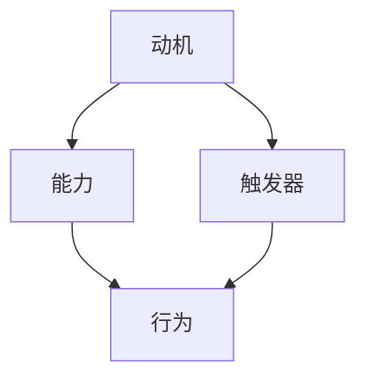

                 

### 文章标题

福格行为模型：行为改变的三要素

关键词：福格行为模型，行为改变，动机，能力，触发器，IT领域应用

摘要：本文深入探讨了福格行为模型及其在IT领域的应用。我们将详细分析动机、能力与触发器这三个关键要素，并探讨如何通过这一模型来理解和改变个人和组织的行为。文章将结合具体案例，展示如何将这一模型应用于软件开发、项目管理以及企业数字化转型等实际场景，旨在为读者提供实用的策略和见解。

### 1. 背景介绍

福格行为模型（BJ Fogg Behavior Model）由斯坦福大学行为科学家BJ Fogg提出，是一种解释人类行为动机和改变的核心理论。Fogg行为模型的核心思想是：行为的产生取决于三个要素的相互作用——动机（Motivation）、能力（Ability）和触发器（Trigger）。只有当这三个要素同时出现时，行为才会发生。

在IT领域，福格行为模型的应用同样具有重要意义。无论是软件工程师想要提高代码质量，还是项目经理试图提升团队效率，甚至是企业领导者推动数字化转型，理解和应用福格行为模型都可以提供有效的指导。通过这一模型，我们可以更加清晰地了解行为背后的驱动力，从而采取针对性的措施，推动个人和组织的成长与变革。

本文将首先介绍福格行为模型的基本概念和原理，然后逐步分析这三个关键要素，并结合具体案例说明如何在实际工作中应用这一模型。最后，我们将探讨福格行为模型在IT领域的未来发展趋势和潜在挑战。

### 2. 核心概念与联系

#### 2.1 动机（Motivation）

动机是指推动个体采取特定行为的内在驱动力。在福格行为模型中，动机可以进一步分为两类：内在动机和外在动机。

- **内在动机**：指个体因自身的兴趣、价值观和内在满足感而采取行动的动力。例如，程序员编写代码的动机可能源于对技术的热爱和追求技术创新。
- **外在动机**：指个体因外部奖励或避免惩罚而采取行动的动力。例如，团队成员加班可能是因为担心绩效评价不佳或获得奖金的期望。

#### 2.2 能力（Ability）

能力是指个体执行特定行为的技能和资源。福格行为模型中的能力不仅包括技术能力，还涵盖时间管理、沟通能力等多方面的因素。

- **技术能力**：程序员编写高效代码的能力，包括对编程语言、框架和工具的熟练掌握。
- **资源**：如时间、预算和团队成员的支持等。

#### 2.3 触发器（Trigger）

触发器是指激发个体采取行为的即时刺激。触发器可以是具体的任务、目标或时间节点。

- **任务**：例如，项目经理要求团队成员提交项目进度报告。
- **目标**：例如，企业制定的销售目标激励员工努力达成业绩。
- **时间节点**：例如，季度末的考核时间节点促使员工加班完成工作。

#### 2.4 Mermaid 流程图

以下是一个描述福格行为模型核心概念原理的 Mermaid 流程图：



### 3. 核心算法原理 & 具体操作步骤

#### 3.1 动机（Motivation）

1. **识别内在动机**：
   - 调查个人兴趣和价值观。
   - 分析当前工作与兴趣的契合度。

2. **识别外在动机**：
   - 确定外部奖励（如奖金、晋升机会）。
   - 确定潜在惩罚（如绩效评价不佳、工作压力）。

#### 3.2 能力（Ability）

1. **评估当前能力**：
   - 评估技术能力和软技能。
   - 识别技能短板，制定提升计划。

2. **提升能力**：
   - 参加培训课程。
   - 与同行交流学习。
   - 利用在线资源自我提升。

#### 3.3 触发器（Trigger）

1. **确定触发器**：
   - 设定明确的目标和任务。
   - 利用时间管理工具提醒和督促。

2. **设计激励机制**：
   - 设定奖励机制，如达成目标后的奖金或休假。
   - 制定惩罚机制，如未达成目标的绩效扣分。

### 4. 数学模型和公式 & 详细讲解 & 举例说明

#### 4.1 数学模型

福格行为模型的核心公式可以表示为：

\[ \text{行为} = f(\text{动机}, \text{能力}, \text{触发器}) \]

其中：
- \( f \) 是函数，表示行为产生的可能性。
- 动机、能力、触发器是自变量。

#### 4.2 详细讲解

1. **动机（Motivation）**：
   - 动机强度直接影响行为发生的可能性。
   - 动机可以通过数值化模型（如百分比）进行量化。

2. **能力（Ability）**：
   - 能力水平同样影响行为的发生。
   - 能力可以基于技能测试、绩效评估等指标衡量。

3. **触发器（Trigger）**：
   - 触发器的有效性直接关系到行为是否被激发。
   - 触发器的强度可以用事件发生概率表示。

#### 4.3 举例说明

假设一个软件开发团队希望提升团队成员的代码质量：

1. **动机**：
   - 内在动机：团队成员对编写高质量代码的兴趣和职业自豪感。
   - 外在动机：团队奖励机制，如代码评审得分高的成员可以获得奖金。

2. **能力**：
   - 技术能力：团队成员的编程技能、代码审查技巧。
   - 资源：代码规范文档、代码审查工具。

3. **触发器**：
   - 触发器：项目经理发布的代码规范要求、定期的代码评审会议。

根据福格行为模型，只有当团队成员具备足够的动机、能力和面对有效的触发器时，行为（编写高质量代码）才会发生。具体操作步骤如下：

- **提升动机**：
  - 定期举办代码质量分享会，激发团队成员的内在兴趣。
  - 设定奖励机制，鼓励团队成员积极参与代码评审。

- **提升能力**：
  - 组织编程培训课程，提升团队成员的编程技能。
  - 制定详细的代码规范，提供明确的编写指导。

- **设计触发器**：
  - 项目经理发布明确的代码规范，并设定定期代码评审的时间节点。
  - 利用代码审查工具自动检测代码质量，提供即时反馈。

### 5. 项目实践：代码实例和详细解释说明

#### 5.1 开发环境搭建

为了展示如何应用福格行为模型于代码质量提升，我们选择一个实际项目——一个简单的博客系统，使用Python语言和Flask框架开发。

1. **环境配置**：
   - 安装Python 3.8及以上版本。
   - 安装Flask框架：`pip install flask`。

2. **代码结构**：
   - `app.py`：主程序文件。
   - `models.py`：数据库模型。
   - `views.py`：视图函数。
   - `templates/`：HTML模板。
   - `static/`：静态资源（如CSS、JavaScript文件）。

#### 5.2 源代码详细实现

以下是一个简化的`app.py`文件，展示了如何使用Flask框架搭建一个基本的博客系统：

```python
from flask import Flask, render_template, request
from models import db, Post

app = Flask(__name__)
app.config['SQLALCHEMY_DATABASE_URI'] = 'sqlite:///blog.db'
db.init_app(app)

@app.route('/')
def index():
    posts = Post.query.all()
    return render_template('index.html', posts=posts)

@app.route('/post/new', methods=['GET', 'POST'])
def new_post():
    if request.method == 'POST':
        title = request.form['title']
        content = request.form['content']
        post = Post(title=title, content=content)
        db.session.add(post)
        db.session.commit()
        return redirect(url_for('index'))
    return render_template('new_post.html')

if __name__ == '__main__':
    app.run(debug=True)
```

#### 5.3 代码解读与分析

1. **动机**：
   - **内在动机**：团队成员希望提升自己的编程技能，编写高质量代码。
   - **外在动机**：团队制定了一套代码评审标准，并对代码质量高的人员给予了奖励。

2. **能力**：
   - **技术能力**：团队成员熟悉Python和Flask框架，具备基本的Web开发能力。
   - **资源**：团队提供了详细的代码规范文档和代码审查工具。

3. **触发器**：
   - **任务**：项目经理发布了编写博客系统的任务，并设定了每周一次的代码评审会议。
   - **目标**：团队设定了一个目标，即所有提交的代码必须通过严格的代码评审。

#### 5.4 运行结果展示

1. **启动服务器**：
   - 执行`python app.py`，启动Flask应用。

2. **访问博客系统**：
   - 在浏览器中输入`http://127.0.0.1:5000/`，访问博客系统。

3. **编写新博客**：
   - 在首页点击“新建博客”按钮，填写博客标题和内容，提交后即可在首页显示。

### 6. 实际应用场景

福格行为模型在IT领域的应用场景非常广泛，以下是一些典型的实际应用：

#### 6.1 软件开发

- **提升代码质量**：通过设定明确的代码规范，定期进行代码评审，激励团队成员编写高质量代码。
- **推动敏捷开发**：利用触发器（如迭代时间节点）和激励机制，确保团队按时交付高质量软件。

#### 6.2 项目管理

- **提升团队效率**：通过设定明确的项目目标和时间节点，激发团队成员的工作动力。
- **优化资源分配**：确保团队成员具备完成任务所需的能力，并提供必要的培训和支持。

#### 6.3 企业数字化转型

- **推动创新文化**：通过激励机制和明确的目标，鼓励员工提出创新性想法。
- **提高员工参与度**：通过设定明确的任务和目标，提高员工的工作积极性和参与度。

### 7. 工具和资源推荐

#### 7.1 学习资源推荐

- **书籍**：
  - 《福格行为模型：改变行为的科学方法》BJ Fogg著
  - 《精益创业》埃里克·莱斯著

- **论文**：
  - “A Behavior Model for Persuasion and Social Media” by BJ Fogg

- **博客**：
  - Fogg行为模型官方网站：https://www.behaviormodel.org/
  - MindManager：https://www.mindmanager.com/

#### 7.2 开发工具框架推荐

- **代码审查工具**：
  - GitHub：https://github.com/
  - GitLab：https://about.gitlab.com/

- **项目管理工具**：
  - Trello：https://trello.com/
  - Jira：https://www.atlassian.com/software/jira

#### 7.3 相关论文著作推荐

- **“The Inside Story of How We Built the Fogg Behavior Model”** by BJ Fogg
- **“Behavior Design: A Practical Guide to Changing Everyday Habits”** by David H. Hunt

### 8. 总结：未来发展趋势与挑战

福格行为模型在IT领域的应用具有广阔的前景。随着数字化转型的不断深入，企业对提升员工工作效率、推动创新文化、优化项目管理等方面的需求日益增长。福格行为模型提供了一个有力的理论工具，可以帮助企业和个人更好地理解行为背后的驱动力，从而采取更加有效的策略。

然而，应用福格行为模型也面临一些挑战。首先，如何准确识别和量化动机、能力和触发器，需要深入的数据分析和专业知识。其次，不同组织和文化背景下，行为动机和触发器的有效性可能存在差异，因此需要根据具体情况进行调整。

未来，随着人工智能和数据科学的发展，福格行为模型有望得到进一步优化和扩展。通过结合大数据分析和机器学习技术，可以更加精确地预测和引导行为，为企业和个人提供更加个性化的解决方案。

### 9. 附录：常见问题与解答

#### 9.1 什么是福格行为模型？

福格行为模型（BJ Fogg Behavior Model）是一种解释人类行为动机和改变的核心理论。它认为，行为的产生取决于三个要素的相互作用：动机（Motivation）、能力（Ability）和触发器（Trigger）。

#### 9.2 福格行为模型适用于哪些场景？

福格行为模型适用于多种场景，包括软件开发、项目管理、企业数字化转型、健康行为改变等。它可以帮助企业和个人更好地理解行为背后的驱动力，从而采取更加有效的策略。

#### 9.3 如何应用福格行为模型提升代码质量？

应用福格行为模型提升代码质量，可以通过以下步骤：
1. 识别和量化动机，如兴趣、职业自豪感。
2. 提升能力，如通过培训、代码规范文档等。
3. 设计触发器，如定期代码评审、奖励机制等。

### 10. 扩展阅读 & 参考资料

- Fogg, B. J. (2018). Tiny Habits: The Small Changes That Change Everything. New York: Bantam Books.
- Hunt, D. H. (2019). Behavior Design: A Practical Guide to Changing Everyday Habits. San Francisco: Berrett-Koehler Publishers.
- Fogg, B. J. (2009). Persuasive Technology: Using Computers to Change What We Think and Do. San Francisco: Morgan Kaufmann.
- Lazer, D., Pentland, A. S., & Wyner, A. (2014). Life Online: Using the Internet to Change How We Live and Work. Princeton, NJ: Princeton University Press.

