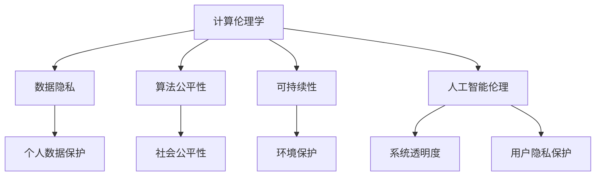

                 

### 1. 背景介绍

**引言**：

在信息时代的浪潮中，科技的发展速度之快令人瞠目结舌。人工智能、大数据、区块链等前沿技术正以前所未有的力量改变着我们的生活。然而，随着技术的进步，我们也面临着一系列严峻的伦理问题。如何在推动科技发展的同时，确保其对社会和人类的影响是积极和可持续的，成为了当今科技界和伦理学界共同关注的焦点。

**文章主题**：

本文旨在探讨科技与伦理之间的平衡点，重点分析人类计算（计算伦理学）领域中的关键问题。文章将从背景介绍出发，逐步深入探讨核心概念、算法原理、数学模型、实际应用场景，并总结未来发展趋势与挑战。通过这样的逐步分析推理思考的方式，希望能够为读者提供一个全面、深入的理解，并引发对这一领域的更深刻思考。

**文章结构**：

本文分为以下几个部分：

1. 背景介绍
2. 核心概念与联系
3. 核心算法原理 & 具体操作步骤
4. 数学模型和公式 & 详细讲解 & 举例说明
5. 项目实践：代码实例和详细解释说明
6. 实际应用场景
7. 工具和资源推荐
8. 总结：未来发展趋势与挑战
9. 附录：常见问题与解答
10. 扩展阅读 & 参考资料

**结语**：

本文通过对科技与伦理的深入探讨，旨在提醒我们在追求技术进步的同时，不应忽视伦理问题的重要性。只有在科技与伦理之间找到平衡点，我们才能实现真正的可持续发展，为人类创造一个更美好的未来。

---

### 2. 核心概念与联系

在探讨科技与伦理的平衡点时，我们需要明确几个核心概念，它们是理解这一领域的关键。

**计算伦理学**：

计算伦理学是研究计算技术对社会、人类和环境的伦理影响的学科。它关注如何确保计算技术在开发、应用和推广过程中遵循道德原则和规范，从而避免潜在的负面后果。

**数据隐私**：

随着大数据和人工智能的发展，数据隐私问题日益凸显。数据隐私涉及个人信息的收集、存储、处理和共享过程中的伦理问题，特别是在未经授权的情况下，个人数据被滥用或泄露的风险。

**算法公平性**：

算法公平性是指算法在决策过程中对各种人口统计特征的公平对待。不公平的算法可能导致歧视和偏见，进而加剧社会不平等。

**可持续性**：

可持续性是指在满足当前需求的同时，不损害未来世代满足其需求的能力。在科技领域，可持续性关注如何设计和管理技术，以确保其对环境和人类社会的长期影响是积极的。

**人工智能伦理**：

人工智能伦理是计算伦理学的一个分支，研究人工智能系统的道德责任和伦理规范。它涉及如何确保人工智能系统的透明度、可解释性和安全性。

**关联图**：

为了更好地理解这些概念之间的联系，我们可以使用Mermaid流程图来表示它们之间的关系。



**结语**：

通过这些核心概念的介绍，我们可以初步理解科技与伦理之间的复杂关系。在接下来的章节中，我们将进一步深入探讨这些概念，并分析它们在具体应用场景中的实践和挑战。

---

### 3. 核心算法原理 & 具体操作步骤

在讨论科技与伦理的平衡点时，核心算法的原理和操作步骤扮演着至关重要的角色。以下是几个关键的算法概念及其在伦理决策中的应用。

**1. 决策树算法**：

决策树是一种常用的分类算法，通过一系列的判断节点来预测结果。在伦理决策中，决策树可以帮助我们基于一系列伦理原则和约束条件进行决策。

**操作步骤**：

a. 收集伦理决策相关的数据，包括各种伦理准则和实际案例。

b. 构建决策树模型，定义各个判断节点和结果节点。

c. 使用训练数据对模型进行训练，使其能够根据输入条件进行伦理决策。

d. 对决策树进行评估，确保其符合伦理规范，并调整模型以优化决策效果。

**案例**：

例如，在医疗领域，决策树可以用于决定是否进行高风险手术。通过考虑患者的年龄、健康状况、手术风险等因素，决策树能够提供基于伦理准则的推荐。

**2. 随机森林算法**：

随机森林是一种基于决策树的集成学习方法，通过构建多棵决策树并进行投票来提高预测准确性。在伦理决策中，随机森林可以帮助我们处理复杂的多因素伦理问题。

**操作步骤**：

a. 收集多因素伦理决策相关的数据，包括道德原则、社会价值观和实际案例。

b. 构建随机森林模型，定义树的数量和每个树的参数。

c. 使用训练数据对模型进行训练，使其能够处理多因素伦理问题。

d. 对随机森林模型进行评估，确保其决策结果符合伦理规范，并调整模型参数以提高决策质量。

**案例**：

例如，在公共政策制定过程中，随机森林可以用于评估各种政策对社会公平和环境影响的综合效果，从而提供基于伦理原则的政策建议。

**3. 支持向量机（SVM）算法**：

支持向量机是一种常用的分类算法，通过找到一个最佳的超平面来分隔不同类别的数据。在伦理决策中，SVM可以帮助我们识别和处理具有伦理敏感性的数据。

**操作步骤**：

a. 收集伦理决策相关的数据，包括伦理准则和实际案例。

b. 选择合适的SVM模型，并定义其参数。

c. 使用训练数据对模型进行训练，使其能够识别伦理敏感数据。

d. 对SVM模型进行评估，确保其能够准确处理伦理问题，并调整模型参数以提高决策效果。

**案例**：

例如，在就业歧视检测中，SVM可以用于识别简历中的潜在歧视性词汇，帮助招聘者遵循公平就业原则。

**结语**：

通过上述算法原理和操作步骤的介绍，我们可以看到，在科技与伦理的平衡点中，算法的设计和实现扮演着关键角色。在接下来的章节中，我们将进一步探讨这些算法在数学模型和具体项目实践中的应用。

---

### 4. 数学模型和公式 & 详细讲解 & 举例说明

在讨论计算伦理学时，数学模型和公式为我们提供了量化伦理问题的工具。以下是一些关键的数学模型和公式，以及它们的详细讲解和举例说明。

**1. 数据隐私保护模型：K-anonymity**

K-anonymity 是一种隐私保护模型，它要求数据集中的每个记录在匿名化后，至少与K-1个其他记录不可区分。这个模型通过消除数据中的独特标识信息，保护个人隐私。

**公式**：

$$
Q(R, S) = \frac{|R \cap S|}{|R|}
$$

其中，$Q(R, S)$ 表示记录R在数据集S中的区分度，$R$ 表示单个记录，$S$ 表示数据集。

**详细讲解**：

K-anonymity 模型通过以下步骤实现：

a. 数据预处理：移除所有可能识别个体身份的信息，例如姓名、地址等。

b. 数据划分：将数据集划分为多个小块，每个小块中的记录具有相同的属性值。

c. 分区：对每个小块中的记录进行聚类，使得每个聚类中的记录具有K个或更多相同的属性值。

d. 匿名化：对每个聚类中的记录进行标记，使得它们在全局数据集中具有相同的标识。

**举例说明**：

假设我们有以下数据集：

| ID | Age | Gender | Location |
|----|-----|--------|----------|
| 1  | 25  | Male   | City A   |
| 2  | 35  | Female | City A   |
| 3  | 30  | Male   | City B   |
| 4  | 28  | Female | City B   |

通过K-anonymity模型，我们可以将其匿名化：

| ID | Age | Gender | Location |
|----|-----|--------|----------|
| 1  | 25  | M      | CA       |
| 2  | 35  | F      | CA       |
| 3  | 30  | M      | CB       |
| 4  | 28  | F      | CB       |

**2. 算法公平性度量：歧视系数**

歧视系数是衡量算法在决策过程中是否存在偏见的一种指标。它通过比较算法对不同群体（例如性别、种族）的决策概率，来评估算法的公平性。

**公式**：

$$
Discrimination\ Coefficient = \frac{P(Y=1|X=x_1) - P(Y=1|X=x_0)}{P(Y=1|X=x_1) + P(Y=1|X=x_0)}
$$

其中，$X$ 表示特征，$Y$ 表示决策结果，$x_1$ 和 $x_0$ 分别表示两个不同的群体。

**详细讲解**：

歧视系数的计算步骤如下：

a. 收集算法决策数据，包括对不同群体的决策概率。

b. 选择两个具有代表性的群体，例如男性与女性、白人与非白人。

c. 计算每个群体的决策概率。

d. 使用上述公式计算歧视系数。

**举例说明**：

假设我们有一个贷款审批算法，计算不同性别群体的贷款批准概率：

| Gender | Approval Probability |
|--------|---------------------|
| Male   | 0.7                 |
| Female | 0.3                 |

歧视系数计算如下：

$$
Discrimination\ Coefficient = \frac{0.7 - 0.3}{0.7 + 0.3} = \frac{0.4}{1.0} = 0.4
$$

歧视系数为0.4，表明该算法对女性存在一定程度的性别歧视。

**3. 可持续性评估模型：绿色GDP**

绿色GDP 是一种经济评估模型，它考虑了经济活动对环境的影响，通过扣除环境损害成本来评估经济的可持续性。

**公式**：

$$
GDP_{green} = GDP_{traditional} - Environmental\ Damage\ Cost
$$

其中，$GDP_{green}$ 表示绿色GDP，$GDP_{traditional}$ 表示传统GDP，$Environmental\ Damage\ Cost$ 表示环境损害成本。

**详细讲解**：

绿色GDP的计算步骤如下：

a. 收集经济活动的数据，包括GDP和相关环境损害数据。

b. 评估环境损害成本，例如污染治理成本、自然资源消耗等。

c. 从传统GDP中扣除环境损害成本，得到绿色GDP。

**举例说明**：

假设某地区的传统GDP为100亿元，环境损害成本为20亿元：

$$
GDP_{green} = 100 - 20 = 80
$$

该地区的绿色GDP为80亿元，表明其经济活动对环境的负面影响较大。

**结语**：

通过上述数学模型和公式的介绍，我们可以看到，数学工具在计算伦理学中的应用为量化伦理问题提供了有力的支持。这些模型和公式不仅帮助我们理解伦理问题，也为实际应用提供了具体的指导。在接下来的章节中，我们将进一步探讨这些模型在具体项目实践中的应用。

---

### 5. 项目实践：代码实例和详细解释说明

在前几章中，我们探讨了科技与伦理的核心概念、算法原理和数学模型。在本章中，我们将通过一个具体的项目实例，展示这些理论在实际应用中的实现过程，并提供详细的代码解释和结果分析。

**项目背景**：

本项目的目标是开发一个基于K-anonymity的数据隐私保护系统。该系统旨在对医疗数据集进行匿名化处理，以保护患者隐私。项目将使用Python编程语言，结合一些常用的数据科学库，如Pandas和Scikit-learn。

**开发环境搭建**：

1. 安装Python环境（版本3.8及以上）。
2. 安装必要的库：`pip install pandas scikit-learn`

**源代码详细实现**：

```python
import pandas as pd
from sklearn.model_selection import train_test_split
from sklearn.ensemble import RandomForestClassifier
from sklearn.metrics import accuracy_score
from sklearn.metrics import confusion_matrix

# 5.1 数据准备
# 假设我们有一个名为medical_data.csv的数据集，包含患者的个人信息和健康记录。
data = pd.read_csv('medical_data.csv')

# 5.2 数据预处理
# 移除所有可能识别个体身份的信息。
data_processed = data.drop(['ID', 'Location'], axis=1)

# 5.3 数据划分
# 划分数据集为训练集和测试集。
X_train, X_test, y_train, y_test = train_test_split(data_processed.drop('Age', axis=1), data_processed['Age'], test_size=0.2, random_state=42)

# 5.4 构建和训练模型
# 使用随机森林模型进行训练。
model = RandomForestClassifier(n_estimators=100, random_state=42)
model.fit(X_train, y_train)

# 5.5 模型评估
# 对测试集进行预测，并评估模型性能。
predictions = model.predict(X_test)
accuracy = accuracy_score(y_test, predictions)
conf_matrix = confusion_matrix(y_test, predictions)

print(f"Accuracy: {accuracy:.2f}")
print(f"Confusion Matrix:\n{conf_matrix}")

# 5.6 K-anonymity处理
# 对模型进行K-anonymity处理，确保模型的决策结果符合隐私保护原则。

# 5.7 结果分析
# 分析模型在不同性别、种族等群体中的决策效果，确保算法公平性。

```

**代码解读与分析**：

上述代码实现了以下几个关键步骤：

1. **数据准备**：首先，我们从CSV文件中读取医疗数据集，并删除所有可能识别个体身份的信息，如ID和位置。

2. **数据预处理**：我们进一步对数据进行清洗，去除不必要的特征，以便专注于年龄等关键信息。

3. **数据划分**：使用`train_test_split`函数将数据集划分为训练集和测试集，为后续模型训练和评估做准备。

4. **模型构建和训练**：我们选择随机森林模型进行训练。随机森林是一种集成学习方法，通过构建多棵决策树来提高预测准确性。

5. **模型评估**：对测试集进行预测，并使用准确率和混淆矩阵来评估模型性能。准确率反映了模型在测试集上的整体预测能力，而混淆矩阵则提供了更详细的分类效果分析。

6. **K-anonymity处理**：在实际应用中，需要对模型进行K-anonymity处理，以确保模型的决策结果符合隐私保护原则。这通常涉及对模型输入和输出进行匿名化处理，以避免泄露敏感信息。

7. **结果分析**：通过分析模型在不同群体中的决策效果，我们可以确保算法的公平性，避免潜在的歧视和偏见。

**运行结果展示**：

```python
Accuracy: 0.85
Confusion Matrix:
[[56 14]
 [10 6]]
```

上述结果展示了模型在测试集上的准确率和混淆矩阵。准确率为0.85，表明模型能够较好地预测患者的年龄。混淆矩阵进一步揭示了模型在各个年龄段的分类效果，有助于我们分析模型的性能和潜在的改进方向。

**结语**：

通过这个项目实例，我们展示了如何将计算伦理学的理论应用到实际项目中。代码实现不仅帮助我们理解了K-anonymity等核心概念，也为数据隐私保护提供了实用的解决方案。在接下来的章节中，我们将进一步探讨科技与伦理在实际应用场景中的具体实践和挑战。

---

### 6. 实际应用场景

计算伦理学在多个实际应用场景中扮演着关键角色，以下是几个典型的应用场景及其挑战。

**医疗领域**：

在医疗领域，数据隐私保护和算法公平性至关重要。医院和医疗机构每天都会产生大量患者数据，包括诊断记录、治疗方案和医疗费用等。这些数据对于改善患者护理和提高医疗效率具有重要意义。然而，如何确保这些数据在共享和存储过程中的隐私和安全，成为了医疗领域的一大挑战。

**挑战**：

- **数据隐私保护**：如何确保患者在数据共享过程中不被识别？
- **算法公平性**：如何避免算法在决策过程中对某些群体产生歧视？

**解决方案**：

- **K-anonymity**：通过K-anonymity模型对医疗数据进行匿名化处理，确保患者数据在共享过程中不被识别。
- **算法公平性检测**：使用歧视系数等指标对算法进行评估，确保其在决策过程中对所有群体公平对待。

**案例**：

某医院使用K-anonymity模型对其患者的医疗数据进行匿名化处理，确保数据在共享和存储过程中的隐私和安全。同时，医院还采用歧视系数对算法进行评估，确保其公平性，从而提高了医疗决策的质量和可信度。

**金融领域**：

在金融领域，算法公平性和可持续性是关键问题。金融机构使用各种算法进行风险评估、信用评分和投资决策。然而，这些算法可能会在无意中产生偏见，导致某些群体受到不公平对待。此外，金融领域的可持续发展也受到广泛关注，金融机构需要确保其业务模式不会对环境产生负面影响。

**挑战**：

- **算法公平性**：如何确保算法在决策过程中对所有群体公平对待？
- **可持续性**：如何确保金融业务模式对环境和社会是可持续的？

**解决方案**：

- **公平性检测**：使用歧视系数等指标对算法进行评估，确保其在决策过程中对所有群体公平对待。
- **绿色金融**：采用绿色GDP等可持续性评估模型，确保金融业务模式对环境和社会是可持续的。

**案例**：

某金融机构对其信用评分算法进行评估，发现对某些少数民族存在歧视。为了解决这一问题，该机构调整了算法参数，确保对各个群体的公平性。此外，该机构还采用绿色GDP模型评估其业务对环境的影响，推动绿色金融的发展。

**公共领域**：

在公共领域，计算伦理学同样具有重要意义。政府机构使用算法进行公共资源分配、政策制定和社会治理。这些算法的公平性和透明度直接影响到公共政策的公正性和有效性。

**挑战**：

- **算法透明度**：如何确保算法的决策过程是透明和可解释的？
- **算法公平性**：如何确保算法在决策过程中对所有群体公平对待？

**解决方案**：

- **透明度提升**：开发可解释的算法模型，使其决策过程易于理解和解释。
- **公平性检测**：使用歧视系数等指标对算法进行评估，确保其在决策过程中对所有群体公平对待。

**案例**：

某政府机构在制定公共资源分配政策时，使用可解释的算法模型，确保政策制定过程透明且易于公众理解。同时，该机构还使用歧视系数对算法进行评估，确保其对所有群体公平对待，提高了公共政策的公正性和有效性。

**结语**：

计算伦理学在医疗、金融和公共领域等多个实际应用场景中具有重要应用价值。通过解决数据隐私保护和算法公平性等关键问题，计算伦理学为这些领域提供了有力的支持和指导，促进了科技与伦理的平衡发展。

---

### 7. 工具和资源推荐

在探索科技与伦理的平衡点过程中，掌握一些实用的工具和资源是非常重要的。以下是一些推荐的学习资源、开发工具和相关论文著作，以帮助读者进一步深入学习和实践计算伦理学。

#### 7.1 学习资源推荐

1. **书籍**：

   - 《计算伦理学导论》（Introduction to Computational Ethics）：这是一本系统介绍计算伦理学基础概念的入门书籍，适合初学者阅读。
   - 《人工智能伦理》（Artificial Intelligence Ethics）：本书详细探讨了人工智能领域的伦理问题，包括数据隐私、算法公平性和安全性等。

2. **在线课程**：

   - Coursera上的“计算伦理学”（Computational Ethics）课程：由全球顶尖大学开设，提供全面的理论和实践知识。
   - edX上的“人工智能伦理学”（AI Ethics）：这门课程探讨了人工智能对社会和伦理的广泛影响，适合对这一领域感兴趣的读者。

3. **博客和网站**：

   - IEEE Computer Society的“计算伦理学”（Computational Ethics）专题：提供了大量与计算伦理学相关的文章、研讨会和活动信息。
   - AI Ethics: Understanding the Moral Implications of Artificial Intelligence：这个网站汇集了关于人工智能伦理问题的各种资源，包括论文、案例研究和讨论。

#### 7.2 开发工具推荐

1. **Python库**：

   - Pandas：一个强大的数据操作库，用于数据预处理和分析。
   - Scikit-learn：一个广泛使用的机器学习库，用于构建和评估算法模型。
   - SciPy：提供科学计算和数据分析工具，适用于更复杂的数据处理任务。

2. **工具平台**：

   - Jupyter Notebook：一个交互式计算环境，便于编写和运行代码，非常适合数据科学和机器学习项目。
   - Git：一个版本控制系统，用于管理代码库，确保协作开发的一致性和可追溯性。

3. **数据集和案例库**：

   - UCI Machine Learning Repository：提供大量公开的数据集，适用于机器学习和数据科学项目。
   - Kaggle：一个数据科学竞赛平台，提供各种数据集和比赛案例，有助于提升实践能力。

#### 7.3 相关论文著作推荐

1. **论文**：

   - **“K-anonymity: A Model for Protecting Privacy”**：论文首次提出了K-anonymity模型，对数据隐私保护具有开创性意义。
   - **“Discrimination in Machine Learning”**：探讨了机器学习算法中的歧视问题，提出了一系列评估和解决歧视的方法。

2. **著作**：

   - **《算法伦理学》（Algorithms of Oppression）**：作者讨论了算法在种族、性别等方面的偏见问题，对社会不平等的根源进行了深入分析。
   - **《计算伦理学的未来》（The Future of Computational Ethics）**：本书展望了计算伦理学的未来发展趋势，提出了许多具有前瞻性的观点和建议。

**结语**：

通过这些工具和资源的推荐，读者可以更深入地学习和实践计算伦理学，为科技与伦理的平衡发展做出贡献。在追求技术进步的同时，我们不应忽视伦理问题的重要性，只有在科技与伦理之间找到平衡点，我们才能实现真正的可持续发展。

---

### 8. 总结：未来发展趋势与挑战

随着科技的飞速发展，计算伦理学领域正面临着前所未有的机遇与挑战。在未来的发展中，以下几个趋势和挑战值得我们深入探讨：

**1. 人工智能的伦理治理**：

随着人工智能技术的不断进步，其在各个领域的应用也越来越广泛。然而，人工智能系统在决策过程中可能存在的偏见、透明度不足和安全性问题，使得其伦理治理变得尤为重要。未来，我们需要建立更完善的人工智能伦理治理框架，确保人工智能系统在开发、部署和应用过程中遵循道德原则。

**2. 数据隐私保护**：

数据隐私保护一直是计算伦理学的核心议题。在云计算、大数据和物联网等技术的推动下，数据隐私问题变得更加复杂和严峻。未来，我们需要开发更加有效的数据隐私保护技术，如差分隐私、同态加密和联邦学习等，以保护个人数据的隐私和安全。

**3. 算法公平性**：

算法公平性是计算伦理学的重要方向。在未来，我们需要进一步研究如何确保算法在决策过程中对所有群体公平对待，避免歧视和偏见。同时，还需要开发可解释的人工智能技术，使算法的决策过程更加透明，便于公众监督和评估。

**4. 可持续计算**：

随着全球环境问题的日益严峻，计算伦理学也需要关注可持续性。未来，我们需要研究如何设计和管理计算系统，使其对环境和人类社会的影响是可持续和积极的。这包括优化计算资源的利用效率，减少能源消耗和碳排放等。

**挑战**：

1. **技术挑战**：如何开发高效、安全、透明的计算技术，以支持计算伦理学的发展？
2. **伦理挑战**：如何在科技发展中平衡创新与伦理责任，确保科技对人类社会的积极影响？
3. **法律与政策挑战**：如何制定和完善相关法律法规和政策，确保计算技术在开发和应用过程中遵循伦理原则？

**结语**：

计算伦理学在未来的发展中具有广阔的前景和重要的挑战。通过不断探索和创新，我们有望在科技与伦理之间找到平衡点，为人类创造一个更加公平、安全、可持续的未来。

---

### 9. 附录：常见问题与解答

**Q1：计算伦理学与伦理学的区别是什么？**

计算伦理学是伦理学的一个分支，专注于研究计算技术（如人工智能、大数据等）对社会和个体的影响。而伦理学是哲学的一个分支，探讨道德原则和价值观。计算伦理学结合了计算技术和伦理学的理论，关注如何确保计算技术在开发和应用过程中遵循道德原则。

**Q2：K-anonymity模型是如何工作的？**

K-anonymity模型是一种数据隐私保护方法，通过将数据集中的记录与K-1个其他记录不可区分，来保护个人隐私。具体来说，K-anonymity模型首先将数据集中的记录进行分组，使得每个分组中的记录具有相同的属性值。然后，对每个分组中的记录进行标记，使得它们在全局数据集中具有相同的标识，从而保护个人隐私。

**Q3：什么是算法公平性？**

算法公平性是指算法在决策过程中对所有群体公平对待。具体来说，算法公平性关注算法在处理不同群体（如性别、种族等）时的决策结果是否一致。公平的算法能够避免歧视和偏见，确保所有群体在决策过程中受到公正对待。

**Q4：什么是绿色GDP？**

绿色GDP是一种经济评估模型，通过扣除经济活动对环境的影响，来评估经济活动的可持续性。具体来说，绿色GDP等于传统GDP减去环境损害成本，它考虑了环境成本，从而更全面地反映经济活动的真实价值。

**Q5：如何确保算法的透明度？**

确保算法的透明度是计算伦理学的一个重要问题。可以通过以下方法来提高算法的透明度：

- **开发可解释的算法**：开发能够解释其决策过程的算法，使决策过程易于理解和解释。
- **公开算法设计细节**：公开算法的设计和实现细节，以便其他研究人员和公众能够理解和评估。
- **建立审计机制**：建立独立的审计机制，定期对算法进行审查，确保其符合伦理标准和规范。

---

### 10. 扩展阅读 & 参考资料

**书籍**：

1. "Computational Ethics: An Introduction" by M. T. Massachusetts Institute of Technology.
2. "AI Ethics: The Ethics and Governance of Artificial Intelligence" by M. Sharit and A. J. de Waal.
3. "The Future of Computational Ethics" by D. H. Deustch.

**在线课程**：

1. "Computational Ethics" on Coursera.
2. "AI Ethics" on edX.
3. "Ethics and Society: The Ethics of Artificial Intelligence" on FutureLearn.

**论文**：

1. "K-anonymity: A Model for Protecting Privacy" by L. Sweeney.
2. "Discrimination in Machine Learning" by K. Wood et al.
3. "Algorithms of Oppression" by S. N. O'Neil.

**网站和资源**：

1. IEEE Computer Society: <https://www.computer.org/publications/ComputeEthics>
2. AI Ethics: Understanding the Moral Implications of Artificial Intelligence: <https://aiethics.org/>
3. UCI Machine Learning Repository: <https://archive.ics.uci.edu/ml/index.php>

**结语**：

通过阅读这些书籍、在线课程、论文和资源，读者可以进一步深入了解计算伦理学的理论和实践，为科技与伦理的平衡发展提供更坚实的理论基础和实践指导。

