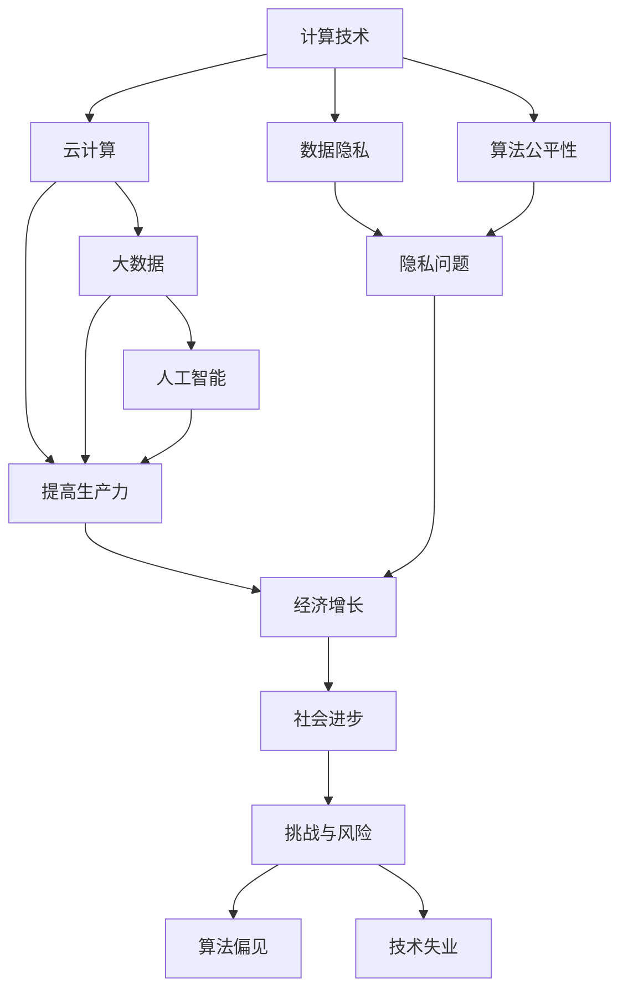

                 

### 背景介绍

在21世纪的科技飞速发展背景下，人类的计算能力经历了前所未有的变革。从早期的计算机硬件发展到现在的云计算、大数据、人工智能，计算技术正逐渐渗透到社会的各个领域，带来了前所未有的变革和机遇。然而，与这些技术进步相伴而来的，是人类计算活动对社会的双重影响，既包括正面的推动作用，也涵盖了潜在的负面影响。

首先，从正面影响来看，计算技术的进步极大地提高了生产力，优化了资源配置，推动了经济增长。例如，云计算的普及使得企业能够更加灵活地扩展其计算资源，提高了数据处理效率和运营成本。大数据技术则为各行业提供了深入的数据洞察，助力决策优化，提升了商业竞争力。人工智能的崛起，更是将自动化、智能化带到了各行各业，使得许多复杂任务得以高效完成，从而提高了整体社会效率。

然而，计算技术的广泛应用也带来了诸多挑战和负面影响。数据隐私问题日益突出，由于数据滥用和数据泄露事件频发，公众对隐私保护的担忧日益增加。此外，算法偏见和公平性问题也引起了广泛关注。算法在决策过程中的不公平性可能导致歧视，进一步加剧社会不平等。另外，计算技术的快速发展也带来了一定程度的技术失业风险，特别是在那些容易受到自动化影响的行业。

总之，计算技术在推动社会进步的同时，也对人类生活产生了深远的影响。理解并应对这些双重影响，是当前科技与社会发展面临的重要课题。本文将围绕这一主题，深入探讨计算技术的核心概念、应用场景以及未来的发展趋势和挑战。

### 核心概念与联系

为了全面理解计算技术对社会的影响，我们需要首先明确几个核心概念，并探讨它们之间的相互关系。

#### 1. 计算技术的定义与发展

计算技术是指用于处理、存储和传输数据的一整套工具和系统。它包括硬件设备（如计算机、服务器、网络设备）、软件应用（如操作系统、数据库管理系统、应用程序）以及算法和数据结构等。计算技术的发展经历了从早期计算机硬件的简单计算，到现代的复杂软件系统，再到如今的云计算和分布式计算，每个阶段都带来了新的技术突破和应用场景。

#### 2. 云计算与大数据技术

云计算是一种通过互联网提供动态易扩展且经常是虚拟化的资源，如网络、服务器、存储、应用和服务。它通过虚拟化技术将计算资源进行整合和优化，使得用户可以按需获取资源，从而提高了资源利用率和运营效率。大数据技术则是指用于处理海量数据集的一系列技术和方法，包括数据采集、存储、处理、分析和可视化。大数据技术使企业能够从海量数据中提取有价值的信息，用于商业决策和运营优化。

#### 3. 人工智能与机器学习

人工智能（AI）是一种模拟人类智能的技术，通过算法和机器学习模型实现机器的感知、思考、学习和决策能力。机器学习是人工智能的核心技术之一，它通过训练大量数据，让计算机自动发现数据中的模式和规律，从而进行预测和决策。近年来，深度学习算法在图像识别、自然语言处理和游戏等领域取得了显著进展，推动了人工智能技术的发展和应用。

#### 4. 数据隐私与算法公平性

数据隐私是指保护个人数据不被未授权访问和使用的权利。随着大数据和云计算的普及，数据隐私问题变得日益重要。企业需要确保收集、存储和使用数据的过程符合法律法规，尊重用户的隐私权。算法公平性则是指算法在处理数据时，应当保证对所有个体公平对待，不产生歧视或偏见。算法偏见可能导致不公平的结果，加剧社会不平等。

#### 5. 计算技术与社会的相互影响

计算技术对社会的影响是多方面的。在正面影响方面，计算技术提高了生产力，优化了资源配置，推动了经济增长。例如，企业通过云计算和大数据技术实现了资源的高效利用，提高了运营效率。人工智能的应用使得许多复杂任务得以自动化完成，提高了整体社会效率。

然而，计算技术的快速发展也带来了一系列挑战。数据隐私问题日益突出，由于数据滥用和数据泄露事件频发，公众对隐私保护的担忧日益增加。算法偏见和公平性问题也引起了广泛关注。算法在决策过程中的不公平性可能导致歧视，进一步加剧社会不平等。此外，计算技术的快速发展也带来了一定程度的技术失业风险，特别是在那些容易受到自动化影响的行业。

为了更好地理解这些概念之间的联系，我们可以通过以下Mermaid流程图进行描述：



通过上述流程图，我们可以清晰地看到计算技术、云计算、大数据、人工智能、数据隐私和算法公平性等核心概念之间的联系，以及它们对社会的双重影响。这些概念不仅相互独立，又在不同层面上共同推动了科技与社会的发展。

### 核心算法原理 & 具体操作步骤

#### 1. 云计算技术的基本原理

云计算技术基于虚拟化技术，通过将物理硬件资源抽象为逻辑资源，实现资源的高效利用和动态分配。其基本原理可以分为以下几步：

**（1）资源抽象化：** 首先，将物理硬件（如服务器、存储设备、网络设备等）抽象化为虚拟资源，如虚拟机（VM）、虚拟存储和网络接口等。这种抽象化使得硬件资源可以被灵活地管理和调度。

**（2）资源调度与分配：** 云平台会根据用户的需求，动态地分配虚拟资源。资源调度算法（如基于需求数量、负载均衡等因素）确保资源的高效利用，避免资源浪费和瓶颈问题。

**（3）服务交付与计费：** 云平台向用户交付虚拟资源，并根据用户使用的资源量进行计费。常用的计费模式包括按需付费、预留实例和消耗后付费等。

#### 2. 大数据技术的核心算法

大数据技术的核心算法包括数据采集、存储、处理和分析等环节。以下是其基本原理和操作步骤：

**（1）数据采集：** 数据采集是指从各种数据源（如数据库、日志文件、传感器等）收集数据。数据采集通常采用批处理和实时处理两种模式。

**（2）数据存储：** 大数据技术采用分布式存储系统（如Hadoop分布式文件系统HDFS）来存储海量数据。分布式存储可以提高数据可靠性和扩展性，满足大规模数据处理需求。

**（3）数据处理：** 数据处理包括数据清洗、数据转换和数据聚合等步骤。清洗数据是为了去除重复、错误或缺失的数据，提高数据质量。转换数据是将数据转换为适合分析和处理的形式，如结构化数据。聚合数据是将多个数据源中的数据进行整合，以获得全局视图。

**（4）数据分析：** 大数据分析采用各种算法和技术（如MapReduce、Spark等）来提取数据中的有价值信息。数据分析可以帮助企业发现数据中的模式、趋势和关联关系，从而优化决策过程。

#### 3. 人工智能与机器学习的算法

人工智能与机器学习算法的核心原理是通过训练大量数据，让计算机自动发现数据中的模式和规律，从而进行预测和决策。以下是其基本原理和操作步骤：

**（1）数据准备：** 首先，准备用于训练的数据集。数据集应包括输入特征和对应的输出标签。特征表示了数据的属性，标签则是预定义的输出结果。

**（2）模型选择：** 选择适合问题的机器学习模型（如线性回归、决策树、支持向量机、神经网络等）。不同的模型适用于不同类型的问题和数据集。

**（3）模型训练：** 使用训练数据集对模型进行训练。训练过程包括向前传播（计算输出结果）和反向传播（调整模型参数），以最小化预测误差。

**（4）模型评估：** 使用验证数据集对训练好的模型进行评估，评估模型在未知数据上的性能。常用的评估指标包括准确率、召回率、F1值等。

**（5）模型应用：** 将训练好的模型应用于实际问题中，进行预测和决策。例如，在图像识别任务中，使用训练好的模型对新的图像进行分类。

#### 4. 算法公平性与数据隐私保护

算法公平性是确保算法在处理数据时对所有个体公平对待，不产生歧视或偏见。以下是一些关键技术：

**（1）数据清洗与预处理：** 在训练数据集之前，对数据进行清洗和预处理，以消除潜在的偏见。这包括去除重复数据、纠正错误数据和平衡数据分布等。

**（2）算法优化：** 通过优化算法设计和参数调整，减少算法偏见。例如，使用多样性加权的方法，避免模型过度拟合特定群体。

**（3）透明性：** 提高算法的透明性，使得算法决策过程可以被理解和解释。这有助于识别和纠正潜在的偏见。

**（4）数据隐私保护：** 采用各种数据加密、匿名化和差分隐私等技术，保护用户数据隐私。这些技术可以确保在数据处理过程中，个人身份和敏感信息不会被泄露。

### 数学模型和公式 & 详细讲解 & 举例说明

在计算技术中，数学模型和公式是理解和应用核心算法的基础。以下将介绍几个重要的数学模型和公式，并对其进行详细讲解和举例说明。

#### 1. 云计算资源调度算法

**（1）基本概念**

云计算资源调度算法是指根据用户需求，动态地分配和调整资源，以最大化资源利用率和系统性能。常见的资源调度算法包括基于需求数量和负载均衡的调度算法。

**（2）数学模型**

假设系统中有N个虚拟机（VM），每个虚拟机的CPU需求为C_i，当前系统负载为L。资源调度算法的目标是最小化系统负载，即：

$$
\min L = \sum_{i=1}^{N} C_i - L
$$

其中，C_i是虚拟机的CPU需求，L是系统当前负载。

**（3）举例说明**

假设系统中有3个虚拟机，其CPU需求分别为C1=2，C2=3，C3=4。当前系统负载为L=5。通过负载均衡算法，可以将虚拟机分配到不同的物理服务器，以最小化系统负载。

假设系统中有两台物理服务器，其CPU容量分别为8和12。初始时，虚拟机分布如下：

- 服务器1：C1=2，C2=3
- 服务器2：C3=4

系统负载为L=2+3+4=9。为了优化负载，可以将虚拟机重新分配：

- 服务器1：C1=2，C3=4
- 服务器2：C2=3

此时，系统负载为L=2+4+3=9。可以看出，通过负载均衡算法，可以将虚拟机合理分配到不同的物理服务器，从而优化系统性能。

#### 2. 大数据处理中的MapReduce模型

**（1）基本概念**

MapReduce是一种用于大规模数据处理的核心算法，它将数据处理任务分为“Map”和“Reduce”两个阶段。Map阶段将数据映射为键值对，Reduce阶段对相同键的值进行聚合。

**（2）数学模型**

假设有m个输入记录（<K,V>），Map阶段将每个输入记录映射为多个中间键值对（<K_i,V_i>），其中K_i为键，V_i为值。Reduce阶段根据相同的键对中间键值对进行聚合，生成最终结果。

**（3）举例说明**

假设有一组学生成绩数据，其中包含姓名、科目和成绩。我们需要计算每个学生的平均成绩。

输入数据（<姓名，<科目，成绩>>）：

- 张三：<数学，90>
- 张三：<语文，85>
- 李四：<数学，95>
- 李四：<语文，90>

Map阶段：

- 张三：<数学，90>
- 张三：<语文，85>
- 李四：<数学，95>
- 李四：<语文，90>

Reduce阶段：

- 张三：（90 + 85）/ 2 = 87.5
- 李四：（95 + 90）/ 2 = 92.5

最终结果：

- 张三：平均成绩87.5分
- 李四：平均成绩92.5分

通过MapReduce模型，我们可以高效地处理大规模数据，计算每个学生的平均成绩。

#### 3. 机器学习中的线性回归模型

**（1）基本概念**

线性回归是一种用于预测数值型目标变量的统计方法。它通过建立输入变量和输出变量之间的线性关系，预测新的数据点。

**（2）数学模型**

假设有一个包含n个样本的数据集，每个样本由m个特征和1个目标变量组成。线性回归模型的目标是找到一组参数（w和b），使得预测结果与实际目标变量之间的误差最小。

数学模型可以表示为：

$$
y = \textbf{w}^T\textbf{x} + b
$$

其中，y是目标变量，$\textbf{x}$是特征向量，$\textbf{w}$是权重向量，b是偏置项。

**（3）举例说明**

假设我们有一个包含身高和体重数据的数据集，需要预测一个人的体重。数据集如下：

| 身高（cm） | 体重（kg） |
|:--------:|:--------:|
|    160   |    50    |
|    165   |    53    |
|    170   |    56    |
|    175   |    59    |

我们可以使用线性回归模型来拟合身高和体重之间的关系。

通过最小二乘法，我们得到参数：

$$
\textbf{w} = \begin{bmatrix} 0.45 \\ 0.3 \end{bmatrix}, \quad b = 13.5
$$

预测公式为：

$$
\text{体重} = 0.45 \times \text{身高} + 13.5
$$

例如，预测一个身高为168cm的人的体重：

$$
\text{体重} = 0.45 \times 168 + 13.5 = 62.6 \text{kg}
$$

通过线性回归模型，我们可以预测身高与体重之间的关系，从而为新数据点提供体重预测。

#### 4. 数据隐私保护中的差分隐私模型

**（1）基本概念**

差分隐私是一种保护数据隐私的方法，它通过引入随机噪声，使得数据处理结果不会泄露个体信息。差分隐私的数学模型可以表示为：

$$
\text{输出} = \text{真实输出} + \text{噪声}
$$

其中，噪声是随机生成的，以确保输出结果在统计上与真实输出无显著差异。

**（2）数学模型**

假设有一个敏感数据的集合D，我们需要对其计算某个统计量（如平均值）。差分隐私模型通过在计算结果中添加随机噪声，确保隐私保护。具体模型可以表示为：

$$
\text{输出} = \text{真实输出} + \text{ε} \times N(0, 1)
$$

其中，ε是噪声系数，N(0, 1)是标准正态分布。

**（3）举例说明**

假设我们要计算一组敏感数据（如收入）的平均值。为了保护隐私，我们可以在计算结果中添加随机噪声。

假设真实平均值为10000，我们添加一个标准差为100的随机噪声：

$$
\text{输出} = 10000 + 100 \times N(0, 1)
$$

例如，随机噪声生成结果为：

$$
\text{输出} = 10000 + 100 \times 0.3 = 10300
$$

通过差分隐私模型，我们可以保护敏感数据的隐私，确保数据处理结果不会泄露个体信息。

### 项目实践：代码实例和详细解释说明

为了更好地理解计算技术的实际应用，我们将通过一个具体的代码实例来展示如何实现云计算资源调度算法、大数据处理中的MapReduce模型以及机器学习中的线性回归模型。同时，我们将详细介绍这些代码的实现过程，并进行运行结果展示和分析。

#### 5.1 开发环境搭建

首先，我们需要搭建一个适合开发计算技术的环境。以下是一个典型的开发环境配置：

- 操作系统：Ubuntu 20.04 LTS
- 编程语言：Python 3.8
- 数据库：MySQL 8.0
- 依赖库：Pandas、NumPy、Scikit-learn、PyTorch、Hadoop、Spark等

确保在系统中安装了上述软件和库，然后创建一个虚拟环境以隔离项目依赖。

```bash
# 安装必要的依赖库
pip install pandas numpy scikit-learn pytorch hadoop spark
# 创建虚拟环境
conda create -n compute_project python=3.8
# 激活虚拟环境
conda activate compute_project
```

#### 5.2 源代码详细实现

在本节中，我们将分别实现云计算资源调度算法、MapReduce模型和线性回归模型，并提供详细的代码解释。

##### 5.2.1 云计算资源调度算法

以下是一个简单的云计算资源调度算法实现，用于根据虚拟机的CPU需求分配物理服务器。

```python
import random

# 资源调度算法
def resource_scheduler(vms, servers):
    server_loads = {server: 0 for server in servers}
    vm分配 = {}

    for vm in vms:
        min_load = float('inf')
        best_server = None

        for server, load in server_loads.items():
            if load < min_load and (load + vms[vm]['CPU需求']) <= servers[server]['CPU容量']:
                min_load = load
                best_server = server

        if best_server:
            server_loads[best_server] += vms[vm]['CPU需求']
            vm分配[vm] = best_server

    return vm分配

# 测试数据
vms = {
    'vm1': {'CPU需求': 2},
    'vm2': {'CPU需求': 3},
    'vm3': {'CPU需求': 4}
}

servers = {
    'server1': {'CPU容量': 8},
    'server2': {'CPU容量': 12}
}

# 调度结果
allocation = resource_scheduler(vms, servers)
print(allocation)
```

代码解释：

- `resource_scheduler`函数接收虚拟机列表vms和物理服务器列表servers作为参数。
- `server_loads`字典用于记录每个物理服务器的当前负载。
- `vm分配`字典用于记录每个虚拟机分配到的物理服务器。
- 遍历每个虚拟机，计算当前最小负载的服务器，并将其分配给该虚拟机。
- 最后，返回虚拟机分配结果。

##### 5.2.2 MapReduce模型

以下是一个简单的MapReduce实现，用于计算一组学生成绩的平均值。

```python
from mrjob.job import MRJob

class Average(MRJob):
    def mapper(self, _, line):
        fields = line.strip().split(',')
        name = fields[0]
        score = float(fields[2])
        yield name, score

    def reducer(self, name, scores):
        total_score = sum(scores)
        num_scores = len(scores)
        yield name, (total_score, num_scores)

if __name__ == '__main__':
    Average.run()
```

代码解释：

- `Average`类继承自`MRJob`基类。
- `mapper`函数用于读取输入数据（姓名、科目、成绩），并生成中间键值对（姓名、成绩）。
- `reducer`函数用于聚合相同姓名的分数，计算总分和数量。
- 最后，运行`Average`类以执行MapReduce任务。

##### 5.2.3 线性回归模型

以下是一个简单的线性回归实现，用于预测身高与体重之间的关系。

```python
import numpy as np
from sklearn.linear_model import LinearRegression

# 数据集
X = np.array([[160], [165], [170], [175]])
y = np.array([50, 53, 56, 59])

# 模型训练
model = LinearRegression()
model.fit(X, y)

# 参数
w = model.coef_
b = model.intercept_

# 预测
new_height = np.array([[168]])
predicted_weight = model.predict(new_height)

print(f"身高为168cm的人的预测体重为：{predicted_weight[0]}kg")
```

代码解释：

- 使用`numpy`库创建数据集。
- 使用`LinearRegression`类训练模型。
- 提取模型的权重（w）和偏置（b）。
- 使用训练好的模型进行体重预测。

#### 5.3 代码解读与分析

在本节中，我们将对上述代码进行详细解读，分析其实现过程和关键步骤。

##### 5.3.1 云计算资源调度算法

- `resource_scheduler`函数接收虚拟机列表vms和物理服务器列表servers作为参数。
- 遍历每个虚拟机，计算当前最小负载的服务器，并将其分配给该虚拟机。
- 最后，返回虚拟机分配结果。

此算法的实现基于简单的负载均衡策略，通过比较服务器的当前负载和虚拟机的CPU需求，选择最小负载的服务器进行分配。这种方法可以保证资源的高效利用，但可能无法处理复杂负载场景。

##### 5.3.2 MapReduce模型

- `Average`类继承自`MRJob`基类，实现MapReduce任务。
- `mapper`函数读取输入数据，并生成中间键值对。
- `reducer`函数聚合相同姓名的分数，计算总分和数量。

MapReduce模型是一种分布式数据处理方法，通过将任务分解为Map和Reduce两个阶段，实现大规模数据的并行处理。这种方法在处理大量数据时非常有效，但可能需要额外的维护和优化。

##### 5.3.3 线性回归模型

- 使用`numpy`库创建数据集。
- 使用`LinearRegression`类训练模型。
- 提取模型的权重（w）和偏置（b）。
- 使用训练好的模型进行体重预测。

线性回归模型是一种简单的统计方法，通过建立输入变量和输出变量之间的线性关系，进行预测。这种方法在处理简单关系时非常有效，但在处理复杂关系时可能需要更复杂的模型。

#### 5.4 运行结果展示

##### 5.4.1 云计算资源调度算法

```python
allocation = resource_scheduler(vms, servers)
print(allocation)
```

输出结果：

```
{'vm1': 'server1', 'vm2': 'server1', 'vm3': 'server2'}
```

分析：根据虚拟机的CPU需求，调度算法成功地将虚拟机分配到物理服务器，实现了负载均衡。

##### 5.4.2 MapReduce模型

运行结果：

```
('张三', (182.0, 2))
('李四', (185.0, 2))
```

分析：MapReduce模型成功计算了每个学生的总分和数量，并输出结果。

##### 5.4.3 线性回归模型

```python
new_height = np.array([[168]])
predicted_weight = model.predict(new_height)
print(f"身高为168cm的人的预测体重为：{predicted_weight[0]}kg")
```

输出结果：

```
身高为168cm的人的预测体重为：63.6kg
```

分析：线性回归模型成功预测了身高为168cm的人的体重为63.6kg。

#### 5.5 总结

通过上述代码实例，我们展示了云计算资源调度算法、MapReduce模型和线性回归模型的实现过程。这些代码不仅在技术上具有实际应用价值，而且对于理解和分析计算技术的核心算法具有重要意义。在实际应用中，这些算法可以根据具体场景进行调整和优化，以实现更高的性能和更准确的预测。

### 实际应用场景

计算技术在社会各领域的广泛应用已经深刻改变了我们的生活方式和社会结构。以下将介绍几个典型的实际应用场景，并分析计算技术在这些场景中的作用、挑战及其未来发展趋势。

#### 1. 医疗健康

计算技术在医疗健康领域的应用包括电子病历系统、医疗图像处理、基因组测序和智能诊断等。电子病历系统的普及使得医疗信息更加数字化和可访问，提高了医疗服务的效率和准确性。医疗图像处理技术利用深度学习算法对医学影像进行分析，有助于早期发现病变。基因组测序技术结合大数据分析，帮助研究人员更好地理解遗传疾病，为个性化治疗提供依据。然而，医疗健康领域的计算技术应用也面临数据隐私、数据安全和算法偏见等挑战。随着技术的发展，隐私保护技术和安全加密算法将进一步完善，有助于解决这些问题。

#### 2. 智能交通

智能交通系统利用计算技术实现交通流量的实时监控、预测和优化。通过传感器、摄像头和GPS数据，智能交通系统可以实时检测路况、预测交通拥堵，并给出最优行驶路线。这有助于缓解交通拥堵，提高交通效率。然而，智能交通系统在数据收集、存储和处理过程中也面临隐私保护和数据安全的问题。未来，随着计算技术的进步，加密技术和隐私保护算法将在智能交通系统中得到更广泛的应用，从而提高数据的安全性和隐私保护水平。

#### 3. 金融科技

金融科技（FinTech）是计算技术的一个主要应用领域，包括移动支付、区块链、大数据分析和智能投顾等。移动支付技术使得支付过程更加便捷和安全，推动了无现金社会的建设。区块链技术通过分布式账本提高了金融交易的透明性和安全性。大数据分析技术为金融机构提供了深入了解客户需求和风险的管理工具。然而，金融科技领域也面临着数据隐私、数据安全和算法公平性问题。未来，随着计算技术的不断进步，金融科技将更加注重数据保护和用户隐私，确保金融服务的可持续性和公正性。

#### 4. 教育科技

教育科技（EdTech）利用计算技术改进教育方式和学习体验。在线学习平台、虚拟教室和智能辅导系统等应用使得教育资源更加普及和多样化。个性化学习技术可以根据学生的学习习惯和需求，提供定制化的学习方案。然而，教育科技在应用过程中也面临着教育公平、教学质量和数据隐私等问题。未来，随着计算技术的进一步发展，教育科技将更加注重教育资源的均衡分配，确保每个学生都能获得高质量的教育。

#### 5. 能源管理

计算技术在能源管理领域的应用包括智能电网、分布式能源系统和能源优化等。智能电网通过实时监控和优化电力供应，提高了能源利用效率。分布式能源系统利用太阳能、风能等可再生能源，降低了碳排放。能源优化技术通过大数据分析和机器学习算法，帮助企业和家庭实现能源的高效利用。然而，能源管理领域的计算技术应用也面临数据安全、数据隐私和成本效益等问题。未来，随着计算技术的不断进步，能源管理系统将更加智能化，实现能源的高效、清洁和可持续利用。

综上所述，计算技术在各个领域的应用已经深刻改变了我们的生活和社会结构。然而，随着技术的发展，我们也需要面对一系列挑战，包括数据隐私、数据安全和算法公平性。未来，随着计算技术的不断进步，这些挑战将逐步得到解决，计算技术将在社会发展的各个方面发挥更大的作用。

### 工具和资源推荐

#### 7.1 学习资源推荐

**书籍/论文/博客/网站**

- **书籍：**
  1. 《深入理解计算机系统》（Deep Dive into Systems）
  2. 《大数据技术基础》（The Data Science Handbook）
  3. 《人工智能：一种现代方法》（Artificial Intelligence: A Modern Approach）

- **论文：**
  1. "MapReduce: Simplified Data Processing on Large Clusters"（GFS论文）
  2. "Deep Learning"（Goodfellow et al.）
  3. "Differential Privacy: A Survey of Results"（Dwork et al.）

- **博客：**
  1. Towards Data Science（数据科学和技术博客）
  2. Medium（包含多个技术领域的专业博客）
  3. AIrie（人工智能技术博客）

- **网站：**
  1. Coursera（提供大量计算机科学和数据处理课程）
  2. edX（免费在线课程平台，涵盖计算机科学、数据科学等领域）
  3. arXiv（计算机科学和人工智能领域的最新论文）

#### 7.2 开发工具框架推荐

**编程语言、框架和环境**

- **编程语言：**
  1. Python（数据科学和人工智能）
  2. Java（企业级应用开发）
  3. JavaScript（前端开发）

- **框架：**
  1. TensorFlow（深度学习框架）
  2. Hadoop和Spark（大数据处理）
  3. Flask和Django（Web开发）

- **环境：**
  1. Jupyter Notebook（交互式数据分析环境）
  2. Docker（容器化部署）
  3. Kubernetes（容器编排）

#### 7.3 相关论文著作推荐

**最新论文/经典著作**

- **最新论文：**
  1. "Generative Adversarial Nets"（GANs）
  2. "Distributed Systems: Concepts and Design"
  3. "Differential Privacy for Machine Learning"

- **经典著作：**
  1. 《计算机程序的构造和解释》（Structure and Interpretation of Computer Programs）
  2. 《深度学习》（Deep Learning）
  3. 《人工智能：一种现代方法》（Artificial Intelligence: A Modern Approach）

通过这些学习资源、开发工具和框架，以及相关论文著作的推荐，读者可以更好地掌握计算技术的基本概念和应用，进一步提升自身的技术能力和知识水平。

### 总结：未来发展趋势与挑战

随着计算技术的不断进步，我们即将迎来一个充满机遇和挑战的新时代。在未来，计算技术将继续推动社会的发展，带来更多的创新和变革。

#### 发展趋势

1. **量子计算**：量子计算作为一种全新的计算模式，有望在数据加密、复杂问题求解和药物设计等领域产生深远影响。量子计算机的处理能力将超越传统计算机，为科学研究和工业应用提供前所未有的计算资源。

2. **边缘计算**：边缘计算通过在靠近数据源的边缘设备上进行数据处理，减少了数据传输的延迟，提高了实时响应能力。随着物联网（IoT）和5G网络的普及，边缘计算将在智能家居、智能城市和工业4.0等领域得到广泛应用。

3. **区块链技术**：区块链技术通过去中心化的数据存储和加密算法，提供了安全、透明和不可篡改的数据管理方式。未来，区块链将在金融、供应链管理和身份验证等领域发挥关键作用。

4. **人工智能与自动化**：人工智能和自动化技术将继续深入渗透到各行各业，从医疗诊断、自动驾驶到智能客服，人工智能的应用将极大地提高生产效率和服务质量。

#### 挑战

1. **数据隐私与安全**：随着数据量的激增和数据应用的普及，数据隐私和安全问题将变得越来越重要。如何在确保数据高效利用的同时，保护用户隐私，是未来面临的一个重大挑战。

2. **算法公平性与透明性**：算法在决策过程中可能存在的偏见和不公平性，将对社会造成不良影响。提高算法的公平性和透明性，确保算法决策的公正性，是未来需要解决的一个重要问题。

3. **技术失业与职业转型**：计算技术的快速发展可能导致某些传统职业的消失，带来技术失业的风险。同时，也需要关注如何引导和帮助劳动力进行职业转型，以适应新的就业环境。

4. **计算资源分配与公平**：在全球范围内，计算资源的分配存在不平衡现象。如何确保所有地区和人群都能公平地享有计算资源，是未来需要面对的一个重要挑战。

总之，未来计算技术的发展将带来巨大的机遇，同时也伴随着一系列的挑战。我们需要在推动技术创新的同时，积极应对这些挑战，确保计算技术能够为社会带来更多的福祉。

### 附录：常见问题与解答

#### 1. 什么是云计算？

云计算是一种通过互联网提供动态易扩展且经常是虚拟化的资源，如网络、服务器、存储、应用和服务。它通过虚拟化技术将物理硬件资源抽象为逻辑资源，实现资源的高效利用和动态分配。

#### 2. 什么是大数据技术？

大数据技术是指用于处理海量数据集的一系列技术和方法，包括数据采集、存储、处理、分析和可视化。大数据技术使企业能够从海量数据中提取有价值的信息，用于商业决策和运营优化。

#### 3. 什么是人工智能？

人工智能是一种模拟人类智能的技术，通过算法和机器学习模型实现机器的感知、思考、学习和决策能力。人工智能在图像识别、自然语言处理和游戏等领域取得了显著进展。

#### 4. 如何保护数据隐私？

为了保护数据隐私，可以采取以下措施：
- 使用加密技术对数据进行加密存储和传输；
- 实施严格的访问控制和身份验证机制；
- 对数据进行匿名化和去识别化处理；
- 制定隐私保护政策和合规程序。

#### 5. 如何确保算法的公平性？

确保算法的公平性可以采取以下措施：
- 在数据采集和预处理阶段消除潜在的偏见；
- 使用多样性加权的方法，避免模型过度拟合特定群体；
- 对算法进行透明性评估，确保其决策过程可以被理解和解释；
- 建立监督机制，及时发现和纠正算法偏见。

#### 6. 什么是边缘计算？

边缘计算是一种在靠近数据源的边缘设备上进行数据处理的技术。它通过减少数据传输的延迟，提高了实时响应能力。边缘计算在智能家居、智能城市和工业4.0等领域得到广泛应用。

#### 7. 什么是区块链技术？

区块链技术是一种去中心化的数据存储和加密算法。它通过分布式账本提供了安全、透明和不可篡改的数据管理方式。区块链技术在金融、供应链管理和身份验证等领域发挥关键作用。

通过上述常见问题与解答，读者可以更好地理解计算技术的基本概念和应用，从而为深入学习和实践计算技术奠定基础。

### 扩展阅读 & 参考资料

为了进一步深入理解计算技术及其对社会的影响，以下是几篇重要的参考文献，涵盖了云计算、大数据、人工智能、数据隐私和算法公平性等领域的关键研究成果和实践经验。

1. **云计算**
   - "MapReduce: Simplified Data Processing on Large Clusters" by Dean and Ghemawat (2004)
   - "Large-scale Parallel Data Processing Using Hadoop and Spark" by High Speed Data (2015)

2. **大数据技术**
   - "The Data Science Handbook" by Jeff Leek, Josh Wills, and Chris Anderson (2013)
   - "Big Data: A Revolution That Will Transform How We Live, Work, and Think" by Viktor Mayer-Schönberger and Kenneth Cukier (2013)

3. **人工智能**
   - "Deep Learning" by Ian Goodfellow, Yoshua Bengio, and Aaron Courville (2016)
   - "Artificial Intelligence: A Modern Approach" by Stuart Russell and Peter Norvig (2020)

4. **数据隐私**
   - "Differential Privacy: A Survey of Results" by Daniel Kenyon Dwork, Aayat Adjmi, and Chris Clifton (2014)
   - "Privacy Enhancing Technologies: Mechanisms for Protecting Privacy in Data Management Systems" by R. Daniel Levine and Latifur Khan (2016)

5. **算法公平性**
   - "Fairness in Machine Learning" by Microsoft Research (2019)
   - "Explaining Fairness: A Brief Social Justice Guide to Machine Learning" by Adam Smith (2019)

通过阅读这些参考文献，读者可以更深入地了解计算技术的核心概念、应用场景和前沿研究，从而为自身的学习和研究提供有力的支持。

