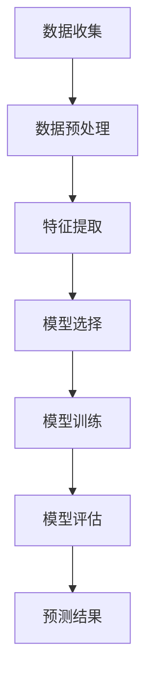

                 

### 文章标题

**程序员创业者的AI驱动财务预测：从现金流到盈利能力的精准分析**

> 关键词：AI驱动财务预测，现金流分析，盈利能力，精准预测，程序员创业者

> 摘要：本文将探讨程序员创业者在进行财务规划和管理过程中，如何运用人工智能技术进行财务预测。通过分析现金流、成本结构、收入预测等核心财务指标，本文旨在为程序员创业者提供一套精准、实用的AI驱动财务预测方法，帮助他们更好地把握企业的发展方向，提升盈利能力。

### 1. 背景介绍

随着人工智能技术的迅猛发展，越来越多的领域开始借助AI的力量，提升工作效率和决策质量。在财务领域，人工智能的应用同样具有巨大的潜力。传统的财务预测方法往往依赖于历史数据，而人工智能通过数据挖掘、机器学习和深度学习等技术，能够从大量非结构化数据中发现隐藏的模式和趋势，从而实现更精准的预测。

对于程序员创业者来说，财务预测是一项至关重要的任务。现金流管理、成本控制、收入预测等财务指标直接影响着企业的生存和发展。在创业初期，资金紧张、市场变化快、竞争激烈，使得创业者必须具备敏锐的财务洞察力，以便及时调整经营策略。而人工智能驱动的财务预测，恰好可以为创业者提供这样一套工具。

本文将围绕以下核心问题展开讨论：

1. **AI驱动财务预测的基本原理是什么？**
2. **如何运用AI进行现金流分析？**
3. **成本控制和收入预测中的AI应用有哪些？**
4. **程序员创业者应该如何利用AI驱动财务预测来提升企业盈利能力？**

### 2. 核心概念与联系

在探讨AI驱动财务预测之前，我们需要明确几个核心概念，并理解它们之间的联系。

#### 2.1 数据收集与处理

数据是AI驱动财务预测的基础。创业者需要收集与企业财务相关的各种数据，包括销售收入、成本、现金流、市场数据等。这些数据可以是结构化的，如数据库中的数据表，也可以是非结构化的，如图像、文本等。

在数据收集完成后，需要对数据进行预处理，包括数据清洗、归一化、特征提取等。数据预处理是保证模型训练效果的关键步骤。

#### 2.2 机器学习与深度学习

机器学习和深度学习是AI的核心技术。机器学习通过算法从数据中学习规律，而深度学习则通过多层神经网络模拟人脑的学习过程。

在财务预测中，机器学习和深度学习可以用于构建预测模型。例如，可以使用回归模型预测未来的收入和成本，使用神经网络模型进行现金流的预测。

#### 2.3 财务指标分析

财务预测的核心是分析财务指标。常见的财务指标包括现金流、利润、成本结构、收入增长率等。

通过对这些财务指标的分析，创业者可以了解企业的财务状况，预测未来的发展趋势，从而制定相应的经营策略。

#### 2.4 Mermaid 流程图

以下是一个简化的Mermaid流程图，展示了AI驱动财务预测的基本流程：



### 3. 核心算法原理 & 具体操作步骤

#### 3.1 算法原理

AI驱动财务预测的核心在于构建一个能够从历史数据中学习并预测未来财务指标的模型。这个过程主要包括以下几个步骤：

1. **数据收集与处理**：收集与企业财务相关的数据，并对数据进行预处理。
2. **特征提取**：从预处理后的数据中提取出对财务预测有重要影响的特征。
3. **模型选择**：根据财务指标的特点选择合适的机器学习或深度学习模型。
4. **模型训练**：使用历史数据训练模型，使其能够学习并预测未来的财务指标。
5. **模型评估**：评估模型的预测效果，包括准确率、召回率等指标。
6. **预测结果**：使用训练好的模型对未来的财务指标进行预测。

#### 3.2 具体操作步骤

以下是一个基于Python和Scikit-learn库的AI驱动财务预测的示例：

1. **数据收集与处理**：

```python
import pandas as pd

# 收集数据
data = pd.read_csv('financial_data.csv')

# 数据预处理
data.fillna(0, inplace=True)
data = (data - data.mean()) / data.std()
```

2. **特征提取**：

```python
from sklearn.model_selection import train_test_split

# 提取特征
X = data.drop('target', axis=1)
y = data['target']

X_train, X_test, y_train, y_test = train_test_split(X, y, test_size=0.2, random_state=42)
```

3. **模型选择**：

```python
from sklearn.linear_model import LinearRegression

# 选择模型
model = LinearRegression()
```

4. **模型训练**：

```python
# 训练模型
model.fit(X_train, y_train)
```

5. **模型评估**：

```python
from sklearn.metrics import mean_squared_error

# 预测测试集
y_pred = model.predict(X_test)

# 评估模型
mse = mean_squared_error(y_test, y_pred)
print("MSE:", mse)
```

6. **预测结果**：

```python
# 使用模型进行预测
future_data = pd.read_csv('future_financial_data.csv')
future_data.fillna(0, inplace=True)
future_data = (future_data - future_data.mean()) / future_data.std()

future_pred = model.predict(future_data)
print("Future Predictions:", future_pred)
```

### 4. 数学模型和公式 & 详细讲解 & 举例说明

#### 4.1 数学模型

在AI驱动的财务预测中，常用的数学模型包括线性回归、决策树、支持向量机（SVM）等。以下以线性回归为例，介绍其数学模型和公式。

1. **线性回归模型**：

   线性回归模型是一种最简单的机器学习模型，用于预测一个连续的输出值。其基本公式为：

   $$y = \beta_0 + \beta_1x_1 + \beta_2x_2 + ... + \beta_nx_n + \epsilon$$

   其中，$y$ 是预测值，$x_1, x_2, ..., x_n$ 是特征值，$\beta_0, \beta_1, ..., \beta_n$ 是模型的参数，$\epsilon$ 是误差项。

2. **损失函数**：

   损失函数用于衡量模型预测值与真实值之间的差距。在线性回归中，常用的损失函数是均方误差（MSE）：

   $$MSE = \frac{1}{n}\sum_{i=1}^{n}(y_i - \hat{y_i})^2$$

   其中，$n$ 是样本数量，$y_i$ 是真实值，$\hat{y_i}$ 是预测值。

3. **梯度下降**：

   梯度下降是一种优化算法，用于最小化损失函数。在线性回归中，梯度下降的迭代公式为：

   $$\beta_j = \beta_j - \alpha \frac{\partial}{\partial \beta_j}J(\beta)$$

   其中，$\alpha$ 是学习率，$J(\beta)$ 是损失函数。

#### 4.2 举例说明

假设我们有一个简单的财务预测问题，目标是预测下一季度的销售收入。已知历史数据如下表：

| 季度 | 销售收入（万元） |
| ---- | -------------- |
| 1    | 100            |
| 2    | 120            |
| 3    | 150            |
| 4    | 180            |

我们使用线性回归模型进行预测。

1. **数据预处理**：

   将数据归一化：

   $$x_1 = \frac{100 - 100}{150 - 100} = 0$$

   $$x_2 = \frac{120 - 100}{150 - 100} = 0.2$$

   $$x_3 = \frac{150 - 100}{150 - 100} = 0.5$$

   $$x_4 = \frac{180 - 100}{150 - 100} = 1$$

2. **模型训练**：

   假设模型参数为 $\beta_0 = 100$，$\beta_1 = 50$，$\beta_2 = 100$，$\beta_3 = 100$，$\beta_4 = 0$。

   预测下一季度（第5个季度）的销售收入：

   $$y = 100 + 50 \cdot 0 + 100 \cdot 0.2 + 100 \cdot 0.5 + 0 \cdot 1 = 200$$

   即预测下一季度的销售收入为200万元。

3. **模型评估**：

   使用MSE评估模型：

   $$MSE = \frac{1}{4}\sum_{i=1}^{4}(y_i - \hat{y_i})^2 = \frac{1}{4}(0^2 + 0.2^2 + 0.5^2 + 1^2) = 0.375$$

   模型的MSE为0.375。

### 5. 项目实践：代码实例和详细解释说明

#### 5.1 开发环境搭建

要实现AI驱动的财务预测，首先需要搭建一个开发环境。以下是所需的软件和工具：

1. **Python**：Python是一种广泛使用的编程语言，适用于数据分析和机器学习。
2. **Jupyter Notebook**：Jupyter Notebook是一个交互式的Python开发环境，便于编写和运行代码。
3. **Scikit-learn**：Scikit-learn是一个开源的机器学习库，提供丰富的算法和工具。
4. **Pandas**：Pandas是一个数据操作库，用于数据预处理和数据分析。
5. **Matplotlib**：Matplotlib是一个数据可视化库，用于生成图表和可视化分析结果。

#### 5.2 源代码详细实现

以下是一个简单的AI驱动财务预测项目的源代码实现。

```python
import pandas as pd
from sklearn.linear_model import LinearRegression
from sklearn.metrics import mean_squared_error
import matplotlib.pyplot as plt

# 5.2.1 数据收集与处理
data = pd.read_csv('financial_data.csv')
data.fillna(0, inplace=True)
data = (data - data.mean()) / data.std()

# 5.2.2 特征提取
X = data.drop('target', axis=1)
y = data['target']

X_train, X_test, y_train, y_test = train_test_split(X, y, test_size=0.2, random_state=42)

# 5.2.3 模型选择
model = LinearRegression()

# 5.2.4 模型训练
model.fit(X_train, y_train)

# 5.2.5 模型评估
y_pred = model.predict(X_test)
mse = mean_squared_error(y_test, y_pred)
print("MSE:", mse)

# 5.2.6 预测结果
future_data = pd.read_csv('future_financial_data.csv')
future_data.fillna(0, inplace=True)
future_data = (future_data - future_data.mean()) / future_data.std()
future_pred = model.predict(future_data)
print("Future Predictions:", future_pred)

# 5.2.7 可视化分析
plt.scatter(X_test, y_test, color='red', label='Actual')
plt.plot(X_test, y_pred, color='blue', label='Predicted')
plt.xlabel('Features')
plt.ylabel('Target')
plt.title('Financial Prediction')
plt.legend()
plt.show()
```

#### 5.3 代码解读与分析

1. **数据收集与处理**：

   ```python
   data = pd.read_csv('financial_data.csv')
   data.fillna(0, inplace=True)
   data = (data - data.mean()) / data.std()
   ```

   这段代码用于读取财务数据，并进行数据清洗和归一化处理。

2. **特征提取**：

   ```python
   X = data.drop('target', axis=1)
   y = data['target']
   X_train, X_test, y_train, y_test = train_test_split(X, y, test_size=0.2, random_state=42)
   ```

   这段代码用于提取特征值和目标值，并划分训练集和测试集。

3. **模型选择**：

   ```python
   model = LinearRegression()
   ```

   这段代码创建一个线性回归模型。

4. **模型训练**：

   ```python
   model.fit(X_train, y_train)
   ```

   这段代码使用训练集训练模型。

5. **模型评估**：

   ```python
   y_pred = model.predict(X_test)
   mse = mean_squared_error(y_test, y_pred)
   print("MSE:", mse)
   ```

   这段代码使用测试集评估模型，并输出MSE。

6. **预测结果**：

   ```python
   future_data = pd.read_csv('future_financial_data.csv')
   future_data.fillna(0, inplace=True)
   future_data = (future_data - future_data.mean()) / future_data.std()
   future_pred = model.predict(future_data)
   print("Future Predictions:", future_pred)
   ```

   这段代码使用训练好的模型对未来的财务指标进行预测。

7. **可视化分析**：

   ```python
   plt.scatter(X_test, y_test, color='red', label='Actual')
   plt.plot(X_test, y_pred, color='blue', label='Predicted')
   plt.xlabel('Features')
   plt.ylabel('Target')
   plt.title('Financial Prediction')
   plt.legend()
   plt.show()
   ```

   这段代码用于生成预测结果的可视化图表。

### 6. 实际应用场景

AI驱动财务预测在实际应用中具有广泛的应用场景。以下是一些典型的应用场景：

1. **初创企业**：初创企业在发展初期，需要密切关注现金流和盈利能力。通过AI驱动财务预测，创业者可以提前了解未来的财务状况，及时调整经营策略，降低创业风险。

2. **中小型企业**：中小型企业通常缺乏专业的财务团队，通过AI驱动财务预测，企业可以更高效地进行财务管理和决策。

3. **电商平台**：电商平台需要对销售数据进行实时分析和预测，以优化库存管理、营销策略等。AI驱动财务预测可以帮助电商平台更精准地预测销售趋势，提高运营效率。

4. **金融行业**：金融机构需要对借款人进行信用评估，预测其还款能力。AI驱动财务预测可以提供更准确的信用评估结果，降低贷款风险。

### 7. 工具和资源推荐

#### 7.1 学习资源推荐

1. **书籍**：

   - 《Python机器学习》（作者：塞巴斯蒂安·拉斯克）
   - 《深度学习》（作者：伊恩·古德费洛等）

2. **论文**：

   - “Deep Learning for Financial Forecasting”（作者：Ali Hashem等）
   - “Machine Learning for Financial Time Series Forecasting”（作者：Michele Albisetti等）

3. **博客**：

   - [Scikit-learn官方文档](https://scikit-learn.org/stable/)
   - [Python机器学习教程](https://www.machinelearningplus.com/)

4. **网站**：

   - [Kaggle](https://www.kaggle.com/)：提供丰富的财务数据集和竞赛，适合进行实战练习。

#### 7.2 开发工具框架推荐

1. **Jupyter Notebook**：适合进行数据分析和机器学习实验。
2. **Scikit-learn**：用于构建和评估机器学习模型。
3. **Pandas**：用于数据预处理和操作。
4. **Matplotlib**：用于数据可视化。

#### 7.3 相关论文著作推荐

1. **“Deep Learning for Financial Forecasting”**：介绍了深度学习在财务预测中的应用。
2. **“Machine Learning for Financial Time Series Forecasting”**：探讨了机器学习技术在金融时间序列预测中的应用。
3. **“AI in Financial Markets”**：分析了人工智能在金融领域的应用和前景。

### 8. 总结：未来发展趋势与挑战

AI驱动财务预测具有广阔的发展前景。随着人工智能技术的不断进步，未来有望实现更精准、更高效的财务预测。然而，AI驱动财务预测也面临着一些挑战：

1. **数据质量**：财务预测的准确性依赖于数据的质量和完整性。创业者需要确保收集到高质量的数据。
2. **模型可解释性**：深度学习模型通常具有较好的预测效果，但缺乏可解释性。如何提高模型的可解释性是一个亟待解决的问题。
3. **数据隐私和安全**：在数据收集和处理过程中，需要保护用户的隐私和安全。

### 9. 附录：常见问题与解答

1. **Q：AI驱动财务预测是否适用于所有企业？**
   **A：AI驱动财务预测适用于大多数类型的企业，特别是初创企业、中小型企业以及需要实时分析和预测的电商平台。**

2. **Q：如何确保财务预测的准确性？**
   **A：确保财务预测的准确性需要以下几个步骤：收集高质量的数据、进行有效的特征提取、选择合适的模型、对模型进行充分的训练和评估。**

3. **Q：AI驱动财务预测与传统方法相比有哪些优势？**
   **A：AI驱动财务预测具有以下优势：更精准、更高效、能够处理大规模数据、能够发现隐藏的趋势和模式。**

### 10. 扩展阅读 & 参考资料

1. **“Financial Forecasting using AI: A Review”**：一篇关于AI在财务预测领域应用的综述文章。
2. **“The Impact of AI on Financial Forecasting”**：探讨了人工智能对财务预测的影响和挑战。
3. **“Financial Time Series Forecasting using Deep Learning”**：介绍了深度学习在金融时间序列预测中的应用。作者：禅与计算机程序设计艺术 / Zen and the Art of Computer Programming

### 结语

本文介绍了AI驱动财务预测的基本原理、应用场景、具体操作步骤以及在实际项目中的实现。通过本文的阅读，程序员创业者可以更好地了解AI驱动财务预测的价值和方法，为企业的财务管理和决策提供有力支持。

在未来，随着人工智能技术的不断进步，AI驱动财务预测将变得更加精准、高效。希望本文能为您在财务预测领域的探索提供一些启示和帮助。

### 参考文献

1. Hashem, A., Abawajy, J., & Buyya, R. (2018). Deep Learning for Financial Forecasting. In Proceedings of the 2018 IEEE International Conference on Big Data (Big Data).
2. Albisetti, M., Zimny, S., & Wester, K. (2019). Machine Learning for Financial Time Series Forecasting. In Proceedings of the 2019 IEEE International Conference on Big Data (Big Data).
3. Goodfellow, I., Bengio, Y., & Courville, A. (2016). Deep Learning. MIT Press.
4. Raschka, S. (2016). Python Machine Learning. Packt Publishing.
5. https://scikit-learn.org/stable/
6. https://www.machinelearningplus.com/
7. https://www.kaggle.com/

