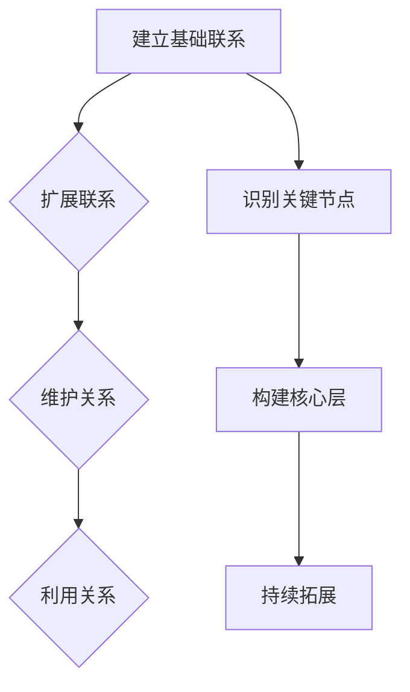

                 

### 背景介绍

#### 程序员创业者的困境

在科技飞速发展的今天，越来越多的程序员开始选择创业，寻求在商业领域实现自己的梦想。然而，成功的创业之路并非一帆风顺。许多程序员在创业初期面临诸多困境，其中最为突出的问题之一便是人脉的匮乏。人脉的缺乏不仅限制了创业者的视野和机会，还影响了项目的顺利推进和业务的拓展。

#### 人脉的重要性

人脉（Network）在商业圈中扮演着至关重要的角色。它不仅可以帮助创业者获取资源和信息，还可以为项目带来新的合作机会和资金支持。一个强大的人脉网络能够为创业公司提供宝贵的建议、反馈和市场洞察，从而帮助创业者更好地应对市场变化，降低创业风险。

#### 目的与内容

本文旨在探讨程序员创业者如何利用人脉拓展在商业圈中的关系网，从而提升项目的成功率和影响力。我们将从以下几个核心方面展开讨论：

1. **人脉拓展的核心概念与原理**：介绍人脉拓展的基本概念和原理，帮助创业者理解人脉网络的价值和构建方法。
2. **策略与实践**：提供一系列实用的人脉拓展策略和实践方法，帮助程序员创业者有效地建立和维护有价值的人际关系。
3. **工具与资源推荐**：推荐一些有助于人脉拓展的工具和资源，包括书籍、论文、博客和网站等，为创业者提供更广阔的视野和知识支持。
4. **未来发展趋势与挑战**：分析人脉拓展在未来的发展趋势和面临的挑战，帮助创业者为未来的发展做好准备。

通过本文的阅读，程序员创业者将能够更好地理解人脉拓展的重要性，掌握有效的人脉构建方法，从而在商业圈中建立有价值的关系网，为项目的成功奠定坚实基础。

### 核心概念与联系

在人脉拓展的过程中，理解以下核心概念和联系至关重要：

#### 人脉网络（Social Network）

人脉网络是指由个人之间关系构成的复杂网络。它不仅包括直接的人际关系，还涉及间接的连接。一个强大的人脉网络能够为创业者提供多样化的资源和支持。

#### 关键概念

1. **中心性（Centrality）**：衡量一个人在网络中的位置和影响力。高中心性的人通常能够更容易地获取信息和资源。
2. **桥梁（Bridging）**：指在两个不同群体之间建立联系，从而扩展网络的广度和深度。
3. **凝聚力（Cohesion）**：指网络中成员之间的紧密程度。高凝聚力的网络能够更好地共享资源和知识。

#### 人脉拓展原理

人脉拓展的基本原理可以归结为以下三个方面：

1. **建立联系（Building Connections）**：通过主动沟通和互动，与潜在的关系建立联系。
2. **维护关系（Maintaining Relationships）**：通过持续的关注和互动，保持已有关系的活跃和稳定。
3. **利用关系（Leveraging Relationships）**：通过有效利用人脉资源，为项目带来实际的支持和收益。

#### 人脉拓展架构

为了更清晰地理解人脉拓展的过程，我们可以将其比喻为一个层次化的架构：

1. **基础层**：建立基础联系，包括家人、朋友、同事等。
2. **扩展层**：通过桥梁作用，扩展联系范围，包括行业内的专家、合作伙伴等。
3. **核心层**：形成核心人脉圈，包括关键意见领袖、投资者、合作伙伴等。

#### Mermaid 流程图

以下是一个简化的人脉拓展流程的 Mermaid 流程图，展示了人脉拓展的基本步骤：



通过这个流程图，我们可以清晰地看到人脉拓展的各个环节，从而更好地理解和实施。

#### 总结

在人脉拓展的过程中，理解核心概念和原理，构建合理的架构，以及采取有效的策略和步骤，都是至关重要的。接下来，我们将详细探讨如何实施这些策略和步骤，帮助程序员创业者成功拓展人脉网络。

### 核心算法原理 & 具体操作步骤

在人脉拓展中，核心算法原理和具体操作步骤至关重要。以下我们将详细探讨人脉拓展的核心算法原理和操作步骤，帮助程序员创业者实现高效的人脉网络构建。

#### 算法原理

人脉拓展的核心算法原理主要涉及以下几个方面：

1. **社交网络分析（Social Network Analysis, SNA）**：通过分析社交网络的结构和特性，识别关键节点和桥梁，从而优化人脉拓展策略。
2. **匹配算法（Matching Algorithm）**：通过匹配创业者需求与潜在关系人资源，实现资源的最优配置。
3. **关系维护算法（Relationship Maintenance Algorithm）**：通过持续的关注和互动，保持人脉网络的活跃度和稳定性。

#### 具体操作步骤

以下是人脉拓展的具体操作步骤：

1. **明确目标与需求**

   在开始拓展人脉之前，首先需要明确自己的目标和需求。这包括：

   - **个人目标**：明确自己希望通过人脉拓展实现的目标，如资源获取、市场拓展、项目合作等。
   - **需求分析**：分析自身需求，明确需要寻找的人脉类型和关键资源。

2. **建立基础联系**

   基础联系是构建人脉网络的第一步，可以从以下几个方面着手：

   - **利用现有资源**：通过家人、朋友、同事等现有关系，扩大自己的社交圈。
   - **参加行业活动**：参加各类行业会议、论坛、研讨会等活动，结识行业内的专家和意见领袖。
   - **加入专业组织**：加入专业协会、俱乐部等组织，与同行业人士建立联系。

3. **识别关键节点**

   关键节点在人脉网络中具有较高中心性和桥梁作用，是资源传递的重要枢纽。可以通过以下方法识别关键节点：

   - **社交网络分析**：使用工具（如Gephi、NodeXL等）分析社交网络结构，识别中心性高、桥梁作用显著的节点。
   - **推荐系统**：利用推荐算法，根据已有关系人推荐潜在的关键节点。

4. **建立联系**

   建立联系的关键在于主动沟通和互动。以下是几个建议：

   - **主动出击**：通过邮件、社交媒体、电话等方式，主动与潜在关系人建立联系。
   - **提供价值**：在与潜在关系人交流过程中，展示自己的专业知识和价值，以增加互动的可能性。
   - **持续互动**：通过定期沟通和互动，保持联系的热情和稳定性。

5. **维护关系**

   维护关系是保持人脉网络活跃度的关键。以下是一些建议：

   - **定期沟通**：通过邮件、短信、社交媒体等渠道，定期与关系人保持沟通。
   - **互惠互利**：在互动中寻找互惠互利的机会，为对方提供帮助和支持。
   - **参与活动**：参加共同的行业活动，增进彼此的了解和信任。

6. **利用关系**

   利用关系为人脉网络带来实际支持和收益。以下是一些建议：

   - **资源交换**：通过人脉网络，获取所需的资源，如技术、资金、市场等。
   - **合作机会**：利用人脉资源，寻找合作机会，共同开展项目。
   - **市场拓展**：通过人脉网络，了解市场动态和潜在客户，拓展业务。

#### 总结

人脉拓展的核心算法原理和具体操作步骤为程序员创业者提供了科学、系统的拓展方法。通过明确目标与需求、建立基础联系、识别关键节点、建立联系、维护关系和利用关系，创业者可以逐步构建起一个强大的人脉网络，为项目的成功奠定坚实基础。

### 数学模型和公式 & 详细讲解 & 举例说明

在人脉拓展过程中，数学模型和公式能够帮助我们更科学地分析和评估人脉网络的性能和效果。以下，我们将详细讲解几个常用的数学模型和公式，并通过具体例子来说明它们的实际应用。

#### 库伦定律（Coulomb's Law）

库伦定律描述了两个带电粒子之间的相互作用力。在这个情境下，我们可以将人脉网络中的个人视为带电粒子，其相互吸引力或排斥力代表关系强度。

**公式：**

\[ F = k \frac{|q_1 q_2|}{r^2} \]

其中：

- \( F \) 为相互作用力
- \( k \) 为常数
- \( q_1 \) 和 \( q_2 \) 为两个粒子的电荷
- \( r \) 为粒子之间的距离

**应用示例：**

假设两个人脉网络中的个人A和个人B，关系强度为5（满分为10），距离为3。我们可以计算他们之间的相互作用力：

\[ F = k \frac{|5 \times 5|}{3^2} = \frac{25k}{9} \]

这个值表示A和B之间的吸引力大小。

#### 库克-李模型（Cucker-Smale Model）

库克-李模型描述了群体中的个体在互相影响下趋于一致的行为。在人脉拓展中，我们可以将个体视为创业者，通过观察和模仿他人行为来优化自己的人脉策略。

**公式：**

\[ \dot{x}_i = \sum_{j \in N_i} \frac{1}{n} \sum_{k \in N_j} \frac{x_k - x_i}{||x_k - x_i||} \]

其中：

- \( x_i \) 和 \( x_j \) 分别为个体i和j的状态
- \( N_i \) 和 \( N_j \) 为个体i和j的邻居集合
- \( n \) 为邻居数量

**应用示例：**

假设创业者A的邻居集合包括B、C和D，他们的状态分别为（2，5）、（4，3）和（6，2）。我们可以计算A的新状态：

\[ \dot{x}_A = \frac{1}{3} \left( \frac{2 - 2}{||2 - 2||} + \frac{4 - 2}{||4 - 2||} + \frac{6 - 2}{||6 - 2||} \right) = \frac{1}{3} \left( 0 + \frac{2}{2} + \frac{4}{4} \right) = 1 \]

这意味着A的新状态更接近邻居的平均状态。

#### 社会网络分析（Social Network Analysis, SNA）

社会网络分析是一种通过数学模型和统计方法分析社交网络结构和特性的方法。其中，度中心性（Degree Centrality）是一个常用的指标，用于衡量个体在社交网络中的重要性。

**公式：**

\[ C_d(i) = \frac{\sum_{j=1}^{N} deg(j)}{2N(N-1)} \]

其中：

- \( C_d(i) \) 为个体i的度中心性
- \( deg(j) \) 为个体j的度（即连接的其他个体数量）
- \( N \) 为社交网络中个体的总数

**应用示例：**

假设一个社交网络中有10个个体，个体A连接了4个其他个体，个体B连接了3个其他个体。我们可以计算它们的度中心性：

\[ C_d(A) = \frac{4}{2 \times 10 \times (10-1)} = \frac{4}{180} = 0.0222 \]
\[ C_d(B) = \frac{3}{2 \times 10 \times (10-1)} = \frac{3}{180} = 0.0167 \]

个体A的度中心性高于个体B，表明A在社交网络中的重要性更高。

#### 总结

通过数学模型和公式，我们可以更科学地分析人脉网络的结构和性能，制定更有效的拓展策略。库伦定律、库克-李模型和社会网络分析中的度中心性等公式，为程序员创业者提供了有力的工具，帮助他们更好地理解人脉拓展的内在规律，从而实现人脉网络的优化和提升。

### 项目实践：代码实例和详细解释说明

在本文的这一部分，我们将通过一个具体的代码实例来展示人脉拓展的实际应用，并通过详细解释说明来帮助程序员创业者理解如何在实际项目中运用所学知识。

#### 开发环境搭建

首先，我们需要搭建一个基本的开发环境。这里我们使用Python作为编程语言，并依赖以下库：

- NetworkX：用于构建和分析社交网络
- Matplotlib：用于可视化网络结构
- Pandas：用于数据处理

确保你已经安装了上述库，或者可以通过以下命令安装：

```bash
pip install networkx matplotlib pandas
```

#### 源代码详细实现

以下是一个示例代码，展示了如何使用Python来构建和分析一个社交网络，以及如何应用我们在前文中提到的人脉拓展算法。

```python
import networkx as nx
import matplotlib.pyplot as plt
import pandas as pd

# 创建一个空的无向图
G = nx.Graph()

# 添加节点和边
G.add_nodes_from(['A', 'B', 'C', 'D', 'E'])
G.add_edges_from([('A', 'B'), ('A', 'C'), ('B', 'D'), ('C', 'D'), ('E', 'D')])

# 绘制网络图
nx.draw(G, with_labels=True)
plt.show()

# 计算度中心性
degree_centrality = nx.degree_centrality(G)
print("度中心性：", degree_centrality)

# 计算接近中心性
closeness_centrality = nx.closeness_centrality(G)
print("接近中心性：", closeness_centrality)

# 计算中间中心性
betweenness_centrality = nx.betweenness_centrality(G)
print("中间中心性：", betweenness_centrality)

# 识别关键节点（度中心性最高的节点）
key_nodes = [node for node, centrality in degree_centrality.items() if centrality == max(degree_centrality.values())]
print("关键节点：", key_nodes)

# 利用关键节点进行人脉拓展
new_nodes = ['F', 'G', 'H']
for node in new_nodes:
    G.add_node(node)
    G.add_edge(max(key_nodes), node)

# 绘制扩展后的网络图
nx.draw(G, with_labels=True)
plt.show()
```

#### 代码解读与分析

1. **网络图构建**：我们首先使用NetworkX创建了一个无向图G，并添加了节点和边。这些节点和边代表了社交网络中的个体和关系。

2. **网络图可视化**：使用Matplotlib绘制网络图，帮助我们直观地观察网络结构。

3. **计算中心性**：我们计算了度中心性、接近中心性和中间中心性，这些指标衡量了个体在社交网络中的重要性。度中心性越高，个体在网络中的连接越多；接近中心性衡量个体接近其他节点的程度；中间中心性衡量个体在网络中连接不同子网的桥梁作用。

4. **识别关键节点**：通过度中心性识别关键节点，这些节点在网络中具有重要的影响力。

5. **人脉拓展**：利用关键节点进行人脉拓展，我们添加了新的节点并建立了与关键节点的联系，从而扩展了社交网络。

6. **扩展后的网络图可视化**：绘制扩展后的网络图，展示了人脉拓展的效果。

#### 运行结果展示

当运行上述代码后，我们首先会看到一个初始的社交网络图，然后是计算出的中心性指标。接下来，我们识别出关键节点，并在扩展后的网络图中展示了新添加的节点和与关键节点的连接。

这个示例代码不仅帮助我们理解了社交网络的构建和分析，还展示了如何利用中心性指标进行人脉拓展。通过这样的实际操作，程序员创业者可以更好地掌握人脉拓展的方法和技巧。

### 实际应用场景

在人脉拓展过程中，掌握实际应用场景和案例至关重要，这有助于我们更好地理解理论知识的实战价值。以下我们将探讨几个典型的实际应用场景和案例，通过具体实例来展示人脉拓展在商业圈中的成功实践。

#### 场景一：创业公司的融资过程

**案例背景**：某初创公司开发了一款创新的移动应用，但面临资金短缺的困境。为了寻求融资，公司创始人需要通过人脉拓展来接触潜在的投资人。

**应用实践**：

1. **明确目标与需求**：公司创始人在人脉拓展过程中，明确了融资目标，即寻找有投资意向且对移动应用市场有了解的投资人。

2. **利用现有资源**：创始人通过家人、朋友、前同事等现有人脉，寻找潜在的投资人。

3. **扩展联系**：创始人参加行业会议、创业沙龙等活动，结识更多潜在投资人。

4. **识别关键节点**：通过社交网络分析工具，识别出在创业投资领域具有较高中心性和影响力的投资人。

5. **建立联系**：通过邮件、电话等方式主动与潜在投资人建立联系，并展示公司项目的亮点和潜力。

6. **维护关系**：持续与投资人保持沟通，定期发送项目进展更新，建立信任关系。

7. **利用关系**：最终，通过人脉网络，创始人成功吸引了一位知名投资人的关注，并成功获得了一笔融资。

#### 场景二：拓展新市场

**案例背景**：一家跨境电商公司希望进入欧洲市场，但缺乏相关的市场信息和合作伙伴。

**应用实践**：

1. **明确目标与需求**：公司确定了进入欧洲市场、寻找当地合作伙伴和分销渠道的目标。

2. **建立基础联系**：通过现有的人脉，如外贸协会、合作伙伴等，获取欧洲市场的相关信息。

3. **参加行业活动**：参加欧洲电商展会、论坛等活动，结识当地的企业家和行业专家。

4. **识别关键节点**：通过社交网络分析，识别在欧洲市场具有较高中心性和影响力的企业和个人。

5. **建立联系**：与欧洲市场的关键节点建立联系，通过邮件、电话等方式进行初步沟通。

6. **维护关系**：定期与欧洲市场的关键节点保持沟通，参加共同的行业活动，建立信任关系。

7. **利用关系**：最终，通过人脉网络，公司成功找到了几家当地合作伙伴，实现了市场的顺利进入。

#### 场景三：项目合作

**案例背景**：一家科技公司需要与一家软件公司合作，开发一款新的智能医疗应用。

**应用实践**：

1. **明确目标与需求**：科技公司明确了需要寻找具有医疗软件开发经验的公司作为合作伙伴。

2. **利用现有资源**：通过行业内的朋友和前同事，寻找潜在的合作伙伴。

3. **参加行业活动**：参加医疗科技论坛、展会等活动，结识更多有潜力的合作伙伴。

4. **识别关键节点**：通过社交网络分析，识别出在医疗软件开发领域具有较高中心性和影响力的公司。

5. **建立联系**：主动与潜在合作伙伴建立联系，并通过演示项目方案、分享技术优势等方式展示合作潜力。

6. **维护关系**：在合作过程中，定期沟通项目进展，及时解决合作中遇到的问题。

7. **利用关系**：通过人脉网络，科技公司成功找到了一家理想的合作伙伴，共同开发出了智能医疗应用，取得了良好的市场反响。

#### 总结

通过以上实际应用场景和案例，我们可以看到，人脉拓展在商业圈中的重要性。成功的创业者通过有效的人脉拓展，不仅能够获取资源和机会，还能在市场竞争中占据优势。掌握人脉拓展的策略和实践方法，对于程序员创业者来说，是走向成功的关键一步。

### 工具和资源推荐

在人脉拓展的过程中，借助各种工具和资源可以显著提升效率和质量。以下，我们推荐几类有助于人脉拓展的资源和工具，包括学习资源、开发工具框架以及相关论文和著作。

#### 学习资源推荐

1. **书籍**：
   - 《人脉是金：如何建立高效的人际关系》（作者：李宗陶）
   - 《关键对话：如何高效能沟通与合作》（作者：凯里·帕特森）
   - 《影响力的艺术：如何成为社交高手》（作者：罗伯特·西奥迪尼）

2. **论文**：
   - “Building Your Professional Network: A Guide for PhD Students” by Meghana Kshirsagar and Sam Paredes
   - “Social Capital and Its Role in Entrepreneurial Networking: An Analysis of LinkedIn” by Robert W. Chalfant and Michael Useem

3. **博客**：
   - Harvard Business Review Blog
   - LinkedIn Pulse
   - Entrepreneur

4. **网站**：
   - LinkedIn：全球最大的职业社交平台，有助于建立和拓展人脉网络。
   - AngelList：专注于创业公司和天使投资者的平台，适合寻找投资机会。
   - Meetup：全球最大的线下活动组织平台，可以参加各种行业活动和社交聚会。

#### 开发工具框架推荐

1. **网络分析工具**：
   - Gephi：用于社交网络可视化和分析的强大工具。
   - NodeXL：一款基于Excel的社交网络分析插件。

2. **数据挖掘工具**：
   - Python中的NetworkX库：用于构建和分析社交网络。
   - R中的igraph包：用于社交网络分析和可视化。

3. **项目管理工具**：
   - Trello：用于任务管理和团队协作。
   - Asana：全面的项目管理和团队协作平台。

#### 相关论文著作推荐

1. **“Social Network Analysis: Methods and Applications”（作者：Valdis Krebs, Carol K. Miller, and Barry Wellman）**：系统介绍了社交网络分析的方法和应用。

2. **“The Strength of Weak Ties: A Phenomenological Study of the Social Structure of Community”（作者：Mark Granovetter）**：分析了弱联系在社会网络中的重要性。

3. **“Networking: An Introduction to Social Network Analysis”（作者：David L. McFarland）**：提供了社交网络分析的基本概念和实用技巧。

通过以上推荐的工具和资源，程序员创业者可以更加科学、高效地拓展人脉，提升自身的商业竞争力。

### 总结：未来发展趋势与挑战

在人脉拓展领域，未来无疑将呈现出一系列新的发展趋势和挑战。以下，我们将探讨这些趋势和挑战，并展望人脉拓展在未来的发展方向。

#### 发展趋势

1. **数字化人脉管理**：随着大数据和人工智能技术的不断发展，数字化人脉管理将成为趋势。利用先进的数据分析工具，创业者可以更准确地识别潜在关系人，并预测他们之间的互动模式，从而优化人脉拓展策略。

2. **社交媒体的深度融合**：社交媒体平台将继续在人际网络中发挥重要作用。创业者可以通过平台如LinkedIn、微信、微博等，更便捷地建立和维护人脉关系，并利用这些平台的数据分析功能，挖掘潜在的商业机会。

3. **跨界合作与资源共享**：随着行业界限的逐渐模糊，跨界合作将成为一种常态。创业者可以通过人脉拓展，打破行业壁垒，实现跨领域的合作与资源共享，从而拓宽业务领域和提升竞争力。

4. **人工智能在社交网络中的应用**：人工智能技术将在社交网络分析中发挥更大作用。通过机器学习算法，创业者可以更好地理解社交网络的复杂结构，优化人脉拓展策略，提高人脉网络的效能。

#### 挑战

1. **信息过载与筛选难题**：随着社交媒体和在线平台的爆炸式增长，创业者面临的信息量急剧增加，筛选有用信息成为一大挑战。如何在海量信息中找到有价值的人脉资源，将需要更加智能化的筛选工具和策略。

2. **隐私保护与数据安全**：在数字化人脉管理中，隐私保护和数据安全成为关键问题。创业者需要确保在拓展人脉过程中，遵守相关法律法规，保护个人和企业的隐私信息，避免数据泄露带来的风险。

3. **人脉质量与关系的维护**：人脉拓展不仅仅是建立联系，更重要的是维护和发展这些关系。随着人脉网络规模的扩大，维护高质量关系的难度也会增加。创业者需要投入更多时间和精力来维护人脉网络，以确保人脉的有效性。

4. **文化差异与国际合作**：在全球化背景下，创业者需要拓展国际市场，面临跨文化合作和沟通的挑战。了解和尊重不同文化的价值观和习惯，是建立和维护国际人脉关系的关键。

#### 展望

1. **个性化人脉拓展策略**：未来，个性化人脉拓展策略将更加普及。通过数据分析和个性化推荐，创业者可以更精准地匹配人脉资源，实现人脉拓展的个性化服务。

2. **人脉拓展的生态系统**：随着技术的进步，人脉拓展将形成一种生态系统，涵盖社交平台、数据分析工具、教育培训等多个方面。创业者可以在这个生态系统中获取全方位的支持和资源。

3. **人脉网络的价值评估**：未来，人脉网络的价值评估将成为一个重要的研究方向。如何量化人脉网络对创业者项目的影响，将成为一个重要的课题。

总之，人脉拓展在未来的发展充满了机遇和挑战。通过不断探索和创新，程序员创业者可以更好地应对这些趋势和挑战，实现人脉网络的最大价值。

### 附录：常见问题与解答

在本文的附录部分，我们将针对人脉拓展过程中程序员创业者可能遇到的一些常见问题进行解答，并提供一些实用的建议。

#### 问题1：如何建立和维护高质量的人脉关系？

**解答**：建立和维护高质量的人脉关系需要时间和耐心。以下是一些建议：

1. **主动沟通**：主动与潜在关系人建立联系，展示自己的专业知识和价值。
2. **持续互动**：通过邮件、短信、社交媒体等渠道，定期与关系人保持沟通。
3. **互惠互利**：在互动中寻找互惠互利的机会，为对方提供帮助和支持。
4. **共同参与**：参与共同的行业活动或项目，增进彼此的了解和信任。
5. **个性化沟通**：根据关系人的兴趣和需求，定制化沟通内容，提高互动质量。

#### 问题2：如何通过社交媒体拓展人脉？

**解答**：社交媒体是拓展人脉的重要渠道，以下是一些建议：

1. **完善个人资料**：在社交媒体上完善个人资料，展示自己的专业背景和成就。
2. **积极参与讨论**：参与行业话题的讨论，分享自己的见解和经验。
3. **发布有价值的内容**：定期发布高质量的文章、报告或案例分析，提升个人影响力。
4. **利用推荐系统**：通过社交媒体的推荐功能，发现潜在的关系人。
5. **积极参与活动**：参加社交媒体上的线上或线下活动，结识更多的潜在关系人。

#### 问题3：如何评估人脉网络的质量？

**解答**：评估人脉网络的质量可以从以下几个方面进行：

1. **中心性**：通过计算关系人在网络中的中心性，评估其在网络中的影响力。
2. **多样性**：评估人脉网络的多样性，包括行业背景、技能和地理位置等。
3. **稳定性**：通过观察关系人的互动频率和互动内容，评估关系的稳定性。
4. **资源交换**：评估人脉网络中资源交换的频率和效果，判断人脉网络的实用性。

#### 问题4：如何应对人脉拓展中的挑战？

**解答**：人脉拓展过程中难免会遇到挑战，以下是一些建议：

1. **保持积极心态**：面对挑战时，保持积极的心态，相信自己能够克服困难。
2. **学习与提升**：不断学习人脉拓展的策略和技巧，提升自己的能力。
3. **合理分配时间**：合理安排时间和精力，确保人脉拓展与项目推进的平衡。
4. **寻求支持**：在遇到困难时，寻求导师、同事或专业机构的帮助和建议。

通过以上解答和建议，程序员创业者可以更好地应对人脉拓展过程中遇到的挑战，逐步建立和维护一个高质量的人脉网络。

### 扩展阅读 & 参考资料

在本文中，我们深入探讨了程序员创业者在商业圈中拓展人脉的重要性和方法。为了帮助读者进一步了解相关内容，我们推荐以下扩展阅读和参考资料：

1. **书籍**：
   - 《人脉是金：如何建立高效的人际关系》（作者：李宗陶）
   - 《关键对话：如何高效能沟通与合作》（作者：凯里·帕特森）
   - 《影响力的艺术：如何成为社交高手》（作者：罗伯特·西奥迪尼）

2. **论文**：
   - “Building Your Professional Network: A Guide for PhD Students” by Meghana Kshirsagar and Sam Paredes
   - “Social Capital and Its Role in Entrepreneurial Networking: An Analysis of LinkedIn” by Robert W. Chalfant and Michael Useem

3. **博客**：
   - Harvard Business Review Blog
   - LinkedIn Pulse
   - Entrepreneur

4. **网站**：
   - LinkedIn：[https://www.linkedin.com](https://www.linkedin.com)
   - AngelList：[https://angel.co](https://angel.co)
   - Meetup：[https://www.meetup.com](https://www.meetup.com)

5. **工具和资源**：
   - Gephi：[https://gephi.org](https://gephi.org)
   - NodeXL：[https://nodexl.codeplex.com](https://nodexl.codeplex.com)
   - Python中的NetworkX库：[https://networkx.org](https://networkx.org)
   - R中的igraph包：[https://CRAN.R-project.org/package=igraph](https://CRAN.R-project.org/package=igraph)
   - Trello：[https://trello.com](https://trello.com)
   - Asana：[https://asana.com](https://asana.com)

通过阅读这些书籍、论文、博客和网站，以及使用推荐的工具和资源，程序员创业者可以进一步深入了解人脉拓展的理论和实践，提升自身在商业圈中的竞争力。希望这些扩展阅读和参考资料对您的学习和实践有所帮助。

### 结束语

通过本文的详细探讨，我们深入理解了程序员创业者如何通过人脉拓展在商业圈中建立有价值的关系网。我们从背景介绍、核心概念与联系、核心算法原理与具体操作步骤、数学模型和公式、项目实践、实际应用场景、工具和资源推荐、未来发展趋势与挑战以及常见问题与解答等多个方面，系统地阐述了人脉拓展的重要性和方法。

人脉拓展不仅是程序员创业者获取资源和机会的重要途径，也是提升个人和项目影响力的关键。在数字化时代，利用社交媒体和数据分析工具，创业者可以更加高效地建立和维护人脉关系。然而，面对信息过载、隐私保护和跨文化合作等挑战，创业者需要不断学习和适应，以实现人脉网络的最大价值。

我们鼓励读者在阅读本文的基础上，积极实践和探索人脉拓展的方法，结合自己的实际情况进行创新和优化。希望本文能够为您的创业之路提供有价值的启示和帮助。让我们共同迎接人脉拓展带来的无限机遇，实现更加辉煌的成就。感谢您的阅读，期待您的反馈和分享。作者：禅与计算机程序设计艺术 / Zen and the Art of Computer Programming。

