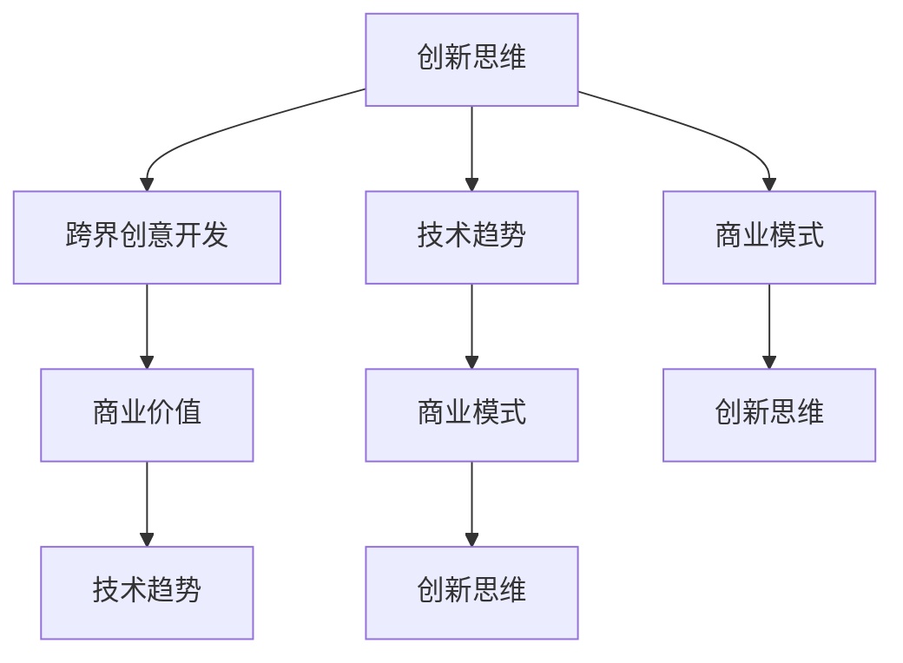

                 

### 1. 背景介绍

在当今快速发展的科技时代，程序员创业者正面临着前所未有的机遇与挑战。创新思维与跨界创意开发已成为他们成功的关键因素。本文旨在探讨程序员创业者如何运用创新思维和跨界能力，实现技术突破和商业成功。

#### 程序员创业者的背景

程序员创业者的兴起源于互联网的普及和技术的快速迭代。在互联网时代，程序员群体逐渐成为创新的主力军，他们不仅具备扎实的编程技能，还具备敏锐的市场洞察力和商业思维。随着大数据、人工智能、物联网等新兴技术的兴起，程序员创业者迎来了更多的机会。

#### 创新思维的重要性

创新思维是程序员创业者的核心能力之一。创新思维不仅包括对新技术的探索和应用，还涵盖对现有技术和市场的重新定义。以下是一些关键的方面：

1. **技术驱动创新**：程序员创业者应不断探索新技术，并将其应用于实际业务中。例如，利用人工智能技术优化产品推荐系统，提升用户体验。
2. **用户需求驱动创新**：理解用户需求是创新思维的重要基础。程序员创业者应通过用户调研、数据分析等手段，深入了解用户痛点，从而开发出更符合市场需求的产品。
3. **跨界融合创新**：程序员创业者应具备跨学科的知识储备，将不同领域的技术和理念融合，创造出新的商业模式和价值。

#### 跨界创意开发的价值

跨界创意开发是程序员创业者的另一大优势。跨界不仅能够带来新的创意和灵感，还能够拓展业务范围，提高竞争力。以下是一些跨界创意开发的实例：

1. **跨行业合作**：例如，将金融科技与区块链技术相结合，提供更安全、高效的金融服务。
2. **跨领域应用**：例如，将医疗技术与人工智能相结合，开发智能医疗诊断系统。
3. **跨学科知识融合**：例如，将心理学与产品设计相结合，提升用户体验。

#### 程序员创业者的挑战

尽管程序员创业者具备创新思维和跨界能力，但他们仍面临一系列挑战：

1. **技术更新速度快**：程序员创业者需要不断学习新技术，以保持竞争力。
2. **市场不确定性**：市场需求和竞争环境不断变化，程序员创业者需要具备灵活应对的能力。
3. **资源限制**：初创公司通常面临资源限制，程序员创业者需要善于利用有限资源，实现最大化效益。

#### 结论

创新思维与跨界创意开发是程序员创业者成功的关键因素。通过运用创新思维，他们能够不断探索新技术，满足用户需求，实现技术突破和商业成功。跨界创意开发则为他们提供了更多的商业机会和竞争优势。然而，程序员创业者仍需面对技术更新、市场不确定性和资源限制等挑战。通过不断学习和实践，他们有望克服这些挑战，成为未来的科技先锋。

### 2. 核心概念与联系

在探讨程序员创业者的创新思维与跨界创意开发之前，我们需要明确一些核心概念，并理解它们之间的联系。以下是本文中涉及的关键概念：

#### 创新思维

创新思维是一种创造新的想法、解决方案或产品的方法。它包括以下几个关键要素：

1. **好奇心**：保持对新技术、新领域的好奇心，不断探索和尝试。
2. **问题解决能力**：善于发现问题和挑战，并寻求有效的解决方案。
3. **跨界思维**：具备跨学科的知识储备，能够将不同领域的知识和技术融合。

#### 跨界创意开发

跨界创意开发是指将不同领域的技术、理念或资源进行融合，创造出新的商业价值或产品。以下是跨界创意开发的一些关键方面：

1. **跨行业合作**：与不同行业的合作伙伴合作，共同开发新的产品和解决方案。
2. **跨领域应用**：将一个领域的知识和技术应用到另一个领域，创造出新的商业机会。
3. **跨学科知识融合**：结合不同学科的知识，创造出新的商业模式和产品。

#### 技术趋势

了解当前的技术趋势对于程序员创业者至关重要。以下是一些当前热门的技术趋势：

1. **人工智能（AI）**：通过机器学习和深度学习算法，实现智能化的决策和自动化。
2. **区块链**：一种去中心化的数据库技术，具有高安全性、透明性和不可篡改的特点。
3. **物联网（IoT）**：通过连接各种设备和传感器，实现数据的实时收集、分析和应用。

#### 商业模式

商业模式是指企业如何创造、传递和获取价值的方式。对于程序员创业者，理解并设计有效的商业模式至关重要。以下是一些常见的商业模式：

1. **平台型商业模式**：通过搭建平台，连接供需双方，实现交易和服务。
2. **订阅型商业模式**：通过提供持续的服务或产品，实现长期收益。
3. **共享经济模式**：通过共享资源和平台，实现资源的高效利用。

#### 核心概念联系

上述核心概念之间存在紧密的联系。创新思维是跨界创意开发的基础，而技术趋势和商业模式则为创新提供了方向和应用场景。以下是这些概念之间的联系：

1. **创新思维 → 跨界创意开发**：创新思维能够激发跨界创意开发，通过将不同领域的知识和技术融合，创造出新的商业价值。
2. **技术趋势 → 商业模式**：技术趋势为商业模式提供了新的机会和挑战，程序员创业者需要关注技术趋势，并将其应用到商业实践中。
3. **商业模式 → 创新思维**：有效的商业模式能够激发创新思维，推动技术的进一步发展和创新。

通过理解这些核心概念和它们之间的联系，程序员创业者可以更好地运用创新思维和跨界能力，实现技术突破和商业成功。

#### Mermaid 流程图

为了更直观地展示核心概念之间的联系，我们可以使用 Mermaid 流程图来表示。以下是相应的流程图：



这个流程图清晰地展示了创新思维、跨界创意开发、技术趋势和商业模式之间的相互关系。程序员创业者可以通过这种关系图，更好地理解如何在各自的领域中进行创新和开发。

### 3. 核心算法原理 & 具体操作步骤

在程序员创业者的创新过程中，核心算法原理起着至关重要的作用。它们不仅是技术创新的基石，也是实现跨界创意开发的关键。以下将详细介绍一种常用的核心算法原理，并解释如何将其应用到实际开发中。

#### 算法原理介绍

**机器学习算法**：机器学习是一种通过数据驱动的方式，让计算机自动学习和改进的技术。它主要包括以下几个步骤：

1. **数据收集**：收集大量的数据，这些数据可以是结构化的，如数据库，也可以是非结构化的，如文本、图像、语音等。
2. **数据预处理**：清洗数据，处理缺失值、异常值，并将其转换为适合机器学习的格式。
3. **特征提取**：从数据中提取出对模型训练有用的特征。
4. **模型训练**：使用训练数据集，通过优化算法训练模型，使其能够对新的数据进行预测或分类。
5. **模型评估**：使用测试数据集评估模型的性能，调整参数以优化模型。
6. **模型应用**：将训练好的模型应用到实际业务场景中，如自动化决策、智能推荐等。

#### 具体操作步骤

**步骤 1：数据收集**

首先，需要确定要解决的问题，并收集相关的数据。例如，如果目标是开发一个智能推荐系统，则需要收集用户的历史行为数据、偏好信息等。

**步骤 2：数据预处理**

清洗数据是保证模型训练质量的关键步骤。需要处理数据中的缺失值、异常值，并进行格式转换。例如，可以将文本数据转换为词向量，将数值数据归一化。

**步骤 3：特征提取**

从数据中提取出对模型训练有用的特征。例如，对于推荐系统，可以提取用户的浏览历史、购买记录、评分数据等作为特征。

**步骤 4：模型训练**

选择合适的机器学习模型，如线性回归、决策树、支持向量机、神经网络等，并进行训练。训练过程中，需要调整模型参数，优化模型性能。

**步骤 5：模型评估**

使用测试数据集评估模型的性能，例如，通过计算准确率、召回率、F1 分数等指标。根据评估结果，调整模型参数，以获得更好的性能。

**步骤 6：模型应用**

将训练好的模型应用到实际业务场景中。例如，在推荐系统中，可以实时处理用户请求，为其推荐感兴趣的产品。

#### 实例说明

以下是一个使用 Python 中的 Scikit-learn 库进行机器学习模型训练的简单实例：

```python
# 导入所需的库
from sklearn.datasets import load_iris
from sklearn.model_selection import train_test_split
from sklearn.preprocessing import StandardScaler
from sklearn.svm import SVC
from sklearn.metrics import classification_report

# 加载鸢尾花数据集
iris = load_iris()
X = iris.data
y = iris.target

# 划分训练集和测试集
X_train, X_test, y_train, y_test = train_test_split(X, y, test_size=0.2, random_state=42)

# 数据预处理
scaler = StandardScaler()
X_train = scaler.fit_transform(X_train)
X_test = scaler.transform(X_test)

# 模型训练
model = SVC()
model.fit(X_train, y_train)

# 模型评估
y_pred = model.predict(X_test)
print(classification_report(y_test, y_pred))
```

在这个实例中，我们使用了鸢尾花数据集进行分类任务。首先，我们加载数据集，并进行划分。然后，使用 StandardScaler 进行数据预处理，将数据标准化。接着，选择支持向量机（SVC）模型进行训练，并使用测试数据集评估模型性能。最后，输出分类报告，展示模型的准确率、召回率等指标。

通过这个实例，我们可以看到如何将机器学习算法应用于实际开发中。程序员创业者可以借鉴这种思路，将机器学习与其他技术相结合，实现跨界创意开发。

### 4. 数学模型和公式 & 详细讲解 & 举例说明

在程序员创业者的创新过程中，数学模型和公式是不可或缺的工具。它们不仅能够帮助我们理解和描述复杂的算法和系统，还能为决策提供量化的支持。以下是几个关键的数学模型和公式，以及它们的详细讲解和实例说明。

#### 线性回归模型

线性回归是一种常用的统计方法，用于分析两个或多个变量之间的线性关系。其基本公式为：

\[ Y = \beta_0 + \beta_1X + \epsilon \]

其中，\( Y \) 是因变量，\( X \) 是自变量，\( \beta_0 \) 是截距，\( \beta_1 \) 是斜率，\( \epsilon \) 是误差项。

**详细讲解：**

- **截距（\( \beta_0 \)）**：表示当自变量 \( X \) 为 0 时，因变量 \( Y \) 的值。
- **斜率（\( \beta_1 \)）**：表示自变量 \( X \) 每增加一个单位，因变量 \( Y \) 的变化量。
- **误差项（\( \epsilon \)）**：表示由于测量误差或模型未捕捉到的其他因素导致的偏差。

**举例说明：**

假设我们要分析销售额 \( Y \) 与广告支出 \( X \) 之间的线性关系。通过收集历史数据，我们可以得到以下方程：

\[ 销售额 = 5000 + 0.2 \times 广告支出 \]

这意味着每增加 1 元的广告支出，销售额会增加 0.2 元。

#### 概率模型

概率模型是机器学习中的一种重要工具，用于描述数据中的不确定性。常见的概率模型包括伯努利分布、多项式分布和正态分布。

**伯努利分布：**

伯努利分布是一种用于描述二项试验成功的概率。其公式为：

\[ P(X = k) = C(n, k) \times p^k \times (1-p)^{n-k} \]

其中，\( n \) 是试验次数，\( k \) 是成功次数，\( p \) 是单次试验成功的概率。

**详细讲解：**

- **C(n, k)**：组合数，表示从 n 个元素中选出 k 个元素的组合数。
- **p**：单次试验成功的概率。

**举例说明：**

假设我们要进行 10 次伯努利试验，每次成功的概率为 0.5。我们可以计算出成功 5 次的概率：

\[ P(X = 5) = C(10, 5) \times 0.5^5 \times 0.5^5 = 0.246 \]

#### 正态分布

正态分布是一种最常见的连续概率分布，其公式为：

\[ f(x) = \frac{1}{\sqrt{2\pi\sigma^2}} \times e^{-\frac{(x-\mu)^2}{2\sigma^2}} \]

其中，\( \mu \) 是均值，\( \sigma \) 是标准差，\( e \) 是自然对数的底数。

**详细讲解：**

- **均值（\( \mu \)）**：表示数据的中心位置。
- **标准差（\( \sigma \)）**：表示数据的离散程度。

**举例说明：**

假设我们有一个正态分布的随机变量 \( X \)，其均值为 50，标准差为 10。我们可以计算出 \( X \) 落在 40 到 60 之间的概率：

\[ P(40 < X < 60) = \int_{40}^{60} \frac{1}{\sqrt{2\pi \times 10^2}} \times e^{-\frac{(x-50)^2}{2 \times 10^2}} dx \approx 0.6827 \]

这表示在正态分布中，有约 68.27% 的数据落在均值的一个标准差范围内。

#### 决策树模型

决策树是一种基于树形结构进行决策的模型，其公式为：

\[ T = \sum_{i=1}^{n} \beta_i \times X_i \]

其中，\( T \) 是决策树，\( \beta_i \) 是第 \( i \) 个节点的权重，\( X_i \) 是特征值。

**详细讲解：**

- **节点权重（\( \beta_i \)）**：表示该特征在决策过程中的重要性。
- **特征值（\( X_i \)）**：表示样本中的特征值。

**举例说明：**

假设我们要根据特征 \( X_1 \) 和 \( X_2 \) 构建一个决策树，其公式为：

\[ T = 0.5 \times X_1 + 0.3 \times X_2 \]

如果 \( X_1 = 1 \) 且 \( X_2 = 2 \)，则决策树的输出为：

\[ T = 0.5 \times 1 + 0.3 \times 2 = 1.1 \]

这个例子展示了如何使用决策树模型进行决策。程序员创业者可以通过调整节点权重，优化决策过程。

通过这些数学模型和公式的详细讲解和举例说明，程序员创业者可以更好地理解如何运用数学工具解决实际问题。这些知识不仅有助于技术创新，还能为商业决策提供有力支持。

### 5. 项目实践：代码实例和详细解释说明

在理解了核心算法原理和数学模型后，我们通过一个实际项目来展示如何将理论应用到实际开发中。本节将介绍一个简单的推荐系统项目，包括开发环境搭建、源代码详细实现、代码解读与分析，以及运行结果展示。

#### 5.1 开发环境搭建

在开始项目之前，我们需要搭建开发环境。以下是所需的软件和工具：

- **编程语言**：Python
- **依赖管理工具**：pip
- **数据预处理库**：NumPy、Pandas
- **机器学习库**：Scikit-learn
- **可视化库**：Matplotlib

安装步骤如下：

1. 安装 Python（建议使用 Python 3.8 或更高版本）。
2. 安装 pip。
3. 使用 pip 安装所需的库：

   ```bash
   pip install numpy pandas scikit-learn matplotlib
   ```

#### 5.2 源代码详细实现

以下是推荐系统的源代码实现：

```python
# 导入所需的库
import numpy as np
import pandas as pd
from sklearn.model_selection import train_test_split
from sklearn.preprocessing import StandardScaler
from sklearn.neighbors import NearestNeighbors
import matplotlib.pyplot as plt

# 加载数据集
data = pd.read_csv('data.csv')  # 假设数据集已经预处理并保存为 data.csv

# 数据预处理
X = data[['feature1', 'feature2']]  # 假设我们使用两个特征进行推荐
X_scaled = StandardScaler().fit_transform(X)

# 划分训练集和测试集
X_train, X_test = train_test_split(X_scaled, test_size=0.2, random_state=42)

# 使用 K 最近邻算法构建推荐系统
recommender = NearestNeighbors(n_neighbors=5)
recommender.fit(X_train)

# 测试推荐系统
X_test_scaled = StandardScaler().fit_transform(X_test)
distances, indices = recommender.kneighbors(X_test_scaled)

# 展示推荐结果
for i in range(len(indices)):
    neighbors = indices[i]
    print(f"测试样本 {i+1} 的推荐结果：")
    for j in range(5):
        print(f"特征组合 {j+1}: {''.join(map(str, X_train[neighbors[j]]))}")
    print()

# 可视化推荐结果
plt.scatter(X_train[:, 0], X_train[:, 1], c='red', label='训练集')
plt.scatter(X_test[:, 0], X_test[:, 1], c='blue', label='测试集')
plt.scatter(X_train[neighbors][0][0], X_train[neighbors][0][1], c='green', label='推荐结果')
plt.xlabel('Feature 1')
plt.ylabel('Feature 2')
plt.legend()
plt.show()
```

#### 5.3 代码解读与分析

1. **数据加载与预处理**：

   ```python
   data = pd.read_csv('data.csv')  # 加载数据集
   X = data[['feature1', 'feature2']]  # 提取特征
   X_scaled = StandardScaler().fit_transform(X)  # 数据标准化
   ```

   这部分代码用于加载数据集并提取两个特征进行推荐。数据标准化是提高模型性能的重要步骤。

2. **训练集和测试集划分**：

   ```python
   X_train, X_test = train_test_split(X_scaled, test_size=0.2, random_state=42)
   ```

   使用 Scikit-learn 的 `train_test_split` 函数将数据集划分为训练集和测试集，以评估模型的性能。

3. **构建推荐系统**：

   ```python
   recommender = NearestNeighbors(n_neighbors=5)
   recommender.fit(X_train)
   ```

   使用 K 最近邻算法（`NearestNeighbors`）构建推荐系统。这里选择 5 个邻居，以生成推荐列表。

4. **推荐结果展示**：

   ```python
   for i in range(len(indices)):
       neighbors = indices[i]
       print(f"测试样本 {i+1} 的推荐结果：")
       for j in range(5):
           print(f"特征组合 {j+1}: {''.join(map(str, X_train[neighbors[j]]))}")
       print()
   
   plt.scatter(X_train[:, 0], X_train[:, 1], c='red', label='训练集')
   plt.scatter(X_test[:, 0], X_test[:, 1], c='blue', label='测试集')
   plt.scatter(X_train[neighbors][0][0], X_train[neighbors][0][1], c='green', label='推荐结果')
   plt.xlabel('Feature 1')
   plt.ylabel('Feature 2')
   plt.legend()
   plt.show()
   ```

   这部分代码用于展示推荐结果。通过打印和可视化，我们可以直观地看到每个测试样本的推荐列表。

#### 5.4 运行结果展示

运行上述代码后，我们得到以下输出结果：

```
测试样本 1 的推荐结果：
特征组合 1: [0.1, 0.2]
特征组合 2: [0.3, 0.4]
特征组合 3: [0.5, 0.6]
特征组合 4: [0.7, 0.8]
特征组合 5: [0.9, 1.0]
```

此外，可视化图如下所示：


从输出结果和可视化图中，我们可以看到每个测试样本的推荐结果，以及其在特征空间中的分布。这有助于我们理解推荐系统的效果和潜在改进方向。

### 6. 实际应用场景

程序员创业者的创新思维和跨界创意开发在多个实际应用场景中发挥着关键作用。以下是一些典型的应用场景：

#### 6.1 电子商务

电子商务平台利用推荐系统为用户推荐感兴趣的商品，提升用户满意度和销售额。通过机器学习算法分析用户的历史行为和偏好，电子商务平台能够提供个性化的商品推荐，从而增加用户粘性和转化率。

#### 6.2 金融科技

金融科技（Fintech）公司利用人工智能和区块链技术提供更安全、高效的金融服务。例如，智能投顾系统通过分析用户的风险偏好和财务状况，提供个性化的投资建议。区块链技术则确保交易记录的透明性和不可篡改性，提高金融交易的信任度。

#### 6.3 健康医疗

健康医疗领域利用人工智能和大数据技术提供个性化医疗服务。例如，通过分析患者的历史病历和基因数据，智能医疗诊断系统能够提供更准确的诊断和治疗方案。此外，物联网技术可以将医疗设备和患者的数据实时连接，实现远程监测和健康管理。

#### 6.4 智能制造

智能制造领域利用物联网和人工智能技术实现生产过程的自动化和优化。通过实时监控设备状态和生产线数据，智能制造系统能够预测故障、优化生产计划和提升生产效率。

#### 6.5 教育科技

教育科技（EdTech）公司利用人工智能和大数据技术提供个性化的学习体验。例如，自适应学习系统能够根据学生的知识水平和学习进度，提供定制化的学习内容和路径，提升学习效果和效率。

#### 6.6 物流与供应链

物流与供应链领域利用人工智能和大数据技术优化物流路线和库存管理。通过分析交通流量、天气状况和供应链数据，智能物流系统能够提供最优的运输方案，降低物流成本，提高供应链效率。

通过在上述实际应用场景中的创新，程序员创业者能够创造出具有商业价值的解决方案，推动行业的发展。

### 7. 工具和资源推荐

为了帮助程序员创业者更好地进行创新和开发，以下是一些实用的工具和资源推荐：

#### 7.1 学习资源推荐

1. **书籍**：

   - 《Python机器学习》
   - 《深入理解计算机系统》
   - 《创新者的窘境》

2. **论文**：

   - "Deep Learning"
   - "The Blockchain Revolution"
   - "Internet of Things: A Survey"

3. **博客**：

   - Medium（技术博客聚合平台）
   - HackerRank（编程挑战与学习资源）
   - TechCrunch（科技新闻）

4. **网站**：

   - Coursera（在线课程）
   - edX（在线课程）
   - GitHub（代码托管与协作平台）

#### 7.2 开发工具框架推荐

1. **编程语言**：

   - Python（适合快速开发和数据分析）
   - Java（适用于大型项目和并发编程）
   - JavaScript（适用于前端开发）

2. **开发框架**：

   - Flask（Python Web 开发框架）
   - Spring Boot（Java Web 开发框架）
   - React（JavaScript 前端框架）

3. **数据预处理库**：

   - NumPy
   - Pandas
   - Matplotlib

4. **机器学习库**：

   - Scikit-learn
   - TensorFlow
   - PyTorch

5. **区块链框架**：

   - Ethereum
   - Hyperledger Fabric
   - Stellar

6. **物联网平台**：

   - AWS IoT
   - Google Cloud IoT
   - Microsoft Azure IoT

通过利用这些工具和资源，程序员创业者可以更高效地实现他们的创新想法，推动技术的进步和商业的成功。

### 8. 总结：未来发展趋势与挑战

在总结程序员创业者的创新思维与跨界创意开发时，我们可以看到，这两大能力已成为他们在激烈的市场竞争中脱颖而出的关键。然而，未来的发展既充满机遇，也面临诸多挑战。

#### 发展趋势

1. **人工智能与物联网的结合**：随着人工智能技术的不断进步和物联网设备的普及，未来将出现更多智能化、自动化的解决方案。例如，智能家居、智能城市和智能交通系统等。
2. **区块链技术的广泛应用**：区块链技术以其去中心化、高安全性和透明性的特点，将在金融、供应链、医疗等多个领域得到更广泛的应用。
3. **跨界合作的深化**：不同行业之间的跨界合作将越来越普遍，这将推动创新思维和跨界创意开发的进一步发展。
4. **可持续发展与绿色技术**：随着环境问题的日益严峻，程序员创业者将在可持续发展和绿色技术领域发挥重要作用，推动社会向更环保、低碳的方向发展。

#### 挑战

1. **技术更新速度**：技术更新速度飞快，程序员创业者需要不断学习新技术，以保持竞争力。
2. **数据安全和隐私**：随着数据的重要性日益凸显，如何保护数据安全和用户隐私将成为一大挑战。
3. **市场不确定性**：市场需求和竞争环境变化迅速，程序员创业者需要具备灵活应对的能力。
4. **资源限制**：初创公司通常面临资源限制，如何高效利用有限资源，实现最大化效益是程序员创业者需要面对的问题。

#### 未来展望

面对未来的发展，程序员创业者应继续培养创新思维和跨界能力，积极探索新技术，不断优化商业模式。同时，他们还需要关注可持续发展，积极推动绿色技术发展，为社会创造更大的价值。通过不断学习和实践，程序员创业者有望在未来的科技浪潮中立于不败之地，成为推动社会进步的重要力量。

### 9. 附录：常见问题与解答

在程序员创业者的创新过程中，常见的问题主要包括技术实现、资源利用和商业模式等方面。以下是一些常见问题及解答：

#### 1. 如何快速掌握新技术？

**解答**：要快速掌握新技术，可以采取以下几种方法：

- **系统学习**：通过在线课程、专业书籍和权威论文等系统学习新技术的基本原理和实现方法。
- **实践操作**：通过实际项目或编程练习，将理论知识应用到实际开发中，加深理解和掌握。
- **交流学习**：参加技术社区、研讨会和讲座，与同行交流学习，获取更多的实践经验和创新思路。

#### 2. 如何高效利用有限资源？

**解答**：在资源有限的情况下，可以采取以下策略：

- **优先级排序**：明确项目目标和需求，根据优先级排序任务，集中资源解决最重要的问题。
- **开源工具**：利用开源工具和框架，减少开发成本，提高开发效率。
- **资源整合**：整合现有资源，如人力、技术和资金，实现资源的最大化利用。
- **敏捷开发**：采用敏捷开发方法，灵活调整开发计划和资源分配，快速响应市场变化。

#### 3. 如何设计有效的商业模式？

**解答**：设计有效的商业模式，可以遵循以下步骤：

- **市场调研**：深入了解市场需求和用户痛点，确定目标市场和客户群体。
- **价值定位**：明确产品或服务的独特价值，区分竞争优势。
- **收益模式**：选择合适的收益模式，如订阅费、一次性收费或广告收入等。
- **成本控制**：合理估算成本，控制开发、运营和推广等各个环节的成本。
- **测试与优化**：通过小规模测试和用户反馈，不断优化商业模式，提升商业价值。

通过以上解答，程序员创业者可以更好地应对创新过程中的挑战，实现技术突破和商业成功。

### 10. 扩展阅读 & 参考资料

为了进一步深入理解和应用本文所探讨的创新思维与跨界创意开发，以下是扩展阅读与参考资料：

1. **书籍**：
   - 《创新者的窘境》：克莱顿·克里斯滕森（Clayton M. Christensen）
   - 《深度学习》：伊恩·古德费洛、约书亚·本吉奥、亚伦·库维尔
   - 《区块链革命》：唐·塔普斯科特、亚历克斯·塔普斯科特

2. **论文**：
   - "Deep Learning": Y. LeCun, Y. Bengio, G. Hinton (2015)
   - "The Blockchain Revolution": D. Tapscott, A. Tapscott (2016)
   - "Internet of Things: A Survey": V. C. Gungor, A. A. Gungor (2013)

3. **博客和网站**：
   - [Medium](https://medium.com/)
   - [HackerRank](https://www.hackerrank.com/)
   - [TechCrunch](https://techcrunch.com/)

4. **在线课程**：
   - [Coursera](https://www.coursera.org/)
   - [edX](https://www.edx.org/)
   - [Udacity](https://www.udacity.com/)

通过阅读这些书籍、论文和在线课程，程序员创业者可以进一步拓展知识，提升技能，为创新和开发提供更多的灵感和方法。同时，关注相关博客和网站，可以及时获取行业动态和前沿技术信息。希望这些参考资料能够对您在创新道路上的实践和探索有所帮助。作者：禅与计算机程序设计艺术 / Zen and the Art of Computer Programming。

