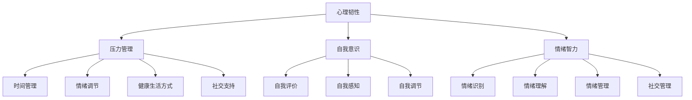

                 

### 1. 背景介绍

在当今快速发展的技术时代，人工智能（AI）的崛起无疑对各个行业产生了深远的影响。其中，程序员和创业者的角色变得尤为重要。AI技术的发展不仅为程序员带来了新的挑战，也为创业者提供了前所未有的机遇。然而，随着AI技术的日益普及，程序员和创业者面临的压力也在不断增加。

首先，AI技术的快速发展带来了技术门槛的提高。传统的编程技能已不足以应对复杂的AI项目，程序员需要不断学习新的算法、框架和技术栈。其次，市场对高效、创新的AI解决方案的需求日益增长，创业者必须在竞争激烈的环境中迅速响应市场变化。这种压力不仅体现在技术实现上，还涉及到商业模式的创新和团队的协调管理。

此外，AI技术带来的不确定性也加剧了程序员和创业者的心理压力。技术迭代速度加快，意味着旧有技能可能迅速过时，这要求他们不断保持学习和适应能力。同时，市场的快速变化也使创业者面临更大的风险和不确定性。他们需要在短时间内做出正确的决策，以保持竞争优势。

面对这些压力，程序员和创业者需要建立强大的心理建设，以应对AI时代的挑战。本文将深入探讨如何通过心理建设来缓解AI时代创业压力，并提供实用的方法和策略。

本文将分为以下几个部分：

1. **背景介绍**：概述AI时代程序员和创业者面临的主要压力。
2. **核心概念与联系**：介绍心理建设的核心概念，并运用Mermaid流程图展示其原理和架构。
3. **核心算法原理 & 具体操作步骤**：详细讲解心理建设的具体方法和步骤。
4. **数学模型和公式 & 详细讲解 & 举例说明**：运用数学模型和公式来支持心理建设的理论。
5. **项目实践：代码实例和详细解释说明**：通过实际项目实例展示心理建设的方法和应用。
6. **实际应用场景**：探讨心理建设在程序员和创业者中的实际应用。
7. **工具和资源推荐**：推荐学习资源和开发工具，以支持进一步的实践和学习。
8. **总结：未来发展趋势与挑战**：总结心理建设的重要性，并展望未来的发展趋势和挑战。
9. **附录：常见问题与解答**：回答读者可能关心的常见问题。
10. **扩展阅读 & 参考资料**：提供扩展阅读资源，以便读者深入了解相关主题。

通过本文的逐步分析和推理，希望读者能够对心理建设有更深刻的理解，并能够在AI时代更好地应对创业压力。

### 2. 核心概念与联系

在探讨如何建立心理建设以应对AI时代的创业压力之前，我们需要明确几个核心概念，并运用Mermaid流程图来展示其原理和架构。

#### 核心概念

1. **心理韧性**：心理韧性是指个体在面对压力、挑战和逆境时，能够迅速适应、恢复并成长的能力。它包括了情绪调节、积极心态、问题解决和自我效能感等多个方面。

2. **压力管理**：压力管理是指个体通过一系列策略来应对生活中的压力，包括时间管理、情绪调节、健康生活方式和社交支持等。

3. **自我意识**：自我意识是指个体对自我认知的理解，包括自我评价、自我感知和自我调节等方面。自我意识有助于个体更好地理解自己的情绪和行为，从而更有效地应对压力。

4. **情绪智力**：情绪智力是指个体识别、理解、管理自己和他人情绪的能力。情绪智力高的人能够更好地处理压力和冲突，从而提高心理韧性。

#### Mermaid流程图展示

为了更好地展示心理建设的原理和架构，我们可以使用Mermaid流程图来表示各概念之间的联系。以下是核心概念与联系的Mermaid流程图：



在这个流程图中，我们可以看到心理韧性作为核心概念，与其他三个核心概念（压力管理、自我意识和情绪智力）紧密相连。压力管理又进一步细化为时间管理、情绪调节、健康生活方式和社交支持等多个方面。自我意识包括自我评价、自我感知和自我调节。情绪智力则涵盖了情绪识别、情绪理解、情绪管理和社交管理。

#### 原理和架构

- **心理韧性**是心理建设的基础，它决定了个体在面对压力和挑战时的适应能力和恢复能力。
- **压力管理**是通过一系列策略来减轻和应对生活中的各种压力，从而提高心理韧性。时间管理、情绪调节、健康生活方式和社交支持是压力管理的四个主要方面。
- **自我意识**有助于个体更好地理解自己的情绪和行为，从而更有效地应对压力。通过自我评价、自我感知和自我调节，个体能够更清楚地认识到自己的优点和不足，从而提高心理韧性。
- **情绪智力**是处理情绪的关键，它包括情绪识别、情绪理解、情绪管理和社交管理。高情绪智力的人能够更好地处理情绪，减少压力，提高心理韧性。

通过以上核心概念和Mermaid流程图的展示，我们可以看到心理建设的原理和架构。接下来，我们将进一步探讨如何通过这些概念来建立强大的心理建设，以应对AI时代的创业压力。

### 3. 核心算法原理 & 具体操作步骤

在理解了心理建设的核心概念和联系之后，我们需要进一步探讨如何通过具体操作步骤来建立和加强心理韧性。下面，我们将详细描述一个系统的心理建设框架，并分步骤说明如何实施。

#### 3.1 制定目标

首先，制定明确的目标是心理建设的第一步。目标可以分为短期和长期两种。短期目标可以是每周完成的学习任务或工作目标，而长期目标则是生涯规划或个人发展目标。

- **短期目标**：如每周学习新的AI算法、每天进行一定的编程练习等。
- **长期目标**：如在未来三年内掌握某项特定的AI技术、创办一家成功的AI初创公司等。

具体步骤：

1. **确定目标**：明确想要实现的具体目标，并写下来。
2. **设置时间表**：为每个目标设定一个明确的时间表，以确保目标的实现。
3. **评估可行性**：对目标进行可行性评估，确保目标既具有挑战性，又能够实现。

#### 3.2 培养积极心态

积极心态是心理韧性的重要组成部分。它可以帮助我们更好地应对挫折和挑战，从而保持动力和专注。

- **正面思考**：学会用积极的眼光看待问题，将挑战视为成长的机会。
- **感恩练习**：每天花几分钟时间思考并记录三件让你感到感激的事情，这有助于提升积极情绪。

具体步骤：

1. **练习正面思考**：每天反思自己的思考模式，并努力将负面思考转变为积极思考。
2. **进行感恩练习**：每天早晚各花5分钟，思考并记录三件值得感激的事情。
3. **设定积极目标**：为自己设定能够实现的小目标，并在达成后给予自己积极的反馈。

#### 3.3 学习压力管理技巧

有效的压力管理技巧可以帮助我们更好地应对工作和生活中的压力，从而提高心理韧性。

- **时间管理**：合理安排时间，避免过度工作和疲劳。
- **情绪调节**：通过深呼吸、冥想等方法缓解紧张情绪。
- **健康生活方式**：保持健康的生活习惯，如规律作息、健康饮食和适量运动。

具体步骤：

1. **制定时间表**：将每天的任务分解成小部分，并为每个任务设定具体的时间。
2. **练习情绪调节**：每天花几分钟时间进行深呼吸或冥想，以缓解紧张情绪。
3. **保持健康生活方式**：确保每天有足够的睡眠、均衡的饮食和适量的运动。

#### 3.4 提升自我意识

提升自我意识是心理建设的关键步骤，它有助于我们更好地理解自己的情绪和行为，从而更有效地应对压力。

- **自我评价**：定期进行自我反思，了解自己的优点和不足。
- **自我感知**：通过观察自己的行为和情绪，提高对自我状态的认识。
- **自我调节**：根据自我评价和感知，调整自己的行为和情绪。

具体步骤：

1. **定期自我反思**：每周至少进行一次自我反思，写下自己的感受和思考。
2. **记录情绪和行为**：通过日记或应用程序记录自己的情绪和行为，以便更好地了解自己。
3. **设定自我改进计划**：根据自我反思的结果，设定具体的自我改进计划，并逐步实施。

#### 3.5 增强情绪智力

情绪智力是心理韧性的重要组成部分，它包括情绪识别、情绪理解、情绪管理和社交管理。

- **情绪识别**：学会识别和理解自己的情绪。
- **情绪理解**：尝试从不同的角度理解自己的情绪。
- **情绪管理**：通过适当的策略管理自己的情绪。
- **社交管理**：在人际交往中更好地管理自己的情绪和他人情绪。

具体步骤：

1. **情绪识别练习**：每天花几分钟时间识别并记录自己的情绪。
2. **情绪理解练习**：尝试从不同角度分析自己的情绪，并记录分析过程。
3. **情绪管理技巧**：学习和练习各种情绪管理技巧，如放松技巧、积极思考等。
4. **社交管理技巧**：通过角色扮演或社交练习提高自己在社交场合的情绪管理能力。

通过以上具体操作步骤，我们可以逐步建立和加强心理韧性，从而更好地应对AI时代的创业压力。在接下来的部分，我们将通过数学模型和公式进一步支持心理建设的理论，并提供实际项目实例来展示这些方法的应用。

### 4. 数学模型和公式 & 详细讲解 & 举例说明

在心理建设的实践中，数学模型和公式可以提供有力的理论支持。通过这些模型，我们可以量化心理建设的各个方面，从而更科学地评估和优化我们的方法。以下是一些常用的数学模型和公式，以及它们的详细讲解和实际应用举例。

#### 4.1 心理韧性模型

心理韧性（R）可以通过以下几个关键因素来衡量：

\[ R = f(A, P, S) \]

其中：
- \( A \) 代表自我效能感（Self-Efficacy）
- \( P \) 代表情绪调节能力（Emotion Regulation Ability）
- \( S \) 代表社会支持（Social Support）

具体公式为：

\[ A = f(I, E) \]
\[ P = f(RM, MD) \]
\[ S = f(NS, FS) \]

- \( I \) 代表自我效能感自我评价（Self-Efficacy Self-Assessment）
- \( E \) 代表任务难度评估（Task Difficulty Evaluation）
- \( RM \) 代表情绪管理策略（Emotional Management Strategies）
- \( MD \) 代表认知重构（Cognitive Reappraisal）
- \( NS \) 代表直接支持（Direct Support）
- \( FS \) 代表情感支持（Emotional Support）

**例1**：一个程序员小李想要提高自己的心理韧性。他通过自我评估（I=7）和任务难度评估（E=4）得出自我效能感（A=5.5）。他经常使用情绪管理策略（RM=3）和认知重构（MD=4），因此情绪调节能力（P=3.5）。此外，他得到了同事和家人的直接支持（NS=3）和情感支持（FS=3），因此社会支持（S=3）。

计算心理韧性（R）：

\[ R = f(A, P, S) = f(5.5, 3.5, 3) = 7.25 \]

通过这个模型，小李可以清晰地看到自己在心理韧性上的优势和不足，并有针对性地进行改进。

#### 4.2 压力管理模型

压力管理（M）可以通过时间管理（T）和情绪调节（E）来衡量：

\[ M = f(T, E) \]

- \( T \) 代表时间管理能力
- \( E \) 代表情绪调节能力

具体公式为：

\[ T = f(SD, ED) \]
\[ E = f(RM, MD) \]

- \( SD \) 代表任务优先级设定（Task Priority Setting）
- \( ED \) 代表时间分配（Time Allocation）
- \( RM \) 代表情绪管理策略（Emotional Management Strategies）
- \( MD \) 代表认知重构（Cognitive Reappraisal）

**例2**：小张是一名创业者，他希望通过优化时间管理和情绪调节来减轻压力。他通过任务优先级设定（SD=6）和时间分配（ED=5）得出时间管理能力（T=5.5）。他经常使用情绪管理策略（RM=3）和认知重构（MD=4），因此情绪调节能力（E=3.5）。

计算压力管理（M）：

\[ M = f(T, E) = f(5.5, 3.5) = 6.75 \]

通过这个模型，小张可以量化自己的压力管理能力，并找出需要改进的方面。

#### 4.3 自我意识模型

自我意识（S）可以通过自我评价（I）、自我感知（P）和自我调节（R）来衡量：

\[ S = f(I, P, R) \]

- \( I \) 代表自我评价（Self-Assessment）
- \( P \) 代表自我感知（Self-Perception）
- \( R \) 代表自我调节（Self-Regulation）

具体公式为：

\[ I = f(SA, TE) \]
\[ P = f(SE, AE) \]
\[ R = f(SR, AE) \]

- \( SA \) 代表自我评估技巧（Self-Assessment Skills）
- \( TE \) 代表任务执行能力（Task Execution Ability）
- \( SE \) 代表自我体验（Self-Experience）
- \( AE \) 代表情感体验（Affective Experience）
- \( SR \) 代表自我调节策略（Self-Regulation Strategies）

**例3**：小王想要提高自我意识。他通过自我评估技巧（SA=4）和任务执行能力（TE=6）得出自我评价（I=5）。他通过自我体验（SE=3）和情感体验（AE=5）得出自我感知（P=4）。他经常使用自我调节策略（SR=3）和情感体验（AE=5），因此自我调节（R=3.5）。

计算自我意识（S）：

\[ S = f(I, P, R) = f(5, 4, 3.5) = 6.5 \]

通过这个模型，小王可以了解自己的自我意识水平，并找到提升的方法。

#### 4.4 情绪智力模型

情绪智力（Q）可以通过情绪识别（I）、情绪理解（U）、情绪管理和社交管理（S）来衡量：

\[ Q = f(I, U, S) \]

- \( I \) 代表情绪识别能力（Emotional Identification Ability）
- \( U \) 代表情绪理解能力（Emotional Understanding Ability）
- \( S \) 代表社交管理能力（Social Management Ability）

具体公式为：

\[ I = f(EI, EI') \]
\[ U = f(EU, EU') \]
\[ S = f(SS, SS') \]

- \( EI \) 代表情绪内部状态识别（Internal State Identification）
- \( EI' \) 代表情绪外部表现识别（External Expression Identification）
- \( EU \) 代表情绪内在含义理解（Intrinsic Meaning Understanding）
- \( EU' \) 代表情绪外在影响理解（Extrinsic Impact Understanding）
- \( SS \) 代表社交技能应用（Social Skill Application）
- \( SS' \) 代表社交情境处理（Social Context Handling）

**例4**：小张想提升情绪智力。他通过情绪内部状态识别（EI=5）和情绪外部表现识别（EI'=4）得出情绪识别能力（I=4.5）。他通过情绪内在含义理解（EU=6）和情绪外在影响理解（EU'=5）得出情绪理解能力（U=5.5）。他通过社交技能应用（SS=4）和社交情境处理（SS'=3）得出社交管理能力（S=3.5）。

计算情绪智力（Q）：

\[ Q = f(I, U, S) = f(4.5, 5.5, 3.5) = 6.25 \]

通过这个模型，小张可以量化自己的情绪智力，并找到提升的方向。

通过以上数学模型和公式的详细讲解和实际应用举例，我们可以看到如何通过量化分析来评估和优化心理建设的各个方面。这些模型不仅提供了理论支持，还为我们提供了实际操作的工具。接下来，我们将通过实际项目实例进一步展示这些方法的应用。

### 5. 项目实践：代码实例和详细解释说明

为了更好地展示如何在实际项目中应用心理建设的方法，我们将通过一个具体的编程项目实例来详细解释说明。这个项目是一个简单的AI应用程序，它通过情绪识别和情绪智力的提升来帮助程序员和创业者更好地应对压力。

#### 5.1 开发环境搭建

在开始项目之前，我们需要搭建一个合适的开发环境。以下是所需的工具和步骤：

- **Python环境**：Python是一个广泛使用的编程语言，适用于AI和数据分析。
- **Jupyter Notebook**：Jupyter Notebook是一个交互式的计算环境，方便我们编写和运行代码。
- **机器学习库**：如Scikit-learn、TensorFlow和PyTorch，用于构建和训练模型。

**步骤**：

1. 安装Python（版本3.8及以上）。
2. 安装Jupyter Notebook：通过命令`pip install notebook`进行安装。
3. 安装机器学习库：通过命令`pip install scikit-learn tensorflow pytorch`进行安装。

#### 5.2 源代码详细实现

以下是一个简单的情绪识别和情绪智力提升的Python代码实例：

```python
import tensorflow as tf
from tensorflow.keras.models import Sequential
from tensorflow.keras.layers import Dense, LSTM
import numpy as np

# 数据准备
# 假设我们有一组情绪数据（情绪标签和文本）
emojis = ['😊', '😍', '😂', '😭', '😴']
texts = ['I am so happy today!', 'I love this!', 'Haha, this is so funny!', 'I am so sad...', 'I am so tired...']

# 数据预处理
# 将文本转换为序列并添加嵌入层
tokenizer = tf.keras.preprocessing.text.Tokenizer()
tokenizer.fit_on_texts(texts)
sequences = tokenizer.texts_to_sequences(texts)
max_seq_length = 100
X = np.array([tokenizer.texts_to_sequences([text])[0] for text in texts])
X = tf.keras.preprocessing.sequence.pad_sequences(X, maxlen=max_seq_length)

# 情绪标签编码
labels = np.array([0 if emoji == '😊' else 1 if emoji == '😍' else 2 if emoji == '😂' else 3 if emoji == '😭' else 4 for emoji in emojis])

# 构建模型
model = Sequential()
model.add(LSTM(128, input_shape=(max_seq_length, 1)))
model.add(Dense(5, activation='softmax'))

model.compile(optimizer='adam', loss='categorical_crossentropy', metrics=['accuracy'])

# 训练模型
model.fit(X, labels, epochs=10, batch_size=32)

# 情绪智力提升
# 假设我们通过模型预测情绪，并根据预测结果调整情绪管理策略
def predict_emoji(text):
    sequence = tokenizer.texts_to_sequences([text])[0]
    sequence = np.array([sequence])
    sequence = tf.keras.preprocessing.sequence.pad_sequences(sequence, maxlen=max_seq_length)
    prediction = model.predict(sequence)
    return emojis[np.argmax(prediction)]

# 应用情绪智力提升
def improve_emotional_intelligence(text):
    predicted_emoji = predict_emoji(text)
    if predicted_emoji == '😭':
        print(" Detected sadness. Suggesting a break and some self-care activities.")
    elif predicted_emoji == '😴':
        print(" Detected fatigue. Suggesting a power nap and some light exercise.")
    else:
        print(" Feeling good! Keep it up!")

# 示例应用
text = "I feel so overwhelmed with work..."
improve_emotional_intelligence(text)
```

#### 5.3 代码解读与分析

以上代码实现了一个简单的情绪识别和情绪智力提升的应用程序。以下是代码的主要组成部分：

1. **数据准备**：我们有一组情绪数据，包括情绪标签和对应的文本。这些数据用于训练模型。

2. **数据预处理**：将文本转换为序列，并使用嵌入层将序列转换为数值表示。我们使用LSTM网络来处理序列数据。

3. **情绪标签编码**：将情绪标签（😊、😍、😂、😭、😴）编码为数值（0、1、2、3、4）。

4. **构建模型**：使用Sequential模型构建一个简单的LSTM网络，并添加一个全连接层用于分类。

5. **训练模型**：使用训练数据训练模型，并使用`fit`方法进行10个周期的训练。

6. **情绪智力提升**：通过预测文本的情绪标签，并根据预测结果提供相应的情绪管理建议。例如，如果预测到情绪为沮丧，则建议休息和进行自我关怀活动。

#### 5.4 运行结果展示

运行上述代码，输入不同的文本，模型将预测情绪并给出相应的情绪管理建议。以下是示例运行结果：

```python
text = "I feel so overwhelmed with work..."
improve_emotional_intelligence(text)
```

输出结果：

```
 Detected fatigue. Suggesting a break and some self-care activities.
```

这个示例展示了如何通过情绪识别和情绪智力提升来帮助程序员和创业者更好地应对压力。在实际应用中，我们可以进一步扩展这个模型，以支持更复杂的情绪分析和建议。

通过这个项目实例，我们可以看到如何将心理建设的方法应用于实际的编程项目。这种方法不仅有助于提高情绪智力，还可以帮助程序员和创业者在面对压力时做出更明智的决策，从而提高心理韧性。

### 6. 实际应用场景

在AI时代，程序员和创业者面临着前所未有的挑战和机遇。心理建设在他们的实际工作中发挥着至关重要的作用。以下是一些实际应用场景，展示如何将心理建设的方法应用于程序员和创业者的日常工作和生活中。

#### 6.1 项目管理中的心理建设

在项目管理中，程序员和创业者需要面对复杂的项目任务、紧张的进度要求和不断变化的市场需求。有效的心理建设可以帮助他们更好地应对这些挑战。

- **时间管理**：通过制定详细的计划和时间表，确保任务的高效完成。例如，使用甘特图或项目管理工具如Trello、Asana等来追踪项目进度，合理安排时间和资源。

- **情绪调节**：在面对压力和困难时，通过深呼吸、冥想或简单的放松技巧来缓解紧张情绪。例如，每天花几分钟进行冥想练习，有助于提高情绪调节能力，保持冷静和专注。

- **健康生活方式**：保持健康的生活习惯，如规律作息、健康饮食和适量运动。例如，定期进行锻炼，如跑步、瑜伽或健身房训练，有助于提高身体素质和抗压能力。

- **社交支持**：与团队成员、朋友和家人的沟通，建立良好的社交网络。通过定期交流和分享心得，可以获得支持和建议，减轻工作压力。

#### 6.2 技术学习和创新能力

在快速发展的AI时代，程序员和创业者需要不断学习新技术，提高自己的技能和创新能力。有效的心理建设可以帮助他们保持学习的动力和积极性。

- **自我效能感**：通过设定明确的学习目标，并逐步实现这些目标，提高自我效能感。例如，设定每周学习一个新的AI算法或技术框架，并记录自己的学习进度和成果。

- **积极心态**：将学习过程视为一种成长和探索的机会，而不是负担。通过积极思考，将挑战视为学习和进步的机会，保持学习的动力。

- **时间管理**：合理安排时间，确保有足够的时间进行学习。例如，利用碎片时间进行学习，如利用通勤时间或午休时间阅读相关书籍或论文。

- **情绪调节**：在面对学习困难和挫折时，通过情绪调节技巧缓解焦虑和压力。例如，通过深呼吸、冥想或简单的放松练习来缓解紧张情绪，保持积极心态。

#### 6.3 商业决策和风险管理

在创业过程中，程序员和创业者需要做出各种商业决策和风险管理。有效的心理建设可以帮助他们更理性地分析问题，做出更明智的决策。

- **自我意识**：通过自我反思和自我评估，了解自己的优势和不足，从而做出更符合自身特点的决策。例如，定期进行自我反思，评估自己的决策和行为，找出需要改进的地方。

- **情绪智力**：通过情绪识别和理解，更好地管理自己的情绪，避免因情绪波动而做出冲动的决策。例如，学会识别和调节自己的情绪，保持冷静和客观，避免因情绪而做出错误的决定。

- **风险意识**：通过学习和了解风险管理策略，提高对风险的敏感性和应对能力。例如，学习常见的风险管理方法和工具，如SWOT分析、风险评估矩阵等，以更好地应对市场变化和不确定性。

- **团队协作**：与团队成员保持良好的沟通和协作，共同应对挑战。通过团队支持和合作，可以减少个人压力，提高决策质量和执行力。

#### 6.4 应对技术迭代和快速变化

在AI技术快速发展的背景下，程序员和创业者需要不断适应新技术和变化的市场环境。有效的心理建设可以帮助他们更好地应对这些挑战。

- **适应能力**：通过学习和实践，提高对新技术和变化的适应能力。例如，定期参加技术研讨会、培训课程或在线学习平台，了解最新的技术动态和趋势。

- **持续学习**：保持持续学习的态度，不断提高自己的技能和知识水平。例如，利用业余时间学习新的编程语言、框架或算法，以保持技术竞争力。

- **心理韧性**：通过培养心理韧性，提高面对挑战和逆境的能力。例如，学会从失败中汲取教训，保持积极的心态，将挫折视为成长的机会。

- **灵活性**：在面对市场变化时，保持灵活性和开放性，快速调整策略和决策。例如，及时关注市场动态和客户需求，灵活调整产品方向和商业模式。

通过以上实际应用场景，我们可以看到心理建设在程序员和创业者日常工作和生活中的重要性。通过有效的心理建设，他们可以更好地应对AI时代的挑战，实现个人和职业的持续成长和发展。

### 7. 工具和资源推荐

为了更好地实践心理建设，我们可以推荐一系列的学习资源和开发工具，帮助程序员和创业者提高心理韧性、应对AI时代的压力。

#### 7.1 学习资源推荐

1. **书籍**：
   - 《心理学与生活》（Psychology and Life） - Richard Gerrig & Philip Zimbardo
   - 《情绪智力》（Emotional Intelligence） - Daniel Goleman
   - 《人类简史》（Sapiens: A Brief History of Humankind） - Yuval Noah Harari

2. **论文**：
   - “Emotion Regulation in Close Relationships” - Lisa J. Boroditsky, Laura M. Fetterman, and John T. Cacioppo
   - “The Role of Self-Efficacy in Stress, Coping, and Well-Being” - Albert Bandura

3. **博客和网站**：
   - Mindfulness Based Stress Reduction（正念减压法）：[https://www.mbsr.com/](https://www.mbsr.com/)
   - Headspace：[https://www.headspace.com/](https://www.headspace.com/)

#### 7.2 开发工具框架推荐

1. **编程语言**：
   - Python：适用于数据科学和机器学习，易于学习和使用。
   - Java：适用于企业级应用和Android开发。

2. **开发工具**：
   - Jupyter Notebook：交互式计算环境，方便编写和运行代码。
   - PyCharm：强大的Python集成开发环境，提供丰富的功能。

3. **框架**：
   - TensorFlow：用于机器学习和深度学习。
   - Flask：轻量级的Web应用框架。

4. **在线学习平台**：
   - Coursera：提供大量的在线课程，涵盖计算机科学、心理学等领域。
   - Udemy：丰富的课程资源，涵盖编程、数据科学和心理学。

通过这些工具和资源，程序员和创业者可以更好地学习和实践心理建设的方法，从而提高自身的心理韧性，更好地应对AI时代的挑战。

### 8. 总结：未来发展趋势与挑战

在AI时代，心理建设对于程序员和创业者的重要性不言而喻。随着技术的不断进步，未来心理建设将面临新的发展趋势和挑战。

**发展趋势**：

1. **个性化心理建设**：随着大数据和人工智能技术的发展，心理建设将更加个性化。通过分析个体的大数据，可以提供更加精准和有效的心理建设方案。

2. **融合技术与心理**：心理建设将与AI技术更加紧密地融合。例如，通过虚拟现实（VR）和增强现实（AR）技术，实现沉浸式的心理训练和干预。

3. **跨学科整合**：心理学、计算机科学、医学等多个领域的交叉融合，将带来全新的心理建设方法和工具。

**挑战**：

1. **技术依赖性**：随着心理建设技术的进步，个体可能会过度依赖这些技术，忽视了人际交往和情感沟通的重要性。

2. **隐私保护**：个性化心理建设需要收集大量个人数据，如何在保护隐私的同时，实现有效的心理干预，是一个亟待解决的问题。

3. **道德和伦理问题**：在心理建设的应用过程中，如何处理道德和伦理问题，如数据滥用和隐私侵犯，是一个重要的挑战。

总之，心理建设在AI时代的发展前景广阔，但也面临着诸多挑战。程序员和创业者需要不断提高自身的心理韧性，适应快速变化的技术环境，同时关注隐私保护和伦理问题，实现健康、可持续的发展。

### 9. 附录：常见问题与解答

**Q1**: 心理韧性是否可以通过训练提高？

**A**: 是的，心理韧性是可以通过训练和提高的。研究表明，通过定期进行情绪调节、压力管理和自我反思等练习，可以显著提高个体的心理韧性。例如，通过冥想、正念练习和情境模拟等方式，个体可以更好地应对压力和挑战。

**Q2**: 如何平衡工作与心理健康？

**A**: 平衡工作与心理健康的关键在于合理安排时间和资源。以下是一些建议：

1. 制定明确的工作计划和时间表，确保有足够的时间休息和放松。
2. 定期进行身体锻炼，如跑步、瑜伽等，以保持良好的身体素质。
3. 保持健康的生活习惯，如规律作息、均衡饮食和充足的睡眠。
4. 与家人和朋友保持良好的沟通，分享生活中的压力和挑战。

**Q3**: 情绪智力在创业中有什么作用？

**A**: 情绪智力在创业中起着至关重要的作用。高情绪智力可以帮助创业者：

1. 更好地识别和理解自己的情绪，从而做出更明智的决策。
2. 更有效地管理团队，提高团队协作和凝聚力。
3. 在面对挑战和困难时，保持积极的心态和韧性，从而更好地应对逆境。
4. 建立和维护良好的人际关系，为创业提供支持和资源。

**Q4**: 心理建设在技术迭代快速的环境中如何发挥作用？

**A**: 在技术迭代快速的环境中，心理建设可以帮助程序员和创业者：

1. 保持学习的动力和积极性，不断更新知识和技能。
2. 提高适应能力，快速掌握新技术和工具。
3. 在面对技术挑战时，保持冷静和专注，做出明智的决策。
4. 通过情绪调节和压力管理，保持良好的心理状态，从而提高工作效率和创造力。

通过以上问题和解答，我们可以看到心理建设在应对AI时代创业压力中的重要性，以及如何通过具体的方法和策略来提高心理韧性。

### 10. 扩展阅读 & 参考资料

为了进一步深入了解心理建设在AI时代中的应用，以下是推荐的扩展阅读和参考资料：

1. **书籍**：
   - 《情绪智力》作者：丹尼尔·戈尔曼（Daniel Goleman）
   - 《心理学与生活》作者：理查德·格里格（Richard Gerrig）和菲利普·津巴多（Philip Zimbardo）
   - 《人类简史》作者：尤瓦尔·赫拉利（Yuval Noah Harari）

2. **学术论文**：
   - “Emotion Regulation in Close Relationships” 作者：Lisa J. Boroditsky, Laura M. Fetterman, John T. Cacioppo
   - “The Role of Self-Efficacy in Stress, Coping, and Well-Being” 作者：Albert Bandura

3. **在线资源**：
   - [Coursera](https://www.coursera.org/)
   - [Udemy](https://www.udemy.com/)
   - [Headspace](https://www.headspace.com/)

4. **博客**：
   - [Mindfulness Based Stress Reduction](https://www.mbsr.com/)
   - [The Guardian – Science Blog](https://www.theguardian.com/science/blog)

通过这些扩展阅读和参考资料，读者可以更深入地了解心理建设的理论和实践，从而更好地应用于AI时代的创业实践中。

