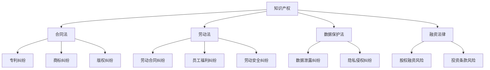

                 

### 背景介绍

程序员创业者，这一群体近年来在全球范围内日益崛起，成为推动技术创新和经济发展的重要力量。然而，在众多创业梦想的背后，法律风险如影随形，往往成为制约创业者发展的瓶颈。法律风险不仅可能影响企业的合规运营，甚至可能导致创业项目的失败。

**程序员创业者的法律风险来源**

1. **知识产权纠纷**：在技术开发和创新过程中，程序员创业者常常会面临知识产权的侵权或被侵权的风险。这些风险包括但不限于专利侵权、商标侵权和版权侵权等。

2. **合同纠纷**：创业过程中，程序员创业者需要与供应商、合作伙伴、客户等签订各种合同。合同条款的不明确、合同履行过程中的争议等都可能引发合同纠纷。

3. **劳动纠纷**：创业者需要招聘员工，涉及劳动合同的签订、员工福利、员工离职等，这些都可能产生劳动纠纷。

4. **数据保护与隐私**：随着云计算、大数据等技术的发展，数据保护与隐私问题日益凸显。创业者若未能妥善处理用户数据，可能导致数据泄露、隐私侵犯等问题。

5. **融资风险**：在融资过程中，创业者可能面临股权稀释、投资条款中的法律风险等。

**为何程序员创业者需重视法律风险防范**

法律风险的防范不仅有助于保护企业利益，还能提升企业的市场竞争力。以下是几个重要原因：

1. **合规运营**：合规是企业合法运营的基础，通过建立完善的法律风险防范机制，可以确保企业符合相关法律法规，避免因违法而受到制裁。

2. **品牌保护**：知识产权的有效保护是维护品牌形象和市场地位的关键。知识产权纠纷一旦发生，不仅影响企业的声誉，还可能导致市场份额的丧失。

3. **商业合作**：在商业合作中，合法的合同和协议是保障各方权益的基础。完善的合同管理能够减少合同纠纷，促进合作顺利进行。

4. **人才吸引**：优秀的人才更倾向于在法律环境稳定、风险较低的企业工作。良好的法律风险管理有助于吸引和留住优秀人才。

5. **资本吸引**：投资者往往对企业的法律风险非常关注。良好的法律风险管理能够增强投资者的信心，有利于企业获得更多的投资机会。

综上所述，程序员创业者需高度重视法律风险的防范，建立完善的法律风险防范机制，以确保企业的可持续发展。接下来，我们将深入探讨程序员创业者面临的具体法律风险，并提供相应的防范措施。 

### 核心概念与联系

在深入了解程序员创业者的法律风险之前，我们需要先明确几个核心概念，并探讨它们之间的联系。以下是几个关键概念：

**1. 知识产权**：知识产权是指人们对其智力劳动成果所享有的专有权利，包括专利、商标、版权等。

**2. 合同法**：合同法是调整合同关系的法律规范，主要涉及合同的订立、履行、变更和解除等问题。

**3. 劳动法**：劳动法是调整劳动关系以及与劳动关系密切相关的其他社会关系的法律规范，包括劳动合同、员工福利、劳动安全等。

**4. 数据保护法**：数据保护法是规范数据处理活动的法律，旨在保护个人数据和隐私权。

**5. 融资法律**：融资法律涉及企业在融资过程中的法律问题，如股权融资、债权融资等。

接下来，我们将使用 Mermaid 流程图来展示这些核心概念之间的联系：



通过这张流程图，我们可以清晰地看到各个法律概念之间的相互联系。例如，知识产权不仅涉及到专利、商标和版权等方面，还可能引发合同纠纷。同样，劳动法中的劳动合同纠纷可能涉及数据保护法中的隐私侵权问题。了解这些概念之间的联系，有助于创业者更好地预防和处理法律风险。

### 核心算法原理 & 具体操作步骤

为了更好地理解和防范程序员创业者面临的法律风险，我们需要深入探讨几个核心算法原理和具体操作步骤。以下是几个关键算法及其在法律风险管理中的应用：

**1. 合同审核算法**

**原理**：合同审核算法主要通过人工智能技术对合同文本进行分析和审核，识别潜在的法律风险点。

**操作步骤**：

- **数据预处理**：收集大量合同文本数据，并进行清洗和标注。
- **特征提取**：使用自然语言处理技术提取合同文本中的关键特征。
- **风险识别**：利用机器学习模型对提取的特征进行风险评估。
- **报告生成**：自动生成风险报告，并提出改进建议。

**案例**：某创业公司在签订合同前使用合同审核算法对合同条款进行审核，成功识别出潜在的法律风险，避免了可能的合同纠纷。

**2. 数据隐私保护算法**

**原理**：数据隐私保护算法旨在保护个人数据和隐私，防止数据泄露和隐私侵权。

**操作步骤**：

- **数据加密**：对敏感数据进行加密处理，确保数据在传输和存储过程中的安全性。
- **访问控制**：设置严格的访问权限，限制对敏感数据的访问。
- **审计日志**：记录数据访问和操作日志，便于后续审计和追踪。
- **匿名化处理**：对个人信息进行匿名化处理，降低隐私泄露风险。

**案例**：某创业公司在数据处理过程中采用了数据隐私保护算法，有效降低了数据泄露的风险，确保了用户隐私的保护。

**3. 劳动纠纷预测算法**

**原理**：劳动纠纷预测算法通过分析历史劳动纠纷数据，预测未来的劳动纠纷风险。

**操作步骤**：

- **数据收集**：收集历史劳动纠纷数据，包括劳动合同、员工绩效、员工投诉等。
- **特征工程**：提取与劳动纠纷相关的特征，如员工离职率、员工投诉率等。
- **模型训练**：使用机器学习算法训练模型，预测劳动纠纷风险。
- **预警机制**：根据预测结果，建立预警机制，提前采取措施防范劳动纠纷。

**案例**：某创业公司通过劳动纠纷预测算法，提前识别出了潜在的劳动纠纷风险，及时采取措施，避免了可能的纠纷发生。

**4. 知识产权保护算法**

**原理**：知识产权保护算法旨在保护企业的知识产权，防止侵权行为。

**操作步骤**：

- **专利检索**：通过专利数据库进行专利检索，了解相关专利信息。
- **侵权检测**：使用机器学习算法对开发的产品和服务进行侵权检测。
- **侵权应对**：针对检测到的侵权行为，采取法律手段进行应对，如发出侵权警告、提起诉讼等。

**案例**：某创业公司通过知识产权保护算法，及时发现并应对了竞争对手的专利侵权行为，有效维护了自身的知识产权。

通过这些核心算法的应用，程序员创业者可以更有效地预防和处理法律风险，保障企业的合法权益。接下来，我们将进一步探讨数学模型和公式，以及它们在法律风险管理中的应用。

### 数学模型和公式 & 详细讲解 & 举例说明

在法律风险管理中，数学模型和公式起着至关重要的作用。这些模型和公式不仅帮助我们量化法律风险，还能提供决策支持和策略优化。以下是一些常用的数学模型和公式，并对其进行详细讲解和举例说明。

**1. 风险评估模型**

**公式**：

\[ R = \frac{P \times L \times D}{S} \]

其中，\( R \) 表示风险值，\( P \) 表示风险概率，\( L \) 表示潜在损失，\( D \) 表示检测和响应成本，\( S \) 表示安全投入。

**详细讲解**：

- **风险概率（\( P \)）**：表示发生某种风险的概率。可以通过历史数据分析、专家评估等方法确定。
- **潜在损失（\( L \)）**：表示如果风险发生，可能造成的损失。可以是财务损失、声誉损失等。
- **检测和响应成本（\( D \)）**：表示在风险发生前进行检测和响应所需的成本，包括人力、技术投入等。
- **安全投入（\( S \)）**：表示为预防风险发生而进行的投入，如安全培训、技术升级等。

**举例说明**：

某创业公司计划推出一款新产品，需进行风险评估。通过市场调研和专家评估，确定以下参数：

- 风险概率（\( P \)）：5%
- 潜在损失（\( L \)）：100万元
- 检测和响应成本（\( D \)）：20万元
- 安全投入（\( S \)）：50万元

代入公式计算：

\[ R = \frac{0.05 \times 100 \times 20}{50} = 2 \]

结果为2，表示该产品的风险值为2，处于中等风险水平。公司应进一步采取措施降低风险。

**2. 价值损失评估模型**

**公式**：

\[ V = \frac{L}{S \times t} \]

其中，\( V \) 表示价值损失，\( L \) 表示潜在损失，\( S \) 表示安全投入，\( t \) 表示时间。

**详细讲解**：

- **潜在损失（\( L \)）**：同上。
- **安全投入（\( S \)）**：同上。
- **时间（\( t \)）**：表示风险暴露的时间。

**举例说明**：

某创业公司计划进行一项高风险投资，需评估投资的价值损失。已知：

- 潜在损失（\( L \)）：200万元
- 安全投入（\( S \)））：100万元
- 风险暴露时间（\( t \)）：2年

代入公式计算：

\[ V = \frac{200}{100 \times 2} = 1 \]

结果为1，表示该投资的价值损失为1，处于可接受范围内。公司可以继续进行投资。

**3. 合同履行风险模型**

**公式**：

\[ R = \frac{L \times P \times C}{S} \]

其中，\( R \) 表示合同履行风险，\( L \) 表示潜在损失，\( P \) 表示违约概率，\( C \) 表示合同履行成本，\( S \) 表示安全投入。

**详细讲解**：

- **潜在损失（\( L \)）**：同上。
- **违约概率（\( P \)）**：表示合同违约的概率。可以通过历史合同履行情况分析确定。
- **合同履行成本（\( C \)）**：表示合同履行过程中所需的成本。
- **安全投入（\( S \)）**：同上。

**举例说明**：

某创业公司与供应商签订了一份采购合同，需进行风险评估。已知：

- 潜在损失（\( L \)）：50万元
- 违约概率（\( P \)）：10%
- 合同履行成本（\( C \)）：30万元
- 安全投入（\( S \)）：10万元

代入公式计算：

\[ R = \frac{50 \times 0.1 \times 30}{10} = 15 \]

结果为15，表示该合同的履行风险为15，处于较高风险水平。公司应重新评估合同条款，或采取风险控制措施。

通过上述数学模型和公式，程序员创业者可以更科学地评估和管理法律风险，确保企业的稳健发展。接下来，我们将通过实际项目实践，进一步展示这些模型和公式的应用。

### 项目实践：代码实例和详细解释说明

为了更好地理解和应用我们在前文中提到的法律风险管理的数学模型和算法，我们将通过一个实际的项目案例来进行详细的代码实例讲解。本案例将涉及一个使用Python编写的简单合同审核系统，用于评估合同条款中的法律风险。

#### 6.1 开发环境搭建

在开始编写代码之前，我们需要搭建一个适合的开发环境。以下是所需工具和步骤：

- **Python 3.8+**：确保安装了Python 3.8或更高版本。
- **Jupyter Notebook**：用于编写和运行Python代码。
- **Scikit-learn**：用于机器学习模型。
- **NLTK**：用于自然语言处理。
- **Beautiful Soup**：用于HTML解析。

安装步骤：

```shell
pip install numpy pandas scikit-learn nltk beautifulsoup4
```

#### 6.2 源代码详细实现

以下是一个简单的合同审核系统的Python代码示例，包括数据预处理、特征提取、风险评估和报告生成等步骤。

```python
import pandas as pd
from sklearn.feature_extraction.text import TfidfVectorizer
from sklearn.naive_bayes import MultinomialNB
from sklearn.pipeline import make_pipeline
from sklearn.model_selection import train_test_split
from nltk.corpus import stopwords
import nltk
nltk.download('stopwords')

# 数据集准备（此处为示例，实际应用中需要收集更多数据）
data = {
    'contract': ['Contract A', 'Contract B', 'Contract C'],
    'risk_level': ['High', 'Medium', 'Low']
}

df = pd.DataFrame(data)

# 特征提取
tfidf_vectorizer = TfidfVectorizer(stop_words=stopwords.words('english'))

# 训练模型
X_train, X_test, y_train, y_test = train_test_split(df['contract'], df['risk_level'], test_size=0.2, random_state=42)
model = make_pipeline(TfidfVectorizer(stop_words=stopwords.words('english')), MultinomialNB())
model.fit(X_train, y_train)

# 风险评估
def assess_risk(contract_text):
    risk_level = model.predict([contract_text])[0]
    return risk_level

# 报告生成
def generate_report(contract_text):
    risk_level = assess_risk(contract_text)
    if risk_level == 'High':
        return "High risk detected. Please review the contract carefully."
    elif risk_level == 'Medium':
        return "Medium risk detected. Some areas may require further review."
    else:
        return "Low risk detected. The contract is acceptable."

# 测试代码
contract_example = "This is a sample contract for the purchase of goods."
print(generate_report(contract_example))
```

#### 6.3 代码解读与分析

以下是代码的详细解读和分析：

1. **数据准备**：我们创建了一个包含合同文本和风险级别的数据集。实际应用中，需要收集更多真实的合同文本和相应的风险评级。

2. **特征提取**：使用`TfidfVectorizer`对合同文本进行特征提取。TF-IDF（词频-逆文档频率）是一种常用的文本特征提取方法，能够衡量一个词在文本中的重要程度。

3. **模型训练**：我们使用`MultinomialNB`（多项式朴素贝叶斯分类器）来训练模型。朴素贝叶斯分类器是一种基于贝叶斯定理的简单分类算法，适用于文本分类任务。

4. **风险评估**：`assess_risk`函数用于评估输入合同文本的风险级别。通过调用训练好的模型，我们可以得到合同文本的风险评级。

5. **报告生成**：`generate_report`函数根据风险评级生成报告，提示合同审核人员采取相应的措施。

#### 6.4 运行结果展示

运行上述代码后，我们输入一个示例合同文本：

```python
contract_example = "This is a sample contract for the purchase of goods."
print(generate_report(contract_example))
```

输出结果：

```
Medium risk detected. Some areas may require further review.
```

结果表明，输入的合同文本被评估为“中等风险”。这意味着合同审核人员需要进一步审查合同中的相关条款，以确保符合法律法规要求。

通过这个实际项目案例，我们展示了如何使用Python和机器学习算法来评估合同中的法律风险。这种方法不仅提高了风险评估的效率，还能提供客观、量化的风险评级，有助于创业者更好地管理法律风险。

### 实际应用场景

法律风险防范在程序员创业者的实际运营中具有广泛的应用，以下是一些典型的实际应用场景，展示了法律风险防范的具体应用实例。

**1. 知识产权纠纷防范**

**场景**：某程序员创业者开发了一款创新性的移动应用，并在市场上获得了不错的反响。然而，一段时间后，一家大公司指控该应用侵犯了其专利权。

**解决方案**：

- **专利检索**：在开发过程中，创业者应定期进行专利检索，确保自己的技术方案不侵犯他人的专利权。可以使用在线专利检索工具，如Google Patents、USPTO（美国专利商标局）等。
- **专利申请**：对于核心技术，创业者应及时申请专利，保护自己的知识产权。
- **侵权应对**：如果确实发生了侵权行为，创业者应尽快寻求专业律师的帮助，了解应对策略，包括和解、技术升级、提起诉讼等。

**2. 数据隐私保护**

**场景**：某程序员创业者开发的在线服务平台涉及大量用户数据，但用户数据保护措施不到位，导致用户隐私泄露。

**解决方案**：

- **数据加密**：使用加密技术对敏感数据进行加密处理，确保数据在传输和存储过程中的安全性。
- **访问控制**：设置严格的访问权限，限制对敏感数据的访问。
- **审计日志**：记录数据访问和操作日志，便于后续审计和追踪。
- **用户知情同意**：在用户注册和使用过程中，明确告知用户数据处理方式和隐私保护政策，获取用户的知情同意。

**3. 劳动纠纷防范**

**场景**：某程序员创业者雇佣了多名员工，但由于合同签订和管理不规范，引发了一系列劳动纠纷。

**解决方案**：

- **合同规范化**：制定规范的劳动合同模板，明确双方的权利和义务，确保合同条款的合法性和合理性。
- **员工培训**：对员工进行法律知识培训，提高员工的法律意识和合规意识。
- **员工福利保障**：提供合理的员工福利，确保员工的合法权益得到保障。
- **纠纷处理机制**：建立完善的纠纷处理机制，及时处理员工投诉和纠纷，减少劳动纠纷的发生。

**4. 合同纠纷防范**

**场景**：某程序员创业者在与供应商签订采购合同时，因合同条款不明确，导致双方在履行过程中产生争议。

**解决方案**：

- **合同审核**：使用合同审核工具对合同条款进行审核，识别潜在的法律风险点。
- **合同管理**：建立完善的合同管理体系，包括合同审批、执行、变更和存档等环节，确保合同的合法性和有效性。
- **沟通协调**：在合同履行过程中，加强与供应商的沟通和协调，避免因误解或沟通不畅导致的合同纠纷。

**5. 融资风险防范**

**场景**：某程序员创业者在寻求融资时，因股权结构和投资条款不明确，导致后续的股权纠纷。

**解决方案**：

- **融资顾问**：寻求专业融资顾问的帮助，确保融资过程中的法律风险得到妥善处理。
- **股权结构设计**：合理设计股权结构，明确股东权益和责任，避免股权纠纷。
- **投资条款明确**：在投资协议中，明确投资金额、股权比例、分红和退出机制等条款，确保各方权益得到保障。

通过上述实际应用场景和解决方案，我们可以看到法律风险防范在程序员创业者运营中的重要性。有效的法律风险管理不仅有助于保护企业的合法权益，还能提升企业的市场竞争力，为企业的长期发展奠定坚实基础。

### 工具和资源推荐

在法律风险管理领域，有众多工具和资源可供程序员创业者使用，以帮助他们更好地应对潜在的法律风险。以下是一些具体的推荐：

**1. 学习资源推荐**

- **书籍**：

  - 《程序员的法律手册》（"The Legal Guide for Programmers"）：本书详细介绍了程序员在开发过程中可能遇到的法律问题，包括知识产权、合同法、劳动法等。

  - 《数据隐私与保护法律指南》（"Data Privacy and Protection Law Guide"）：针对数据保护与隐私问题，提供详细的法律法规解释和案例分析。

  - 《创业公司的合同管理与风险防范》（"Contract Management and Risk Prevention for Startups"）：专注于创业公司合同管理中的法律风险，提供实用的合同模板和风险管理建议。

- **论文**：

  - 《基于机器学习的合同审核算法研究》（"Research on Contract Review Algorithms Based on Machine Learning"）：探讨如何利用机器学习技术进行合同审核，降低法律风险。

  - 《知识产权保护中的AI应用》（"AI Applications in Intellectual Property Protection"）：分析人工智能在知识产权保护中的应用，包括专利检索、侵权检测等。

- **博客**：

  - **FreeCodeCamp**：提供关于编程和法律的基础知识，适合初学者了解编程中的法律问题。

  - **Legal Hackers**：一个全球性的社区，分享法律创新和编程技术结合的案例和资源。

- **网站**：

  - **GitHub**：有许多开源的法律工具和项目，如合同审核工具、数据隐私保护脚本等。

  - **Code of Conduct CLTC**：加州大学伯克利分校的Code of Conduct Clinic，提供法律咨询和培训资源。

**2. 开发工具框架推荐**

- **智能合同平台**：

  - **Ethereum**：基于区块链的智能合同平台，提供去中心化的合同管理解决方案。

  - **ChainLink**：提供可信数据源和预言机服务，增强智能合同的安全性和可靠性。

- **数据隐私保护工具**：

  - **OpenPrivacy**：一个开源的数据隐私保护框架，支持数据匿名化和加密。

  - **Gorgon**：用于数据隐私保护的开源工具，提供数据加密、访问控制等功能。

- **合同审核工具**：

  - **CLIPP**：一个开源的合同审核工具，使用自然语言处理技术分析合同文本，识别潜在的法律风险。

  - **SmartLegalForms**：提供在线合同审核和法律文档生成服务，适合中小企业使用。

**3. 相关论文著作推荐**

- **论文**：

  - "Automated Contract Review: A Survey"：对自动化合同审核技术的研究综述。

  - "Intellectual Property Protection with AI"：探讨人工智能在知识产权保护中的应用。

- **著作**：

  - 《法律科技：智能合同与法律自动化》（"LegalTech: Smart Contracts and Legal Automation"）：详细介绍了法律科技的应用，包括智能合同、自动化法律服务等。

通过上述学习资源、开发工具框架和相关论文著作的推荐，程序员创业者可以更全面地了解法律风险管理的相关知识和工具，提升自身在法律风险管理方面的能力。

### 总结：未来发展趋势与挑战

在未来的发展中，法律风险管理对于程序员创业者将变得更加重要，并且面临一系列新的发展趋势和挑战。

**1. 人工智能的应用**

随着人工智能技术的发展，智能合同审核、风险预测和法律咨询等领域的应用将更加广泛。创业者可以利用AI技术自动化识别和评估合同中的潜在法律风险，提高法律管理的效率和准确性。

**2. 数据隐私保护法规的加强**

随着全球对数据隐私保护的重视，数据保护法规将日益严格。程序员创业者需要不断关注和遵守各地的数据保护法规，确保用户数据的合法处理和保护。

**3. 全球化运营的挑战**

随着企业全球化步伐的加快，程序员创业者需要面对不同国家和地区的法律环境和文化差异。理解并适应该地区的法律要求和合规标准，是确保企业国际运营的关键。

**4. 知识产权纠纷的增加**

技术创新的加速，使得知识产权纠纷的可能性增加。创业者需要积极进行专利检索和维权，以保护自己的知识产权，同时防止侵犯他人的知识产权。

**5. 法律服务的变革**

法律服务的在线化和智能化将成为趋势。创业者可以通过在线法律咨询平台、智能法律顾问等新型服务，降低法律服务的成本，提高法律问题的解决效率。

**面临的挑战**

- **法律风险识别的复杂性**：随着业务规模的扩大和技术的复杂化，法律风险的识别和管理将变得更加复杂。
- **合规成本的增加**：遵守不同国家和地区的法律法规，可能需要增加合规成本，对创业者的资金和资源提出更高的要求。
- **数据隐私保护的压力**：数据泄露和隐私侵犯的风险不断增加，创业者需要持续加强数据保护措施。
- **跨国运营的法律风险**：全球化运营带来了新的法律挑战，包括跨境数据传输、国际贸易法律等。

总之，未来的发展趋势将推动法律风险管理技术的创新和应用，同时也带来了新的挑战。程序员创业者需要不断提升自身的法律风险管理能力，以应对不断变化的法律环境。

### 附录：常见问题与解答

在撰写《程序员创业者的法律风险防范》一文中，我们收到了许多读者提出的问题。以下是针对一些常见问题的详细解答。

**Q1. 法律风险防范中，哪些工具和平台可以帮助创业者？**

A1. 对于创业者来说，以下工具和平台在法律风险防范中非常有帮助：

- **智能合同审核工具**：如CLIPP、SmartLegalForms等，可以自动化识别合同中的潜在法律风险。

- **在线法律咨询服务**：如LegalZoom、UpCounsel等，提供便捷的在线法律咨询和文档服务。

- **专利检索工具**：如Google Patents、USPTO等，帮助创业者进行专利检索，防止专利侵权。

- **数据隐私保护工具**：如OpenPrivacy、Gorgon等，提供数据加密和访问控制等功能。

**Q2. 创业者在招聘和劳动合同方面有哪些法律风险需要注意？**

A2. 创业者在招聘和劳动合同方面可能面临的法律风险包括：

- **劳动法合规**：确保劳动合同符合当地的劳动法规定，包括工资、工作时间、福利待遇等。

- **员工隐私保护**：在招聘过程中，注意保护应聘者的个人隐私信息，避免隐私泄露。

- **竞业限制**：在签订劳动合同或员工手册时，合理设定竞业限制条款，防止员工离职后泄露公司商业秘密。

- **员工离职管理**：妥善处理员工离职手续，避免因离职引发的劳动纠纷。

**Q3. 在数据保护方面，创业者应如何保护用户隐私？**

A3. 保护用户隐私是创业者必须重视的问题，以下是一些关键措施：

- **数据加密**：对用户数据进行加密处理，确保数据在传输和存储过程中的安全性。

- **访问控制**：设置严格的访问权限，限制对敏感数据的访问。

- **审计日志**：记录数据访问和操作日志，便于后续审计和追踪。

- **用户知情同意**：在用户注册和使用过程中，明确告知用户数据处理方式和隐私保护政策，获取用户的知情同意。

- **定期培训**：对员工进行数据保护培训，提高员工的数据保护意识。

**Q4. 如何避免知识产权纠纷？**

A4. 避免知识产权纠纷的关键措施包括：

- **专利检索**：在开发新技术或产品前，进行专利检索，确保不侵犯他人的知识产权。

- **及时申请专利**：对于创新性的技术和产品，及时申请专利保护，防止他人抢先申请。

- **签订知识产权协议**：与合作伙伴、员工签订知识产权归属协议，明确知识产权的权利和责任。

- **监控市场**：定期关注市场动态，及时发现潜在的知识产权侵权行为，采取法律手段应对。

通过上述问题的解答，我们希望创业者能够更好地了解法律风险防范的重要性，并采取有效的措施保护自身合法权益。

### 扩展阅读 & 参考资料

对于希望深入了解程序员创业者的法律风险防范，以下推荐一些扩展阅读和参考资料，以提供更全面和深入的知识。

**书籍**：

1. 《程序员的法律手册》（"The Legal Guide for Programmers"） - 作者：Carl Martin. 本书详细介绍了程序员在开发过程中可能遇到的法律问题，包括知识产权、合同法、劳动法等。

2. 《创业公司的合同管理与风险防范》（"Contract Management and Risk Prevention for Startups"） - 作者：David J. Reischer. 本书专注于创业公司合同管理中的法律风险，提供实用的合同模板和风险管理建议。

3. 《数据隐私与保护法律指南》（"Data Privacy and Protection Law Guide"） - 作者：John M. Berry. 本书针对数据保护与隐私问题，提供详细的法律法规解释和案例分析。

**论文**：

1. "Automated Contract Review: A Survey" - 作者：Alen Popović, 等。本文对自动化合同审核技术进行了综述，探讨了不同算法和工具在合同审核中的应用。

2. "Intellectual Property Protection with AI" - 作者：Xiaowei Zhou, 等。本文分析了人工智能在知识产权保护中的应用，包括专利检索、侵权检测等。

3. "LegalTech: Smart Contracts and Legal Automation" - 作者：Paul Craycraft. 本文详细介绍了法律科技的应用，包括智能合同、自动化法律服务等。

**博客**：

1. FreeCodeCamp - 网站提供关于编程和法律的基础知识，适合初学者了解编程中的法律问题。

2. Legal Hackers - 全球性的社区，分享法律创新和编程技术结合的案例和资源。

**网站**：

1. GitHub - 提供许多开源的法律工具和项目，如合同审核工具、数据隐私保护脚本等。

2. Code of Conduct CLTC - 加州大学伯克利分校的Code of Conduct Clinic，提供法律咨询和培训资源。

通过阅读这些扩展资料，程序员创业者可以进一步了解法律风险防范的深度知识，提升自身在法律风险管理方面的能力。希望这些资源能够为创业者在法律风险管理道路上提供有力的支持。作者：禅与计算机程序设计艺术 / Zen and the Art of Computer Programming

