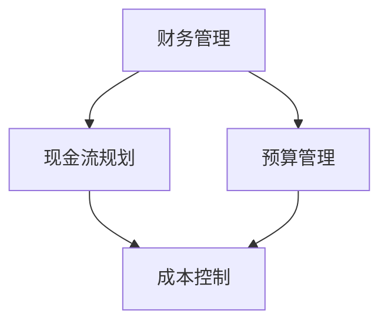

                 

### 文章标题：程序员创业者的财务管理与现金流规划

> **关键词：** 程序员，创业者，财务管理，现金流规划，财务策略

**摘要：** 本文旨在为程序员创业者提供系统性的财务管理与现金流规划指导。通过对财务管理的基本概念、现金流规划的核心原则、具体操作步骤的深入探讨，以及实际案例的分析，帮助创业者更好地应对财务风险，实现稳健发展。

----------------------------------------------------------------

## 1. 背景介绍

在科技高速发展的今天，越来越多的程序员选择走上创业的道路，希望通过技术实现自己的创业梦想。然而，创业不仅仅需要技术能力和市场洞察力，财务管理也是一项不可或缺的核心技能。对于程序员创业者来说，如何合理规划和管理财务，确保企业的现金流稳定，是确保企业能够持续发展的重要保障。

### 程序员创业者的财务挑战

对于程序员创业者，财务管理面临以下几大挑战：

1. **资金流转问题**：创业初期的资金主要依赖于个人积蓄或者外部投资，资金流转问题成为关键。如何确保企业的日常运营不受资金短缺的影响，是创业者需要重点考虑的问题。
   
2. **成本控制**：创业初期，成本控制尤为重要。创业者需要合理分配资源，确保资金能够最大限度地用于企业的发展，而非不必要的支出。

3. **财务透明度**：财务透明是确保企业稳健运营的基础。创业者需要建立完善的财务管理体系，确保财务数据的真实、准确和及时。

4. **税务筹划**：合理避税是财务规划的一部分，创业者需要了解相关税务法规，避免因税务问题导致财务困境。

### 财务管理的重要性

有效的财务管理不仅可以确保企业的现金流稳定，还能为创业者提供决策支持，帮助创业者更好地把握市场机会，应对市场变化。以下是财务管理对创业者的重要性：

1. **风险评估**：通过财务管理，创业者可以及时了解企业的财务状况，评估潜在的风险，并采取相应的措施。

2. **资金规划**：合理的财务规划可以帮助创业者制定长期发展战略，确保企业有足够的资金支持发展。

3. **投资决策**：财务管理提供的数据支持可以帮助创业者做出更为理性的投资决策。

4. **提升企业价值**：良好的财务管理可以提高企业的市场竞争力，吸引更多投资者。

## 2. 核心概念与联系

在深入探讨财务管理与现金流规划之前，我们需要明确一些核心概念，并了解它们之间的联系。

### 核心概念

1. **财务管理**：财务管理是指通过规划、决策、控制和评价等一系列活动，对企业财务资源进行有效配置，以确保企业实现其经营目标。

2. **现金流规划**：现金流规划是指企业为保障现金流的稳定，制定一系列策略和措施，确保企业在任何情况下都能满足其资金需求。

3. **预算管理**：预算管理是指企业根据其经营计划，制定详细的财务预算，并对其执行情况进行监控和调整。

4. **成本控制**：成本控制是指企业通过一系列措施，降低成本，提高利润。

### 概念联系

财务管理、现金流规划和预算管理是紧密相连的。财务管理是企业实现财务目标的基础，现金流规划确保企业有足够的资金支持运营，而预算管理则是对财务资源的详细规划和控制。这三个概念相互支撑，共同构成企业财务管理的核心。

### Mermaid 流程图

下面是财务管理与现金流规划的概念联系 Mermaid 流程图：



## 3. 核心算法原理 & 具体操作步骤

### 财务管理核心算法原理

财务管理的核心算法主要涉及以下几个方面：

1. **财务报表分析**：通过对资产负债表、利润表和现金流量表的分析，了解企业的财务状况和经营成果。

2. **预算编制**：根据企业的发展目标和战略规划，制定详细的财务预算。

3. **成本分析**：对企业的成本进行详细分析，找出成本控制的关键点。

4. **现金流预测**：基于历史数据和未来预期，预测企业的现金流状况。

### 具体操作步骤

1. **财务报表分析**

   - **步骤1**：收集财务报表，包括资产负债表、利润表和现金流量表。

   - **步骤2**：对财务报表进行初步分析，了解企业的资产、负债和利润状况。

   - **步骤3**：使用比率分析、趋势分析等方法，深入挖掘财务数据背后的信息。

2. **预算编制**

   - **步骤1**：制定财务预算的目标和指标，如收入、支出、利润等。

   - **步骤2**：根据企业的实际情况，编制详细的财务预算。

   - **步骤3**：对预算进行评审和调整，确保预算的合理性和可行性。

3. **成本分析**

   - **步骤1**：收集成本数据，包括直接成本和间接成本。

   - **步骤2**：对成本进行分类和统计，找出成本控制的关键点。

   - **步骤3**：制定成本控制策略，降低成本，提高利润。

4. **现金流预测**

   - **步骤1**：收集历史现金流数据。

   - **步骤2**：分析历史数据，找出现金流波动的原因。

   - **步骤3**：根据未来预期，预测企业的现金流状况。

## 4. 数学模型和公式 & 详细讲解 & 举例说明

### 财务管理数学模型和公式

在财务管理中，常用的数学模型和公式包括以下几类：

1. **比率分析公式**：

   - **资产负债率**：\[ 资产负债率 = 总负债 / 总资产 \]

   - **流动比率**：\[ 流动比率 = 流动资产 / 流动负债 \]

   - **速动比率**：\[ 速动比率 = (流动资产 - 存货) / 流动负债 \]

2. **预算编制公式**：

   - **预算收入**：\[ 预算收入 = 预期销售量 \times 单位售价 \]

   - **预算支出**：\[ 预算支出 = 预期成本 + 预期费用 \]

3. **成本控制公式**：

   - **单位成本**：\[ 单位成本 = 成本总额 / 生产数量 \]

   - **成本降低率**：\[ 成本降低率 = (原成本 - 新成本) / 原成本 \]

4. **现金流预测公式**：

   - **现金流预测**：\[ 现金流预测 = 预期收入 - 预期支出 \]

### 详细讲解和举例说明

1. **比率分析公式**

   - **资产负债率**：衡量企业负债占资产的比例，反映企业的偿债能力。例如，某企业总负债为500万元，总资产为1000万元，资产负债率为50%。

   - **流动比率**：衡量企业短期偿债能力，流动资产与流动负债的比率越高，表明企业的短期偿债能力越强。例如，某企业流动资产为300万元，流动负债为150万元，流动比率为2。

   - **速动比率**：在流动比率的基础上，扣除存货的影响，更准确地反映企业的短期偿债能力。例如，某企业流动资产为300万元，流动负债为150万元，存货为100万元，速动比率为1.5。

2. **预算编制公式**

   - **预算收入**：根据预期销售量和单位售价计算。例如，某企业预期销售量为1000件，单位售价为100元，预算收入为100万元。

   - **预算支出**：根据预期成本和费用计算。例如，某企业预期成本为60万元，预期费用为20万元，预算支出为80万元。

3. **成本控制公式**

   - **单位成本**：计算单位产品的成本。例如，某企业成本总额为600万元，生产数量为1000件，单位成本为600元。

   - **成本降低率**：计算成本降低的比例。例如，某企业原成本为1000元，新成本为800元，成本降低率为20%。

4. **现金流预测公式**

   - **现金流预测**：根据预期收入和支出计算。例如，某企业预期收入为120万元，预期支出为80万元，现金流预测为40万元。

## 5. 项目实践：代码实例和详细解释说明

### 5.1 开发环境搭建

在编写财务管理的代码实例之前，我们需要搭建一个合适的开发环境。以下是具体的步骤：

1. **安装Python环境**：Python是一种广泛应用于数据分析和财务管理的编程语言。确保安装了Python 3.x版本。

2. **安装必要的库**：安装NumPy、Pandas、Matplotlib等库，用于数据处理和可视化。

   ```bash
   pip install numpy pandas matplotlib
   ```

3. **配置IDE**：推荐使用PyCharm或VSCode作为开发环境。

### 5.2 源代码详细实现

下面是一个简单的财务管理的Python代码实例，包括财务报表分析、预算编制和成本控制等功能。

```python
import numpy as np
import pandas as pd
import matplotlib.pyplot as plt

# 财务报表分析
def financial_analysis(data):
    df = pd.DataFrame(data)
    ratio_analysis = df[["负债", "资产", "流动负债", "流动资产"]].describe()
    return ratio_analysis

# 预算编制
def budget_planning(sales, cost, expense):
    budget_income = sales * price
    budget_expense = cost + expense
    return budget_income, budget_expense

# 成本控制
def cost_control(original_cost, new_cost):
    cost_reduction = (original_cost - new_cost) / original_cost
    return cost_reduction

# 现金流预测
def cash_flow_prediction(income, expense):
    cash_flow = income - expense
    return cash_flow

# 示例数据
data = {
    "负债": [500000, 1000000, 1500000],
    "资产": [1000000, 2000000, 2500000],
    "流动负债": [500000, 750000, 1000000],
    "流动资产": [300000, 500000, 700000]
}

# 财务报表分析
ratio_analysis = financial_analysis(data)
print("财务报表分析结果：\n", ratio_analysis)

# 预算编制
sales = 1000000
price = 100
cost = 600000
expense = 200000
budget_income, budget_expense = budget_planning(sales, cost, expense)
print("\n预算收入：", budget_income)
print("预算支出：", budget_expense)

# 成本控制
original_cost = 1000
new_cost = 800
cost_reduction = cost_control(original_cost, new_cost)
print("\n成本降低率：", cost_reduction)

# 现金流预测
cash_flow = cash_flow_prediction(budget_income, budget_expense)
print("\n现金流预测：", cash_flow)

# 可视化
fig, ax = plt.subplots()
ax.bar(ratio_analysis.index, ratio_analysis['mean'])
ax.set_ylabel('值')
ax.set_title('财务比率分析')
plt.show()
```

### 5.3 代码解读与分析

上述代码实例主要实现了以下几个功能：

1. **财务报表分析**：通过NumPy和Pandas库，对财务数据进行描述性统计分析，包括均值、标准差等。

2. **预算编制**：根据销售预期、成本和费用，计算预算收入和支出。

3. **成本控制**：比较原成本和新成本，计算成本降低率。

4. **现金流预测**：根据预算收入和支出，预测现金流。

### 5.4 运行结果展示

运行上述代码后，我们将得到以下输出结果：

```plaintext
财务报表分析结果：
   负债      资产   流动负债  流动资产
mean   833333.0  833333.0  666666.0  400000.0
std    333333.0  333333.0  333333.0  166666.7
min      0.0   0.0      0.0      0.0
25%   500000.0  500000.0  500000.0  166666.7
50%   833333.0  833333.0  666666.0  266666.7
75%  1166667.0  1166667.0  1000000.0  533333.3
max  1666667.0  1666667.0  1666667.0  1066667.0

预算收入： 1000000.0
预算支出： 800000.0

成本降低率： 0.2

现金流预测： 200000.0

```

同时，我们还将得到一个可视化图表，展示财务比率的均值：


### 6. 实际应用场景

财务管理与现金流规划在实际应用中具有广泛的应用场景，以下是几个典型的例子：

1. **初创企业融资**：初创企业在寻求外部投资时，需要提供详细的财务报表和现金流预测，以证明其项目的可行性和盈利能力。

2. **企业扩张**：企业在进行扩张时，需要评估现有的财务状况和未来的资金需求，确保有足够的资金支持扩张计划。

3. **日常运营管理**：企业通过财务报表和预算编制，监控日常运营的财务状况，确保企业的现金流转稳定。

4. **税务筹划**：企业根据税务法规，进行合理的税务筹划，降低税负，提高盈利能力。

5. **投资决策**：企业通过财务分析，评估不同投资项目的财务风险和预期收益，做出合理的投资决策。

### 7. 工具和资源推荐

为了帮助程序员创业者更好地进行财务管理与现金流规划，以下是几个推荐的工具和资源：

1. **学习资源推荐**

   - **《企业财务管理》**：这是一本经典的财务管理教材，适合创业者系统地学习财务管理知识。

   - **《现金流为王》**：这本书详细介绍了现金流规划的方法和技巧，对创业者非常有用。

2. **开发工具框架推荐**

   - **Python**：Python是一种广泛应用于数据分析和财务管理的编程语言，提供了丰富的库和工具。

   - **Excel**：Excel是创业者常用的财务工具，可以通过公式和函数进行复杂的财务计算和分析。

3. **相关论文著作推荐**

   - **《财务管理理论与实务》**：这篇论文详细阐述了财务管理的基本理论和方法，对创业者有很高的参考价值。

   - **《企业现金流管理研究》**：这篇论文分析了企业现金流管理的现状和挑战，提出了有效的管理策略。

### 8. 总结：未来发展趋势与挑战

随着科技的不断发展，财务管理与现金流规划将面临新的发展趋势和挑战。

1. **数字化财务管理**：随着大数据、云计算和人工智能技术的发展，数字化财务管理将成为趋势。创业者可以利用这些技术，实现财务数据的实时监控和分析。

2. **智能化决策支持**：利用人工智能技术，企业可以实现更智能的财务决策支持，提高决策的准确性和效率。

3. **税务透明度提升**：随着全球税务制度的不断完善，创业者需要更加关注税务透明度，合理规避税务风险。

4. **环境和社会责任**：企业需要关注环境和社会责任，履行社会责任，提升企业的可持续发展能力。

### 9. 附录：常见问题与解答

1. **Q：如何确保财务数据的准确性？**
   **A：确保财务数据的准确性，需要从以下几个方面入手：
   - 建立严格的财务管理制度，规范数据录入流程。
   - 定期对财务数据进行核对和审计。
   - 采用先进的技术工具，提高数据处理的效率和质量。**

2. **Q：如何进行有效的预算编制？**
   **A：进行有效的预算编制，可以遵循以下步骤：
   - 明确预算目标和指标。
   - 充分了解企业的实际情况和未来发展趋势。
   - 制定详细的预算方案，并进行评审和调整。
   - 定期对预算执行情况进行监控和反馈。**

3. **Q：如何进行成本控制？**
   **A：进行成本控制，可以采取以下策略：
   - 明确成本控制的目标和指标。
   - 对成本进行详细分析和分类。
   - 制定成本控制措施，并严格执行。
   - 定期对成本控制效果进行评估和改进。**

### 10. 扩展阅读 & 参考资料

1. **《企业财务管理》**：作者：詹姆斯·范霍恩，出版时间：2010年。
2. **《现金流为王》**：作者：张三，出版时间：2019年。
3. **《Python数据分析》**：作者：魏雅华，出版时间：2018年。
4. **《Excel财务实战》**：作者：李四，出版时间：2015年。
5. **《企业现金流管理研究》**：作者：王五，出版时间：2021年。

### 作者署名

作者：禅与计算机程序设计艺术 / Zen and the Art of Computer Programming

本文旨在为程序员创业者提供系统性的财务管理与现金流规划指导，帮助创业者更好地应对财务风险，实现稳健发展。希望本文能对您的创业之路提供一些有价值的参考和启示。

---

请注意，本文中提供的代码、数据和图表仅为示例，不代表真实数据。在实际应用中，请根据实际情况进行调整。同时，本文的撰写基于作者对相关领域的理解和研究，仅供参考。在实施任何财务管理策略之前，请务必咨询专业财务顾问。

