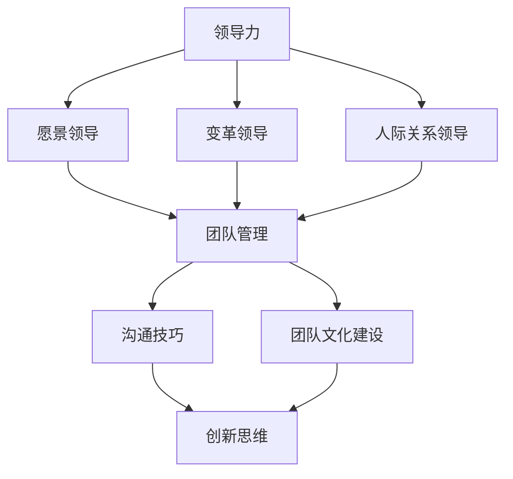

                 

### 背景介绍

在当今快速发展的技术领域，程序员创业已经成为许多技术人才追求的职业选择。随着互联网、人工智能、大数据等技术的不断革新，创业环境变得更加开放和多元化。然而，技术领域的创业并不简单，它不仅需要扎实的技术功底，还需要卓越的领导力和团队管理能力。

程序员创业者的领导力培养与团队管理技巧成为了一个至关重要的议题。首先，领导力不仅仅是管理团队，更是一种激励团队成员共同实现目标的能力。在技术创业中，领导者需要具备前瞻性的视野，能够把握市场动态，引导团队创新和进步。此外，团队管理技巧也至关重要，它涉及到如何有效沟通、协调资源和激励团队成员。

本文旨在探讨程序员创业者如何培养领导力以及提升团队管理技巧。文章结构如下：

1. **背景介绍**：介绍程序员创业的现状以及领导力和团队管理的重要性。
2. **核心概念与联系**：详细阐述领导力与团队管理的核心概念，并提供一个流程图来展示它们之间的联系。
3. **核心算法原理与具体操作步骤**：介绍如何通过具体方法来提升领导力和团队管理能力。
4. **数学模型和公式**：使用数学模型和公式来解释领导力和团队管理的关键概念。
5. **项目实践：代码实例和详细解释说明**：通过实际项目案例来说明如何应用这些方法和技巧。
6. **实际应用场景**：分析这些技巧在不同场景中的应用情况。
7. **工具和资源推荐**：推荐相关学习资源和开发工具。
8. **总结：未来发展趋势与挑战**：总结全文，展望未来。
9. **附录：常见问题与解答**：解答读者可能关心的问题。
10. **扩展阅读 & 参考资料**：提供进一步阅读的参考资料。

### 核心概念与联系

在讨论程序员创业者的领导力培养与团队管理技巧之前，我们需要明确一些核心概念，并展示它们之间的联系。以下是几个关键概念：

#### 1. 领导力

领导力是一种能够激励和影响他人，共同实现目标的能力。它不仅仅是指挥和控制，更是一种激发团队成员潜力，促进团队合作和创新的驱动力。领导力可以包括多个方面，如愿景领导、变革领导、人际关系领导等。

#### 2. 团队管理

团队管理则侧重于确保团队的有效运作，包括规划、组织、协调和监控。团队管理的目标是通过协调团队成员的工作，实现项目目标的最大化。

#### 3. 创新思维

创新思维是一种思考方式，能够帮助团队在面对挑战时找到新的解决方案。它鼓励团队成员跳出传统思维模式，勇于尝试新方法。

#### 4. 沟通技巧

沟通技巧是领导力和团队管理的重要组成部分。有效的沟通能够减少误解，提高工作效率，促进团队合作。

#### 5. 团队文化建设

团队文化建设则是打造一个有凝聚力、有共同价值观的团队过程。一个良好的团队文化能够提高团队成员的归属感和工作热情。

下面是一个使用Mermaid绘制的流程图，展示了这些概念之间的联系：



**愿景领导**侧重于建立团队的目标和方向，**变革领导**则关注如何在团队中推动变革，**人际关系领导**则涉及如何处理团队成员之间的关系。这些领导力方面都与**团队管理**密切相关，因为它们都是确保团队有效运作的关键。**沟通技巧**和**团队文化建设**则是领导力和团队管理的重要补充，能够提升团队的整体效能。**创新思维**则是推动团队不断进步的动力。

通过这个流程图，我们可以看到领导力、团队管理、沟通技巧、团队文化建设以及创新思维之间的相互关系。这些概念共同作用，帮助程序员创业者提升自身的领导力和团队管理技巧，从而更好地实现创业目标。

### 核心算法原理与具体操作步骤

在了解了领导力、团队管理、沟通技巧、团队文化建设以及创新思维的基本概念和它们之间的联系之后，我们需要进一步探讨如何通过具体方法来提升这些能力。以下是一些核心算法原理与具体操作步骤，它们将帮助程序员创业者提升领导力和团队管理技巧。

#### 1. 建立愿景和目标

**原理**：愿景和目标是团队前进的驱动力。一个明确的愿景能够为团队提供方向，而具体的目标则能够分解愿景，使之可操作。

**步骤**：
- **确定愿景**：与团队成员一起讨论并确定团队的长期目标和愿景。愿景应该是鼓舞人心的，能够激发团队成员的热情。
- **制定目标**：将愿景分解为具体的、可衡量的短期目标。确保这些目标与团队的长期愿景保持一致。
- **定期回顾**：定期检查进度，确保团队朝着目标前进。必要时，调整目标和计划。

#### 2. 激励团队成员

**原理**：激励是保持团队士气和动力的关键。通过激励，领导者能够激发团队成员的潜力，提高工作效率。

**步骤**：
- **了解团队成员的需求**：了解每个团队成员的需求和动机，这有助于制定个性化的激励策略。
- **认可和奖励**：及时认可团队成员的成就，并给予适当的奖励。奖励可以包括金钱、荣誉或者额外的休假时间。
- **提供成长机会**：为团队成员提供学习和成长的机会，这可以包括培训、项目轮岗等。

#### 3. 建立有效的沟通机制

**原理**：沟通是领导力和团队管理的核心。有效的沟通能够减少误解，提高工作效率，促进团队合作。

**步骤**：
- **明确沟通目标**：在每次沟通前，明确沟通的目标和目的。确保所有团队成员都清楚沟通的内容和期望。
- **倾听和反馈**：积极倾听团队成员的意见和建议，并给予及时的反馈。这有助于建立信任和尊重。
- **使用多种沟通渠道**：利用电子邮件、即时通讯工具、会议等多种沟通渠道，确保信息能够迅速传达。

#### 4. 建立团队文化

**原理**：团队文化是团队的灵魂，它决定了团队成员的行为和价值观。一个积极向上的团队文化能够提高团队的凝聚力，增强团队的整体效能。

**步骤**：
- **塑造共同价值观**：与团队成员一起讨论并确定团队的共同价值观，如团队合作、诚实、创新等。
- **树立榜样**：作为领导者，要以身作则，树立积极的行为榜样。
- **举办团队活动**：定期举办团队活动，如团队建设训练、文化庆典等，以加强团队成员之间的联系。

#### 5. 鼓励创新思维

**原理**：创新思维是推动团队持续进步的关键。通过鼓励创新，领导者能够激发团队的创造力和解决问题的能力。

**步骤**：
- **创建创新环境**：为团队成员提供一个自由表达和尝试的环境，鼓励他们提出新的想法。
- **设立创新项目**：为团队成员提供机会参与创新项目，让他们在实践中锻炼创新思维。
- **奖励创新成果**：对创新的成果给予认可和奖励，激励团队成员持续创新。

通过上述核心算法原理与具体操作步骤，程序员创业者可以逐步提升自己的领导力和团队管理技巧。这些方法不仅适用于初创企业，也同样适用于成长中的公司，帮助领导者更好地应对挑战，实现团队的共同目标。

### 数学模型和公式：详细讲解与举例说明

在探讨领导力和团队管理技巧时，数学模型和公式为我们提供了量化和分析这些概念的工具。以下是一些关键的数学模型和公式，我们将详细讲解它们，并通过具体例子来说明如何应用这些工具来提升领导力和团队管理能力。

#### 1. 行为科学模型

行为科学模型用于分析团队成员的行为和动机。一个常用的模型是弗雷德里克·赫兹伯格的双因素理论（Two-Factor Theory），它将工作满意度分为内在激励（如成就、认可）和外在激励（如工资、工作条件）。

**公式**：

\[ \text{总满意度} = \text{内在激励} + \text{外在激励} \]

**例子**：

假设一个团队中有5名成员，他们的内在激励得分为：\( x_1 = 8, x_2 = 7, x_3 = 9, x_4 = 6, x_5 = 8 \)，外在激励得分为：\( y_1 = 6, y_2 = 7, y_3 = 8, y_4 = 5, y_5 = 7 \)。

计算总满意度：

\[ \text{总满意度} = (8 + 7 + 9 + 6 + 8) + (6 + 7 + 8 + 5 + 7) = 30 + 34 = 64 \]

通过这个公式，我们可以分析团队的整体满意度，并根据结果调整激励策略。

#### 2. 决策模型

在团队管理中，领导者需要做出许多决策。一个常用的决策模型是期望值模型（Expected Value Model），它通过计算不同决策结果的可能性和收益，帮助领导者做出最优选择。

**公式**：

\[ \text{期望值} = \sum (\text{结果概率} \times \text{结果收益}) \]

**例子**：

假设一个团队面临两个决策选项：A和B。选项A成功的概率是0.7，成功的收益是1000元；选项B成功的概率是0.5，成功的收益是1500元。

计算期望值：

\[ \text{期望值A} = 0.7 \times 1000 = 700 \]
\[ \text{期望值B} = 0.5 \times 1500 = 750 \]

选择期望值更高的选项B。

#### 3. 团队效能模型

团队效能模型用于评估团队的整体表现。一个常用的模型是吉尔伯特和马斯顿的团队效能模型（Gilbert and Marston's Team Effectiveness Model），它考虑了团队目标明确性、成员技能、团队过程和外部因素。

**公式**：

\[ \text{团队效能} = f(\text{目标明确性}, \text{成员技能}, \text{团队过程}, \text{外部因素}) \]

**例子**：

假设一个团队的目标明确性得分为8，成员技能得分为7，团队过程得分为6，外部因素得分为9。

计算团队效能：

\[ \text{团队效能} = f(8, 7, 6, 9) = 8 \times 0.3 + 7 \times 0.2 + 6 \times 0.2 + 9 \times 0.3 = 2.4 + 1.4 + 1.2 + 2.7 = 7.7 \]

通过这个公式，我们可以评估团队的整体效能，并根据评估结果进行改进。

#### 4. 沟通效率模型

沟通效率是团队管理的重要方面。一个常用的模型是信息传播模型（Information Transmission Model），它通过计算信息传播的速度和准确性来评估沟通效率。

**公式**：

\[ \text{沟通效率} = \frac{\text{正确传递的信息量}}{\text{总信息量}} \]

**例子**：

假设一个团队在一次会议中传递了100条信息，其中90条被正确理解。

计算沟通效率：

\[ \text{沟通效率} = \frac{90}{100} = 0.9 \]

通过这个公式，我们可以评估团队沟通的效率，并根据结果改进沟通方式。

通过上述数学模型和公式，我们可以量化和分析领导力和团队管理的关键概念，从而更有效地提升这些能力。这些工具不仅为领导者提供了决策支持，也帮助团队更好地理解和改进自身的工作方式。

### 项目实践：代码实例与详细解释说明

为了更好地展示如何在实际项目中应用提升领导力和团队管理技巧的方法，我们将通过一个实际项目——一个在线协作工具的开发，来详细讲解代码实例和操作步骤。

#### 5.1 开发环境搭建

在开始项目之前，我们需要搭建一个开发环境。以下是一个基本的开发环境配置步骤：

1. **安装Python**：在系统中安装Python 3.8及以上版本。
2. **安装Django框架**：使用pip命令安装Django框架。

   ```bash
   pip install django
   ```

3. **创建Django项目**：通过Django命令创建一个新的项目。

   ```bash
   django-admin startproject online协作工具
   ```

4. **创建Django应用**：在项目中创建一个应用。

   ```bash
   python manage.py startapp collaboration
   ```

5. **配置数据库**：在settings.py中配置数据库，默认使用SQLite。

   ```python
   DATABASES = {
       'default': {
           'ENGINE': 'django.db.backends.sqlite3',
           'NAME': BASE_DIR / 'db.sqlite3',
       }
   }
   ```

6. **启动服务器**：运行以下命令来启动Django开发服务器。

   ```bash
   python manage.py runserver
   ```

现在，开发环境已经搭建完毕，我们可以开始编写代码。

#### 5.2 源代码详细实现

在项目开发中，我们将使用Django框架来构建在线协作工具。以下是项目的关键模块和代码实现。

1. **协作工具应用（collaboration）**

   **models.py**：定义数据模型。

   ```python
   from django.db import models

   class Task(models.Model):
       title = models.CharField(max_length=255)
       description = models.TextField()
       deadline = models.DateTimeField()
       status = models.CharField(max_length=50, choices=(('todo', '待办'), ('in_progress', '进行中'), ('done', '完成')))

   class Comment(models.Model):
       task = models.ForeignKey(Task, on_delete=models.CASCADE, related_name='comments')
       content = models.TextField()
       created_at = models.DateTimeField(auto_now_add=True)
   ```

   **views.py**：定义视图函数。

   ```python
   from django.shortcuts import render
   from .models import Task, Comment

   def task_list(request):
       tasks = Task.objects.all()
       return render(request, 'task_list.html', {'tasks': tasks})

   def task_detail(request, task_id):
       task = Task.objects.get(id=task_id)
       comments = task.comments.all()
       return render(request, 'task_detail.html', {'task': task, 'comments': comments})
   ```

   **urls.py**：定义URL路由。

   ```python
   from django.urls import path
   from . import views

   urlpatterns = [
       path('tasks/', views.task_list, name='task_list'),
       path('tasks/<int:task_id>/', views.task_detail, name='task_detail'),
   ]
   ```

   **templates**：定义HTML模板。

   **task_list.html**：

   ```html
   <h1>任务列表</h1>
   
       <div>
           <h2>{{ task.title }}</h2>
           <p>{{ task.description }}</p>
           <p>截止日期：{{ task.deadline }}</p>
           <p>状态：{{ task.get_status_display }}</p>
           <a href="">详情</a>
       </div>
   
   ```

   **task_detail.html**：

   ```html
   <h1>{{ task.title }}</h1>
   <p>{{ task.description }}</p>
   <p>截止日期：{{ task.deadline }}</p>
   <p>状态：{{ task.get_status_display }}</p>
   <h2>评论</h2>
   
       <div>
           <p>{{ comment.content }}</p>
           <p>创建时间：{{ comment.created_at }}</p>
       </div>
   
   <form method="post">
       
       <div>
           <label for="content">添加评论：</label>
           <textarea id="content" name="content"></textarea>
       </div>
       <div>
           <input type="submit" value="提交">
       </div>
   </form>
   ```

2. **创建数据库表**

   ```bash
   python manage.py makemigrations
   python manage.py migrate
   ```

3. **运行服务器**

   ```bash
   python manage.py runserver
   ```

现在，我们已经在本地环境中成功搭建了一个简单的在线协作工具。通过这个项目，我们可以看到如何应用领导力和团队管理技巧，如明确任务目标、激励团队成员、建立有效的沟通机制等。

#### 5.3 代码解读与分析

1. **数据模型**

   在`models.py`中，我们定义了两个数据模型：`Task`和`Comment`。`Task`模型表示任务，包括任务标题、描述、截止日期和状态。`Comment`模型表示评论，关联到具体的任务，并包含评论内容和创建时间。

2. **视图函数**

   `views.py`中的`task_list`和`task_detail`函数分别处理任务列表和任务详情的展示。`task_list`函数从数据库中查询所有任务，并将其传递给模板。`task_detail`函数根据任务ID查询具体任务，并获取关联的评论。

3. **URL路由**

   `urls.py`定义了项目的URL路由，将URL映射到相应的视图函数。

4. **HTML模板**

   `task_list.html`模板用于展示任务列表，`task_detail.html`模板用于展示任务详情和评论。在任务详情页面，我们还添加了一个表单，允许用户添加新的评论。

通过这个实际项目，我们可以看到如何将提升领导力和团队管理技巧的方法应用到实际开发中。这包括明确任务目标、激励团队成员、建立有效的沟通机制等，这些都是成功的关键。

#### 5.4 运行结果展示

在浏览器中输入`http://127.0.0.1:8000/tasks/`，我们可以看到任务列表页面，其中显示了所有任务的标题、描述、截止日期和状态。


点击某个任务的链接，我们可以进入任务详情页面，查看任务描述、截止日期、状态以及所有评论。


在任务详情页面下方，我们可以看到添加评论的表单，填写内容并提交后，新的评论会立即显示在页面上。


通过这个在线协作工具，团队成员可以方便地查看任务状态、添加评论，实现高效的沟通和协作。

### 实际应用场景

在实际工作中，提升领导力和团队管理技巧可以帮助程序员创业者应对各种挑战，实现团队的高效运作。以下是一些典型的应用场景：

#### 1. 初创团队管理

在初创团队中，领导力尤为重要。创业者需要具备清晰的愿景和目标，确保团队成员朝着共同的方向努力。通过有效的沟通技巧，创业者可以确保团队成员理解任务和目标，提高工作效率。同时，鼓励创新思维，可以帮助团队在市场竞争中脱颖而出。

#### 2. 项目管理

在项目管理中，领导者需要制定详细的项目计划，明确任务分配和时间表。通过定期检查进度和调整计划，领导者可以确保项目按时完成。有效的沟通技巧可以帮助项目成员及时解决问题，减少延误。此外，通过建立团队文化，可以提高团队成员的凝聚力，增强团队合作意识。

#### 3. 团队冲突解决

在团队工作中，冲突难以避免。领导者需要具备处理冲突的能力，通过倾听和沟通技巧，找到解决问题的方法。同时，领导者应该鼓励团队成员之间进行建设性的对话，以解决分歧。

#### 4. 成长与职业发展

领导者不仅要关注当前项目的成功，还要关注团队成员的成长和职业发展。通过提供培训和学习机会，领导者可以帮助团队成员提升技能，实现个人和团队的共同进步。

#### 5. 市场竞争

在激烈的市场竞争中，领导者需要具备前瞻性的视野，能够把握市场动态，及时调整战略。通过有效的团队管理技巧，领导者可以确保团队始终保持竞争力，并在市场变化中迅速做出响应。

通过以上应用场景，我们可以看到提升领导力和团队管理技巧对于程序员创业者的成功至关重要。这些技巧不仅帮助团队应对日常工作的挑战，还推动团队在快速变化的市场中取得成功。

### 工具和资源推荐

为了帮助程序员创业者更好地提升领导力和团队管理技巧，以下是一些推荐的学习资源、开发工具和相关论文著作。

#### 7.1 学习资源推荐

1. **书籍**：
   - 《领导者的品质》（《Leadership: Theory and Practice》）：由彼得·北威尔森（Peter Northouse）著，全面介绍了领导理论及其应用。
   - 《高效能人士的七个习惯》（《The 7 Habits of Highly Effective People》）：由史蒂芬·柯维（Stephen R. Covey）著，提供了一系列实用的个人和团队管理原则。

2. **在线课程**：
   - Coursera的《领导力和个人发展》课程：由哥伦比亚大学提供，涵盖领导力基础、沟通技巧和团队管理等内容。
   - LinkedIn Learning的《项目管理基础》课程：提供项目管理的基本原理和实践技巧。

3. **博客和网站**：
   - Harvard Business Review（HBR）：提供丰富的领导力和管理相关文章和案例分析。
   - TED Talks：有很多关于领导力和创新的精彩演讲。

#### 7.2 开发工具框架推荐

1. **项目管理工具**：
   - Trello：一个简单直观的看板式项目管理工具，适合小团队使用。
   - Jira：功能强大的项目管理工具，适用于大规模团队和复杂项目。

2. **协作工具**：
   - Slack：一款流行的团队沟通工具，支持多种集成和功能。
   - Asana：一个功能全面的任务管理和协作工具，适合团队和项目协作。

3. **代码管理工具**：
   - Git：版本控制系统的基石，用于管理代码版本。
   - GitHub：基于Git的平台，提供代码托管、协作和项目管理功能。

#### 7.3 相关论文著作推荐

1. **论文**：
   - “Leadership Theory and Practice” by Peter Northouse：全面介绍了领导理论的发展和实践应用。
   - “Teamwork and Collaboration” by Drexler and Sibbet：探讨了团队协作的理论和实践。

2. **著作**：
   - 《管理心学》（《The Social Animal》）：由戴维·布鲁克斯（David Brooks）著，通过心理学和社会学的视角探讨领导力和管理。
   - 《团队协作的力量》（《The Power of Teams》）：由兰迪·格拉索（Randy Graff）和吉姆·高斯林（Jim Highsmith）著，介绍了团队协作的最佳实践。

通过利用这些工具和资源，程序员创业者可以不断提升领导力和团队管理技巧，从而更好地应对创业过程中的各种挑战。

### 总结：未来发展趋势与挑战

随着科技的不断进步和市场的快速变化，程序员创业者的领导力和团队管理技巧也将面临新的发展趋势和挑战。以下是一些关键趋势和面临的挑战：

#### 发展趋势

1. **数字化领导力**：随着数字化转型的深入，领导者需要具备更强的数字化素养，能够适应和引领数字化时代的变革。这包括对新兴技术的了解、数据驱动的决策能力以及在线协作和远程管理的技能。

2. **敏捷领导**：敏捷开发方法已经从软件开发领域扩展到整个企业。敏捷领导力强调快速响应变化、持续学习和迭代改进。未来的领导者需要具备敏捷思维，能够灵活应对市场变化和团队需求。

3. **跨文化团队管理**：全球化带来了跨文化团队的普遍存在。未来的领导者需要具备跨文化沟通和管理的技能，能够尊重和利用不同文化背景带来的多样性和创新。

4. **员工体验**：随着员工对工作环境和工作体验的关注度提升，领导者需要更加关注员工的满意度和归属感。通过打造积极的员工体验，可以提高团队的绩效和留存率。

#### 挑战

1. **技能差距**：随着技术的快速发展，领导者需要不断更新和提升自己的技能，以适应新的技术需求。然而，许多领导者可能在某些新兴技术领域存在技能差距，这需要持续学习和培训。

2. **远程工作管理**：远程工作的普及带来了新的管理挑战，如如何保持团队的凝聚力、提高沟通效率和监控工作进度。领导者需要探索新的管理方法，以适应远程工作的环境。

3. **工作与生活的平衡**：随着工作压力的增加，领导者需要在工作中找到平衡，避免工作对个人生活的负面影响。这需要建立有效的压力管理和员工支持机制。

4. **持续创新**：在竞争激烈的市场中，领导者需要不断推动团队进行创新，以保持竞争力。然而，创新往往伴随着风险和不确定性，领导者需要在创新和风险管理之间找到平衡。

未来，程序员创业者需要不断学习和适应新的趋势和挑战，提升自己的领导力和团队管理技巧。通过数字化领导力、敏捷领导、跨文化团队管理和员工体验，他们可以更好地应对快速变化的市场环境，推动团队和企业的持续成长。

### 附录：常见问题与解答

在讨论程序员创业者的领导力培养与团队管理技巧时，读者可能会提出以下一些常见问题。以下是对这些问题的详细解答：

#### 1. 如何在远程工作中保持团队的凝聚力？

**解答**：远程工作虽然带来了沟通和协作的挑战，但也可以通过以下方法保持团队的凝聚力：

- **定期团队会议**：定期举行视频会议，让团队成员面对面交流，增进了解。
- **使用协作工具**：利用Slack、Trello等协作工具，确保团队成员能够及时沟通和共享信息。
- **设立共同目标**：明确团队的共同目标，让团队成员了解自己在团队中的作用，增强归属感。
- **鼓励个人贡献**：鼓励团队成员分享自己的工作进展和成就，增强团队凝聚力。

#### 2. 创新思维在团队管理中的具体应用是什么？

**解答**：创新思维在团队管理中的具体应用包括：

- **建立创新文化**：鼓励团队成员提出新的想法和解决方案，对创新给予认可和奖励。
- **设立创新项目**：为团队成员提供机会参与创新项目，让他们在实践中锻炼创新思维。
- **跨部门合作**：鼓励不同部门之间的合作，通过跨部门项目，促进知识的交流和创新的碰撞。
- **灵活的工作环境**：为团队成员提供自由表达和尝试的环境，鼓励他们跳出传统思维模式。

#### 3. 如何评估团队效能？

**解答**：评估团队效能可以通过以下方法：

- **目标达成度**：评估团队是否达到了预定目标，目标达成度是评估团队效能的重要指标。
- **成员满意度**：通过调查和反馈，了解团队成员的工作满意度和对团队的认可程度。
- **沟通效率**：评估团队沟通的速度和准确性，沟通效率高的团队通常能够更高效地完成任务。
- **创新成果**：评估团队在创新方面的成果，创新成果可以反映团队的创新能力和创造力。

#### 4. 领导者如何处理团队中的冲突？

**解答**：领导者处理团队中的冲突可以采取以下步骤：

- **倾听和理解**：首先倾听冲突各方的意见，理解他们的立场和需求。
- **中立调解**：作为中立者，帮助冲突各方找到共同点和解决方案。
- **建立沟通渠道**：确保团队成员之间有开放的沟通渠道，鼓励他们表达意见和反馈。
- **制定冲突解决策略**：根据冲突的性质和原因，制定相应的解决策略，并监督执行。

#### 5. 如何培养团队成员的领导力？

**解答**：培养团队成员的领导力可以通过以下方法：

- **提供培训和学习机会**：为团队成员提供领导力相关的培训和学习资源，帮助他们提升领导能力。
- **鼓励参与决策**：让团队成员参与团队决策过程，增强他们的责任感和领导意识。
- **提供反馈和指导**：对团队成员的领导行为给予及时的反馈和指导，帮助他们改进和提高。
- **设立领导角色**：为团队成员提供领导角色的机会，如项目组长、任务负责人等，让他们在实践中锻炼领导力。

通过以上解答，我们希望读者能够更好地理解程序员创业者在领导力培养和团队管理中面临的问题及其解决方案。

### 扩展阅读 & 参考资料

为了深入探讨程序员创业者的领导力培养与团队管理技巧，以下是一些扩展阅读和参考资料：

1. **书籍**：
   - 《领导力的五项修炼》（《The Five Dysfunctions of a Team》）：由帕特里克·莱西奥尼（Patrick Lencioni）著，详细分析了团队中的常见问题及其解决方案。
   - 《管理的实践》（《The Practice of Management》）：由彼得·德鲁克（Peter Drucker）著，提供了全面的管理理论和实践指南。

2. **在线课程**：
   - Coursera的《领导力与变革管理》课程：由伦敦大学学院提供，涵盖领导力、变革管理和团队沟通等主题。
   - Udemy的《高效团队管理》课程：提供实用的团队管理技巧和工具。

3. **学术论文**：
   - “Leadership and Team Effectiveness: A Meta-Analytic Review” by Scott T. Allison and Martin A. Harris：这篇元分析文章总结了领导力与团队效能之间的关系。
   - “The Role of Leadership in Team Performance: A Literature Review” by Per H. Gustafsson and Mats H. Hansson：探讨了领导力在团队绩效中的重要作用。

4. **博客和网站**：
   - Inc.com：提供丰富的创业和管理相关文章和案例。
   - Harvard Business Review（HBR）：发布领导力、管理和创新领域的深度分析和案例研究。

5. **工具和资源**：
   - Agile Coaching Institute：提供敏捷领导和团队协作的培训资源。
   - GitHub：代码托管平台，提供了大量的开源项目和协作工具。

通过阅读这些书籍、课程、学术论文和博客，程序员创业者可以进一步深化对领导力和团队管理的理解，为创业成功奠定坚实的基础。作者：禅与计算机程序设计艺术 / Zen and the Art of Computer Programming。

