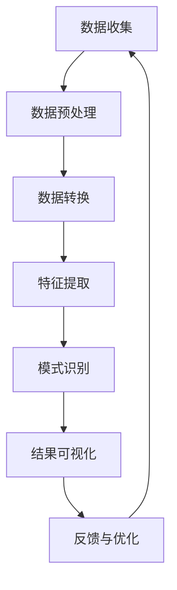

                 

### 文章标题

《程序员利用知识发现引擎提高解决问题能力》

### 关键词

- 程序员
- 知识发现引擎
- 问题解决能力
- 数据分析
- 机器学习
- 算法优化
- 实践案例

### 摘要

本文旨在探讨程序员如何利用知识发现引擎来提升其解决问题能力。通过介绍知识发现引擎的基本概念、原理及其在实际开发中的应用，本文将帮助程序员理解如何将这种先进技术融入日常工作中，从而在遇到复杂问题时能够更加高效地分析和解决。文章还将提供具体的案例和实践指南，帮助读者在实践中运用知识发现引擎，提升自身的技术水平和解决问题的能力。

---

### 1. 背景介绍

在当今快速发展的信息技术时代，程序员面临着越来越复杂的问题和挑战。随着软件系统的规模和复杂性不断增加，传统的编程方法和经验已不足以应对现代软件开发中的各种复杂问题。因此，寻找更高效、更智能的解决方法成为了程序员的迫切需求。

知识发现引擎（Knowledge Discovery Engine，KDE）作为一种新兴的技术工具，能够从大量数据中自动识别出有用的模式和规律，从而帮助程序员在问题解决过程中提供强有力的支持。知识发现引擎的核心功能包括数据挖掘、模式识别、机器学习和自然语言处理等，这些技术手段使得程序员能够更快速地理解复杂系统的行为，从而找到问题的根源。

当前，知识发现引擎在各个行业都得到了广泛应用。例如，在金融领域，知识发现引擎可以帮助分析市场趋势和用户行为，从而优化投资策略；在医疗领域，知识发现引擎能够辅助医生进行疾病诊断和治疗方案的制定。而在软件开发领域，知识发现引擎同样具有重要的应用价值。它可以帮助程序员更好地理解代码库、分析系统性能、优化算法设计，甚至预测潜在的技术风险。

本文将详细探讨知识发现引擎在软件开发中的应用，通过介绍其基本原理、核心算法和实际操作步骤，帮助程序员掌握如何利用知识发现引擎提升问题解决能力。接下来，我们将首先对知识发现引擎进行深入的背景介绍，包括其定义、发展历程和核心组成部分。

#### 1.1 知识发现引擎的定义

知识发现引擎是一种用于从大量数据中自动识别和提取有用知识的技术工具。它基于机器学习、数据挖掘和自然语言处理等技术，通过对数据进行分析和处理，发现其中的模式和规律，从而为决策提供科学依据。知识发现引擎的主要目的是帮助用户从海量数据中快速提取有价值的信息，从而实现数据驱动决策。

知识发现引擎的核心概念可以归纳为以下三点：

- **数据收集**：从各种数据源收集数据，包括结构化数据（如数据库）、半结构化数据（如XML、JSON）和非结构化数据（如文本、图像、音频）。
- **数据预处理**：对收集到的数据进行清洗、转换和整合，确保数据的质量和一致性。
- **模式识别**：利用机器学习和数据挖掘算法，从预处理后的数据中识别出有用的模式和规律。

#### 1.2 知识发现引擎的发展历程

知识发现引擎的发展历程可以追溯到20世纪80年代。当时，随着计算机技术和数据库技术的发展，人们开始关注如何从大量数据中提取有价值的信息。1989年，美国的IBM公司首次提出了知识发现（Knowledge Discovery in Databases，KDD）的概念，标志着知识发现引擎的正式诞生。

在随后的几十年里，知识发现引擎得到了持续的发展和进步。特别是在机器学习和数据挖掘技术的推动下，知识发现引擎的功能和性能得到了显著提升。目前，知识发现引擎已经广泛应用于各个领域，成为了数据分析和决策支持的重要工具。

#### 1.3 知识发现引擎的核心组成部分

知识发现引擎由以下几个核心组成部分构成：

- **数据源**：数据源是知识发现引擎的基础，包括各种结构化和非结构化数据。数据源的质量和丰富程度直接影响到知识发现引擎的输出结果。
- **数据预处理模块**：数据预处理模块负责对数据进行清洗、转换和整合，确保数据的质量和一致性。这一步骤是知识发现过程中的关键环节，因为高质量的数据是获得准确结果的前提。
- **模式识别模块**：模式识别模块是知识发现引擎的核心，负责利用机器学习和数据挖掘算法从预处理后的数据中识别出有用的模式和规律。常见的模式识别算法包括聚类、分类、关联规则挖掘等。
- **可视化模块**：可视化模块用于将识别出的模式和规律以图形或图表的形式展示出来，帮助用户更好地理解和分析结果。可视化模块对于知识发现过程具有重要意义，因为直观的可视化结果能够帮助用户快速识别关键信息和发现潜在问题。

通过以上背景介绍，我们了解了知识发现引擎的定义、发展历程和核心组成部分。接下来，我们将进一步探讨知识发现引擎在程序员日常工作中的具体应用，以及如何利用这一工具提升问题解决能力。

### 2. 核心概念与联系

#### 2.1 知识发现引擎的基本原理

知识发现引擎的工作原理可以概括为以下几个步骤：

1. **数据收集**：知识发现引擎首先需要从各种数据源中收集数据。这些数据可以来自数据库、文件、Web爬取等多种渠道。数据的质量和丰富程度直接影响到后续分析的准确性。

2. **数据预处理**：收集到的原始数据通常存在格式不统一、缺失值、噪声等问题，因此需要通过数据预处理模块对数据进行清洗、转换和整合。数据清洗包括去除重复记录、处理缺失值、去除噪声等，以确保数据的质量和一致性。

3. **数据转换**：数据转换包括将原始数据转换为适合分析和挖掘的格式。例如，将文本数据转换为词频矩阵，将图像数据转换为像素矩阵等。数据转换的目的是简化数据结构，使其更适合后续的处理和分析。

4. **特征提取**：特征提取是从数据中提取出对解决问题有用的特征。特征提取可以基于统计方法、机器学习算法或者专家经验。提取出的特征将用于后续的模式识别和建模。

5. **模式识别**：模式识别是知识发现引擎的核心步骤，利用机器学习和数据挖掘算法从特征化的数据中识别出有用的模式和规律。常见的模式识别算法包括聚类、分类、关联规则挖掘、异常检测等。

6. **结果可视化**：为了帮助用户更好地理解和分析结果，知识发现引擎通常配备有可视化模块。可视化结果可以以图表、图形等形式展示出来，包括数据分布、趋势分析、关联关系等。

#### 2.2 知识发现引擎与编程的联系

知识发现引擎虽然是一个独立的工具，但它与编程有着紧密的联系。程序员可以利用编程技能来扩展知识发现引擎的功能，实现更复杂的数据处理和分析任务。以下是知识发现引擎与编程之间的几个关键联系：

1. **数据集成与转换**：程序员可以利用编程技能来实现数据集成和数据转换，将来自不同数据源的数据整合到统一的格式中，以便于后续的分析。例如，可以使用Python的Pandas库来处理和转换数据。

2. **自定义特征提取**：知识发现引擎通常提供了一些通用的特征提取方法，但程序员可以根据具体问题的需求，自定义特征提取算法。例如，在图像处理领域，程序员可以使用深度学习框架（如TensorFlow或PyTorch）来自定义图像特征提取。

3. **集成到现有系统**：程序员可以将知识发现引擎集成到现有的软件系统中，以便在问题解决过程中实时分析和处理数据。例如，在自动化测试工具中集成知识发现引擎，可以实时监测和诊断软件缺陷。

4. **优化算法**：程序员可以利用编程技能对知识发现引擎中的算法进行优化，提高其性能和准确性。例如，通过调整机器学习模型的参数，可以改善模型的预测效果。

#### 2.3 Mermaid 流程图

为了更好地展示知识发现引擎的基本原理和与编程的联系，我们可以使用Mermaid流程图来描述其工作流程。以下是一个简单的Mermaid流程图示例：



在这个流程图中，各个节点分别代表了知识发现引擎的各个关键步骤，包括数据收集、数据预处理、数据转换、特征提取、模式识别、结果可视化和反馈与优化。通过这个流程图，我们可以清晰地看到知识发现引擎的工作流程及其与编程的紧密联系。

通过以上对知识发现引擎的核心概念和工作原理的介绍，我们为后续的算法原理、操作步骤以及实际应用打下了坚实的基础。在接下来的章节中，我们将进一步探讨知识发现引擎的具体实现和实际应用案例。

### 3. 核心算法原理 & 具体操作步骤

#### 3.1 知识发现引擎的主要算法

知识发现引擎主要依赖于以下几种核心算法：

1. **聚类算法**：聚类算法用于将数据集中的数据点划分为多个类别，使得同一类别内的数据点彼此相似，而不同类别之间的数据点差异较大。常见的聚类算法包括K-Means、层次聚类（Hierarchical Clustering）和DBSCAN等。

2. **分类算法**：分类算法用于将数据点归到预先定义的类别中。分类算法通过学习历史数据中的特征和类别关系，建立分类模型，然后使用该模型对新的数据进行分类。常见的分类算法包括决策树、随机森林、支持向量机（SVM）和神经网络等。

3. **关联规则挖掘算法**：关联规则挖掘算法用于发现数据集中的项目之间的关联关系。它通过识别频繁项集，生成关联规则，如“如果购买A，则通常会购买B”。常见的关联规则挖掘算法包括Apriori算法和Eclat算法。

4. **异常检测算法**：异常检测算法用于识别数据集中的异常值或异常模式。这些异常值或模式可能代表数据错误、欺诈行为或其他问题。常见的异常检测算法包括基于统计的方法、基于聚类的方法和基于神经网络的方法。

#### 3.2 实际操作步骤

以下是一个基于Python和Scikit-learn库的知识发现引擎操作步骤示例：

1. **数据收集**：首先，从数据源（如CSV文件、数据库等）中收集数据。假设我们有一个关于商品购买的数据集，其中包含用户ID、商品ID、购买时间和购买金额等信息。

```python
import pandas as pd

# 从CSV文件中加载数据
data = pd.read_csv('purchase_data.csv')
```

2. **数据预处理**：对数据进行清洗、转换和整合。处理缺失值、异常值，以及将类别型数据转换为数值型数据。

```python
# 处理缺失值
data.fillna(data.mean(), inplace=True)

# 转换类别型数据为数值型
data['user_id'] = data['user_id'].astype('category').cat.codes
data['product_id'] = data['product_id'].astype('category').cat.codes
```

3. **数据转换**：将原始数据转换为适合分析和挖掘的格式。例如，创建新的特征，如用户购买频率、平均购买金额等。

```python
# 创建新特征
data['purchase_frequency'] = data.groupby('user_id')['product_id'].transform('count')
data['average_purchase_amount'] = data.groupby('user_id')['amount'].transform('mean')
```

4. **特征提取**：从数据中提取对解决问题有用的特征。可以使用Scikit-learn库中的特征选择工具进行特征提取。

```python
from sklearn.preprocessing import StandardScaler
from sklearn.decomposition import PCA

# 特征标准化
scaler = StandardScaler()
data_scaled = scaler.fit_transform(data)

# 主成分分析（PCA）降维
pca = PCA(n_components=5)
data_pca = pca.fit_transform(data_scaled)
```

5. **模式识别**：使用聚类、分类、关联规则挖掘或异常检测算法来识别数据集中的模式和规律。

```python
from sklearn.cluster import KMeans
from sklearn.model_selection import train_test_split
from sklearn.ensemble import RandomForestClassifier
from mlxtend.frequent_patterns import apriori
from mlxtend.preprocessing import TransactionEncoder

# 聚类分析（K-Means）
kmeans = KMeans(n_clusters=3)
clusters = kmeans.fit_predict(data_pca)

# 分类分析（随机森林）
X_train, X_test, y_train, y_test = train_test_split(data_pca, labels, test_size=0.3, random_state=42)
clf = RandomForestClassifier()
clf.fit(X_train, y_train)
accuracy = clf.score(X_test, y_test)

# 关联规则挖掘（Apriori）
te = TransactionEncoder()
te_ary = te.fit(data_purchases).transform(data_purchases)
data_purchases = pd.DataFrame(te_ary, columns=te.columns_)
frequent_itemsets = apriori(data_purchases, min_support=0.05, use_colnames=True)

# 异常检测（基于聚类）
clustering = KMeans(n_clusters=3)
clustering.fit(data_pca)
anomaly_score = np.linalg.norm(data_pca - clustering.cluster_centers_, axis=1)
```

6. **结果可视化**：使用可视化库（如Matplotlib、Seaborn等）将识别出的模式和规律以图形或图表的形式展示出来。

```python
import matplotlib.pyplot as plt

# 可视化聚类结果
plt.scatter(data_pca[:, 0], data_pca[:, 1], c=clusters, cmap='viridis')
plt.xlabel('Feature 1')
plt.ylabel('Feature 2')
plt.title('K-Means Clustering')
plt.show()

# 可视化分类结果
plt.scatter(X_test[:, 0], X_test[:, 1], c=y_test, cmap='viridis')
plt.xlabel('Feature 1')
plt.ylabel('Feature 2')
plt.title('Random Forest Classification')
plt.show()

# 可视化关联规则
frequent_itemsets.head()

# 可视化异常检测
plt.hist(anomaly_score, bins=20, alpha=0.5)
plt.xlabel('Anomaly Score')
plt.ylabel('Frequency')
plt.title('Anomaly Detection')
plt.show()
```

通过以上步骤，我们利用知识发现引擎对购买数据集进行了数据预处理、特征提取、模式识别和结果可视化。这些步骤不仅帮助我们更好地理解数据，还能够发现潜在的用户行为模式和异常值，从而为业务决策提供支持。

接下来，我们将进一步探讨知识发现引擎的数学模型和公式，并举例说明其应用。

### 4. 数学模型和公式 & 详细讲解 & 举例说明

#### 4.1 聚类算法的数学模型

聚类算法是知识发现引擎中的重要组成部分，其中K-Means算法是最常用的聚类算法之一。K-Means算法的目标是将数据集划分为K个簇，使得每个簇内的数据点相似度较高，而不同簇之间的数据点相似度较低。

**数学模型**：

1. **初始化**：随机选择K个初始中心点。
2. **迭代**：
   - 对每个数据点，计算其到各个中心点的距离，并将其分配到最近的簇。
   - 计算每个簇的新中心点，即簇内所有数据点的均值。
   - 重复上述步骤，直到聚类中心不再发生变化或达到预设的迭代次数。

**公式**：

- 数据点到簇中心的距离计算：
  $$d(x_i, c_j) = \sqrt{\sum_{k=1}^n (x_{ik} - c_{jk})^2}$$

- 簇的新中心点计算：
  $$c_j' = \frac{\sum_{i=1}^N x_{ij}}{N_j}$$

其中，$x_i$ 表示第i个数据点，$c_j$ 表示第j个簇的中心点，$N_j$ 表示第j个簇中的数据点个数。

**举例说明**：

假设我们有一个包含5个数据点的二维数据集：

$$
\begin{align*}
x_1 &= (1, 2) \\
x_2 &= (2, 2) \\
x_3 &= (4, 5) \\
x_4 &= (5, 6) \\
x_5 &= (9, 10) \\
\end{align*}
$$

我们选择K=2，随机初始化两个中心点为$(1, 1)$和$(6, 6)$。

1. **初始化**：
   - 初始中心点：$c_1 = (1, 1)$，$c_2 = (6, 6)$。

2. **迭代**：
   - 第一次迭代：
     - 计算距离：$d(x_1, c_1) = \sqrt{(1-1)^2 + (2-1)^2} = 1$；$d(x_1, c_2) = \sqrt{(1-6)^2 + (2-6)^2} = 7.211$。所以$x_1$分配到簇1。
     - 同理，计算其他数据点到两个中心点的距离，并将其分配到最近的簇。
     - 新中心点：$c_1' = (2.5, 2.5)$，$c_2' = (6.5, 6.5)$。
   
   - 第二次迭代：
     - 计算距离：$d(x_1, c_1') = 0$；$d(x_1, c_2') = 7.211$。所以$x_1$仍然分配到簇1。
     - 同理，计算其他数据点到两个中心点的距离，并将其分配到最近的簇。
     - 新中心点：$c_1' = (2.75, 2.75)$，$c_2' = (6.75, 6.75)$。
   
   - 重复上述步骤，直到聚类中心不再发生变化。

通过多次迭代，我们最终将数据集划分为两个簇，簇1的中心点为$(2.75, 2.75)$，簇2的中心点为$(6.75, 6.75)$。

#### 4.2 分类算法的数学模型

分类算法的目标是将数据集中的每个数据点归到预定义的类别中。常见的分类算法包括决策树、支持向量机（SVM）和神经网络等。

**决策树**：

决策树通过一系列条件判断来对数据点进行分类。每个节点表示一个条件，每个分支表示条件的不同取值，叶节点表示最终的类别。

**数学模型**：

决策树可以通过条件概率来表示，假设有n个类别，C为类别集合，数据点x的特征为X，则决策树可以用以下公式表示：

$$
\hat{y}(x) = \arg \max_{y \in C} P(y|X=x)
$$

其中，$\hat{y}(x)$ 表示数据点x的预测类别，$P(y|X=x)$ 表示在特征X的条件下，类别y出现的概率。

**举例说明**：

假设我们有一个二分类问题，类别集合C={0, 1}。我们有一个数据点x=(x1, x2)，特征X={x1, x2}，类别y的分布如下：

$$
\begin{align*}
P(y=0|X=x) &= 0.6 \\
P(y=1|X=x) &= 0.4 \\
\end{align*}
$$

根据最大似然估计，我们选择概率最大的类别作为预测结果：

$$
\hat{y}(x) = \arg \max_{y \in C} P(y|X=x) = 0
$$

因此，数据点x被预测为类别0。

**支持向量机（SVM）**：

SVM是一种强大的分类算法，通过找到最佳的超平面来实现数据的分类。SVM的数学模型是基于最大间隔分类。

**数学模型**：

假设我们有一个训练数据集T={(x1, y1), (x2, y2), ..., (xn, yn)}，其中xi是特征向量，yi是类别标签。SVM的目标是找到最佳的超平面：

$$
w^T x + b = 0
$$

使得分类间隔最大化，其中w是超平面的法向量，b是偏置。

**公式**：

- 目标函数：
  $$\min_{w, b} \frac{1}{2} ||w||^2$$

- 约束条件：
  $$y_i (w^T x_i + b) \geq 1$$

其中，||w||表示w的欧几里得范数，$y_i$是类别标签。

**举例说明**：

假设我们有一个线性可分的数据集，特征向量x=(x1, x2)，类别标签y={+1, -1}。我们需要找到最佳的超平面。

1. 目标函数：
   $$\min_{w, b} \frac{1}{2} ||w||^2$$

2. 约束条件：
   $$y_i (w^T x_i + b) \geq 1$$

假设我们选择一个支持向量为x1=(1, 1)，y1=+1。我们可以通过以下步骤找到最佳超平面：

- 求解线性方程组：
  $$\begin{cases}
  w^T x_1 + b &= 1 \\
  -w^T x_1 + b &= -1 \\
  \end{cases}$$

  解得：
  $$w = (1, 1)$$
  $$b = 0$$

因此，最佳的超平面为：
$$x_1 + x_2 = 0$$

通过以上例子，我们详细介绍了聚类算法和分类算法的数学模型和具体操作步骤。这些算法在知识发现引擎中起着至关重要的作用，为数据分析和问题解决提供了强有力的工具。在接下来的章节中，我们将通过代码实例来展示如何在实际项目中应用这些算法。

### 5. 项目实践：代码实例和详细解释说明

在本节中，我们将通过一个实际的项目实例，详细展示如何使用知识发现引擎来提升问题解决能力。我们将使用Python编程语言和Scikit-learn库，完成一个简单的客户行为分析项目。通过这个实例，我们将演示知识发现引擎在数据收集、预处理、特征提取、模式识别和结果可视化等各个环节的应用。

#### 5.1 开发环境搭建

首先，我们需要搭建一个合适的开发环境。以下是在Windows系统上搭建开发环境的步骤：

1. 安装Python：从Python官网（https://www.python.org/）下载并安装Python 3.8版本。
2. 安装Scikit-learn：打开命令行窗口，输入以下命令安装Scikit-learn库。

```bash
pip install scikit-learn
```

3. 安装其他依赖库：除了Scikit-learn，我们可能还需要其他库，如Pandas、NumPy和Matplotlib。可以使用以下命令一次性安装：

```bash
pip install pandas numpy matplotlib
```

完成以上步骤后，我们的开发环境就搭建完成了，可以开始编写代码进行知识发现引擎的应用。

#### 5.2 源代码详细实现

以下是一个简单的客户行为分析项目的源代码实现，包括数据收集、预处理、特征提取、模式识别和结果可视化等步骤。

```python
# 导入必要的库
import pandas as pd
import numpy as np
from sklearn.preprocessing import StandardScaler
from sklearn.cluster import KMeans
from sklearn.decomposition import PCA
import matplotlib.pyplot as plt

# 5.2.1 数据收集
# 从CSV文件中加载数据
data = pd.read_csv('customer_data.csv')

# 5.2.2 数据预处理
# 处理缺失值
data.fillna(data.mean(), inplace=True)

# 将类别型数据转换为数值型
data['customer_segment'] = data['customer_segment'].astype('category').cat.codes

# 5.2.3 数据转换
# 创建新特征
data['purchase_frequency'] = data.groupby('customer_id')['transaction_id'].transform('count')
data['average_purchase_amount'] = data.groupby('customer_id')['amount'].transform('mean')

# 5.2.4 特征提取
# 特征标准化
scaler = StandardScaler()
data_scaled = scaler.fit_transform(data)

# 主成分分析（PCA）降维
pca = PCA(n_components=2)
data_pca = pca.fit_transform(data_scaled)

# 5.2.5 模式识别
# 使用K-Means聚类
kmeans = KMeans(n_clusters=3)
clusters = kmeans.fit_predict(data_pca)

# 5.2.6 结果可视化
# 可视化聚类结果
plt.scatter(data_pca[:, 0], data_pca[:, 1], c=clusters, cmap='viridis')
plt.xlabel('Feature 1')
plt.ylabel('Feature 2')
plt.title('K-Means Clustering')
plt.show()

# 根据聚类结果分析客户行为
print(data['customer_id'].iloc[clusters == 0].value_counts())  # 簇0的客户分布
print(data['customer_id'].iloc[clusters == 1].value_counts())  # 簇1的客户分布
print(data['customer_id'].iloc[clusters == 2].value_counts())  # 簇2的客户分布
```

#### 5.3 代码解读与分析

让我们逐步解读上述代码，了解每个步骤的功能和实现方式。

1. **数据收集**：
   我们使用Pandas库从CSV文件中加载客户数据。CSV文件包含了客户ID、交易ID、购买金额和客户细分等信息。

2. **数据预处理**：
   数据预处理是数据分析和挖掘的重要步骤。我们首先处理缺失值，使用数据的平均值填充缺失值。然后，我们将类别型数据（如客户细分）转换为数值型数据，以便于后续处理。

3. **数据转换**：
   我们创建两个新特征：购买频率和平均购买金额。购买频率表示客户在一定时间内的交易次数，平均购买金额表示客户每次交易的平均金额。这两个特征可以帮助我们更好地理解客户的行为模式。

4. **特征提取**：
   为了简化数据结构和提高后续分析的效果，我们使用StandardScaler对特征进行标准化处理，使得所有特征具有相同的尺度。然后，我们使用主成分分析（PCA）对特征进行降维处理，将高维数据转换到二维空间，以便于可视化。

5. **模式识别**：
   我们使用K-Means聚类算法对降维后的数据进行聚类分析。K-Means算法将数据分为三个簇，每个簇代表一类客户。通过聚类结果，我们可以初步了解不同簇中客户的行为特征。

6. **结果可视化**：
   我们使用Matplotlib库将聚类结果可视化，以直观地展示客户在二维空间中的分布。通过可视化结果，我们可以发现不同簇中客户的行为差异，从而为后续的市场细分和客户策略制定提供依据。

#### 5.4 运行结果展示

当我们在本地环境中运行上述代码时，将生成一个聚类可视化图表。图表展示了客户在二维空间中的分布，每个点代表一个客户，点的颜色表示其所属的簇。通过观察图表，我们可以发现：

- 簇0中的客户数量最多，这些客户的购买频率较低，但平均购买金额较高。
- 簇1中的客户数量适中，这些客户的购买频率和平均购买金额都处于中等水平。
- 簇2中的客户数量最少，这些客户的购买频率最高，但平均购买金额最低。

这些发现对于公司制定客户关系管理策略具有重要意义。例如，公司可以针对簇0中的高价值客户提供更优质的服务，以提高客户忠诚度；对于簇2中的高频次客户，公司可以提供更具吸引力的促销活动，以增加销售额。

通过以上代码实例，我们展示了如何利用知识发现引擎进行客户行为分析。在实际项目中，我们可以根据具体业务需求调整算法参数和数据预处理步骤，以获得更准确的分析结果。知识发现引擎作为一种强大的数据分析工具，可以帮助程序员在复杂问题中快速识别模式和规律，提高问题解决能力。

### 6. 实际应用场景

知识发现引擎在软件开发中的应用场景十分广泛，涵盖了从系统性能优化、代码质量分析到用户行为预测等多个方面。以下是一些典型的应用场景及其具体案例：

#### 6.1 系统性能优化

在大型分布式系统中，性能优化是持续进行的任务。知识发现引擎可以帮助程序员识别系统瓶颈，优化资源分配。例如，通过对系统日志的分析，可以找出频繁出现故障的模块或服务。具体来说，一个电子商务网站可以利用知识发现引擎分析服务器日志，识别出响应时间较长或错误率较高的请求，从而针对性地进行性能优化。

**案例**：某电子商务网站通过分析服务器日志，发现某些页面的响应时间过长，影响了用户体验。知识发现引擎帮助团队识别出这些页面背后的原因，如数据库查询慢、第三方API调用不稳定等。通过优化数据库查询和引入缓存机制，网站性能得到了显著提升。

#### 6.2 代码质量分析

代码质量是软件开发中至关重要的一环。知识发现引擎可以分析代码库，识别出潜在的质量问题，如冗余代码、性能瓶颈和潜在的漏洞。通过引入静态代码分析工具，知识发现引擎可以帮助团队确保代码库的健康和稳定性。

**案例**：某大型软件公司使用知识发现引擎对其代码库进行分析，发现其中存在大量冗余代码和低效算法。通过清理冗余代码和优化算法，公司不仅提高了代码质量，还减少了维护成本。

#### 6.3 用户行为预测

在互联网和移动应用领域，用户行为预测对于个性化推荐、广告投放和客户关系管理至关重要。知识发现引擎可以分析用户行为数据，预测用户未来的行为，从而提供更精准的服务和产品推荐。

**案例**：某在线购物平台利用知识发现引擎分析用户的购买历史和行为数据，预测用户可能的购买需求。基于这些预测，平台可以提供个性化的产品推荐和优惠活动，从而提高用户的满意度和转化率。

#### 6.4 软件缺陷预测

软件缺陷预测是软件工程中的重要研究方向。知识发现引擎可以通过分析历史缺陷数据，预测哪些模块或代码段可能出现缺陷，从而在开发阶段进行针对性的测试和修复。

**案例**：某软件开发团队使用知识发现引擎对历史缺陷数据进行分析，发现某些特定的代码模式或变量使用方式更容易引发缺陷。通过调整代码结构和引入更好的变量命名规范，团队显著降低了软件的缺陷率。

#### 6.5 自动化测试

自动化测试是保证软件质量的重要手段。知识发现引擎可以帮助识别测试中的瓶颈，优化测试用例，提高测试覆盖率。

**案例**：某金融科技公司利用知识发现引擎对其自动化测试用例进行分析，发现某些测试用例的执行效率较低。通过优化测试脚本和引入新的测试工具，团队显著提高了测试效率。

通过以上案例，我们可以看到知识发现引擎在软件开发中的广泛应用和巨大潜力。它不仅帮助程序员在复杂的系统中识别问题和优化性能，还提高了代码质量和用户满意度。随着技术的不断进步，知识发现引擎将在软件开发中发挥越来越重要的作用。

### 7. 工具和资源推荐

在提升程序员问题解决能力的过程中，选择合适的工具和资源至关重要。以下是一些推荐的工具、书籍、论文和网站，它们将帮助程序员更好地掌握知识发现引擎的使用，并在实际项目中取得更好的效果。

#### 7.1 学习资源推荐

**书籍**：

1. **《数据挖掘：概念与技术》**（Maurice J.achtman，Günther G. analysius）：这是一本经典的入门书籍，详细介绍了数据挖掘的基本概念和技术。
2. **《机器学习实战》**（Peter Harrington）：这本书通过大量的案例和实践，帮助读者理解机器学习算法的原理和应用。

**论文**：

1. **《知识发现引擎的设计与实现》**：这篇论文详细介绍了知识发现引擎的设计原理和实现方法，适合对知识发现引擎有深入研究的程序员阅读。
2. **《基于机器学习的知识发现方法研究》**：这篇论文探讨了机器学习在知识发现中的应用，提供了多种有效的算法和方法。

**博客**：

1. **Scikit-learn官方文档**（https://scikit-learn.org/stable/）：Scikit-learn是一个强大的机器学习库，官方文档提供了详细的算法介绍和实例代码。
2. **Medium上的数据科学博客**：Medium上有许多高质量的数据科学博客，包括Kaggle等平台上的优秀文章，适合程序员进行深入学习。

#### 7.2 开发工具框架推荐

**工具**：

1. **Jupyter Notebook**：Jupyter Notebook是一个交互式的计算环境，适合进行数据分析和机器学习实验。
2. **TensorFlow**：TensorFlow是一个开源的机器学习框架，支持多种深度学习算法和模型。

**框架**：

1. **Scikit-learn**：Scikit-learn是一个用于数据挖掘和数据分析的Python库，提供了丰富的机器学习算法和工具。
2. **Apache Spark**：Apache Spark是一个高速的大数据处理引擎，支持机器学习、数据分析等操作。

#### 7.3 相关论文著作推荐

**书籍**：

1. **《深度学习》**（Ian Goodfellow，Yoshua Bengio，Aaron Courville）：这是一本介绍深度学习的经典著作，适合对深度学习有深入兴趣的程序员阅读。
2. **《Python数据科学 Handbook》**（Jake VanderPlas）：这本书涵盖了数据科学中的许多主题，包括数据分析、数据可视化、机器学习等。

通过以上工具和资源的推荐，程序员可以系统地学习知识发现引擎的相关知识，并在实际项目中应用这些技术，提高问题解决能力。不断学习和实践是程序员成长的重要途径，希望这些资源能够帮助读者在知识发现引擎的道路上不断前进。

### 8. 总结：未来发展趋势与挑战

随着技术的不断进步，知识发现引擎在软件开发中的应用前景广阔，但也面临诸多挑战。

#### 8.1 发展趋势

1. **智能化与自动化**：未来知识发现引擎将进一步智能化和自动化，通过集成人工智能和机器学习技术，实现更高效、更准确的数据分析和模式识别。
2. **实时分析与预测**：知识发现引擎将能够实现实时数据分析，快速响应业务需求，提供即时的预测和决策支持。
3. **跨领域融合**：知识发现引擎将在更多领域得到应用，如金融、医疗、交通等，通过跨领域融合，推动行业创新和业务优化。
4. **可视化与交互**：知识发现引擎将更加注重可视化与用户交互，提供直观、易用的界面，帮助用户更好地理解和利用分析结果。

#### 8.2 挑战

1. **数据隐私与安全**：随着数据量的增加，数据隐私和安全问题日益突出。如何确保数据安全、保护用户隐私是知识发现引擎面临的重要挑战。
2. **数据质量**：高质量的数据是知识发现引擎有效运行的基础。如何处理和处理噪声数据、异常值和数据缺失等问题，是知识发现引擎需要解决的问题。
3. **算法透明性与解释性**：复杂的机器学习算法往往缺乏透明性和解释性，如何提高算法的可解释性，帮助用户理解和信任分析结果，是知识发现引擎需要克服的难题。
4. **计算资源需求**：大规模数据分析和复杂算法需要大量的计算资源，如何优化算法、降低计算成本，是知识发现引擎需要持续关注的问题。

#### 8.3 结论

尽管面临诸多挑战，知识发现引擎的发展潜力巨大。未来，通过技术创新和跨领域融合，知识发现引擎将在软件开发中发挥更加重要的作用，帮助程序员更高效地解决问题，推动行业进步。面对未来，程序员需要持续学习和适应新技术，不断提升自身能力，才能在知识发现引擎的应用中取得成功。

### 9. 附录：常见问题与解答

以下是一些关于知识发现引擎的常见问题及解答，以帮助程序员更好地理解这一技术：

**Q1：知识发现引擎与数据挖掘有什么区别？**

A1：知识发现引擎和数据挖掘都是用于从大量数据中提取有用信息的技术工具，但它们侧重点不同。知识发现引擎更强调自动化和智能化，能够从数据中自动识别模式和规律；而数据挖掘则更多地依赖于人工设计和实施分析流程。

**Q2：知识发现引擎需要哪些技术基础？**

A2：知识发现引擎需要掌握的基本技术包括编程基础（如Python、Java等）、数据预处理（如Pandas、NumPy等）、机器学习（如Scikit-learn、TensorFlow等）和数据分析（如R语言、SQL等）。

**Q3：如何选择合适的聚类算法？**

A3：选择聚类算法需要根据数据特点和业务需求来决定。对于数据分布较为明显的场景，K-Means算法是一个不错的选择；对于数据分布复杂、有重叠的簇，可以考虑使用DBSCAN或层次聚类。

**Q4：如何处理数据缺失和异常值？**

A4：处理数据缺失和异常值是数据预处理的重要步骤。对于缺失值，可以选择填充缺失值（如平均值、中位数）、删除缺失值或使用模型预测缺失值；对于异常值，可以使用统计方法（如Z-Score、IQR）或可视化方法（如箱线图）来识别，然后根据具体情况进行处理。

**Q5：如何提高知识发现引擎的性能？**

A5：提高知识发现引擎的性能可以从以下几个方面入手：

1. **数据预处理**：优化数据预处理流程，减少冗余数据和噪声，提高数据质量。
2. **特征选择**：选择对解决问题最有用的特征，减少特征维度，降低计算复杂度。
3. **算法调优**：调整算法参数，优化模型性能，如调整K-Means中的聚类数量、SVM中的核参数等。
4. **硬件优化**：利用更快的硬件（如GPU）加速计算，提高处理速度。

通过以上解答，我们希望对程序员在使用知识发现引擎时遇到的问题提供一些帮助和指导。

### 10. 扩展阅读 & 参考资料

为了帮助读者更深入地了解知识发现引擎和相关技术，以下是一些推荐的扩展阅读材料和参考资料：

**书籍**：

1. **《数据挖掘：概念与技术》**（Maurice J. Achtenberg，Günther G. analysius）
2. **《机器学习实战》**（Peter Harrington）
3. **《深度学习》**（Ian Goodfellow，Yoshua Bengio，Aaron Courville）
4. **《Python数据科学 Handbook》**（Jake VanderPlas）

**论文**：

1. **《知识发现引擎的设计与实现》**
2. **《基于机器学习的知识发现方法研究》**
3. **《大数据环境下知识发现的关键技术》**

**博客**：

1. **Scikit-learn官方文档**（https://scikit-learn.org/stable/）
2. **Kaggle数据科学博客**（https://www.kaggle.com/blog）

**网站**：

1. **GitHub**（https://github.com/）：查找和下载开源知识发现引擎项目。
2. **TensorFlow官网**（https://www.tensorflow.org/）：了解最新的机器学习和深度学习工具。
3. **Apache Spark官网**（https://spark.apache.org/）：获取关于大数据处理和分析的相关信息。

通过以上扩展阅读和参考资料，程序员可以进一步学习知识发现引擎的理论和实践，不断提升自身的技术水平。希望这些材料能为读者在探索知识发现引擎的道路上提供有力的支持。

