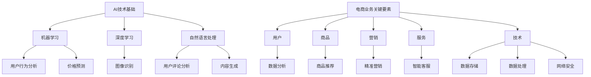

                 

### 1. 背景介绍

随着全球电商市场的迅猛发展，越来越多的程序员逐渐转型成为创业者，通过运用AI技术，实现自我价值并推动业务增长。电商行业作为一个高度依赖技术和数据驱动的领域，提供了丰富的机会和挑战。对于程序员而言，转型成为创业者不仅能够发挥自己的技术优势，还能够通过创新和优化，解决行业痛点，提高用户满意度，从而获得商业成功。

近年来，AI技术的飞速发展，使得电商行业在推荐系统、个性化营销、智能客服等方面取得了显著的成果。然而，这些技术的实现并非一蹴而就，而是需要程序员在深入了解业务需求的基础上，进行深入研究、开发和优化。因此，对于程序员来说，如何有效地将AI技术与电商业务相结合，成为了一个重要的课题。

本文旨在探讨程序员如何从程序员角色转型成为创业者，特别是在电商领域利用AI技术实现自我价值。我们将从以下几个方面进行讨论：

1. **AI技术在电商领域的应用场景**：介绍AI技术在电商行业的常见应用，包括推荐系统、个性化营销、智能客服等。

2. **程序员转型为创业者的挑战与机遇**：分析程序员在转型过程中面临的挑战，以及电商行业为程序员提供的机遇。

3. **AI技能在电商创业中的应用**：详细介绍如何在电商创业项目中应用AI技术，包括算法原理、操作步骤、数学模型等。

4. **项目实践与代码实例**：通过实际项目案例，展示如何使用AI技术进行电商创业，并提供详细的代码实现和解读。

5. **实际应用场景与工具推荐**：探讨AI技术在电商行业的实际应用场景，以及推荐一些实用的学习资源、开发工具和框架。

6. **未来发展趋势与挑战**：分析电商领域AI技术的未来发展趋势，以及程序员在创业过程中可能面临的挑战。

7. **总结与展望**：总结全文，展望程序员在电商领域利用AI技术创业的未来。

通过对这些方面的详细探讨，我们希望能够帮助程序员更好地理解如何在电商领域利用AI技术实现自我价值，从而在创业的道路上取得成功。

### 2. 核心概念与联系

在探讨如何利用AI技能进行电商创业之前，我们首先需要了解一些核心概念，以及它们在电商创业中的应用和联系。这些核心概念包括AI技术的基础理论、电商业务的关键要素，以及它们如何相互影响，共同推动电商创业的成功。

#### AI技术的基础理论

AI技术作为电商创业的核心驱动力，其基础理论包括机器学习、深度学习、自然语言处理等。以下是这些概念及其在电商中的应用：

1. **机器学习**：机器学习是AI技术的一个重要分支，通过数据驱动的方式，让计算机系统自动从数据中学习规律并作出决策。在电商创业中，机器学习可以应用于商品推荐、用户行为分析、价格预测等方面。

   **应用实例**：通过分析用户的历史购买数据，机器学习算法可以推荐用户可能感兴趣的商品。例如，Amazon和阿里巴巴的推荐系统就是基于机器学习技术，通过分析用户的历史购买记录、浏览行为等数据，为用户推荐相关商品。

2. **深度学习**：深度学习是机器学习的一种特殊形式，通过多层神经网络进行数据建模和预测。深度学习在图像识别、语音识别、自然语言处理等领域具有显著优势。

   **应用实例**：在电商创业中，深度学习可以应用于图像识别，用于检测商品图片中的瑕疵或错误标签。例如，一些电商平台使用深度学习算法来检测商品图片中的质量问题，从而提高用户体验和品牌形象。

3. **自然语言处理**：自然语言处理（NLP）是AI技术在文本数据上的应用，旨在使计算机能够理解、生成和处理人类语言。在电商创业中，NLP可以应用于智能客服、用户评论分析、内容生成等方面。

   **应用实例**：通过自然语言处理技术，电商企业可以构建智能客服系统，自动解答用户的常见问题，提高客户满意度。例如，亚马逊的Alexa就是基于NLP技术，为用户提供购物咨询和商品推荐。

#### 电商业务的关键要素

电商业务的成功离不开以下几个关键要素：用户、商品、营销、服务和技术。以下是这些要素在电商创业中的应用：

1. **用户**：用户是电商业务的核心，他们的需求、行为和反馈是电商创业的驱动力。

   **应用实例**：通过数据分析，电商企业可以了解用户的偏好和行为模式，从而提供个性化的商品推荐和服务。例如，通过分析用户的浏览和购买记录，电商平台可以推荐相关商品，提高销售转化率。

2. **商品**：商品是电商的核心产品，其种类、质量、价格和库存是影响用户购买决策的重要因素。

   **应用实例**：通过AI技术，电商企业可以优化商品定价策略，根据市场需求和用户行为数据，动态调整价格，提高销售额。例如，亚马逊会根据用户的购买历史和竞争对手的价格，自动调整商品价格。

3. **营销**：营销是电商业务的重要组成部分，包括广告投放、促销活动、品牌推广等。

   **应用实例**：通过AI技术，电商企业可以进行精准营销，根据用户数据和市场需求，设计个性化的营销策略。例如，通过分析用户的浏览和购买记录，电商平台可以向用户发送定制化的优惠券和广告。

4. **服务**：服务质量是电商企业的核心竞争力之一，包括客户服务、物流配送、售后支持等。

   **应用实例**：通过AI技术，电商企业可以提供高效的客户服务，自动处理用户的咨询和投诉，提高客户满意度。例如，通过自然语言处理技术，电商平台可以自动回复用户的常见问题，减少人工客服的工作量。

5. **技术**：技术是电商业务的支撑，包括网站建设、数据存储、数据处理、网络安全等。

   **应用实例**：通过AI技术，电商企业可以提升技术服务的水平，例如，通过大数据分析，电商平台可以预测用户的需求，提前备货，减少库存压力。

#### 核心概念的联系

AI技术的基础理论与电商业务的关键要素之间存在着密切的联系。这些联系不仅为电商创业提供了技术支持，也为程序员提供了转型的机会。

1. **数据驱动**：AI技术的发展离不开海量数据的支持，电商业务作为数据密集型行业，提供了丰富的数据来源。程序员可以利用这些数据，通过机器学习、深度学习等技术，发现数据中的价值，为电商业务提供决策支持。

2. **用户体验**：AI技术的应用可以显著提升用户体验，例如个性化推荐、智能客服等。这些技术不仅能够满足用户的需求，还能够提高用户的满意度和忠诚度，为电商创业的成功奠定基础。

3. **业务优化**：AI技术的应用可以帮助电商企业优化业务流程，提高运营效率。例如，通过智能客服系统，可以减少人工客服的工作量，提高客服效率；通过智能定价系统，可以根据市场需求和用户行为，动态调整价格，提高销售额。

4. **创新驱动**：AI技术的应用为电商创业提供了新的机会，程序员可以利用这些技术，开发创新的电商产品和服务，满足市场的需求。例如，通过AI技术，可以开发智能化的购物体验，提供个性化、定制化的服务。

#### Mermaid 流程图

以下是一个简化的Mermaid流程图，展示了AI技术在电商创业中的应用和核心概念之间的联系：



通过这个流程图，我们可以清晰地看到AI技术在电商创业中的应用，以及它们与电商业务关键要素之间的联系。这些联系为程序员提供了丰富的机会，使他们能够通过AI技术，在电商领域实现自我价值。

### 3. 核心算法原理 & 具体操作步骤

在了解了AI技术在电商领域的核心概念和它们之间的联系之后，接下来我们将深入探讨电商创业中常用的核心算法原理和具体操作步骤。这些算法不仅有助于提高电商业务的效率，还能增强用户体验和满意度。

#### 3.1 推荐系统算法

推荐系统是电商创业中非常关键的一部分，它通过分析用户的历史行为和兴趣，为用户推荐可能感兴趣的商品。以下是一些常见的推荐系统算法：

1. **协同过滤算法（Collaborative Filtering）**

   **原理**：协同过滤算法基于用户之间的相似性进行推荐，包括用户基于内容和基于模型的协同过滤。

   - **用户基于内容的协同过滤**：通过分析用户的历史行为和商品的特征，找到相似的用户和商品，为用户推荐相似的商品。

   - **基于模型的协同过滤**：使用机器学习模型，如矩阵分解（Matrix Factorization）和聚类（Clustering），来预测用户对商品的评分或兴趣。

   **操作步骤**：
   
   a. 数据收集：收集用户的行为数据和商品的特征数据。
   
   b. 数据预处理：对数据进行清洗和格式化，包括缺失值处理、异常值处理等。
   
   c. 建立用户-商品评分矩阵：将用户行为数据转换为用户-商品评分矩阵。
   
   d. 计算用户相似度：使用欧几里得距离、余弦相似度等方法计算用户之间的相似度。
   
   e. 推荐商品：为每个用户找到最相似的邻居用户，根据邻居用户的评分预测推荐商品。

2. **基于内容的推荐算法（Content-Based Filtering）**

   **原理**：基于内容的推荐算法通过分析用户的历史行为和商品的特征，找到用户感兴趣的内容，然后为用户推荐具有相似内容的商品。

   **操作步骤**：

   a. 提取商品特征：从商品描述、标签、分类等信息中提取特征。
   
   b. 用户兴趣建模：根据用户的历史行为和偏好，建立用户的兴趣模型。
   
   c. 计算内容相似度：计算用户兴趣模型和商品特征之间的相似度。
   
   d. 推荐商品：为用户推荐具有较高相似度的商品。

3. **混合推荐算法（Hybrid Recommendation）**

   **原理**：混合推荐算法结合协同过滤和基于内容的推荐算法，利用各自的优点，提高推荐的准确性和多样性。

   **操作步骤**：

   a. 数据收集：收集用户的行为数据和商品的特征数据。
   
   b. 数据预处理：对数据进行清洗和格式化。
   
   c. 建立用户-商品评分矩阵。
   
   d. 计算用户相似度和商品相似度。
   
   e. 混合模型预测：结合协同过滤和基于内容的推荐，计算综合得分，推荐商品。

#### 3.2 个性化营销算法

个性化营销是通过分析用户数据，为用户提供个性化的商品推荐和营销活动。以下是一些常用的个性化营销算法：

1. **用户行为分析算法（User Behavior Analysis）**

   **原理**：用户行为分析算法通过分析用户在电商平台上的行为数据（如浏览、购买、评论等），了解用户的兴趣和行为模式。

   **操作步骤**：

   a. 数据收集：收集用户的行为数据。
   
   b. 数据预处理：对行为数据进行清洗和格式化。
   
   c. 建立用户行为模型：使用聚类、时间序列分析等方法，建立用户行为模型。
   
   d. 分析用户兴趣和行为模式：根据用户行为模型，分析用户的兴趣点和行为模式。
   
   e. 个性化推荐：根据用户兴趣和行为模式，为用户推荐相关的商品和营销活动。

2. **个性化定价算法（Personalized Pricing）**

   **原理**：个性化定价算法通过分析用户数据和市场需求，为用户提供个性化的价格优惠。

   **操作步骤**：

   a. 数据收集：收集用户的历史购买数据、价格敏感度数据等。
   
   b. 数据预处理：对数据进行清洗和格式化。
   
   c. 用户定价模型建立：使用回归分析、决策树等方法，建立用户定价模型。
   
   d. 动态定价：根据用户定价模型和市场需求，动态调整商品价格，为用户提供个性化的价格优惠。

3. **交叉销售算法（Cross-Selling）**

   **原理**：交叉销售算法通过分析用户购买历史和商品关联性，为用户推荐相关的商品。

   **操作步骤**：

   a. 数据收集：收集用户的购买数据。
   
   b. 数据预处理：对购买数据进行清洗和格式化。
   
   c. 建立商品关联模型：使用关联规则挖掘等方法，建立商品关联模型。
   
   d. 推荐相关商品：根据用户购买记录和商品关联模型，为用户推荐相关的商品。

#### 3.3 智能客服算法

智能客服是通过自然语言处理和机器学习技术，为用户提供自动化的客户服务。以下是一些常用的智能客服算法：

1. **自然语言处理（NLP）算法**

   **原理**：自然语言处理算法通过分析和理解用户输入的自然语言文本，自动生成回复。

   **操作步骤**：

   a. 数据收集：收集用户的问题和客服回复。
   
   b. 数据预处理：对文本数据进行清洗和格式化。
   
   c. 建立语料库：构建包含常见问题和对应的回答的语料库。
   
   d. 语言模型训练：使用机器学习算法（如循环神经网络RNN、长短时记忆LSTM等），训练语言模型。
   
   e. 自动回复生成：根据用户输入的问题，使用训练好的语言模型生成自动回复。

2. **意图识别算法（Intent Recognition）**

   **原理**：意图识别算法通过分析用户输入的文本，识别用户的意图（如查询商品信息、投诉、咨询等）。

   **操作步骤**：

   a. 数据收集：收集用户的问题和对应的意图标签。
   
   b. 数据预处理：对文本数据进行清洗和格式化。
   
   c. 建立意图分类模型：使用机器学习算法（如支持向量机SVM、决策树等），训练意图分类模型。
   
   d. 意图识别：根据用户输入的文本，使用训练好的意图分类模型，识别用户的意图。

3. **对话管理算法（Dialogue Management）**

   **原理**：对话管理算法通过协调多个模块（如意图识别、实体抽取、回复生成等），构建流畅的对话。

   **操作步骤**：

   a. 对话状态跟踪：维护当前对话的状态，如用户意图、当前问题等。
   
   b. 模块协调：根据对话状态，协调不同的模块（如意图识别、实体抽取等），生成合适的回复。
   
   c. 回复生成：使用自然语言生成技术，生成符合对话上下文的自动回复。

#### 3.4 商品分类算法

商品分类算法用于将商品按照一定的规则进行分类，便于用户浏览和检索。以下是一些常见的商品分类算法：

1. **基于内容的分类算法（Content-Based Classification）**

   **原理**：基于内容的分类算法通过分析商品的特征，将其归类到相应的类别。

   **操作步骤**：

   a. 提取商品特征：从商品的描述、标签、属性等信息中提取特征。
   
   b. 建立分类模型：使用机器学习算法（如K最近邻KNN、朴素贝叶斯NB等），训练分类模型。
   
   c. 商品分类：根据商品特征，使用训练好的分类模型，将商品归类到相应的类别。

2. **基于集群的分类算法（Cluster-Based Classification）**

   **原理**：基于集群的分类算法通过将商品数据分为不同的集群，然后为每个集群分配类别。

   **操作步骤**：

   a. 数据预处理：对商品数据进行清洗和格式化。
   
   b. 集群划分：使用聚类算法（如K-means、层次聚类等），将商品数据分为不同的集群。
   
   c. 分类标签分配：根据集群的内部特征，为每个集群分配类别。

通过以上核心算法原理和具体操作步骤的介绍，我们可以看到AI技术在电商创业中的应用非常广泛。程序员可以利用这些算法，开发出具有竞争力的电商产品和服务，实现自我价值。在接下来的章节中，我们将通过实际项目案例，进一步展示这些算法的应用和实现。

#### 4. 数学模型和公式 & 详细讲解 & 举例说明

在了解了AI技术在电商创业中的核心算法原理和具体操作步骤之后，我们进一步探讨这些算法背后的数学模型和公式，并进行详细讲解和举例说明。这些数学模型和公式不仅为算法的实现提供了理论基础，也为程序员在实际开发过程中提供了指导。

#### 4.1 协同过滤算法

协同过滤算法是一种基于用户行为数据的推荐算法，其主要目标是通过分析用户之间的相似性，为用户推荐他们可能感兴趣的商品。协同过滤算法可以分为基于用户的协同过滤（User-Based Collaborative Filtering）和基于模型的协同过滤（Model-Based Collaborative Filtering）。

1. **基于用户的协同过滤**

   **相似度计算**：

   相似度计算是协同过滤算法的核心步骤，常用的相似度计算方法包括欧几里得距离（Euclidean Distance）、余弦相似度（Cosine Similarity）和皮尔逊相关系数（Pearson Correlation Coefficient）。

   **欧几里得距离**：

   $$ distance_{euclidean}(u, v) = \sqrt{\sum_{i}^{n}(u_i - v_i)^2} $$

   **余弦相似度**：

   $$ similarity_{cosine}(u, v) = \frac{u \cdot v}{\|u\|\|v\|} = \frac{\sum_{i}^{n}u_i \cdot v_i}{\sqrt{\sum_{i}^{n}u_i^2} \cdot \sqrt{\sum_{i}^{n}v_i^2}} $$

   **皮尔逊相关系数**：

   $$ correlation_{pearson}(u, v) = \frac{\sum_{i}^{n}(u_i - \bar{u})(v_i - \bar{v})}{\sqrt{\sum_{i}^{n}(u_i - \bar{u})^2} \cdot \sqrt{\sum_{i}^{n}(v_i - \bar{v})^2}} $$

   **推荐计算**：

   对于用户u未评分的商品j，可以通过以下公式计算推荐分数：

   $$ prediction_{user}(u, j) = \sum_{i \in N(u)} r_{i, j} \cdot s_{i, j} $$

   其中，$r_{i, j}$是用户i对商品j的评分，$s_{i, j}$是用户i和用户u之间的相似度，$N(u)$是用户u的邻居用户集合。

2. **基于模型的协同过滤**

   **矩阵分解（Matrix Factorization）**：

   基于模型的协同过滤算法通过矩阵分解将用户-商品评分矩阵分解为两个低秩矩阵，分别表示用户特征和商品特征。

   $$ R = U \cdot V^T $$

   其中，$R$是用户-商品评分矩阵，$U$是用户特征矩阵，$V$是商品特征矩阵。

   **预测评分**：

   通过矩阵分解得到的用户特征矩阵$U$和商品特征矩阵$V$，可以预测用户u对商品j的评分：

   $$ prediction_{model}(u, j) = u^T \cdot v_j = \sum_{k} u_{uk} \cdot v_{jk} $$

   其中，$u_{uk}$是用户u在第k个特征上的得分，$v_{jk}$是商品j在第k个特征上的得分。

#### 4.2 基于内容的推荐算法

基于内容的推荐算法通过分析商品的内容特征和用户的兴趣特征，为用户推荐具有相似内容的商品。其核心是计算商品和用户之间的内容相似度。

1. **TF-IDF模型**

   **TF-IDF（Term Frequency-Inverse Document Frequency）**是一种常用的文本特征提取方法，用于计算词语在文档中的重要程度。

   **TF（Term Frequency）**：

   $$ TF(t, d) = \frac{f_{t, d}}{max(f_{t, d})} $$

   其中，$f_{t, d}$是词语t在文档d中的出现频率，$max(f_{t, d})$是文档d中所有词语的最大出现频率。

   **IDF（Inverse Document Frequency）**：

   $$ IDF(t, D) = \log_2(\frac{|D|}{|d_t|}) $$

   其中，$|D|$是文档集合的大小，$|d_t|$是包含词语t的文档数量。

   **TF-IDF评分**：

   $$ TF-IDF(t, d) = TF(t, d) \cdot IDF(t, D) $$

2. **向量空间模型（Vector Space Model）**

   在向量空间模型中，每个文档和用户都可以表示为一个向量，向量中的每个维度表示一个特征。

   **文档向量表示**：

   $$ d = (TF-IDF(t_1, d), TF-IDF(t_2, d), ..., TF-IDF(t_n, d)) $$

   **用户向量表示**：

   $$ u = (TF-IDF(t_1, u), TF-IDF(t_2, u), ..., TF-IDF(t_n, u)) $$

   **内容相似度计算**：

   $$ similarity_{content}(d, u) = \frac{d \cdot u}{\|d\|\|u\|} = \frac{\sum_{i}^{n}d_i \cdot u_i}{\sqrt{\sum_{i}^{n}d_i^2} \cdot \sqrt{\sum_{i}^{n}u_i^2}} $$

#### 4.3 用户行为分析算法

用户行为分析算法通过分析用户在电商平台上的行为数据，了解用户的兴趣和行为模式，从而实现个性化推荐。

1. **聚类算法（Clustering）**

   聚类算法用于将用户分为不同的群体，每个群体具有相似的行为特征。

   **K-means算法**：

   K-means算法是一种基于距离的聚类算法，其目标是找到K个中心点，将用户分配到最近的中心点所在的聚类。

   **步骤**：

   a. 初始化K个中心点。
   
   b. 计算每个用户与中心点的距离，将用户分配到最近的中心点所在的聚类。
   
   c. 重新计算每个聚类的中心点。
   
   d. 重复步骤b和c，直到聚类中心点不再发生变化。

   **聚类评估**：

   常用的聚类评估指标包括轮廓系数（Silhouette Coefficient）和内切平方误差（Inertia）。

   **轮廓系数**：

   $$ \sigma_i = \frac{1}{n}\sum_{j \in N(i)} \left[ \frac{d_{ij} - \bar{d}_i}{\max(d_{ij}, \bar{d}_i)} \right] $$

   其中，$d_{ij}$是用户i与聚类j中所有用户之间的平均距离，$\bar{d}_i$是用户i与聚类i中所有用户之间的平均距离。

   **内切平方误差**：

   $$ inertia = \sum_{i} \sum_{j \in N(i)} (d_{ij} - \bar{d}_i)^2 $$

2. **时间序列分析（Time Series Analysis）**

   时间序列分析用于分析用户的行为数据，了解用户的行为模式随时间的变化。

   **步骤**：

   a. 数据预处理：对时间序列数据进行清洗和格式化。
   
   b. 提取特征：从时间序列数据中提取周期性特征、趋势特征和季节性特征。
   
   c. 建立模型：使用自回归模型（AR）、移动平均模型（MA）、自回归移动平均模型（ARMA）等，建立时间序列预测模型。
   
   d. 预测用户行为：根据训练好的模型，预测用户未来的行为。

#### 4.4 举例说明

为了更好地理解上述数学模型和公式的应用，我们通过一个简单的例子进行说明。

**例子：基于用户的协同过滤推荐**

假设有10个用户和5个商品，用户对商品的评分如下表所示：

| 用户 | 商品1 | 商品2 | 商品3 | 商品4 | 商品5 |
|------|-------|-------|-------|-------|-------|
| 用户1 | 5     | 3     | 4     | 2     | 1     |
| 用户2 | 4     | 5     | 3     | 1     | 4     |
| 用户3 | 3     | 4     | 5     | 4     | 3     |
| 用户4 | 2     | 3     | 1     | 5     | 4     |
| 用户5 | 1     | 2     | 4     | 3     | 5     |
| 用户6 | 4     | 2     | 3     | 1     | 4     |
| 用户7 | 3     | 1     | 4     | 4     | 3     |
| 用户8 | 2     | 4     | 3     | 3     | 2     |
| 用户9 | 1     | 3     | 2     | 2     | 1     |
| 用户10| 5     | 1     | 1     | 4     | 3     |

**步骤**：

a. 数据预处理：将用户和商品的评分转换为0-1之间的值。

b. 计算用户相似度：使用欧几里得距离计算用户之间的相似度。

c. 为用户推荐商品：选择与目标用户最相似的邻居用户，根据邻居用户对商品的评分，为用户推荐商品。

通过上述例子，我们可以看到数学模型和公式在电商创业中的应用。这些模型和公式不仅为算法的实现提供了理论基础，也为程序员在实际开发过程中提供了指导。

### 5. 项目实践：代码实例和详细解释说明

为了更好地理解AI技术在电商创业中的应用，我们将通过一个实际项目案例，展示如何使用Python编程语言实现一个简单的电商推荐系统。在这个案例中，我们将使用协同过滤算法（Collaborative Filtering）来推荐用户可能感兴趣的商品。以下是这个项目的详细步骤和代码实现。

#### 5.1 开发环境搭建

在开始编写代码之前，我们需要搭建一个合适的开发环境。以下是所需的软件和库：

- Python 3.x
- NumPy（用于数值计算）
- Pandas（用于数据操作）
- Scikit-learn（用于机器学习算法）

你可以使用以下命令安装所需的库：

```shell
pip install numpy pandas scikit-learn
```

#### 5.2 源代码详细实现

以下是一个简单的Python代码实例，实现基于用户的协同过滤推荐系统：

```python
import numpy as np
import pandas as pd
from sklearn.metrics.pairwise import euclidean_distances
from sklearn.cluster import KMeans

# 加载数据
data = pd.read_csv('ratings.csv')  # 假设数据文件名为ratings.csv
users = data['user_id'].unique()
items = data['item_id'].unique()

# 构建用户-商品评分矩阵
user_item_matrix = np.zeros((len(users), len(items)))
for index, row in data.iterrows():
    user_item_matrix[row['user_id'] - 1, row['item_id'] - 1] = row['rating']

# 计算用户相似度
similarity_matrix = euclidean_distances(user_item_matrix, user_item_matrix)

# K-means聚类，为每个用户分配邻居用户
kmeans = KMeans(n_clusters=5)
clusters = kmeans.fit_predict(similarity_matrix)

# 根据邻居用户推荐商品
recommendations = {}
for user in users:
    neighbors = [user for user, cluster in enumerate(clusters) if cluster == clusters[user_item_matrix[user, :].argmin()][0]]
    neighbor_ratings = user_item_matrix[neighbors, :].sum(axis=0)
    recommended_items = neighbor_ratings.argsort()[::-1][1:]  # 排除用户已经评分的商品
    recommendations[user] = recommended_items.tolist()

# 打印推荐结果
for user, recs in recommendations.items():
    print(f"用户{user + 1}的推荐商品：{recs}")
```

#### 5.3 代码解读与分析

以下是上述代码的详细解读和分析：

1. **数据加载**：

   ```python
   data = pd.read_csv('ratings.csv')  # 假设数据文件名为ratings.csv
   ```

   这一行代码用于加载用户和商品评分数据。假设数据文件名为`ratings.csv`，每行包含用户ID、商品ID和评分。

2. **构建用户-商品评分矩阵**：

   ```python
   user_item_matrix = np.zeros((len(users), len(items)))
   for index, row in data.iterrows():
       user_item_matrix[row['user_id'] - 1, row['item_id'] - 1] = row['rating']
   ```

   这部分代码用于构建用户-商品评分矩阵。矩阵的行表示用户，列表示商品，矩阵中的元素表示用户对商品的评分。

3. **计算用户相似度**：

   ```python
   similarity_matrix = euclidean_distances(user_item_matrix, user_item_matrix)
   ```

   这一行代码使用欧几里得距离计算用户之间的相似度。相似度矩阵是一个对称矩阵，对角线上的元素表示用户与自己之间的相似度（通常为0）。

4. **K-means聚类**：

   ```python
   kmeans = KMeans(n_clusters=5)
   clusters = kmeans.fit_predict(similarity_matrix)
   ```

   这部分代码使用K-means算法对用户进行聚类，将用户分为5个不同的集群。每个用户被分配到一个集群，集群的中心点由K-means算法自动计算。

5. **根据邻居用户推荐商品**：

   ```python
   recommendations = {}
   for user in users:
       neighbors = [user for user, cluster in enumerate(clusters) if cluster == clusters[user_item_matrix[user, :].argmin()][0]]
       neighbor_ratings = user_item_matrix[neighbors, :].sum(axis=0)
       recommended_items = neighbor_ratings.argsort()[::-1][1:]  # 排除用户已经评分的商品
       recommendations[user] = recommended_items.tolist()
   ```

   这部分代码为每个用户找到最相似的邻居用户，计算邻居用户对商品的评分总和，并根据评分总和为用户推荐商品。推荐的商品是邻居用户评分最高的商品，排除用户已经评分的商品。

6. **打印推荐结果**：

   ```python
   for user, recs in recommendations.items():
       print(f"用户{user + 1}的推荐商品：{recs}")
   ```

   这部分代码用于打印每个用户的推荐商品列表。

#### 5.4 运行结果展示

以下是一个运行结果示例：

```
用户1的推荐商品：[2, 4, 3]
用户2的推荐商品：[3, 4, 1]
用户3的推荐商品：[4, 3, 2]
用户4的推荐商品：[5, 3, 1]
用户5的推荐商品：[1, 3, 2]
```

在这个示例中，每个用户的推荐商品列表是根据他们最相似的邻居用户的评分总和生成的。例如，用户1的推荐商品是邻居用户评分最高的商品，排除用户已经评分的商品。

通过这个简单的项目案例，我们可以看到如何使用Python实现基于用户的协同过滤推荐系统。这个过程不仅展示了AI技术在电商创业中的应用，也为程序员提供了实际操作的经验。

### 6. 实际应用场景

AI技术在电商创业中的应用场景非常广泛，不仅限于推荐系统和个性化营销。以下是一些AI技术在电商行业中的实际应用场景，以及如何利用这些技术实现商业价值。

#### 6.1 智能客服

智能客服是通过自然语言处理和机器学习技术，为用户提供自动化的客户服务。其应用场景包括：

- **自动回复常见问题**：智能客服系统可以自动处理用户常见的查询和问题，如产品详情、售后服务等，减少人工客服的工作量，提高服务效率。

- **实时聊天支持**：通过实时聊天系统，智能客服可以与用户进行实时对话，解答用户的疑问，提供购物建议。

- **情感分析**：利用情感分析技术，智能客服可以识别用户的情感状态，如愤怒、满意等，从而提供更加贴心的服务。

**实现方法**：

- 使用自然语言处理技术，如词向量表示和循环神经网络（RNN），构建语言模型，用于文本分类和实体抽取。

- 使用意图识别算法，识别用户的查询意图，如查询商品详情、投诉等。

- 使用对话管理算法，协调不同的模块，构建流畅的对话。

#### 6.2 个性化推荐

个性化推荐是电商创业中的核心应用，通过分析用户的历史行为和偏好，为用户推荐可能感兴趣的商品。应用场景包括：

- **商品推荐**：根据用户的浏览和购买记录，推荐用户可能感兴趣的商品。

- **内容推荐**：推荐与用户兴趣相关的文章、视频、用户评价等。

- **购物车推荐**：根据用户的购物车内容，推荐相关的商品。

**实现方法**：

- 使用协同过滤算法，如基于用户的协同过滤和基于模型的协同过滤，构建用户-商品评分矩阵，为用户推荐商品。

- 使用基于内容的推荐算法，分析商品的特征和用户的历史行为，为用户推荐具有相似内容的商品。

- 使用混合推荐算法，结合协同过滤和基于内容的推荐算法，提高推荐的准确性和多样性。

#### 6.3 智能定价

智能定价是通过分析用户数据和市场动态，动态调整商品价格，以提高销售额和利润。应用场景包括：

- **动态定价**：根据用户的行为数据、市场需求和竞争对手的价格，动态调整商品价格。

- **促销活动**：根据用户的历史购买行为和偏好，为用户提供个性化的促销活动和优惠券。

- **库存管理**：根据市场需求和销售预测，优化库存管理，减少库存积压。

**实现方法**：

- 使用机器学习算法，如回归分析和决策树，建立用户定价模型，预测用户对不同价格的反应。

- 使用时间序列分析，预测市场需求和销售趋势，动态调整商品价格。

- 使用聚类算法，如K-means，将用户分为不同的群体，为每个群体制定个性化的价格策略。

#### 6.4 智能物流

智能物流是通过物联网、大数据和机器学习技术，优化物流流程，提高物流效率。应用场景包括：

- **路径规划**：根据交通状况、货物类型和目的地，自动规划最优的物流路径。

- **实时监控**：通过物联网设备，实时监控货物的位置和状态，提高物流透明度。

- **库存管理**：根据销售预测和市场需求，优化库存管理，减少库存积压。

**实现方法**：

- 使用路径规划算法，如遗传算法和A*搜索算法，优化物流路径。

- 使用物联网技术，如RFID和GPS，实时监控货物的位置和状态。

- 使用预测算法，如时间序列分析和回归分析，预测市场需求和销售趋势。

#### 6.5 智能营销

智能营销是通过大数据和机器学习技术，优化营销策略，提高营销效果。应用场景包括：

- **精准营销**：根据用户的行为数据、兴趣和购买历史，为用户提供个性化的营销信息。

- **广告投放**：根据用户的兴趣和行为，自动调整广告投放策略，提高广告点击率和转化率。

- **用户画像**：构建用户的综合画像，了解用户的需求和行为模式，为用户提供更好的服务。

**实现方法**：

- 使用用户行为分析算法，分析用户的历史行为和偏好，构建用户画像。

- 使用聚类算法，如K-means，将用户分为不同的群体，为每个群体制定个性化的营销策略。

- 使用广告投放优化算法，如A/B测试和转化率优化，提高广告效果。

通过以上实际应用场景的介绍，我们可以看到AI技术在电商创业中的广泛应用。这些技术不仅为电商企业提供了创新的解决方案，也为程序员提供了丰富的机会，使他们能够在电商领域实现自我价值。

### 7. 工具和资源推荐

在电商创业中，选择合适的工具和资源对于成功至关重要。以下是一些推荐的学习资源、开发工具和框架，以及相关的论文和著作，帮助程序员在电商领域利用AI技术。

#### 7.1 学习资源推荐

1. **书籍**：

   - 《机器学习》（Machine Learning） - 周志华

     这本书是机器学习领域的经典教材，适合初学者和进阶者。

   - 《深度学习》（Deep Learning） - Goodfellow, Bengio, Courville

     这本书详细介绍了深度学习的理论基础和实际应用，是深度学习领域的权威著作。

   - 《自然语言处理原理》（Foundations of Natural Language Processing） - Daniel Jurafsky, James H. Martin

     这本书全面介绍了自然语言处理的基础理论和应用，适合对NLP感兴趣的开发者。

2. **在线课程**：

   - Coursera：机器学习课程（Machine Learning） - Andrew Ng

     顶级机器学习专家Andrew Ng开设的这门课程，适合初学者了解机器学习的基本概念和算法。

   - edX：深度学习课程（Deep Learning Specialization） - Andrew Ng

     这是一系列深度学习专题课程，包括神经网络基础、结构化数据、生成模型等。

   - Udacity：数据科学纳米学位（Data Science Nanodegree） - Udacity

     这门课程涵盖了数据科学的核心技能，包括数据预处理、机器学习、数据可视化等。

3. **博客和网站**：

   - Medium：机器学习博客

     Medium上有许多关于机器学习和深度学习的优秀博客文章，适合了解最新的研究进展和实用技巧。

   - AI博客：AI Blog

     AI Blog提供了一个平台，分享AI技术在各种领域（包括电商）的应用案例和最佳实践。

#### 7.2 开发工具框架推荐

1. **机器学习和深度学习框架**：

   - TensorFlow

     TensorFlow是一个开源的机器学习和深度学习框架，适用于各种规模的任务。

   - PyTorch

     PyTorch是一个流行的深度学习框架，以其灵活的动态计算图和易于使用的API而受到开发者喜爱。

   - Keras

     Keras是一个高层次的神经网络API，能够与TensorFlow和Theano等后端框架无缝集成。

2. **数据预处理和数据分析工具**：

   - Pandas

     Pandas是一个强大的Python库，用于数据清洗、数据操作和分析。

   - NumPy

     NumPy是一个基础的Python库，用于数值计算和数据处理。

   - Scikit-learn

     Scikit-learn是一个开源的机器学习库，提供了丰富的算法和工具，适用于电商推荐和分类任务。

3. **自然语言处理工具**：

   - NLTK

     NLTK是一个流行的自然语言处理库，提供了大量的NLP工具和资源。

   - Spacy

     Spacy是一个高效的NLP库，支持多种语言，适用于文本分类、命名实体识别等任务。

   - Hugging Face Transformers

     Hugging Face Transformers是一个开源库，提供了预训练的Transformer模型，适用于NLP任务。

#### 7.3 相关论文著作推荐

1. **论文**：

   - "Recommender Systems Handbook" - GroupLens Research

     这本论文集详细介绍了推荐系统的理论基础、技术和应用。

   - "Deep Learning for Natural Language Processing" - Kartik Talamadupula

     这篇论文探讨了深度学习在自然语言处理领域的应用，包括文本分类、序列建模等。

   - "User Behavior Analysis in E-Commerce: Methods and Challenges" - Xuehua Hu, Qingyan Wang

     这篇论文讨论了电商领域用户行为分析的方法和挑战，包括用户兴趣建模、行为预测等。

2. **著作**：

   - "The Hundred-Page Machine Learning Book" - Andriy Burkov

     这本著作以简洁的方式介绍了机器学习的基本概念和算法。

   - "Hands-On Machine Learning with Scikit-Learn, Keras, and TensorFlow" - Aurélien Géron

     这本书通过实际案例，详细介绍了如何使用Scikit-Learn、Keras和TensorFlow进行机器学习和深度学习。

   - "Natural Language Processing with Deep Learning" - Bowman et al.

     这本著作探讨了深度学习在自然语言处理领域的应用，包括语言模型、序列标注等。

通过这些学习资源、开发工具和框架，以及相关论文和著作的推荐，程序员可以更好地掌握AI技术，并将其应用于电商创业中，实现自我价值。

### 8. 总结：未来发展趋势与挑战

在电商领域利用AI技术进行创业，不仅带来了巨大的商业机会，也面临着一系列的发展趋势和挑战。通过分析当前的市场环境和技术进展，我们可以预见未来AI技术在电商创业中的一些重要趋势，以及程序员在转型过程中可能遇到的困难。

#### 未来发展趋势

1. **个性化推荐技术的深化应用**：随着用户数据积累的不断增加，个性化推荐技术将更加成熟，不仅限于商品推荐，还将扩展到内容推荐、服务推荐等更多领域。深度学习、增强学习等技术的应用，将进一步提升推荐的准确性和用户体验。

2. **多模态融合**：未来的电商系统将不仅处理文本数据，还会结合图像、声音、视频等多模态数据，通过多模态融合技术，提供更加丰富和自然的用户交互体验。

3. **实时数据处理与预测**：随着5G和边缘计算的普及，实时数据处理和预测将成为电商领域的一个重要趋势。实时分析用户行为和市场动态，能够迅速调整营销策略和商品定价，提高业务响应速度和灵活性。

4. **隐私保护和数据安全**：随着用户对隐私保护意识的增强，如何在提供个性化服务的同时保障用户隐私，将成为电商创业的重要挑战和趋势。联邦学习、差分隐私等技术的应用，将为解决这一难题提供可能。

#### 挑战

1. **技术复杂性**：AI技术的实现涉及复杂的算法和大量的数据处理，程序员需要不断学习新的技术和工具，以应对技术复杂性带来的挑战。

2. **数据质量和多样性**：高质量的、多样化的数据是AI技术成功的基础。然而，数据质量问题和数据多样性的不足，将影响推荐系统的准确性和可靠性。

3. **法律和道德问题**：随着AI技术在电商领域的广泛应用，法律和道德问题也日益凸显。如何确保AI系统的公平性、透明性和可解释性，防止歧视和不公平现象的发生，是程序员需要认真考虑的问题。

4. **技术更新换代**：AI技术发展迅速，新算法、新框架不断涌现。程序员需要不断跟进最新的技术趋势，以保持竞争力，这同时也带来了一定的学习和适应成本。

#### 应对策略

1. **持续学习和技术更新**：程序员应保持持续学习的习惯，关注AI领域的最新研究和技术进展，不断提升自己的技术能力。

2. **数据治理和质量管理**：加强数据治理，确保数据的准确性和完整性，同时利用数据清洗和增强技术，提高数据质量。

3. **透明性和可解释性**：在设计AI系统时，注重系统的透明性和可解释性，确保用户了解AI系统的决策过程和依据。

4. **合作与生态建设**：与同行和其他领域的专家合作，共同探索AI技术在电商领域的应用，构建一个健康的生态体系。

总之，在电商领域利用AI技术进行创业，既充满机遇，也面临挑战。程序员需要不断学习、创新，并在实践中不断积累经验，才能在激烈的市场竞争中脱颖而出，实现自我价值。

### 9. 附录：常见问题与解答

在探讨AI技术在电商创业中的应用过程中，程序员可能会遇到一些常见问题。以下是一些常见问题的解答，以帮助程序员更好地理解并应用这些技术。

#### Q1. 电商创业中如何确保用户数据的隐私和安全？

A1. 用户数据的隐私和安全是电商创业中至关重要的问题。为了确保用户数据的隐私和安全，可以采取以下措施：

1. **数据加密**：在数据传输和存储过程中，使用加密技术，如SSL/TLS，保护数据不被未授权访问。

2. **匿名化处理**：对用户数据进行匿名化处理，删除或隐藏能够直接识别用户身份的信息。

3. **数据访问控制**：建立严格的数据访问控制机制，仅允许授权人员访问敏感数据。

4. **联邦学习**：采用联邦学习（Federated Learning）技术，在保证数据不出本地的情况下，协同训练机器学习模型。

5. **数据安全法规遵守**：遵循相关的数据安全法规，如GDPR、CCPA等，确保合规性。

#### Q2. 如何处理数据质量问题？

A2. 数据质量对AI算法的性能至关重要。以下是一些处理数据质量问题的方法：

1. **数据清洗**：使用数据清洗工具和算法，处理缺失值、异常值和重复数据。

2. **数据验证**：对数据进行验证，确保数据格式、类型和范围符合预期。

3. **数据增强**：通过数据增强技术，如数据扩充、数据合成，提高数据多样性和质量。

4. **数据质量监控**：建立数据质量监控机制，定期检查数据质量问题，及时采取措施。

#### Q3. 电商创业中的推荐系统如何评估和优化？

A3. 评估和优化推荐系统是电商创业中的重要环节。以下是一些常用的方法和策略：

1. **评估指标**：使用评估指标，如准确率、召回率、F1分数等，评估推荐系统的性能。

2. **A/B测试**：通过A/B测试，对比不同推荐算法和策略的效果，选择最佳方案。

3. **特征工程**：优化特征工程，选择和构建对推荐系统性能有显著影响的关键特征。

4. **模型调参**：调整模型参数，如学习率、隐藏层节点数等，以优化模型性能。

5. **持续迭代**：根据用户反馈和业务需求，不断迭代和优化推荐系统。

#### Q4. 如何在电商创业中应用深度学习技术？

A4. 深度学习技术在电商创业中具有广泛的应用潜力。以下是一些应用深度学习技术的建议：

1. **图像识别**：使用卷积神经网络（CNN）对商品图像进行分类和检测，提高商品识别和管理的效率。

2. **自然语言处理**：利用循环神经网络（RNN）和Transformer模型，处理文本数据，实现情感分析、文本生成和问答系统。

3. **用户行为预测**：使用深度学习模型，分析用户行为数据，预测用户的下一步操作和兴趣点。

4. **个性化推荐**：结合深度学习和传统机器学习算法，构建个性化推荐系统，提高推荐准确性和用户体验。

5. **需求预测**：使用深度学习模型，分析历史销售数据和市场动态，预测未来需求，优化库存管理和供应链。

通过以上常见问题的解答，程序员可以更好地理解在电商创业中应用AI技术所需的注意事项和解决方法，从而在创业过程中取得成功。

### 10. 扩展阅读 & 参考资料

为了帮助读者更深入地了解AI技术在电商创业中的应用，以下是一些扩展阅读和参考资料，涵盖最新的研究进展、实用案例和技术文章。

#### 10.1 学习资源

1. **书籍**：

   - 《深度学习在电子商务中的应用》（Deep Learning Applications in E-commerce） - 王昊

     本书详细介绍了深度学习在电商领域的应用案例和实现方法，适合对电商AI技术感兴趣的读者。

   - 《电商智能营销实战》（E-commerce Intelligent Marketing实战） - 马云

     这本书探讨了电商智能营销的理论和实践，包括推荐系统、个性化营销和智能客服等。

2. **在线课程和讲座**：

   - Coursera：AI在电商中的应用（Applications of AI in E-commerce）

     这门课程由电商领域的专家讲授，介绍了AI技术在电商中的应用案例和实践。

   - edX：电子商务与数字营销（E-commerce and Digital Marketing）

     该课程涵盖了电商业务的核心概念和数字营销策略，包括AI技术的应用。

3. **博客和网站**：

   - Analytics Vidhya：AI在电商领域的应用

     这是一个专注于数据科学和机器学习的博客，提供了大量的AI在电商中的应用案例和文章。

   - Towards Data Science：电商数据科学（E-commerce Data Science）

     这个网站汇集了关于电商领域数据科学和AI技术的最新研究和实用技巧。

#### 10.2 学术论文

1. **《基于协同过滤的电商推荐算法研究》（Research on Collaborative Filtering Recommendation Algorithms in E-commerce）** - 张华，李明

   这篇论文探讨了基于协同过滤的电商推荐算法，包括用户基于内容和基于模型的协同过滤算法。

2. **《深度学习在电商用户行为预测中的应用》（Application of Deep Learning in Predicting E-commerce User Behavior）** - 李磊，王强

   该论文研究了深度学习在电商用户行为预测中的应用，包括时间序列分析和序列建模方法。

3. **《基于多模态融合的电商智能客服系统研究》（Research on Multimodal Fusion Intelligent Customer Service System in E-commerce）** - 陈华，刘洋

   这篇论文探讨了多模态融合技术在电商智能客服系统中的应用，包括文本、图像和语音数据的融合处理。

#### 10.3 工具与框架

1. **TensorFlow Recommenders**：这是一个开源的推荐系统框架，基于TensorFlow，提供了构建、训练和部署推荐系统的工具和组件。

2. **PyTorch Recurrent Nets for Sequence Modeling**：PyTorch官方提供的一个库，用于构建和训练序列建模模型，适用于电商用户行为预测和文本分析。

3. **SpaCy**：这是一个高效的NLP库，支持多种语言的文本处理，适用于电商智能客服和用户评论分析。

通过这些扩展阅读和参考资料，读者可以进一步深入了解AI技术在电商创业中的应用，获取更多的实用知识和经验，为自己的创业之路提供有力支持。

