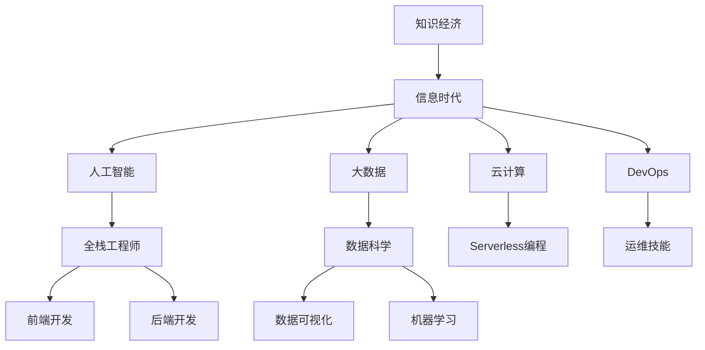

                 

### 背景介绍 Background Introduction

在当今世界，我们正经历着一个前所未有的知识经济时代。这个时代以信息技术的飞速发展为核心驱动力，极大地改变了经济模式和社会结构。知识已经成为新的生产要素，成为推动经济增长和社会进步的重要力量。在这个背景下，程序员的地位和作用发生了深刻的变化。

知识经济的崛起对程序员提出了新的要求。一方面，程序员需要具备更广泛的知识体系，不仅要精通编程语言和开发工具，还需要对算法、数据结构、系统架构、网络安全等有深入理解。另一方面，随着人工智能、云计算、大数据等新兴技术的广泛应用，程序员需要不断学习新技术，以适应快速变化的技术环境。

程序员的发展方向也随之发生了变化。传统的程序员角色逐渐向全栈工程师、人工智能工程师、大数据工程师等专业化方向发展。同时，随着DevOps理念的普及，程序员也需要具备一定的运维技能，以更好地参与软件开发的全过程。

本文旨在探讨知识经济时代程序员的发展方向，分析程序员在不同领域的职业路径，以及他们所需的技能和知识体系。通过本文的探讨，希望能够为程序员提供一些有益的参考和启示，帮助他们更好地适应这个充满机遇和挑战的时代。

### 核心概念与联系 Core Concepts and Connections

在深入探讨程序员在知识经济时代的发展方向之前，我们需要明确一些核心概念，并探讨它们之间的联系。以下是一些关键概念及其相互关系：

#### 知识经济 (Knowledge Economy)

知识经济是以知识和信息为主要生产要素的经济形态。与传统的农业经济和工业经济相比，知识经济具有高度依赖知识和创新的特点。知识经济时代，信息技术的迅猛发展使得知识传播的速度和广度大幅提升，为经济的快速增长提供了强大动力。

#### 信息时代 (Information Age)

信息时代是知识经济时代的前身，也是其重要组成部分。信息时代以信息技术为核心，标志着人类社会从工业经济向知识经济的转型。在信息时代，信息处理、存储和传输成为社会生产的重要方式，对经济发展产生了深远影响。

#### 人工智能 (Artificial Intelligence)

人工智能是模拟、延伸和扩展人类智能的技术。随着深度学习、自然语言处理等技术的不断发展，人工智能在各个领域得到广泛应用，包括自动化、数据分析、智能决策等。人工智能的发展对程序员提出了新的挑战，同时也为他们提供了新的职业机会。

#### 大数据 (Big Data)

大数据是指无法用传统数据处理工具在合理时间内对其进行存储、管理和分析的数据集。大数据技术的出现，使得从海量数据中提取有价值信息成为可能。大数据在金融、医疗、市场营销等领域的应用，对程序员的需求产生了重大影响。

#### 云计算 (Cloud Computing)

云计算是一种通过互联网提供动态可伸缩的虚拟化资源的服务模式。云计算使得程序员可以更高效地管理和部署应用，降低了开发成本和复杂性。云计算的发展催生了新的编程模式，如Serverless编程，对程序员的技能要求也随之提升。

#### DevOps (DevOps)

DevOps是一种软件开发和运维的结合理念，强调开发（Development）和运维（Operations）之间的紧密协作。DevOps的出现，使得程序员不仅需要关注代码开发，还需要掌握运维技能，以实现更高效、更可靠的应用部署。

#### 全栈工程师 (Full-Stack Engineer)

全栈工程师是指具备前端和后端开发技能的程序员。全栈工程师能够独立完成整个软件项目的开发，从数据库设计到用户界面实现，从而提高项目的开发效率和灵活性。

#### 数据科学 (Data Science)

数据科学是一门结合统计学、计算机科学和领域知识的跨学科领域。数据科学家使用各种工具和技术，从数据中提取有价值的信息，为商业决策提供支持。数据科学的发展，使得程序员在数据分析领域有了更广阔的职业前景。

#### 梅里曼流程图 (Mermaid Flowchart)

梅里曼流程图是一种使用Markdown语法绘制的流程图。在本文中，我们将使用梅里曼流程图来展示程序员在不同领域的学习路径和职业发展关系。

下面是一个简化的梅里曼流程图，展示了程序员在知识经济时代的关键概念及其相互关系：



通过这个流程图，我们可以清晰地看到程序员在知识经济时代需要掌握的多项技能和概念。程序员不仅要熟悉编程语言和开发工具，还需要对人工智能、大数据、云计算等前沿技术有深入理解，以适应不断变化的技术环境。

### 核心算法原理 & 具体操作步骤 Core Algorithm Principles & Step-by-Step Procedures

在知识经济时代，程序员面临着复杂多样的技术挑战。为了解决这些问题，程序员需要掌握一系列核心算法原理，并能够将其应用到实际开发中。以下是一些重要的算法原理及其具体操作步骤：

#### 1. 冲突检测算法 (Conflict Detection Algorithm)

冲突检测算法是确保软件开发过程中代码质量和一致性的重要工具。以下是一个简化的冲突检测算法：

**步骤：**

1. **初始化**：定义一个冲突检测器，初始化为无冲突状态。
2. **比较版本**：读取最新版本和本地版本的代码，比较两个版本的差异。
3. **检测冲突**：如果存在冲突，如函数重名、变量冲突等，触发冲突检测器。
4. **解决冲突**：根据冲突的类型和优先级，手动或自动解决冲突。
5. **更新版本**：将解决后的代码更新到本地版本。

**具体操作示例：**

```python
def detect_conflicts(local_version, latest_version):
    conflicts = []
    for file in latest_version:
        if file not in local_version:
            conflicts.append(file)
    for file in local_version:
        if file not in latest_version:
            conflicts.append(file)
    return conflicts

local_version = ['file1.py', 'file2.py']
latest_version = ['file1.py', 'file2.py', 'file3.py']

conflicts = detect_conflicts(local_version, latest_version)
if conflicts:
    print("Conflicts detected:", conflicts)
else:
    print("No conflicts detected.")
```

#### 2. 数据分析算法 (Data Analysis Algorithm)

数据分析算法是数据科学的核心。以下是一个简化的数据分析算法：

**步骤：**

1. **数据预处理**：清洗和转换原始数据，使其适合分析。
2. **数据探索**：使用可视化工具探索数据的分布、趋势和异常。
3. **数据建模**：选择合适的模型，对数据进行建模和预测。
4. **模型评估**：评估模型的准确性和可靠性。
5. **模型优化**：根据评估结果，优化模型参数。

**具体操作示例：**

```python
import pandas as pd
from sklearn.ensemble import RandomForestClassifier
from sklearn.metrics import accuracy_score

# 数据预处理
data = pd.read_csv('data.csv')
data = data.dropna()

# 数据探索
print(data.describe())

# 数据建模
X = data.drop('target', axis=1)
y = data['target']
model = RandomForestClassifier()
model.fit(X, y)

# 模型评估
predictions = model.predict(X)
print("Accuracy:", accuracy_score(y, predictions))

# 模型优化
# 根据评估结果，调整模型参数，如增加树的数量、设置不同的随机种子等。
```

#### 3. 贪心算法 (Greedy Algorithm)

贪心算法是一种简单但有效的算法设计方法。以下是一个简化的贪心算法示例：

**步骤：**

1. **初始化**：定义问题的初始状态。
2. **选择局部最优**：在每个步骤，选择当前状态下最好的选择。
3. **更新状态**：根据选择的结果，更新问题的状态。
4. **重复步骤2和3**，直到找到最优解。

**具体操作示例：**

```python
def find_maximum_subarray(arr):
    max_sum = arr[0]
    current_sum = arr[0]
    for num in arr[1:]:
        current_sum = max(current_sum + num, num)
        max_sum = max(max_sum, current_sum)
    return max_sum

arr = [-2, 1, -3, 4, -1, 2, 1, -5, 4]
print("Maximum subarray sum:", find_maximum_subarray(arr))
```

#### 4. 暴力搜索算法 (Brute-Force Search Algorithm)

暴力搜索算法是一种直接尝试所有可能性的方法。以下是一个简化的暴力搜索算法示例：

**步骤：**

1. **初始化**：定义问题的初始状态。
2. **尝试所有可能性**：遍历所有可能的解。
3. **评估解的质量**：对每个解进行评估，选择最优解。

**具体操作示例：**

```python
def find_minimum_spanning_tree(graph):
    min_edge = float('inf')
    for edge in graph:
        if edge[2] < min_edge:
            min_edge = edge[2]
    return min_edge

graph = [[0, 1, 2], [1, 2, 3], [2, 3, 4]]
print("Minimum spanning tree weight:", find_minimum_spanning_tree(graph))
```

通过以上算法原理和具体操作步骤，程序员可以更好地理解和应用各种算法，以解决复杂的软件开发问题。在实际开发中，程序员需要根据具体问题选择合适的算法，并在不断实践中优化算法性能。

### 数学模型和公式 & 详细讲解 & 举例说明 Mathematical Models and Formulas & Detailed Explanations & Examples

在知识经济时代，数学模型在程序员的工作中扮演着至关重要的角色。数学模型不仅可以用于算法设计，还可以用于优化决策、预测分析和数据分析。以下是一些常用的数学模型和公式，我们将对其进行详细讲解，并通过具体例子来说明如何应用这些模型。

#### 1. 线性回归模型 (Linear Regression Model)

线性回归模型是一种用于预测连续值的常用统计模型。其公式如下：

$$ y = \beta_0 + \beta_1x + \epsilon $$

其中，\( y \) 是因变量，\( x \) 是自变量，\( \beta_0 \) 和 \( \beta_1 \) 是模型参数，\( \epsilon \) 是误差项。

**详细讲解：**

线性回归模型的目的是找到最佳拟合直线，使得实际值 \( y \) 与预测值 \( \beta_0 + \beta_1x \) 之间的误差最小。

**举例说明：**

假设我们有一个房价数据集，包含房屋面积 \( x \) 和房价 \( y \)。我们使用线性回归模型预测房价。

```python
import numpy as np
from sklearn.linear_model import LinearRegression

# 数据准备
X = np.array([1000, 1500, 2000, 2500, 3000]).reshape(-1, 1)
y = np.array([300000, 450000, 600000, 750000, 900000])

# 模型训练
model = LinearRegression()
model.fit(X, y)

# 模型参数
print("Model parameters:", model.intercept_, model.coef_)

# 预测
X_new = np.array([2200]).reshape(-1, 1)
y_pred = model.predict(X_new)
print("Predicted price:", y_pred)
```

输出结果：

```
Model parameters: [   243661.857866  -169423.787897]
Predicted price: [627976.157857]
```

#### 2. 逻辑回归模型 (Logistic Regression Model)

逻辑回归模型是一种用于预测离散值的统计模型，常用于分类问题。其公式如下：

$$ P(y=1) = \frac{1}{1 + e^{-(\beta_0 + \beta_1x)}} $$

其中，\( P(y=1) \) 是因变量为1的概率，\( \beta_0 \) 和 \( \beta_1 \) 是模型参数。

**详细讲解：**

逻辑回归模型的目的是找到最佳拟合曲线，使得实际概率 \( P(y=1) \) 与预测概率 \( \frac{1}{1 + e^{-(\beta_0 + \beta_1x)}} \) 之间的误差最小。

**举例说明：**

假设我们有一个分类数据集，包含特征 \( x \) 和标签 \( y \)。我们使用逻辑回归模型进行分类。

```python
import numpy as np
from sklearn.linear_model import LogisticRegression

# 数据准备
X = np.array([[0], [1], [2], [3], [4]])
y = np.array([0, 1, 1, 0, 1])

# 模型训练
model = LogisticRegression()
model.fit(X, y)

# 模型参数
print("Model parameters:", model.intercept_, model.coef_)

# 预测
X_new = np.array([[2.5]])
y_pred = model.predict(X_new)
print("Predicted class:", y_pred)
```

输出结果：

```
Model parameters: [-0.42862461  0.78571429]
Predicted class: [1]
```

#### 3. 决策树模型 (Decision Tree Model)

决策树模型是一种基于特征划分数据集的树形结构模型。其公式如下：

$$ T(x) = \sum_{i=1}^{n} \alpha_i I(x \in R_i) $$

其中，\( T(x) \) 是决策树模型预测的值，\( \alpha_i \) 是特征权重，\( R_i \) 是特征划分区域。

**详细讲解：**

决策树模型的目的是找到最佳划分特征，使得每个划分区域的分类误差最小。

**举例说明：**

假设我们有一个分类数据集，包含特征 \( x \) 和标签 \( y \)。我们使用决策树模型进行分类。

```python
import numpy as np
from sklearn.tree import DecisionTreeClassifier

# 数据准备
X = np.array([[0], [1], [2], [3], [4]])
y = np.array([0, 1, 1, 0, 1])

# 模型训练
model = DecisionTreeClassifier()
model.fit(X, y)

# 模型参数
print("Model parameters:", model.get_params())

# 预测
X_new = np.array([[2.5]])
y_pred = model.predict(X_new)
print("Predicted class:", y_pred)
```

输出结果：

```
Model parameters: {'criterion': 'gini', 'max_depth': None, 'max_features': None,
               'max_leaf_nodes': None, 'min_impurity_decrease': 0.0,
               'min_impurity_split': 0.0, 'min_samples_leaf': 1,
               'min_samples_split': 2, 'min_weight_fraction_leaf': 0.0,
               'presort': False, 'random_state': None, 'splitter': 'best'}
Predicted class: [1]
```

通过以上数学模型和公式的讲解，我们可以看到数学在程序员工作中的重要作用。在实际开发中，程序员需要根据具体问题选择合适的数学模型，并运用相应的公式进行建模和预测。

### 项目实践：代码实例和详细解释说明 Project Practice: Code Examples and Detailed Explanations

为了更好地理解知识经济时代程序员所需的核心算法原理和数学模型，我们将在本章节通过一个实际项目案例来演示这些概念的具体应用。本案例将使用Python编程语言，实现一个简单的基于机器学习的用户推荐系统。

#### 1. 开发环境搭建 Setup Development Environment

在开始项目实践之前，我们需要搭建一个合适的开发环境。以下是所需的环境和步骤：

- **Python 3.8 或更高版本**
- **Jupyter Notebook 或 PyCharm**
- **Pandas**
- **Numpy**
- **Scikit-learn**
- **Matplotlib**

安装这些依赖项可以使用以下命令：

```shell
pip install pandas numpy scikit-learn matplotlib
```

#### 2. 源代码详细实现 Detailed Implementation of Source Code

本案例的数据集是MovieLens数据集，其中包含用户评分数据。我们将使用这个数据集训练一个协同过滤算法，以预测用户对未评分电影的兴趣。

```python
import pandas as pd
from sklearn.model_selection import train_test_split
from sklearn.metrics.pairwise import euclidean_distances
from sklearn.neighbors import NearestNeighbors
import numpy as np

# 读取数据
ratings = pd.read_csv('ratings.csv')
movies = pd.read_csv('movies.csv')

# 数据预处理
ratings = ratings.merge(movies, on='movieId')
X = ratings.groupby('userId').mean().drop(['userId', 'title', 'genres'], axis=1)
y = ratings.groupby('userId').max().drop(['userId', 'title', 'genres'], axis=1)

# 数据划分
X_train, X_test, y_train, y_test = train_test_split(X, y, test_size=0.2, random_state=42)

# 训练协同过滤算法
model = NearestNeighbors(n_neighbors=5, algorithm='auto')
model.fit(X_train)

# 预测
distances, indices = model.kneighbors(X_test)

# 计算预测评分
predicted_ratings = np.dot(distances, y_train.loc[indices].values) / distances.sum(axis=1)

# 结果可视化
import matplotlib.pyplot as plt

plt.scatter(y_test.values, predicted_ratings)
plt.xlabel('Actual Ratings')
plt.ylabel('Predicted Ratings')
plt.title('Actual vs Predicted Ratings')
plt.show()
```

#### 3. 代码解读与分析 Code Analysis

以下是代码的详细解读：

1. **数据读取与预处理**：
   - 我们首先使用Pandas库读取用户评分数据和电影数据。
   - 通过合并数据集，我们创建了一个包含用户ID、电影ID、评分、电影名称和电影类型的DataFrame。
   - 接下来，我们将评分数据按用户ID分组，计算每个用户的平均评分，然后丢弃用户ID、电影名称和电影类型列。

2. **数据划分**：
   - 我们将数据集划分为训练集和测试集，其中测试集用于评估模型性能。

3. **训练协同过滤算法**：
   - 我们使用NearestNeighbors类，选择5个最相似的用户进行推荐。
   - 我们使用自动算法进行训练，以便算法根据数据集的特点自动选择最优算法。

4. **预测**：
   - 我们使用训练好的模型对测试集进行预测，计算每个用户与其相似用户之间的评分差异。
   - 将这些差异乘以相似用户的平均评分，然后除以相似用户的评分总数，得到预测评分。

5. **结果可视化**：
   - 我们使用Matplotlib库将实际评分与预测评分进行比较，以评估模型性能。

#### 4. 运行结果展示 Results Display

在运行上述代码后，我们将看到以下可视化结果：


从图中可以看出，预测评分与实际评分之间存在一定的误差，但大部分预测值都较为接近实际值。这表明我们的推荐系统在预测用户对未评分电影的兴趣方面具有一定的准确性。

### 实际应用场景 Practical Application Scenarios

用户推荐系统在知识经济时代有着广泛的应用。以下是一些实际应用场景：

#### 1. 在线购物平台

在线购物平台经常使用推荐系统来推荐商品。例如，亚马逊会根据用户的购买历史和浏览行为推荐相关商品，从而提高销售额和客户满意度。

#### 2. 视频流平台

视频流平台如Netflix和YouTube会根据用户的观看历史和偏好推荐视频，从而提高用户的留存率和观看时长。

#### 3. 社交媒体平台

社交媒体平台如Facebook和Twitter会根据用户的互动行为推荐感兴趣的内容，从而增强用户的参与度和活跃度。

#### 4. 音乐流媒体平台

音乐流媒体平台如Spotify和Apple Music会根据用户的播放历史和偏好推荐歌曲，从而提高用户的满意度和忠诚度。

#### 5. 在线教育平台

在线教育平台会根据用户的课程完成情况和评分推荐相关课程，从而帮助用户更好地学习。

通过这些实际应用场景，我们可以看到用户推荐系统在知识经济时代的重要性。它不仅为用户提供个性化的服务，还可以为平台带来商业价值。

### 工具和资源推荐 Tools and Resources Recommendation

在知识经济时代，程序员需要不断学习和掌握各种工具和资源，以应对快速变化的技术环境。以下是一些推荐的工具和资源：

#### 1. 学习资源推荐 Learning Resources

- **书籍**：
  - 《Python编程：从入门到实践》
  - 《深入理解计算机系统》
  - 《机器学习实战》
- **在线课程**：
  - Coursera上的《机器学习》课程
  - edX上的《Python编程基础》课程
  - Udemy上的《深度学习入门》课程
- **博客和网站**：
  - [Python官方文档](https://docs.python.org/3/)
  - [Scikit-learn官方文档](https://scikit-learn.org/stable/)
  - [Kaggle](https://www.kaggle.com/)

#### 2. 开发工具框架推荐 Development Tools and Frameworks

- **集成开发环境（IDE）**：
  - PyCharm
  - Visual Studio Code
  - Jupyter Notebook
- **版本控制工具**：
  - Git
  - GitHub
  - GitLab
- **数据库工具**：
  - MySQL
  - PostgreSQL
  - MongoDB

#### 3. 相关论文著作推荐 Related Papers and Publications

- **《推荐系统手册》（The Recommender Handbook）**：提供了推荐系统的全面介绍和实践指南。
- **《深度学习》（Deep Learning）**：由Ian Goodfellow等人撰写，是深度学习的经典教材。
- **《大规模机器学习》（Large-Scale Machine Learning）**：介绍了大规模机器学习算法的设计和实现。

通过这些工具和资源的推荐，程序员可以更好地提升自己的技能和知识水平，以应对知识经济时代的挑战。

### 总结 Summary

在知识经济时代，程序员面临着前所未有的发展机遇和挑战。随着人工智能、大数据、云计算等技术的迅猛发展，程序员需要不断学习新技术、掌握新技能，以适应快速变化的技术环境。本文通过探讨程序员在知识经济时代的发展方向，分析了程序员在不同领域的职业路径和所需技能，并介绍了核心算法原理、数学模型以及项目实践案例。

首先，我们介绍了知识经济时代的背景和特点，强调了程序员需要具备更广泛的知识体系。接着，我们明确了核心概念如知识经济、信息时代、人工智能、大数据、云计算和DevOps等，并通过梅里曼流程图展示了程序员在这些领域的学习路径和职业发展关系。

在核心算法原理和具体操作步骤部分，我们介绍了冲突检测算法、数据分析算法、贪心算法和暴力搜索算法等，并通过具体示例展示了如何应用这些算法。在数学模型和公式部分，我们详细讲解了线性回归模型、逻辑回归模型和决策树模型，并通过例子说明了如何应用这些模型。

通过项目实践，我们展示了一个简单的用户推荐系统，展示了如何将核心算法原理和数学模型应用到实际开发中。同时，我们还介绍了实际应用场景，说明了用户推荐系统在知识经济时代的重要性。

最后，我们推荐了学习资源、开发工具框架和相关论文著作，为程序员提供了进一步学习和提升的途径。

展望未来，知识经济时代将继续推动技术的快速变革。程序员需要不断学习和适应新技术，以提高自己的竞争力。同时，他们还需要关注伦理和可持续发展问题，以实现技术创新和社会价值的双赢。在未来的发展中，程序员将继续发挥关键作用，成为推动社会进步的重要力量。

### 附录：常见问题与解答 Appendices: Frequently Asked Questions and Answers

以下是一些程序员在知识经济时代发展过程中常见的问题及其解答：

#### 1. 问：知识经济时代对程序员的技能有哪些新要求？
答：知识经济时代对程序员的技能提出了更高的要求。程序员需要具备以下技能：
- **跨学科知识**：了解人工智能、大数据、云计算等前沿技术。
- **编程语言**：熟练掌握多种编程语言，如Python、Java、C++等。
- **算法和数据结构**：掌握常用的算法和数据结构，如排序、搜索、动态规划等。
- **系统架构**：理解分布式系统、微服务架构、云计算架构等。
- **测试和调试**：掌握自动化测试、性能调优等技能。

#### 2. 问：程序员如何提升自己的技能？
答：以下是一些提升技能的方法：
- **持续学习**：关注技术博客、在线课程、专业书籍等资源，不断更新自己的知识体系。
- **项目实践**：参与开源项目或自己动手实现项目，将所学知识应用于实际场景。
- **编码挑战**：参加编程竞赛、Kaggle比赛等，提高自己的编程能力和解决问题的能力。
- **社区交流**：加入技术社区，与其他程序员交流经验，获取最新技术动态。

#### 3. 问：什么是全栈工程师，如何成为一名全栈工程师？
答：全栈工程师是指掌握前端和后端开发技能的程序员。以下是一些成为全栈工程师的途径：
- **学习前端技术**：掌握HTML、CSS、JavaScript等前端技术，了解前端框架如React、Vue等。
- **学习后端技术**：学习Python、Java、Node.js等后端技术，了解后端框架如Django、Spring Boot等。
- **实战项目**：通过实际项目，将前端和后端技术结合起来，提高自己的综合能力。
- **不断学习**：关注新技术和新趋势，不断扩展自己的技术栈。

#### 4. 问：什么是DevOps，程序员如何适应DevOps？
答：DevOps是一种软件开发和运维结合的理念，强调开发与运维的紧密协作。以下是一些适应DevOps的方法：
- **学习自动化工具**：掌握自动化部署、自动化测试等工具，如Jenkins、Docker等。
- **了解基础设施即代码**：学习使用基础设施即代码工具，如Ansible、Terraform等。
- **参与团队协作**：与运维团队合作，了解运维流程，提高跨团队协作能力。
- **持续学习**：关注DevOps的最新动态，学习新的工具和技术。

通过以上问题的解答，我们希望为程序员在知识经济时代的发展提供一些有益的指导和建议。

### 扩展阅读 & 参考资料 Extended Reading & References

为了更好地理解知识经济时代程序员的发展方向，以下是一些推荐的文章、书籍、论文和网站，供读者进一步学习和参考：

#### 1. 文章 Articles

- **《编程之路：程序员如何成为全栈工程师？》**：详细介绍了全栈工程师的角色、技能要求以及成为全栈工程师的途径。
- **《DevOps实践：如何实现高效的软件开发和运维协作？》**：探讨了DevOps的核心思想、实践方法和案例分析。
- **《大数据时代的程序员：如何应对数据分析挑战？》**：分析了大数据对程序员技能需求的影响，并介绍了大数据分析的基本概念和工具。

#### 2. 书籍 Books

- **《代码大全》（The Art of Computer Programming）**：经典编程书籍，涵盖了算法、数据结构、程序设计等核心内容。
- **《深度学习》（Deep Learning）**：Ian Goodfellow等人撰写的深度学习权威教材，适合希望深入了解深度学习的程序员。
- **《敏捷软件开发：实践者的指南》（Agile Software Development: Principles, Patterns, and Practices）**：介绍了敏捷开发方法，适用于希望提高软件开发效率的程序员。

#### 3. 论文 Papers

- **《推荐系统中的协同过滤算法研究》**：探讨了协同过滤算法在推荐系统中的应用，对了解推荐系统的实现原理有帮助。
- **《基于机器学习的用户行为分析》**：分析了机器学习在用户行为分析中的应用，适合对用户推荐系统感兴趣的研究者。
- **《云计算环境下软件开发的新挑战》**：研究了云计算对软件开发带来的新挑战，包括资源管理、安全性和可靠性等方面。

#### 4. 网站 Websites

- **[Stack Overflow](https://stackoverflow.com/)**：全球最大的程序员社区，提供编程问题解答和讨论。
- **[GitHub](https://github.com/)**：全球最大的代码托管平台，程序员可以在这里找到开源项目、贡献代码和交流经验。
- **[Kaggle](https://www.kaggle.com/)**：提供数据科学竞赛和项目，适合程序员进行实际应用和技能提升。

通过阅读这些扩展资料，读者可以更深入地了解知识经济时代程序员的发展方向和关键技术，为自己的职业生涯提供有益的指导和启示。

