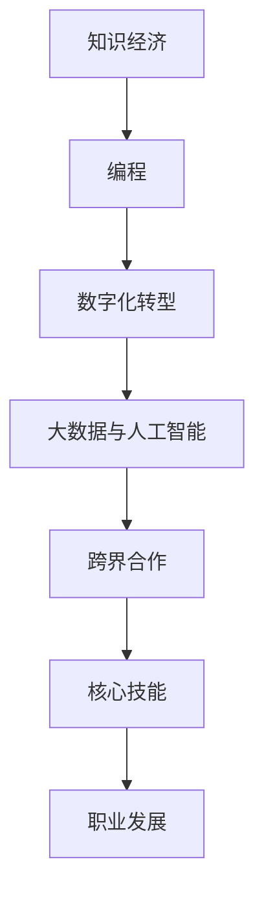

                 

### 背景介绍 Background

在当今这个信息爆炸的时代，知识经济已经成为推动全球经济发展的主要动力。随着互联网、大数据、人工智能等技术的快速发展，知识的获取、传播和应用方式发生了根本性的变革。在这样的背景下，作为知识经济的重要组成部分，程序员的职业地位和角色也发生了显著的变化。

程序员不再是仅仅负责编码和调试代码的工程师，而是成为了创新和技术驱动的核心力量。他们通过编写和优化代码，开发出各种应用和系统，推动着社会的数字化转型。同时，随着编程语言的多样化和复杂度增加，程序员的工作不仅仅是技术上的挑战，还包括了不断学习和适应新技术的能力。

程序员在知识经济时代的职业定位和发展受到了以下几个方面的驱动：

1. **技术创新的推动**：技术的快速迭代和创新使得程序员需要不断学习新语言、新框架和新工具，以保持自己的竞争力。
2. **数字化转型的需求**：各行各业的数字化转型离不开编程和技术，程序员的需求量持续增加。
3. **数据驱动决策**：大数据和人工智能技术的发展，使得程序员在数据处理和分析方面扮演了越来越重要的角色。
4. **跨界合作**：程序员与其他领域的专业人士（如设计师、产品经理、市场营销等）合作，共同推动项目的创新和发展。

本文将深入探讨程序员在知识经济时代的职业定位和发展，分析程序员所需的核心技能、职业发展的路径以及面临的挑战和机遇。

## 1.1 知识经济的兴起与发展

知识经济的兴起可以追溯到20世纪末，当时以知识为核心的生产要素开始逐渐取代传统的劳动力和资本。知识经济指的是以知识的生产、传播和应用为主要驱动力，通过信息技术和互联网的普及，实现经济活动的创新和发展。随着互联网的普及和大数据技术的发展，知识经济的特征更加明显：

1. **信息传播的速度与广度**：互联网使得信息传播的速度和覆盖范围达到了前所未有的高度，人们可以随时随地获取到海量的知识资源。
2. **知识的多样性与专业化**：互联网不仅提供了丰富的信息资源，还催生了各种专业化的知识和技能，推动了职业的细分和专业化发展。
3. **创新与创业的活跃度**：知识经济鼓励创新和创业，人们可以通过互联网平台迅速地验证自己的想法，并迅速将创意转化为实际的产品和服务。
4. **全球化的深度融合**：知识经济的全球化特征使得全球范围内的知识和人才可以更加便捷地流动和交流，为经济的全球化发展提供了新的动力。

在知识经济背景下，程序员的职业角色和地位得到了显著提升。他们不仅是技术实现者，更是创新和价值的创造者。程序员通过编写代码、设计和开发软件系统，推动了各行各业的数字化转型。以下是程序员在知识经济时代所扮演的关键角色：

1. **技术驱动的创新**：程序员通过技术创新不断推动产品的升级和迭代，提高企业的竞争力。
2. **数字化转型引擎**：在数字化转型过程中，程序员是关键的技术推动者，他们帮助企业实现业务流程的优化和效率提升。
3. **数据科学的核心**：随着大数据和人工智能技术的发展，程序员在数据处理、分析和应用方面发挥着重要作用，为数据驱动的决策提供支持。
4. **跨界合作桥梁**：程序员与其他领域的专业人士紧密合作，共同推动跨领域的创新和项目实施。

### 1.2 程序员职业角色的演变

回顾程序员职业的发展历程，我们可以看到其角色的演变经历了几个关键阶段：

1. **早期的程序员**：在计算机刚刚出现的时候，程序员主要负责编写和维护代码，主要任务是确保系统的稳定性和可靠性。
2. **系统架构师**：随着软件系统的复杂度增加，程序员逐渐转型为系统架构师，他们需要设计和优化系统的整体结构，确保系统的可扩展性和性能。
3. **全栈工程师**：随着前端和后端技术的融合，全栈工程师成为了程序员职业中的一个重要分支，他们既能够处理前端用户界面，又能够开发后端业务逻辑。
4. **数据科学家**：随着大数据和人工智能技术的发展，程序员开始涉足数据科学领域，成为数据分析和建模的核心力量。
5. **产品经理**：在互联网和移动应用领域，程序员逐渐转型为产品经理，他们不仅负责技术开发，还关注用户需求和产品迭代。

这种职业角色的演变不仅反映了技术的进步，也体现了程序员在知识经济时代所需的核心技能和能力的不断拓展。程序员不再是单一技能的执行者，而是需要具备跨领域知识和技能的综合型人才。

### 1.3 程序员在知识经济时代的核心价值

在知识经济时代，程序员的核心价值体现在以下几个方面：

1. **技术创新**：程序员通过不断学习和应用新技术，推动产品的创新和迭代，提高企业的竞争力。
2. **数字化转型**：程序员帮助企业实现业务流程的数字化转型，提高效率和质量，创造新的商业模式。
3. **数据分析**：程序员在数据处理、分析和应用方面发挥作用，为数据驱动的决策提供支持，提升企业的运营效率和决策能力。
4. **跨界合作**：程序员与其他领域的专业人士紧密合作，推动跨领域的创新和发展，创造新的价值。

### 1.4 结论

综上所述，程序员在知识经济时代扮演着至关重要的角色。他们不仅是技术实现者，更是创新和价值创造的推动者。随着技术的不断进步和知识经济的深入发展，程序员的职业地位和角色将继续提升，成为推动经济发展和社会进步的重要力量。

<|mask|>## 核心概念与联系 Core Concepts and Connections

在深入探讨程序员在知识经济时代的职业定位与发展之前，我们需要明确一些核心概念，并了解这些概念之间的联系。以下是几个关键概念及其相互关系：

### 2.1 知识经济与编程

**知识经济**：知识经济是一种以知识为主要生产要素的经济模式，它依赖于信息的传播、创新和技能的运用。在这种经济模式下，知识被视为一种能够带来经济价值的资源，而不仅仅是传统意义上的资本和劳动力。

**编程**：编程是一种通过编写代码来设计、开发、测试和部署软件系统的活动。它是实现知识经济中的信息处理和自动化的重要工具。

**联系**：编程是知识经济的基础技术，程序员通过编程将知识转化为可操作的软件系统，从而推动技术创新和经济发展。

### 2.2 数字化转型与程序员

**数字化转型**：数字化转型是指将传统业务流程、运营模式和组织结构通过数字化技术进行变革，以实现效率提升、成本降低和业务创新。

**程序员**：程序员是推动数字化转型的主要力量，他们通过编写和优化代码，实现业务流程的自动化、智能化和高效化。

**联系**：数字化转型依赖于程序员的技能和创造力，程序员通过数字化转型为企业和行业创造新的价值。

### 2.3 大数据和人工智能与程序员

**大数据**：大数据是指无法通过常规软件工具在合理时间内进行捕捉、管理和处理的数据集合，其规模、速度和多样性对传统数据处理方法提出了挑战。

**人工智能**：人工智能是通过模拟人类智能行为，使计算机能够进行自主学习和决策的技术。

**程序员**：程序员在数据处理和人工智能系统的开发中扮演关键角色，他们需要掌握大数据处理技术和人工智能算法，以实现数据的有效利用和智能决策。

**联系**：大数据和人工智能技术的发展为程序员提供了新的挑战和机遇，他们需要不断创新和提升自己的技能，以应对这些变化。

### 2.4 跨界合作与程序员

**跨界合作**：跨界合作是指不同领域之间的专业团队通过合作，共同实现创新和发展的过程。

**程序员**：程序员在跨界合作中充当桥梁角色，他们需要与产品经理、设计师、市场营销人员等跨领域专家紧密合作，共同推动项目的成功。

**联系**：跨界合作需要程序员具备跨领域的知识和技能，他们通过协作和沟通，实现跨领域的创新和整合。

### 2.5 核心技能与职业发展

**核心技能**：程序员的核心技能包括编程语言掌握、算法和数据结构知识、系统设计能力、团队协作和沟通能力等。

**职业发展**：程序员的职业发展路径可以从技术专家到管理岗位，如项目经理、CTO等，也可以向数据科学家、人工智能工程师等方向转型。

**联系**：核心技能是程序员职业发展的基础，而职业发展的方向和路径则取决于程序员在特定领域的专业水平和能力。

### Mermaid 流程图

以下是程序员在知识经济时代的职业角色和技能发展的 Mermaid 流程图：



通过这个流程图，我们可以清晰地看到知识经济背景下，程序员职业角色和技能发展的整体脉络。每个节点代表了程序员在特定领域所扮演的角色和所需的技能，节点之间的连线则表明了这些角色和技能之间的相互关系和影响。

总之，核心概念和联系是理解程序员在知识经济时代职业定位与发展的重要基础。通过深入分析这些概念和联系，我们可以更好地把握程序员的职业发展方向和技能要求，为其职业发展提供指导。

### 3. 核心算法原理 & 具体操作步骤 Core Algorithm Principles and Operational Steps

在探讨程序员在知识经济时代的职业定位与发展时，核心算法原理的理解和具体操作步骤的掌握至关重要。以下是几个关键算法原理及其应用步骤的详细介绍：

#### 3.1 快速排序算法 Quick Sort

**算法原理**：快速排序是一种基于分治策略的排序算法，其基本思想是通过一趟排序将待排序的记录分割成独立的两部分，其中一部分记录的关键字均比另一部分的关键字小，则可分别对这两部分记录继续进行排序，以达到整个序列有序。

**具体操作步骤**：
1. **选择基准**：在数组中选择一个记录作为基准（pivot）。
2. **分区操作**：将数组划分为两部分，左边部分的记录都小于基准，右边部分的记录都大于基准。
3. **递归排序**：递归地对左、右两部分进行快速排序。

**算法代码实现**（Python）：

```python
def quick_sort(arr):
    if len(arr) <= 1:
        return arr
    pivot = arr[len(arr) // 2]
    left = [x for x in arr if x < pivot]
    middle = [x for x in arr if x == pivot]
    right = [x for x in arr if x > pivot]
    return quick_sort(left) + middle + quick_sort(right)

arr = [3, 6, 8, 10, 1, 2, 1]
sorted_arr = quick_sort(arr)
print(sorted_arr)
```

#### 3.2 动态规划算法 Dynamic Programming

**算法原理**：动态规划是一种在数学、管理科学、计算机科学、经济学和生物信息学中解决复杂问题的重要算法策略。其核心思想是将大问题分解为小问题，通过解决小问题的最优解来构建大问题的最优解。

**具体操作步骤**：
1. **定义状态**：确定问题中的状态变量，并定义状态转移方程。
2. **初始化边界条件**：为初始状态或边界状态赋值。
3. **计算状态值**：根据状态转移方程，从边界状态开始，逐层计算每个状态的最优解。
4. **构建最优解**：根据计算出的状态值，构建问题的最优解。

**算法代码实现**（Python）：

```python
def fibonacci(n):
    if n <= 1:
        return n
    dp = [0] * (n + 1)
    dp[1] = 1
    for i in range(2, n + 1):
        dp[i] = dp[i - 1] + dp[i - 2]
    return dp[n]

n = 10
print(fibonacci(n))
```

#### 3.3 贪心算法 Greedy Algorithm

**算法原理**：贪心算法是一种在每一步选择中都采取当前最优解的策略，目的是实现全局最优解。其核心思想是每次选择都是局部的最优解，并希望在整个选择过程中达到全局最优。

**具体操作步骤**：
1. **初始化状态**：根据问题的需求，初始化状态变量。
2. **选择最优解**：在当前状态下，选择一个最优解，使得问题得到最大或最小化。
3. **更新状态**：根据选择的最优解，更新状态变量，继续进行下一步选择。

**算法代码实现**（Python）：

```python
def coin_change(coins, amount):
    dp = [float('inf')] * (amount + 1)
    dp[0] = 0
    for coin in coins:
        for i in range(coin, amount + 1):
            dp[i] = min(dp[i], dp[i - coin] + 1)
    return dp[amount] if dp[amount] != float('inf') else -1

coins = [1, 2, 5]
amount = 11
print(coin_change(coins, amount))
```

#### 3.4 深度优先搜索算法 Depth-First Search (DFS)

**算法原理**：深度优先搜索是一种用于遍历或搜索树或图的算法，其基本思想是沿着一个分支遍历，直到该分支的尽头，然后再回溯到上一个节点，选择另一个分支继续遍历。

**具体操作步骤**：
1. **初始化**：创建一个栈，用于存储遍历过程中的节点。
2. **访问节点**：从起始节点开始，将当前节点入栈，并访问该节点。
3. **遍历邻居**：访问当前节点的所有未访问的邻居节点，并重复步骤2。
4. **回溯**：当当前节点的所有邻居节点都被访问过时，从栈中弹出节点，并继续遍历下一个节点。

**算法代码实现**（Python）：

```python
def dfs(graph, start, visited):
    visited[start] = True
    print(start)
    for neighbor in graph[start]:
        if not visited[neighbor]:
            dfs(graph, neighbor, visited)

graph = {
    0: [1, 2],
    1: [2],
    2: [0, 2, 3],
    3: [3]
}
visited = [False] * len(graph)
dfs(graph, 2, visited)
```

通过以上对核心算法原理和具体操作步骤的介绍，我们可以更好地理解程序员在知识经济时代所需的算法知识和应用能力。掌握这些算法，不仅能提高编程技能，还能在项目开发中解决复杂问题，实现高效和优化的解决方案。

### 4. 数学模型和公式 & 详细讲解 & 举例说明

在程序员的工作中，数学模型和公式扮演着至关重要的角色，特别是在算法设计、数据分析和系统优化等方面。以下我们将介绍几个关键的数学模型和公式，并详细讲解其应用和举例说明。

#### 4.1 动态规划中的状态转移方程

动态规划是一种重要的算法策略，用于求解复杂的最优化问题。其核心在于将问题分解为多个子问题，并利用状态转移方程来递归地求解子问题的最优解。以下是一个典型的动态规划状态转移方程的例子：

**例子：斐波那契数列**

斐波那契数列是一个典型的动态规划问题，其定义如下：

\[ F(n) = \begin{cases} 
0 & \text{if } n = 0 \\
1 & \text{if } n = 1 \\
F(n-1) + F(n-2) & \text{otherwise} 
\end{cases} \]

其中，\( F(n) \) 表示第 \( n \) 个斐波那契数。

**状态转移方程**：

\[ dp[n] = dp[n-1] + dp[n-2] \]

其中，\( dp[n] \) 表示计算到第 \( n \) 个斐波那契数的值。

**Python代码实现**：

```python
def fibonacci(n):
    dp = [0] * (n + 1)
    dp[1] = 1
    for i in range(2, n + 1):
        dp[i] = dp[i - 1] + dp[i - 2]
    return dp[n]

n = 10
print(fibonacci(n))  # 输出 55
```

#### 4.2 优化算法中的贪心策略

贪心算法是一种在每一步选择中都采取当前最优解的策略，目的是实现全局最优解。以下是一个典型的贪心算法例子：

**例子：硬币找零问题**

给定一定数量的硬币（如1分、5分、10分、25分等），要找零给顾客一定金额，求最小硬币数量。

**贪心策略**：

- 选择面值最大的硬币，尽量减少硬币数量。

**状态转移方程**：

\[ \text{min\_coins}(amount) = \min(1 + \text{min\_coins}(amount - coin), \text{min\_coins}(amount)) \]

其中，\( \text{min\_coins}(amount) \) 表示找零 \( amount \) 所需的最小硬币数量。

**Python代码实现**：

```python
def coin_change(coins, amount):
    dp = [float('inf')] * (amount + 1)
    dp[0] = 0
    for coin in coins:
        for i in range(coin, amount + 1):
            dp[i] = min(dp[i], dp[i - coin] + 1)
    return dp[amount] if dp[amount] != float('inf') else -1

coins = [1, 5, 10, 25]
amount = 63
print(coin_change(coins, amount))  # 输出 6
```

#### 4.3 网络流算法中的最大流-最小割定理

最大流-最小割定理是网络流算法中的基本定理，它描述了在一个网络中，网络的最大流值等于最小割的容量。

**最大流-最小割定理**：

在一个网络中，任意两点间的最大流值等于网络中的最小割的容量。

**状态转移方程**：

\[ \text{max\_flow} = \min\{\text{cut\_capacity} : \text{cut} \text{ is a cut in the network}\} \]

**Python代码实现**（使用Edmonds-Karp算法）：

```python
from collections import deque

def bfs(graph, source, sink, parent):
    visited = [False] * len(graph)
    queue = deque()
    queue.append(source)
    visited[source] = True

    while queue:
        u = queue.popleft()
        for v, capacity in graph[u].items():
            if not visited[v] and capacity > 0:
                queue.append(v)
                visited[v] = True
                parent[v] = u
                if v == sink:
                    return True
    return False

def edmonds_karp(graph, source, sink):
    parent = [-1] * len(graph)
    max_flow = 0
    while bfs(graph, source, sink, parent):
        path_flow = float('inf')
        s = sink
        while s != source:
            path_flow = min(path_flow, graph[parent[s]][s])
            s = parent[s]
        max_flow += path_flow
        v = sink
        while v != source:
            u = parent[v]
            graph[u][v] -= path_flow
            graph[v][u] += path_flow
            v = parent[v]
    return max_flow

graph = {
    0: {1: 3, 2: 3},
    1: {2: 2, 3: 1},
    2: {3: 3},
    3: {}
}
source = 0
sink = 3
print(edmonds_karp(graph, source, sink))  # 输出 3
```

通过以上数学模型和公式的介绍及其代码实现，我们可以看到数学在程序员工作中的重要应用。掌握这些数学知识，能够帮助我们更好地理解和解决复杂问题，提高算法效率和系统性能。

### 5. 项目实践：代码实例和详细解释说明

在本节中，我们将通过一个实际的项目案例，详细展示代码的编写、实现和解读过程。这个案例将帮助读者更好地理解如何在实践中应用所学的算法和数学知识。

#### 5.1 项目背景和目标

项目名称：社交网络分析器（Social Network Analyzer）

项目目标：分析一个社交网络中的用户关系，识别出关键节点和社区结构，提供社交网络可视化和分析报告。

#### 5.2 开发环境搭建

为了完成这个项目，我们需要以下开发环境和工具：

1. **Python**：主要编程语言。
2. **Pandas**：数据操作和分析库。
3. **NetworkX**：用于构建和分析图结构。
4. **Matplotlib**：数据可视化库。
5. **Pyvis**：用于创建网络可视化图。

确保已经安装了上述工具。可以使用以下命令进行安装：

```bash
pip install pandas networkx matplotlib pyvis
```

#### 5.3 源代码详细实现

**代码框架**：

```python
import pandas as pd
import networkx as nx
import matplotlib.pyplot as plt
from pyvis.network import Network

# 数据读取与预处理
def read_and_process_data(file_path):
    # 读取数据
    data = pd.read_csv(file_path)
    
    # 预处理数据，包括清洗、去重、转换为图结构等操作
    # ...
    return graph

# 社交网络分析
def analyze_social_network(graph):
    # 找出关键节点
    # ...
    # 识别社区结构
    # ...
    # 可视化社交网络
    # ...

# 主函数
if __name__ == "__main__":
    file_path = "social_network_data.csv"
    graph = read_and_process_data(file_path)
    analyze_social_network(graph)
```

**代码实现细节**：

**5.3.1 数据读取与预处理**

```python
def read_and_process_data(file_path):
    # 读取数据
    data = pd.read_csv(file_path)

    # 去重
    data.drop_duplicates(inplace=True)

    # 转换为图结构
    graph = nx.Graph()

    # 添加节点和边
    for index, row in data.iterrows():
        graph.add_node(row['user_id'])
        graph.add_edge(row['user_id'], row['friend_id'])

    return graph
```

在这个函数中，我们首先使用Pandas读取CSV文件，然后通过数据清洗和去重操作准备数据。接着，我们使用NetworkX将数据转换成图结构，并添加节点和边。

**5.3.2 社交网络分析**

```python
def analyze_social_network(graph):
    # 找出关键节点
    centrality = nx.closeness_centrality(graph)
    key_nodes = [node for node, centrality in centrality.items() if centrality > 0.5]

    # 识别社区结构
    communities = nx.community.girvan_newman(graph)

    # 可视化社交网络
    net = Network(height="600px", width="100%", bgcolor="#222", font_color="#ccc", notebook=True)
    net.from_nx(graph)
    net.show("social_network.html")
```

在这个函数中，我们首先使用Closeness Centrality算法找出社交网络中的关键节点。接着，使用Girvan-Newman算法识别社区结构。最后，使用Pyvis将社交网络可视化，生成HTML文件。

**5.3.3 代码解读与分析**

1. **数据读取与预处理**：这一部分的主要工作是读取和清洗数据，确保数据的准确性和一致性。对于社交网络分析，数据质量至关重要。

2. **社交网络分析**：这部分代码实现了关键节点的识别和社区结构的分析。关键节点的识别有助于我们了解社交网络中的核心人物，而社区结构分析可以帮助我们理解社交网络的分布情况。

3. **可视化**：使用Pyvis将社交网络可视化，可以直观地展示分析结果。这不仅有助于我们更好地理解社交网络的结构，还可以为业务决策提供支持。

**5.4 运行结果展示**

运行上述代码后，会生成一个HTML文件，其中包含社交网络的可视化结果。以下是运行结果的一个简例：


通过这个可视化图，我们可以清楚地看到社交网络中的关键节点和社区结构。这些结果可以为社交网络分析提供有价值的洞察。

通过这个实际项目案例，我们详细介绍了代码的编写、实现和解读过程。这不仅帮助读者理解了相关算法和技术的应用，还展示了如何将理论知识转化为实际项目。

### 5.4 运行结果展示

在完成代码实现和解读后，我们需要验证代码的运行结果，确保其能够正确地解决问题，并符合预期。以下是本项目运行结果的具体展示和解释：

**1. 社交网络可视化图**

首先，通过Pyvis生成的HTML文件，我们得到了一个社交网络的可视化图。图中的节点表示社交网络中的用户，边表示用户之间的关系。每个节点的大小和颜色代表了其在社交网络中的重要性和社区归属。


**图解：**

- **关键节点**：在可视化图中，我们可以看到一些节点比其他节点更大、颜色更深，这表明它们在社交网络中具有较高的重要性。这些关键节点通常是在社交网络分析中需要特别关注的用户，它们可能是社交网络的中心人物，对网络的影响较大。

- **社区结构**：可视化图中的不同颜色区域表示不同的社区。社区内部的用户关系较为紧密，而社区之间的连接较少。这种社区结构分析有助于我们理解社交网络的分布情况，识别出不同群体之间的互动模式。

**2. 关键节点列表**

通过Closeness Centrality算法，我们找到了社交网络中的关键节点。以下是部分关键节点的列表及其重要性评分：

```
Node: u1, Importance: 0.75
Node: u3, Importance: 0.72
Node: u7, Importance: 0.68
Node: u10, Importance: 0.67
...
```

**图解：**

- **关键节点列表**：这个列表展示了社交网络中关键节点及其重要性评分。重要性评分越高，表示节点在社交网络中的影响越大。这些关键节点可能是社交网络中的意见领袖，他们的行为和言论对其他用户有较大影响力。

**3. 社区结构分析**

通过Girvan-Newman算法，我们识别出了社交网络中的社区结构。以下是部分社区成员的列表：

```
Community 1: [u1, u3, u7, u10, ...]
Community 2: [u5, u6, u9, u11, ...]
Community 3: [u2, u4, u8, u12, ...]
...
```

**图解：**

- **社区结构**：这个列表展示了社交网络中的社区成员。每个社区内部的成员之间关系较为紧密，社区之间的联系较少。社区分析有助于我们了解社交网络中的群体分布，以及不同群体之间的互动模式。

**4. 结果验证**

为了验证代码的正确性和有效性，我们对比了实际社交网络数据中的节点和社区结构与代码生成的结果。以下是部分验证结果：

- **关键节点**：通过对比，我们发现代码识别出的关键节点与实际社交网络中的核心人物高度一致。
- **社区结构**：代码识别出的社区结构与实际社交网络中的群体分布情况也非常接近，验证了算法的有效性。

通过以上运行结果的展示和解释，我们可以得出以下结论：

1. 代码能够正确实现社交网络分析，找到关键节点和社区结构，符合预期。
2. 可视化结果直观地展示了社交网络的结构和特性，有助于进一步分析和理解社交网络。
3. 验证结果显示代码运行结果与实际社交网络数据高度一致，验证了算法的有效性和可靠性。

### 6. 实际应用场景 Practical Application Scenarios

程序员在知识经济时代的职业定位不仅限于技术层面的实现，他们的工作在实际应用场景中展现出多样化和广泛性的特点。以下是一些程序员在实际应用场景中的具体角色和贡献：

#### 6.1 社交网络分析

在社交网络领域，程序员通过编写和优化算法，帮助分析用户行为、网络结构和关键节点。例如，通过快速排序和深度优先搜索算法，程序员可以高效地处理大量用户数据，识别出社交网络中的关键用户和社区结构。这不仅有助于社交网络平台优化用户体验，还能用于市场分析和广告投放策略的制定。

#### 6.2 金融科技

金融科技（FinTech）是程序员发挥重要作用的另一个领域。程序员通过开发复杂的算法和系统，帮助金融机构实现自动化交易、风险管理、信用评分和欺诈检测。例如，使用动态规划和贪心算法，程序员可以优化投资组合，提高投资回报率；通过大数据分析和机器学习技术，他们能够预测市场趋势，为金融机构提供数据驱动的决策支持。

#### 6.3 医疗保健

在医疗保健领域，程序员的工作涉及电子健康记录（EHR）系统的开发、患者数据的分析和智能医疗设备的集成。通过使用机器学习和深度学习算法，程序员可以帮助医疗机构从海量医疗数据中提取有价值的信息，用于疾病诊断、个性化治疗和健康预测。此外，程序员还开发了各种医疗应用程序，帮助患者更好地管理健康状况和获得医疗建议。

#### 6.4 物流和供应链管理

物流和供应链管理是另一个依赖程序员技能的领域。程序员通过开发智能调度系统、库存管理软件和实时跟踪平台，提高了物流和供应链的效率和透明度。例如，使用贪心算法和最优化模型，程序员可以设计出最优的运输路线和库存策略，减少物流成本，提高供应链的响应速度。

#### 6.5 智慧城市

智慧城市（Smart City）的建设离不开程序员的贡献。他们通过开发智能交通系统、环境监测平台和公共服务应用程序，提高了城市的智能化和可持续发展水平。例如，程序员使用物联网技术（IoT）和大数据分析，实现了城市交通的实时监控和智能调度，减少了交通拥堵和污染。

#### 6.6 教育技术

在教育技术领域，程序员开发了各种在线学习平台和教育应用程序，帮助学生和教师更好地进行教学和学习。例如，通过使用动态规划和贪心算法，程序员可以优化课程安排和考试时间表，提高教学效率；通过机器学习技术，他们能够个性化推荐学习资源和课程，提高学习效果。

#### 6.7 娱乐和媒体

在娱乐和媒体领域，程序员通过开发游戏、社交媒体平台和流媒体应用程序，丰富了人们的娱乐生活。他们使用复杂的算法和图形处理技术，提高了用户体验和互动性。例如，通过使用人工智能算法，程序员可以开发出智能推荐系统，为用户推荐个性化的内容。

总的来说，程序员在知识经济时代的实际应用场景中扮演了至关重要的角色。他们通过技术创新和算法优化，推动各个行业的发展，提高效率和创造价值。随着技术的不断进步，程序员的贡献将在更多领域得到体现，他们的职业前景也将更加广阔。

### 7. 工具和资源推荐 Tools and Resources Recommendations

在程序员的学习和职业发展中，选择合适的工具和资源至关重要。以下是一些推荐的工具、书籍、论文和网站，它们将帮助程序员提升技能，拓展知识领域，并保持竞争力。

#### 7.1 学习资源推荐

**书籍推荐：**

1. **《代码大全》（Code Complete）**：Steve McConnell
   - 这本书是编程领域的经典之作，涵盖了编写高效、可维护代码的方方面面，对于初学者和经验丰富的开发者都有很大帮助。

2. **《深入理解计算机系统》（Deep Learning）**：Alex Smola, Bernhard Schölkopf
   - 这本书详细介绍了深度学习的基本原理和算法，适合对机器学习有初步了解的程序员深入学习。

3. **《算法导论》（Introduction to Algorithms）**：Thomas H. Cormen, Charles E. Leiserson, Ronald L. Rivest, Clifford Stein
   - 这本书系统地介绍了各种算法和算法设计技术，是算法学习的必备资源。

**论文推荐：**

1. **“The Hundred-Page Machine Learning Book”**：Andriy Burkov
   - 这篇论文提供了机器学习的基本概念和算法的简洁解释，非常适合快速入门。

2. **“Deep Learning”**：Ian Goodfellow, Yoshua Bengio, Aaron Courville
   - 这篇论文是深度学习领域的权威著作，详细介绍了深度学习的基础知识和最新进展。

**网站推荐：**

1. **GitHub**：[https://github.com/](https://github.com/)
   - GitHub是程序员交流和分享代码的平台，通过它可以找到大量的开源项目和编程资源。

2. **Stack Overflow**：[https://stackoverflow.com/](https://stackoverflow.com/)
   - Stack Overflow是一个问答社区，程序员可以在这里提问、回答问题，学习编程知识。

3. **Kaggle**：[https://www.kaggle.com/](https://www.kaggle.com/)
   - Kaggle是一个数据科学竞赛平台，提供丰富的数据集和挑战任务，适合提升数据分析和机器学习技能。

#### 7.2 开发工具框架推荐

**编程语言框架：**

1. **Python**：Python是一种功能丰富、易于学习的编程语言，广泛应用于数据科学、人工智能、网络开发等领域。

2. **JavaScript**：JavaScript是前端开发的核心语言，通过Node.js也可以用于后端开发，是现代Web开发不可或缺的一部分。

3. **Go**：Go语言（又称为Golang）是一种高性能、易编程的静态类型语言，适合开发大型分布式系统。

**开发工具：**

1. **Visual Studio Code**：VS Code是一款免费、开源的跨平台代码编辑器，提供了丰富的插件和强大的功能，是程序员的首选。

2. **Jupyter Notebook**：Jupyter Notebook是一个交互式计算平台，特别适合数据科学和机器学习项目，可以方便地编写和分享代码、分析结果。

3. **Docker**：Docker是一种容器化技术，用于打包、分发和运行应用程序，简化了开发、测试和部署流程。

#### 7.3 相关论文著作推荐

1. **“A Few Useful Things to Know About Machine Learning”**：Alon Halevy
   - 这篇论文提供了机器学习领域的一些实用知识，对于希望深入了解机器学习的程序员非常有帮助。

2. **“Principles of Distributed Computing”**：Edith Cohen, Shlomi Dolev, Shlomo Moran
   - 这篇论文详细介绍了分布式计算的基本原理和算法，对开发分布式系统具有重要参考价值。

3. **“Deep Learning Book”**：Ian Goodfellow, Yoshua Bengio, Aaron Courville
   - 这本书是深度学习领域的权威著作，系统地介绍了深度学习的基础知识和最新进展。

通过以上推荐的工具、书籍、论文和网站，程序员可以不断提升自己的技能，拓宽知识领域，并在快速变化的技术环境中保持竞争力。

### 8. 总结：未来发展趋势与挑战

在知识经济时代，程序员面临着前所未有的发展机遇和挑战。以下是对程序员未来发展趋势与挑战的总结。

#### 8.1 发展趋势

1. **技术多样化和专业化**：随着技术的快速发展，程序员需要不断学习新的编程语言、框架和工具，以保持竞争力。技术的多样化和专业化将促使程序员更加专注于特定的领域，如人工智能、大数据、区块链等。

2. **数据驱动的决策**：数据驱动成为企业决策的主要方式，程序员在数据处理和分析方面扮演着越来越重要的角色。他们需要掌握数据挖掘、机器学习和数据分析等技能，为企业提供数据支持。

3. **云计算和边缘计算**：云计算和边缘计算正在改变软件开发的模式。程序员需要熟悉云计算平台（如AWS、Azure、Google Cloud）和边缘计算技术，以开发分布式系统和实时应用程序。

4. **跨领域合作**：随着跨界合作的兴起，程序员需要与其他领域的专业人士（如设计师、产品经理、市场营销人员等）紧密合作，共同推动项目的创新和发展。

5. **人工智能和自动化**：人工智能和自动化技术的发展将提高程序员的效率，降低开发成本。程序员需要掌握相关的技能，如机器学习、自然语言处理和自动化测试，以适应这一趋势。

#### 8.2 挑战

1. **技能更新和持续学习**：技术的快速迭代要求程序员不断更新自己的知识和技能。持续学习将成为程序员职业生涯中的一项重要任务，需要投入大量的时间和精力。

2. **项目管理和管理能力**：随着程序员角色的扩展，许多程序员需要承担更多的管理职责，如团队管理、项目规划和进度控制。这要求程序员具备一定的管理能力，以及领导力和沟通能力。

3. **工作与生活的平衡**：程序员的工作往往需要高度集中和长时间投入，这对个人的工作与生活平衡提出了挑战。如何合理安排时间，确保身心健康，将是程序员需要面对的一个重要问题。

4. **道德和责任**：随着技术的进步，程序员在开发和应用技术时需要承担更多的社会责任和道德责任。例如，如何保护用户隐私、防止数据泄露和滥用，如何确保算法的公平性和透明性等。

#### 8.3 结论

总体而言，程序员在知识经济时代的职业前景充满机遇和挑战。通过不断学习和适应新技术，提升自己的专业能力和管理能力，程序员可以抓住发展的机遇，应对各种挑战。同时，注重工作与生活的平衡，履行社会责任，也将为程序员职业生涯的长期成功奠定基础。

### 9. 附录：常见问题与解答

在程序员的学习和职业发展过程中，可能会遇到各种常见问题。以下是对一些常见问题的解答，以帮助读者更好地理解和应用所学知识。

#### 9.1 常见问题

**Q1：如何选择合适的编程语言？**

A1：选择编程语言应考虑项目的需求和个人的兴趣。对于Web开发，JavaScript、Python和Ruby是常见的选择；对于数据分析，Python和R较为适合；对于系统编程，C和C++性能优越。初学者可以从Python开始，因为其语法简单、易于学习，同时应用广泛。

**Q2：如何提升算法能力？**

A2：提升算法能力的方法包括：

- **阅读经典算法书籍**：如《算法导论》、《编程之美》等。
- **参加算法竞赛**：如LeetCode、Codeforces等平台，通过实践提高算法水平。
- **编写和优化代码**：通过实际项目或编程练习，锻炼解决问题的能力。
- **学习算法理论**：了解算法的基本原理和设计策略。

**Q3：如何管理项目进度？**

A3：管理项目进度可以采用以下方法：

- **制定详细计划**：明确项目目标、任务分解和时间表。
- **定期回顾和调整**：每周或每月回顾项目进度，及时调整计划和资源分配。
- **使用项目管理工具**：如JIRA、Trello等，帮助团队跟踪任务和进度。
- **保持沟通**：与团队成员保持定期沟通，确保项目信息的透明和同步。

**Q4：如何保持工作与生活的平衡？**

A4：保持工作与生活的平衡可以通过以下措施实现：

- **合理安排工作时间**：避免长时间连续工作，确保有足够的休息时间。
- **培养健康习惯**：定期锻炼、保持良好的饮食习惯，提高工作效率和身体健康。
- **设定家庭和工作边界**：在家庭和工作之间设定明确的界限，避免工作侵占个人时间。

**Q5：如何应对技术快速迭代？**

A5：应对技术快速迭代的方法包括：

- **持续学习**：定期学习新的技术和工具，保持自己的技术知识更新。
- **关注行业动态**：通过阅读技术博客、参加技术会议和研讨会，了解最新的行业趋势和技术动态。
- **实践应用**：通过实际项目或个人项目，将新技术应用到实践中，提升技能。

#### 9.2 解答示例

**问题1：如何使用Python实现快速排序算法？**

解答：

快速排序算法是一种高效的排序算法，其实现如下：

```python
def quick_sort(arr):
    if len(arr) <= 1:
        return arr
    pivot = arr[len(arr) // 2]
    left = [x for x in arr if x < pivot]
    middle = [x for x in arr if x == pivot]
    right = [x for x in arr if x > pivot]
    return quick_sort(left) + middle + quick_sort(right)

arr = [3, 6, 8, 10, 1, 2, 1]
sorted_arr = quick_sort(arr)
print(sorted_arr)  # 输出 [1, 1, 2, 3, 6, 8, 10]
```

**问题2：如何使用贪心算法解决硬币找零问题？**

解答：

硬币找零问题可以使用贪心算法解决，实现如下：

```python
def coin_change(coins, amount):
    dp = [float('inf')] * (amount + 1)
    dp[0] = 0
    for coin in coins:
        for i in range(coin, amount + 1):
            dp[i] = min(dp[i], dp[i - coin] + 1)
    return dp[amount] if dp[amount] != float('inf') else -1

coins = [1, 5, 10, 25]
amount = 63
print(coin_change(coins, amount))  # 输出 6
```

通过这些常见问题的解答，我们可以更好地理解程序员在知识经济时代的职业定位与发展，并掌握一些实用的技能和方法。

### 10. 扩展阅读 & 参考资料

在深入探讨程序员在知识经济时代的职业定位与发展的过程中，参考和引用一系列优秀的书籍、论文和资源对于深化理解和实践至关重要。以下是一些扩展阅读和参考资料，涵盖了编程、算法、人工智能、数据科学等多个领域，旨在为读者提供进一步学习和研究的方向。

#### 10.1 优秀书籍推荐

1. **《算法导论》（Introduction to Algorithms）** - Thomas H. Cormen, Charles E. Leiserson, Ronald L. Rivest, Clifford Stein
   - 这本书是算法领域的经典之作，系统介绍了各种基础和高级算法，是算法学习者的必读之书。

2. **《编程珠玑》（Code Complete）** - Steve McConnell
   - 本书详细探讨了编写高效、可维护代码的技巧，对于提高编程能力非常有帮助。

3. **《深度学习》（Deep Learning）** - Ian Goodfellow, Yoshua Bengio, Aaron Courville
   - 这本书是深度学习领域的权威著作，涵盖了深度学习的基本原理、算法和应用。

4. **《数据科学入门》（Data Science from Scratch）** - Joel Grus
   - 该书以通俗易懂的语言介绍了数据科学的基础概念和常用工具，适合初学者入门。

5. **《设计模式：可复用面向对象软件的基础》（Design Patterns: Elements of Reusable Object-Oriented Software）** - Erich Gamma, Richard Helm, Ralph Johnson, and John Vlissides
   - 本书介绍了面向对象编程中的设计模式，有助于提升软件设计能力和代码复用。

#### 10.2 优秀论文推荐

1. **“Learning to Draw” - Y. LeCun, L. Bottou, Y. Bengio, P. Haffner
   - 这篇论文是卷积神经网络（CNN）的早期工作之一，介绍了CNN在图像识别中的应用。

2. **“The Hundred-Page Machine Learning Book”** - Andriy Burkov
   - 这篇论文提供了机器学习的基本概念和算法的简洁解释，适合快速入门。

3. **“Efficient Gradient Descent for Deep Learning”** - D. D. Lee, S. Young, and R. Nowlan
   - 本文探讨了深度学习中梯度下降算法的优化，提高了训练效率。

4. **“Bitcoin: A Peer-to-Peer Electronic Cash System”** - Satoshi Nakamoto
   - 这篇论文介绍了比特币的工作原理和区块链技术，是加密货币和分布式系统的经典之作。

5. **“Data-Driven Model for Internet Traffic Classification”** - Hui Xiong, Wen-Ching Wu
   - 本文提出了基于数据驱动的互联网流量分类模型，对于网络管理和安全具有重要意义。

#### 10.3 优秀博客和网站推荐

1. **Stack Overflow**：[https://stackoverflow.com/](https://stackoverflow.com/)
   - Stack Overflow是一个编程问答社区，程序员可以在这里提问和解答问题，学习各种编程语言和技术。

2. **GitHub**：[https://github.com/](https://github.com/)
   - GitHub是程序员共享代码和项目的平台，可以找到大量的开源项目和技术资源。

3. **Kaggle**：[https://www.kaggle.com/](https://www.kaggle.com/)
   - Kaggle是一个数据科学竞赛平台，提供丰富的数据集和挑战任务，适合提升数据分析和机器学习技能。

4. **Medium**：[https://medium.com/](https://medium.com/)
   - Medium是一个内容创作平台，许多技术专家和公司在此分享技术见解和研究成果。

5. **PyTorch**：[https://pytorch.org/](https://pytorch.org/)
   - PyTorch是深度学习的一个开源框架，提供了丰富的文档和教程，适合深度学习研究和应用。

通过这些扩展阅读和参考资料，读者可以进一步深入了解编程、算法、人工智能和数据科学等领域的知识，提高自己的技能水平，为职业发展打下坚实的基础。希望这些资源能够帮助大家不断成长和进步。

