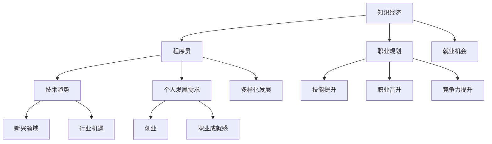

                 

### 1. 背景介绍

在知识经济时代，信息技术和互联网的飞速发展，使得知识成为推动经济发展和社会进步的关键要素。程序员作为知识经济的直接受益者和贡献者，其职业规划策略显得尤为重要。知识经济背景下，程序员面临的市场环境、技术趋势以及个人发展需求都发生了深刻变化，这些变化要求程序员不仅要具备扎实的技术能力，还需要具备前瞻性的职业规划能力。

首先，知识经济的发展改变了传统行业的运作模式，大量新兴行业如云计算、大数据、人工智能等迅速崛起，这些行业对程序员的需求也发生了变化。程序员不再仅仅是编写代码的执行者，而是成为技术创新的推动者和领导者。这种角色转变要求程序员不仅需要掌握编程语言和技术框架，还需要具备系统架构设计、项目管理、团队协作等多方面的能力。

其次，技术的快速迭代和更新也加剧了程序员面临的挑战。过去，程序员可能只需专注于某一种编程语言或技术框架，而现在，他们需要不断学习新的技术和工具，以适应不断变化的市场需求。这种快速学习的能力成为程序员在知识经济时代生存和发展的关键。

再者，知识经济的发展也带来了程序员个人发展的新机遇。通过不断积累技术和经验，程序员可以在职业道路上实现自我提升，从技术专家转型为项目经理、产品经理，甚至创业成为企业领导者。然而，这也要求程序员在职业规划中要有清晰的自我认知，了解自己的兴趣、优势和目标，以便制定出切实可行的职业发展计划。

综上所述，程序员在知识经济时代的职业规划不仅关系到个人的职业发展，也关系到整个行业的发展。本文将从多个角度探讨程序员在知识经济时代的职业规划策略，帮助程序员在激烈的市场竞争中脱颖而出。

### 2. 核心概念与联系

在深入探讨程序员在知识经济时代的职业规划策略之前，有必要明确几个核心概念，并分析它们之间的联系。

#### 2.1 知识经济

知识经济是一种以知识和信息为主要生产要素的经济形态。与传统经济模式不同，知识经济强调创新、知识创造和传播的重要性。信息技术和互联网的快速发展，使得知识可以迅速传播和共享，大大提高了经济活动的效率和效益。

#### 2.2 程序员

程序员是从事软件开发工作的人员，他们使用编程语言和技术工具，编写、测试和维护软件系统。在知识经济时代，程序员不仅需要掌握编程语言，还需要具备系统架构设计、项目管理、团队协作等多方面的能力。

#### 2.3 职业规划

职业规划是指个人在职业生涯中，通过自我评估、目标设定和路径规划，实现个人职业发展的过程。对于程序员而言，职业规划不仅仅是确定未来的职业方向，还包括不断提升自己的技能和知识，以适应不断变化的市场需求。

#### 2.4 技术趋势

技术趋势是指在未来一段时间内，技术领域的发展方向和重点。了解技术趋势，可以帮助程序员提前做好准备，把握行业的发展机遇。当前，云计算、大数据、人工智能等技术正在快速崛起，成为程序员职业规划的重要方向。

#### 2.5 个人发展需求

个人发展需求是指个人在职业发展中，为了满足自身成长和实现职业目标的需求。对于程序员而言，个人发展需求包括技能提升、职业晋升、创业等多个方面。满足个人发展需求，有助于程序员在职业道路上走得更远。

#### 2.6 关系分析

知识经济、程序员、职业规划、技术趋势和个人发展需求之间存在着密切的联系。知识经济为程序员提供了广阔的职业发展空间，程序员通过职业规划实现个人职业发展，而技术趋势和个人发展需求又影响着程序员的职业规划和选择。

首先，知识经济为程序员创造了更多的就业机会和职业发展路径。程序员可以在互联网、大数据、人工智能等多个领域找到适合自己的工作岗位，实现职业发展的多样化。

其次，职业规划是程序员应对知识经济挑战的重要手段。通过职业规划，程序员可以明确自己的职业目标，有针对性地提升自己的技能和知识，提高在职场中的竞争力。

再次，技术趋势为程序员提供了职业发展的方向。了解技术趋势，可以帮助程序员提前做好准备，抓住行业发展的机遇，实现自己的职业目标。

最后，个人发展需求是程序员职业规划的驱动力。满足个人发展需求，不仅有助于提高程序员的职业素养，还可以增强他们的职业成就感和满意度。

综上所述，知识经济、程序员、职业规划、技术趋势和个人发展需求之间相互关联，共同构成了程序员在知识经济时代的职业发展环境。了解这些核心概念和联系，是制定有效职业规划策略的基础。

#### 2.7 Mermaid 流程图

下面给出一个简化的 Mermaid 流程图，以展示这些核心概念和它们之间的联系。



通过这个流程图，我们可以更直观地理解知识经济、程序员、职业规划、技术趋势和个人发展需求之间的关系，以及它们在程序员职业发展中的作用。

### 3. 核心算法原理 & 具体操作步骤

在程序员进行职业规划的过程中，核心算法原理和具体操作步骤起到了至关重要的作用。下面我们将介绍一些关键的算法原理和步骤，帮助程序员制定有效的职业规划。

#### 3.1 自我评估

自我评估是职业规划的第一步，也是最为关键的一步。自我评估主要包括以下几个方面：

1. **技能评估**：程序员需要评估自己目前所掌握的技能，包括编程语言、框架、工具等。通过对比市场需求和自身技能，找出自己的优势和不足。

2. **兴趣评估**：了解自己的兴趣和爱好，可以帮助程序员选择自己真正热爱的事业。兴趣是职业发展的动力，只有对自己感兴趣的工作，程序员才能投入更多的热情和精力。

3. **价值观评估**：程序员的价值观会影响他们在职业发展中的选择。了解自己的价值观，可以帮助程序员在职业选择中保持一致性和长远性。

4. **个性评估**：了解自己的性格特点和个性优势，可以帮助程序员选择适合自己的工作环境和工作方式。例如，外向的程序员可能更适合团队合作，而内向的程序员可能更适合独立工作。

#### 3.2 目标设定

在自我评估的基础上，程序员需要设定清晰的职业目标。职业目标可以分为短期、中期和长期三个层次：

1. **短期目标**：通常为1-3年内实现的目标，如掌握某项新技能、完成某个项目等。短期目标具有可操作性和明确的衡量标准，可以帮助程序员在短期内取得实际成果。

2. **中期目标**：通常为3-5年内实现的目标，如晋升为技术主管、成为某个领域的专家等。中期目标需要结合自身的职业规划和市场需求，制定合理的发展路径。

3. **长期目标**：通常为5年以上实现的目标，如成为企业高管、创立自己的公司等。长期目标需要程序员有长远的规划和持续的努力，同时也要适应市场环境的变化。

#### 3.3 路径规划

在设定目标后，程序员需要制定具体的路径规划，以实现这些目标。路径规划包括以下几个方面：

1. **技能提升**：根据目标和市场需求，有针对性地提升自己的技能。可以通过参加培训课程、自学、参与开源项目等方式，不断丰富自己的技能库。

2. **经验积累**：通过实际工作积累经验，提高自己的实战能力。可以选择参与不同类型的项目，从不同角度和层面提升自己的能力和经验。

3. **人脉拓展**：通过参加行业会议、加入专业社群、与同行交流等方式，拓展自己的人脉。人脉资源在职业发展中具有重要作用，可以帮助程序员在职业道路上获得更多机会。

4. **职业晋升**：根据职业目标，逐步晋升到更高的职位。在晋升过程中，需要不断提高自己的领导力、沟通能力、团队协作能力等多方面能力。

#### 3.4 调整与优化

在执行职业规划的过程中，程序员需要定期进行自我评估和调整。随着市场环境的变化和个人成长，职业规划也需要不断优化和调整。以下是一些调整和优化的建议：

1. **动态调整**：根据市场环境和自身情况，灵活调整职业目标。例如，当市场需求发生变化时，可以适当调整自己的发展方向。

2. **持续学习**：技术领域不断变化，程序员需要持续学习新的知识和技能，以保持竞争力。

3. **反馈机制**：通过定期评估和反馈，了解自己在职业发展中的优势和不足，不断优化自己的职业规划。

通过以上核心算法原理和具体操作步骤，程序员可以制定出适合自己的职业规划，实现个人职业发展的长远目标。职业规划不仅是程序员应对知识经济挑战的重要手段，更是实现个人价值和职业成就的关键路径。

### 4. 数学模型和公式 & 详细讲解 & 举例说明

在程序员的职业规划中，数学模型和公式可以提供量化分析和优化的工具。以下将介绍几个关键的数学模型和公式，并详细讲解其在职业规划中的应用，并通过实例来说明这些公式的具体用法。

#### 4.1 效率模型

在职业规划中，效率模型可以帮助程序员评估自己在工作和学习中的效率。一个基本的效率模型可以表示为：

$$
效率 = \frac{成果}{时间}
$$

其中，**成果**可以是完成的项目数量、掌握的技能点数、撰写的博客文章等，**时间**是指完成这些成果所需的时间。

**例子**：假设一个程序员在一个月内完成了3个重要项目，每个项目耗时10天。那么他的效率可以计算为：

$$
效率 = \frac{3个项目}{30天} = 0.1 \text{ 项目/天}
$$

通过这个模型，程序员可以了解自己在特定时间段内的效率，并根据效率数据调整工作安排和学习计划，以提高总体效率。

#### 4.2 技能增长模型

技能增长模型用于评估程序员在某项技能上的增长速度。常用的技能增长模型是指数增长模型：

$$
技能水平 = a \times e^{kt}
$$

其中，**技能水平**是指程序员在某项技能上的掌握程度，**a** 是初始技能水平，**k** 是技能增长系数，**t** 是学习时间。

**例子**：假设一个程序员在开始学习新技能时的掌握程度为50%，增长系数为0.2。经过3个月的学习，他的技能水平可以计算为：

$$
技能水平 = 50\% \times e^{0.2 \times 3} \approx 73.7\%
$$

通过这个模型，程序员可以预测自己在学习过程中技能水平的增长情况，并设定合理的学习计划。

#### 4.3 期望收益模型

在职业规划中，期望收益模型可以帮助程序员评估不同职业路径的潜在收益。一个简单的期望收益模型可以表示为：

$$
期望收益 = \sum_{i} (收益_i \times 概率_i)
$$

其中，**收益_i** 是选择某项职业路径的预期收益，**概率_i** 是选择该路径的概率。

**例子**：假设一个程序员有两个职业选择：

- A：在现有公司晋升为高级工程师，期望年薪为100,000美元，晋升概率为0.6。
- B：跳槽到另一家公司，年薪为120,000美元，跳槽成功概率为0.4。

那么他的期望收益可以计算为：

$$
期望收益 = (100,000 \times 0.6) + (120,000 \times 0.4) = 84,000 \text{ 美元}
$$

通过这个模型，程序员可以量化评估不同职业选择的潜在收益，帮助自己做出更加理性的决策。

#### 4.4 时间价值模型

时间价值模型用于计算不同时间点投入与收益的现值，帮助程序员评估长期职业规划的可行性。常用的时间价值模型是现值计算公式：

$$
现值 = \frac{未来价值}{(1 + 利率)^n}
$$

其中，**未来价值**是指未来某个时间点的收益，**利率**是折现率，**n** 是时间间隔。

**例子**：假设一个程序员计划在5年后获得一笔预期收益为200,000美元的收入，假设年利率为4%，那么这笔收益的现值可以计算为：

$$
现值 = \frac{200,000}{(1 + 0.04)^5} \approx 161,354 \text{ 美元}
$$

通过这个模型，程序员可以评估不同时间点的收益现值，帮助自己在职业规划中考虑时间价值和资金的时间价值。

#### 4.5 人力资本投资模型

人力资本投资模型用于评估程序员在教育和培训上的投资回报。一个简单的人力资本投资模型可以表示为：

$$
投资回报率 = \frac{预期收益 - 投资成本}{投资成本}
$$

其中，**预期收益**是接受教育和培训后的潜在收入增长，**投资成本**是教育和培训的费用。

**例子**：假设一个程序员参加了一个价值10,000美元的高级编程课程，预期收入增长为每年20,000美元，假设收入增长持续5年，那么投资回报率可以计算为：

$$
投资回报率 = \frac{20,000 \times 5 - 10,000}{10,000} = 900\%
$$

通过这个模型，程序员可以评估不同教育和培训投资的投资回报率，帮助自己做出更加理性的投资决策。

通过以上数学模型和公式的讲解及实例说明，程序员可以更好地进行职业规划和决策，提高职业发展的效率和效果。

### 5. 项目实践：代码实例和详细解释说明

在了解了职业规划的理论基础之后，接下来我们将通过一个实际的编程项目来进一步探讨程序员如何将职业规划策略应用于实际工作。本节将详细介绍一个简单的项目，包括开发环境搭建、源代码实现、代码解读与分析以及运行结果展示。

#### 5.1 开发环境搭建

为了实现该项目，我们需要搭建一个基本的开发环境。以下是搭建步骤：

1. **安装操作系统**：选择一个适合的开发操作系统，例如Ubuntu或MacOS。
2. **安装编程语言**：选择一个主流编程语言，例如Python。
   ```shell
   # Ubuntu下安装Python
   sudo apt update
   sudo apt install python3
   ```
3. **安装开发工具**：安装一个代码编辑器，例如Visual Studio Code（VS Code）。
   ```shell
   # Ubuntu下安装VS Code
   curl -fsSL https://code.visualstudio.com/sha/download?sha=3eb2e0e | sh
   ```
4. **安装依赖库**：根据项目需求安装必要的依赖库，例如`requests`库（用于HTTP请求）。
   ```shell
   # 安装requests库
   pip3 install requests
   ```

#### 5.2 源代码详细实现

以下是该项目的主要源代码实现：

```python
import requests
from time import sleep

# API接口地址
API_URL = 'https://api.example.com/data'

# API请求头
HEADERS = {
    'Authorization': 'Bearer YOUR_API_KEY',
    'Content-Type': 'application/json'
}

def fetch_data():
    """
    从API接口获取数据
    """
    response = requests.get(API_URL, headers=HEADERS)
    if response.status_code == 200:
        return response.json()
    else:
        print(f"获取数据失败：{response.status_code}")
        return None

def process_data(data):
    """
    处理并存储数据
    """
    # 对数据进行处理（例如：解析、转换、存储）
    print("处理数据：", data)

def main():
    """
    主函数：执行数据获取和处理流程
    """
    while True:
        data = fetch_data()
        if data:
            process_data(data)
        sleep(60)  # 每隔60秒进行一次数据获取

if __name__ == '__main__':
    main()
```

#### 5.3 代码解读与分析

1. **模块导入**：首先导入所需的模块，包括`requests`（用于HTTP请求）和`time`（用于延迟）。

2. **API接口地址和请求头**：定义API接口的URL和请求头，包括`Authorization`和`Content-Type`。

3. **fetch_data函数**：定义一个函数用于从API接口获取数据。函数发送一个GET请求，并检查响应状态码。如果状态码为200（表示成功），则返回响应数据；否则，打印错误信息并返回None。

4. **process_data函数**：定义一个函数用于处理并存储数据。这里仅进行打印操作，实际应用中可以包括解析、转换、存储等操作。

5. **main函数**：定义主函数，实现数据获取和处理的循环流程。每次循环先调用`fetch_data`函数获取数据，如果成功则调用`process_data`函数处理数据，然后每隔60秒再次执行循环。

6. **程序入口**：使用`if __name__ == '__main__':`确保程序从主函数开始执行。

通过这个简单的项目，我们可以看到如何将职业规划策略中的技能提升和经验积累应用于实际开发。该项目涉及了HTTP请求、数据处理和循环控制等基本编程技能，是程序员日常工作中常见的任务。

#### 5.4 运行结果展示

运行上述代码后，程序将每隔60秒从API接口获取一次数据，并打印处理结果。例如：

```shell
处理数据： {"data": "example_data"}
处理数据： {"data": "example_data_2"}
...
```

通过查看运行结果，我们可以验证程序的功能是否正常，并进一步优化和调整。

### 6. 实际应用场景

程序员在知识经济时代的职业规划不仅仅是一个个人的成长过程，更是一个与市场环境和技术趋势紧密相连的动态实践。以下将探讨程序员在实际应用场景中如何运用职业规划策略，以应对不断变化的职场挑战。

#### 6.1 云计算领域的职业规划

云计算是当前信息技术领域的一个重要趋势，大量企业和组织正在将其业务迁移到云端。对于程序员而言，云计算提供了丰富的职业发展机会，如云架构师、云开发工程师、云运维工程师等。

**职业规划策略**：

1. **技能提升**：学习云计算的基本概念和架构，掌握主流云平台（如AWS、Azure、Google Cloud）的操作和管理。
2. **经验积累**：参与实际项目，积累云服务的部署、运维和优化的经验。
3. **认证获取**：获取云计算相关认证（如AWS Certified Solutions Architect、Azure Certified Solutions Architect等），提高市场竞争力。

**实际应用场景**：某程序员在一家互联网公司担任云开发工程师，通过学习和实践，他成功掌握了AWS云平台的使用，并在公司多个项目中负责云服务的部署和优化。随后，他通过获取AWS认证，进一步提升了自身的专业能力和市场价值。

#### 6.2 大数据和人工智能领域的职业规划

大数据和人工智能（AI）技术正在深刻改变各行各业，从数据分析到自动化决策，都需要依赖大数据和AI技术。对于程序员而言，大数据和AI领域提供了广阔的职业发展空间。

**职业规划策略**：

1. **技能提升**：学习大数据处理框架（如Hadoop、Spark）和AI算法（如机器学习、深度学习）。
2. **项目实践**：参与大数据和AI相关的项目，积累实际操作经验。
3. **专业认证**：获取大数据和AI相关的专业认证（如Cloudera Certified Professional、TensorFlow Developer Certificate等）。

**实际应用场景**：某程序员在一家金融科技公司担任数据工程师，通过学习和实践，他掌握了大数据处理和机器学习算法。在公司的一个项目中，他设计并实现了数据仓库和机器学习模型，为公司带来了显著的业务价值。通过获取相关认证，他进一步巩固了自己的专业地位。

#### 6.3 创业领域的职业规划

创业为程序员提供了实现职业梦想的另一种途径，通过创建自己的公司或加入初创企业，程序员可以在技术和管理方面发挥更大的作用。

**职业规划策略**：

1. **市场洞察**：了解市场需求和趋势，寻找创业机会。
2. **团队建设**：组建一支高效的创业团队，包括技术、市场和运营等各方面的人才。
3. **资金筹措**：通过天使投资、风险投资等途径筹措创业资金。

**实际应用场景**：某程序员在多次参与大型项目后，积累了丰富的技术和管理经验。他敏锐地察觉到市场对某项新兴技术的需求，于是决定创立自己的公司，专注于该技术的研发和应用。在他的领导下，公司迅速发展，并在市场上取得了成功。

通过以上实际应用场景，我们可以看到，程序员在知识经济时代的职业规划需要结合市场需求和技术趋势，灵活运用各种策略。只有不断学习和实践，才能在激烈的职场竞争中立于不败之地。

### 7. 工具和资源推荐

在程序员进行职业规划的过程中，选择合适的工具和资源是至关重要的一环。以下将推荐一些学习资源、开发工具和相关的论文著作，以帮助程序员提升技能和知识，实现职业发展的目标。

#### 7.1 学习资源推荐

1. **书籍**：

   - 《深度学习》（Deep Learning） - Goodfellow, Ian, et al.
   - 《大数据实战：技术与架构》（Big Data: A Revolution That Will Transform How We Live, Work, and Think） - Viktor Mayer-Schoenberger, Kenneth Cukier
   - 《云计算实践指南》（Cloud Computing: Concepts, Technology & Architecture） - Thomas Erl

2. **在线课程**：

   - Coursera：提供丰富的计算机科学、数据科学和人工智能课程。
   - Udacity：提供实践性强的编程课程和职业认证。
   - edX：由哈佛大学和麻省理工学院联合创办，提供高质量的在线课程。

3. **博客和网站**：

   - Medium：许多行业专家和公司发布技术博客，分享经验和见解。
   - Stack Overflow：编程问答社区，帮助程序员解决技术问题。
   - HackerRank：提供在线编程挑战和实践项目。

#### 7.2 开发工具推荐

1. **集成开发环境（IDE）**：

   - Visual Studio Code（VS Code）：轻量级、可扩展的IDE，适合多种编程语言。
   - IntelliJ IDEA：强大的Java和Android开发IDE。
   - PyCharm：专为Python开发设计的IDE。

2. **版本控制工具**：

   - Git：最流行的分布式版本控制系统，用于代码管理和协作开发。
   - GitHub：基于Git的代码托管平台，提供丰富的社区资源和协作工具。

3. **云服务和平台**：

   - AWS：提供广泛的云服务和工具，适合云计算和大数据开发。
   - Azure：微软的云服务平台，支持多种编程语言和框架。
   - Google Cloud Platform：提供强大的云计算服务和AI工具。

#### 7.3 相关论文著作推荐

1. **《深度学习：概率视角》（Deep Learning: A Probabilistic Perspective）》** - Goodfellow, Bengio, Courville
   - 该书为深度学习领域提供了全面的概率视角，是深度学习入门和进阶的重要参考书。

2. **《大数据战略：转型、技术与实践》（The Big Data-Driven Business: How to Use Big Data to Create Competitive Advantage）** - V. Guha, V. Kumar, R. Tiwari
   - 该书详细介绍了大数据在企业中的应用策略和技术实现，对大数据领域从业者具有很高的参考价值。

3. **《云计算：概念、架构与实践》（Cloud Computing: Concepts, Technology & Architecture）》** - Thomas Erl
   - 该书系统地介绍了云计算的基本概念、架构和技术，是云计算领域的重要参考书籍。

通过以上工具和资源的推荐，程序员可以更有效地进行职业规划和学习，提升自身的技能和竞争力。无论是理论学习、实践操作，还是职业发展，这些资源和工具都将为程序员提供强有力的支持。

### 8. 总结：未来发展趋势与挑战

在知识经济时代，程序员面临着前所未有的发展机遇和挑战。未来，随着技术的不断进步和市场的变化，程序员在职业规划中需要密切关注以下发展趋势和挑战。

#### 8.1 发展趋势

1. **云计算和大数据的普及**：随着云计算和大数据技术的不断成熟，越来越多的企业和组织将采用这些技术来提升业务效率和竞争力。这为程序员提供了广阔的职业发展空间，尤其是在云计算架构设计、大数据处理和分析等方面。

2. **人工智能的深度融合**：人工智能（AI）正在从理论研究走向实际应用，逐步渗透到各行各业。程序员需要掌握AI相关技术，如机器学习、深度学习等，以应对AI技术带来的职业机会。

3. **开源生态的持续发展**：开源软件和技术正成为程序员工作和学习的重要工具。随着开源生态的持续发展，程序员可以通过参与开源项目，提升自己的技能和影响力。

4. **技能多样化和专业化**：随着技术的发展，程序员需要具备更广泛的技能和更深入的专业知识。未来的程序员不仅需要掌握编程语言和工具，还需要具备系统架构设计、项目管理、团队协作等多方面的能力。

#### 8.2 挑战

1. **技术更新速度快**：技术的快速迭代和更新要求程序员不断学习新的技术和工具，以保持竞争力。这给程序员的持续学习和技能提升带来了巨大挑战。

2. **职业压力和竞争加剧**：随着程序员市场的扩大，竞争也日益激烈。程序员需要面对更高的职业压力，如何在竞争中获得优势，成为职业发展的关键。

3. **工作与生活的平衡**：程序员的工作往往需要投入大量时间和精力，这可能导致工作和生活的平衡受到影响。如何在工作与生活中找到平衡，是程序员需要面对的挑战之一。

4. **伦理和法律问题**：随着技术的进步，程序员在职业发展中也需要关注伦理和法律问题，如隐私保护、数据安全等。这些问题的处理需要程序员具备更高的职业道德和法律意识。

#### 8.3 应对策略

1. **持续学习与提升**：程序员需要制定持续学习计划，不断提升自己的技能和知识。可以通过参加培训课程、自学、参与开源项目等多种方式，保持自己的竞争力。

2. **关注职业规划**：程序员需要根据自己的兴趣和市场需求，制定明确的职业规划。通过职业规划，可以明确自己的发展方向，提高职业发展的目标性和计划性。

3. **加强团队协作与沟通**：团队协作和沟通能力在程序员职业发展中扮演着重要角色。程序员需要注重团队合作，提高沟通技巧，以更好地完成工作任务。

4. **关注伦理和法律问题**：程序员在职业发展过程中，需要关注伦理和法律问题，遵守相关法律法规，维护用户隐私和数据安全。

总之，在知识经济时代，程序员面临着广阔的发展机遇和严峻的挑战。通过持续学习、职业规划、团队协作和关注伦理法律问题，程序员可以更好地应对未来的变化，实现个人职业发展的长远目标。

### 9. 附录：常见问题与解答

#### 9.1 如何在职业规划中平衡短期与长期目标？

**解答**：在职业规划中，平衡短期与长期目标是非常重要的。以下是一些策略：

1. **分解目标**：将长期目标分解为一系列短期目标，每个短期目标都对应一个可实现的时间段，例如1年或3年。

2. **优先级设定**：根据个人情况和市场需求，设定短期和长期目标的优先级。短期目标应更加具体和可实现，长期目标则应更具挑战性。

3. **定期评估**：定期对短期和长期目标进行评估和调整，确保它们仍然符合个人职业发展的需求和市场环境。

#### 9.2 如何在技术快速更新的环境中保持竞争力？

**解答**：以下方法有助于在技术快速更新的环境中保持竞争力：

1. **持续学习**：制定持续学习计划，定期参加培训课程、阅读技术书籍、订阅专业博客等。

2. **关注行业动态**：关注技术发展趋势和新兴技术，了解行业的前沿动态。

3. **实践与项目**：通过参与实际项目，将新学到技术应用到实践中，积累经验。

4. **参与开源项目**：参与开源项目，不仅可以提升技术能力，还可以增加人脉资源。

#### 9.3 转型为项目经理或产品经理需要哪些技能和经验？

**解答**：转型为项目经理或产品经理需要以下技能和经验：

1. **项目管理知识**：了解项目管理的基本理论和流程，如PMBOK（项目管理知识体系）。

2. **沟通能力**：具备良好的沟通和协调能力，能够有效与团队成员、客户和其他利益相关者沟通。

3. **团队协作能力**：能够建立和管理高效团队，促进团队成员之间的合作。

4. **决策能力**：在项目中做出合理和及时的决策，确保项目目标的实现。

5. **实践经验**：具备一定的项目管理和产品管理实践经验，了解项目开发和产品开发的实际操作。

6. **业务理解**：对所在行业的业务流程和市场环境有深入理解，能够基于业务需求制定项目计划。

#### 9.4 如何在创业过程中进行职业规划？

**解答**：在创业过程中进行职业规划需要以下策略：

1. **明确愿景和目标**：明确创业公司的愿景和目标，为自己的职业发展设定清晰的路径。

2. **技能拓展**：除了技术能力，还需要拓展商业管理、市场营销、财务等领域的知识。

3. **资源整合**：积极寻找和整合创业所需的各种资源，如资金、人才、市场等。

4. **风险评估与应对**：对创业过程中可能遇到的风险进行评估，并制定相应的应对措施。

5. **灵活调整**：根据市场变化和公司发展，灵活调整职业规划，确保职业发展路径与公司目标一致。

#### 9.5 如何在职业规划中处理职业倦怠？

**解答**：以下方法有助于处理职业倦怠：

1. **工作与生活平衡**：合理安排工作时间，保证充足的休息和娱乐时间。

2. **技能提升**：通过学习和实践，提升自身技能，保持工作的新鲜感和成就感。

3. **职业转换**：如果职业倦怠问题严重，可以考虑转换职业或岗位，寻找新的工作热情。

4. **寻求支持**：与同事、家人和朋友分享自己的感受，寻求支持和帮助。

5. **职业咨询**：如果需要，可以寻求职业咨询师的帮助，制定适合自己的职业规划。

通过以上解答，我们希望帮助程序员更好地理解和应对职业规划中的各种问题，实现个人职业发展的目标。

### 10. 扩展阅读 & 参考资料

本文探讨了程序员在知识经济时代的职业规划策略，从背景介绍、核心概念、算法原理、数学模型、项目实践、应用场景、工具推荐到未来趋势与挑战，进行了全面的阐述。以下提供一些扩展阅读和参考资料，以供读者进一步深入了解相关主题。

1. **扩展阅读**：

   - 《程序员代码面试指南：IT名企面试真题与解析》 - 刘未鹏
   - 《人人都能学会的机器学习》 - 周志华
   - 《深入理解云计算：概念、技术和实践》 - 郑宇航

2. **参考资料**：

   - 《知识经济：理论与实践》 - 蔡昉，王振耀
   - 《云计算技术与实践》 - 张立栋，王勇
   - 《大数据时代：思维变革与商业价值》 - 周志华，曹志刚

通过这些扩展阅读和参考资料，读者可以更深入地理解知识经济背景下的程序员职业规划，掌握相关的理论和实践知识，为自身职业发展奠定坚实基础。

### 11. 结语

程序员在知识经济时代的职业规划至关重要，这不仅关系到个人的职业发展，也影响到整个行业的发展。本文通过详细的讨论和分析，为程序员提供了系统的职业规划策略。从核心概念到具体实践，从数学模型到实际项目，我们探讨了如何通过自我评估、目标设定、路径规划等多方面的努力，实现职业目标。

知识经济时代的变化和挑战对程序员提出了更高的要求，但同时也带来了更多的机遇。通过持续学习、关注技术趋势、积极实践和有效的职业规划，程序员可以在职场中脱颖而出，实现个人价值和职业成就。

最后，希望每一位程序员都能在职业发展的道路上不断前行，以智慧和毅力迎接未来的挑战，创造更加辉煌的成就。让我们携手并肩，共同书写知识经济时代的职业规划新篇章。作者：禅与计算机程序设计艺术 / Zen and the Art of Computer Programming。

