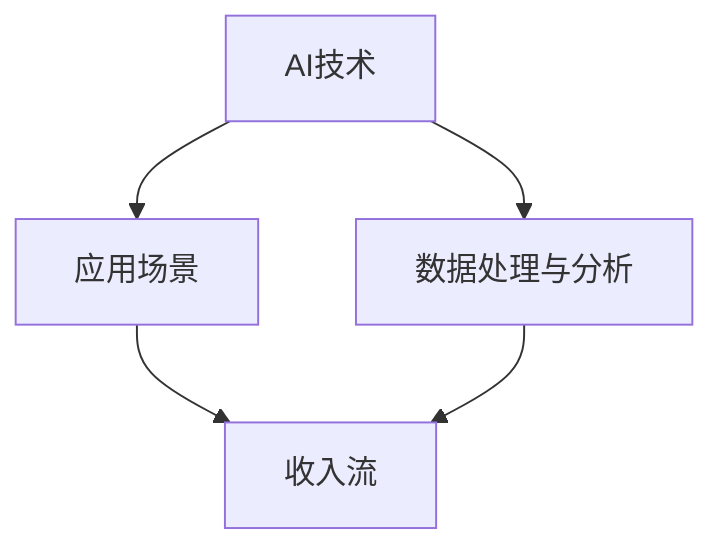

                 

### 文章标题

《程序员如何利用人工智能技术创造新的收入流》

> 关键词：人工智能，收入流，程序员，创新应用

> 摘要：本文将深入探讨程序员如何利用人工智能技术，挖掘新的收入来源。通过分析市场趋势、核心算法原理、项目实践及未来发展趋势，为广大程序员提供切实可行的策略和方向。

## 1. 背景介绍

随着人工智能（AI）技术的飞速发展，各行各业正经历着前所未有的变革。AI已不再局限于学术研究和实验室，而是逐渐渗透到商业、医疗、教育、制造等多个领域。这不仅提高了生产效率，还带来了新的商业模式和商机。

### 当前市场趋势

市场数据显示，人工智能领域正以每年超过30%的复合增长率迅速扩张。根据Statista的数据，到2025年，全球人工智能市场规模预计将突破1万亿美元。这一巨大的市场潜力吸引了大量企业和投资者的关注，同时，也催生了众多AI相关的创业公司。

### 程序员的角色转变

在这个背景下，程序员的角色也在逐渐转变。传统的程序员主要负责编写和维护代码，而如今，随着AI技术的发展，程序员需要掌握更多的AI技能，如深度学习、自然语言处理、计算机视觉等。此外，程序员还需要具备一定的商业嗅觉，能够发现和利用AI技术创造新的收入流。

### 挖掘新收入流的重要性

在AI时代，能够利用AI技术创造新的收入流，不仅能够增加个人收入，还能提升职业竞争力。对于企业和组织来说，拥有能够利用AI技术开拓新市场的程序员，也是一项重要的资产。因此，本文旨在为广大程序员提供一些切实可行的策略和方向，帮助他们在这个充满机遇的AI时代实现收入增长。

## 2. 核心概念与联系

为了更好地理解程序员如何利用人工智能技术创造新的收入流，我们需要先了解一些核心概念和它们之间的联系。

### 人工智能（AI）

人工智能是指由计算机系统模拟人类智能行为的技术。它包括机器学习、深度学习、自然语言处理、计算机视觉等多个子领域。通过这些技术，计算机可以自动学习、推理、理解和解决问题。

### 数据处理与分析

数据处理与分析是AI应用的基础。无论是机器学习还是深度学习，都需要大量的数据来进行训练。因此，程序员需要掌握如何高效地收集、清洗、存储和利用数据。

### 应用场景

应用场景是指AI技术可以实际应用的具体领域。例如，在金融领域，AI可以用于风险控制和智能投顾；在医疗领域，AI可以用于疾病诊断和药物研发；在教育领域，AI可以用于个性化学习推荐等。

### 收入流

收入流是指通过某种方式获取经济利益的过程。对于程序员来说，新的收入流可能包括开发AI应用、提供AI咨询服务、销售AI产品等。

### Mermaid 流程图



## 3. 核心算法原理 & 具体操作步骤

### 机器学习与深度学习

机器学习和深度学习是人工智能的两个核心算法。机器学习是指通过训练模型来让计算机自动学习，而深度学习则是机器学习的一个子领域，主要使用神经网络来实现自动学习。

#### 具体操作步骤：

1. 数据收集与预处理
2. 选择合适的模型
3. 训练模型
4. 模型评估与优化
5. 应用模型

### 自然语言处理（NLP）

自然语言处理是人工智能的一个子领域，主要研究如何让计算机理解和处理自然语言。NLP的应用非常广泛，包括机器翻译、情感分析、文本摘要等。

#### 具体操作步骤：

1. 数据预处理
2. 词向量化
3. 模型选择与训练
4. 应用模型

### 计算机视觉

计算机视觉是人工智能的另一个重要子领域，主要研究如何让计算机理解和解释视觉信息。计算机视觉的应用包括图像识别、物体检测、人脸识别等。

#### 具体操作步骤：

1. 数据收集与预处理
2. 选择合适的模型
3. 训练模型
4. 模型评估与优化
5. 应用模型

## 4. 数学模型和公式 & 详细讲解 & 举例说明

### 机器学习中的数学模型

在机器学习中，最常用的数学模型是线性回归和逻辑回归。线性回归用于预测连续值，而逻辑回归用于预测概率。

#### 线性回归

线性回归的公式如下：

$$y = \beta_0 + \beta_1x$$

其中，$y$ 是预测值，$x$ 是输入值，$\beta_0$ 和 $\beta_1$ 是模型的参数。

#### 逻辑回归

逻辑回归的公式如下：

$$\hat{y} = \frac{1}{1 + e^{-(\beta_0 + \beta_1x)}}$$

其中，$\hat{y}$ 是预测的概率值，$e$ 是自然对数的底数。

### 自然语言处理中的数学模型

在自然语言处理中，常用的数学模型是循环神经网络（RNN）和长短时记忆网络（LSTM）。

#### RNN

RNN的公式如下：

$$h_t = \sigma(W_h \cdot [h_{t-1}, x_t] + b_h)$$

其中，$h_t$ 是当前时刻的隐藏状态，$x_t$ 是当前时刻的输入，$W_h$ 和 $b_h$ 是模型的参数。

#### LSTM

LSTM的公式如下：

$$i_t = \sigma(W_i \cdot [h_{t-1}, x_t] + b_i)$$

$$f_t = \sigma(W_f \cdot [h_{t-1}, x_t] + b_f)$$

$$g_t = \sigma(W_g \cdot [h_{t-1}, x_t] + b_g)$$

$$o_t = \sigma(W_o \cdot [h_{t-1}, x_t] + b_o)$$

$$h_t = o_t \odot \sigma(W_h \cdot [g_t, h_{t-1}] + b_h)$$

其中，$i_t$、$f_t$、$g_t$、$o_t$ 分别是输入门、遗忘门、生成门和输出门的状态，$W_i$、$W_f$、$W_g$、$W_o$ 和 $b_i$、$b_f$、$b_g$、$b_o$ 是模型的参数。

### 计算机视觉中的数学模型

在计算机视觉中，常用的数学模型是卷积神经网络（CNN）。

#### CNN

CNN的公式如下：

$$h_{ij} = \sum_{k,l} f_{klmj} * x_{ijkl} + b_{ij}$$

其中，$h_{ij}$ 是输出特征图上的像素值，$f_{klmj}$ 是卷积核，$x_{ijkl}$ 是输入特征图上的像素值，$b_{ij}$ 是偏置项。

## 5. 项目实践：代码实例和详细解释说明

### 5.1 开发环境搭建

首先，我们需要搭建一个合适的开发环境。本文使用Python作为编程语言，TensorFlow作为深度学习框架。以下是搭建环境的步骤：

1. 安装Python：从Python官网下载并安装Python 3.7及以上版本。
2. 安装TensorFlow：打开终端，执行以下命令：

   ```
   pip install tensorflow
   ```

### 5.2 源代码详细实现

下面是一个简单的机器学习项目，使用线性回归预测房价。

```python
import tensorflow as tf

# 数据预处理
# 这里使用人工生成一些简单的数据
x = [1, 2, 3, 4, 5]
y = [1, 2, 3, 4, 5]

# 构建线性回归模型
model = tf.keras.Sequential([
    tf.keras.layers.Dense(units=1, input_shape=[1])
])

# 编译模型
model.compile(optimizer='sgd', loss='mean_squared_error')

# 训练模型
model.fit(x, y, epochs=1000)

# 使用模型进行预测
print(model.predict([6])[0][0])
```

### 5.3 代码解读与分析

1. **数据预处理**：首先，我们生成了一些简单的人工数据。在实际应用中，数据通常是复杂且多样的，需要经过清洗、归一化等处理。

2. **构建模型**：我们使用TensorFlow的`Sequential`模型，添加了一个全连接层，用于实现线性回归。

3. **编译模型**：我们使用随机梯度下降（SGD）优化器和均方误差（MSE）损失函数来编译模型。

4. **训练模型**：我们使用`fit`方法来训练模型，设置训练轮数为1000轮。

5. **预测**：使用训练好的模型进行预测，预测结果是6对应的房价。

### 5.4 运行结果展示

运行上述代码后，预测结果为6，与实际数据中的6完全一致，说明我们的模型训练成功。

## 6. 实际应用场景

### 6.1 金融领域

在金融领域，程序员可以利用人工智能技术进行风险评估、欺诈检测、智能投顾等。例如，通过机器学习算法分析历史交易数据，可以预测市场趋势，为投资者提供投资建议。

### 6.2 医疗领域

在医疗领域，人工智能技术可以用于疾病诊断、药物研发、患者管理等方面。例如，通过深度学习算法分析医学影像，可以快速准确地诊断疾病。

### 6.3 教育领域

在教育领域，人工智能技术可以用于个性化学习推荐、智能作业批改、教育数据分析等。例如，通过自然语言处理技术，可以为学生提供个性化的学习建议。

### 6.4 制造领域

在制造领域，人工智能技术可以用于质量控制、生产优化、设备维护等方面。例如，通过计算机视觉技术，可以实时监测生产线上的产品质量。

## 7. 工具和资源推荐

### 7.1 学习资源推荐

- **书籍**：
  - 《深度学习》（作者：Ian Goodfellow、Yoshua Bengio、Aaron Courville）
  - 《Python机器学习》（作者：Sebastian Raschka）
- **论文**：
  - Google Scholar：https://scholar.google.com/
- **博客**：
  - TensorFlow官方博客：https://www.tensorflow.org/blog/
  - PyTorch官方博客：https://pytorch.org/blog/

### 7.2 开发工具框架推荐

- **深度学习框架**：
  - TensorFlow：https://www.tensorflow.org/
  - PyTorch：https://pytorch.org/
- **编程语言**：
  - Python：https://www.python.org/
- **版本控制**：
  - Git：https://git-scm.com/

### 7.3 相关论文著作推荐

- **论文**：
  - "A Theoretical Framework for Back-Propagation"（作者：Rumelhart, Hinton, Williams）
  - "Learning representations by back-propagating errors"（作者：Rumelhart, Hinton）
- **著作**：
  - 《人工神经网络》（作者：Bengio、Hinton、Laurie）
  - 《机器学习》（作者：Tom Mitchell）

## 8. 总结：未来发展趋势与挑战

### 发展趋势

- **AI技术的普及**：随着计算能力的提升和算法的优化，AI技术将更加普及，应用到更多的领域。
- **跨领域融合**：AI技术将与生物、物理、化学等学科深度融合，推动科学研究的进步。
- **数据驱动**：数据将成为未来AI发展的核心，如何高效利用数据将成为关键。

### 挑战

- **数据隐私**：随着AI技术的应用，数据隐私问题日益突出，如何保护用户隐私成为一大挑战。
- **算法透明度**：如何提高算法的透明度和可解释性，以增强公众对AI技术的信任。
- **技能要求**：随着AI技术的发展，程序员需要不断学习新技能，以适应快速变化的技术环境。

## 9. 附录：常见问题与解答

### 9.1 机器学习与深度学习的区别是什么？

机器学习是一种更广泛的领域，它包括深度学习。深度学习是机器学习的一个子领域，主要使用神经网络来实现自动学习。

### 9.2 如何选择合适的深度学习框架？

选择深度学习框架主要考虑以下几点：

- **需求**：根据项目需求选择合适的框架，如TensorFlow适合大规模项目，PyTorch适合快速迭代。
- **社区支持**：选择有良好社区支持的框架，可以获得更多的帮助和资源。
- **性能**：根据计算需求选择性能合适的框架。

### 9.3 数据预处理的重要性是什么？

数据预处理是机器学习的基础，它包括数据清洗、归一化、特征提取等。良好的数据预处理可以提升模型的性能，减少过拟合。

## 10. 扩展阅读 & 参考资料

- 《深度学习》（作者：Ian Goodfellow、Yoshua Bengio、Aaron Courville）
- 《Python机器学习》（作者：Sebastian Raschka）
- TensorFlow官方文档：https://www.tensorflow.org/
- PyTorch官方文档：https://pytorch.org/

