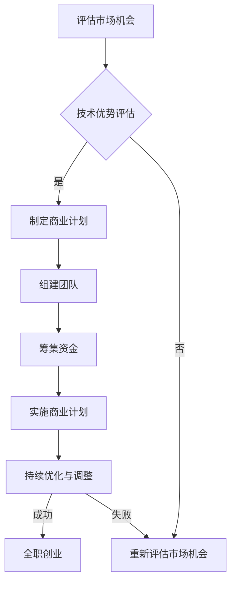

                 

### 文章标题

《程序员如何将副业升级为全职创业项目》

> 关键词：程序员、副业、全职创业、项目、转型、策略、实施

> 摘要：本文旨在为程序员提供系统性的指导，帮助他们将个人的副业项目成功升级为全职创业项目。文章将探讨如何进行市场分析、项目规划、团队建设以及资金筹集等方面的策略和实施步骤，助力程序员实现职业生涯的华丽转型。

## 1. 背景介绍

在当今快速变化的技术时代，许多程序员选择在业余时间开展副业项目，这不仅可以增加额外的收入，还可以锻炼自己的技能、积累项目经验。然而，随着个人兴趣和技能的提升，许多程序员开始思考如何将副业项目进一步发展，甚至将其升级为全职创业项目。

将副业升级为全职创业项目对于程序员来说既是机遇也是挑战。成功的转型不仅可以带来职业成就感和财务自由，还可以在技术领域内获得更大的影响力。然而，这个过程并非一帆风顺，需要程序员在技术、管理、市场等多个方面进行全面准备和规划。

本文将深入探讨程序员如何评估自己的副业项目潜力，制定合适的创业策略，以及如何实施这些策略，从而将副业成功转型为全职创业项目。

## 2. 核心概念与联系

### 副业与全职创业的区别

在探讨如何将副业升级为全职创业项目之前，首先需要明确副业与全职创业之间的区别。

- **副业**：通常是在保持全职工作的同时，利用业余时间开展的一些小型项目或服务。副业的规模和影响相对较小，风险也较低。
- **全职创业**：意味着将大部分时间和精力投入到创业项目中，目标通常是实现业务增长和财务独立。全职创业涉及更复杂的决策、更广泛的市场和更高的风险。

### 成功转型的关键因素

- **市场机会**：识别和把握市场需求，确保创业项目的可行性和盈利潜力。
- **技术优势**：具备核心技术和专业知识，确保项目在技术层面的竞争力。
- **团队建设**：建立高效、协作的团队，分担工作任务，提高项目执行力。
- **资金管理**：确保有足够的资金支持项目的运营和发展。
- **商业模式**：清晰定义商业目标、价值主张和收入来源。

### Mermaid 流程图

以下是描述副业升级为全职创业项目的Mermaid流程图：



通过上述流程图，我们可以清晰地看到，成功转型为全职创业项目需要经过多个关键步骤的评估、规划和实施。

## 3. 核心算法原理 & 具体操作步骤

### 市场分析

#### 步骤1：确定目标市场

- **市场定位**：明确你的创业项目针对的用户群体是谁，他们的需求、偏好和痛点是什么。
- **竞争对手分析**：识别直接和间接的竞争对手，分析他们的产品特点、市场策略和用户反馈。
- **市场容量**：估算目标市场的潜在用户数量，评估市场规模的可行性。

#### 步骤2：进行市场调研

- **问卷调查**：设计问卷，收集用户反馈，了解他们对现有产品的评价和期望。
- **访谈调研**：与潜在用户进行一对一访谈，深入了解他们的需求和购买意愿。
- **数据分析**：利用现有的市场数据，分析用户行为和趋势，为创业项目提供数据支持。

### 项目规划

#### 步骤1：定义产品或服务

- **核心功能**：明确产品或服务的主要功能，确保满足用户需求。
- **用户体验**：设计直观、易用的用户界面，提高用户满意度。
- **技术实现**：确定所需的技术栈和开发工具，确保项目的技术可行性。

#### 步骤2：制定时间表和预算

- **项目计划**：制定详细的项目计划，包括开发、测试和发布等阶段的时间安排。
- **预算管理**：根据项目需求，制定合理的预算，并监控成本支出。

### 团队建设

#### 步骤1：确定团队成员

- **技能需求**：根据项目需求，确定所需的技能和团队成员。
- **招聘渠道**：通过合适的招聘渠道，寻找合适的团队成员。

#### 步骤2：团队协作与管理

- **沟通机制**：建立有效的沟通机制，确保团队成员之间的信息流通。
- **项目管理制度**：制定合理的项目管理流程，确保项目的顺利进行。

### 资金筹集

#### 步骤1：评估资金需求

- **启动资金**：确定项目启动所需的资金额度。
- **运营资金**：评估项目日常运营所需的资金。

#### 步骤2：寻找资金来源

- **自筹资金**：利用个人储蓄或借款。
- **天使投资**：寻找愿意投资早期项目的天使投资人。
- **风险投资**：寻找风险投资机构，争取投资。

### 商业模式

#### 步骤1：定义商业模式

- **价值主张**：明确你的产品或服务能为用户带来哪些价值。
- **收入来源**：确定你的收入模式，如订阅、广告、销售产品等。

#### 步骤2：商业模式验证

- **最小可行产品（MVP）**：开发一个最小可行性产品，验证商业模式的可行性。
- **用户反馈**：通过用户反馈，不断优化和调整商业模式。

## 4. 数学模型和公式 & 详细讲解 & 举例说明

### 成本收益分析

#### 公式

成本收益分析的基本公式如下：

$$
\text{净收益} = (\text{收入} - \text{成本})
$$

其中，收入和成本可以进一步细分为：

$$
\text{收入} = (\text{单价} \times \text{销量}) + (\text{其他收入})
$$

$$
\text{成本} = (\text{固定成本} + \text{可变成本}) + (\text{其他成本})
$$

#### 举例说明

假设一家软件开发公司的产品单价为100美元，每月预计销量为1000件，固定成本为5000美元，可变成本为每件10美元，其他成本为1000美元。

根据上述数据，我们可以计算出：

$$
\text{收入} = (100 \times 1000) + 0 = 100000 \text{美元}
$$

$$
\text{成本} = (5000 + 10 \times 1000) + 1000 = 16000 \text{美元}
$$

$$
\text{净收益} = 100000 - 16000 = 84000 \text{美元}
$$

### 市场容量估算

市场容量估算的常见公式为：

$$
\text{市场容量} = (\text{总人口} \times \text{需求率}) / (\text{产品单位成本})
$$

#### 举例说明

假设某地区总人口为100万，用户需求率为10%，产品单位成本为50美元。

根据上述数据，我们可以计算出：

$$
\text{市场容量} = (1000000 \times 0.1) / 50 = 20000 \text{件}
$$

## 5. 项目实践：代码实例和详细解释说明

### 5.1 开发环境搭建

为了更好地理解和实现项目，我们需要搭建一个合适的开发环境。以下是一个简单的环境搭建步骤：

#### 操作系统：Ubuntu 20.04

1. **安装操作系统**：
   - 使用虚拟机或云服务器安装Ubuntu 20.04。
   - 更新系统软件包：

   ```bash
   sudo apt update
   sudo apt upgrade
   ```

2. **安装开发工具**：
   - 安装Python 3：

   ```bash
   sudo apt install python3
   ```

   - 安装Git：

   ```bash
   sudo apt install git
   ```

   - 安装代码编辑器（如Visual Studio Code）：

   ```bash
   sudo apt install code
   ```

3. **配置Python环境**：
   - 安装虚拟环境工具：

   ```bash
   pip install virtualenv
   ```

   - 创建并激活虚拟环境：

   ```bash
   virtualenv my_project_env
   source my_project_env/bin/activate
   ```

### 5.2 源代码详细实现

以下是一个简单的Python项目示例，用于实现一个简单的天气查询功能。该示例展示了如何使用第三方库来简化开发过程。

```python
import requests
import json

# 定义API密钥和城市ID
API_KEY = "your_api_key"
CITY_ID = "your_city_id"

# 请求天气数据
def get_weather_data():
    url = f"http://api.openweathermap.org/data/2.5/weather?id={CITY_ID}&appid={API_KEY}&units=metric"
    response = requests.get(url)
    data = response.json()
    return data

# 解析天气数据并打印结果
def print_weather(data):
    temperature = data["main"]["temp"]
    weather_description = data["weather"][0]["description"]
    print(f"Temperature: {temperature}°C")
    print(f"Weather Description: {weather_description}")

# 主程序
if __name__ == "__main__":
    weather_data = get_weather_data()
    print_weather(weather_data)
```

### 5.3 代码解读与分析

在上面的代码中，我们首先导入了必要的库，如`requests`用于HTTP请求和`json`用于处理JSON数据。

- `get_weather_data`函数通过OpenWeatherMap API获取指定城市的天气数据。这里使用了`requests.get`方法发送HTTP GET请求，并返回JSON格式的数据。
- `print_weather`函数负责解析获取的天气数据，并打印出温度和天气描述。
- 主程序部分调用`get_weather_data`函数获取天气数据，然后传递给`print_weather`函数进行打印。

这个简单的示例展示了如何使用Python和第三方库快速实现一个功能。在实际项目中，我们可能需要处理更复杂的逻辑和数据结构，但总体思路是相似的。

### 5.4 运行结果展示

以下是运行上述代码的一个示例输出：

```plaintext
Temperature: 15.0°C
Weather Description: Clear
```

这个输出表示当前城市的温度为15°C，天气为晴天。通过这个简单的示例，我们可以看到如何使用Python和相关库来实现一个实用的功能，同时也展示了代码的基本结构和运行流程。

## 6. 实际应用场景

将副业升级为全职创业项目在多个行业中都有成功的案例，以下是几个典型的应用场景：

### 场景1：软件开发

许多程序员在业余时间开发了各种应用程序，如移动应用、网站和工具。通过不断优化和扩展功能，这些应用程序可能逐渐获得大量用户，并实现盈利。例如，一个名为"Todoist"的任务管理应用最初是由程序员Philipp Gisler在业余时间开发的，后来发展成为一家成功的公司。

### 场景2：技术咨询

具备丰富经验的程序员可以通过提供技术咨询和开发服务来开展副业。他们为企业提供定制化的解决方案，帮助客户解决技术难题。随着项目的成功实施，这些程序员可能会收到更多的客户委托，最终决定全职投入创业。

### 场景3：开源项目

许多程序员在开源社区中活跃，他们贡献了大量的代码和解决方案。通过维护和扩展这些开源项目，程序员可以获得声誉，并吸引潜在的商业机会。例如，GitHub上的多个项目在社区的支持下逐渐发展成为商业公司。

### 场景4：在线教育

许多程序员在在线平台上开设了编程课程，分享自己的知识和经验。通过不断积累课程内容和用户反馈，这些课程可能逐渐成为高影响力的在线教育品牌，吸引更多学员。例如，Udacity和Coursera上的许多编程课程就是由业内专家主导的。

这些实际应用场景展示了程序员如何将副业项目成功升级为全职创业项目，同时也说明了不同行业和领域的转型路径。每个案例都有其独特的特点和挑战，但关键在于找到市场需求、持续创新和高效执行。

## 7. 工具和资源推荐

在将副业升级为全职创业项目的过程中，合适的工具和资源可以大大提高效率和成功率。以下是一些推荐的工具和资源：

### 7.1 学习资源推荐

- **书籍**：
  - 《精益创业》（The Lean Startup）：由埃里克·莱斯（Eric Ries）所著，介绍如何通过迭代和用户反馈快速验证商业想法。
  - 《创业维艰》（Hard Things About Hard Things）：本·霍洛维茨（Ben Horowitz）分享了自己在创业过程中遇到的各种挑战和解决策略。
- **论文**：
  - “创业机会识别模型”（Identifying Entrepreneurial Opportunities）：该论文介绍了如何识别和评估潜在的商业机会。
- **博客**：
  - TechCrunch：提供最新的科技创业新闻和分析。
  - HackerRank Blog：分享编程和技术相关的文章和最佳实践。
- **网站**：
  - Medium：许多成功创业者在此分享他们的经验和故事。
  - Coursera：提供丰富的在线课程，涵盖创业、市场营销、财务管理等多个领域。

### 7.2 开发工具框架推荐

- **集成开发环境（IDE）**：
  - Visual Studio Code：轻量级但功能强大的代码编辑器，支持多种编程语言。
  - PyCharm：专为Python开发设计，提供了丰富的特性和工具。
- **项目管理工具**：
  - Jira：用于项目管理和任务跟踪。
  - Trello：简单易用的任务管理工具，适合小型团队协作。
- **版本控制工具**：
  - Git：分布式版本控制系统，用于代码管理和协作。
  - GitHub：提供代码托管和协作平台，支持开源项目。
- **云服务平台**：
  - AWS：提供广泛的云计算服务，包括计算、存储、数据库等。
  - Google Cloud Platform：提供强大的云基础设施和开发工具。

### 7.3 相关论文著作推荐

- **《创业者心态与创业行为研究》（Entrepreneurial Mindset and Entrepreneurial Behavior）》**：探讨创业者心态如何影响创业行为。
- **《商业模式创新：如何创造新市场和颠覆传统行业》（Business Model Innovation：How to Create New Markets and Disrupt Established Industries）》**：介绍如何通过创新商业模式实现商业成功。
- **《数字创业：互联网时代的创业新模式》（Digital Entrepreneurship：New Models for Success in the Internet Age）》**：分析数字时代下创业的新模式和新机遇。

通过使用这些工具和资源，程序员可以更好地准备和实施自己的创业项目，从而提高成功转型的可能性。

## 8. 总结：未来发展趋势与挑战

随着技术的不断进步和互联网的普及，程序员将副业升级为全职创业项目的趋势愈发明显。未来，以下发展方向和挑战值得注意：

### 发展趋势

1. **技术驱动**：人工智能、大数据、区块链等新兴技术的广泛应用将为程序员提供丰富的创业机会。
2. **数字化转型**：越来越多的企业进行数字化转型，需要专业的技术支持和解决方案，为程序员创造了广阔的市场空间。
3. **平台化创业**：云计算和开源平台的普及使得程序员可以更轻松地构建和扩展自己的产品，实现快速上市。
4. **跨界合作**：程序员与设计师、市场营销人员等其他领域的专家合作，共同开发创新产品，提高市场竞争力。

### 挑战

1. **市场竞争**：随着创业者数量的增加，市场竞争将愈发激烈，程序员需要不断提升自身技能和创新能力，以保持竞争优势。
2. **风险管理**：创业项目面临较高的风险，包括技术风险、市场风险和资金风险，程序员需要具备良好的风险管理能力。
3. **时间管理**：成功转型为全职创业项目需要投入大量的时间和精力，程序员需要合理安排时间，确保项目进度和自身健康。
4. **法律法规**：了解和遵守相关法律法规，确保创业项目的合法性和合规性，避免法律风险。

未来，程序员将面临更多的机遇和挑战。通过持续学习和创新，他们可以抓住市场机遇，实现职业发展的华丽转型。

## 9. 附录：常见问题与解答

### 问题1：如何评估副业项目的可行性？

**解答**：评估副业项目的可行性可以从以下几个方面入手：

- **市场调研**：了解目标市场的需求、竞争对手和市场规模。
- **技术评估**：确定项目所需的技术栈和开发难度，评估技术可行性。
- **成本收益分析**：计算项目的初始投入和预期收益，评估盈利潜力。
- **风险评估**：识别项目面临的风险，评估风险可控性。

### 问题2：如何筹集创业资金？

**解答**：筹集创业资金可以通过以下几种方式：

- **自筹资金**：利用个人储蓄或借款。
- **天使投资**：寻找愿意投资早期项目的天使投资人。
- **风险投资**：向风险投资机构寻求资金支持。
- **众筹**：通过在线众筹平台筹集资金。

### 问题3：如何管理创业团队？

**解答**：管理创业团队需要考虑以下几个方面：

- **明确目标**：设定明确的项目目标和团队任务。
- **合理分工**：根据团队成员的技能和兴趣进行合理分工。
- **沟通协作**：建立有效的沟通机制，确保团队成员之间的信息流通。
- **激励机制**：制定合理的激励机制，提高团队士气和执行力。

### 问题4：如何平衡工作与生活？

**解答**：平衡工作与生活是创业者面临的重要挑战。以下是一些建议：

- **时间管理**：合理安排时间，设定工作优先级。
- **健康生活**：保持良好的生活习惯，如规律作息、健康饮食和适量运动。
- **休息与放松**：确保有足够的休息时间，进行适当的放松和娱乐活动。
- **家庭支持**：争取家人的理解和支持，共同应对创业带来的压力。

通过以上措施，创业者可以更好地平衡工作与生活，保持良好的工作状态。

## 10. 扩展阅读 & 参考资料

在探讨程序员如何将副业升级为全职创业项目的过程中，以下书籍、论文、博客和网站提供了丰富的资源和见解：

- **书籍**：
  - 《精益创业》（The Lean Startup）：[链接](https://www.amazon.com/Lean-Startup-Entrepreneurs-Create-Innovate/dp/0307887308)
  - 《创业维艰》（Hard Things About Hard Things）：[链接](https://www.amazon.com/Hard-Things-About-Hard-Things-Business/dp/0316251503)
- **论文**：
  - “创业机会识别模型”（Identifying Entrepreneurial Opportunities）：[链接](https://www.researchgate.net/publication/267354883_Identifying_Entrepreneurial_Opportunities)
  - “商业模式创新：如何创造新市场和颠覆传统行业”（Business Model Innovation：How to Create New Markets and Disrupt Established Industries）：[链接](https://www.igi-global.com/digitalLibrary/abstract/149769)
- **博客**：
  - TechCrunch：[链接](https://techcrunch.com/)
  - HackerRank Blog：[链接](https://blog.hackerrank.com/)
- **网站**：
  - Medium：[链接](https://medium.com/)
  - Coursera：[链接](https://www.coursera.org/)
- **其他资源**：
  - AWS：[链接](https://aws.amazon.com/)
  - GitHub：[链接](https://github.com/)

通过阅读和研究这些资源和文献，程序员可以更深入地了解创业过程，为将副业成功转型为全职创业项目提供理论和实践指导。

