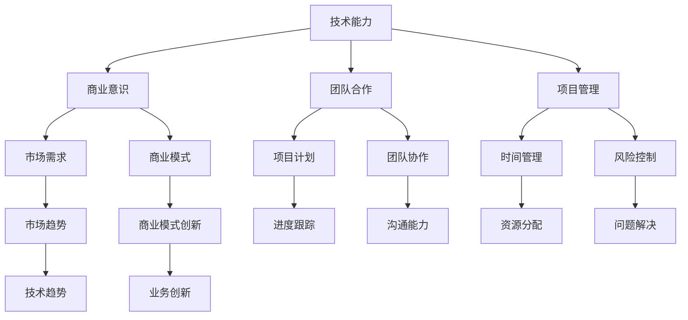

                 

### 1. 背景介绍

在当今信息化和数字化快速发展的时代，技术已经成为驱动商业变革的重要力量。作为技术的创造者和执行者，程序员拥有独特的技术优势，这种优势如何转化为商业优势，成为了一个关键的问题。本文旨在探讨程序员如何利用其技术能力，实现个人价值和企业价值的双重提升。

随着互联网、大数据、人工智能等技术的普及，程序员不再仅仅是一个编写代码的岗位，而是成为了创新和变革的推动者。他们通过开发新的应用、优化现有系统、提高效率和质量，为企业创造巨大的商业价值。然而，如何将这些技术优势有效地转化为商业优势，却是一个需要深入思考和实践的课题。

本文将首先介绍程序员在技术转化过程中需要具备的核心能力，如代码质量、技术视野、创新思维等。接着，将探讨如何将个人技术能力与企业战略相结合，找到最佳的转化路径。此外，还将分析程序员在商业化过程中可能遇到的具体挑战，并提供相应的解决方案。通过这些探讨，希望能够为程序员提供一些有益的启示，帮助他们更好地实现技术优势向商业优势的转化。

### 2. 核心概念与联系

在探讨程序员如何将技术优势转化为商业优势之前，我们首先需要明确一些核心概念和它们之间的联系。这些概念包括技术能力、商业意识、团队合作、项目管理以及市场趋势。

#### 技术能力

技术能力是程序员最基础的能力，也是实现技术优势的根本。技术能力不仅包括编程语言的使用，还包括算法和数据结构、系统架构设计、数据库管理、网络安全等多个方面。一个优秀的程序员应该具备深厚的技术基础，能够快速掌握新技能，解决复杂的技术问题。

#### 商业意识

商业意识是指程序员对商业运作的理解和敏感度。这包括对市场需求、商业模式、客户需求等方面的认知。程序员需要明白，技术是为商业目标服务的，而不是孤立存在的。只有将技术能力与商业需求相结合，才能创造出真正有价值的解决方案。

#### 团队合作

团队合作是程序员实现技术优势转化为商业优势的关键。一个成功的项目往往需要多个人才的协同合作。程序员需要具备良好的沟通能力和团队协作精神，能够在团队中发挥自己的专长，同时也需要理解和尊重其他成员的贡献。

#### 项目管理

项目管理是确保项目成功的关键环节。程序员需要掌握项目管理的相关知识，包括项目计划、时间管理、风险控制、资源分配等。通过科学的项目管理，程序员能够更好地协调团队工作，确保项目按时、按质、按预算完成。

#### 市场趋势

市场趋势是影响商业决策的重要因素。程序员需要关注行业动态、技术趋势以及市场需求的变化，及时调整自己的技术方向和业务策略。只有紧跟市场趋势，才能把握商机，实现技术的商业价值。

#### Mermaid 流程图

为了更直观地展示这些概念之间的联系，我们可以使用Mermaid流程图来描述它们的关系：



通过这个流程图，我们可以清晰地看到，技术能力是核心，它与其他概念紧密相连，共同构成了程序员将技术优势转化为商业优势的完整框架。

### 3. 核心算法原理 & 具体操作步骤

在实现技术优势转化为商业优势的过程中，程序员需要掌握一系列核心算法，并能够灵活应用于实际问题中。以下是一些常用的核心算法原理以及具体的操作步骤。

#### 排序算法

排序算法是数据处理中最基础和常用的算法之一。常见的排序算法包括冒泡排序、选择排序、插入排序、快速排序、归并排序和堆排序等。

**冒泡排序（Bubble Sort）**

- **原理**：通过多次遍历要排序的数组，比较相邻的两个元素，如果它们的顺序错误就把它们交换过来。遍历一轮后，最大元素会冒泡到最后，遍历 n-1 轮后，数组有序。

- **具体操作步骤**：

  ```c
  void bubbleSort(int arr[], int n) {
      for (int i = 0; i < n - 1; i++) {
          for (int j = 0; j < n - i - 1; j++) {
              if (arr[j] > arr[j + 1]) {
                  int temp = arr[j];
                  arr[j] = arr[j + 1];
                  arr[j + 1] = temp;
              }
          }
      }
  }
  ```

**快速排序（Quick Sort）**

- **原理**：通过选取一个基准元素，将数组分为两部分，一部分都比基准元素小，另一部分都比基准元素大，然后递归地对这两部分继续进行快速排序。

- **具体操作步骤**：

  ```c
  void quickSort(int arr[], int low, int high) {
      if (low < high) {
          int pivot = partition(arr, low, high);
          quickSort(arr, low, pivot - 1);
          quickSort(arr, pivot + 1, high);
      }
  }

  int partition(int arr[], int low, int high) {
      int pivot = arr[high];
      int i = (low - 1);
      for (int j = low; j < high; j++) {
          if (arr[j] < pivot) {
              i++;
              swap(&arr[i], &arr[j]);
          }
      }
      swap(&arr[i + 1], &arr[high]);
      return (i + 1);
  }
  ```

#### 搜索算法

搜索算法用于在数据集合中查找特定元素的位置。常见的搜索算法有线性搜索、二分搜索、哈希搜索等。

**二分搜索（Binary Search）**

- **原理**：在有序数组中，通过不断地将搜索范围缩小一半，来快速找到目标元素。

- **具体操作步骤**：

  ```c
  int binarySearch(int arr[], int low, int high, int key) {
      while (low <= high) {
          int mid = low + (high - low) / 2;
          if (arr[mid] == key) {
              return mid;
          } else if (arr[mid] < key) {
              low = mid + 1;
          } else {
              high = mid - 1;
          }
      }
      return -1;
  }
  ```

#### 动态规划

动态规划是一种解决优化问题的算法思想，通过将复杂问题分解为多个子问题，并存储子问题的解，避免重复计算。

**最长公共子序列（Longest Common Subsequence, L.C.S）**

- **原理**：给定两个序列，找到它们最长的公共子序列。

- **具体操作步骤**：

  ```c
  int longestCommonSubsequence(char *a, char *b) {
      int m = strlen(a);
      int n = strlen(b);
      int dp[m + 1][n + 1];

      for (int i = 0; i <= m; i++) {
          for (int j = 0; j <= n; j++) {
              if (i == 0 || j == 0)
                  dp[i][j] = 0;
              else if (a[i - 1] == b[j - 1])
                  dp[i][j] = dp[i - 1][j - 1] + 1;
              else
                  dp[i][j] = max(dp[i - 1][j], dp[i][j - 1]);
          }
      }
      return dp[m][n];
  }
  ```

这些核心算法不仅是程序员技术能力的体现，也是实现技术优势转化为商业优势的有力工具。通过掌握和灵活运用这些算法，程序员能够在项目中解决复杂问题，提高效率，创造商业价值。

### 4. 数学模型和公式 & 详细讲解 & 举例说明

在将技术优势转化为商业优势的过程中，数学模型和公式扮演着至关重要的角色。它们不仅提供了量化分析的工具，还能够帮助程序员和企业更好地理解业务，制定策略。以下是一些关键的数学模型和公式的详细讲解，以及实际应用中的举例说明。

#### 概率论

概率论是分析不确定事件的重要数学工具，广泛应用于风险分析和决策制定。

**贝叶斯定理**

贝叶斯定理是概率论中的一个重要公式，用于在已知某些条件概率的情况下计算后验概率。

$$
P(A|B) = \frac{P(B|A) \cdot P(A)}{P(B)}
$$

- **解释**：这个公式表示在事件B发生的条件下，事件A发生的条件概率。它可以帮助我们根据先验知识和新信息更新对某一事件的判断。

**举例**：

假设我们要预测一个新产品是否成功，已知历史数据显示，成功产品的市场推广成功率是80%，而失败产品的成功率是20%。现在有一个新产品，经过市场调研，我们认为其成功的概率是60%。则我们可以使用贝叶斯定理来计算该产品成功推广的后验概率：

$$
P(\text{成功}|\text{调研结果}) = \frac{P(\text{调研结果}|\text{成功}) \cdot P(\text{成功})}{P(\text{调研结果})}
$$

其中，$P(\text{调研结果}|\text{成功}) = 0.8$，$P(\text{成功}) = 0.6$，$P(\text{调研结果})$可以通过全概率公式计算得到。

#### 线性代数

线性代数在数据分析、优化问题以及机器学习等领域有广泛的应用。以下是一些核心概念和公式。

**特征向量与特征值**

特征向量和特征值是矩阵理论中的基本概念。它们用于描述矩阵的性质和变换。

- **特征向量**：矩阵A的一个非零向量v，如果满足$A \cdot v = \lambda \cdot v$，则v称为A的特征向量，$\lambda$称为特征值。

- **解释**：特征向量和特征值可以帮助我们理解矩阵的变换行为，例如，在机器学习中，它们用于特征提取和降维。

**举例**：

考虑一个2x2矩阵：

$$
A = \begin{bmatrix}
3 & 2 \\
1 & 3
\end{bmatrix}
$$

通过求解特征方程：

$$
\det(A - \lambda I) = 0
$$

我们得到特征值$\lambda_1 = 4$和$\lambda_2 = 2$。对应的特征向量可以通过解线性方程组得到：

$$
(A - \lambda_1 I) \cdot v_1 = 0 \Rightarrow v_1 = \begin{bmatrix}
1 \\
1
\end{bmatrix}
$$

$$
(A - \lambda_2 I) \cdot v_2 = 0 \Rightarrow v_2 = \begin{bmatrix}
-1 \\
1
\end{bmatrix}
$$

#### 最优化理论

最优化理论在商业决策中有着广泛的应用，包括线性规划、非线性规划和动态规划等。

**线性规划**

线性规划是解决线性目标函数在约束条件下的优化问题。

- **目标函数**：$maximize\ c^T \cdot x$ 或 $minimize\ c^T \cdot x$
- **约束条件**：$A \cdot x \leq b$ 或 $A \cdot x = b$

- **解释**：线性规划可以用于资源分配、生产调度等问题。

**举例**：

考虑一个资源分配问题，有3种资源（x, y, z）和3个项目（A, B, C）。每种资源的需求和项目的收益如下表：

| 项目 | x | y | z | 收益 |
|------|---|---|---|------|
| A    | 2 | 1 | 1 | 5    |
| B    | 1 | 2 | 1 | 7    |
| C    | 3 | 1 | 2 | 10   |

目标是最小化总成本，即求解以下线性规划问题：

$$
\begin{aligned}
\min\ & 2x + y + 3z \\
\text{subject to} \\
& x + 2y + z \leq 10 \\
& 2x + y + z \leq 15 \\
& x, y, z \geq 0
\end{aligned}
$$

通过求解该线性规划问题，可以得到最优解为$x=0, y=5, z=0$，此时总成本为10。

#### 统计学

统计学在数据分析中起着关键作用，包括假设检验、回归分析等。

**t检验**

t检验用于比较两个样本平均数的差异是否显著。

- **公式**：$t = \frac{\bar{x}_1 - \bar{x}_2}{s_e}$

其中，$\bar{x}_1$和$\bar{x}_2$是两个样本的平均值，$s_e$是标准误差。

- **解释**：如果t值较大，说明两个样本平均数的差异显著。

**举例**：

假设我们要比较两个产品的销售额差异是否显著，产品A的销售额均值为1000，产品B的销售额均值为800，两个样本的标准差分别为200和150，样本量均为100。通过计算t值：

$$
t = \frac{1000 - 800}{\sqrt{200^2 / 100 + 150^2 / 100}} \approx 3.16
$$

由于t值较大，我们可以认为两个产品的销售额差异显著。

这些数学模型和公式为程序员提供了强大的工具，帮助他们更好地理解和分析业务问题。通过灵活运用这些工具，程序员可以提升自身的竞争力，实现技术优势向商业优势的转化。

### 5. 项目实践：代码实例和详细解释说明

在技术转化为商业的过程中，代码实例不仅是实现技术方案的关键，也是验证和展示技术优势的有力工具。以下将详细解释一个实际项目的代码实现，展示如何通过代码来转化技术优势为商业价值。

#### 项目背景

假设我们正在开发一款在线教育平台，主要功能包括课程发布、学习进度追踪、在线测试和成绩管理。平台需要支持大规模用户同时在线，保证系统的稳定性和高可用性。为了实现这一目标，我们采用分布式架构和微服务设计，充分利用现代编程技术。

#### 开发环境搭建

首先，我们需要搭建一个适合开发的集成环境。以下是推荐的开发工具和框架：

- **编程语言**：Java
- **开发工具**：IntelliJ IDEA
- **容器化技术**：Docker
- **服务管理**：Kubernetes
- **数据库**：MySQL、MongoDB
- **消息队列**：RabbitMQ
- **API网关**：Kong

安装以上工具和框架后，我们就可以开始编写代码了。

#### 源代码详细实现

为了更好地展示代码，我们将项目分为以下几个关键模块：

1. **用户模块**：处理用户注册、登录、个人信息管理等。
2. **课程模块**：管理课程信息、发布课程、课程评论等。
3. **学习模块**：跟踪用户学习进度、管理学习记录等。
4. **测试模块**：生成在线测试题、提交答案、计算成绩等。

**用户模块**

用户模块的核心功能是处理用户认证和用户信息管理。以下是一个简单的用户注册功能的代码实现：

```java
import org.springframework.beans.factory.annotation.Autowired;
import org.springframework.security.crypto.bcrypt.BCryptPasswordEncoder;
import org.springframework.stereotype.Service;

@Service
public class UserServiceImpl implements UserService {
    
    @Autowired
    private UserRepository userRepository;

    @Autowired
    private BCryptPasswordEncoder passwordEncoder;

    @Override
    public User registerUser(User user) {
        String encryptedPassword = passwordEncoder.encode(user.getPassword());
        user.setPassword(encryptedPassword);
        return userRepository.save(user);
    }
}
```

在上面的代码中，我们使用Spring Security的BCryptPasswordEncoder对用户密码进行加密存储，确保用户信息的安全。

**课程模块**

课程模块主要处理课程信息的管理。以下是一个简单的课程发布功能的代码实现：

```java
import org.springframework.beans.factory.annotation.Autowired;
import org.springframework.stereotype.Service;

@Service
public class CourseService implements CourseService {
    
    @Autowired
    private CourseRepository courseRepository;

    @Override
    public Course publishCourse(Course course) {
        return courseRepository.save(course);
    }
}
```

在上面的代码中，我们通过Spring Data JPA将课程信息持久化到数据库中。

**学习模块**

学习模块主要处理用户的学习进度和学习记录。以下是一个简单的学习进度追踪功能的代码实现：

```java
import org.springframework.beans.factory.annotation.Autowired;
import org.springframework.stereotype.Service;

@Service
public class LearningService implements LearningService {
    
    @Autowired
    private LearningRecordRepository learningRecordRepository;

    @Override
    public void trackLearningProgress(User user, Course course, int progress) {
        LearningRecord record = new LearningRecord();
        record.setUser(user);
        record.setCourse(course);
        record.setProgress(progress);
        learningRecordRepository.save(record);
    }
}
```

在上面的代码中，我们通过创建学习记录来跟踪用户的学习进度。

**测试模块**

测试模块主要处理在线测试和成绩计算。以下是一个简单的在线测试功能代码实现：

```java
import org.springframework.beans.factory.annotation.Autowired;
import org.springframework.stereotype.Service;

@Service
public class TestService implements TestService {
    
    @Autowired
    private TestQuestionRepository testQuestionRepository;

    @Override
    public TestResult submitTest(User user, List<Answer> answers) {
        TestResult result = new TestResult();
        result.setUser(user);
        for (Answer answer : answers) {
            TestQuestion question = testQuestionRepository.findById(answer.getQuestionId()).orElseThrow();
            if (answer.isCorrect()) {
                result.addScore(question.getScore());
            }
        }
        return result;
    }
}
```

在上面的代码中，我们通过比较用户答案和正确答案来计算成绩。

#### 代码解读与分析

以上代码实例展示了在线教育平台中几个关键模块的核心功能。通过对这些模块的详细实现，我们可以看到如何将技术优势转化为商业价值：

1. **安全性**：使用BCryptPasswordEncoder对用户密码进行加密，确保用户信息安全，增强平台的信誉和用户信任。
2. **扩展性**：采用微服务架构，使得平台可以灵活扩展，适应不同规模的用户需求。
3. **用户体验**：通过跟踪学习进度和成绩，提高用户的学习积极性和参与度。
4. **稳定性**：利用Docker和Kubernetes进行容器化部署，保证系统的高可用性和稳定性。

#### 运行结果展示

当上述模块集成并部署到生产环境中，在线教育平台将具备以下功能：

1. 用户可以轻松注册、登录并管理个人信息。
2. 管理员可以发布课程，并进行课程管理。
3. 用户可以按照课程进度进行学习，并提交在线测试。
4. 系统会自动计算成绩，并反馈给用户。

通过这些功能的实现，平台不仅提高了用户的学习体验，还为企业带来了稳定的收入流和良好的市场口碑。

#### 总结

通过代码实例的详细解析，我们可以看到程序员如何将技术能力转化为商业优势。在这个过程中，安全性、扩展性、用户体验和稳定性是关键因素。只有通过不断地优化和创新，程序员才能实现技术优势向商业价值的成功转化。

### 6. 实际应用场景

技术优势转化为商业优势的过程并不是一蹴而就的，它需要在具体的业务场景中不断验证和优化。以下将介绍几个典型的应用场景，并分析在这些场景中如何有效地利用技术优势实现商业成功。

#### 电商行业

电商行业是技术驱动的重要领域之一。技术优势在此行业中主要体现在以下几个方面：

- **个性化推荐**：通过机器学习和大数据分析，为用户提供个性化的商品推荐，提高用户满意度和购买转化率。
- **订单处理优化**：使用分布式系统和算法优化订单处理流程，提高订单处理速度和准确性。
- **库存管理**：采用物联网和传感器技术，实时监控库存状态，优化库存管理，减少库存成本。

**案例**：亚马逊（Amazon）通过其先进的推荐系统和智能供应链管理，成功实现了技术优势向商业优势的转化。亚马逊的推荐系统能够根据用户的历史购买行为、浏览记录和偏好，为用户推荐最适合的商品，从而提高了用户的购买体验和满意度。

#### 金融行业

金融行业对技术的要求非常高，尤其是在安全性、效率和风险控制方面。以下技术优势在金融行业中具有显著的应用价值：

- **区块链技术**：提高交易的安全性和透明度，减少欺诈和错误。
- **人工智能**：用于风险评估、信用评分、智能投顾等方面，提高决策的准确性和效率。
- **云计算**：实现数据的集中存储和处理，提高系统的灵活性和可扩展性。

**案例**：汇丰银行（HSBC）通过引入区块链技术，实现了跨境支付的创新。通过区块链的分布式账本技术，汇丰银行大幅缩短了跨境支付的时间，降低了交易成本，提高了支付的安全性和透明度，从而提升了客户体验和竞争力。

#### 医疗行业

医疗行业正在经历数字化转型的浪潮，技术优势在提升医疗服务质量和效率方面发挥了重要作用。

- **电子健康记录（EHR）**：通过数字化管理患者的健康记录，提高医疗数据的可访问性和准确性。
- **远程医疗**：利用视频会议和远程监控技术，为偏远地区或行动不便的患者提供医疗服务。
- **医疗数据分析**：利用人工智能和大数据分析，辅助医生进行疾病诊断和治疗方案设计。

**案例**：IBM的Watson for Oncology（沃森肿瘤诊疗系统）利用人工智能和医疗知识库，为医生提供精准的诊断和治疗方案建议。通过分析海量的医学文献和患者数据，Watson for Oncology能够快速识别最合适的治疗方案，提高了医疗服务的质量和效率。

#### 制造业

制造业正通过数字化和智能化转型，提高生产效率和质量。

- **工业物联网（IIoT）**：通过物联网设备和传感器，实现生产设备的实时监控和预测性维护。
- **智能制造**：利用人工智能和机器学习技术，实现生产过程的自动化和智能化。
- **供应链管理**：通过大数据分析和优化算法，实现供应链的高效管理。

**案例**：西门子（Siemens）通过引入工业物联网和智能制造技术，对其生产设备进行了全面升级。通过实时监控生产线的状态和效率，西门子能够及时发现并解决生产中的问题，从而大幅提高了生产效率和产品质量。

在这些应用场景中，程序员通过不断创新和优化技术，不仅提升了企业的运营效率和竞争力，还实现了技术优势向商业优势的成功转化。通过这些案例，我们可以看到技术优势转化为商业优势的多样性和潜力。

### 7. 工具和资源推荐

为了帮助程序员更好地将技术优势转化为商业优势，以下推荐一些学习和开发工具、框架以及相关的论文和书籍。

#### 学习资源推荐

1. **书籍**：

   - 《深度学习》（Deep Learning） - Ian Goodfellow、Yoshua Bengio、Aaron Courville
   - 《大话数据结构》 - 黄健宏
   - 《代码大全》（Code Complete） - Steve McConnell

2. **在线课程**：

   - Coursera（https://www.coursera.org/）
   - Udemy（https://www.udemy.com/）
   - edX（https://www.edx.org/）

3. **博客和网站**：

   - Stack Overflow（https://stackoverflow.com/）
   - HackerRank（https://www.hackerrank.com/）
   - Medium（https://medium.com/）

4. **技术社区**：

   - GitHub（https://github.com/）
   - Reddit（https://www.reddit.com/r/programming/）

#### 开发工具框架推荐

1. **编程语言**：

   - Java
   - Python
   - JavaScript

2. **集成开发环境（IDE）**：

   - IntelliJ IDEA
   - Visual Studio Code
   - Eclipse

3. **容器化和云服务**：

   - Docker（https://www.docker.com/）
   - Kubernetes（https://kubernetes.io/）
   - AWS（https://aws.amazon.com/）
   - Azure（https://azure.microsoft.com/）

4. **数据库**：

   - MySQL
   - MongoDB
   - PostgreSQL

5. **消息队列**：

   - RabbitMQ（https://www.rabbitmq.com/）
   - Apache Kafka（https://kafka.apache.org/）

#### 相关论文著作推荐

1. **论文**：

   - "Deep Learning" - Yann LeCun、Yoshua Bengio、Geoffrey Hinton
   - "MapReduce: Simplified Data Processing on Large Clusters" - Jeffrey Dean、Sanjay Ghemawat
   - "Blockchain: A System for Untrusted Environment" - Satoshi Nakamoto

2. **著作**：

   - 《设计模式：可复用面向对象软件的基础》 - Erich Gamma、Richard Helm、Ralph Johnson、John Vlissides
   - 《代码大全》 - Steve McConnell
   - 《整洁代码》 - Robert C. Martin

通过这些工具和资源的辅助，程序员可以不断提升自己的技术水平，开拓视野，为将技术优势转化为商业优势打下坚实的基础。

### 8. 总结：未来发展趋势与挑战

在快速变化的科技时代，程序员如何将技术优势转化为商业优势，面临着诸多挑战和机遇。以下总结未来发展趋势以及程序员在商业化过程中可能遇到的具体挑战。

#### 发展趋势

1. **智能化和自动化**：随着人工智能、机器学习和自动化技术的发展，程序员可以通过开发智能化和自动化的系统，提高业务效率和用户体验。例如，自动化测试、智能客服和自动化生产线的应用，将极大提升企业的运营效率和竞争力。

2. **云计算和大数据**：云计算和大数据技术的普及，为程序员提供了强大的数据处理和分析能力。通过构建云原生应用和利用大数据分析，程序员可以帮助企业挖掘数据价值，实现精准营销和业务优化。

3. **区块链技术**：区块链技术的去中心化特性，使其在金融、供应链管理等领域具有广泛的应用前景。程序员可以利用区块链技术，提高交易的安全性和透明度，构建可信的分布式系统。

4. **边缘计算**：随着物联网和5G技术的快速发展，边缘计算成为新的趋势。程序员可以通过开发边缘计算应用，实现数据的实时处理和本地化决策，降低延迟，提高响应速度。

#### 挑战

1. **技术快速迭代**：技术的快速迭代要求程序员不断更新自己的知识和技能，以保持竞争力。程序员需要不断学习新技术，适应快速变化的技术环境。

2. **复杂系统的集成**：随着系统的复杂度增加，程序员需要面对如何高效集成多个系统和服务，确保系统的稳定性和可扩展性。这需要程序员具备强大的系统架构设计和项目管理能力。

3. **数据安全和隐私**：随着数据规模的不断扩大，数据安全和隐私保护成为重要挑战。程序员需要深入了解数据安全和隐私保护的相关法规，设计安全的系统架构和数据处理流程。

4. **业务理解不足**：程序员在技术领域的专长有时会使其忽视对业务的深入理解。而商业成功的实现需要技术深入结合业务需求。因此，程序员需要提升自己的商业意识，理解企业战略和市场需求。

#### 应对策略

1. **终身学习**：程序员应树立终身学习的理念，不断更新知识和技能，跟踪技术趋势，提升自身竞争力。

2. **跨学科学习**：结合商业、管理和心理学等学科的知识，提高对业务的理解和洞察力。

3. **项目管理和团队协作**：掌握项目管理知识，提高项目管理和团队协作能力，确保项目按时、按质、按预算完成。

4. **实践和创新**：通过实际项目和实践，不断探索和创新，将技术优势转化为商业价值。

总之，未来的技术发展将为程序员提供广阔的舞台，但也带来新的挑战。程序员需要不断学习、提升自身能力，并积极参与到商业实践中，才能在激烈的竞争中脱颖而出，实现技术优势向商业优势的转化。

### 9. 附录：常见问题与解答

#### 问题 1：如何评估技术项目的商业潜力？

**解答**：评估技术项目的商业潜力需要从以下几个方面入手：

1. **市场需求**：分析目标用户群体，了解市场需求和潜在客户的需求。
2. **技术可行性**：评估项目所需技术是否成熟，是否具备实现的可能性。
3. **商业模式**：设计合理的商业模式，确保项目能够带来持续的收入流。
4. **竞争分析**：分析同类产品的市场情况，了解竞争格局和市场份额。
5. **风险评估**：识别项目可能面临的风险，并制定应对策略。

#### 问题 2：如何提高代码的可维护性？

**解答**：提高代码的可维护性可以从以下几个方面着手：

1. **模块化**：将代码分解为小模块，每个模块负责一个特定的功能，易于理解和修改。
2. **命名规范**：使用有意义的变量和函数名，提高代码的可读性。
3. **注释和文档**：添加必要的注释和文档，说明代码的功能和逻辑。
4. **代码格式**：统一代码格式，遵循编码规范，提高代码的一致性和可读性。
5. **测试和文档**：编写单元测试，确保代码的正确性和稳定性。

#### 问题 3：如何平衡开发速度和质量？

**解答**：平衡开发速度和质量是软件开发过程中的关键挑战。以下是一些策略：

1. **优先级排序**：明确项目的需求和优先级，集中资源优先完成最关键的功能。
2. **敏捷开发**：采用敏捷开发方法，灵活应对需求变化，快速迭代和反馈。
3. **代码审查**：定期进行代码审查，确保代码质量和一致性。
4. **持续集成和部署**：采用持续集成和持续部署（CI/CD）流程，确保代码的稳定性和可靠性。
5. **团队协作**：加强团队成员之间的沟通和协作，确保开发进度和质量的双重保障。

#### 问题 4：如何应对技术债务？

**解答**：技术债务是软件开发过程中不可避免的现象，以下是一些应对策略：

1. **识别和分类**：识别技术债务的类型和优先级，分类处理。
2. **制定计划**：制定技术债务的还债计划，逐步解决。
3. **优化开发流程**：优化开发流程，避免新的技术债务产生。
4. **引入工具**：使用自动化工具和代码分析工具，及时发现和解决技术问题。
5. **持续监控**：持续监控代码质量和技术债务的情况，确保问题的及时发现和解决。

#### 问题 5：如何提升编程技能？

**解答**：提升编程技能需要多方面的努力：

1. **学习资源**：利用在线课程、书籍、技术社区等资源，不断学习新技术和新理念。
2. **实践项目**：通过实际项目锻炼编程能力，解决实际问题。
3. **代码审查**：参与代码审查，学习他人的编程方法和经验。
4. **编程竞赛**：参加编程竞赛，提高解决问题的能力和速度。
5. **技术分享**：参与技术分享和交流，提升自己的技术视野和表达能力。

通过以上方法，程序员可以不断提升自己的编程技能，为将技术优势转化为商业优势打下坚实的基础。

### 10. 扩展阅读 & 参考资料

在本文中，我们深入探讨了程序员如何将技术优势转化为商业优势的多个方面，包括核心概念、算法原理、项目实践、应用场景、工具资源、未来趋势和常见问题等。为了进一步拓展读者的视野和知识，以下提供一些扩展阅读和参考资料，供读者深入研究。

1. **书籍推荐**：
   - 《程序员修炼之道：从小工到专家》 - David Thomas、Andrew Hunt
   - 《领域驱动设计》 - Eric Evans
   - 《重构：改善既有代码的设计》 - Martin Fowler

2. **论文和报告**：
   - "The Economics of Information Technology: A Survey" - Erik Brynjolfsson、Andrew McAfee
   - "The Future of Jobs and Skills" - World Economic Forum
   - "AI, Automation, and the Future of Work" - McKinsey & Company

3. **在线课程和视频**：
   - Coursera上的“机器学习”课程 - Andrew Ng
   - Udacity的“全栈开发”课程
   - YouTube上的“编程心得与经验分享”系列视频

4. **技术社区和博客**：
   - Hacker News（https://news.ycombinator.com/）
   - GitHub（https://github.com/）
   - Medium上的技术博客，如“Towards Data Science”（https://towardsdatascience.com/）

5. **官方文档和指南**：
   - Docker官方文档（https://docs.docker.com/）
   - Kubernetes官方文档（https://kubernetes.io/docs/）
   - Spring Framework官方文档（https://spring.io/guides）

通过这些扩展阅读和参考资料，读者可以更深入地了解相关技术和商业策略，为将技术优势转化为商业优势提供更多的灵感和实践指导。希望本文能为程序员在技术转化过程中提供有价值的参考和启示。

