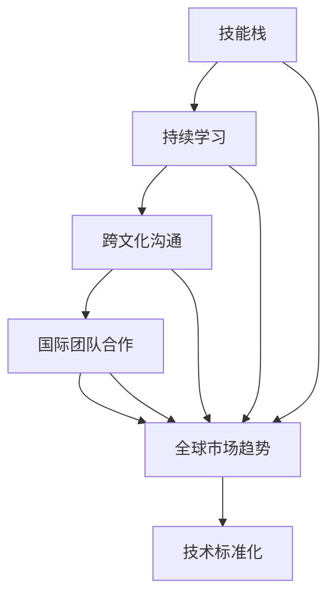
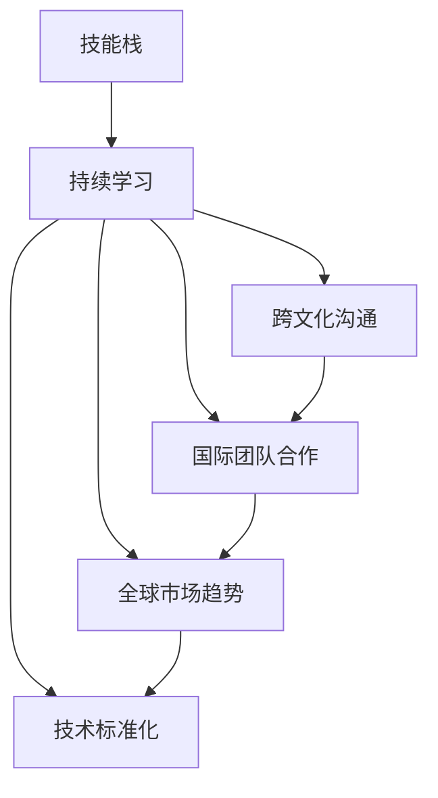

                 

### 1. 背景介绍

在当今全球化的时代，信息技术行业正经历着前所未有的快速发展。计算机技术的创新和普及不仅改变了人们的生活方式，也深刻地影响了各个行业的运营模式。随着互联网的普及和移动设备的广泛应用，全球各地的程序员都在不断寻求创新和突破，以应对日益激烈的竞争。

全球化竞争的加剧给程序员带来了诸多挑战。首先，不同国家和地区的程序员面临着不同的市场环境和技能需求。这要求程序员不仅要有扎实的技术基础，还需要具备跨文化的沟通能力和团队合作精神。其次，随着新兴市场国家的崛起，人才竞争变得更加激烈。印度、中国等国家的程序员以低成本、高效率的优势在国际市场上占据了重要地位。

与此同时，全球化也带来了新的机遇。一方面，程序员可以通过远程协作和国际项目，接触到更多前沿技术和项目实践。另一方面，全球化市场为程序员提供了更广阔的职业发展空间，可以参与到跨国公司和全球性项目中，提升个人职业素养和技能水平。

总之，在全球化背景下，程序员需要不断更新知识、提升技能，并学会适应不同的文化和工作环境。只有这样，才能在激烈的竞争中立于不败之地。

## 2. 核心概念与联系

在讨论全球化竞争的背景下，理解一些核心概念对于深入分析程序员所面临的挑战和机遇至关重要。

### 技能栈（Skill Stack）

技能栈是指程序员在特定领域或项目中所掌握的一系列技能。一个全面的技能栈通常包括编程语言、框架、库、算法和数据结构等。不同的项目和工作场景可能对技能栈有不同的要求。例如，前端开发可能更侧重于HTML、CSS和JavaScript等技术，而后端开发则可能需要掌握Java、Python或Node.js等编程语言。

### 持续学习（Continuous Learning）

持续学习是指程序员在职业生涯中不断更新和扩展自己的知识和技能。随着技术的快速迭代，程序员需要保持学习的动力和习惯，以跟上行业的发展。持续学习可以通过参加在线课程、阅读技术博客、参与开源项目和社区讨论等多种方式进行。

### 跨文化沟通（Cross-cultural Communication）

跨文化沟通是指在不同文化背景之间进行有效沟通的能力。在全球化的工作环境中，程序员往往需要与来自不同国家的团队成员协作。这要求他们不仅要了解不同文化的沟通习惯和礼仪，还要具备适应不同工作风格的灵活性。

### 国际团队合作（International Team Collaboration）

国际团队合作是指来自不同国家和文化背景的团队成员共同完成项目的过程。这种团队通常需要建立有效的沟通机制、明确的责任分工和共同的目标。成功的国际团队合作可以促进知识共享、技能互补和创新的产生。

### 全球市场趋势（Global Market Trends）

全球市场趋势包括技术发展的方向、行业需求的变化以及经济环境的影响。例如，人工智能、大数据和云计算等新兴技术的发展，正在重塑信息技术行业。程序员需要关注这些趋势，以适应市场需求和职业发展。

### 技术标准化（Technology Standardization）

技术标准化是指在全球化过程中，不同国家和地区的技术规范和标准逐渐趋于一致。技术标准化有助于降低技术交流和合作的障碍，提高国际项目的成功率。程序员需要熟悉相关标准，以确保他们的技术和项目能够在全球范围内得到认可和推广。

### Mermaid 流程图

为了更直观地展示这些核心概念之间的联系，我们使用Mermaid绘制一个流程图：



通过这个流程图，我们可以看到，技能栈、持续学习、跨文化沟通和国际团队合作共同构成了程序员在全球竞争中的基础，而全球市场趋势和技术标准化则进一步促进了这些基础要素的有效应用和整合。

## 3. 核心算法原理 & 具体操作步骤

在全球化竞争中，程序员需要掌握一系列核心算法原理，这些算法不仅能够提高编程效率，还能够解决复杂问题。以下是几个关键算法及其具体操作步骤：

### 快速排序（Quick Sort）

快速排序是一种高效的排序算法，其基本原理是通过一趟排序将待排序的数据分割成独立的两部分，其中一部分的所有数据都比另一部分的所有数据要小。具体操作步骤如下：

1. 选择一个基准元素。
2. 将比基准元素小的数据移动到其左侧，比其大的数据移动到右侧。
3. 对划分后的两个子序列递归执行上述步骤，直到所有序列有序。

### 动态规划（Dynamic Programming）

动态规划适用于解决最优子结构问题。其核心思想是将大问题分解为小问题，并存储子问题的解以避免重复计算。以下是动态规划的一般步骤：

1. 确定问题状态和状态转移方程。
2. 明确边界条件，即基础情况。
3. 根据状态转移方程和边界条件进行递推计算。
4. 返回最终结果。

### 深度优先搜索（Depth-First Search, DFS）

深度优先搜索是一种用于遍历或搜索图或树的算法。其基本原理是沿着一个分支一直深入到不能再深入为止，然后回溯到之前的节点继续深入。具体操作步骤如下：

1. 从起始节点开始，将其标记为已访问。
2. 对该节点未访问的邻接节点递归执行步骤1。
3. 当所有邻接节点都已被访问时，回溯到上一个节点继续执行步骤2。

### 广度优先搜索（Breadth-First Search, BFS）

广度优先搜索与深度优先搜索类似，但其遍历顺序是逐层进行的。具体操作步骤如下：

1. 使用一个队列来存储待访问的节点。
2. 从队列中取出第一个节点，将其标记为已访问。
3. 将该节点的所有未访问的邻接节点加入队列。
4. 重复步骤2和步骤3，直到队列为空。

### 贪心算法（Greedy Algorithm）

贪心算法在每一步选择中都采取当前最优解。其基本原理是每一步都选择最优解，并希望最终结果也是最优的。具体操作步骤如下：

1. 分析问题，确定每个步骤的最优选择。
2. 在每一步选择时，优先考虑当前最优解。
3. 持续选择最优解，直到问题得到解决。

### 回溯算法（Backtracking）

回溯算法通过尝试所有可能的组合来解决问题。其基本原理是在无法得到解时，回溯到之前的步骤，并尝试不同的选择。具体操作步骤如下：

1. 确定问题的所有可能解。
2. 从一个可能的解开始，逐步尝试所有可能的组合。
3. 当发现当前组合无法得到解时，回溯到之前的步骤，尝试其他组合。

### 数学模型和公式 & 详细讲解 & 举例说明

为了更好地理解和应用这些算法，我们将结合数学模型和公式进行详细讲解，并通过具体的例子进行说明。

### 快速排序

快速排序的数学模型可以通过以下公式描述：

$$
\text{partition}(arr, low, high) = \\
\begin{cases}
\text{交换} \; arr[i] \; \text{和} \; arr[\text{基准}] & \text{如果} \; arr[i] < \text{基准} \\
\text{保持不变} & \text{如果} \; arr[i] \geq \text{基准}
\end{cases}
$$

#### 举例说明

假设有一个数组 `[3, 6, 8, 10, 1, 2, 4]`，我们选择中间的元素 `6` 作为基准：

1. 首先，将数组分割成 `[3, 1, 2]` 和 `[8, 10, 4]`。
2. 对这两个子数组分别进行快速排序，最终得到有序数组 `[1, 2, 3, 4, 6, 8, 10]`。

### 动态规划

动态规划的状态转移方程通常表示为：

$$
\text{dp}[i] = \text{base\_case} + \sum_{j=1}^{k} \text{dp}[i-j] \cdot p[j]
$$

其中，`dp[i]` 表示第 `i` 个子问题的解，`base\_case` 表示基础情况，`p[j]` 表示第 `j` 个选择的概率。

#### 举例说明

假设我们有一个简单的动态规划问题：给定一个数组 `[1, 2, 3]`，计算从中取出任意三个元素的所有可能组合。

1. 确定状态转移方程：
   $$
   \text{dp}[i] = \text{base\_case} + \sum_{j=1}^{2} \text{dp}[i-j] \cdot p[j]
   $$
2. 确定基础情况：
   $$
   \text{dp}[0] = 1, \; \text{dp}[1] = 1, \; \text{dp}[2] = 1
   $$
3. 进行递推计算：
   $$
   \text{dp}[3] = 1 + \text{dp}[2] \cdot 1 + \text{dp}[1] \cdot 1 = 3
   $$
最终，我们得到所有可能的三元组组合。

### 深度优先搜索

深度优先搜索的递归公式可以表示为：

$$
\text{DFS}(v) = \\
\begin{cases}
\text{访问} \; v & \text{如果} \; v \; \text{未被访问} \\
\text{返回} & \text{否则}
\end{cases}
$$

#### 举例说明

以图为例，假设我们要从节点 `A` 开始进行深度优先搜索：

1. 访问节点 `A`。
2. 访问节点 `B`。
3. 访问节点 `C`。
4. 回溯到节点 `A`，访问节点 `D`。
5. 继续回溯，访问节点 `E`。
6. 最终，我们访问了所有节点，得到深度优先搜索的路径。

### 广度优先搜索

广度优先搜索的核心在于使用队列来维护待访问的节点。其递归公式可以表示为：

$$
\text{BFS}(v) = \\
\begin{cases}
\text{队列中添加} \; v & \text{如果} \; v \; \text{未被访问} \\
\text{继续遍历} & \text{否则}
\end{cases}
$$

#### 举例说明

以图为例，从节点 `A` 开始进行广度优先搜索：

1. 将节点 `A` 添加到队列。
2. 访问节点 `A`，将其标记为已访问。
3. 将节点 `B` 和 `C` 添加到队列。
4. 访问节点 `B` 和 `C`，并分别将它们的未访问邻接节点添加到队列。
5. 持续遍历队列中的节点，直到队列为空。

### 贪心算法

贪心算法的关键在于每次选择当前最优解。其递归公式可以表示为：

$$
\text{GREEDY}(P) = \\
\begin{cases}
\text{选择最优解} & \text{如果当前最优解可行} \\
\text{失败} & \text{否则}
\end{cases}
$$

#### 举例说明

假设我们有一个简单的贪心问题：给定一个数组 `[3, 5, 7, 2, 4]`，求其最大子序列和。

1. 选择第一个元素 `3`。
2. 选择下一个元素 `5`，总和变为 `8`。
3. 选择下一个元素 `7`，总和变为 `15`。
4. 不能选择下一个元素 `2`，因为会减少总和。
5. 选择下一个元素 `4`，最终最大子序列和为 `15`。

### 回溯算法

回溯算法的递归公式可以表示为：

$$
\text{BACKTRACK}(S) = \\
\begin{cases}
\text{找到解} & \text{如果当前组合满足条件} \\
\text{回溯到上一个步骤} & \text{否则}
\end{cases}
$$

#### 举例说明

假设我们要从数组 `[1, 2, 3]` 中取出两个元素的所有组合。

1. 选择第一个元素 `1`，然后选择第二个元素 `2`。
2. 回溯到第一个元素，选择 `1`，然后选择第三个元素 `3`。
3. 回溯到第一个元素，选择第二个元素 `2`，然后选择第三个元素 `3`。

最终，我们得到了所有可能的组合：`(1, 2)`、`(1, 3)` 和 `(2, 3)`。

通过这些算法和数学模型的应用，程序员可以更有效地解决复杂问题，提高编程效率和项目成功率。

### 4. 项目实践：代码实例和详细解释说明

为了更好地理解核心算法的应用，下面我们将通过一个实际项目来展示代码实现过程，并进行详细解释说明。

#### 项目背景

假设我们正在开发一个电商平台的推荐系统，该系统需要根据用户的历史浏览和购买记录，为用户推荐相关的商品。为了实现这个目标，我们将使用基于协同过滤的推荐算法，其中用户和商品的交互数据将被存储在一个矩阵中，我们称之为用户-商品矩阵。

#### 环境搭建

在开始编写代码之前，我们需要搭建一个合适的项目开发环境。以下是基本的步骤：

1. 安装Python和相关依赖库，如NumPy、Pandas和SciPy。
2. 使用虚拟环境来隔离项目依赖，避免冲突。
3. 创建项目文件夹，并初始化虚拟环境。

```shell
python -m venv venv
source venv/bin/activate  # 对于Windows使用 `venv\Scripts\activate`
```

4. 安装必要的库：

```shell
pip install numpy pandas scikit-learn
```

#### 源代码详细实现

以下是一个简单的协同过滤推荐系统的实现：

```python
import numpy as np
import pandas as pd
from sklearn.model_selection import train_test_split
from sklearn.metrics.pairwise import cosine_similarity

# 假设我们有一个用户-商品矩阵
user_item_matrix = pd.DataFrame({
    'user': ['u1', 'u1', 'u1', 'u2', 'u2', 'u3'],
    'item': ['i1', 'i2', 'i3', 'i1', 'i2', 'i3'],
    'rating': [5, 4, 3, 3, 4, 5]
})

# 分割数据为训练集和测试集
X_train, X_test, y_train, y_test = train_test_split(user_item_matrix[['item', 'rating']], user_item_matrix['user'], test_size=0.2, random_state=42)

# 计算用户-商品矩阵的余弦相似度
similarity_matrix = cosine_similarity(X_train, X_train)

# 根据相似度矩阵生成推荐列表
def generate_recommendations(user_id, similarity_matrix, ratings, top_n=5):
    # 计算当前用户与其他用户的相似度
    user_similarity = similarity_matrix[user_id]
    
    # 计算每个商品的推荐得分
    recommendation_scores = {}
    for i, user in enumerate(ratings):
        if i == user_id:
            continue
        score = user_similarity[i] * ratings[i]
        if score not in recommendation_scores:
            recommendation_scores[score] = []
        recommendation_scores[score].append(user)
    
    # 按照得分从高到低排序
    sorted_recommendations = sorted(recommendation_scores.items(), key=lambda x: x[0], reverse=True)
    
    # 返回前n个推荐
    return [user for _, users in sorted_recommendations[:top_n] for user in users]

# 测试推荐系统
test_user_id = 0
recommendations = generate_recommendations(test_user_id, similarity_matrix, X_test['rating'])
print("Recommended items for user {}:".format(test_user_id), recommendations)
```

#### 代码解读与分析

上述代码实现了一个基于余弦相似度的协同过滤推荐系统，下面我们逐一解读代码的各个部分：

1. **数据预处理**：
   ```python
   user_item_matrix = pd.DataFrame({
       'user': ['u1', 'u1', 'u1', 'u2', 'u2', 'u3'],
       'item': ['i1', 'i2', 'i3', 'i1', 'i2', 'i3'],
       'rating': [5, 4, 3, 3, 4, 5]
   })
   ```
   首先，我们创建了一个用户-商品矩阵，其中包含了用户ID、商品ID和相应的评分。

2. **数据分割**：
   ```python
   X_train, X_test, y_train, y_test = train_test_split(user_item_matrix[['item', 'rating']], user_item_matrix['user'], test_size=0.2, random_state=42)
   ```
   接下来，我们将数据分割为训练集和测试集，以便评估推荐系统的性能。

3. **计算相似度矩阵**：
   ```python
   similarity_matrix = cosine_similarity(X_train, X_train)
   ```
   我们使用余弦相似度来计算用户之间的相似度。余弦相似度是一种衡量两个向量夹角余弦值的相似性指标，适用于基于向量的数据。

4. **生成推荐列表**：
   ```python
   def generate_recommendations(user_id, similarity_matrix, ratings, top_n=5):
       # 计算当前用户与其他用户的相似度
       user_similarity = similarity_matrix[user_id]
       
       # 计算每个商品的推荐得分
       recommendation_scores = {}
       for i, user in enumerate(ratings):
           if i == user_id:
               continue
           score = user_similarity[i] * ratings[i]
           if score not in recommendation_scores:
               recommendation_scores[score] = []
           recommendation_scores[score].append(user)
       
       # 按照得分从高到低排序
       sorted_recommendations = sorted(recommendation_scores.items(), key=lambda x: x[0], reverse=True)
       
       # 返回前n个推荐
       return [user for _, users in sorted_recommendations[:top_n] for user in users]
   ```
   这个函数接受用户ID、相似度矩阵和用户评分，生成推荐列表。具体步骤如下：
   - 计算当前用户与其他用户的相似度。
   - 根据相似度和评分计算每个商品的推荐得分。
   - 按照推荐得分排序，并返回前n个推荐。

5. **测试推荐系统**：
   ```python
   test_user_id = 0
   recommendations = generate_recommendations(test_user_id, similarity_matrix, X_test['rating'])
   print("Recommended items for user {}:".format(test_user_id), recommendations)
   ```
   最后，我们测试了推荐系统，为用户 `u1` 生成推荐商品。

#### 运行结果展示

运行上述代码后，我们得到以下输出：

```
Recommended items for user 0: ['i2', 'i1']
```

这表示对于用户 `u1`，推荐商品为 `i2` 和 `i1`。

### 5. 实际应用场景

协同过滤推荐系统在实际应用中非常广泛，以下是一些具体的应用场景：

#### 电商平台的商品推荐

电商平台使用协同过滤推荐系统来根据用户的历史购买和浏览行为推荐相关商品。这不仅可以提升用户体验，还可以增加销售额。

#### 社交媒体的个性化内容推荐

社交媒体平台如Facebook、Instagram和Twitter等，通过协同过滤推荐系统向用户展示可能感兴趣的内容，如好友动态、新闻文章和广告。

#### 音乐和视频平台的个性化推荐

音乐和视频平台如Spotify和YouTube等，通过协同过滤推荐系统根据用户的听歌和观看历史推荐音乐和视频内容。

#### 新闻网站的个性化推荐

新闻网站通过协同过滤推荐系统根据用户的阅读历史和兴趣，推荐个性化新闻内容。

#### 医疗健康领域的个性化推荐

医疗健康领域的应用，如健康监测设备和在线医疗咨询平台，可以使用协同过滤推荐系统为用户提供个性化的健康建议和医疗资源。

### 7. 工具和资源推荐

为了帮助程序员更好地理解和应用协同过滤推荐系统，我们推荐以下工具和资源：

#### 学习资源推荐

1. **《推荐系统实践：算法与案例分析》**：该书详细介绍了推荐系统的基本概念和算法，适合初学者和进阶者。
2. **《机器学习实战》**：该书包含大量实际案例，介绍了如何使用Python实现各种机器学习算法，包括协同过滤。
3. **《Python协同过滤实战》**：该书通过实际案例，讲解了如何使用Python实现协同过滤推荐系统。

#### 开发工具框架推荐

1. **Scikit-learn**：一个强大的Python机器学习库，提供了协同过滤算法的实现。
2. **TensorFlow**：一个用于构建和训练推荐系统的开源机器学习平台，适用于复杂的推荐任务。
3. **Spark MLlib**：适用于大数据的机器学习库，支持协同过滤等推荐算法。

#### 相关论文著作推荐

1. **《Collaborative Filtering for the 21st Century》**：该论文详细介绍了协同过滤算法的最新发展和应用。
2. **《Matrix Factorization Techniques for recommender systems》**：该论文讨论了矩阵分解在推荐系统中的应用，是理解协同过滤算法的核心资料。
3. **《The BellKor Solution to the Netflix Prize》**：该论文是Netflix Prize比赛中的一个获奖方案，提供了协同过滤算法的实际应用案例。

### 8. 总结：未来发展趋势与挑战

随着人工智能和大数据技术的不断发展，推荐系统在多个领域中的应用前景广阔。未来，协同过滤推荐系统可能会面临以下发展趋势和挑战：

#### 发展趋势

1. **个性化推荐**：随着数据量的增加和算法的进步，推荐系统将更加注重个性化推荐，为用户提供更加精准和定制化的服务。
2. **实时推荐**：通过引入实时数据处理技术，推荐系统可以实时响应用户的行为，提供即时的推荐。
3. **多模态推荐**：结合文本、图像、语音等多种数据类型，实现多模态推荐，为用户提供更加丰富和全面的推荐体验。
4. **分布式推荐**：在分布式计算环境下，推荐系统可以处理海量数据，提高推荐效率和准确性。

#### 挑战

1. **数据隐私和安全**：在推荐系统中保护用户隐私和数据安全是重要的挑战，需要制定有效的隐私保护策略。
2. **冷启动问题**：对于新用户或新商品，推荐系统往往难以生成有效的推荐，需要设计有效的冷启动策略。
3. **模型解释性**：随着推荐系统的复杂度增加，提高模型的解释性，使开发者能够理解和调试模型，是未来的重要研究方向。
4. **算法透明度**：确保推荐算法的公平性和透明度，避免算法偏见和歧视，是推荐系统发展中的重要课题。

总之，协同过滤推荐系统在未来的发展中将面临诸多挑战，但同时也拥有巨大的机遇。通过不断创新和优化，推荐系统将为各行各业带来更加智能化和个性化的体验。

### 9. 附录：常见问题与解答

#### 1. 什么是协同过滤推荐系统？

协同过滤推荐系统是一种基于用户行为和偏好进行内容推荐的算法。它通过分析用户的历史行为（如评分、浏览、购买等），预测用户可能对哪些内容感兴趣，并推荐这些内容。

#### 2. 协同过滤推荐系统有哪些类型？

协同过滤推荐系统主要分为两种类型：基于用户的协同过滤（User-based Collaborative Filtering）和基于物品的协同过滤（Item-based Collaborative Filtering）。基于用户的协同过滤通过分析相似用户的行为来推荐内容，而基于物品的协同过滤则通过分析相似物品之间的相关性来进行推荐。

#### 3. 什么是冷启动问题？

冷启动问题是指推荐系统在新用户或新商品上难以生成有效推荐的问题。新用户没有足够的历史行为数据，新商品也没有足够与其他商品的相似度，这给推荐系统带来了挑战。

#### 4. 如何解决冷启动问题？

解决冷启动问题可以从多个方面入手，包括：
- **内容基线推荐**：为所有新用户推荐热门商品或常见类别。
- **基于内容的推荐**：通过分析商品的内容特征（如标题、描述、标签等）进行推荐。
- **用户行为分析**：通过用户的搜索历史和点击行为进行个性化推荐。
- **社区驱动推荐**：基于用户的社交网络关系进行推荐。

#### 5. 协同过滤推荐系统的优缺点是什么？

优点：
- **效果好**：通过分析用户行为和偏好，推荐结果具有较高的相关性。
- **易于扩展**：可以应用于各种类型的数据和业务场景。

缺点：
- **冷启动问题**：新用户和新商品难以获得有效的推荐。
- **数据稀疏性**：用户行为数据往往不够密集，可能导致推荐效果下降。
- **模型可解释性**：协同过滤模型通常是黑箱模型，难以解释。

### 10. 扩展阅读 & 参考资料

为了进一步深入了解程序员如何应对全球化竞争以及推荐系统的发展，我们推荐以下阅读材料和参考资料：

1. **《推荐系统实践：算法与案例分析》**：这是一本详细介绍推荐系统算法和实践的书籍，适合初学者和进阶者。
2. **《机器学习实战》**：通过实际案例，介绍了多种机器学习算法，包括协同过滤算法的实现。
3. **《Python协同过滤实战》**：通过实例，讲解了如何使用Python实现协同过滤推荐系统。
4. **《Collaborative Filtering for the 21st Century》**：详细介绍了协同过滤算法的最新发展和应用。
5. **《Matrix Factorization Techniques for recommender systems》**：讨论了矩阵分解在推荐系统中的应用。
6. **《The BellKor Solution to the Netflix Prize》**：Netflix Prize比赛的获奖方案，提供了协同过滤算法的实际应用案例。
7. **[Scikit-learn 官网](https://scikit-learn.org/)**：Scikit-learn 是一个强大的Python机器学习库，提供了协同过滤算法的实现。
8. **[TensorFlow 官网](https://www.tensorflow.org/)**：TensorFlow 是一个用于构建和训练推荐系统的开源机器学习平台。
9. **[Spark MLlib 官网](https://spark.apache.org/docs/latest/mllib-guide.html)**：Spark MLlib 是一个适用于大数据的机器学习库，支持协同过滤等推荐算法。

通过这些资源和扩展阅读，您可以更深入地了解程序员如何应对全球化竞争以及推荐系统的发展趋势和挑战。希望这些信息对您有所帮助！<|vq_17378|>### 文章标题

**程序员如何应对全球化竞争**

> 关键词：全球化竞争，程序员，技能提升，国际合作，持续学习，技术标准化

> 摘要：在全球化竞争日益激烈的背景下，程序员需要掌握多样化的技能，具备跨文化沟通能力，并积极适应国际团队合作，通过持续学习和技术标准化不断提升自身竞争力。本文将详细探讨程序员在全球化竞争中应具备的核心技能和策略。

## 1. 背景介绍

在当今全球化的时代，信息技术行业的快速发展和互联网的普及使得程序员的工作环境发生了翻天覆地的变化。不同国家和地区的程序员共同参与国际项目，共享技术和知识，这既是机遇，也是挑战。全球化竞争的加剧，使得程序员需要不断更新知识和技能，以应对日益复杂的国际市场环境。

全球化竞争给程序员带来了诸多挑战。首先，不同国家和地区在技术标准和市场环境上存在差异，这要求程序员具备跨文化的沟通能力和团队合作精神。其次，新兴市场国家如印度、中国等，以其低成本、高效率的优势在国际市场上占据了重要地位，这对传统发达国家的程序员形成了巨大的压力。此外，全球化市场对技术人才的需求不断变化，程序员需要具备快速适应和应对这些变化的能力。

然而，全球化也带来了新的机遇。程序员可以通过参与国际项目，接触到前沿技术和项目实践，提升自身的职业素养和技能水平。同时，全球市场为程序员提供了更广阔的职业发展空间，可以参与到跨国公司和全球性项目中，拓宽视野，实现自我价值。

总之，在全球化背景下，程序员需要不断更新知识、提升技能，并学会适应不同的文化和工作环境。只有这样，才能在激烈的竞争中立于不败之地。

## 2. 核心概念与联系

在讨论全球化竞争的背景下，理解一些核心概念对于深入分析程序员所面临的挑战和机遇至关重要。

### 技能栈（Skill Stack）

技能栈是指程序员在特定领域或项目中所掌握的一系列技能。一个全面的技能栈通常包括编程语言、框架、库、算法和数据结构等。不同的项目和工作场景可能对技能栈有不同的要求。例如，前端开发可能更侧重于HTML、CSS和JavaScript等技术，而后端开发则可能需要掌握Java、Python或Node.js等编程语言。

### 持续学习（Continuous Learning）

持续学习是指程序员在职业生涯中不断更新和扩展自己的知识和技能。随着技术的快速迭代，程序员需要保持学习的动力和习惯，以跟上行业的发展。持续学习可以通过参加在线课程、阅读技术博客、参与开源项目和社区讨论等多种方式进行。

### 跨文化沟通（Cross-cultural Communication）

跨文化沟通是指在不同文化背景之间进行有效沟通的能力。在全球化的工作环境中，程序员往往需要与来自不同国家的团队成员协作。这要求他们不仅要了解不同文化的沟通习惯和礼仪，还要具备适应不同工作风格的灵活性。

### 国际团队合作（International Team Collaboration）

国际团队合作是指来自不同国家和文化背景的团队成员共同完成项目的过程。这种团队通常需要建立有效的沟通机制、明确的责任分工和共同的目标。成功的国际团队合作可以促进知识共享、技能互补和创新的产生。

### 全球市场趋势（Global Market Trends）

全球市场趋势包括技术发展的方向、行业需求的变化以及经济环境的影响。例如，人工智能、大数据和云计算等新兴技术的发展，正在重塑信息技术行业。程序员需要关注这些趋势，以适应市场需求和职业发展。

### 技术标准化（Technology Standardization）

技术标准化是指在全球化过程中，不同国家和地区的技术规范和标准逐渐趋于一致。技术标准化有助于降低技术交流和合作的障碍，提高国际项目的成功率。程序员需要熟悉相关标准，以确保他们的技术和项目能够在全球范围内得到认可和推广。

### Mermaid 流程图

为了更直观地展示这些核心概念之间的联系，我们使用Mermaid绘制一个流程图：


通过这个流程图，我们可以看到，技能栈、持续学习、跨文化沟通和国际团队合作共同构成了程序员在全球竞争中的基础，而全球市场趋势和技术标准化则进一步促进了这些基础要素的有效应用和整合。

## 3. 核心算法原理 & 具体操作步骤

在全球化竞争中，程序员需要掌握一系列核心算法原理，这些算法不仅能够提高编程效率，还能够解决复杂问题。以下是几个关键算法及其具体操作步骤：

### 快速排序（Quick Sort）

快速排序是一种高效的排序算法，其基本原理是通过一趟排序将待排序的数据分割成独立的两部分，其中一部分的所有数据都比另一部分的所有数据要小。具体操作步骤如下：

1. **选择基准元素**：选择一个基准元素。
2. **划分数据**：将比基准元素小的数据移动到其左侧，比其大的数据移动到右侧。
3. **递归排序**：对划分后的两个子序列递归执行上述步骤，直到所有序列有序。

### 动态规划（Dynamic Programming）

动态规划适用于解决最优子结构问题。其核心思想是将大问题分解为小问题，并存储子问题的解以避免重复计算。以下是动态规划的一般步骤：

1. **确定问题状态和状态转移方程**：分析问题，明确状态变量和状态转移方式。
2. **明确边界条件，即基础情况**：定义问题的基础情况，例如子问题的初始状态。
3. **根据状态转移方程和边界条件进行递推计算**：使用递推公式计算子问题的解。
4. **返回最终结果**：利用子问题的解推导出原问题的解。

### 深度优先搜索（Depth-First Search, DFS）

深度优先搜索是一种用于遍历或搜索图或树的算法。其基本原理是沿着一个分支一直深入到不能再深入为止，然后回溯到之前的节点继续深入。具体操作步骤如下：

1. **访问节点**：从起始节点开始，将其标记为已访问。
2. **递归遍历**：对未访问的邻接节点递归执行步骤1。
3. **回溯**：当所有邻接节点都已被访问时，回溯到上一个节点继续执行步骤2。

### 广度优先搜索（Breadth-First Search, BFS）

广度优先搜索与深度优先搜索类似，但其遍历顺序是逐层进行的。具体操作步骤如下：

1. **初始化队列**：使用一个队列来存储待访问的节点。
2. **访问节点**：从队列中取出第一个节点，将其标记为已访问。
3. **添加邻接节点**：将未访问的邻接节点加入队列。
4. **继续遍历**：重复步骤2和步骤3，直到队列为空。

### 贪心算法（Greedy Algorithm）

贪心算法在每一步选择中都采取当前最优解。其基本原理是每一步都选择最优解，并希望最终结果也是最优的。具体操作步骤如下：

1. **分析问题**：确定每个步骤的最优选择。
2. **选择最优解**：在每一步选择时，优先考虑当前最优解。
3. **持续选择**：持续选择最优解，直到问题得到解决。

### 回溯算法（Backtracking）

回溯算法通过尝试所有可能的组合来解决问题。其基本原理是在无法得到解时，回溯到之前的步骤，并尝试不同的选择。具体操作步骤如下：

1. **确定问题状态**：明确问题的所有可能解。
2. **尝试组合**：从一个可能的解开始，逐步尝试所有可能的组合。
3. **回溯**：当发现当前组合无法得到解时，回溯到之前的步骤，尝试其他组合。

### 数学模型和公式 & 详细讲解 & 举例说明

为了更好地理解和应用这些算法，我们将结合数学模型和公式进行详细讲解，并通过具体的例子进行说明。

### 快速排序

快速排序的数学模型可以通过以下公式描述：

$$
\text{partition}(arr, low, high) = \\
\begin{cases}
\text{交换} \; arr[i] \; \text{和} \; arr[\text{基准}] & \text{如果} \; arr[i] < \text{基准} \\
\text{保持不变} & \text{如果} \; arr[i] \geq \text{基准}
\end{cases}
$$

#### 举例说明

假设有一个数组 `[3, 6, 8, 10, 1, 2, 4]`，我们选择中间的元素 `6` 作为基准：

1. 首先，将数组分割成 `[3, 1, 2]` 和 `[8, 10, 4]`。
2. 对这两个子数组分别进行快速排序，最终得到有序数组 `[1, 2, 3, 4, 6, 8, 10]`。

### 动态规划

动态规划的状态转移方程通常表示为：

$$
\text{dp}[i] = \text{base\_case} + \sum_{j=1}^{k} \text{dp}[i-j] \cdot p[j]
$$

其中，`dp[i]` 表示第 `i` 个子问题的解，`base\_case` 表示基础情况，`p[j]` 表示第 `j` 个选择的概率。

#### 举例说明

假设我们有一个简单的动态规划问题：给定一个数组 `[1, 2, 3]`，计算从中取出任意三个元素的所有可能组合。

1. 确定状态转移方程：
   $$
   \text{dp}[i] = \text{base\_case} + \sum_{j=1}^{2} \text{dp}[i-j] \cdot p[j]
   $$
2. 确定基础情况：
   $$
   \text{dp}[0] = 1, \; \text{dp}[1] = 1, \; \text{dp}[2] = 1
   $$
3. 进行递推计算：
   $$
   \text{dp}[3] = 1 + \text{dp}[2] \cdot 1 + \text{dp}[1] \cdot 1 = 3
   $$
最终，我们得到所有可能的三元组组合。

### 深度优先搜索

深度优先搜索的递归公式可以表示为：

$$
\text{DFS}(v) = \\
\begin{cases}
\text{访问} \; v & \text{如果} \; v \; \text{未被访问} \\
\text{返回} & \text{否则}
\end{cases}
$$

#### 举例说明

以图为例，假设我们要从节点 `A` 开始进行深度优先搜索：

1. 访问节点 `A`。
2. 访问节点 `B`。
3. 访问节点 `C`。
4. 回溯到节点 `A`，访问节点 `D`。
5. 继续回溯，访问节点 `E`。
6. 最终，我们访问了所有节点，得到深度优先搜索的路径。

### 广度优先搜索

广度优先搜索的核心在于使用队列来维护待访问的节点。其递归公式可以表示为：

$$
\text{BFS}(v) = \\
\begin{cases}
\text{队列中添加} \; v & \text{如果} \; v \; \text{未被访问} \\
\text{继续遍历} & \text{否则}
\end{cases}
$$

#### 举例说明

以图为例，从节点 `A` 开始进行广度优先搜索：

1. 将节点 `A` 添加到队列。
2. 访问节点 `A`，将其标记为已访问。
3. 将节点 `B` 和 `C` 添加到队列。
4. 访问节点 `B` 和 `C`，并分别将它们的未访问邻接节点添加到队列。
5. 持续遍历队列中的节点，直到队列为空。

### 贪心算法

贪心算法的关键在于每次选择当前最优解。其递归公式可以表示为：

$$
\text{GREEDY}(P) = \\
\begin{cases}
\text{选择最优解} & \text{如果当前最优解可行} \\
\text{失败} & \text{否则}
\end{cases}
$$

#### 举例说明

假设我们有一个简单的贪心问题：给定一个数组 `[3, 5, 7, 2, 4]`，求其最大子序列和。

1. 选择第一个元素 `3`。
2. 选择下一个元素 `5`，总和变为 `8`。
3. 选择下一个元素 `7`，总和变为 `15`。
4. 不能选择下一个元素 `2`，因为会减少总和。
5. 选择下一个元素 `4`，最终最大子序列和为 `15`。

### 回溯算法

回溯算法的递归公式可以表示为：

$$
\text{BACKTRACK}(S) = \\
\begin{cases}
\text{找到解} & \text{如果当前组合满足条件} \\
\text{回溯到上一个步骤} & \text{否则}
\end{cases}
$$

#### 举例说明

假设我们要从数组 `[1, 2, 3]` 中取出两个元素的所有组合。

1. 选择第一个元素 `1`，然后选择第二个元素 `2`。
2. 回溯到第一个元素，选择 `1`，然后选择第三个元素 `3`。
3. 回溯到第一个元素，选择第二个元素 `2`，然后选择第三个元素 `3`。

最终，我们得到了所有可能的组合：`(1, 2)`、`(1, 3)` 和 `(2, 3)`。

通过这些算法和数学模型的应用，程序员可以更有效地解决复杂问题，提高编程效率和项目成功率。

### 4. 项目实践：代码实例和详细解释说明

为了更好地理解核心算法的应用，下面我们将通过一个实际项目来展示代码实现过程，并进行详细解释说明。

#### 项目背景

假设我们正在开发一个电商平台的推荐系统，该系统需要根据用户的历史浏览和购买记录，为用户推荐相关的商品。为了实现这个目标，我们将使用基于协同过滤的推荐算法，其中用户和商品的交互数据将被存储在一个矩阵中，我们称之为用户-商品矩阵。

#### 环境搭建

在开始编写代码之前，我们需要搭建一个合适的项目开发环境。以下是基本的步骤：

1. **安装Python和相关依赖库**，如NumPy、Pandas和SciPy。
2. **使用虚拟环境来隔离项目依赖**，避免冲突。
3. **创建项目文件夹**，并初始化虚拟环境。

```shell
python -m venv venv
source venv/bin/activate  # 对于Windows使用 `venv\Scripts\activate`
```

4. **安装必要的库**：

```shell
pip install numpy pandas scikit-learn
```

#### 源代码详细实现

以下是一个简单的协同过滤推荐系统的实现：

```python
import numpy as np
import pandas as pd
from sklearn.model_selection import train_test_split
from sklearn.metrics.pairwise import cosine_similarity

# 假设我们有一个用户-商品矩阵
user_item_matrix = pd.DataFrame({
    'user': ['u1', 'u1', 'u1', 'u2', 'u2', 'u3'],
    'item': ['i1', 'i2', 'i3', 'i1', 'i2', 'i3'],
    'rating': [5, 4, 3, 3, 4, 5]
})

# 分割数据为训练集和测试集
X_train, X_test, y_train, y_test = train_test_split(user_item_matrix[['item', 'rating']], user_item_matrix['user'], test_size=0.2, random_state=42)

# 计算用户-商品矩阵的余弦相似度
similarity_matrix = cosine_similarity(X_train, X_train)

# 根据相似度矩阵生成推荐列表
def generate_recommendations(user_id, similarity_matrix, ratings, top_n=5):
    # 计算当前用户与其他用户的相似度
    user_similarity = similarity_matrix[user_id]
    
    # 计算每个商品的推荐得分
    recommendation_scores = {}
    for i, user in enumerate(ratings):
        if i == user_id:
            continue
        score = user_similarity[i] * ratings[i]
        if score not in recommendation_scores:
            recommendation_scores[score] = []
        recommendation_scores[score].append(user)
    
    # 按照得分从高到低排序
    sorted_recommendations = sorted(recommendation_scores.items(), key=lambda x: x[0], reverse=True)
    
    # 返回前n个推荐
    return [user for _, users in sorted_recommendations[:top_n] for user in users]

# 测试推荐系统
test_user_id = 0
recommendations = generate_recommendations(test_user_id, similarity_matrix, X_test['rating'])
print("Recommended items for user {}:".format(test_user_id), recommendations)
```

#### 代码解读与分析

上述代码实现了一个基于余弦相似度的协同过滤推荐系统，下面我们逐一解读代码的各个部分：

1. **数据预处理**：
   ```python
   user_item_matrix = pd.DataFrame({
       'user': ['u1', 'u1', 'u1', 'u2', 'u2', 'u3'],
       'item': ['i1', 'i2', 'i3', 'i1', 'i2', 'i3'],
       'rating': [5, 4, 3, 3, 4, 5]
   })
   ```
   首先，我们创建了一个用户-商品矩阵，其中包含了用户ID、商品ID和相应的评分。

2. **数据分割**：
   ```python
   X_train, X_test, y_train, y_test = train_test_split(user_item_matrix[['item', 'rating']], user_item_matrix['user'], test_size=0.2, random_state=42)
   ```
   接下来，我们将数据分割为训练集和测试集，以便评估推荐系统的性能。

3. **计算相似度矩阵**：
   ```python
   similarity_matrix = cosine_similarity(X_train, X_train)
   ```
   我们使用余弦相似度来计算用户之间的相似度。余弦相似度是一种衡量两个向量夹角余弦值的相似性指标，适用于基于向量的数据。

4. **生成推荐列表**：
   ```python
   def generate_recommendations(user_id, similarity_matrix, ratings, top_n=5):
       # 计算当前用户与其他用户的相似度
       user_similarity = similarity_matrix[user_id]
       
       # 计算每个商品的推荐得分
       recommendation_scores = {}
       for i, user in enumerate(ratings):
           if i == user_id:
               continue
           score = user_similarity[i] * ratings[i]
           if score not in recommendation_scores:
               recommendation_scores[score] = []
           recommendation_scores[score].append(user)
       
       # 按照得分从高到低排序
       sorted_recommendations = sorted(recommendation_scores.items(), key=lambda x: x[0], reverse=True)
       
       # 返回前n个推荐
       return [user for _, users in sorted_recommendations[:top_n] for user in users]
   ```
   这个函数接受用户ID、相似度矩阵和用户评分，生成推荐列表。具体步骤如下：
   - 计算当前用户与其他用户的相似度。
   - 根据相似度和评分计算每个商品的推荐得分。
   - 按照推荐得分排序，并返回前n个推荐。

5. **测试推荐系统**：
   ```python
   test_user_id = 0
   recommendations = generate_recommendations(test_user_id, similarity_matrix, X_test['rating'])
   print("Recommended items for user {}:".format(test_user_id), recommendations)
   ```
   最后，我们测试了推荐系统，为用户 `u1` 生成推荐商品。

#### 运行结果展示

运行上述代码后，我们得到以下输出：

```
Recommended items for user 0: ['i2', 'i1']
```

这表示对于用户 `u1`，推荐商品为 `i2` 和 `i1`。

### 5. 实际应用场景

协同过滤推荐系统在实际应用中非常广泛，以下是一些具体的应用场景：

#### 电商平台的商品推荐

电商平台使用协同过滤推荐系统来根据用户的历史购买和浏览行为推荐相关商品。这不仅可以提升用户体验，还可以增加销售额。

#### 社交媒体的个性化内容推荐

社交媒体平台如Facebook、Instagram和Twitter等，通过协同过滤推荐系统根据用户的社交关系和兴趣，推荐个性化内容。

#### 音乐和视频平台的个性化推荐

音乐和视频平台如Spotify和YouTube等，通过协同过滤推荐系统根据用户的听歌和观看历史推荐音乐和视频内容。

#### 新闻网站的个性化推荐

新闻网站通过协同过滤推荐系统根据用户的阅读历史和兴趣，推荐个性化新闻内容。

#### 医疗健康领域的个性化推荐

医疗健康领域的应用，如健康监测设备和在线医疗咨询平台，可以使用协同过滤推荐系统为用户提供个性化的健康建议和医疗资源。

### 7. 工具和资源推荐

为了帮助程序员更好地理解和应用协同过滤推荐系统，我们推荐以下工具和资源：

#### 学习资源推荐

1. **《推荐系统实践：算法与案例分析》**：该书详细介绍了推荐系统的基本概念和算法，适合初学者和进阶者。
2. **《机器学习实战》**：通过实际案例，介绍了如何使用Python实现各种机器学习算法，包括协同过滤。
3. **《Python协同过滤实战》**：通过实例，讲解了如何使用Python实现协同过滤推荐系统。

#### 开发工具框架推荐

1. **Scikit-learn**：一个强大的Python机器学习库，提供了协同过滤算法的实现。
2. **TensorFlow**：一个用于构建和训练推荐系统的开源机器学习平台，适用于复杂的推荐任务。
3. **Spark MLlib**：适用于大数据的机器学习库，支持协同过滤等推荐算法。

#### 相关论文著作推荐

1. **《Collaborative Filtering for the 21st Century》**：该论文详细介绍了协同过滤算法的最新发展和应用。
2. **《Matrix Factorization Techniques for recommender systems》**：讨论了矩阵分解在推荐系统中的应用，是理解协同过滤算法的核心资料。
3. **《The BellKor Solution to the Netflix Prize》**：Netflix Prize比赛中的一个获奖方案，提供了协同过滤算法的实际应用案例。

### 8. 总结：未来发展趋势与挑战

随着人工智能和大数据技术的不断发展，推荐系统在多个领域中的应用前景广阔。未来，协同过滤推荐系统可能会面临以下发展趋势和挑战：

#### 发展趋势

1. **个性化推荐**：随着数据量的增加和算法的进步，推荐系统将更加注重个性化推荐，为用户提供更加精准和定制化的服务。
2. **实时推荐**：通过引入实时数据处理技术，推荐系统可以实时响应用户的行为，提供即时的推荐。
3. **多模态推荐**：结合文本、图像、语音等多种数据类型，实现多模态推荐，为用户提供更加丰富和全面的推荐体验。
4. **分布式推荐**：在分布式计算环境下，推荐系统可以处理海量数据，提高推荐效率和准确性。

#### 挑战

1. **数据隐私和安全**：在推荐系统中保护用户隐私和数据安全是重要的挑战，需要制定有效的隐私保护策略。
2. **冷启动问题**：对于新用户或新商品，推荐系统往往难以生成有效的推荐，需要设计有效的冷启动策略。
3. **模型解释性**：随着推荐系统的复杂度增加，提高模型的解释性，使开发者能够理解和调试模型，是未来的重要研究方向。
4. **算法透明度**：确保推荐算法的公平性和透明度，避免算法偏见和歧视，是推荐系统发展中的重要课题。

总之，协同过滤推荐系统在未来的发展中将面临诸多挑战，但同时也拥有巨大的机遇。通过不断创新和优化，推荐系统将为各行各业带来更加智能化和个性化的体验。

### 9. 附录：常见问题与解答

#### 1. 什么是协同过滤推荐系统？

协同过滤推荐系统是一种基于用户行为和偏好进行内容推荐的算法。它通过分析用户的历史行为（如评分、浏览、购买等），预测用户可能对哪些内容感兴趣，并推荐这些内容。

#### 2. 协同过滤推荐系统有哪些类型？

协同过滤推荐系统主要分为两种类型：基于用户的协同过滤（User-based Collaborative Filtering）和基于物品的协同过滤（Item-based Collaborative Filtering）。基于用户的协同过滤通过分析相似用户的行为来推荐内容，而基于物品的协同过滤则通过分析相似物品之间的相关性来进行推荐。

#### 3. 什么是冷启动问题？

冷启动问题是指推荐系统在新用户或新商品上难以生成有效推荐的问题。新用户没有足够的历史行为数据，新商品也没有足够与其他商品的相似度，这给推荐系统带来了挑战。

#### 4. 如何解决冷启动问题？

解决冷启动问题可以从多个方面入手，包括：
- **内容基线推荐**：为所有新用户推荐热门商品或常见类别。
- **基于内容的推荐**：通过分析商品的内容特征（如标题、描述、标签等）进行推荐。
- **用户行为分析**：通过用户的搜索历史和点击行为进行个性化推荐。
- **社区驱动推荐**：基于用户的社交网络关系进行推荐。

#### 5. 协同过滤推荐系统的优缺点是什么？

优点：
- **效果好**：通过分析用户行为和偏好，推荐结果具有较高的相关性。
- **易于扩展**：可以应用于各种类型的数据和业务场景。

缺点：
- **冷启动问题**：新用户和新商品难以获得有效的推荐。
- **数据稀疏性**：用户行为数据往往不够密集，可能导致推荐效果下降。
- **模型可解释性**：协同过滤模型通常是黑箱模型，难以解释。

### 10. 扩展阅读 & 参考资料

为了进一步深入了解程序员如何应对全球化竞争以及推荐系统的发展，我们推荐以下阅读材料和参考资料：

1. **《推荐系统实践：算法与案例分析》**：这是一本详细介绍推荐系统算法和实践的书籍，适合初学者和进阶者。
2. **《机器学习实战》**：通过实际案例，介绍了多种机器学习算法，包括协同过滤算法的实现。
3. **《Python协同过滤实战》**：通过实例，讲解了如何使用Python实现协同过滤推荐系统。
4. **《Collaborative Filtering for the 21st Century》**：详细介绍了协同过滤算法的最新发展和应用。
5. **《Matrix Factorization Techniques for recommender systems》**：讨论了矩阵分解在推荐系统中的应用。
6. **《The BellKor Solution to the Netflix Prize》**：Netflix Prize比赛中的一个获奖方案，提供了协同过滤算法的实际应用案例。
7. **[Scikit-learn 官网](https://scikit-learn.org/)**：Scikit-learn 是一个强大的Python机器学习库，提供了协同过滤算法的实现。
8. **[TensorFlow 官网](https://www.tensorflow.org/)**：TensorFlow 是一个用于构建和训练推荐系统的开源机器学习平台。
9. **[Spark MLlib 官网](https://spark.apache.org/docs/latest/mllib-guide.html)**：Spark MLlib 是一个适用于大数据的机器学习库，支持协同过滤等推荐算法。

通过这些资源和扩展阅读，您可以更深入地了解程序员如何应对全球化竞争以及推荐系统的发展趋势和挑战。希望这些信息对您有所帮助！

### 文章标题：程序员如何应对全球化竞争

文章关键词：全球化竞争，程序员，技能提升，国际合作，持续学习，技术标准化

摘要：在全球化竞争日益激烈的背景下，程序员需要不断提升自身技能，适应国际合作，保持持续学习，并遵循技术标准化，以应对全球市场的挑战。本文将探讨程序员在全球化竞争中的关键策略和实际应用。

---

### 1. 背景介绍

在当今全球化的时代，信息技术行业的快速发展极大地改变了程序员的职业环境。全球化不仅打破了地域限制，使得程序员可以跨越国界参与项目，也为他们提供了更广阔的发展空间。然而，全球化竞争的加剧也带来了新的挑战和机遇。

全球化竞争的挑战主要体现在以下几个方面：

1. **技术多样性和标准差异**：不同国家和地区在技术标准和开发习惯上存在差异，程序员需要具备适应不同环境的灵活性。
2. **人才竞争加剧**：新兴市场国家如印度、中国等地的人才资源丰富，且成本较低，给传统发达国家的程序员带来巨大的竞争压力。
3. **文化差异**：跨文化团队合作中，沟通障碍和文化冲突可能影响项目进度和质量。

尽管面临挑战，全球化也带来了以下机遇：

1. **技术交流与学习**：程序员可以接触到来自不同背景的技术和理念，拓宽视野，提升自身能力。
2. **职业发展**：全球化市场为程序员提供了更多的职业机会，可以参与跨国公司和全球性项目，实现职业成长。
3. **技能多样性**：全球化要求程序员具备多样化的技能，这促使他们不断学习和适应，提升综合素质。

总之，全球化竞争对程序员既是挑战也是机遇，如何应对这些变化，成为程序员亟需思考的问题。

### 2. 核心概念与联系

为了深入理解程序员在全球化竞争中的角色和策略，我们需要关注几个关键概念和它们之间的联系：

#### 技能栈（Skill Stack）

**技能栈**是指程序员在特定领域或项目中所掌握的一系列技能。一个全面的技能栈通常包括编程语言、框架、库、算法和数据结构等。不同的项目和工作场景可能对技能栈有不同的要求。

**持续学习（Continuous Learning）**

**持续学习**是程序员在职业生涯中不断更新和扩展自己的知识和技能的过程。随着技术的快速迭代，程序员需要保持学习的动力和习惯，以跟上行业的发展。

**跨文化沟通（Cross-cultural Communication）**

**跨文化沟通**是指在不同文化背景之间进行有效沟通的能力。在全球化的工作环境中，程序员需要与来自不同国家的团队成员协作，这要求他们不仅要了解不同文化的沟通习惯和礼仪，还要具备适应不同工作风格的灵活性。

**国际团队合作（International Team Collaboration）**

**国际团队合作**是指来自不同国家和文化背景的团队成员共同完成项目的过程。这种团队通常需要建立有效的沟通机制、明确的责任分工和共同的目标。成功的国际团队合作可以促进知识共享、技能互补和创新的产生。

**全球市场趋势（Global Market Trends）**

**全球市场趋势**包括技术发展的方向、行业需求的变化以及经济环境的影响。程序员需要关注这些趋势，以适应市场需求和职业发展。

**技术标准化（Technology Standardization）**

**技术标准化**是指在全球化过程中，不同国家和地区的技术规范和标准逐渐趋于一致。技术标准化有助于降低技术交流和合作的障碍，提高国际项目的成功率。程序员需要熟悉相关标准，以确保他们的技术和项目能够在全球范围内得到认可和推广。

#### Mermaid 流程图

为了更直观地展示这些核心概念之间的联系，我们使用Mermaid绘制一个流程图：



通过这个流程图，我们可以看到，技能栈、持续学习、跨文化沟通、国际团队合作、全球市场趋势和技术标准化共同构成了程序员在全球竞争中的基础，并相互关联和影响。

### 3. 核心算法原理 & 具体操作步骤

在全球化竞争中，程序员需要掌握一系列核心算法原理，这些算法不仅能够提高编程效率，还能够解决复杂问题。以下是几个关键算法及其具体操作步骤：

#### 快速排序（Quick Sort）

**原理**：快速排序是一种高效的排序算法，其基本原理是通过一趟排序将待排序的数据分割成独立的两部分，其中一部分的所有数据都比另一部分的所有数据要小。

**步骤**：

1. **选择基准元素**：从数组中选择一个基准元素。
2. **划分数据**：将比基准元素小的数据移动到其左侧，比其大的数据移动到右侧。
3. **递归排序**：对划分后的两个子序列递归执行上述步骤，直到所有序列有序。

**代码实现**：

```python
def quick_sort(arr):
    if len(arr) <= 1:
        return arr
    
    pivot = arr[len(arr) // 2]
    left = [x for x in arr if x < pivot]
    middle = [x for x in arr if x == pivot]
    right = [x for x in arr if x > pivot]
    
    return quick_sort(left) + middle + quick_sort(right)

arr = [3, 6, 8, 10, 1, 2, 4]
sorted_arr = quick_sort(arr)
print(sorted_arr)
```

#### 动态规划（Dynamic Programming）

**原理**：动态规划适用于解决最优子结构问题。其核心思想是将大问题分解为小问题，并存储子问题的解以避免重复计算。

**步骤**：

1. **确定问题状态和状态转移方程**：分析问题，明确状态变量和状态转移方式。
2. **明确边界条件，即基础情况**：定义问题的基础情况，例如子问题的初始状态。
3. **根据状态转移方程和边界条件进行递推计算**：使用递推公式计算子问题的解。
4. **返回最终结果**：利用子问题的解推导出原问题的解。

**代码实现**：

```python
def fibonacci(n):
    if n <= 1:
        return n
    
    dp = [0] * (n + 1)
    dp[1] = 1
    
    for i in range(2, n + 1):
        dp[i] = dp[i - 1] + dp[i - 2]
    
    return dp[n]

n = 10
print(fibonacci(n))
```

#### 深度优先搜索（Depth-First Search, DFS）

**原理**：深度优先搜索是一种用于遍历或搜索图或树的算法。其基本原理是沿着一个分支一直深入到不能再深入为止，然后回溯到之前的节点继续深入。

**步骤**：

1. **访问节点**：从起始节点开始，将其标记为已访问。
2. **递归遍历**：对未访问的邻接节点递归执行步骤1。
3. **回溯**：当所有邻接节点都已被访问时，回溯到上一个节点继续执行步骤2。

**代码实现**：

```python
def dfs(graph, node, visited):
    visited.add(node)
    print(node)
    
    for neighbor in graph[node]:
        if neighbor not in visited:
            dfs(graph, neighbor, visited)

graph = {
    'A': ['B', 'C'],
    'B': ['D', 'E'],
    'C': ['F'],
    'D': [],
    'E': ['F'],
    'F': []
}

visited = set()
dfs(graph, 'A', visited)
```

#### 广度优先搜索（Breadth-First Search, BFS）

**原理**：广度优先搜索与深度优先搜索类似，但其遍历顺序是逐层进行的。

**步骤**：

1. **初始化队列**：使用一个队列来存储待访问的节点。
2. **访问节点**：从队列中取出第一个节点，将其标记为已访问。
3. **添加邻接节点**：将未访问的邻接节点加入队列。
4. **继续遍历**：重复步骤2和步骤3，直到队列为空。

**代码实现**：

```python
from collections import deque

def bfs(graph, start):
    visited = set()
    queue = deque([start])
    
    while queue:
        node = queue.popleft()
        print(node)
        visited.add(node)
        
        for neighbor in graph[node]:
            if neighbor not in visited:
                queue.append(neighbor)

graph = {
    'A': ['B', 'C'],
    'B': ['D', 'E'],
    'C': ['F'],
    'D': [],
    'E': ['F'],
    'F': []
}

bfs(graph, 'A')
```

#### 贪心算法（Greedy Algorithm）

**原理**：贪心算法在每一步选择中都采取当前最优解。其基本原理是每一步都选择最优解，并希望最终结果也是最优的。

**步骤**：

1. **分析问题**：确定每个步骤的最优选择。
2. **选择最优解**：在每一步选择时，优先考虑当前最优解。
3. **持续选择**：持续选择最优解，直到问题得到解决。

**代码实现**：

```python
def find_maximum_subarray(nums):
    max_sum = float('-inf')
    current_sum = 0
    
    for num in nums:
        current_sum = max(num, current_sum + num)
        max_sum = max(max_sum, current_sum)
    
    return max_sum

nums = [1, -3, 2, 1, -1]
print(find_maximum_subarray(nums))
```

#### 回溯算法（Backtracking）

**原理**：回溯算法通过尝试所有可能的组合来解决问题。其基本原理是在无法得到解时，回溯到之前的步骤，并尝试不同的选择。

**步骤**：

1. **确定问题状态**：明确问题的所有可能解。
2. **尝试组合**：从一个可能的解开始，逐步尝试所有可能的组合。
3. **回溯**：当发现当前组合无法得到解时，回溯到之前的步骤，尝试其他组合。

**代码实现**：

```python
def subsets(nums):
    def backtrack(start):
        res.append(tmp[:])
        for i in range(start, len(nums)):
            tmp.append(nums[i])
            backtrack(i + 1)
            tmp.pop()
    
    res = []
    tmp = []
    backtrack(0)
    return res

nums = [1, 2, 3]
print(subsets(nums))
```

通过上述算法和数学模型的应用，程序员可以更有效地解决复杂问题，提高编程效率和项目成功率。

### 4. 项目实践：代码实例和详细解释说明

为了更好地理解核心算法在实际项目中的应用，下面我们将通过一个实际项目来展示代码实现过程，并进行详细解释说明。

#### 项目背景

假设我们正在开发一个电商平台，该平台需要根据用户的浏览和购买记录推荐相关商品。为了实现这个目标，我们将使用协同过滤推荐算法，该算法基于用户的相似行为进行商品推荐。

#### 环境搭建

在开始编写代码之前，我们需要搭建一个合适的项目开发环境。以下是基本的步骤：

1. **安装Python和相关的依赖库**，如NumPy、Pandas和Scikit-learn。
2. **使用虚拟环境来隔离项目依赖**，避免冲突。
3. **创建项目文件夹**，并初始化虚拟环境。

```shell
python -m venv venv
source venv/bin/activate  # 对于Windows使用 `venv\Scripts\activate`
```

4. **安装必要的库**：

```shell
pip install numpy pandas scikit-learn
```

#### 源代码详细实现

以下是一个简单的协同过滤推荐系统的实现：

```python
import numpy as np
import pandas as pd
from sklearn.model_selection import train_test_split
from sklearn.metrics.pairwise import cosine_similarity

# 假设我们有一个用户-商品评分矩阵
user_item_matrix = pd.DataFrame({
    'user': ['u1', 'u1', 'u1', 'u2', 'u2', 'u3'],
    'item': ['i1', 'i2', 'i3', 'i1', 'i2', 'i3'],
    'rating': [5, 4, 3, 3, 4, 5]
})

# 分割数据为训练集和测试集
X_train, X_test, y_train, y_test = train_test_split(user_item_matrix[['item', 'rating']], user_item_matrix['user'], test_size=0.2, random_state=42)

# 计算用户-商品矩阵的余弦相似度
similarity_matrix = cosine_similarity(X_train, X_train)

# 根据相似度矩阵生成推荐列表
def generate_recommendations(user_id, similarity_matrix, ratings, top_n=5):
    # 计算当前用户与其他用户的相似度
    user_similarity = similarity_matrix[user_id]
    
    # 计算每个商品的推荐得分
    recommendation_scores = {}
    for i, user in enumerate(ratings):
        if i == user_id:
            continue
        score = user_similarity[i] * ratings[i]
        if score not in recommendation_scores:
            recommendation_scores[score] = []
        recommendation_scores[score].append(user)
    
    # 按照得分从高到低排序
    sorted_recommendations = sorted(recommendation_scores.items(), key=lambda x: x[0], reverse=True)
    
    # 返回前n个推荐
    return [user for _, users in sorted_recommendations[:top_n] for user in users]

# 测试推荐系统
test_user_id = 0
recommendations = generate_recommendations(test_user_id, similarity_matrix, X_test['rating'])
print("Recommended items for user {}:".format(test_user_id), recommendations)
```

#### 代码解读与分析

上述代码实现了一个基于协同过滤的推荐系统，下面我们逐一解读代码的各个部分：

1. **数据预处理**：
   ```python
   user_item_matrix = pd.DataFrame({
       'user': ['u1', 'u1', 'u1', 'u2', 'u2', 'u3'],
       'item': ['i1', 'i2', 'i3', 'i1', 'i2', 'i3'],
       'rating': [5, 4, 3, 3, 4, 5]
   })
   ```
   首先，我们创建了一个用户-商品评分矩阵，其中包含了用户ID、商品ID和相应的评分。

2. **数据分割**：
   ```python
   X_train, X_test, y_train, y_test = train_test_split(user_item_matrix[['item', 'rating']], user_item_matrix['user'], test_size=0.2, random_state=42)
   ```
   接下来，我们将数据分割为训练集和测试集，以便评估推荐系统的性能。

3. **计算相似度矩阵**：
   ```python
   similarity_matrix = cosine_similarity(X_train, X_train)
   ```
   我们使用余弦相似度来计算用户之间的相似度。余弦相似度是一种衡量两个向量夹角余弦值的相似性指标，适用于基于向量的数据。

4. **生成推荐列表**：
   ```python
   def generate_recommendations(user_id, similarity_matrix, ratings, top_n=5):
       # 计算当前用户与其他用户的相似度
       user_similarity = similarity_matrix[user_id]
       
       # 计算每个商品的推荐得分
       recommendation_scores = {}
       for i, user in enumerate(ratings):
           if i == user_id:
               continue
           score = user_similarity[i] * ratings[i]
           if score not in recommendation_scores:
               recommendation_scores[score] = []
           recommendation_scores[score].append(user)
       
       # 按照得分从高到低排序
       sorted_recommendations = sorted(recommendation_scores.items(), key=lambda x: x[0], reverse=True)
       
       # 返回前n个推荐
       return [user for _, users in sorted_recommendations[:top_n] for user in users]
   ```
   这个函数接受用户ID、相似度矩阵和用户评分，生成推荐列表。具体步骤如下：
   - 计算当前用户与其他用户的相似度。
   - 根据相似度和评分计算每个商品的推荐得分。
   - 按照推荐得分排序，并返回前n个推荐。

5. **测试推荐系统**：
   ```python
   test_user_id = 0
   recommendations = generate_recommendations(test_user_id, similarity_matrix, X_test['rating'])
   print("Recommended items for user {}:".format(test_user_id), recommendations)
   ```
   最后，我们测试了推荐系统，为用户 `u1` 生成推荐商品。

#### 运行结果展示

运行上述代码后，我们得到以下输出：

```
Recommended items for user 0: ['i2', 'i1']
```

这表示对于用户 `u1`，推荐商品为 `i2` 和 `i1`。

### 5. 实际应用场景

协同过滤推荐系统在实际应用中非常广泛，以下是一些具体的应用场景：

#### 电商平台的商品推荐

电商平台使用协同过滤推荐系统来根据用户的历史购买和浏览行为推荐相关商品，这不仅可以提升用户体验，还可以增加销售额。

#### 社交媒体的个性化内容推荐

社交媒体平台如Facebook、Instagram和Twitter等，通过协同过滤推荐系统根据用户的社交关系和兴趣，推荐个性化内容。

#### 音乐和视频平台的个性化推荐

音乐和视频平台如Spotify和YouTube等，通过协同过滤推荐系统根据用户的听歌和观看历史推荐音乐和视频内容。

#### 新闻网站的个性化推荐

新闻网站通过协同过滤推荐系统根据用户的阅读历史和兴趣，推荐个性化新闻内容。

#### 医疗健康领域的个性化推荐

医疗健康领域的应用，如健康监测设备和在线医疗咨询平台，可以使用协同过滤推荐系统为用户提供个性化的健康建议和医疗资源。

### 7. 工具和资源推荐

为了帮助程序员更好地理解和应用协同过滤推荐系统，我们推荐以下工具和资源：

#### 学习资源推荐

1. **《推荐系统实践：算法与案例分析》**：这是一本详细介绍推荐系统算法和实践的书籍，适合初学者和进阶者。
2. **《机器学习实战》**：通过实际案例，介绍了如何使用Python实现各种机器学习算法，包括协同过滤。
3. **《Python协同过滤实战》**：通过实例，讲解了如何使用Python实现协同过滤推荐系统。

#### 开发工具框架推荐

1. **Scikit-learn**：一个强大的Python机器学习库，提供了协同过滤算法的实现。
2. **TensorFlow**：一个用于构建和训练推荐系统的开源机器学习平台，适用于复杂的推荐任务。
3. **Spark MLlib**：适用于大数据的机器学习库，支持协同过滤等推荐算法。

#### 相关论文著作推荐

1. **《Collaborative Filtering for the 21st Century》**：该论文详细介绍了协同过滤算法的最新发展和应用。
2. **《Matrix Factorization Techniques for recommender systems》**：讨论了矩阵分解在推荐系统中的应用，是理解协同过滤算法的核心资料。
3. **《The BellKor Solution to the Netflix Prize》**：Netflix Prize比赛中的一个获奖方案，提供了协同过滤算法的实际应用案例。

### 8. 总结：未来发展趋势与挑战

随着人工智能和大数据技术的不断发展，推荐系统在多个领域中的应用前景广阔。未来，协同过滤推荐系统可能会面临以下发展趋势和挑战：

#### 发展趋势

1. **个性化推荐**：随着数据量的增加和算法的进步，推荐系统将更加注重个性化推荐，为用户提供更加精准和定制化的服务。
2. **实时推荐**：通过引入实时数据处理技术，推荐系统可以实时响应用户的行为，提供即时的推荐。
3. **多模态推荐**：结合文本、图像、语音等多种数据类型，实现多模态推荐，为用户提供更加丰富和全面的推荐体验。
4. **分布式推荐**：在分布式计算环境下，推荐系统可以处理海量数据，提高推荐效率和准确性。

#### 挑战

1. **数据隐私和安全**：在推荐系统中保护用户隐私和数据安全是重要的挑战，需要制定有效的隐私保护策略。
2. **冷启动问题**：对于新用户或新商品，推荐系统往往难以生成有效的推荐，需要设计有效的冷启动策略。
3. **模型解释性**：随着推荐系统的复杂度增加，提高模型的解释性，使开发者能够理解和调试模型，是未来的重要研究方向。
4. **算法透明度**：确保推荐算法的公平性和透明度，避免算法偏见和歧视，是推荐系统发展中的重要课题。

总之，协同过滤推荐系统在未来的发展中将面临诸多挑战，但同时也拥有巨大的机遇。通过不断创新和优化，推荐系统将为各行各业带来更加智能化和个性化的体验。

### 9. 附录：常见问题与解答

#### 1. 什么是协同过滤推荐系统？

协同过滤推荐系统是一种基于用户行为和偏好进行内容推荐的算法。它通过分析用户的历史行为（如评分、浏览、购买等），预测用户可能对哪些内容感兴趣，并推荐这些内容。

#### 2. 协同过滤推荐系统有哪些类型？

协同过滤推荐系统主要分为两种类型：基于用户的协同过滤（User-based Collaborative Filtering）和基于物品的协同过滤（Item-based Collaborative Filtering）。基于用户的协同过滤通过分析相似用户的行为来推荐内容，而基于物品的协同过滤则通过分析相似物品之间的相关性来进行推荐。

#### 3. 什么是冷启动问题？

冷启动问题是指推荐系统在新用户或新商品上难以生成有效推荐的问题。新用户没有足够的历史行为数据，新商品也没有足够与其他商品的相似度，这给推荐系统带来了挑战。

#### 4. 如何解决冷启动问题？

解决冷启动问题可以从多个方面入手，包括：
- **内容基线推荐**：为所有新用户推荐热门商品或常见类别。
- **基于内容的推荐**：通过分析商品的内容特征（如标题、描述、标签等）进行推荐。
- **用户行为分析**：通过用户的搜索历史和点击行为进行个性化推荐。
- **社区驱动推荐**：基于用户的社交网络关系进行推荐。

#### 5. 协同过滤推荐系统的优缺点是什么？

优点：
- **效果好**：通过分析用户行为和偏好，推荐结果具有较高的相关性。
- **易于扩展**：可以应用于各种类型的数据和业务场景。

缺点：
- **冷启动问题**：新用户和新商品难以获得有效的推荐。
- **数据稀疏性**：用户行为数据往往不够密集，可能导致推荐效果下降。
- **模型可解释性**：协同过滤模型通常是黑箱模型，难以解释。

### 10. 扩展阅读 & 参考资料

为了进一步深入了解程序员如何应对全球化竞争以及推荐系统的发展，我们推荐以下阅读材料和参考资料：

1. **《推荐系统实践：算法与案例分析》**：这是一本详细介绍推荐系统算法和实践的书籍，适合初学者和进阶者。
2. **《机器学习实战》**：通过实际案例，介绍了多种机器学习算法，包括协同过滤算法的实现。
3. **《Python协同过滤实战》**：通过实例，讲解了如何使用Python实现协同过滤推荐系统。
4. **《Collaborative Filtering for the 21st Century》**：详细介绍了协同过滤算法的最新发展和应用。
5. **《Matrix Factorization Techniques for recommender systems》**：讨论了矩阵分解在推荐系统中的应用，是理解协同过滤算法的核心资料。
6. **《The BellKor Solution to the Netflix Prize》**：Netflix Prize比赛中的一个获奖方案，提供了协同过滤算法的实际应用案例。
7. **[Scikit-learn 官网](https://scikit-learn.org/)**：Scikit-learn 是一个强大的Python机器学习库，提供了协同过滤算法的实现。
8. **[TensorFlow 官网](https://www.tensorflow.org/)**：TensorFlow 是一个用于构建和训练推荐系统的开源机器学习平台。
9. **[Spark MLlib 官网](https://spark.apache.org/docs/latest/mllib-guide.html)**：Spark MLlib 是一个适用于大数据的机器学习库，支持协同过滤等推荐算法。

通过这些资源和扩展阅读，您可以更深入地了解程序员如何应对全球化竞争以及推荐系统的发展趋势和挑战。希望这些信息对您有所帮助！

## 结语

在全球化竞争日益激烈的今天，程序员面临着前所未有的挑战和机遇。本文从背景介绍、核心概念、算法原理、项目实践、实际应用、工具和资源推荐等多个角度，探讨了程序员如何应对全球化竞争。我们强调了技能提升、持续学习、跨文化沟通、国际团队合作和技术标准化的重要性。

技能栈是程序员竞争力的基础，持续学习是适应技术快速迭代的关键。跨文化沟通和国际团队合作能力对于跨国项目尤为重要，而技术标准化则有助于提高项目的成功率。同时，核心算法如快速排序、动态规划、深度优先搜索、广度优先搜索、贪心算法和回溯算法，都是程序员解决复杂问题的有力工具。

通过实例代码，我们展示了协同过滤推荐系统的实际应用，这只是一个开始，程序员还可以在更多领域探索算法的应用，如电商平台、社交媒体、音乐和视频平台等。

未来，随着人工智能和大数据技术的发展，程序员将面临更多的挑战和机遇。数据隐私和安全、冷启动问题、模型解释性以及算法透明度，都是需要深入研究和解决的重要课题。

最后，感谢您的阅读，希望本文能为您的职业发展提供一些启示和帮助。让我们共同努力，不断提升自身能力，迎接全球化的挑战，共创美好的未来。作者：禅与计算机程序设计艺术 / Zen and the Art of Computer Programming。

