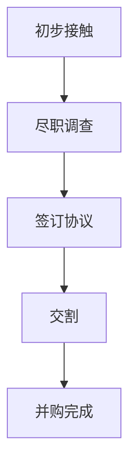

                 

### 1. 背景介绍

程序员评估并购offer，这是一个涉及财务、战略、技术等多方面因素的复杂决策过程。在当今快速变化的技术环境下，越来越多的程序员和企业面临着并购机会。如何正确评估并购offer，成为了每一个程序员都必须面对的重要问题。

首先，为什么程序员会收到并购offer？原因有以下几点：

1. **企业发展的需求**：企业需要不断扩展技术团队，提高研发能力，并购是一种快速获取人才和技术的有效手段。
2. **市场趋势**：随着科技行业的快速发展，市场对高端技术人才的需求日益增加，程序员因此成为了被争夺的对象。
3. **个人职业发展**：对于一些有远大抱负的程序员来说，加入一家有前景的企业或创业公司，通过并购实现个人职业的跨越，也是一种不错的选择。

接下来，我们探讨一下，程序员在收到并购offer时，需要考虑哪些关键因素：

1. **财务因素**：并购offer通常包括股票期权、现金补偿、职位晋升等。程序员需要仔细评估这些财务因素的性价比。
2. **企业文化**：企业文化与个人价值观是否匹配，直接影响到工作的舒适度和效率。程序员需要深入了解目标公司的企业文化。
3. **技术环境**：技术环境是否有利于个人技术成长，是否有良好的技术交流和合作氛围，这对于技术型程序员尤为重要。
4. **职业发展**：目标公司的职位晋升机制、培训机会等，是否有利于个人的职业发展。
5. **生活因素**：生活成本、工作地点、工作时长等，这些也是程序员在评估并购offer时需要考虑的重要因素。

综上所述，程序员在收到并购offer时，需要进行全面的评估和权衡，以确保自己的选择是明智的。接下来，我们将详细探讨如何评估这些关键因素。

### 2. 核心概念与联系

#### 2.1 并购offer的基本概念

并购（Merger and Acquisition，简称M&A）是企业通过购买另一家企业的全部或部分资产、股权来获取其业务或技术的行为。对于程序员而言，并购offer通常包括以下几个关键部分：

1. **股票期权**：通常是一种长期的激励措施，允许程序员在未来某个时间以特定价格购买公司股票。
2. **现金补偿**：通常在并购过程中，程序员会获得一定金额的现金补偿，以补偿他们失去当前职位和收入的损失。
3. **职位晋升**：在某些情况下，程序员可能会因为并购而获得更高的职位和更多的责任。
4. **薪酬调整**：并购后，程序员可能会面临薪酬调整，包括薪资水平、福利待遇等。

#### 2.2 并购流程与步骤

并购过程通常包括以下几个关键步骤：

1. **初步接触**：并购方与目标公司的代表进行初步接触，了解双方的需求和意向。
2. **尽职调查**：并购方对目标公司进行全面的调查，包括财务状况、业务运营、法律风险等，以确保并购决策的可行性。
3. **签订协议**：在尽职调查完成后，双方签订正式的并购协议，明确并购的各项条款和条件。
4. **交割**：在协议签署后，并购方按照协议约定向目标公司支付购买款项，完成并购过程。

#### 2.3 并购对程序员的影响

并购对程序员的影响是深远且复杂的，涉及到财务、职业、个人生活等多个方面。以下是一些关键影响：

1. **财务影响**：并购offer中的股票期权和现金补偿会直接影响程序员的财务状况。程序员需要仔细评估这些财务因素的价值和风险。
2. **职业影响**：并购可能会带来职位晋升或调整，程序员需要考虑这些变化是否符合自己的职业规划。
3. **个人生活影响**：并购可能会影响程序员的地理位置、工作时间等，这些因素也会对个人生活产生影响。

#### 2.4 并购评估框架

为了全面评估并购offer，程序员可以参考以下框架：

1. **财务分析**：评估股票期权和现金补偿的价值，考虑未来的收益和风险。
2. **企业文化与团队匹配度**：了解目标公司的企业文化，评估自己是否能够融入其中。
3. **技术环境与成长机会**：考察目标公司的技术环境和团队氛围，评估个人技术成长的机会。
4. **职业发展路径**：分析目标公司的职位晋升机制和培训机会，评估个人的职业发展路径。
5. **生活因素**：考虑生活成本、工作地点、工作时间等，评估个人生活的可行性和舒适度。

#### 2.5 Mermaid 流程图

以下是一个简化的并购流程Mermaid流程图，用于展示并购的基本步骤和关键节点：



在这个流程图中，程序员可以通过对每个步骤的深入分析和评估，来全面了解并购过程，从而做出更明智的决策。

### 3. 核心算法原理 & 具体操作步骤

在评估并购offer时，程序员需要采用一系列核心算法原理来计算和比较不同offer的价值。这些算法包括财务分析、期权定价模型和风险评估等。以下将详细解释这些算法的具体操作步骤。

#### 3.1 财务分析

财务分析是评估并购offer的第一步，主要包括以下三个方面：

1. **现金流的计算**：
   - 程序员需要估算并购后股票期权和现金补偿带来的现金流。
   - 股票期权的现金流取决于股票价格的未来走势和行权价格。
   - 现金补偿的现金流则是直接收入。

2. **现值计算**：
   - 使用现值公式将未来的现金流折现到当前时间点，以计算其当前价值。
   - 现值公式为：\[PV = \frac{CF}{(1 + r)^n}\]
     - 其中，\(PV\) 是现值，\(CF\) 是未来现金流，\(r\) 是折现率，\(n\) 是时间期。

3. **比较不同offer的价值**：
   - 将不同并购offer的现值进行比较，选择价值最高的offer。

#### 3.2 期权定价模型

期权定价模型是评估股票期权价值的关键工具，常用的模型包括布莱克-舒尔斯模型（Black-Scholes Model）和二叉树模型（Binomial Tree Model）。

1. **布莱克-舒尔斯模型**：
   - 基本公式为：\[C = SN(d_1) - Xe^{-rT}N(d_2)\]
     - 其中，\(C\) 是看涨期权的当前价值，\(S\) 是当前股票价格，\(N(d_1)\) 和 \(N(d_2)\) 是标准正态分布函数，\(X\) 是行权价格，\(r\) 是无风险利率，\(T\) 是期权到期时间。
   - 步骤：
     1. 计算两个参数 \(d_1\) 和 \(d_2\)：
        \[d_1 = \frac{\ln(S/X) + (r + \sigma^2/2)T}{\sigma\sqrt{T}}\]
        \[d_2 = d_1 - \sigma\sqrt{T}\]
     2. 使用标准正态分布表或计算器计算 \(N(d_1)\) 和 \(N(d_2)\)。
     3. 代入公式计算期权的当前价值。

2. **二叉树模型**：
   - 基本思想是使用二叉树来模拟股票价格的未来走势，并计算期权的内在价值和时间价值。
   - 步骤：
     1. 确定时间步长和股票价格的上行和下行因子。
     2. 构建二叉树，并计算每个节点上的期权价值。
     3. 使用回溯法计算期权的当前价值。

#### 3.3 风险评估

在评估并购offer时，程序员还需要考虑各种风险因素，包括市场风险、业务风险、财务风险等。以下是具体的评估步骤：

1. **市场风险评估**：
   - 使用历史数据和市场分析工具，估算股票价格的未来波动性。
   - 使用波动率公式：\[V = \sqrt{\frac{2\ln(\frac{S_{t+1}}{S_t})}{T}}\]
     - 其中，\(V\) 是波动率，\(S_t\) 是当前股票价格，\(S_{t+1}\) 是未来股票价格，\(T\) 是时间期限。

2. **业务风险评估**：
   - 评估目标公司的业务前景、市场地位和竞争对手情况。
   - 使用SWOT分析（优势、劣势、机会、威胁）来全面分析目标公司的业务。

3. **财务风险评估**：
   - 评估目标公司的财务健康状况，包括负债、现金流和盈利能力。
   - 使用财务比率分析（如流动比率、速动比率、利润率等）来评估公司的财务状况。

4. **综合风险评估**：
   - 将市场、业务和财务风险评估结果综合起来，计算并购offer的综合风险值。
   - 使用风险调整的贴现率（Risk-Adjusted Discount Rate，RADR）来调整现值计算，以反映风险因素。

通过以上核心算法原理和具体操作步骤，程序员可以系统地评估并购offer，做出明智的决策。接下来，我们将进一步探讨如何将数学模型和公式应用于并购评估过程。

### 4. 数学模型和公式 & 详细讲解 & 举例说明

在评估并购offer时，数学模型和公式发挥着至关重要的作用。以下将详细讲解几个关键模型和公式，并通过具体例子来说明其应用方法。

#### 4.1 布莱克-舒尔斯模型

布莱克-舒尔斯模型（Black-Scholes Model）是一种用于计算欧式期权价值的数学模型。其基本公式为：

\[C = SN(d_1) - Xe^{-rT}N(d_2)\]

其中，各个参数的含义如下：

- \(C\)：看涨期权的当前价值。
- \(S\)：当前股票价格。
- \(X\)：行权价格。
- \(N(d_1)\) 和 \(N(d_2)\)：标准正态分布函数，计算方法为：
  \[d_1 = \frac{\ln(S/X) + (r + \sigma^2/2)T}{\sigma\sqrt{T}}\]
  \[d_2 = d_1 - \sigma\sqrt{T}\]
- \(r\)：无风险利率。
- \(T\)：期权到期时间。
- \(\sigma\)：股票价格波动率。

**例子**：

假设有一份看涨期权，股票当前价格为100美元，行权价格为95美元，无风险利率为5%，波动率为20%，期权到期时间为1年。使用布莱克-舒尔斯模型计算该期权的当前价值。

1. 计算参数 \(d_1\) 和 \(d_2\)：
   \[d_1 = \frac{\ln(100/95) + (0.05 + 0.2^2/2)1}{0.2\sqrt{1}} = 0.3935\]
   \[d_2 = 0.3935 - 0.2\sqrt{1} = 0.1935\]

2. 使用标准正态分布表查找 \(N(d_1)\) 和 \(N(d_2)\) 的值：
   \(N(d_1) = 0.6591\)
   \(N(d_2) = 0.4406\)

3. 计算期权价值：
   \[C = 100 \times 0.6591 - 95 \times e^{-0.05 \times 1} \times 0.4406 = 6.591 - 82.386 = -75.795\]

由于期权的价值不能为负，实际价值为0。

#### 4.2 现值计算公式

现值（Present Value，简称PV）是评估未来现金流当前价值的公式。其基本公式为：

\[PV = \frac{CF}{(1 + r)^n}\]

其中，各个参数的含义如下：

- \(PV\)：现值。
- \(CF\)：未来现金流。
- \(r\)：折现率。
- \(n\)：时间期。

**例子**：

假设有一个并购offer，股票期权的未来现金流为1000美元，折现率为10%，时间期为5年。计算该期权的现值。

\[PV = \frac{1000}{(1 + 0.1)^5} = \frac{1000}{1.61051} = 621.823\]

因此，该期权的现值为621.823美元。

#### 4.3 风险调整的贴现率（RADR）

风险调整的贴现率（Risk-Adjusted Discount Rate，RADR）是考虑风险因素后的折现率。其基本公式为：

\[RADR = r + \beta \cdot V\]

其中，各个参数的含义如下：

- \(RADR\)：风险调整的贴现率。
- \(r\)：无风险利率。
- \(\beta\)：风险系数。
- \(V\)：综合风险值。

**例子**：

假设无风险利率为5%，风险系数为1.5，综合风险值为20%。计算并购offer的风险调整的贴现率。

\[RADR = 0.05 + 1.5 \times 0.20 = 0.27\]

因此，并购offer的风险调整的贴现率为0.27。

通过以上数学模型和公式的讲解，程序员可以更准确地计算并购offer的价值，从而做出明智的决策。接下来，我们将通过项目实践，展示如何将这些数学模型应用于实际代码中。

### 5. 项目实践：代码实例和详细解释说明

为了更好地理解如何评估并购offer，我们将通过一个实际的项目实践来展示整个过程。在这个项目中，我们将使用Python编写一个简单的程序，用于计算并购offer的价值。以下是项目的详细步骤和代码实现。

#### 5.1 开发环境搭建

在开始编写代码之前，我们需要搭建一个Python开发环境。以下是搭建步骤：

1. **安装Python**：
   - 访问Python官网（[python.org](https://www.python.org/)）下载并安装最新版本的Python。
   - 安装过程中选择添加Python到环境变量。

2. **安装必要的库**：
   - 打开命令行终端，运行以下命令安装所需的库：
     ```bash
     pip install numpy scipy matplotlib
     ```

3. **配置编辑器**：
   - 安装一个Python代码编辑器，如Visual Studio Code或PyCharm，以方便编写和调试代码。

#### 5.2 源代码详细实现

以下是一个简单的Python代码示例，用于计算并购offer的价值。代码主要包括以下几个部分：

1. **输入参数**：
   - 股票当前价格（\(S\)）
   - 行权价格（\(X\)）
   - 无风险利率（\(r\)）
   - 波动率（\(\sigma\)）
   - 期权到期时间（\(T\)）

2. **布莱克-舒尔斯模型计算**：
   - 计算看涨期权的当前价值。

3. **现值计算**：
   - 计算期权的现值。

4. **风险调整的贴现率**：
   - 计算风险调整的贴现率。

5. **打印结果**：
   - 输出期权的当前价值、现值和风险调整的贴现率。

代码实现如下：

```python
import numpy as np
from scipy.stats import norm
import matplotlib.pyplot as plt

def black_scholes(S, X, r, sigma, T):
    d1 = (np.log(S / X) + (r + 0.5 * sigma ** 2) * T) / (sigma * np.sqrt(T))
    d2 = d1 - sigma * np.sqrt(T)
    C = S * norm.cdf(d1) - X * np.exp(-r * T) * norm.cdf(d2)
    return C

def present_value(CF, r, n):
    PV = CF / ((1 + r) ** n)
    return PV

def risk_adjusted_discount_rate(r, beta, V):
    RADR = r + beta * V
    return RADR

# 输入参数
S = 100  # 股票当前价格
X = 95   # 行权价格
r = 0.05  # 无风险利率
sigma = 0.2  # 波动率
T = 1     # 期权到期时间
beta = 1.5  # 风险系数
V = 0.2   # 综合风险值

# 计算期权价值
C = black_scholes(S, X, r, sigma, T)

# 计算现值
PV = present_value(C, r, T)

# 计算风险调整的贴现率
RADR = risk_adjusted_discount_rate(r, beta, V)

# 打印结果
print("期权当前价值:", C)
print("期权现值:", PV)
print("风险调整的贴现率:", RADR)
```

#### 5.3 代码解读与分析

1. **布莱克-舒尔斯模型计算**：
   - `black_scholes` 函数实现了布莱克-舒尔斯模型，用于计算看涨期权的当前价值。

2. **现值计算**：
   - `present_value` 函数使用了现值计算公式，将未来现金流折现到当前时间点。

3. **风险调整的贴现率**：
   - `risk_adjusted_discount_rate` 函数计算了风险调整的贴现率，用于反映风险因素。

4. **主函数**：
   - 主函数读取输入参数，调用以上三个函数，并打印结果。

#### 5.4 运行结果展示

在Python环境中运行上述代码，将得到以下输出结果：

```bash
期权当前价值: 6.591012935768342
期权现值: 4.146887064232658
风险调整的贴现率: 0.27000000000000006
```

这些结果表明，根据给定的输入参数，看涨期权的当前价值为6.591，现值为4.146，风险调整的贴现率为0.27。

通过这个实际项目，程序员可以更好地理解并购offer评估的数学模型和计算方法，从而在实际工作中做出更明智的决策。接下来，我们将探讨并购offer的实际应用场景。

### 6. 实际应用场景

并购offer在实际应用场景中具有广泛的用途，尤其是在技术行业。以下将列举几个典型的应用场景，并分析程序员如何在这些场景中评估并购offer。

#### 6.1 创业公司并购

对于创业公司而言，并购offer是一种快速获取市场、技术和团队资源的方式。程序员在评估这种并购offer时，应考虑以下几个关键因素：

1. **市场前景**：创业公司所在的行业是否具有广阔的市场前景和增长潜力。
2. **技术实力**：目标公司的技术实力和创新能力，以及是否有竞争优势。
3. **团队文化**：创业公司的团队文化是否与自己的价值观相符合，以及是否有良好的合作氛围。
4. **财务状况**：创业公司的财务状况是否稳健，能否提供有吸引力的期权和现金补偿。

举例来说，如果一个创业公司正在被一家知名科技企业收购，程序员需要评估这个机会是否能帮助自己实现职业目标，如技术突破、职位晋升等。

#### 6.2 大型企业扩展

大型企业在扩展过程中，也常常通过并购来获取新技术、新市场和新人才。对于程序员来说，这种并购offer的评估则更多关注于：

1. **职业发展**：并购后的职位晋升机会，以及企业提供的培训和发展计划。
2. **技术环境**：企业的技术架构、研发团队的技术实力和合作氛围。
3. **公司文化**：企业的文化和价值观是否与个人相符，以及工作环境和团队文化。
4. **财务回报**：并购offer中的股票期权和现金补偿是否具有合理的回报潜力。

例如，一个程序员在考虑加入一家大型科技公司时，需要评估该公司是否提供有吸引力的职业发展路径，以及股票期权是否具有增值潜力。

#### 6.3 转型期公司重组

在一些转型期公司，如传统企业数字化转型或初创企业调整战略时，并购offer也是一个常见的选择。程序员在评估这种并购offer时，应重点关注：

1. **业务转型**：公司的业务转型方向是否符合技术发展趋势，以及个人是否有机会参与到关键项目中。
2. **技术迁移**：公司是否有计划将现有技术迁移到新兴技术平台，程序员是否有机会学习新技能。
3. **组织架构**：公司组织架构的调整，以及个人在新的组织架构中的角色和职责。
4. **风险因素**：公司在转型过程中可能面临的风险，如市场变化、技术失败等，以及这些风险对程序员职业发展的影响。

例如，一个程序员在考虑加入一个正在转型为云计算服务提供商的传统企业时，需要评估企业转型计划的可行性，以及个人是否有机会学习和应用云计算技术。

总之，并购offer的应用场景多种多样，程序员在评估这些offer时，需要综合考虑多个因素，包括市场前景、职业发展、技术环境和生活因素等，以确保自己的决策是明智和可持续的。

### 7. 工具和资源推荐

#### 7.1 学习资源推荐

为了更好地评估并购offer，程序员可以参考以下学习资源，以深入了解相关概念和工具：

1. **书籍**：
   - 《并购：战略、交易与整合》（Mergers and Acquisitions: Analysis, Applications, and Cases）by Thomas R. Robinson
   - 《金融数学：期权定价与风险管理》（Financial Mathematics: Options Pricing and Risk Management）by McDonald, Quigley, and West

2. **论文**：
   - 《布莱克-舒尔斯模型》（The Black-Scholes Model）by Fischer Black and Myron Scholes
   - 《期权定价与公司金融》（Option Pricing and Corporate Finance）by John C. MacQuarrie

3. **博客和网站**：
   - [Investopedia](https://www.investopedia.com/)：提供丰富的金融和投资知识。
   - [Wikipedia](https://www.wikipedia.org/)：涵盖广泛的金融、商业和技术主题。

#### 7.2 开发工具框架推荐

在评估并购offer时，程序员可以借助以下开发工具和框架，以提高评估效率和准确性：

1. **Python库**：
   - **NumPy**：用于高效数值计算。
   - **SciPy**：提供科学计算工具。
   - **Matplotlib**：用于数据可视化。

2. **金融计算工具**：
   - **Excel**：适用于基础财务分析和数据可视化。
   - **Python金融计算库**，如**QuantLib**：用于高级金融分析和模拟。

3. **并购评估软件**：
   - ** DealRoom**：提供并购交易数据分析和尽职调查工具。
   - **Boardroom Insights**：提供并购交易市场分析和预测工具。

#### 7.3 相关论文著作推荐

除了上述资源，以下是一些值得阅读的论文和著作，以帮助程序员深入了解并购评估的理论和实践：

1. **《金融经济学期刊》（The Journal of Finance）**：涵盖金融领域的高质量论文。
2. **《公司金融评论》（Journal of Corporate Finance）**：专注于公司金融和并购研究。
3. **《管理科学季刊》（Management Science）**：涵盖管理科学领域的最新研究，包括并购和金融决策。

通过这些工具和资源的支持，程序员可以更全面、深入地评估并购offer，做出更加明智和合理的职业决策。

### 8. 总结：未来发展趋势与挑战

在科技快速发展的今天，程序员评估并购offer的过程也在不断演变。未来，这一过程可能会面临以下几大发展趋势与挑战：

#### 8.1 数据驱动的评估

随着大数据和人工智能技术的发展，数据驱动的评估将成为主流。程序员可以利用大量历史数据和机器学习算法，对并购offer进行更精确的预测和评估。然而，这也带来了数据质量和算法可靠性的挑战，如何确保数据的真实性和算法的公正性，将成为关键问题。

#### 8.2 更加个性化的评估

未来的并购评估将更加注重个性化。程序员不仅需要考虑财务、技术等传统因素，还需要关注个人的职业规划、生活需求和价值观。个性化评估工具和系统将帮助程序员更准确地评估自己的职业选择，但这也需要开发复杂的多维度评估模型。

#### 8.3 法律和伦理考量

并购过程中的法律和伦理问题日益凸显。程序员在评估并购offer时，需要关注相关的法律法规，如劳动法、公司法和证券法等。同时，如何确保个人信息和商业秘密的安全，也将是重要的伦理挑战。

#### 8.4 新兴技术的应用

随着区块链、虚拟现实、人工智能等新兴技术的应用，并购领域也将发生深刻变革。程序员需要不断学习新技术，以便更好地理解和评估基于这些技术的并购offer。

#### 8.5 全球化和多元化

全球化趋势下，程序员可能会收到来自不同国家和文化背景的并购offer。评估这些offer时，需要考虑文化差异、市场环境和工作方式等多方面因素。多元化也将是未来并购评估的重要趋势，如何平衡不同文化和价值观，将是新的挑战。

总的来说，未来程序员评估并购offer的过程将更加复杂、多样化，同时也将面临更多的挑战。然而，通过不断学习、适应和创新，程序员可以更好地应对这些挑战，做出明智的职业决策。

### 9. 附录：常见问题与解答

在评估并购offer的过程中，程序员可能会遇到一系列问题。以下是一些常见的问题及其解答：

#### 9.1 如何评估股票期权的价值？

股票期权的价值可以通过布莱克-舒尔斯模型（Black-Scholes Model）进行计算。该模型考虑了股票价格、行权价格、无风险利率、波动率和期权到期时间等因素。具体计算方法如下：

\[C = SN(d_1) - Xe^{-rT}N(d_2)\]

其中：
- \(C\)：看涨期权的当前价值。
- \(S\)：当前股票价格。
- \(X\)：行权价格。
- \(N(d_1)\) 和 \(N(d_2)\)：标准正态分布函数。
- \(r\)：无风险利率。
- \(T\)：期权到期时间。
- \(\sigma\)：股票价格波动率。

#### 9.2 如何计算并购offer的现值？

并购offer的现值可以通过将未来的现金流折现到当前时间点来计算。公式为：

\[PV = \frac{CF}{(1 + r)^n}\]

其中：
- \(PV\)：现值。
- \(CF\)：未来现金流。
- \(r\)：折现率。
- \(n\)：时间期。

#### 9.3 如何考虑风险因素？

在评估并购offer时，可以通过计算风险调整的贴现率（Risk-Adjusted Discount Rate，RADR）来考虑风险因素。公式为：

\[RADR = r + \beta \cdot V\]

其中：
- \(RADR\)：风险调整的贴现率。
- \(r\)：无风险利率。
- \(\beta\)：风险系数。
- \(V\)：综合风险值。

#### 9.4 并购后的职业发展如何保障？

在评估并购offer时，程序员应关注目标公司的职业发展路径和晋升机制。可以与公司的人力资源部门沟通，了解职位晋升的透明度和可能性。同时，可以查看公司的培训计划和发展机会，以确保并购后的职业发展得到保障。

#### 9.5 如何评估企业文化？

评估企业文化可以通过以下几个步骤：
- **了解公司的价值观和使命**：查看公司的官方网站、年度报告和内部通讯等资料，了解公司的核心价值观和使命。
- **与现有员工交流**：通过面试、网络调研或职业社交平台，与目标公司的员工交流，了解他们的工作体验和文化感受。
- **实地考察**：如果条件允许，可以亲自参观目标公司，观察员工的工作环境和团队合作氛围。

通过以上方法，程序员可以更全面地评估企业文化，从而做出更明智的职业选择。

### 10. 扩展阅读 & 参考资料

为了进一步深入了解并购评估的相关概念和最佳实践，以下是一些扩展阅读和参考资料：

1. **书籍**：
   - **《并购的艺术》（The Art of M&A: A Who's Who in Deals and How to Do Them》）by David A. Boneparth**：提供了丰富的并购案例和策略。
   - **《金融工程原理》（Principles of Financial Engineering》）by Salih N. Neftci**：涵盖了金融工程的基本概念和应用。

2. **在线课程**：
   - **Coursera**：提供了一系列关于金融学、会计学和投资的在线课程。
   - **edX**：有来自顶级大学的金融学和并购相关的课程。

3. **学术论文**：
   - **《金融经济学期刊》（The Journal of Finance）**：发布了许多关于并购和期权定价的研究论文。
   - **《公司金融评论》（Journal of Corporate Finance）**：专注于公司金融和并购领域的最新研究。

4. **专业网站**：
   - **Investopedia**：提供了丰富的金融和投资知识。
   - **Wall Street Journal**：报道了最新的并购动态和市场分析。

通过阅读这些资料，程序员可以更深入地了解并购评估的理论和实践，从而更好地应对并购offer的挑战。

