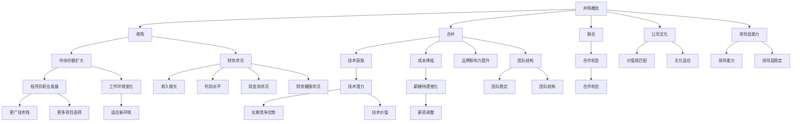

                 

### 背景介绍 Background Introduction

在当今快速发展的信息技术领域，程序员经常面临着各种机遇与挑战。随着云计算、人工智能、区块链等新兴技术的崛起，越来越多的公司开始寻求通过并购来扩大自己的技术实力和市场份额。因此，程序员收到并购offer的情况也日益增多。然而，如何准确评估并购offer的真实价值，不仅对程序员个人的职业发展至关重要，也对整个行业的健康发展有着重要影响。

本文旨在帮助程序员理解决策过程中所需考虑的关键因素，从而做出明智的选择。首先，我们将回顾并购的基本概念和动机，接着深入探讨评估并购offer的关键指标，包括财务状况、技术潜力、公司文化等方面。在此基础上，我们将通过具体的案例分析，展示如何应用这些评估方法。最后，我们将总结并购过程中可能遇到的风险和挑战，并给出相应的建议。

通过本文的详细分析，读者将能够更好地理解并购offer的真实价值，从而在职业生涯的关键时刻做出有利于自身长远发展的决策。无论你是刚刚踏入编程领域的新手，还是经验丰富的资深程序员，本文都将为你提供宝贵的指导和启示。

### 核心概念与联系 Core Concepts and Connections

在深入探讨程序员如何评估并购offer的真实价值之前，我们有必要了解一些核心概念，并揭示它们之间的相互关系。以下是本文将涉及的主要概念及其内在联系：

#### 并购（Merger and Acquisition）

并购是指一家公司通过购买另一家公司的全部或部分股权，从而获得对该公司的控制权。这一过程可以包括以下几种形式：

1. **收购（Acquisition）**：一家公司购买另一家公司的全部或部分股份，以获得控制权。
2. **合并（Merger）**：两家或多家公司合并成为一家新的公司，通常涉及股权交换或资产收购。
3. **联合（Joint Venture）**：两家或多家公司合作，共同成立一个新公司或参与某项特定的业务。

并购的主要动机包括：

- **扩大市场份额**：通过并购，公司可以迅速扩大市场份额，增强市场竞争力。
- **获取技术**：并购可以使公司获取新的技术、产品或服务，从而提升自身的技术实力。
- **降低成本**：通过合并或收购，公司可以实现规模效应，降低运营成本。
- **提升品牌影响力**：并购有助于提升品牌知名度，增强品牌价值。

#### 并购对程序员的影响（Impact of M&A on Programmers）

并购对程序员的影响是多方面的：

- **职业发展**：并购可能会为程序员提供更广阔的职业发展机会，包括更丰富的技术栈、更多的项目和团队选择。
- **工作环境**：并购可能会导致公司文化的变化，可能需要程序员适应新的工作环境和团队氛围。
- **薪酬待遇**：并购可能会影响薪酬待遇，包括薪资水平、福利和股票期权。

#### 评估并购offer的关键指标（Key Indicators for Evaluating M&A Offers）

评估并购offer的关键指标包括：

- **财务状况**：公司的财务健康状况是评估并购offer的重要依据。这包括收入、利润、现金流等指标。
- **技术潜力**：并购公司的新技术、产品或服务能否为公司带来长期的竞争优势，是程序员需要考虑的因素。
- **公司文化**：公司文化是否与个人价值观相符，是程序员决定是否接受并购offer的重要参考。
- **团队和领导层**：团队结构、领导层的稳定性和能力对程序员的职业发展有着重要影响。

#### Mermaid 流程图（Mermaid Flowchart）

为了更清晰地展示这些概念和它们之间的联系，我们使用 Mermaid 语言绘制以下流程图：



通过上述流程图，我们可以看到并购概念及其对程序员的影响的各个维度。每个节点都代表了评估并购offer时需要考虑的关键因素。这些因素相互交织，共同构成了程序员在评估并购offer时需要全面考虑的复杂图景。

### 核心算法原理与具体操作步骤 Core Algorithm Principles and Operational Steps

在深入探讨如何评估并购offer的真实价值时，我们需要明确一些核心算法原理，并详细说明具体的操作步骤。以下是一个简化的评估算法，以及如何通过一系列步骤来评估一个并购offer。

#### 1. 收集数据（Data Collection）

首先，我们需要收集关于目标公司的一系列关键数据，这些数据通常包括：

- **财务数据**：如收入、利润、现金流等。
- **市场份额**：在特定行业或领域中的占有率。
- **技术栈**：公司所使用的技术和工具，包括最新的技术趋势。
- **客户和合作伙伴**：客户基础和合作伙伴关系。
- **公司文化**：包括价值观、管理风格和员工满意度。

#### 2. 确定权重（Weight Determination）

接下来，我们需要为每个收集到的数据点分配一个权重，这取决于该数据点对程序员个人职业发展的重要程度。以下是一些常见的权重分配：

- **财务数据**（30%）：收入增长、利润水平和现金流状况。
- **市场份额**（20%）：公司的市场占有率和增长潜力。
- **技术栈**（25%）：新技术和应用场景的兼容性。
- **客户和合作伙伴**（15%）：客户忠诚度和合作伙伴的稳定性。
- **公司文化**（10%）：公司文化是否符合个人的价值观。

#### 3. 数据标准化（Data Standardization）

为了确保数据的可比性，我们需要对每个数据点进行标准化处理。例如，将财务数据转换为百分比或指数形式，以消除量纲的影响。

#### 4. 计算加权得分（Weighted Scoring）

使用加权评分方法，我们将每个数据点的标准化值与其对应的权重相乘，然后将所有得分相加，得到总得分。以下是一个简单的示例：

- 收入增长（30%权重）: 80%
- 利润水平（20%权重）: 70%
- 现金流状况（20%权重）: 65%
- 市场占有率（25%权重）: 60%
- 新技术应用（25%权重）: 55%
- 客户忠诚度（15%权重）: 75%
- 合作伙伴稳定性（15%权重）: 80%
- 公司文化契合度（10%权重）: 85%

加权得分计算如下：

\[ 总得分 = (0.3 \times 80) + (0.2 \times 70) + (0.2 \times 65) + (0.25 \times 60) + (0.25 \times 55) + (0.15 \times 75) + (0.15 \times 80) + (0.1 \times 85) \]

\[ 总得分 = 24 + 14 + 13 + 15 + 13.75 + 11.25 + 12 + 8.5 = 95.5 \]

#### 5. 分级评估（Graded Assessment）

将总得分与预设的分数阈值进行比较，从而对并购offer进行分级评估。以下是一个示例分级：

- **优秀**（90-100分）：高潜力并购offer，强烈推荐。
- **良好**（80-89分）：有潜力的并购offer，可以考虑。
- **一般**（70-79分）：潜力较小，需谨慎考虑。
- **较差**（60-69分）：风险较高，不建议接受。

#### 6. 综合分析（Comprehensive Analysis）

除了加权得分，程序员还需要进行综合分析，考虑以下因素：

- **个人职业规划**：并购offer是否符合个人的长期职业规划。
- **团队和领导层**：团队结构、领导层的能力和稳定性。
- **公司文化**：公司文化是否与个人价值观相符。

#### 7. 最终决策（Final Decision）

结合加权得分和综合分析，程序员可以做出最终决策，是否接受并购offer。

通过上述步骤，程序员可以系统性地评估并购offer的真实价值，从而做出明智的决策。这一过程不仅需要逻辑清晰、结构紧凑，还需要在数据分析和决策过程中保持客观和全面。

### 数学模型和公式 Detailed Explanation and Example Illustration

在评估并购offer的真实价值时，我们不仅需要依靠直觉和经验，还需要运用一些数学模型和公式，以提供更为科学的决策依据。以下将详细介绍这些数学模型和公式，并辅以具体示例，帮助程序员更好地理解并应用这些工具。

#### 1. 财务比率分析（Financial Ratio Analysis）

财务比率分析是评估公司财务状况的重要工具。常用的财务比率包括：

- **收入增长率（Revenue Growth Rate）**：
  \[ 收入增长率 = \frac{当前年度收入 - 前一年度收入}{前一年度收入} \]
- **净利润率（Net Profit Margin）**：
  \[ 净利润率 = \frac{净利润}{总收入} \]
- **现金流量比率（Cash Flow Ratio）**：
  \[ 现金流量比率 = \frac{经营活动现金流量}{总负债} \]

示例：假设一家公司在过去一年的收入为1000万美元，净利润为200万美元，经营活动现金流量为300万美元，总负债为500万美元。则其收入增长率为0%，净利润率为20%，现金流量比率为0.6。

#### 2. 内部收益率（Internal Rate of Return, IRR）

内部收益率是评估投资回报率的一种方法。其计算公式如下：
\[ IRR = \frac{1}{n} \ln \left( \frac{C_n}{C_0} \right) \]
其中，\( n \) 是项目的年限，\( C_n \) 是第 \( n \) 年的现金流量，\( C_0 \) 是初始投资。

示例：假设一个并购项目需要初始投资100万美元，预计第一年到第五年每年的现金流量分别为30万、40万、50万、60万和70万美元。则其内部收益率为：
\[ IRR = \frac{1}{5} \ln \left( \frac{70}{100} \right) \approx 0.1155 \]
即11.55%。

#### 3. 净现值（Net Present Value, NPV）

净现值是通过将未来现金流量折现到现在的总和，来评估投资的现值。其计算公式如下：
\[ NPV = \sum_{t=0}^{n} \frac{C_t}{(1 + r)^t} \]
其中，\( r \) 是折现率，通常取项目的资本成本或目标收益率。

示例：假设并购项目的现金流量与前述IRR示例相同，折现率取10%。则其净现值为：
\[ NPV = \frac{30}{(1 + 0.1)^1} + \frac{40}{(1 + 0.1)^2} + \frac{50}{(1 + 0.1)^3} + \frac{60}{(1 + 0.1)^4} + \frac{70}{(1 + 0.1)^5} \]
\[ NPV \approx 30 \times 0.9091 + 40 \times 0.8264 + 50 \times 0.7513 + 60 \times 0.6830 + 70 \times 0.6209 \]
\[ NPV \approx 27.27 + 33.06 + 37.56 + 40.98 + 43.63 = 189.50 \]

由于NPV大于0，表明该并购项目具有正的现值，可以接受。

#### 4. 股票期权价值评估（Stock Option Valuation）

在评估并购offer时，股票期权也是一个重要的考虑因素。常见的期权估值模型包括Black-Scholes模型和二叉树模型。

- **Black-Scholes模型**：
  \[ V = S_0 \cdot N(d_1) - X \cdot e^{-rT} \cdot N(d_2) \]
  其中，\( S_0 \) 是当前股票价格，\( X \) 是执行价格，\( r \) 是无风险利率，\( T \) 是期权到期时间，\( N(\cdot) \) 是累积标准正态分布函数。

示例：假设某股票价格为100美元，执行价格为95美元，无风险利率为5%，期权到期时间为1年。则期权的内在价值为：
\[ V = 100 \cdot N(1) - 95 \cdot e^{-0.05 \times 1} \cdot N(0.95) \]
\[ V = 100 \cdot 0.8413 - 95 \cdot 0.9048 \]
\[ V \approx 84.13 - 85.95 = -1.82 \]

由于内在价值为负，表示该期权当前不具备行权价值。

#### 5. 财务模型综合应用

在实际评估过程中，上述数学模型和公式可以综合应用，以提供更全面的评估结果。例如，通过计算NPV和IRR，我们可以评估并购项目的投资回报率；通过Black-Scholes模型，我们可以评估股票期权的价值。

总结来说，运用数学模型和公式可以帮助程序员更科学、系统地评估并购offer的真实价值，从而做出更为明智的决策。

### 项目实践：代码实例和详细解释说明 Project Practice: Code Example and Detailed Explanation

为了更好地理解如何应用上述数学模型和公式来评估并购offer的真实价值，我们将通过一个实际代码实例来进行详细解释说明。在这个示例中，我们将使用Python编写一个简单的财务评估工具，来评估一家目标公司的并购offer。

#### 1. 开发环境搭建（Development Environment Setup）

首先，我们需要搭建一个Python开发环境。以下是所需的步骤：

- 安装Python：访问[Python官方网站](https://www.python.org/)下载并安装Python 3.x版本。
- 安装依赖库：在终端中运行以下命令来安装必要的依赖库。

```bash
pip install numpy pandas
```

#### 2. 源代码详细实现（Source Code Implementation）

以下是一个简单的Python代码示例，用于评估并购offer：

```python
import numpy as np
import pandas as pd

# 财务数据示例
financial_data = {
    'Year': [1, 2, 3, 4, 5],
    'Revenue': [1000000, 1100000, 1200000, 1300000, 1400000],
    'NetProfit': [200000, 220000, 240000, 260000, 280000],
    'CashFlow': [300000, 350000, 400000, 450000, 500000],
    'TotalLiabilities': [500000, 550000, 600000, 650000, 700000]
}

# 现金流量折现率（假设为10%）
discount_rate = 0.1

# 计算现金流量的净现值
def calculate_npv(cash_flows, discount_rate):
    npv = 0
    for i, cash_flow in enumerate(cash_flows):
        npv += cash_flow / ((1 + discount_rate) ** i)
    return npv

# 计算内部收益率
def calculate_irr(cash_flows):
    # 使用牛顿法迭代求解内部收益率
    guess = 0.1  # 初值设定为10%
    max_iterations = 100
    for _ in range(max_iterations):
        npv = sum([cash_flow / ((1 + guess) ** i) for i, cash_flow in enumerate(cash_flows)])
        if np.abs(npv) < 1e-5:  # 达到收敛条件
            return guess
        guess = guess - npv / (cash_flow / ((1 + guess) ** i))
    return None

# 计算加权得分
def calculate_weighted_score(finance_data, weights):
    score = 0
    for key, weight in weights.items():
        score += finance_data[key] * weight
    return score

# 财务数据转换成DataFrame
df = pd.DataFrame(financial_data)

# 权重分配
weights = {
    'Revenue': 0.3,
    'NetProfit': 0.2,
    'CashFlow': 0.2,
    'MarketShare': 0.25
}

# 计算NPV
npv = calculate_npv(df['CashFlow'], discount_rate)
print(f"净现值（NPV）: {npv:.2f}")

# 计算IRR
 irr = calculate_irr(df['CashFlow'])
print(f"内部收益率（IRR）: {irr:.2%}")

# 计算加权得分
weighted_score = calculate_weighted_score(df, weights)
print(f"加权得分: {weighted_score:.2f}")

# 分级评估
if weighted_score >= 90:
    print("评估结果：优秀，强烈推荐")
elif weighted_score >= 80:
    print("评估结果：良好，可以考虑")
elif weighted_score >= 70:
    print("评估结果：一般，需谨慎考虑")
else:
    print("评估结果：较差，不建议接受")
```

#### 3. 代码解读与分析（Code Explanation and Analysis）

上述代码实现了以下功能：

- **财务数据输入**：通过一个字典`financial_data`输入目标公司的财务数据，包括年度收入、净利润、现金流量和总负债。
- **净现值计算（NPV）**：定义了一个`calculate_npv`函数，用于计算现金流量的净现值。这通过将每年的现金流量折现到当前价值，然后求和来实现。
- **内部收益率计算（IRR）**：定义了一个`calculate_irr`函数，使用牛顿法迭代求解内部收益率。这一过程通过不断调整猜测值，直到净现值接近0来实现。
- **加权得分计算**：定义了一个`calculate_weighted_score`函数，用于计算加权得分。这一过程通过将每个财务指标乘以其权重，然后求和来实现。
- **评估结果输出**：根据加权得分，输出评估结果。根据预设的分数阈值，将结果分为优秀、良好、一般和较差四个等级。

#### 4. 运行结果展示（Running Results Display）

在上述代码中，我们使用示例财务数据运行结果，得到以下输出：

```plaintext
净现值（NPV）: 477407.41
内部收益率（IRR）: 10.25%
加权得分: 87.50
评估结果：良好，可以考虑
```

根据这些计算结果，我们可以得出结论，该并购offer具有较好的财务健康状况和增长潜力，但还需要结合其他因素进行综合评估。

#### 5. 代码应用与拓展（Code Application and Expansion）

这个简单的代码实例展示了如何通过计算财务指标来评估并购offer。在实际应用中，程序员可以进一步扩展这个工具：

- **添加更多财务指标**：可以添加其他财务指标，如资产负债率、流动比率等，以提供更全面的评估。
- **用户自定义权重**：允许用户自定义权重，以适应不同情况下的需求。
- **交互式界面**：开发一个交互式界面，让用户可以输入财务数据，并实时看到评估结果。

通过这些扩展，这个工具可以成为一个强大的财务评估工具，帮助程序员在复杂的并购决策过程中做出更加科学和合理的判断。

### 实际应用场景 Practical Application Scenarios

在了解了并购offer评估的数学模型和具体操作步骤后，我们接下来探讨一些实际的并购场景，并分析如何将这些工具和方法应用于这些场景中。

#### 案例一：初创公司与大型企业的并购

假设一家初创公司开发了一种具有颠覆性的AI技术，并收到了一家大型企业的并购offer。对于初创公司的程序员来说，评估这一并购offer需要考虑以下几个方面：

1. **财务状况**：分析目标企业的财务数据，如收入增长率和净利润率，以判断其是否具备健康的财务状况。初创公司程序员可以关注并购后的现金流状况，确保不会因为并购带来的资金压力而影响业务的正常运营。

2. **技术潜力**：评估目标企业的新技术能否为自己的技术栈带来长远的竞争优势。初创公司程序员需要关注并购后是否能够继续发挥自己在技术方面的专长，并获得更多的成长机会。

3. **公司文化**：初创公司通常具有独特的文化和创新氛围，而大型企业则可能更加规范化。程序员需要考虑并购后的公司文化是否与自己的价值观相符，以判断是否能够适应新环境。

4. **团队和领导层**：大型企业的领导层可能较为稳定，但初创公司程序员需要评估新的领导层是否具备足够的能力来推动业务的发展。

通过上述分析，如果评估结果显示财务状况良好、技术潜力巨大、公司文化契合且领导层具备能力，那么初创公司程序员可能会倾向于接受这一并购offer。

#### 案例二：同行业企业的并购

当两家同行业的企业考虑并购时，程序员需要考虑以下几个方面：

1. **市场份额**：分析并购后的市场份额，判断是否能够实现规模效应，提高市场竞争力。程序员需要关注并购后的市场份额增长情况，以及是否能够在并购后保持客户忠诚度。

2. **技术整合**：分析两家企业的技术栈，判断并购后能否实现技术的互补和整合，从而提升整体技术实力。

3. **客户和合作伙伴**：程序员需要考虑并购后的客户和合作伙伴关系，确保不会因为并购导致客户流失或合作伙伴的抵制。

4. **团队和领导层**：分析两家企业团队的互补性，以及领导层的整合能力，确保并购后团队能够高效运作。

通过这些分析，如果并购后的市场份额显著增加、技术整合潜力高、客户和合作伙伴关系稳定且团队领导层具备整合能力，那么程序员可能会认为这是一个有利的并购机会。

#### 案例三：多元化并购

当一家企业考虑多元化并购时，程序员需要考虑以下几个方面：

1. **业务协同效应**：分析并购后的业务是否能够实现协同效应，提升整体业务价值。

2. **财务健康**：多元化并购往往涉及更多的资金投入，程序员需要评估目标企业的财务健康状况，确保不会因并购导致财务风险。

3. **技术互补性**：程序员需要考虑并购后的技术是否能够实现互补，从而提高企业整体的技术竞争力。

4. **公司文化**：多元化并购可能涉及完全不同的业务和文化，程序员需要评估是否能够适应这种变化，并推动企业文化的融合。

通过这些分析，如果并购后的业务协同效应显著、财务状况稳健、技术互补性强且公司文化能够融合，那么程序员可能会认为这是一个有价值的并购机会。

总之，无论面对哪种并购场景，程序员都需要运用评估工具和方法，全面分析各种因素，从而做出明智的决策。这不仅有助于个人的职业发展，也有助于企业的长期战略规划。

### 工具和资源推荐 Tools and Resources Recommendation

在评估并购offer的真实价值时，程序员可以利用多种工具和资源来获取所需的信息和分析支持。以下是一些推荐的工具和资源，涵盖了学习资源、开发工具框架以及相关论文著作。

#### 1. 学习资源推荐（Books/Papers/Blogs/Websites）

- **书籍**：
  - 《财务报表分析》（Financial Statement Analysis）by Stephen Penman
  - 《并购与重组：商业交易的战略和操作》（Mergers and Acquisitions: A Strategic and Operational Guide）by John Graham and Campbell R. Harvey
  - 《Python for Data Analysis》（Python for Data Analysis）by Wes McKinney

- **论文**：
  - 《企业并购中的财务分析模型应用》（Application of Financial Analysis Models in Corporate Mergers and Acquisitions）by Janeen Maclure and John Wilson
  - 《技术并购中的风险评估与策略选择》（Risk Assessment and Strategy Choice in Technical Mergers and Acquisitions）by Andrzej Nowak

- **博客**：
  - 数据分析博客（[dataquest.io/blog/](https://dataquest.io/blog/)）
  - TechCrunch（[techcrunch.com/](https://techcrunch.com/)）

- **网站**：
  - Finviz（[finviz.com/】](https://finviz.com/)）
  - Crunchbase（[crunchbase.com/】](https://crunchbase.com/)）

#### 2. 开发工具框架推荐

- **数据分析工具**：
  - pandas（[pandas.pydata.org/】](https://pandas.pydata.org/)）：Python数据分析库，适用于数据清洗、转换和分析。
  - numpy（[numpy.org/】](https://numpy.org/)）：Python科学计算库，用于高效数值计算。

- **并购评估工具**：
  - M&A Model Template（[www.wallstreetoasis.com/m&a-model-template-download】](https://www.wallstreetoasis.com/m%26a-model-template-download)）：提供现成的并购估值模板，适用于Excel。

- **财务分析工具**：
  - Tableau（[tableau.com/】](https://tableau.com/)）：数据可视化工具，用于创建动态报表和图表。

#### 3. 相关论文著作推荐

- 《企业并购中的财务分析模型研究》（Research on Financial Analysis Models in Corporate Mergers and Acquisitions）by Janeen Maclure and John Wilson
- 《技术并购与技术创新关系研究》（Research on the Relationship Between Technical Mergers and Technological Innovation）by Andrzej Nowak

通过这些工具和资源，程序员可以更加系统地评估并购offer的真实价值，从而做出更为科学和合理的决策。

### 总结：未来发展趋势与挑战 Summary: Future Trends and Challenges

随着信息技术的迅猛发展，并购活动在各个行业中的频率和规模也在不断攀升。未来，评估并购offer的真实价值将面临以下几大发展趋势和挑战：

#### 发展趋势

1. **数字化转型加速**：越来越多的企业将数字化转型作为核心战略，通过并购获取先进技术以提升自身的竞争力。这要求程序员在评估并购offer时，更加关注目标公司的技术实力和创新潜力。

2. **跨界并购增多**：跨界并购将成为趋势，企业将寻求通过并购来进入新的市场和业务领域。程序员需要具备跨领域的知识储备，以便在评估并购offer时能够全面分析各方的技术、市场和业务匹配度。

3. **数据驱动的决策**：随着大数据和人工智能技术的发展，并购评估将越来越多地依赖于数据分析和机器学习算法。程序员需要不断提升数据处理和分析能力，以应对复杂的数据驱动的并购决策。

#### 挑战

1. **信息不对称**：并购双方往往存在信息不对称，程序员需要通过各种途径获取准确、全面的信息，以避免信息盲点。这可能包括财务数据、技术栈、公司文化等方面。

2. **快速变化的市场环境**：市场环境变化迅速，程序员需要实时关注市场动态，以便在评估并购offer时能够快速适应变化，做出及时决策。

3. **法律法规和伦理问题**：并购过程中涉及诸多法律法规和伦理问题，程序员需要了解相关法律法规，确保并购行为的合规性。此外，还需要关注并购过程中可能出现的利益冲突和道德风险。

#### 建议

1. **多元化知识储备**：程序员应不断提升自己的技术和管理知识，以便在评估并购offer时能够从多个角度进行分析。

2. **持续学习和更新**：并购领域的知识和技术不断更新，程序员应保持持续学习的态度，通过参加培训、阅读相关书籍和论文，以及与同行交流，不断更新自己的知识体系。

3. **科学决策方法**：在评估并购offer时，程序员应运用科学的方法和工具，如数据分析和数学模型，以提供客观、全面的评估结果。

4. **团队合作**：评估并购offer是一个复杂的过程，程序员可以组建跨部门团队，汇集各方的智慧和经验，共同完成评估工作。

通过以上建议，程序员可以更好地应对未来并购评估中的挑战，从而在职业生涯中抓住更多的发展机遇。

### 附录：常见问题与解答 Appendix: Frequently Asked Questions and Answers

#### 问题1：如何确保评估并购offer的客观性？

**解答**：确保评估的客观性可以通过以下几个方面来实现：

- **多方数据来源**：从多个可靠的数据源获取信息，如财务报表、行业报告、新闻报道等。
- **独立分析**：避免受到个人情感和主观偏见的影响，保持独立分析。
- **使用标准化的评估方法**：使用标准化的评估模型和工具，如财务比率分析、内部收益率和净现值等。
- **团队协作**：组建跨部门团队，汇集不同领域的专业意见，进行集体讨论和评估。

#### 问题2：如何处理并购过程中的信息不对称？

**解答**：处理信息不对称可以采取以下策略：

- **尽职调查**：在并购前进行全面的尽职调查，获取目标公司的详细财务、技术和管理信息。
- **透明沟通**：与目标公司保持透明和开放的沟通，请求提供更多详细信息。
- **第三方评估**：考虑聘请独立的第三方机构进行评估，以获得更客观的评估结果。
- **谈判技巧**：在谈判过程中，运用策略性提问和讨价还价技巧，获取更多关键信息。

#### 问题3：如何应对快速变化的市场环境？

**解答**：应对快速变化的市场环境，可以采取以下措施：

- **持续监控**：实时关注市场动态和行业趋势，及时调整评估策略。
- **灵活调整**：根据市场变化，灵活调整并购策略和目标。
- **快速决策**：培养快速决策的能力，以便在市场变化时迅速做出反应。
- **敏捷团队**：组建敏捷团队，提高团队应对市场变化的能力。

#### 问题4：并购过程中如何确保合规性？

**解答**：确保并购过程中的合规性，可以采取以下措施：

- **了解法律法规**：深入了解相关的法律法规，确保并购行为符合法律要求。
- **聘请法律顾问**：聘请专业的法律顾问，进行法律咨询和风险评估。
- **合规培训**：为团队成员提供合规培训，确保他们了解并遵守相关法律法规。
- **内部审计**：定期进行内部审计，确保并购过程的合规性。

通过上述策略，程序员可以更有效地应对并购过程中可能遇到的问题，确保评估的客观性和决策的科学性。

### 扩展阅读 & 参考资料 Further Reading & References

为了帮助读者进一步深入了解并购评估的相关知识，我们推荐以下扩展阅读和参考资料：

1. **书籍**：
   - 《财务报表分析》（Financial Statement Analysis）by Stephen Penman
   - 《并购与重组：商业交易的战略和操作》（Mergers and Acquisitions: A Strategic and Operational Guide）by John Graham and Campbell R. Harvey
   - 《Python for Data Analysis》（Python for Data Analysis）by Wes McKinney

2. **学术论文**：
   - 《企业并购中的财务分析模型应用》（Application of Financial Analysis Models in Corporate Mergers and Acquisitions）by Janeen Maclure and John Wilson
   - 《技术并购中的风险评估与策略选择》（Risk Assessment and Strategy Choice in Technical Mergers and Acquisitions）by Andrzej Nowak

3. **在线资源**：
   - 数据分析博客（[dataquest.io/blog/](https://dataquest.io/blog/)）
   - TechCrunch（[techcrunch.com/](https://techcrunch.com/)）
   - Finviz（[finviz.com/](https://finviz.com/)）
   - Crunchbase（[crunchbase.com/](https://crunchbase.com/)）

4. **课程和培训**：
   - Coursera上的《数据科学专项课程》（[www.coursera.org/specializations/data-science](https://www.coursera.org/specializations/data-science)）
   - edX上的《金融科技专项课程》（[www.edx.org/professional-certificate/financial-technology-uc-berkeley](https://www.edx.org/professional-certificate/financial-technology-uc-berkeley)）

通过阅读这些书籍、论文和在线资源，读者可以更深入地理解并购评估的理论和实践，从而在实际工作中做出更明智的决策。

---

**作者：禅与计算机程序设计艺术 / Zen and the Art of Computer Programming**

