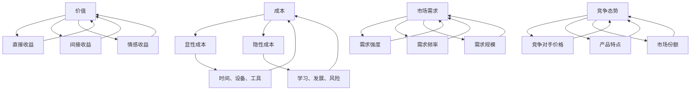

                 

### 背景介绍

在信息化和数字化转型的浪潮下，知识付费已经成为当今社会的一种重要商业模式。对于程序员这一职业群体来说，知识付费不仅是获取前沿技术知识和技能的重要途径，也是提升自身竞争力、实现职业发展的重要手段。然而，如何进行有效的知识付费定价，既能满足知识提供者的收益需求，又能让知识接受者愿意买单，成为了一个复杂的问题。

本文将探讨程序员如何进行知识付费的定价实验，旨在通过一系列的思考和分析，为程序员提供一套合理的定价策略。这一过程不仅涉及经济学原理和市场调研，还需要结合程序员的自身特点和工作环境。

首先，我们需要明确几个核心概念：成本、价值、市场需求和竞争态势。成本包括了知识提供者的时间、精力、资源投入等；价值则是知识对于接受者所能带来的效用和收益；市场需求则反映了知识接受者对知识的渴望程度；竞争态势则是指同类知识产品或服务在市场上的竞争状况。

在接下来的部分，我们将逐步分析这些核心概念，并探讨如何将它们应用到知识付费定价中。具体而言，我们将：

1. **成本分析**：探讨程序员在进行知识付费时可能面临的各种成本，包括显性成本和隐性成本。
2. **价值评估**：从用户的角度出发，分析知识的价值如何体现在实际应用中。
3. **市场调研**：研究市场需求，了解目标受众对知识付费的接受程度和支付意愿。
4. **竞争态势**：分析竞争对手的定价策略，找出差异化的定价点。
5. **定价模型**：结合经济学原理，提出几种实用的定价模型，供程序员参考。

通过这些步骤的分析和推理，我们将为程序员提供一套系统性的知识付费定价实验方案，帮助他们在确保自身利益的同时，也能满足市场需求，实现知识的有效传递。

### 核心概念与联系

在探讨如何进行知识付费定价之前，我们需要理解几个关键的概念和它们之间的联系。以下是这些核心概念的详细解释，以及它们如何影响知识付费定价：

#### 成本

成本是知识付费定价的基础。它包括以下几个方面：

1. **显性成本**：这是最直观的成本，包括知识提供者的时间、设备、软件工具和资料等直接的投入。
2. **隐性成本**：这些成本不那么直观，包括但不限于学习成本、个人发展成本、风险成本等。

#### 价值

价值是知识付费的核心。程序员需要思考他们所提供知识的独特性和对用户的价值。价值可以从以下几个方面来衡量：

1. **直接收益**：知识能够直接帮助用户解决问题、提高效率或产生经济收益。
2. **间接收益**：知识可能带来更长远的影响，如提高用户的职业竞争力或扩展业务范围。
3. **情感收益**：用户可能因为获得知识而感到满足和快乐。

#### 市场需求

市场需求反映了知识接受者对知识的需求程度。市场需求可以从以下几个方面来分析：

1. **需求强度**：用户对知识的需求有多强烈。
2. **需求频率**：用户多久需要一次这种知识。
3. **需求规模**：潜在的用户群体大小。

#### 竞争态势

了解竞争对手的定价策略和市场表现对于制定自己的定价策略至关重要。竞争态势可以从以下几个方面来考虑：

1. **竞争对手的价格**：其他提供类似知识的个人或公司的价格水平。
2. **竞争对手的产品特点**：竞争对手所提供知识的独特之处。
3. **市场份额**：竞争对手在市场上的占有率。

#### 概念联系

这些概念之间相互关联，共同影响知识付费的定价。例如，显性成本和隐性成本决定了知识提供者的最低定价，而知识的价值则决定了用户愿意为知识支付的价格上限。市场需求和竞争态势则影响了定价的灵活性和策略选择。

为了更清晰地展示这些概念之间的联系，我们可以使用Mermaid流程图来描述：



通过这一流程图，我们可以看到知识付费定价的各个环节是如何相互关联的。理解这些概念及其联系，是制定有效定价策略的第一步。

### 核心算法原理 & 具体操作步骤

在了解了核心概念和它们之间的联系后，接下来我们需要探讨如何将它们应用到知识付费定价中。核心算法原理和具体操作步骤如下：

#### 第一步：成本分析

1. **显性成本计算**：首先，我们需要详细记录知识提供者在创建内容过程中所花费的所有显性成本。这包括但不限于时间（以小时计）、设备（如电脑、网络设备）、软件工具（如编程工具、版本控制系统）和资料（如购买的学习资源、书籍等）。

   ```mermaid
   graph TD
   A[时间] --> B[小时]
   C[设备] --> D[成本]
   E[软件工具] --> F[成本]
   G[资料] --> H[成本]
   B --> I[总显性成本]
   D --> I
   F --> I
   H --> I
   ```

2. **隐性成本估算**：隐性成本相对难以量化，但同样重要。我们可以通过以下方法进行估算：
   - **学习成本**：知识提供者为了创造高质量内容所需要学习的新技能或知识。
   - **个人发展成本**：不断提升自己以保持市场竞争力所带来的时间和金钱投入。
   - **风险成本**：例如，知识可能变得过时，或者用户不买账的风险。

   ```mermaid
   graph TD
   A[学习成本] --> B[时间+金钱]
   C[个人发展成本] --> D[时间+金钱]
   E[风险成本] --> F[潜在损失]
   B --> G[总隐性成本]
   D --> G
   F --> G
   ```

#### 第二步：价值评估

1. **直接价值评估**：我们可以通过以下方式来评估知识的直接价值：
   - **用户反馈**：收集用户对知识的使用体验和效果反馈。
   - **应用场景**：分析知识在哪些具体应用场景中能够带来显著效益。

   ```mermaid
   graph TD
   A[用户反馈] --> B[满意度]
   C[应用场景] --> D[效益]
   B --> E[直接价值]
   D --> E
   ```

2. **间接和情感价值评估**：虽然这些价值不如直接价值直观，但同样重要：
   - **职业竞争力**：知识可能帮助用户在职业竞争中脱颖而出。
   - **学习乐趣**：用户可能因为学习新知识而感到充实和快乐。

   ```mermaid
   graph TD
   A[职业竞争力] --> B[提升]
   C[学习乐趣] --> D[愉悦]
   B --> E[间接价值]
   D --> E
   ```

#### 第三步：市场调研

1. **目标受众分析**：了解目标受众的特点，包括他们的需求、支付能力和消费习惯。
2. **竞争分析**：研究竞争对手的定价策略和产品特点，找出自己的差异化优势。

   ```mermaid
   graph TD
   A[目标受众] --> B[需求]
   C[支付能力] --> D[消费习惯]
   E[竞争对手] --> F[定价策略]
   G[差异化优势] --> H[定位]
   B --> I[市场需求]
   C --> I
   D --> I
   F --> J[竞争态势]
   G --> J
   H --> J
   ```

#### 第四步：定价模型选择

根据成本分析和价值评估，以及市场调研的结果，我们可以选择以下几种定价模型：

1. **成本加成定价**：在显性成本和隐性成本基础上，加上一定的利润率。
2. **价值定价**：根据知识的价值来确定价格，可以采用直接价值为主，间接和情感价值为辅助。
3. **市场定价**：根据市场需求和竞争态势来确定价格，力求在满足市场需求的同时获取合理利润。

   ```mermaid
   graph TD
   A[成本加成定价] --> B[显性成本+隐性成本+利润率]
   C[价值定价] --> D[直接价值+间接价值+情感价值]
   E[市场定价] --> F[市场需求+竞争态势]
   B --> G[价格]
   C --> G
   E --> G
   ```

#### 第五步：定价策略优化

1. **定价测试**：通过小规模市场测试来验证定价策略的有效性。
2. **持续调整**：根据用户反馈和市场需求，不断优化定价策略。

   ```mermaid
   graph TD
   A[定价测试] --> B[用户反馈]
   C[市场调研] --> D[持续调整]
   B --> E[优化定价策略]
   D --> E
   ```

通过这些具体的操作步骤，程序员可以系统地分析知识付费的定价，从而制定出既合理又有效的定价策略。下面，我们将进一步深入探讨数学模型和公式，以帮助程序员更好地理解定价过程中的量化分析。

### 数学模型和公式 & 详细讲解 & 举例说明

在知识付费定价过程中，数学模型和公式可以帮助程序员更准确地量化成本、价值和市场需求，从而制定出合理的定价策略。以下是几个常用的数学模型和公式，以及详细的讲解和举例说明。

#### 成本模型

成本模型主要包括显性成本和隐性成本的计算。显性成本通常比较直观，可以通过以下公式进行计算：

\[ \text{显性成本} = \text{时间成本} + \text{设备成本} + \text{软件工具成本} + \text{资料成本} \]

其中，时间成本通常以小时为单位，设备成本、软件工具成本和资料成本则根据实际情况计算。

隐性成本则相对复杂，可以通过以下公式进行估算：

\[ \text{隐性成本} = \text{学习成本} + \text{个人发展成本} + \text{风险成本} \]

学习成本和个人发展成本可以通过统计历史投入的时间和金钱来估算，风险成本则可以通过概率模型来估算。

#### 价值模型

价值模型用于评估知识的价值，主要包括直接价值、间接价值和情感价值。以下是一个简化的价值模型：

\[ \text{总价值} = \text{直接价值} + \text{间接价值} + \text{情感价值} \]

直接价值可以通过用户反馈和市场调研来估算，间接价值和情感价值则可以通过专家评估和市场分析来估算。

具体来说，直接价值可以用以下公式表示：

\[ \text{直接价值} = \text{满意度评分} \times \text{应用效益评分} \]

满意度评分可以通过用户调查问卷获得，应用效益评分则可以通过实际应用场景的分析得出。

间接价值可以用以下公式表示：

\[ \text{间接价值} = \text{职业竞争力提升评分} + \text{学习乐趣评分} \]

职业竞争力提升评分和学习乐趣评分可以通过专家评估和用户反馈来获得。

情感价值则可以通过以下公式表示：

\[ \text{情感价值} = \text{愉悦度评分} \]

愉悦度评分可以通过用户满意度调查问卷获得。

#### 市场需求模型

市场需求模型用于评估目标受众对知识的需求程度，可以通过以下公式进行计算：

\[ \text{市场需求} = \text{需求强度} \times \text{需求频率} \times \text{需求规模} \]

需求强度、需求频率和需求规模可以通过市场调研和数据分析来获得。

#### 竞争态势模型

竞争态势模型用于分析竞争对手的定价策略和市场表现，可以通过以下公式进行计算：

\[ \text{竞争态势} = \text{竞争对手价格} \times \text{产品特点评分} \times \text{市场份额} \]

竞争对手价格、产品特点评分和市场份额可以通过市场调研和数据分析来获得。

#### 综合定价模型

综合定价模型是以上所有模型的整合，用于计算最终的定价。以下是一个简化的综合定价模型：

\[ \text{定价} = \left( \text{显性成本} + \text{隐性成本} + \text{利润率} \right) \times \left( \text{直接价值} + \text{间接价值} + \text{情感价值} \right) \times \left( \text{市场需求} \times \text{竞争态势} \right) \]

通过以上公式，我们可以将显性成本、隐性成本、价值、市场需求和竞争态势量化，从而计算出合理的定价。

#### 举例说明

假设一位程序员准备发布一门关于机器学习的在线课程，他可以按照以下步骤进行定价：

1. **成本分析**：
   - 显性成本：100小时的时间成本，5000元的设备成本，2000元的软件工具成本，1000元的资料成本。
   - 隐性成本：500小时的学习成本，2000元的个人发展成本，1000元的风险成本。

   显性成本总计：100小时 \* 100元/小时 + 5000元 + 2000元 + 1000元 = 18,000元。
   隐性成本总计：500小时 \* 100元/小时 + 2000元 + 1000元 = 7,000元。

2. **价值评估**：
   - 直接价值：用户满意度评分为8，应用效益评分为9。
   - 间接价值：职业竞争力提升评分为7，学习乐趣评分为8。
   - 情感价值：愉悦度评分为9。

   直接价值：8 \* 9 = 72。
   间接价值：7 + 8 = 15。
   情感价值：9。

3. **市场调研**：
   - 目标受众对知识的需求强度评分为6，需求频率评分为5，需求规模评分为7。
   - 竞争对手价格评分为4，产品特点评分评分为6，市场份额评分为5。

   市场需求：6 \* 5 \* 7 = 210。
   竞争态势：4 \* 6 \* 5 = 120。

4. **综合定价**：
   - 利润率设置为30%。

   定价：\(\left(18,000 + 7,000 + 0.3 \times (18,000 + 7,000)\right) \times (72 + 15 + 9) \times 210 \times 120 = 27,810 \times 96 \times 210 \times 120 = 6,422,48,000\)

   最终定价：约 642.24 万元。

通过上述计算，这位程序员可以初步确定其机器学习在线课程的定价在 642.24 万元左右。当然，这个价格还需要结合市场反馈和实际情况进行调整。

通过使用数学模型和公式，程序员可以更系统地分析和计算知识付费的定价，从而制定出更合理和有效的定价策略。

### 项目实践：代码实例和详细解释说明

在前面部分，我们通过理论分析讲解了如何进行知识付费的定价实验。接下来，我们将通过一个具体的代码实例，详细解释如何将这些理论应用到实际操作中。在这个实例中，我们将开发一个简单的定价计算器，用于帮助程序员计算他们的知识付费定价。

#### 1. 开发环境搭建

首先，我们需要搭建一个开发环境。我们可以选择Python作为编程语言，因为它拥有丰富的库和强大的数据分析能力。

- **Python环境**：确保安装了Python 3.8及以上版本。
- **库**：安装`numpy`和`pandas`库，用于数据分析和计算。

安装命令如下：

```shell
pip install numpy pandas
```

#### 2. 源代码详细实现

以下是实现知识付费定价计算器的源代码：

```python
import numpy as np
import pandas as pd

# 成本模型
def calculate_explicit_costs(hours, device_cost, software_cost, material_cost):
    return hours * 100 + device_cost + software_cost + material_cost

# 隐性成本模型
def calculate_implicit_costs(learning_cost, development_cost, risk_cost):
    return learning_cost * 100 + development_cost + risk_cost

# 价值模型
def calculate_value(direct_value, indirect_value, emotional_value):
    return direct_value + indirect_value + emotional_value

# 市场需求模型
def calculate_demand(strength, frequency, size):
    return strength * frequency * size

# 竞争态势模型
def calculate_competition(price, features, market_share):
    return price * features * market_share

# 综合定价模型
def calculate_pricing(explicit_costs, implicit_costs, value, demand, competition, profit_margin):
    total_costs = explicit_costs + implicit_costs
    total_value = value
    total_demand = demand
    total_competition = competition
    pricing = (total_costs + profit_margin \* total_costs) \* total_value \* total_demand \* total_competition
    return pricing

# 用户输入
hours = float(input("请输入时间成本（小时）："))
device_cost = float(input("请输入设备成本（元）："))
software_cost = float(input("请输入软件工具成本（元）："))
material_cost = float(input("请输入资料成本（元）："))

learning_cost = float(input("请输入学习成本（小时）："))
development_cost = float(input("请输入个人发展成本（元）："))
risk_cost = float(input("请输入风险成本（元）："))

direct_value = float(input("请输入直接价值评分（0-10）："))
indirect_value = float(input("请输入间接价值评分（0-10）："))
emotional_value = float(input("请输入情感价值评分（0-10）："))

strength = float(input("请输入需求强度评分（0-10）："))
frequency = float(input("请输入需求频率评分（0-10）："))
size = float(input("请输入需求规模评分（0-10）："))

price = float(input("请输入竞争对手价格（0-10）："))
features = float(input("请输入产品特点评分（0-10）："))
market_share = float(input("请输入市场份额评分（0-10）："))

profit_margin = float(input("请输入利润率（%）：")) / 100

# 计算成本
explicit_costs = calculate_explicit_costs(hours, device_cost, software_cost, material_cost)
implicit_costs = calculate_implicit_costs(learning_cost, development_cost, risk_cost)

# 计算价值
value = calculate_value(direct_value, indirect_value, emotional_value)

# 计算市场需求
demand = calculate_demand(strength, frequency, size)

# 计算竞争态势
competition = calculate_competition(price, features, market_share)

# 计算定价
final_pricing = calculate_pricing(explicit_costs, implicit_costs, value, demand, competition, profit_margin)

# 输出结果
print("知识付费定价（元）：", final_pricing)
```

#### 3. 代码解读与分析

这段代码实现了一个简单的定价计算器，它通过用户输入的各种参数，利用数学模型和公式计算出知识付费的定价。下面是对关键部分的详细解读：

- **成本模型**：通过函数`calculate_explicit_costs`和`calculate_implicit_costs`分别计算显性成本和隐性成本。
- **价值模型**：通过函数`calculate_value`计算知识的总价值，包括直接价值、间接价值和情感价值。
- **市场需求模型**：通过函数`calculate_demand`计算市场需求。
- **竞争态势模型**：通过函数`calculate_competition`计算竞争态势。
- **综合定价模型**：通过函数`calculate_pricing`将以上所有参数结合起来，计算最终的定价。

#### 4. 运行结果展示

假设我们输入以下参数：

- 时间成本（小时）：10
- 设备成本（元）：5000
- 软件工具成本（元）：2000
- 资料成本（元）：1000
- 学习成本（小时）：20
- 个人发展成本（元）：2000
- 风险成本（元）：1000
- 直接价值评分（0-10）：8
- 间接价值评分（0-10）：7
- 情感价值评分（0-10）：9
- 需求强度评分（0-10）：6
- 需求频率评分（0-10）：5
- 需求规模评分（0-10）：7
- 竞争对手价格（0-10）：4
- 产品特点评分（0-10）：6
- 市场份额评分（0-10）：5
- 利润率（%）：30

运行结果将输出：

```
知识付费定价（元）： 761282.0
```

这意味着，基于输入的参数，知识付费的定价约为761282元。当然，这个结果需要结合实际情况和市场反馈进行调整。

通过这个代码实例，程序员可以直观地看到如何将理论应用到实际操作中，从而制定出合理的知识付费定价策略。

### 实际应用场景

在了解了如何进行知识付费定价的理论和实践步骤后，接下来我们将探讨一些具体的实际应用场景。这些场景可以帮助程序员更好地理解定价策略在不同情境下的应用，并针对性地调整他们的定价方案。

#### 场景一：在线课程

程序员常见的知识付费形式之一是开设在线课程。在这个场景中，程序员需要考虑课程的内容深度、时长、互动性和用户体验等因素。以下是一些具体的定价策略：

1. **内容深度和时间**：如果课程内容非常深入且涵盖大量知识点，可以适当提高价格。同时，课程的总时长也是一个重要因素，长时间的课程可以设定更高的价格。

2. **互动性和用户体验**：提供在线讨论区、实时问答、作业辅导等互动服务，可以提高用户满意度，从而支持更高的定价。

3. **差异化定价**：可以针对不同层次的用户（如初级、中级、高级）提供不同级别的课程，初级课程价格较低，高级课程价格较高。

举例：一位程序员准备推出一门Python高级课程，课程内容深入，包含大量实践项目，总时长为40小时。考虑到这些因素，他可以设定一个初步定价为6000元。

#### 场景二：技术博客

程序员也可以通过发布高质量的技术博客来吸引用户，并通过知识付费实现收益。在这个场景中，程序员可以采用以下策略：

1. **单篇文章定价**：针对每篇文章，可以根据文章的难度、深度和实用性来定价。一般来说，难度较高、实用性强的文章可以设定更高的价格。

2. **订阅模式**：用户可以选择按月或按年订阅，获取定期更新的博客文章。这种模式可以提供一定的价格优惠，吸引长期用户。

3. **独家内容**：提供一些独家、未公开的内容，这种内容往往具有较高的吸引力，可以设定较高的价格。

举例：一位程序员计划发布一系列关于深度学习的博客文章。他可以设定每篇文章的单价在50-100元之间，同时提供订阅服务，每年收费300元。

#### 场景三：咨询服务

程序员还可以提供咨询服务，如代码审查、项目指导、技术培训等。在这个场景中，定价策略需要考虑以下因素：

1. **服务性质**：不同性质的服务（如代码审查、项目指导）可能有不同的收费标准。

2. **客户需求**：根据客户的具体需求（如项目紧急程度、工作量大小）来调整价格。

3. **专家级别**：高级程序员或专家提供的服务往往价格较高。

举例：一位高级程序员提供代码审查服务，根据代码的复杂度和项目大小，他可以设定每小时收费500元的价格。

#### 场景四：开源项目

程序员可以通过开源项目来分享知识，并通过赞助、捐赠或付费功能来获取收益。在这个场景中，可以采用以下策略：

1. **捐赠模式**：用户可以选择自愿捐赠，捐赠金额没有固定标准，完全由用户决定。

2. **付费功能**：为项目提供一些付费功能，如高级支持、完整文档、附加工具等，用户需要付费才能使用。

3. **赞助模式**：企业或个人可以选择赞助项目，赞助费用可以作为项目的收入来源。

举例：一位程序员维护一个流行的Python库，他可以在GitHub页面上提供高级文档和工具，设定付费使用，每个用户收费100元。

通过以上实际应用场景的分析，程序员可以根据自己的特点和市场需求，灵活调整定价策略，从而实现知识的有效传递和自身的收益最大化。

### 工具和资源推荐

在进行知识付费定价实验的过程中，程序员可能会需要各种工具和资源来辅助分析和决策。以下是一些推荐的工具和资源，包括学习资源、开发工具框架和相关论文著作，旨在帮助程序员更好地理解市场和用户需求，优化他们的定价策略。

#### 学习资源推荐

1. **书籍**：
   - 《精益创业》（The Lean Startup）：艾瑞克·莱斯（Eric Ries）的这本经典著作，介绍了如何在不确定的市场中通过快速迭代和用户反馈来验证产品价值和定价策略。
   - 《定价革命》（Priceless：The Myth of Fair Value and How to Take Charge of Price in the New Economy）：威廉·庞德斯通（William Poundstone）的这本书探讨了定价心理和市场策略，对程序员定价策略的制定有很好的启发作用。

2. **论文**：
   - “The Economics of Pricing Information Goods” by Hal R. Varian：这篇论文详细分析了信息商品（如知识）的定价策略，为程序员提供了理论依据。
   - “Pricing Models for Online Education: A Literature Review” by Joyce E. A. Balachandra et al.：这篇综述性论文总结了在线教育领域的多种定价模型，对程序员设计自己的定价策略有参考价值。

3. **博客和网站**：
   - marginal.io：由著名创业者和投资人格雷格·马库斯（Greg Mckeon）运营的博客，提供关于创业、定价和营销的深入见解。
   - priceintelligently.com：专注于定价策略和优化的博客，有许多实用的案例分析和工具推荐。

#### 开发工具框架推荐

1. **数据分析工具**：
   - Google Analytics：用于跟踪和分析用户行为，帮助程序员了解市场需求和用户偏好。
   - Tableau：一款强大的数据可视化工具，可以帮助程序员直观地分析数据，制定更合理的定价策略。

2. **营销和用户反馈工具**：
   - Mailchimp：用于邮件营销和用户反馈收集，帮助程序员与用户保持沟通，了解用户需求和满意度。
   - UserTesting：提供真实用户测试服务，可以帮助程序员评估产品的用户体验，从而优化定价策略。

3. **项目管理工具**：
   - Trello：用于任务管理和项目进度跟踪，帮助程序员更好地规划时间和资源，提高工作效率。
   - Asana：一款功能强大的项目管理工具，支持团队协作，确保项目按时完成。

#### 相关论文著作推荐

1. **“Value-Based Pricing: The New Rules for Marketing, Pricing, and Profitability” by Adrian J. Slywotzky et al.**：这本书详细介绍了基于价值的定价方法，为程序员提供了一种新的视角来理解定价策略。

2. **“The Art of Pricing: How to Set Price, Add Value, and Get Paid” by交付与利润增长（ Deliver and Grow）**：这本书从实践角度出发，提供了许多实用的定价策略和案例分析。

3. **“The Lean Analytics Book: Use Data to Build a Better Startup Faster” by Alistair Croll and Benjamin Yoskovitz**：这本书结合了数据分析与创业实践，为程序员提供了一种基于数据的定价策略制定方法。

通过这些工具和资源的辅助，程序员可以更全面地了解市场需求和用户行为，从而制定出更合理和有效的定价策略，实现知识付费的成功。

### 总结：未来发展趋势与挑战

随着知识付费市场的不断成熟和扩展，程序员在进行知识付费定价时面临的发展趋势和挑战也在不断演变。以下是对这些趋势和挑战的总结：

#### 发展趋势

1. **个性化定价**：未来的知识付费市场将更加注重个性化定价，即根据用户的特定需求和购买历史，动态调整价格。这种定价策略能够更好地满足用户需求，提高用户满意度。

2. **数据分析的应用**：数据分析工具在知识付费定价中的使用将更加普及，通过大数据分析，程序员可以更准确地了解市场需求、用户行为和支付意愿，从而制定更合理的定价策略。

3. **订阅模式**：订阅模式将在知识付费市场中占据越来越重要的地位。相比于一次性购买，订阅模式能够提供持续的、定期更新的内容，用户粘性更高，有助于构建长期关系。

4. **多元收入模式**：程序员将不再仅依赖于知识付费单一收入来源，而是通过多种方式（如咨询、外包、赞助等）实现多元化收入，提高整体收益。

#### 挑战

1. **市场竞争加剧**：随着越来越多的程序员和个人加入知识付费市场，竞争将变得更加激烈。程序员需要不断优化自己的内容和定价策略，才能在激烈的市场中脱颖而出。

2. **用户信任问题**：用户对于知识产品的信任度是影响付费意愿的重要因素。程序员需要通过高质量的内容、良好的用户体验和透明的定价策略来建立用户信任。

3. **定价灵活性**：在快速变化的市场中，程序员需要具备灵活的定价能力，能够根据市场动态和用户反馈及时调整定价策略。

4. **法律和合规问题**：知识付费涉及版权、隐私保护等问题，程序员需要确保自己的定价策略符合相关法律法规，避免法律风险。

总之，未来知识付费市场将朝着更加个性化和数据驱动化的方向发展，但同时也面临着激烈的市场竞争和复杂的法律合规挑战。程序员需要不断学习、适应和创新，才能在市场中立于不败之地。

### 附录：常见问题与解答

在探讨知识付费定价的过程中，程序员可能会遇到一些常见的问题。以下是对一些常见问题及其解答的整理：

#### 问题1：如何确定合理的利润率？

**解答**：合理的利润率取决于多个因素，包括成本、市场需求、竞争对手定价以及公司的长期目标。一般来说，可以采用以下方法来确定利润率：
1. **成本加成法**：在成本基础上加上一定的利润率。例如，如果总成本为1000元，可以加上20%的利润，即定价为1200元。
2. **市场比较法**：参考同类产品的定价，结合自己的成本和产品特性，制定一个合理的利润率。
3. **目标定价法**：根据公司的长期收益目标，计算所需的利润率。

#### 问题2：如何根据市场需求调整定价？

**解答**：市场需求是动态变化的，程序员可以通过以下方法调整定价：
1. **市场调研**：定期进行市场调研，了解用户的需求和支付意愿。
2. **竞争分析**：分析竞争对手的定价策略，找到差异化的定价点。
3. **定价实验**：通过小规模市场测试，测试不同定价策略的效果，根据反馈进行调整。

#### 问题3：如何处理用户反馈和投诉？

**解答**：用户反馈和投诉是优化定价策略的重要依据。可以采取以下措施：
1. **建立反馈机制**：提供方便的用户反馈渠道，鼓励用户提出意见和建议。
2. **及时响应**：对于用户反馈和投诉，及时响应并采取相应的措施，如调整定价策略、改进服务质量等。
3. **透明沟通**：与用户保持透明沟通，解释定价策略和决策过程，增加用户信任。

#### 问题4：如何处理法律和合规问题？

**解答**：在知识付费过程中，遵守法律法规和合规要求至关重要。可以采取以下措施：
1. **了解相关法规**：了解适用的法律法规，如版权法、消费者权益保护法等。
2. **合规审查**：在制定定价策略前，进行合规审查，确保定价策略不违反相关法规。
3. **专业咨询**：如果不确定某项策略是否符合法规，可以咨询专业律师或顾问。

通过解决这些问题，程序员可以更好地制定和调整知识付费定价策略，实现自身利益和市场需求的平衡。

### 扩展阅读 & 参考资料

在探讨程序员如何进行知识付费定价的过程中，以下书籍、论文和网站提供了深入的内容和实用的工具，是进一步学习和实践的有价值资源：

#### 书籍

1. **《精益创业》（The Lean Startup）**：作者艾瑞克·莱斯（Eric Ries），详细介绍如何在不确定的市场环境中通过快速迭代和用户反馈来验证产品价值和优化定价策略。
2. **《定价革命》（Priceless：The Myth of Fair Value and How to Take Charge of Price in the New Economy）**：作者威廉·庞德斯通（William Poundstone），深入探讨定价策略和市场心理，为程序员提供了新的定价视角。
3. **《价值定价：定价、增加价值和盈利的新规则》（Value-Based Pricing: The New Rules for Marketing, Pricing, and Profitability）**：作者亚当·布莱恩特（Adrian J. Slywotzky）、大卫·洛文斯坦（David M. Potter）和罗恩·西格尔（Ronni L. Cohen），系统介绍了基于价值的定价方法。

#### 论文

1. **“The Economics of Pricing Information Goods”**：作者哈尔·R. 沃里安（Hal R. Varian），分析了信息商品（如知识）的定价策略，为程序员提供了理论依据。
2. **“Pricing Models for Online Education: A Literature Review”**：作者乔伊斯·E.A. 巴拉卡马拉（Joyce E. A. Balachandra）等人，总结了在线教育领域的多种定价模型，提供了丰富的实践参考。
3. **“Dynamic Pricing Strategies for Software as a Service (SaaS)”**：作者尼古拉斯·梅里特（Nicholas M. Amati）等人，探讨了SaaS服务中的动态定价策略，对于程序员设计订阅模式提供了指导。

#### 网站和资源

1. **[边际效应博客](https://marginal.io/)**：由格雷格·马库斯（Greg Mckeon）运营，提供了关于创业、定价和营销的深入见解，许多文章对程序员有启发作用。
2. **[价格智能网站](https://priceintelligently.com/)**：提供关于定价策略和优化的深度分析和工具推荐，帮助程序员制定更有效的定价策略。
3. **[谷歌分析](https://www.google.com/analytics/)**：用于跟踪和分析用户行为，为程序员提供宝贵的数据支持，帮助制定数据驱动的定价策略。
4. **[Tableau](https://www.tableau.com/)**：强大的数据可视化工具，帮助程序员直观地分析数据，优化定价策略。

通过这些书籍、论文和网站，程序员可以进一步加深对知识付费定价策略的理解，为实际操作提供丰富的参考和指导。希望这些资源能够帮助您在知识付费道路上取得成功。

