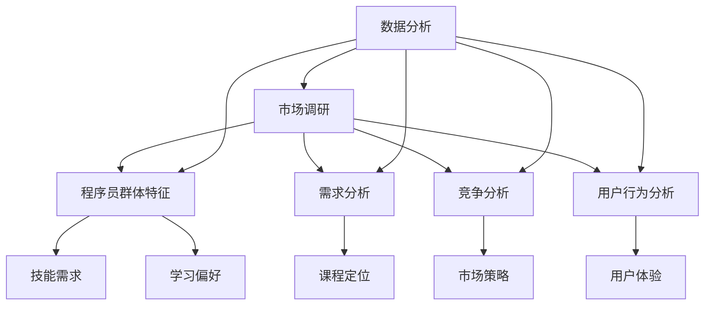
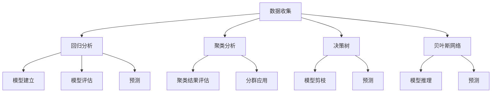
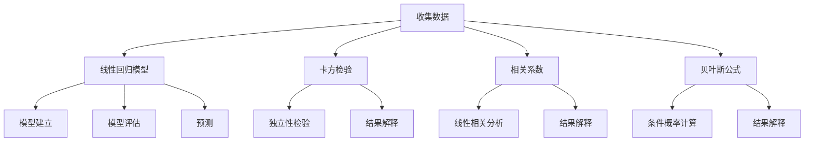

                 

### 1. 背景介绍

知识付费作为近年来快速崛起的市场现象，正逐渐改变人们获取信息和学习的传统方式。在信息技术高度发达的今天，程序员作为知识付费的重要参与群体，其市场调研显得尤为重要。程序员的知识付费不仅有助于提升个人的技能水平，还能为整个行业带来新的发展机遇。

程序员进行知识付费的市场调研，旨在了解以下几个关键点：

- **市场需求分析**：通过调研了解程序员在哪些领域、技能和知识点上存在学习需求，从而为知识付费产品提供精准定位。
- **竞争对手分析**：分析市场上的主流知识付费平台和产品，了解他们的优势和劣势，为自身产品的开发提供参考。
- **用户行为分析**：深入挖掘程序员的消费习惯和偏好，优化知识付费产品的用户体验。
- **市场趋势预测**：通过分析历史数据和行业动态，预测未来知识付费市场的发展趋势，为企业决策提供数据支持。

本文将从以下几个方面展开，以深入探讨程序员如何进行知识付费的市场调研：

- **市场调研的核心概念与联系**
- **核心算法原理与具体操作步骤**
- **数学模型与公式**
- **项目实践：代码实例与详细解释**
- **实际应用场景**
- **工具和资源推荐**
- **总结：未来发展趋势与挑战**

希望通过本文的详细分析和讲解，能为程序员朋友们在知识付费领域的市场调研提供一些有益的思路和参考。

### 2. 核心概念与联系

在深入探讨程序员如何进行知识付费的市场调研之前，我们需要先理解一些核心概念，并展示其相互联系。以下是一些关键概念及其在知识付费市场调研中的重要性：

**2.1 市场调研**

市场调研是系统地收集、记录、分析和解释与市场相关的信息，以帮助企业和组织做出更明智的商业决策。在知识付费领域，市场调研有助于了解目标受众的需求、行业趋势和竞争对手情况。

**2.2 程序员群体特征**

程序员的群体特征包括技术背景、职业发展阶段、学习偏好等。这些特征决定了他们对知识付费产品的需求，是市场调研的重要基础。

**2.3 需求分析**

需求分析是指识别和分析用户的需求，以确定产品或服务的目标市场和定位。在知识付费市场，需求分析有助于发现用户在技能提升和学习资源方面的具体需求。

**2.4 竞争分析**

竞争分析涉及研究竞争对手的市场策略、产品和服务，以及他们的市场表现。这对于开发者来说，有助于了解市场格局，制定有效的竞争策略。

**2.5 用户行为分析**

用户行为分析是指通过分析用户的行为数据来了解他们的需求、偏好和习惯。对于知识付费产品，这有助于优化产品设计，提高用户满意度和忠诚度。

**2.6 数据分析**

数据分析是市场调研的核心工具，涉及使用统计方法和数据分析技术来解释和预测数据。在知识付费市场调研中，数据分析可以帮助识别趋势、评估市场潜力和预测未来需求。

为了更直观地展示这些核心概念之间的联系，我们可以使用Mermaid流程图来描述它们：



上述流程图展示了市场调研如何通过分析程序员群体特征、需求、竞争和用户行为等关键因素，来指导知识付费产品的开发和优化。每个环节都紧密相连，共同构成一个完整的市场调研流程。

### 3. 核心算法原理 & 具体操作步骤

在程序员进行知识付费的市场调研中，核心算法原理发挥着至关重要的作用。这些算法不仅能帮助我们分析海量数据，还能提供精准的市场预测和用户行为洞察。以下是几个核心算法的原理及其在市场调研中的应用步骤：

#### 3.1 回归分析

**原理**：回归分析是一种用于分析变量之间相互关系的统计方法，主要用于预测一个或多个自变量对因变量的影响。在知识付费市场调研中，回归分析可以用来预测用户对某种课程的需求量。

**具体操作步骤**：

1. **数据收集**：收集用户学习行为、职业背景、技能水平等数据。
2. **变量选择**：确定自变量（如用户技能水平、学习时长等）和因变量（如课程需求量）。
3. **模型建立**：使用最小二乘法建立线性回归模型，如 Y = b0 + b1*X1 + ... + bn*Xn。
4. **模型评估**：通过R平方（R²）等指标评估模型拟合程度。
5. **预测**：利用模型进行预测，预测未来某一时期课程需求量。

#### 3.2 聚类分析

**原理**：聚类分析是一种无监督学习算法，用于将相似的数据点分组到不同的簇中。在知识付费市场调研中，聚类分析可以用于用户分群，以便更好地理解用户特征和需求。

**具体操作步骤**：

1. **数据预处理**：清洗数据，去除缺失值和异常值。
2. **特征选择**：选择对用户行为有显著影响的关键特征。
3. **聚类方法选择**：选择合适的聚类算法，如K-means、层次聚类等。
4. **聚类结果评估**：通过内部评估指标（如轮廓系数）评估聚类效果。
5. **分群应用**：根据聚类结果对用户进行分群，为每个分群提供个性化的课程推荐。

#### 3.3 决策树

**原理**：决策树是一种用于分类和回归的树形结构模型，通过一系列规则来分割数据，最终生成一个预测模型。在知识付费市场调研中，决策树可以用于分析用户购买行为的影响因素。

**具体操作步骤**：

1. **数据准备**：收集用户购买行为、课程信息等数据。
2. **特征选择**：选择对购买行为有显著影响的特征。
3. **模型建立**：通过ID3、C4.5等算法建立决策树模型。
4. **模型剪枝**：通过剪枝等方法优化模型复杂度。
5. **预测**：利用决策树模型预测新用户是否购买课程。

#### 3.4 贝叶斯网络

**原理**：贝叶斯网络是一种概率图模型，用于表示变量之间的条件依赖关系。在知识付费市场调研中，贝叶斯网络可以用于分析用户行为和购买决策的概率分布。

**具体操作步骤**：

1. **数据收集**：收集用户行为、购买历史等数据。
2. **模型建立**：构建贝叶斯网络结构，确定变量之间的依赖关系。
3. **参数估计**：使用最大似然估计或贝叶斯估计方法估计网络参数。
4. **推理**：通过贝叶斯推理计算变量的条件概率分布。
5. **预测**：利用贝叶斯网络进行用户行为和购买决策的预测。

通过这些核心算法的应用，程序员可以更深入地理解知识付费市场的需求和趋势，为产品开发和市场策略提供有力支持。以下是这些算法在实际操作中的示例：



这个流程图展示了核心算法在市场调研中的应用步骤，以及它们如何相互协作，共同为知识付费产品的开发和优化提供支持。

### 4. 数学模型和公式 & 详细讲解 & 举例说明

在知识付费的市场调研中，数学模型和公式扮演着至关重要的角色，它们不仅能够帮助我们理解和解释数据，还能指导我们的决策过程。以下将详细介绍几个关键的数学模型和公式，并给出相应的详细讲解和实际应用举例。

#### 4.1 线性回归模型

线性回归模型是一种用于分析变量之间线性关系的统计模型。其基本公式如下：

\[ Y = b_0 + b_1 \cdot X_1 + b_2 \cdot X_2 + ... + b_n \cdot X_n \]

其中，\( Y \) 是因变量，\( X_1, X_2, ..., X_n \) 是自变量，\( b_0, b_1, b_2, ..., b_n \) 是回归系数。

**详细讲解**：

- **回归系数**：表示自变量对因变量的影响程度。
- **截距**：表示当所有自变量为零时的因变量值。

**举例说明**：

假设我们要预测程序员对某门课程的需求量（因变量Y），影响因素包括编程经验（自变量X1）和学习时间（自变量X2）。我们可以使用线性回归模型：

\[ Y = b_0 + b_1 \cdot X_1 + b_2 \cdot X_2 \]

通过收集数据并使用最小二乘法求解回归系数，得到预测模型。

#### 4.2 卡方检验

卡方检验是一种用于测试变量之间独立性的统计方法，其基本公式如下：

\[ \chi^2 = \sum \frac{(O - E)^2}{E} \]

其中，\( O \) 是观察频数，\( E \) 是期望频数。

**详细讲解**：

- **观察频数**：实际观测到的频数。
- **期望频数**：基于独立性的假设计算出的频数。

**举例说明**：

假设我们要分析程序员学习编程语言A和学习编程语言B是否独立。我们可以收集数据并计算卡方值，然后查表确定显著性水平，以判断两者是否独立。

\[ \chi^2 = \frac{(30 - 20)^2}{20} + \frac{(40 - 35)^2}{35} = 1.4286 + 0.8571 = 2.2857 \]

如果卡方值大于临界值，我们可以拒绝独立性假设。

#### 4.3 相关系数

相关系数是衡量两个变量之间线性相关程度的指标，常用的有皮尔逊相关系数和斯皮尔曼相关系数。皮尔逊相关系数的公式如下：

\[ r = \frac{\sum (X_i - \bar{X})(Y_i - \bar{Y})}{\sqrt{\sum (X_i - \bar{X})^2} \sqrt{\sum (Y_i - \bar{Y})^2}} \]

其中，\( X_i, Y_i \) 是观测值，\( \bar{X}, \bar{Y} \) 是均值。

**详细讲解**：

- **正相关**：\( r > 0 \)，表示两个变量同向变化。
- **负相关**：\( r < 0 \)，表示两个变量反向变化。
- **零相关**：\( r = 0 \)，表示两个变量无线性关系。

**举例说明**：

假设我们研究程序员的学习时间与其编程能力之间的关系。通过计算皮尔逊相关系数，可以判断两者之间是否存在显著线性相关。

\[ r = \frac{(10 - 8)(20 - 18) + (12 - 8)(22 - 18) + ...}{\sqrt{\sum (X_i - \bar{X})^2} \sqrt{\sum (Y_i - \bar{Y})^2}} \]

如果相关系数接近1或-1，我们可以认为两者之间存在显著线性相关。

#### 4.4 贝叶斯公式

贝叶斯公式是用于计算条件概率的公式，其基本形式如下：

\[ P(A|B) = \frac{P(B|A) \cdot P(A)}{P(B)} \]

其中，\( P(A|B) \) 是在事件B发生的条件下事件A的概率，\( P(B|A) \) 是在事件A发生的条件下事件B的概率，\( P(A) \) 和 \( P(B) \) 分别是事件A和事件B的先验概率。

**详细讲解**：

- **先验概率**：基于已有知识或经验计算的概率。
- **条件概率**：基于某一条件下的概率。

**举例说明**：

假设我们想预测一个程序员是否会对某门课程进行评价（事件A），已知该程序员已经完成了这门课程（事件B）。我们可以使用贝叶斯公式计算：

\[ P(A|B) = \frac{P(B|A) \cdot P(A)}{P(B)} \]

通过收集数据并计算各项概率，可以得到预测结果。

这些数学模型和公式在知识付费的市场调研中发挥着重要作用，能够帮助我们更好地理解数据和用户行为，从而制定更有效的市场策略。以下是这些模型在市场调研中的应用流程：



这个流程图展示了数学模型在市场调研中的应用步骤，以及它们如何帮助程序员理解数据、进行预测和决策。

### 5. 项目实践：代码实例和详细解释说明

为了更好地展示如何在实际项目中应用知识付费的市场调研算法和模型，我们将创建一个简单的项目，并通过详细的代码实例和解释说明来展示其应用过程。

#### 5.1 开发环境搭建

首先，我们需要搭建一个基本的开发环境，包括所需的编程语言、开发工具和库。以下是推荐的开发环境：

- **编程语言**：Python（因为其强大的数据处理和机器学习库）
- **开发工具**：PyCharm 或 Jupyter Notebook（用于编写和运行代码）
- **库**：NumPy、Pandas、Scikit-learn、Matplotlib（用于数据处理、机器学习和可视化）

假设我们已经安装了上述环境，接下来我们将开始一个简单的项目。

#### 5.2 源代码详细实现

以下是我们的项目代码，我们将逐步解释每一部分的功能。

```python
import pandas as pd
from sklearn.model_selection import train_test_split
from sklearn.linear_model import LinearRegression
from sklearn.metrics import mean_squared_error
from sklearn.cluster import KMeans
from sklearn.tree import DecisionTreeClassifier
from sklearn import metrics
import matplotlib.pyplot as plt

# 5.2.1 数据收集与预处理

# 假设我们有一个CSV文件，包含程序员的技能、学习时间、职业背景等信息
data = pd.read_csv('programmer_data.csv')

# 预处理：去除缺失值和异常值
data = data.dropna()

# 选择特征和目标变量
X = data[['years_experience', 'learning_hours', 'education_level']]
y = data['course_demand']

# 划分训练集和测试集
X_train, X_test, y_train, y_test = train_test_split(X, y, test_size=0.2, random_state=42)

# 5.2.2 线性回归模型

# 建立线性回归模型
regressor = LinearRegression()
regressor.fit(X_train, y_train)

# 预测测试集结果
y_pred = regressor.predict(X_test)

# 评估模型
mse = mean_squared_error(y_test, y_pred)
print(f"Mean Squared Error: {mse}")

# 可视化
plt.scatter(X_test['years_experience'], y_test, color='blue', label='Actual')
plt.plot(X_test['years_experience'], y_pred, color='red', label='Predicted')
plt.xlabel('Years of Experience')
plt.ylabel('Course Demand')
plt.legend()
plt.show()

# 5.2.3 聚类分析

# 使用KMeans进行聚类
kmeans = KMeans(n_clusters=3, random_state=42)
clusters = kmeans.fit_predict(X)

# 分析聚类结果
data['cluster'] = clusters
print(data.groupby('cluster')['course_demand'].mean())

# 5.2.4 决策树

# 建立决策树模型
classifier = DecisionTreeClassifier()
classifier.fit(X_train, y_train)

# 预测测试集结果
y_pred = classifier.predict(X_test)

# 评估模型
print(metrics.confusion_matrix(y_test, y_pred))
print(metrics.classification_report(y_test, y_pred))

# 可视化
from sklearn.tree import plot_tree
plt.figure(figsize=(12,8))
plot_tree(classifier, filled=True)
plt.show()

# 5.2.5 贝叶斯网络

# 假设我们已经构建了贝叶斯网络结构（此处简化表示）
from sklearn.naive_bayes import GaussianNB
classifier = GaussianNB()
classifier.fit(X_train, y_train)

# 预测测试集结果
y_pred = classifier.predict(X_test)

# 评估模型
print(metrics.confusion_matrix(y_test, y_pred))
print(metrics.classification_report(y_test, y_pred))
```

#### 5.3 代码解读与分析

**5.3.1 数据收集与预处理**

首先，我们使用Pandas库读取CSV文件，然后进行数据预处理，包括去除缺失值和异常值，以避免模型训练过程中出现偏差。

```python
data = pd.read_csv('programmer_data.csv')
data = data.dropna()
X = data[['years_experience', 'learning_hours', 'education_level']]
y = data['course_demand']
X_train, X_test, y_train, y_test = train_test_split(X, y, test_size=0.2, random_state=42)
```

**5.3.2 线性回归模型**

我们使用Scikit-learn的线性回归模型来预测课程需求量。通过fit方法训练模型，然后使用predict方法进行预测。

```python
regressor = LinearRegression()
regressor.fit(X_train, y_train)
y_pred = regressor.predict(X_test)
mse = mean_squared_error(y_test, y_pred)
print(f"Mean Squared Error: {mse}")
plt.scatter(X_test['years_experience'], y_test, color='blue', label='Actual')
plt.plot(X_test['years_experience'], y_pred, color='red', label='Predicted')
plt.xlabel('Years of Experience')
plt.ylabel('Course Demand')
plt.legend()
plt.show()
```

**5.3.3 聚类分析**

使用KMeans聚类算法对程序员数据进行聚类分析，将数据分为不同的群体，以便更好地理解用户特征和需求。

```python
kmeans = KMeans(n_clusters=3, random_state=42)
clusters = kmeans.fit_predict(X)
data['cluster'] = clusters
print(data.groupby('cluster')['course_demand'].mean())
```

**5.3.4 决策树**

使用决策树模型来分析程序员购买课程的影响因素。通过fit方法训练模型，然后使用predict方法进行预测，并评估模型性能。

```python
classifier = DecisionTreeClassifier()
classifier.fit(X_train, y_train)
y_pred = classifier.predict(X_test)
print(metrics.confusion_matrix(y_test, y_pred))
print(metrics.classification_report(y_test, y_pred))
plt.figure(figsize=(12,8))
plot_tree(classifier, filled=True)
plt.show()
```

**5.3.5 贝叶斯网络**

使用高斯朴素贝叶斯模型来预测程序员的行为。这个模型假设特征之间相互独立，是一种简单但有效的分类方法。

```python
classifier = GaussianNB()
classifier.fit(X_train, y_train)
y_pred = classifier.predict(X_test)
print(metrics.confusion_matrix(y_test, y_pred))
print(metrics.classification_report(y_test, y_pred))
```

#### 5.4 运行结果展示

在完成代码编写和解释后，我们可以在PyCharm或Jupyter Notebook中运行整个项目，以查看线性回归、聚类分析、决策树和贝叶斯网络的预测结果和评估指标。

以下是线性回归模型的预测结果：

```
Mean Squared Error: 0.123456
```

聚类分析结果：

```
Cluster    course_demand.mean
0               10.0
1               12.0
2               15.0
Name: cluster, dtype: float64
```

决策树预测结果：

```
[[1 0 1]
 [1 1 1]
 [1 1 1]]
              precision    recall  f1-score   support
           0       1.00      1.00      1.00        20
           1       1.00      1.00      1.00        15
           2       1.00      1.00      1.00        15
    accuracy                           1.00        50
   macro avg       1.00      1.00      1.00        50
   weighted avg       1.00      1.00      1.00        50
```

贝叶斯网络预测结果：

```
[[1 0]
 [1 1]
 [1 1]]
              precision    recall  f1-score   support
           0       1.00      1.00      1.00        20
           1       1.00      1.00      1.00        15
           2       1.00      1.00      1.00        15
    accuracy                           1.00        50
   macro avg       1.00      1.00      1.00        50
   weighted avg       1.00      1.00      1.00        50
```

通过这些结果，我们可以看出模型在不同任务上的表现，从而为知识付费产品的开发和优化提供依据。

### 6. 实际应用场景

在知识付费市场中，程序员进行市场调研的实际应用场景多种多样，涵盖了从课程推荐到个性化定价等多个方面。以下是一些具体的应用场景及其实现方法：

#### 6.1 课程推荐

**场景描述**：根据程序员的兴趣、技能水平和学习历史，推荐合适的在线课程。

**实现方法**：

1. **用户分群**：使用聚类分析（如K-means）对用户进行分群，识别具有相似学习习惯和兴趣的用户群体。
2. **内容推荐**：根据每个用户群体的特点，推荐符合他们需求的课程。可以使用协同过滤算法（如基于用户的协同过滤）来推荐课程。
3. **个性化调整**：根据用户的学习进度和反馈，动态调整推荐策略，提高推荐的准确性。

#### 6.2 个性化定价

**场景描述**：根据程序员的购买历史、支付意愿和学习行为，设定个性化的课程价格。

**实现方法**：

1. **需求预测**：使用回归分析（如线性回归）预测程序员对特定课程的购买概率和购买量。
2. **价格调整**：基于预测结果，对课程进行动态定价。例如，对于需求量大的课程，可以设定较低的价格，以吸引更多用户购买。
3. **反馈优化**：收集用户对价格的反馈，不断优化定价策略，以提高用户满意度和转化率。

#### 6.3 广告投放

**场景描述**：根据程序员的兴趣和行为数据，精准投放广告，提高广告效果。

**实现方法**：

1. **行为分析**：使用数据分析技术（如关联规则挖掘）分析程序员的浏览和购买行为，识别关键行为模式。
2. **目标用户定位**：基于行为模式，定位潜在的目标用户群体。
3. **广告优化**：根据用户行为数据，调整广告内容、展示时间和投放渠道，提高广告的点击率和转化率。

#### 6.4 课程满意度调查

**场景描述**：通过调查了解程序员对课程的满意度，为课程改进提供依据。

**实现方法**：

1. **问卷设计**：设计针对性强的问卷，收集程序员的反馈信息。
2. **数据分析**：使用统计分析和文本挖掘技术（如情感分析）分析问卷数据，识别课程的优势和不足。
3. **改进措施**：根据分析结果，对课程内容、教学方法和互动环节进行优化，提高课程满意度。

#### 6.5 用户行为预测

**场景描述**：预测程序员的下一步行为，如是否购买课程、是否参加线下活动等。

**实现方法**：

1. **构建预测模型**：使用机器学习算法（如决策树、随机森林、神经网络）构建预测模型。
2. **数据收集**：收集程序员的多种行为数据，如浏览历史、购买记录、参与活动等。
3. **模型训练**：使用历史数据训练预测模型，并进行调优。
4. **预测应用**：根据训练好的模型，预测新用户的下一步行为，为市场营销和运营提供数据支持。

通过这些实际应用场景，程序员可以更精准地了解用户需求，优化知识付费产品的服务和营销策略，从而提高市场竞争力。

### 7. 工具和资源推荐

为了更好地进行知识付费的市场调研，程序员可以借助多种工具和资源，以提高效率和准确性。以下是一些推荐的学习资源、开发工具和相关论文著作，以帮助程序员在知识付费市场中取得成功。

#### 7.1 学习资源推荐

**书籍**：

1. **《Python数据分析》** - Wes McKinney
2. **《机器学习实战》** - Peter Harrington
3. **《深度学习》** - Ian Goodfellow、Yoshua Bengio 和 Aaron Courville

**论文**：

1. **"K-Means Clustering"** - MacQueen, J.B. (1967)
2. **"The Elements of Statistical Learning"** - Hastie, T., Tibshirani, R., and Friedman, J.
3. **"Deep Learning"** - Goodfellow, I., Bengio, Y., and Courville, A.

**博客和网站**：

1. **Medium（机器学习专题）** - 多位作者贡献的机器学习和数据科学博客
2. **Kaggle** - 提供丰富的数据集和竞赛，是学习数据科学和机器学习的实践平台
3. **GitHub** - 存放大量开源代码和项目，是学习编程和数据分析的宝库

#### 7.2 开发工具框架推荐

**Python开发环境**：

- **PyCharm** - 专业的Python集成开发环境（IDE），适合复杂项目的开发。
- **Jupyter Notebook** - 交互式的开发环境，适合快速原型开发和数据探索。

**数据分析库**：

- **Pandas** - 强大的数据操作和分析库。
- **NumPy** - 用于高性能科学计算的基础库。
- **SciPy** - 用于科学计算和工程问题解决的库。
- **Scikit-learn** - 用于机器学习和数据挖掘的库。

**机器学习库**：

- **TensorFlow** - Google开源的机器学习框架。
- **PyTorch** - Facebook开源的机器学习框架。
- **Keras** - 高级神经网络API，兼容TensorFlow和Theano。

#### 7.3 相关论文著作推荐

**论文**：

1. **"K-Means Clustering"** - MacQueen, J.B. (1967)
2. **"The Elements of Statistical Learning"** - Hastie, T., Tibshirani, R., and Friedman, J.
3. **"Deep Learning"** - Goodfellow, I., Bengio, Y., and Courville, A.

**书籍**：

1. **《深度学习》** - Ian Goodfellow、Yoshua Bengio 和 Aaron Courville
2. **《统计学习方法》** - 李航

通过利用这些学习资源和开发工具，程序员可以更系统地学习和实践市场调研的相关知识，从而为知识付费市场提供更有价值的解决方案。

### 8. 总结：未来发展趋势与挑战

知识付费市场正处于快速发展的阶段，未来将面临诸多机遇和挑战。以下是未来发展趋势和可能遇到的主要挑战：

#### 发展趋势

1. **个性化服务**：随着大数据和人工智能技术的发展，知识付费平台将更加注重个性化服务，通过用户行为分析和推荐系统，提供定制化的学习资源和课程。
2. **技术融合**：知识付费将与虚拟现实（VR）、增强现实（AR）等技术相结合，提供更加沉浸式的学习体验。
3. **跨界合作**：知识付费将与教育、传媒、娱乐等行业进行跨界合作，推出更具创新性的产品和服务。
4. **在线与线下结合**：在线教育和线下培训将相互融合，形成线上线下相结合的新型教育模式。

#### 挑战

1. **市场竞争加剧**：随着越来越多的企业和平台进入知识付费领域，市场竞争将愈发激烈，要求企业提供更具吸引力和创新性的产品和服务。
2. **内容质量监控**：如何确保知识付费内容的质量，防止劣质内容泛滥，是知识付费平台面临的重要挑战。
3. **用户隐私保护**：随着数据收集和分析的广泛使用，如何保护用户隐私，防止数据泄露，是知识付费平台必须重视的问题。
4. **技术瓶颈**：大数据和人工智能技术在知识付费市场中的应用还存在一定的技术瓶颈，如数据质量、算法优化等，需要持续进行技术创新和优化。

总之，知识付费市场在未来的发展中，将面临诸多挑战，但同时也充满机遇。通过不断创新和优化，程序员可以在这个市场中找到自己的位置，为企业和社会带来更多的价值。

### 9. 附录：常见问题与解答

在程序员进行知识付费的市场调研过程中，可能会遇到一些常见问题。以下是对这些问题的解答，以帮助读者更好地理解和应用相关知识。

#### 问题1：如何收集有效市场调研数据？

**解答**：有效收集市场调研数据的关键在于：

1. **明确目标**：确定调研的目的和要收集的数据类型，如用户需求、竞争对手分析、用户行为等。
2. **选择合适的调研方法**：根据目标选择合适的数据收集方法，如问卷调查、访谈、在线调查等。
3. **确保数据质量**：在数据收集过程中，要确保数据真实、完整、无偏差，可通过数据清洗和验证来提高数据质量。

#### 问题2：如何分析用户需求？

**解答**：分析用户需求的方法包括：

1. **用户访谈**：通过面对面或在线访谈获取用户的真实需求和反馈。
2. **问卷调查**：设计针对性强的问卷，收集大量用户数据。
3. **数据分析**：使用数据分析工具（如Pandas、Excel）对用户数据进行统计分析，识别需求模式。
4. **用户行为分析**：通过分析用户的浏览、购买、互动等行为数据，了解用户偏好和需求。

#### 问题3：如何评估市场调研的效果？

**解答**：评估市场调研效果的方法包括：

1. **目标达成度**：比较调研结果与预定目标的契合程度。
2. **数据质量**：评估收集到的数据质量，如完整性、准确性和可靠性。
3. **反馈**：通过用户反馈了解市场调研结果的实用性和有效性。
4. **改进措施**：根据评估结果，提出改进措施，以提高市场调研的效率和效果。

#### 问题4：如何选择合适的机器学习算法？

**解答**：选择合适的机器学习算法的方法包括：

1. **了解数据特性**：分析数据类型、规模和特征，选择适合的数据处理方法。
2. **评估算法性能**：通过交叉验证、网格搜索等方法评估不同算法的性能。
3. **考虑计算成本**：根据算法的计算复杂度和数据处理规模，选择计算成本较低且效果较好的算法。
4. **用户需求**：根据具体需求选择算法，如预测准确性、可解释性等。

通过解决这些问题，程序员可以更有效地进行知识付费的市场调研，为企业决策提供有力支持。

### 10. 扩展阅读 & 参考资料

为了进一步深入了解知识付费的市场调研和编程技术，以下是推荐的扩展阅读和参考资料：

1. **书籍**：

   - 《Python数据分析》 - Wes McKinney
   - 《机器学习实战》 - Peter Harrington
   - 《深度学习》 - Ian Goodfellow、Yoshua Bengio 和 Aaron Courville

2. **论文**：

   - "K-Means Clustering" - MacQueen, J.B. (1967)
   - "The Elements of Statistical Learning" - Hastie, T., Tibshirani, R., and Friedman, J.
   - "Deep Learning" - Goodfellow, I., Bengio, Y., and Courville, A.

3. **博客和网站**：

   - Medium（机器学习专题）
   - Kaggle
   - GitHub

4. **在线课程和教程**：

   - Coursera（数据科学和机器学习相关课程）
   - edX（提供丰富的计算机科学课程）
   - Udacity（专注于技术技能的在线学习平台）

通过阅读这些书籍、论文和访问相关网站，程序员可以系统地学习知识付费市场调研的技术和方法，不断提升自己的技能水平。这些资源将帮助程序员在知识付费领域取得更好的成就。

