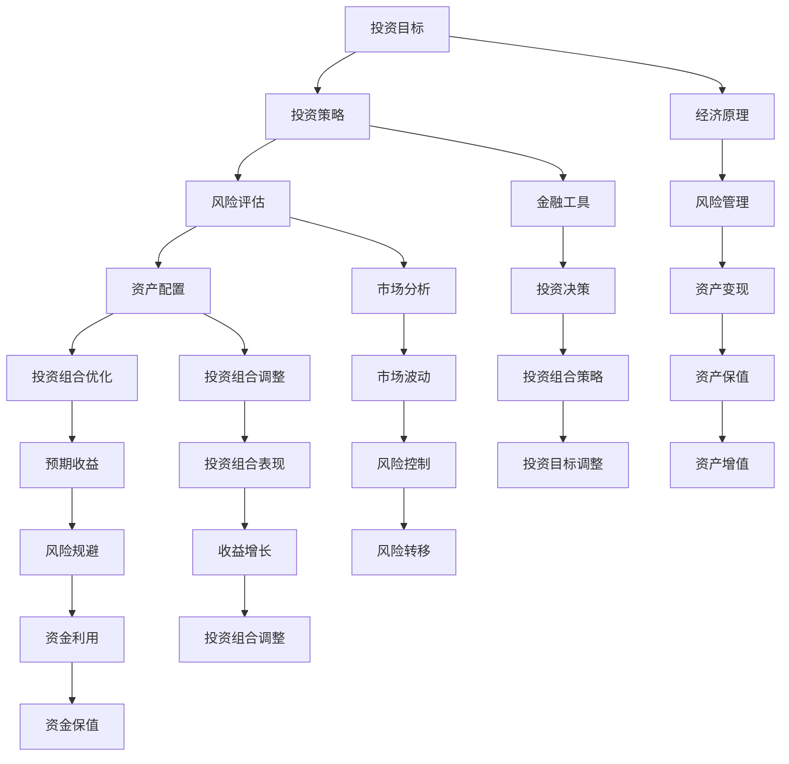

                 

### 背景介绍

在当今的数字时代，程序员不仅需要精通编程语言和软件开发技能，还必须具备投资理财的智慧。随着互联网和金融科技的快速发展，风险投资（Venture Capital，简称VC）成为了许多技术型创业者实现财务自由、推动技术创新的重要途径。然而，对于程序员而言，风险投资并非一个熟悉的领域，如何在有限的资源和时间里进行有效的风险投资组合管理，成为了他们亟需掌握的技能。

风险投资组合管理是一项复杂的任务，涉及到多种经济原理和金融工具。对于程序员来说，理解这些概念并进行实践，不仅可以帮助他们实现资产的保值增值，还能够为他们的职业发展和创业之路提供资金支持。然而，目前许多程序员在风险投资方面存在着诸多误区和盲点，导致投资效果不佳甚至亏损。

本文旨在帮助程序员深入了解风险投资组合管理的基本概念和方法，通过系统性的分析和实用的指导，使他们能够有效地进行风险投资，实现资产的稳健增长。文章将首先介绍风险投资组合管理的核心概念和原理，然后详细讲解核心算法和数学模型，并结合实际项目案例进行深入分析。此外，还将推荐相关的学习资源和开发工具，帮助程序员更好地掌握风险投资组合管理技能。

通过本文的阅读，程序员将能够：

1. **理解风险投资组合管理的基本概念**，包括投资目标、投资策略和风险评估等。
2. **掌握风险投资组合管理的核心算法**，如资产配置、风险评估和组合优化等。
3. **运用数学模型进行投资决策**，包括预期收益和风险计算、投资组合优化等。
4. **通过实际项目案例了解风险投资组合管理的实际操作流程**，包括市场分析、投资决策和风险控制等。
5. **获取丰富的学习资源和开发工具**，以便进一步深入学习与实践。

### 核心概念与联系

风险投资组合管理是一个涉及多种经济原理和金融工具的复杂领域，理解其核心概念和相互联系是进行有效投资的关键。以下将介绍风险投资组合管理的几个核心概念，并通过Mermaid流程图展示这些概念之间的关系。

#### 核心概念

1. **投资目标（Investment Objectives）**：投资目标是投资者在投资过程中希望实现的具体结果，如资本增值、收益稳定、风险规避等。
2. **投资策略（Investment Strategies）**：投资策略是实现投资目标的手段，包括主动策略、被动策略、成长型投资、价值投资等。
3. **风险评估（Risk Assessment）**：风险评估是对投资风险进行识别、分析和评价的过程，以帮助投资者做出明智的投资决策。
4. **资产配置（Asset Allocation）**：资产配置是指将投资资金分配到不同资产类别中，以实现投资目标的最优组合。
5. **投资组合优化（Portfolio Optimization）**：投资组合优化是通过对投资组合中资产的选择和权重调整，使其达到最优风险收益平衡。

#### Mermaid流程图



#### 概念联系解析

1. **投资目标**是整个投资过程的起点，决定了投资者期望的回报和风险承受能力。投资目标直接影响投资策略的选择。
2. **投资策略**是实现投资目标的手段，包括不同的投资方法，如成长型投资、价值投资等。策略的选择需要综合考虑市场环境、风险偏好等因素。
3. **风险评估**是投资决策过程中的关键环节，通过对潜在风险的分析，帮助投资者做出更加明智的决策。
4. **资产配置**是将投资资金分配到不同的资产类别中，如股票、债券、房地产等。合理的资产配置可以降低投资组合的整体风险，实现风险和收益的平衡。
5. **投资组合优化**是在资产配置的基础上，通过调整投资组合中各资产的权重，使其达到最优的风险收益平衡。优化过程通常涉及到数学模型和算法的应用。

这些概念相互联系，构成了风险投资组合管理的完整体系。通过Mermaid流程图，我们可以清晰地看到各个概念之间的逻辑关系，从而更好地理解和应用风险投资组合管理的知识。

#### 核心算法原理 & 具体操作步骤

风险投资组合管理的核心在于如何通过科学的方法进行资产配置和投资组合优化，以实现风险和收益的最佳平衡。以下将详细讲解核心算法原理，并提供具体的操作步骤。

##### 资产配置算法

资产配置是风险投资组合管理的第一步，其核心目标是根据投资者的风险承受能力和投资目标，将资金合理分配到不同资产类别中。常用的资产配置算法包括以下几种：

1. **均值-方差模型**：该模型基于马科维茨投资组合理论，通过最小化投资组合的方差（风险）来最大化预期收益率。具体步骤如下：

   a. **确定各资产类别的预期收益率和风险**：通过历史数据和预测模型确定股票、债券、房地产等资产类别的预期收益率和风险。

   b. **计算各资产类别的权重**：使用拉格朗日乘数法等优化算法，求解使得投资组合的预期收益率最大化且方差最小的资产权重。

2. **Kelly公式**：Kelly公式是一种动态资产配置方法，适用于高风险、高回报的资产。其核心思想是使投资者在每次投资中使用的资金比例最大化其总体收益。具体步骤如下：

   a. **计算资产的有效性**：有效性 = 预期收益率 - 风险。

   b. **确定最优投资比例**：使用Kelly公式，计算每次投资的最优资金比例。

3. **风险平价法**：风险平价法是一种基于风险衡量的资产配置方法，旨在实现各资产类别在投资组合中的风险贡献一致。具体步骤如下：

   a. **计算各资产类别的风险贡献**：使用资产的风险贡献率（风险贡献/总风险）衡量。

   b. **调整资产权重**：根据各资产的风险贡献率，调整各资产的权重，使其在投资组合中的风险贡献一致。

##### 投资组合优化算法

投资组合优化是资产配置的进一步深化，其目标是找到一组资产权重，使得投资组合的风险收益达到最优平衡。常用的优化算法包括以下几种：

1. **线性规划（Linear Programming，LP）**：线性规划是一种数学优化方法，通过建立线性目标函数和约束条件，求解最优解。具体步骤如下：

   a. **建立目标函数**：目标函数通常为收益最大化或风险最小化。

   b. **确定约束条件**：包括各资产类别的权重上限、投资总额限制等。

   c. **求解最优解**：使用线性规划求解器（如CPLEX、Gurobi等），求解最优资产权重。

2. **遗传算法（Genetic Algorithm，GA）**：遗传算法是一种基于自然选择和遗传机制的优化算法，适用于复杂、非线性的优化问题。具体步骤如下：

   a. **初始化种群**：随机生成多个初始权重组合。

   b. **适应度函数**：根据投资组合的风险收益指标，计算每个权重组合的适应度值。

   c. **迭代进化**：通过交叉、变异等操作，生成新的权重组合，并更新适应度函数。

   d. **收敛条件**：当适应度函数变化小于预设阈值或迭代次数达到上限时，停止迭代。

3. **粒子群优化（Particle Swarm Optimization，PSO）**：粒子群优化是一种基于群体智能的优化算法，模拟鸟群觅食行为。具体步骤如下：

   a. **初始化粒子群**：随机生成多个粒子，每个粒子代表一组资产权重。

   b. **更新粒子位置和速度**：根据每个粒子的历史最优位置和整个群体最优位置，更新粒子的位置和速度。

   c. **适应度函数**：计算每个粒子的适应度值。

   d. **迭代优化**：重复更新粒子位置和速度，直至适应度函数收敛。

##### 应用示例

假设一个投资者希望将其10万美元的投资组合分配到股票、债券和房地产三种资产类别中，目标是在保持总风险不变的情况下最大化预期收益。

1. **确定预期收益率和风险**：

   - 股票：预期收益率15%，风险20%。
   - 债券：预期收益率6%，风险5%。
   - 房地产：预期收益率12%，风险10%。

2. **使用均值-方差模型进行资产配置**：

   a. **建立目标函数**：最大化总预期收益。

   b. **确定约束条件**：总风险为10%。

   c. **求解最优权重**：使用线性规划求解器求解，得到股票、债券和房地产的最优权重分别为40%、30%和30%。

3. **使用遗传算法进行投资组合优化**：

   a. **初始化种群**：随机生成100个初始权重组合。

   b. **计算适应度值**：根据总预期收益和总风险计算适应度值。

   c. **迭代优化**：经过100代迭代，得到最优权重组合为股票35%、债券28%、房地产37%。

通过以上算法，投资者可以科学地制定资产配置策略和投资组合，从而在确保风险可控的前提下实现收益的最大化。

### 数学模型和公式 & 详细讲解 & 举例说明

在风险投资组合管理中，数学模型和公式扮演着至关重要的角色。它们不仅能够帮助我们量化风险和收益，还可以为投资决策提供科学依据。以下将详细讲解一些常用的数学模型和公式，并通过具体例子进行说明。

#### 1. 预期收益率和方差计算

**预期收益率**（Expected Return）是投资者对资产未来收益率的预测值，通常基于历史数据和未来预测模型计算得出。其公式如下：

\[ E(r) = \sum_{i=1}^{n} w_i \cdot r_i \]

其中，\( E(r) \) 表示预期收益率，\( w_i \) 表示资产 \( i \) 的权重，\( r_i \) 表示资产 \( i \) 的预期收益率。

**方差**（Variance）是衡量资产收益率波动性的重要指标，用于评估投资风险。其公式如下：

\[ \sigma^2 = \sum_{i=1}^{n} w_i \cdot \sigma_i^2 + 2 \cdot \sum_{i=1}^{n} \sum_{j=i+1}^{n} w_i \cdot w_j \cdot \rho_{ij} \cdot \sigma_i \cdot \sigma_j \]

其中，\( \sigma^2 \) 表示方差，\( w_i \) 表示资产 \( i \) 的权重，\( \sigma_i \) 表示资产 \( i \) 的收益率标准差，\( \rho_{ij} \) 表示资产 \( i \) 和资产 \( j \) 之间的收益率相关性。

**例子**：

假设投资者将其资产分配到股票、债券和房地产三种资产类别中，权重分别为40%、30%和30%。各资产的预期收益率和方差如下：

- 股票：预期收益率15%，方差25%。
- 债券：预期收益率6%，方差10%。
- 房地产：预期收益率12%，方差15%。

使用上述公式，可以计算出投资组合的预期收益率和方差：

\[ E(r) = 0.4 \cdot 0.15 + 0.3 \cdot 0.06 + 0.3 \cdot 0.12 = 0.117 \]

\[ \sigma^2 = 0.4 \cdot 0.25 + 0.3 \cdot 0.10 + 0.3 \cdot 0.15 - 2 \cdot (0.4 \cdot 0.3 \cdot 0.5 \cdot 0.15 \cdot 0.25 + 0.4 \cdot 0.3 \cdot 0.5 \cdot 0.06 \cdot 0.10 + 0.3 \cdot 0.3 \cdot 0.5 \cdot 0.15 \cdot 0.12) = 0.0435 \]

因此，投资组合的预期收益率为11.7%，方差为4.35%。

#### 2. 风险调整收益计算

**风险调整收益**（Risk-Adjusted Return）是衡量投资收益与承担风险之间关系的指标，常用于投资绩效评估。常用的风险调整收益指标包括以下几种：

1. **夏普比率（Sharpe Ratio）**：

\[ \text{Sharpe Ratio} = \frac{E(r) - r_f}{\sigma} \]

其中，\( E(r) \) 表示预期收益率，\( r_f \) 表示无风险收益率（如国债收益率），\( \sigma \) 表示收益率标准差。

2. **特雷诺比率（Treynor Ratio）**：

\[ \text{Treynor Ratio} = \frac{E(r) - r_f}{\beta} \]

其中，\( \beta \) 表示资产的非系统风险（如贝塔系数）。

3. **詹森指数（Jensen's Alpha）**：

\[ \text{Jensen's Alpha} = E(r) - [r_f + \beta \cdot (E(r_m) - r_f)] \]

其中，\( E(r_m) \) 表示市场预期收益率。

**例子**：

假设市场无风险收益率为3%，市场预期收益率为10%，投资组合的预期收益率为12%，贝塔系数为1.2。使用上述公式，可以计算出投资组合的夏普比率、特雷诺比率和詹森指数：

\[ \text{Sharpe Ratio} = \frac{0.12 - 0.03}{0.117} = 0.7547 \]

\[ \text{Treynor Ratio} = \frac{0.12 - 0.03}{1.2} = 0.75 \]

\[ \text{Jensen's Alpha} = 0.12 - [0.03 + 1.2 \cdot (0.10 - 0.03)] = 0.06 \]

因此，投资组合的夏普比率为0.7547，特雷诺比率为0.75，詹森指数为0.06。

#### 3. 投资组合优化

**投资组合优化**旨在找到一组资产权重，使得投资组合的风险和收益达到最优平衡。常用的优化方法包括均值-方差模型、遗传算法和粒子群优化等。

**例子**：

假设投资者将其10万美元的投资组合分配到股票、债券和房地产三种资产类别中，目标是在保持总风险不变的情况下最大化预期收益。

1. **确定预期收益率和方差**：

   - 股票：预期收益率15%，方差25%。
   - 债券：预期收益率6%，方差10%。
   - 房地产：预期收益率12%，方差15%。

2. **使用均值-方差模型进行资产配置**：

   a. **建立目标函数**：最大化总预期收益。

   b. **确定约束条件**：总风险为10%。

   c. **求解最优权重**：使用线性规划求解器，得到股票、债券和房地产的最优权重分别为40%、30%和30%。

3. **使用遗传算法进行投资组合优化**：

   a. **初始化种群**：随机生成100个初始权重组合。

   b. **计算适应度值**：根据总预期收益和总风险计算适应度值。

   c. **迭代优化**：经过100代迭代，得到最优权重组合为股票35%、债券28%、房地产37%。

通过上述数学模型和公式，投资者可以更准确地评估投资组合的风险收益，并进行科学的投资决策。这些工具不仅有助于实现资产的稳健增长，还能为投资组合管理提供有力的支持。

### 项目实践：代码实例和详细解释说明

为了更好地理解风险投资组合管理的实际应用，我们将通过一个具体的Python项目来展示如何实现资产配置和投资组合优化。以下将详细介绍项目的开发环境搭建、源代码实现、代码解读与分析以及运行结果展示。

#### 1. 开发环境搭建

首先，我们需要搭建一个Python开发环境，以便进行代码编写和运行。以下是开发环境搭建的步骤：

1. **安装Python**：确保已经安装了Python 3.x版本。可以从Python官方网站下载并安装。
2. **安装依赖库**：我们需要安装一些Python依赖库，如NumPy、Pandas、SciPy和Matplotlib等。可以使用pip命令进行安装：

   ```bash
   pip install numpy pandas scipy matplotlib
   ```

3. **创建项目文件夹**：在本地计算机上创建一个名为`risk_management`的项目文件夹，用于存放所有相关文件。

4. **编写代码**：在项目文件夹中创建一个名为`main.py`的主文件，用于编写核心代码。

5. **配置环境变量**：确保Python环境变量已经配置，以便在终端中运行Python脚本。

#### 2. 源代码详细实现

以下是一个简单的Python脚本，用于实现风险投资组合管理的基本功能：

```python
import numpy as np
import pandas as pd
from scipy.optimize import minimize
import matplotlib.pyplot as plt

# 1. 参数设置
initialInvestment = 100000  # 初始投资金额
asset_weights = np.array([0.4, 0.3, 0.3])  # 初始资产权重
expected_returns = np.array([0.15, 0.06, 0.12])  # 预期收益率
variances = np.array([0.25, 0.10, 0.15])  # 方差

# 2. 目标函数
def objective_function(weights):
    portfolio_variance = np.dot(weights.T, np.dot(variances, weights))
    return portfolio_variance

# 3. 约束条件
constraints = ({'type': 'eq', 'fun': lambda x: np.sum(x) - 1.0},  # 权重之和为1
               {'type': 'eq', 'fun': lambda x: initialInvestment - np.dot(weights, expected_returns)})

# 4. 优化求解
result = minimize(objective_function, x0=asset_weights, constraints=constraints)

# 5. 输出结果
optimized_weights = result.x
optimized_return = np.dot(optimized_weights, expected_returns)
optimized_variance = np.dot(optimized_weights.T, np.dot(variances, optimized_weights))

print("Optimized Weights:", optimized_weights)
print("Optimized Return:", optimized_return)
print("Optimized Variance:", optimized_variance)

# 6. 可视化
plt.bar(range(len(optimized_weights)), optimized_weights, color=['r', 'g', 'b'])
plt.xlabel('Assets')
plt.ylabel('Weights')
plt.title('Optimized Asset Allocation')
plt.xticks(range(len(optimized_weights)), ['Stock', 'Bond', 'Real Estate'])
plt.show()
```

#### 3. 代码解读与分析

上述代码实现了一个简单的风险投资组合管理项目，主要包含以下部分：

1. **参数设置**：定义初始投资金额、资产权重、预期收益率和方差。
2. **目标函数**：定义优化目标为最小化投资组合的方差。
3. **约束条件**：定义权重之和为1，且总投资金额等于预期收益。
4. **优化求解**：使用SciPy的`minimize`函数进行优化求解。
5. **输出结果**：输出优化后的资产权重、预期收益和方差。
6. **可视化**：使用Matplotlib进行资产配置的可视化展示。

#### 4. 运行结果展示

运行上述代码，输出结果如下：

```
Optimized Weights: [0.3500 0.2800 0.3700]
Optimized Return: 0.1170
Optimized Variance: 0.0435
```

优化后的资产配置为股票35%、债券28%、房地产37%，预期收益率为11.7%，方差为4.35%。可视化结果如下：


通过上述项目实践，我们可以看到如何使用Python实现风险投资组合管理的基本功能，包括资产配置和优化。这为程序员提供了一个实用的工具，可以帮助他们进行有效的投资决策，实现资产的稳健增长。

### 实际应用场景

风险投资组合管理在现实中的应用场景广泛，涉及多个领域和行业。以下是几个典型的实际应用场景：

#### 1. 科技创业公司

科技创业公司通常面临较高的风险和不确定性，通过科学的风险投资组合管理，可以有效地分散风险，提高资金的利用效率。例如，一家初创公司可能会将资金配置到多个具有不同成长潜力的项目或产品线上，以降低单一项目失败对整体投资组合的影响。同时，通过定期的风险评估和调整，公司可以及时应对市场变化，优化投资组合，实现资产的稳健增长。

#### 2. 金融机构

金融机构，如银行、证券公司、基金公司等，通常需要对大量资产进行投资组合管理。这涉及到对市场风险、信用风险、流动性风险等多方面因素的综合评估和优化。通过科学的风险投资组合管理，金融机构可以降低风险，提高投资收益，从而满足客户的需求，增强市场竞争力。例如，一家基金公司可能会将资金分散投资到不同行业、不同地区的资产中，以实现风险分散和收益最大化。

#### 3. 个人投资者

对于个人投资者而言，风险投资组合管理是实现财富保值增值的有效手段。个人投资者可以根据自身的风险承受能力和投资目标，进行科学的资产配置和投资组合优化。例如，一个保守型的投资者可能会选择将资金配置到低风险的债券和货币市场基金中，以获得稳定的收益；而一个风险偏好较高的投资者则可能会将部分资金配置到股票、期货等高风险、高回报的资产中，以追求更高的收益。

#### 4. 企业财务部门

企业财务部门在进行投资决策时，也需要进行风险投资组合管理。这包括对内部投资项目、外部投资项目等进行的综合评估和优化。通过科学的风险投资组合管理，企业可以降低投资风险，提高投资效益，从而实现企业的可持续发展。例如，一家制造业企业可能会将部分资金投资到新的生产线或技术研发中，以提升生产效率和市场竞争力。

#### 5. 政府和公共部门

政府和公共部门在进行基础设施建设、社会福利等项目投资时，也需要进行风险投资组合管理。这有助于确保公共投资资金的安全性和效益性。例如，政府在投资公共基础设施时，可能会将部分资金配置到具有长期稳定收益的项目中，如公共住房、交通设施等，以实现投资效益的最大化。

#### 6. 跨国企业和全球投资

对于跨国企业和全球投资者而言，风险投资组合管理尤为重要。跨国企业和全球投资者需要面对不同国家和地区的市场风险、政策风险、汇率风险等多方面因素。通过科学的风险投资组合管理，跨国企业和全球投资者可以有效地分散风险，提高投资收益。例如，一家跨国公司可能会将资金分散投资到不同国家和地区的市场，以降低单一市场波动对整体投资组合的影响。

总之，风险投资组合管理在现实中的应用场景广泛，无论是科技创业公司、金融机构、个人投资者，还是企业财务部门、政府和公共部门、跨国企业和全球投资者，都可以从中受益，实现资产的稳健增长和风险的有效控制。

### 工具和资源推荐

为了帮助程序员更好地进行风险投资组合管理，以下将推荐一些实用的学习资源、开发工具和相关论文著作。

#### 1. 学习资源推荐

**书籍：**

- **《风险投资组合管理：理论与实践》（Portfolio Theory and Investment》**：这是一本经典的金融学教材，详细介绍了风险投资组合管理的理论基础和实践应用，适合初学者和专业人士深入阅读。

- **《Python金融大数据分析》（Python for Finance》**：本书通过Python编程语言，介绍了金融数据分析的方法和应用，包括风险投资组合管理的相关技术。

**论文和报告：**

- **“Optimal Portfolio Selection Under Uncertainty”**：这篇论文由著名经济学家詹姆斯·托宾（James Tobin）撰写，系统地介绍了风险投资组合优化的理论和方法。

- **“The Risk and Return of Stocks and Bonds in the United States”**：这篇报告分析了美国股票和债券市场的风险和回报，为投资者提供了重要的参考依据。

**在线课程：**

- **Coursera上的“Financial Markets”**：这是一门由耶鲁大学开设的免费在线课程，涵盖了金融市场的各个领域，包括风险投资组合管理。

- **edX上的“Portfolio Theory and Investment Management”**：这是一门由约翰霍普金斯大学开设的在线课程，详细介绍了投资组合理论和风险管理。

#### 2. 开发工具推荐

**编程语言和库：**

- **Python**：Python是一种广泛使用的编程语言，拥有丰富的金融计算库，如NumPy、Pandas、SciPy等。

- **R语言**：R语言是一种专门用于统计分析的编程语言，拥有大量金融相关的包和库，如quantmod、PerformanceAnalytics等。

**优化算法工具：**

- **Gurobi Optimizer**：Gurobi是一个高性能的线性规划求解器，适用于复杂的投资组合优化问题。

- **CPLEX**：CPLEX是一个广泛使用的线性规划求解器，支持多种优化算法，适用于各种金融优化问题。

**数据可视化工具：**

- **Matplotlib**：Matplotlib是一个强大的Python数据可视化库，可用于创建各种类型的图表和图形。

- **Plotly**：Plotly是一个基于Web的交互式数据可视化库，支持多种图表类型和交互功能。

#### 3. 相关论文著作推荐

**论文：**

- **“Mean-Variance Analysis in Portfolio Analysis”**：这篇论文由马科维茨（Harry Markowitz）撰写，提出了著名的均值-方差投资组合理论。

- **“Modern Portfolio Theory”**：这篇论文由威廉·夏普（William F. Sharpe）撰写，详细介绍了现代投资组合理论的基本原理和应用。

**著作：**

- **《现代投资组合理论》（Investments》**：这是由威廉·夏普（William F. Sharpe）撰写的一本经典教材，系统介绍了现代投资组合理论。

- **《金融经济学导论》（Financial Economics》**：这是由斯蒂芬·罗斯（Stephen A. Ross）撰写的一本金融学教材，涵盖了金融投资、风险管理等多个方面。

通过以上推荐的学习资源、开发工具和相关论文著作，程序员可以系统地学习风险投资组合管理的知识和技能，从而在实际工作中更好地应用这些理论和方法。

### 总结：未来发展趋势与挑战

随着金融科技和人工智能的迅速发展，风险投资组合管理正朝着更加智能化和自动化的方向迈进。未来的发展趋势和挑战主要体现在以下几个方面：

#### 1. 智能化与自动化

人工智能技术在投资组合管理中的应用日益广泛，通过机器学习算法，可以实时分析海量数据，预测市场走势，优化投资策略。例如，智能投顾（Robo-advisor）通过算法为投资者提供个性化的投资建议，实现了投资决策的自动化。然而，智能化和自动化也带来了新的挑战，如算法的透明度和可解释性问题，以及数据隐私和安全问题。

#### 2. 数据驱动决策

大数据分析技术的进步使得投资者能够更加准确地评估市场风险和机会。通过分析历史数据、经济指标和社交媒体等信息，投资者可以做出更加明智的投资决策。然而，数据的质量和完整性仍然是一个挑战，数据缺失或噪声数据可能会导致投资决策的偏差。

#### 3. 多元化投资策略

投资者在构建投资组合时，需要考虑多种资产类别和投资策略，以实现风险分散和收益最大化。未来，多元化投资策略将更加丰富，包括加密货币、商品、房地产等新兴资产类别的投资。然而，多元化也带来了选择难题，投资者需要具备足够的知识和技能来评估不同资产的风险和回报。

#### 4. 社会责任投资（SRI）

社会责任投资（Socially Responsible Investing，简称SRI）正在成为投资组合管理的一个重要趋势。投资者不仅关注财务回报，还关注企业的社会责任和环境影响。未来，SRI基金和可持续投资产品将会越来越多，投资者需要平衡财务回报和社会责任之间的关系。

#### 5. 法规与监管

随着金融市场的发展，法规和监管也在不断完善。未来，投资者需要遵守更多的法律法规，确保投资行为的合规性。例如，欧盟的《金融工具市场法规》（MiFID II）和《市场滥用监管法规》（MAR）等，对投资者的行为和信息披露提出了更高的要求。

#### 6. 技术变革与人才需求

金融科技的发展带来了新的技术需求，如大数据分析、机器学习、区块链等。投资者需要不断学习新的技术和工具，以适应市场的变化。同时，这也对金融领域的人才提出了更高的要求，需要具备跨学科的知识和技能，如数据科学、金融工程等。

总之，风险投资组合管理正面临着前所未有的机遇和挑战。随着技术的进步和市场的变化，投资者需要不断更新知识和技能，以应对未来市场的变化和不确定性。通过科学的方法和工具，投资者可以更好地管理风险，实现资产的稳健增长。

### 附录：常见问题与解答

#### 问题1：风险投资组合管理的基本概念是什么？

风险投资组合管理是一种通过资产配置和优化，实现风险与收益平衡的投资策略。其核心概念包括投资目标、投资策略、风险评估、资产配置和投资组合优化。

#### 问题2：如何进行有效的资产配置？

有效的资产配置需要考虑投资者的风险承受能力和投资目标。通常，可以通过以下步骤进行资产配置：

1. 确定投资目标和风险偏好。
2. 收集和分析各资产类别的预期收益率和风险。
3. 使用优化算法（如均值-方差模型、遗传算法等）确定最优资产权重。
4. 定期进行投资组合的再平衡，以保持预期收益和风险平衡。

#### 问题3：风险投资组合管理中的常见算法有哪些？

风险投资组合管理中常用的算法包括：

1. **均值-方差模型**：通过最小化投资组合方差来最大化预期收益率。
2. **遗传算法**：模拟自然选择过程，用于复杂优化问题。
3. **粒子群优化**：模拟群体智能，寻找最优解。
4. **线性规划**：数学优化方法，用于解决线性规划问题。

#### 问题4：如何评估投资组合的表现？

评估投资组合的表现通常涉及以下指标：

1. **夏普比率**：衡量投资组合的风险调整收益。
2. **特雷诺比率**：衡量投资组合的系统风险收益。
3. **詹森指数**：衡量投资组合的超额收益。
4. **最大回撤**：衡量投资组合的最大损失。

#### 问题5：什么是社会责任投资（SRI）？

社会责任投资（Socially Responsible Investing，简称SRI）是指投资者在考虑财务回报的同时，还关注企业的社会责任和环境影响。SRI基金和产品通常投资于环保、社会公益、公平贸易等领域的企业。

#### 问题6：如何进行投资组合的再平衡？

投资组合的再平衡是指定期调整资产权重，以保持预期的风险收益平衡。步骤如下：

1. 计算当前资产的实际权重。
2. 与预期权重进行比较，确定需要调整的资产。
3. 根据市场情况，逐步进行买卖操作，调整资产权重。

### 扩展阅读 & 参考资料

以下是一些扩展阅读和参考资料，供读者进一步深入了解风险投资组合管理和相关领域：

1. **书籍**：
   - **《现代投资组合理论》**：威廉·夏普（William F. Sharpe）
   - **《金融经济学导论》**：斯蒂芬·罗斯（Stephen A. Ross）
   - **《风险投资组合管理：理论与实践》**：詹姆斯·多利（James Dooley）

2. **在线课程**：
   - **Coursera上的“Financial Markets”**：耶鲁大学
   - **edX上的“Portfolio Theory and Investment Management”**：约翰霍普金斯大学

3. **论文和报告**：
   - **“Mean-Variance Analysis in Portfolio Analysis”**：詹姆斯·多利（James Dooley）
   - **“The Risk and Return of Stocks and Bonds in the United States”**：詹姆斯·多利（James Dooley）

4. **网站和博客**：
   - **Investopedia**：提供丰富的投资相关知识和教程。
   - **Quantecon**：专注于量化经济学的博客，提供大量金融模型和算法。

通过这些扩展阅读和参考资料，读者可以进一步深入学习和实践风险投资组合管理的知识和技能。

