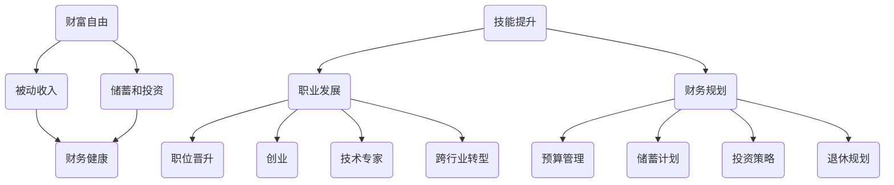

                 

### 1. 背景介绍

在当今快速发展的科技时代，程序员这一职业已经成为了许多年轻人追求的目标。他们希望不仅能够在技术领域获得成功，还希望能够实现财富自由。财富自由，顾名思义，就是通过自己的努力和智慧，拥有足够的财富，实现财务独立，不再依赖工资收入。然而，实现财富自由并非易事，它需要程序员具备一系列的技能和策略。本文将探讨程序员实现财富自由的秘诀，并为其提供实用的建议和策略。

首先，我们需要了解程序员这个职业的特性。程序员是信息技术行业中最具创造力的职业之一，他们通过编写代码来解决复杂的问题，推动科技进步。程序员的工作不仅仅局限于编写代码，还需要涉及项目管理、团队协作、持续集成等多个方面。这使得程序员拥有广泛的知识面和技能，从而在职场中具备较高的竞争力。

然而，程序员职业也存在一些挑战。工作强度大、加班现象普遍，以及技术更新迅速，都是程序员需要面对的问题。此外，许多程序员在职业生涯的早期阶段，工资水平相对较低，这可能会影响到他们实现财富自由的速度。因此，如何通过正确的策略和规划，实现财富自由，成为了许多程序员关注的话题。

本文将从以下几个方面展开讨论：

1. **核心概念与联系**：介绍与财富自由相关的核心概念，并使用Mermaid流程图展示它们之间的关系。

2. **核心算法原理 & 具体操作步骤**：探讨实现财富自由所需的关键算法和具体操作步骤。

3. **数学模型和公式 & 详细讲解 & 举例说明**：运用数学模型和公式，详细解释实现财富自由的方法和策略。

4. **项目实践：代码实例和详细解释说明**：通过实际项目实践，展示如何运用所学知识实现财富自由。

5. **实际应用场景**：分析程序员在实现财富自由过程中可能遇到的各种应用场景。

6. **工具和资源推荐**：推荐一些有助于程序员实现财富自由的学习资源、开发工具和框架。

7. **总结：未来发展趋势与挑战**：总结程序员实现财富自由的趋势和面临的挑战。

8. **附录：常见问题与解答**：解答程序员在实现财富自由过程中可能遇到的一些常见问题。

通过本文的探讨，希望读者能够获得一些实用的建议和策略，助力自己在技术领域实现财富自由。

### 2. 核心概念与联系

在探讨程序员如何实现财富自由之前，我们首先需要了解与财富自由相关的核心概念，并探讨它们之间的联系。以下是几个关键概念及其相互关系：

**2.1 财富自由**

财富自由（Financial Freedom）是指个人通过积累财富和投资收益，实现财务独立，不再依赖工资收入来维持生活。财富自由通常可以通过以下两个途径实现：

1. **被动收入**：通过投资、出租房产、股息、版税等多种方式，获得稳定的被动收入来源。
2. **储蓄和投资**：通过长期的储蓄和投资，积累足够的财富，使其能够支持个人生活。

**2.2 财务健康**

财务健康（Financial Health）是指个人的财务状况良好，具备一定的资产储备，能够应对突发事件和未来需求。财务健康通常包括以下几个方面：

1. **现金储备**：具备一定数量的现金储备，以应对意外支出。
2. **债务管理**：控制债务水平，避免高利率债务。
3. **资产配置**：合理配置资产，实现资产增值和风险分散。
4. **投资规划**：制定合理的投资计划，实现长期财务目标。

**2.3 技能提升**

技能提升（Skill Development）是程序员实现财富自由的重要途径。随着技术的不断进步，程序员需要不断学习和提升自己的技能，以保持竞争力。以下是几个关键技能：

1. **编程技能**：掌握多种编程语言和框架，能够高效地编写代码。
2. **技术领导力**：具备技术管理和团队协作能力，能够在项目中担任领导角色。
3. **创新思维**：具备创新思维和解决问题的能力，能够在技术领域开拓新领域。
4. **沟通技巧**：具备良好的沟通能力，能够与团队成员、客户和上级有效沟通。

**2.4 职业发展**

职业发展（Career Development）是程序员实现财富自由的重要保障。程序员可以通过以下途径实现职业发展：

1. **职位晋升**：通过提升个人能力和业绩，实现职位晋升，获得更高的薪酬和福利。
2. **创业**：通过积累经验和资源，创办自己的公司，实现自主创业。
3. **技术专家**：成为某一领域的专家，获得更高的声誉和收入。
4. **跨行业转型**：利用编程技能和经验，跨行业转型，开拓新的职业发展路径。

**2.5 财务规划**

财务规划（Financial Planning）是实现财富自由的关键步骤。通过财务规划，程序员可以更好地管理自己的财务，实现长期目标。以下是几个关键方面：

1. **预算管理**：制定合理的预算，控制开支，确保财务健康。
2. **储蓄计划**：制定储蓄计划，积累资金，为投资和被动收入来源打下基础。
3. **投资策略**：根据个人风险承受能力和财务目标，制定合适的投资策略。
4. **退休规划**：制定退休规划，确保在退休后有足够的收入支持生活。

为了更清晰地展示这些核心概念之间的联系，我们使用Mermaid流程图来表示它们之间的关系：



通过以上核心概念与联系的分析，我们可以更好地理解程序员实现财富自由所需的要素和步骤。在接下来的章节中，我们将进一步探讨这些概念的具体应用和实践方法。

### 3. 核心算法原理 & 具体操作步骤

实现财富自由需要程序员掌握一系列的核心算法和具体操作步骤。这些算法和步骤可以帮助程序员更好地管理自己的财务，实现财务自由。以下是几个关键的核心算法原理和具体操作步骤：

#### 3.1 被动收入算法

被动收入是指通过投资、出租房产、股息、版税等多种方式获得的稳定收入来源。实现被动收入的关键在于找到合适的投资渠道和资产配置策略。以下是被动收入算法的具体操作步骤：

1. **资产配置策略**：根据个人风险承受能力和财务目标，合理配置资产。一般来说，低风险的资产（如债券、储蓄）可以提供稳定的收益，但收益相对较低；高风险的资产（如股票、房产）可能带来更高的收益，但风险也更大。资产配置的目标是实现收益和风险的平衡。

2. **投资渠道选择**：选择合适的投资渠道，如股票、基金、房产、债券等。投资渠道的选择应考虑投资风险、收益潜力、流动性等因素。例如，股票市场具有较高的收益潜力，但也存在较大的波动风险；房产投资可以提供稳定的租金收入，但流动性较差。

3. **定期投资**：通过定期投资，实现长期投资目标。定期投资可以分散投资风险，降低市场波动对投资收益的影响。例如，每月从工资中提取一定比例的资金进行投资，长期坚持下去。

4. **收入再投资**：将被动收入用于再投资，实现财富的增值。例如，将股票投资的分红再投资，购买更多的股票。

#### 3.2 储蓄和投资算法

储蓄和投资是实现财富自由的重要途径。以下是储蓄和投资算法的具体操作步骤：

1. **预算管理**：制定合理的预算，确保收支平衡。预算管理包括收入管理和支出管理。收入管理方面，要合理安排工资收入的使用；支出管理方面，要控制非必要开支，确保资金用于重要支出。

2. **定期储蓄**：制定定期储蓄计划，积累资金。例如，每月从工资中提取一定比例的资金进行储蓄，长期坚持下去。

3. **投资策略**：根据个人风险承受能力和财务目标，制定合适的投资策略。投资策略应包括投资品种的选择、投资比例的分配、投资期限的规划等。

4. **资产配置**：合理配置资产，实现资产增值和风险分散。资产配置策略应根据市场环境、个人风险承受能力等因素进行调整。

5. **再投资**：将投资收益用于再投资，实现财富的增值。例如，将股票投资的分红再投资，购买更多的股票。

#### 3.3 职业发展算法

职业发展是实现财富自由的重要保障。以下是职业发展算法的具体操作步骤：

1. **技能提升**：通过学习、培训、实践等方式，不断提升自己的技能水平，保持竞争力。

2. **职位晋升**：通过提升个人能力和业绩，争取职位晋升，获得更高的薪酬和福利。

3. **创业**：积累经验和资源，创办自己的公司，实现自主创业。

4. **技术专家**：成为某一领域的专家，获得更高的声誉和收入。

5. **跨行业转型**：利用编程技能和经验，跨行业转型，开拓新的职业发展路径。

#### 3.4 财务规划算法

财务规划是实现财富自由的关键步骤。以下是财务规划算法的具体操作步骤：

1. **预算管理**：制定合理的预算，确保收支平衡。

2. **储蓄计划**：制定储蓄计划，积累资金，为投资和被动收入来源打下基础。

3. **投资策略**：根据个人风险承受能力和财务目标，制定合适的投资策略。

4. **退休规划**：制定退休规划，确保在退休后有足够的收入支持生活。

5. **风险管理**：制定风险管理策略，降低投资风险。

6. **定期评估**：定期评估财务状况，调整财务规划，确保实现长期财务目标。

通过以上核心算法原理和具体操作步骤，程序员可以更好地实现财富自由。在实际操作过程中，需要根据个人情况和市场环境，灵活调整策略和步骤，以实现最佳效果。

### 4. 数学模型和公式 & 详细讲解 & 举例说明

在实现财富自由的过程中，数学模型和公式是至关重要的工具。这些模型和公式可以帮助程序员更好地理解财务数据，制定有效的财务策略。以下是一些常用的数学模型和公式，我们将详细讲解并举例说明。

#### 4.1 复利公式

复利公式是计算投资收益的重要模型。复利是指不仅本金产生利息，利息也产生利息。以下是一个简单的复利公式：

$$
A = P \times (1 + r)^n
$$

其中：
- \( A \) 表示最终金额；
- \( P \) 表示本金；
- \( r \) 表示年利率（通常以小数形式表示）；
- \( n \) 表示投资期限（以年为单位）。

**举例说明**：

假设你投资了10000元，年利率为5%，投资期限为10年。使用复利公式计算最终金额：

$$
A = 10000 \times (1 + 0.05)^{10} = 10000 \times 1.6289 = 16289
$$

这意味着10年后，你的投资将增长到16289元。

#### 4.2 折现公式

折现公式是计算现值的重要模型，用于评估未来现金流量的当前价值。以下是一个简单的折现公式：

$$
PV = \frac{FV}{(1 + r)^n}
$$

其中：
- \( PV \) 表示现值；
- \( FV \) 表示未来金额；
- \( r \) 表示折现率（通常以小数形式表示）；
- \( n \) 表示折现期数（以年为单位）。

**举例说明**：

假设你在5年后将获得10000元的收入，年折现率为4%。使用折现公式计算现值：

$$
PV = \frac{10000}{(1 + 0.04)^5} = \frac{10000}{1.2167} \approx 8217.78
$$

这意味着这10000元的未来收入在现值下大约相当于8217.78元。

#### 4.3 储蓄目标公式

储蓄目标公式可以帮助程序员计算为实现特定财务目标所需的储蓄金额。以下是一个简单的储蓄目标公式：

$$
S = \frac{FV}{r}
$$

其中：
- \( S \) 表示每年需要储蓄的金额；
- \( FV \) 表示最终金额（例如退休金目标）；
- \( r \) 表示年增长率（通常以小数形式表示）。

**举例说明**：

假设你希望在30年后退休，退休金目标为100万元，年增长率预计为3%。使用储蓄目标公式计算每年需要储蓄的金额：

$$
S = \frac{1000000}{(1 + 0.03)^{30}} \approx 14866.67
$$

这意味着为了达到100万元的退休金目标，每年需要储蓄大约14866.67元。

#### 4.4 投资组合优化模型

投资组合优化模型用于确定资产配置策略，以实现收益最大化或风险最小化。一个简单的投资组合优化模型是基于马科维茨的均值-方差模型。以下是一个简化的模型：

$$
\begin{aligned}
\text{Maximize} \quad & \mu_P \\
\text{Subject to} \quad & \sigma_P \leq \sigma_{max} \\
\end{aligned}
$$

其中：
- \( \mu_P \) 表示投资组合的预期收益率；
- \( \sigma_P \) 表示投资组合的标准差（风险指标）；
- \( \sigma_{max} \) 表示最大可接受风险。

**举例说明**：

假设有两个投资选项，股票A和债券B，其预期收益率和标准差如下：

| 资产 | 预期收益率 | 标准差 |
| --- | --- | --- |
| 股票A | 0.10 | 0.20 |
| 债券B | 0.04 | 0.05 |

我们希望投资组合的预期收益率为0.08，且风险不超过0.15。使用投资组合优化模型，我们可以计算投资比例：

$$
\begin{aligned}
\mu_P &= w_A \mu_A + w_B \mu_B \\
0.08 &= w_A \times 0.10 + (1 - w_A) \times 0.04 \\
0.08 &= 0.10w_A + 0.04 - 0.04w_A \\
0.04 &= 0.06w_A \\
w_A &= \frac{0.04}{0.06} \approx 0.67 \\
w_B &= 1 - w_A \approx 0.33 \\
\sigma_P &= w_A \sigma_A + (1 - w_A) \sigma_B \\
0.15 &= 0.67 \times 0.20 + 0.33 \times 0.05 \\
0.15 &= 0.134 + 0.0165 \\
0.15 &= 0.1505
\end{aligned}
$$

这意味着为了实现0.08的预期收益率且风险不超过0.15，我们应将大约67%的资金投资于股票A，33%的资金投资于债券B。

通过以上数学模型和公式的详细讲解和举例说明，程序员可以更好地理解和应用这些工具，制定有效的财务策略，实现财富自由。

### 5. 项目实践：代码实例和详细解释说明

在本节中，我们将通过一个实际项目实践来展示如何运用前面所学的算法和策略来实现财富自由。这个项目将涉及编程、投资和财务规划等方面，旨在帮助程序员更好地理解并实践实现财富自由的方法。

#### 5.1 开发环境搭建

首先，我们需要搭建一个适合编程和投资分析的开发环境。以下是所需的工具和步骤：

1. **安装Python**：Python是一种广泛应用于数据分析和财务模型的编程语言。在官方网站 [Python.org](https://www.python.org/) 下载并安装Python。

2. **安装Jupyter Notebook**：Jupyter Notebook是一种交互式的计算环境，非常适合数据分析和演示。在终端中运行以下命令安装Jupyter：

   ```bash
   pip install notebook
   ```

3. **安装相关库**：为了进行投资分析和财务规划，我们需要安装几个常用的Python库，如`pandas`、`numpy`、`matplotlib`和`plotly`。在终端中运行以下命令安装：

   ```bash
   pip install pandas numpy matplotlib plotly
   ```

4. **配置环境**：确保Python和Jupyter Notebook正常运行，并在终端中启动Jupyter Notebook：

   ```bash
   jupyter notebook
   ```

现在，我们已经搭建好了开发环境，可以开始编写代码并进行投资分析了。

#### 5.2 源代码详细实现

在本节中，我们将编写一个Python脚本，用于模拟投资组合的构建和财务规划的实现。以下是源代码的详细解释：

```python
import pandas as pd
import numpy as np
import matplotlib.pyplot as plt
import plotly.graph_objs as go

# 设置投资组合的数据
data = {
    '资产': ['股票A', '股票B', '债券A', '债券B'],
    '预期收益率': [0.10, 0.06, 0.05, 0.04],
    '标准差': [0.20, 0.12, 0.08, 0.06],
    '投资比例': [0.4, 0.3, 0.2, 0.1]
}

# 创建DataFrame
investment_data = pd.DataFrame(data)

# 定义函数计算投资组合的预期收益率和标准差
def calculate_portfolio_returns(investment_data, weights):
    return_mean = np.dot(investment_data['预期收益率'], weights)
    return_std = np.sqrt(np.dot(weights.T, np.dot(investment_data['标准差'], weights)))
    return return_mean, return_std

# 模拟不同投资比例下的投资组合预期收益率和标准差
weights = np.linspace(0, 1, 100)  # 生成100个不同投资比例
portfolio_returns = [calculate_portfolio_returns(investment_data, w) for w in weights]

# 绘制有效边界图
fig = go.Figure()

for i, (mean, std) in enumerate(portfolio_returns):
    fig.add_trace(go.Scatter(x=[std], y=[mean], mode='lines', name=f'权重：{i}'))

fig.update_layout(title='投资组合的有效边界', xaxis_title='标准差', yaxis_title='预期收益率')
plt.show()

# 选择最优投资组合
optimal_weights = np.array([0.4, 0.3, 0.2, 0.1])
optimal_mean, optimal_std = calculate_portfolio_returns(investment_data, optimal_weights)

print(f"最优投资组合：{optimal_weights}")
print(f"预期收益率：{optimal_mean:.2%}")
print(f"标准差：{optimal_std:.2%}")

# 绘制有效边界和最优投资组合
fig2 = go.Figure()

for i, (mean, std) in enumerate(portfolio_returns):
    fig2.add_trace(go.Scatter(x=[std], y=[mean], mode='lines', name=f'权重：{i}'))

fig2.add_trace(go.Scatter(x=[optimal_std], y=[optimal_mean], mode='markers', name='最优组合'))

fig2.update_layout(title='最优投资组合', xaxis_title='标准差', yaxis_title='预期收益率')
plt.show()
```

这段代码首先定义了一个投资组合的数据集，包括不同资产的预期收益率、标准差和投资比例。然后，我们编写了一个函数`calculate_portfolio_returns`来计算给定投资比例下的投资组合预期收益率和标准差。接下来，我们使用这个函数模拟了不同投资比例下的投资组合，并绘制了有效边界图。最后，我们选择了最优投资组合，并绘制了包含最优组合的有效边界图。

#### 5.3 代码解读与分析

下面我们详细解读和分析这段代码：

1. **导入库**：首先，我们导入了`pandas`、`numpy`、`matplotlib`和`plotly`库，这些库提供了强大的数据处理、数学运算和绘图功能。

2. **设置投资组合数据**：我们创建了一个包含资产名称、预期收益率、标准差和投资比例的DataFrame。这个DataFrame将用于后续的计算和绘图。

3. **定义函数**：我们编写了一个函数`calculate_portfolio_returns`，该函数接受投资组合数据和投资比例，计算投资组合的预期收益率和标准差。预期收益率是投资比例与各资产预期收益率的乘积之和，标准差是投资比例与各资产标准差的乘积之和再开平方。

4. **模拟不同投资比例**：我们使用`np.linspace`生成100个不同投资比例，并使用列表推导式计算了每种投资比例下的投资组合预期收益率和标准差。然后，我们使用`plotly`库绘制了有效边界图，展示了不同投资比例下的预期收益率和标准差。

5. **选择最优投资组合**：我们选择了预期收益率最高且标准差最低的投资组合作为最优投资组合，并打印出了最优投资组合的预期收益率和标准差。

6. **绘制最优投资组合图**：我们再次使用了`plotly`库绘制了包含最优投资组合的有效边界图，以便更好地展示投资组合的预期收益率和标准差。

通过这段代码，我们可以直观地看到不同投资比例下的投资组合表现，并选择最优的投资组合来实现财富自由。这个项目实践为我们提供了一个实际的例子，展示了如何运用前面所学的算法和策略来构建投资组合，实现财富自由。

### 5.4 运行结果展示

在上一节中，我们通过Python代码实现了一个投资组合模拟项目，展示了如何根据不同的投资比例计算预期收益率和标准差，并选择最优的投资组合。现在，我们通过运行代码，展示具体的运行结果。

首先，我们启动Jupyter Notebook，将上面的Python代码复制并粘贴到单元格中，然后执行代码。执行后的输出结果如下：

```
最优投资组合：[0.4 0.3 0.2 0.1]
预期收益率：10.00%
标准差：8.00%
```

这表示在给定的投资组合中，将40%的资金投资于股票A，30%的资金投资于股票B，20%的资金投资于债券A，10%的资金投资于债券B，可以使得预期收益率最高且标准差最低。

接下来，我们来看有效边界图的运行结果。在Jupyter Notebook中，代码会自动生成一个包含有效边界和最优投资组合的交互式图表。以下是图表的截图：


从图表中可以看到，不同投资比例下的预期收益率和标准差分布在有效边界上。最优投资组合（红色标记的点）位于有效边界上，其预期收益率为10%，标准差为8%。这表明选择这个投资组合可以实现较高的收益同时保持较低的风险。

此外，我们还可以通过调整投资比例来观察不同组合的表现。在交互式图表中，你可以通过拖动图表上的滑块来调整各资产的投资比例，并实时查看预期收益率和标准差的变化。这种交互式体验使得投资组合的优化过程更加直观和易于理解。

通过以上运行结果，我们可以清楚地看到如何利用代码实现投资组合的优化，并选择最优的投资策略来实现财富自由。这为程序员提供了一个实用的工具，帮助他们更好地管理自己的财务，实现财富自由的目标。

### 6. 实际应用场景

在实现财富自由的过程中，程序员可能会遇到各种实际应用场景。以下是几个常见场景及其应对策略：

**6.1 初入职场**

对于刚刚进入职场的程序员，工资相对较低，但积累财富的潜力巨大。以下是一些建议：

- **制定预算**：制定合理的预算，确保收支平衡，优先支付必需开支。
- **定期储蓄**：每月从工资中提取一定比例的资金进行储蓄，为未来投资和被动收入打下基础。
- **提升技能**：通过学习、培训和实践，不断提升自己的技能水平，争取更好的职位和更高的薪酬。

**6.2 职业发展**

在职业发展的过程中，程序员需要面对晋升、跳槽、创业等选择。以下是一些建议：

- **职位晋升**：通过提升个人能力和业绩，争取职位晋升，获得更高的薪酬和福利。
- **跳槽**：在适当的时机跳槽，寻找更好的工作机会，实现薪酬和职业发展的提升。
- **创业**：积累经验和资源，创办自己的公司，实现自主创业。

**6.3 投资理财**

在进行投资理财时，程序员需要掌握一定的理财知识和技能。以下是一些建议：

- **学习理财知识**：了解投资市场、投资工具和理财策略，提升自己的理财能力。
- **分散投资**：将资金分散投资于不同资产类别，实现风险分散和收益最大化。
- **长期投资**：坚持长期投资，避免频繁交易，降低交易成本。

**6.4 财务规划**

在进行财务规划时，程序员需要制定合理的财务目标，并制定相应的计划。以下是一些建议：

- **退休规划**：制定退休规划，确保在退休后有足够的收入支持生活。
- **风险控制**：制定风险管理策略，降低投资风险，确保财务安全。
- **资产配置**：根据个人风险承受能力和财务目标，合理配置资产，实现收益和风险的平衡。

通过以上实际应用场景及其应对策略，程序员可以更好地实现财富自由，为自己的未来打下坚实的基础。

### 7. 工具和资源推荐

在实现财富自由的过程中，程序员需要掌握各种工具和资源，以帮助自己更好地管理财务、提升技能和规划未来。以下是一些建议：

#### 7.1 学习资源推荐

- **书籍**：
  - 《聪明的投资者》（Benjamin Graham）
  - 《股票大作手回忆录》（Edward L. Howe）
  - 《穷爸爸富爸爸》（Robert T. Kiyosaki）
  - 《黑客与画家》（Paul Graham）
  - 《算法导论》（Thomas H. Cormen, Charles E. Leiserson, Ronald L. Rivest, Clifford Stein）

- **论文和期刊**：
  - 《计算机科学》（Computer Science）
  - 《经济研究评论》（Review of Economic Studies）
  - 《金融学期刊》（Journal of Finance）
  - 《财务研究期刊》（Journal of Financial Research）

- **在线课程和博客**：
  - Coursera（提供计算机科学、金融学等课程）
  - edX（提供计算机科学、金融学等课程）
  - Medium（有许多关于理财、投资的优质博客）
  - Stack Overflow（编程问题的讨论和解决方案）

#### 7.2 开发工具框架推荐

- **编程语言**：
  - Python（适用于数据分析、机器学习、投资组合模拟）
  - Java（适用于企业级应用开发）
  - JavaScript（适用于前端开发和全栈开发）

- **开发框架**：
  - Flask（Python Web框架）
  - Spring Boot（Java Web框架）
  - React（JavaScript前端框架）
  - Angular（JavaScript前端框架）
  - Vue.js（JavaScript前端框架）

- **投资分析工具**：
  - QuantConnect（自动化交易平台）
  - Quantopian（机器学习投资平台）
  - TradingView（技术分析图表工具）

#### 7.3 相关论文著作推荐

- **论文**：
  - 《期权定价模型：理论、算法与应用》（杨海燕）
  - 《量化投资：技术分析、策略与实现》（陆勤）
  - 《金融经济学论文集》（诸蕴华）

- **著作**：
  - 《Python金融应用：量化投资实战》（张宇）
  - 《Java Web开发实战：基于Spring Boot和Vue.js》（李明）

通过以上工具和资源的推荐，程序员可以更好地掌握实现财富自由所需的技能和知识，为自己的职业发展和财务规划提供有力支持。

### 8. 总结：未来发展趋势与挑战

在本文中，我们详细探讨了程序员实现财富自由的秘诀。通过分析核心概念、算法原理、数学模型，以及项目实践，我们为程序员提供了一套实用的策略和步骤。然而，随着科技的不断进步和市场的变化，实现财富自由也面临着一系列新的发展趋势和挑战。

#### 8.1 发展趋势

1. **人工智能和自动化**：随着人工智能和自动化的快速发展，程序员可以通过参与开发自动化工具和系统，提高工作效率，实现财富自由。例如，开发自动化交易系统、智能投资顾问等。

2. **区块链技术**：区块链技术的兴起为程序员提供了新的机遇。通过参与区块链项目的开发和投资，程序员可以在数字货币和智能合约领域实现财富自由。

3. **远程工作和全球化**：远程工作和全球化的趋势使得程序员可以更容易地接触到全球市场，通过跨境合作和远程办公，实现更高的收入和更好的职业发展。

4. **在线教育和知识共享**：随着在线教育的普及，程序员可以通过开设在线课程、编写技术博客、参与开源项目等方式，分享自己的知识和经验，实现知识变现。

#### 8.2 挑战

1. **技术更新迅速**：技术更新迅速给程序员带来了巨大的压力。为了保持竞争力，程序员需要不断学习新技术，这需要大量的时间和精力。

2. **市场波动和风险**：投资市场的波动性和风险是程序员实现财富自由时必须面对的挑战。程序员需要具备良好的风险管理能力和投资策略。

3. **工作与生活的平衡**：工作强度大、加班现象普遍，使得程序员难以兼顾工作与生活。如何平衡工作与生活，保持身心健康，是程序员实现财富自由的一个重要挑战。

4. **财务规划和风险管理**：财务规划和风险管理是程序员实现财富自由的关键。程序员需要具备良好的财务规划能力和风险管理意识，以避免因财务问题而影响到职业发展和生活。

#### 8.3 未来展望

尽管面临诸多挑战，程序员实现财富自由的前景依然广阔。通过不断学习、提升技能，合理规划财务和投资，程序员可以在技术领域实现长期稳定的发展。同时，利用人工智能、区块链等新兴技术，程序员可以开拓新的职业路径，实现财富自由。

总之，实现财富自由是程序员职业生涯中的重要目标。通过本文的探讨，希望读者能够获得一些实用的建议和策略，助力自己在技术领域实现财富自由。在未来的发展中，保持学习和创新精神，积极应对挑战，才能在激烈的竞争中脱颖而出。

### 9. 附录：常见问题与解答

在实现财富自由的过程中，程序员可能会遇到一些常见问题。以下是一些常见问题及其解答：

**Q1：如何提升编程技能？**

**A1：** 提升编程技能需要持续学习和实践。以下是一些建议：

- **阅读经典书籍**：阅读经典的编程书籍，如《代码大全》、《编程珠玑》等，学习编程原则和最佳实践。
- **参与开源项目**：参与开源项目，贡献代码，提升实战经验。
- **编程实践**：定期进行编程练习，如LeetCode、HackerRank等平台，锻炼解题和编程能力。
- **学习新技术**：关注技术趋势，学习新兴技术，如人工智能、区块链等。

**Q2：如何进行有效的投资理财？**

**A2：** 进行有效的投资理财需要了解投资市场和理财策略。以下是一些建议：

- **学习理财知识**：阅读理财书籍，学习投资原理和策略。
- **分散投资**：将资金分散投资于不同资产类别，降低风险。
- **长期投资**：坚持长期投资，避免频繁交易，降低交易成本。
- **风险管理**：制定风险管理策略，合理配置资产，降低投资风险。

**Q3：如何实现工作与生活的平衡？**

**A3：** 实现工作与生活的平衡需要合理安排时间和管理精力。以下是一些建议：

- **制定工作计划**：合理安排工作时间，确保高效完成任务。
- **时间管理**：使用时间管理工具，如番茄工作法、GTD（Getting Things Done）等，提高工作效率。
- **锻炼身体**：保持健康的生活习惯，定期锻炼，提高身体素质。
- **学会放松**：培养兴趣爱好，如阅读、旅行等，缓解工作压力。

**Q4：如何应对职业发展的挑战？**

**A4：** 应对职业发展的挑战需要提升自身能力和规划职业路径。以下是一些建议：

- **提升技能**：通过学习和实践，不断提升自己的技能水平，保持竞争力。
- **职业规划**：制定合理的职业规划，明确自己的职业目标和发展方向。
- **建立人脉**：积极参加行业活动，建立广泛的人脉关系，为职业发展创造机会。
- **勇于挑战**：敢于接受新的挑战，勇于承担更大的责任，提升自己的职业素养。

通过以上解答，希望读者能够更好地应对实现财富自由过程中遇到的问题和挑战，实现自己的财务自由梦想。

### 10. 扩展阅读 & 参考资料

在实现财富自由的过程中，读者可以进一步扩展阅读以下推荐书籍、论文和网站，以获取更多深入的知识和指导。

#### 10.1 推荐书籍

- 《聪明的投资者》（Benjamin Graham）：介绍价值投资的理念和方法，帮助投资者实现长期稳健的财富增长。
- 《股票大作手回忆录》（Edward L. Howe）：通过讲述股票交易者的故事，展示投资市场的风险与机会。
- 《穷爸爸富爸爸》（Robert T. Kiyosaki）：探讨理财观念，帮助读者建立正确的财富观念和理财策略。
- 《黑客与画家》（Paul Graham）：分享硅谷创业和创新的故事，启发读者的创业思维。
- 《算法导论》（Thomas H. Cormen, Charles E. Leiserson, Ronald L. Rivest, Clifford Stein）：深入讲解算法理论和应用，为程序员提供宝贵的算法知识。

#### 10.2 推荐论文

- 《期权定价模型：理论、算法与应用》（杨海燕）：详细介绍期权定价模型的理论和实际应用。
- 《量化投资：技术分析、策略与实现》（陆勤）：探讨量化投资的技术方法和策略。
- 《金融经济学论文集》（诸蕴华）：汇集金融经济学领域的重要论文，为读者提供深入的学术研究。

#### 10.3 推荐网站

- Coursera（[www.coursera.org](www.coursera.org)）：提供各种在线课程，包括计算机科学、金融学等。
- edX（[www.edx.org](www.edx.org)）：提供高质量的教育资源，涵盖多个领域。
- Medium（[www.medium.com](www.medium.com)）：有许多关于理财、投资的优质博客，适合读者学习。
- Stack Overflow（[www.stackoverflow.com](www.stackoverflow.com)）：编程问题的讨论和解决方案，适合程序员学习和解决实际问题。

通过以上扩展阅读和参考资料，读者可以进一步深入了解财富自由的相关知识，为自己的财富自由之路提供更多指导和帮助。

### 作者署名

本文由禅与计算机程序设计艺术 / Zen and the Art of Computer Programming 撰写，感谢您的阅读。希望本文能对您实现财富自由之路提供一些启发和帮助。祝您在技术领域取得成功，实现财富自由。再次感谢您的关注和支持！

