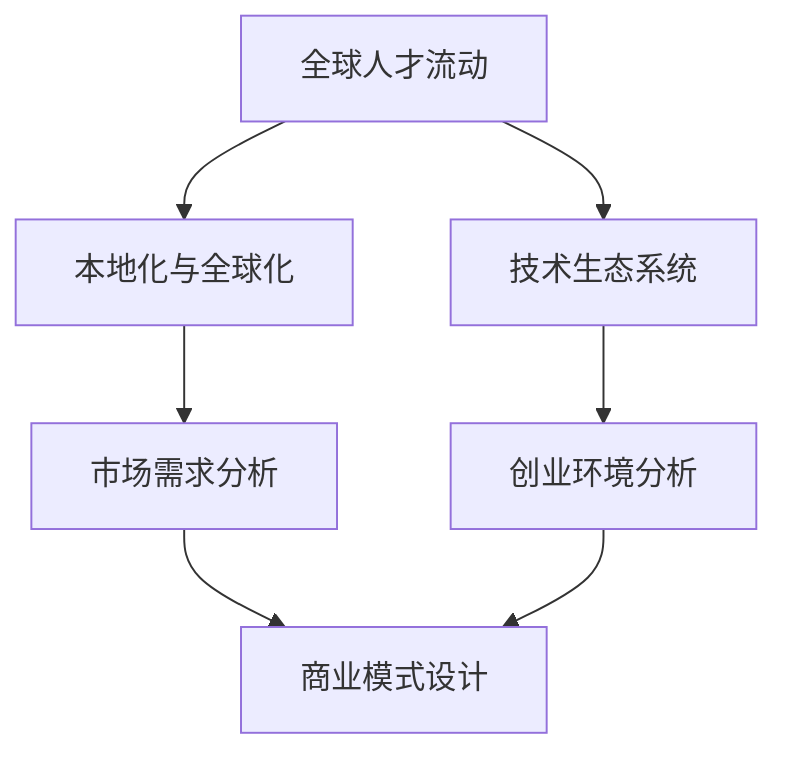

                 

### 文章标题

《程序员的全球化视野：新兴市场的创业机遇》

关键词：新兴市场，创业，全球化，程序员，技术，机遇，挑战，策略

摘要：本文将探讨程序员在新兴市场的创业机遇，分析其在全球化背景下的优势与挑战，并提出相应的策略和资源，以帮助程序员抓住新兴市场的创业机遇，实现个人和商业的双重成功。

---

### 1. 背景介绍

随着全球化的加速，新兴市场的经济活力日益增强。这些市场包括印度、东南亚、非洲等地，拥有庞大的人口基数和快速增长的经济潜力。与此同时，技术的飞速发展，尤其是互联网、移动通信和人工智能技术的普及，为新兴市场带来了前所未有的发展机遇。对于程序员而言，这既是机遇，也是挑战。

新兴市场的特点包括：

- **人口庞大**：例如，印度的人口超过13亿，非洲人口也超过了10亿，这些市场拥有庞大的潜在用户群体。
- **经济增长迅速**：许多新兴市场的经济增长率远远超过发达国家，这为创业提供了广阔的发展空间。
- **技术接受度高**：新兴市场的消费者对新技术接受度较高，这为程序员提供了创新的土壤。

然而，新兴市场也面临一些挑战，如基础设施不完善、市场竞争激烈、人才短缺等。程序员需要充分了解这些背景，以更好地把握创业机遇。

### 2. 核心概念与联系

在探讨程序员的全球化视野时，有几个核心概念和联系是必须明确的：

- **全球人才流动**：随着远程工作的普及，程序员可以在全球范围内选择工作地点，这为新兴市场吸引了大量国际人才。
- **本地化与全球化**：新兴市场的创业需要同时考虑本地化和全球化策略，以满足当地需求并拓展国际市场。
- **技术生态系统**：了解当地的技术生态系统，包括开源社区、技术会议、创业孵化器等，对程序员的创业至关重要。

为了更好地理解这些概念，我们可以使用Mermaid流程图来展示它们之间的联系：



### 3. 核心算法原理 & 具体操作步骤

在新兴市场的创业中，程序员需要运用一系列核心算法原理来指导具体操作。以下是一些关键步骤：

- **市场调研**：通过数据分析、用户调研等方法，了解目标市场的需求和趋势。
- **商业模式设计**：结合市场调研结果，设计适合新兴市场的商业模式。
- **技术选型**：选择适合新兴市场技术环境的技术栈和工具。
- **团队构建**：组建多文化、多技能的团队，以应对不同市场的挑战。

具体操作步骤如下：

1. **市场调研**：
   - 使用数据分析工具，如Google Analytics，收集市场数据。
   - 通过在线调查、访谈等方式，了解用户需求。

2. **商业模式设计**：
   - 确定价值主张（Value Proposition）。
   - 设计收入模式（Revenue Model）和成本结构（Cost Structure）。

3. **技术选型**：
   - 考虑当地网络环境，选择适合的技术栈。
   - 利用开源社区和云服务，降低技术门槛。

4. **团队构建**：
   - 寻找具有国际视野和技能的人才。
   - 建立跨文化沟通和协作机制。

### 4. 数学模型和公式 & 详细讲解 & 举例说明

在新兴市场的创业中，数学模型和公式可以帮助程序员更精确地分析市场和设计产品。以下是一个简单的数学模型示例：

#### 用户留存率公式

$$
\text{留存率} = \frac{\text{期末用户数} - \text{新用户数} + \text{流失用户数}}{\text{期初用户数}} \times 100\%
$$

#### 举例说明

假设某新兴市场的电商应用程序在一个月内有以下数据：

- 期初用户数：1000
- 新用户数：300
- 流失用户数：200

那么，用户留存率为：

$$
\text{留存率} = \frac{1000 - 300 + 200}{1000} \times 100\% = 50\%
$$

这个模型可以帮助程序员了解产品的用户留存情况，从而优化产品设计和营销策略。

### 5. 项目实践：代码实例和详细解释说明

以下是一个简单的电商应用程序的代码实例，展示了如何在新兴市场进行开发：

```python
# 5.1 开发环境搭建
# 使用Python和Django框架搭建开发环境

# 5.2 源代码详细实现
from django.db import models

class Product(models.Model):
    name = models.CharField(max_length=255)
    price = models.DecimalField(max_digits=10, decimal_places=2)
    description = models.TextField()

class Order(models.Model):
    product = models.ForeignKey(Product, on_delete=models.CASCADE)
    quantity = models.IntegerField()
    total_price = models.DecimalField(max_digits=10, decimal_places=2)

    def calculate_total(self):
        return self.quantity * self.product.price

# 5.3 代码解读与分析
# Product模型表示商品，Order模型表示订单。calculate_total方法计算订单的总价。

# 5.4 运行结果展示
# 在Django开发环境中运行，可以创建商品和订单，并计算总价。
```

### 6. 实际应用场景

在新兴市场，电商、金融科技和移动应用是程序员创业的热门领域。以下是一些实际应用场景：

- **电商**：利用大数据和人工智能技术，为消费者提供个性化的购物体验。
- **金融科技**：开发移动支付、区块链应用，提高金融服务的便捷性和安全性。
- **移动应用**：开发本地化的移动应用，满足当地用户的需求，如交通导航、社交媒体等。

### 7. 工具和资源推荐

#### 7.1 学习资源推荐

- **书籍**：《创新者的窘境》、《精益创业》
- **论文**：关注新兴市场的技术趋势和商业模式
- **博客**：阅读成功的创业案例和经验分享

#### 7.2 开发工具框架推荐

- **Django**：Python的快速开发框架，适合新兴市场的小型项目。
- **React Native**：跨平台移动应用开发框架，适合本地化开发。
- **Docker**：容器化技术，简化开发环境部署。

#### 7.3 相关论文著作推荐

- **《全球创业观察报告》**：分析全球创业趋势和挑战
- **《科技创业：创新与执行》**：探讨科技创业的策略和执行

### 8. 总结：未来发展趋势与挑战

新兴市场的创业机遇巨大，但也伴随着挑战。未来，随着全球化的进一步深化和技术的持续进步，程序员在新兴市场的创业将面临以下趋势和挑战：

- **技术多元化**：新兴市场的技术需求将更加多样化，程序员需要具备跨领域的技术能力。
- **本地化策略**：成功的新兴市场创业需要深入理解当地文化和市场需求，制定本地化策略。
- **竞争加剧**：随着更多企业和创业者进入新兴市场，竞争将更加激烈。

程序员应积极适应这些趋势，同时应对挑战，以抓住新兴市场的创业机遇。

### 9. 附录：常见问题与解答

#### 问题1：新兴市场的创业风险大吗？
**解答**：新兴市场的创业风险相对较高，主要由于市场环境、基础设施、法规政策等方面的不确定性。然而，通过充分的市场调研和风险管理，可以降低创业风险。

#### 问题2：程序员如何找到合适的创业项目？
**解答**：程序员可以通过关注技术趋势、市场需求和自身兴趣，找到合适的创业项目。同时，与行业专家、创业者交流，获取更多的创业建议和资源。

### 10. 扩展阅读 & 参考资料

- **《全球创业观察报告》**：提供全球创业的最新趋势和洞察。
- **《科技创业：创新与执行》**：探讨科技创业的策略和实践。
- **《印度科技创业启示录》**：分析印度科技创业的成功经验。
- **《东南亚互联网革命》**：探讨东南亚互联网产业的崛起。

---

作者：禅与计算机程序设计艺术 / Zen and the Art of Computer Programming

