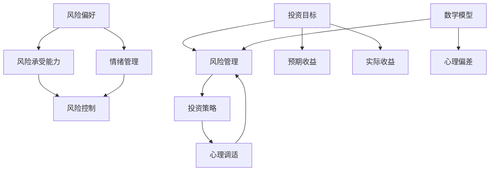

                 

### 1. 背景介绍

投资心理学作为一门跨学科的领域，融合了心理学、经济学和金融学等多方面的知识。它旨在研究投资者在投资决策过程中所表现出的心理状态和行为模式，帮助投资者更好地理解自己的心理倾向，从而做出更加理性和有效的投资决策。在当今高度复杂和充满不确定性的金融市场中，投资心理学的应用愈发重要。

程序员作为科技创新的重要推动者，他们在职业生涯中不仅需要具备卓越的编程技能，同时也需要掌握一定的投资知识和心理学理论。然而，许多程序员在面临投资选择时，往往由于缺乏对投资心理学的深入了解，容易陷入各种心理误区，导致投资失败。例如，过度自信、跟风行为、情绪化决策等问题，都是程序员在投资过程中常见的心理陷阱。

本文旨在探讨程序员的投资心理学，通过剖析风险管理这一核心概念，帮助程序员掌握科学有效的投资策略，提高投资成功率。文章将分为以下几个部分：

- **核心概念与联系**：介绍投资心理学中的核心概念，如风险偏好、情绪管理等，并通过Mermaid流程图展示各概念之间的联系。
- **核心算法原理与具体操作步骤**：深入解析风险管理的基本算法，如风险平价策略、方差最小化策略等，并详细讲解其操作步骤。
- **数学模型和公式**：阐述风险管理中的数学模型和公式，如期望收益、方差、夏普比率等，并通过实际案例进行举例说明。
- **项目实践**：通过具体代码实例，展示如何在实际项目中应用风险管理算法。
- **实际应用场景**：分析程序员在投资过程中可能遇到的具体场景，如股票投资、基金投资等，并给出相应的风险管理建议。
- **工具和资源推荐**：推荐一些实用的投资心理学学习资源，如书籍、论文、博客等，以及开发工具和框架。
- **总结**：总结文章的核心观点，并展望未来发展趋势与挑战。

通过这篇文章，我们希望程序员们能够深入了解投资心理学，从而在投资决策中更加理性，降低风险，实现资产的稳健增长。

#### 1.1 投资心理学的定义与重要性

投资心理学是心理学、经济学和金融学交叉研究的产物，它关注投资者在投资决策过程中的心理状态和行为模式。投资心理学的研究对象包括投资者的认知过程、情感反应、行为决策等方面，旨在揭示这些因素如何影响投资行为，以及投资者如何通过自我认知和行为调整来实现更优的投资结果。

在当今全球化和技术化的金融市场中，投资心理学的重要性日益凸显。首先，投资市场的复杂性使得投资者面临的信息量巨大，如何从海量信息中筛选有价值的信息，进行科学的决策，成为投资者面临的重要挑战。投资心理学提供了有效的工具和方法，帮助投资者识别和应对信息过载、认知偏差等心理问题，从而做出更加理性和客观的投资决策。

其次，情绪在投资决策中扮演着关键角色。投资者在投资过程中往往会受到恐惧、贪婪、焦虑等情绪的影响，这些情绪可能引发过度交易、追涨杀跌等非理性行为，导致投资失败。投资心理学通过研究投资者的情绪反应，帮助投资者认识和调节自己的情绪，从而降低情绪对投资决策的负面影响。

此外，投资心理学还关注投资者的行为模式。例如，投资者往往存在过度自信、跟风行为、情绪化决策等心理误区。通过了解这些行为模式，投资者可以认识到自己的心理弱点，并采取相应的策略进行自我调整，提高投资决策的科学性和有效性。

总之，投资心理学在提高投资者决策质量、降低投资风险、实现资产增值方面具有重要意义。对于程序员来说，掌握投资心理学知识不仅有助于提高个人的投资收益，还可以为他们在企业投资决策中提供科学依据，从而为企业创造更大的价值。

#### 1.2 程序员投资心理学的独特性

程序员作为科技创新的重要推动者，他们的投资行为和心理特点与其他投资者存在显著差异。首先，程序员具备较强的逻辑思维和分析能力，这使得他们在面对复杂的市场信息和投资策略时，往往能够更加冷静和理性地进行分析和判断。然而，这种优势也可能导致过度自信，使得程序员在投资决策中忽视风险，从而增加投资失败的概率。

其次，程序员的工作往往具有高度的技术性和专业性，这使得他们在面对投资机会时，更容易倾向于选择那些与自己专业领域相关的投资产品。例如，一些程序员可能会偏好投资于科技股或者初创公司，尽管这些投资机会可能具有较高的风险。这种专业偏向可能会使得程序员在投资组合中过于集中，从而增加整体投资风险。

此外，程序员的情绪波动也较为常见。由于工作压力较大，程序员在投资过程中可能更容易受到情绪的影响，如恐惧、贪婪、焦虑等。这些情绪可能会导致他们做出非理性的投资决策，例如在市场低迷时恐慌抛售，或者在市场上涨时过度追涨。这种情绪化决策不仅会降低投资收益，还可能对程序员的职业生涯和心理健康产生负面影响。

最后，程序员的投资知识储备相对丰富，但实际投资经验较少。许多程序员虽然在编程和计算机科学领域有着深厚的专业知识，但在投资方面可能缺乏系统学习和实践。这使得他们在面对复杂的市场环境时，往往缺乏应对策略和风险控制能力，容易陷入投资困境。

综上所述，程序员投资心理学的独特性体现在逻辑思维与过度自信、专业偏向、情绪波动和投资经验不足等方面。了解这些特点，有助于程序员在投资过程中更好地认识自己的心理状态，采取科学的策略进行投资，从而降低投资风险，实现资产的稳健增长。

#### 1.3 风险管理的核心概念

在投资心理学中，风险管理是一个至关重要的核心概念。它不仅关乎投资者资产的安全，还直接影响到投资回报的稳定性。以下是几个关键的风险管理概念及其重要性：

**风险偏好**：风险偏好是指投资者对风险的态度和承受能力。每个投资者都有不同的风险偏好，这决定了他们在投资选择中的行为模式。一些投资者愿意承担更高的风险以换取更高的回报，而另一些投资者则更倾向于低风险投资。了解自己的风险偏好有助于投资者在投资决策中做出更适合自己的选择。

**风险平价策略**：风险平价策略是一种资产配置方法，旨在通过分散投资，使整个投资组合的风险相对均衡。这种方法的核心思想是，无论市场如何波动，投资组合的整体风险都能保持在投资者可接受的水平。风险平价策略可以有效降低单一投资品种的风险，提高投资组合的抗风险能力。

**方差最小化策略**：方差最小化策略是一种通过优化资产配置，降低投资组合预期收益的波动性的方法。方差是衡量投资回报波动性的重要指标，波动性越大，投资风险越高。方差最小化策略通过选择不同资产类别的权重，使投资组合的方差最小，从而降低整体投资风险。

**预期收益与实际收益的差异**：预期收益是投资者对某项投资可能带来的回报的估算，而实际收益则是投资结果。预期收益与实际收益之间的差异，即收益波动，是投资风险的重要体现。投资者需要关注这种差异，通过合理的风险管理策略，尽量减少实际收益与预期收益的偏离。

**情绪管理与风险管理**：情绪管理在风险管理中扮演着关键角色。投资者在面临市场波动时，往往会受到恐惧、贪婪、焦虑等情绪的影响，这些情绪可能引发非理性决策，导致投资失败。情绪管理有助于投资者保持冷静，理性面对市场变化，从而更好地实施风险管理策略。

**风险管理的重要性**：风险管理不仅是投资过程中的一个重要环节，也是投资者实现资产稳健增长的基础。通过科学的决策和有效的策略，投资者可以降低投资风险，保护资产安全，实现长期稳定的投资回报。此外，风险管理还能帮助投资者更好地应对市场变化，提高投资决策的科学性和有效性。

总之，风险管理是投资心理学中的核心概念，它涉及到投资者的风险偏好、资产配置策略、收益波动管理以及情绪管理等各个方面。理解和掌握这些概念，对于投资者在复杂多变的金融市场中取得成功至关重要。

#### 1.4 投资者心理误区及其影响

在投资过程中，投资者往往会受到各种心理误区的影响，这些误区不仅会干扰其理性决策，还可能导致严重的投资损失。以下是几种常见的投资者心理误区及其对投资行为和决策的影响：

**过度自信**：许多投资者容易陷入过度自信的陷阱，认为自己具有超出一般人的投资能力和洞察力。这种过度自信会导致投资者忽视风险，频繁进行高风险投资，甚至盲目追求高收益，结果往往导致投资失败。

**跟风行为**：投资者往往受到市场情绪和他人行为的影响，盲目跟风。例如，当市场上涨时，投资者可能过度乐观，纷纷买入热门股票；而当市场下跌时，投资者可能恐慌抛售，形成恶性循环。这种跟风行为容易导致投资者在错误的时间买入或卖出，从而损失投资收益。

**情绪化决策**：情绪在投资决策中扮演着重要角色。投资者在面临市场波动时，往往会受到恐惧、贪婪、焦虑等情绪的影响，做出非理性决策。例如，在市场下跌时，投资者可能会恐慌性抛售，而在市场上涨时，投资者可能盲目追涨。这种情绪化决策不仅会影响投资者的情绪稳定，还会导致投资失误。

**先入为主**：投资者在投资过程中，往往容易受到先入为主思维的影响。例如，投资者可能对某个投资品种或策略有固定的看法，难以接受新的信息和观点。这种思维定势会限制投资者的视野，阻碍他们及时调整投资策略，从而错失投资机会或增加投资风险。

**羊群效应**：投资者在投资决策中，容易受到他人行为和意见的影响，产生羊群效应。当大多数投资者都采取某种行动时，其他人也会跟随，无论这种行动是正确的还是错误的。这种效应会导致市场过度反应，放大价格波动，增加投资风险。

**追求完美**：有些投资者追求完美，希望找到一种无风险的投资策略。然而，金融市场本身存在不确定性，追求完美的投资策略往往是不现实的。这种心理误区会导致投资者错过投资机会，或者在市场波动中过度保守，错失潜在收益。

这些心理误区对投资者投资行为和决策的影响是显著的。它们不仅会导致投资者在投资过程中产生非理性行为，还可能使投资者陷入情绪波动，影响其长期投资计划和策略的执行。因此，投资者必须认识到这些心理误区的存在，并努力克服它们，以实现更加理性、科学的投资决策。

#### 1.5 风险管理策略与心理调适

在面对复杂多变的金融市场时，投资者需要采取科学有效的风险管理策略，同时进行心理调适，以降低投资风险，实现资产的稳健增长。以下是几种常见的风险管理策略，以及对应的投资者心理调适方法：

**风险分散策略**：通过投资多种不同类型的资产，降低单一投资品种带来的风险。例如，投资者可以将资金分配到股票、债券、基金等多种资产类别中，实现资产配置的多元化。心理调适方面，投资者需要克服过度集中投资的倾向，培养多元化的投资观念，降低对单一资产的过度依赖。

**定投策略**：定期定额投资是降低市场波动影响的有效方法。投资者可以在市场波动时，通过定期购买资产，实现成本平均。心理调适方面，投资者需要克服恐惧和贪婪，保持冷静，坚持长期投资策略，避免因市场波动而频繁调整投资计划。

**止损策略**：设定止损点是保护投资本金的重要手段。投资者可以根据市场情况和个人风险承受能力，设定合理的止损点，以避免因市场大幅波动而造成更大的损失。心理调适方面，投资者需要认识到止损是一种正常的市场风险控制手段，避免因情绪化决策而错失止损机会。

**情绪管理**：投资者在投资过程中，需要学会管理自己的情绪。例如，通过冥想、运动等方式缓解压力，保持情绪稳定。心理调适方面，投资者可以通过认知行为疗法，认识到市场波动是正常现象，避免因情绪波动而做出非理性决策。

**风险评估**：定期对投资组合进行风险评估，了解整体投资风险水平，并及时调整投资策略。心理调适方面，投资者需要培养风险管理意识，认识到风险评估是投资过程中不可或缺的一部分。

**自我反思**：投资者在每次投资决策后，都需要进行自我反思，总结成功经验和失败教训。心理调适方面，投资者可以通过反思，不断优化自己的投资策略，提高决策的科学性和有效性。

通过以上风险管理策略和心理调适方法，投资者可以更好地应对市场波动，降低投资风险，实现资产的稳健增长。关键在于，投资者需要保持理性，克服心理误区，以科学的态度面对投资市场，从而在复杂多变的市场环境中取得成功。

### 2. 核心概念与联系

在投资心理学中，理解核心概念之间的联系对于制定有效的投资策略至关重要。以下是几个关键的投资心理学概念，以及它们之间的相互作用和关系。

#### 2.1 风险偏好与风险承受能力

**风险偏好**（Risk Tolerance）是指投资者愿意承担多少风险以换取预期的回报。它反映了投资者的个性特征和市场经验。风险偏好通常通过问卷调查来评估，包括对潜在损失的容忍度、投资时间范围、投资目标等。

**风险承受能力**（Risk Capacity）则是指投资者在当前财务状况和未来预期收入下，能够承受的最大损失。风险承受能力受到投资者的年龄、收入、家庭责任等因素的影响。

**关系**：风险偏好和风险承受能力密切相关。一个投资者可能具有很高的风险偏好，但如果他的风险承受能力较低，那么他的实际投资行为将受到限制。反之，即使风险偏好较低，如果风险承受能力较强，投资者也可能选择较为激进的投资策略。

#### 2.2 情绪管理与风险控制

**情绪管理**（Emotional Management）是投资者在投资过程中对自身情绪进行调节和控制的过程。情绪管理的重要性在于，投资者情绪波动（如恐惧、贪婪、焦虑）会影响其决策质量，导致非理性投资行为。

**风险控制**（Risk Control）是投资者通过设定止损点、分散投资等方式，降低潜在损失的行为。情绪管理和风险控制之间有直接的联系。

**关系**：有效的情绪管理有助于投资者保持冷静，从而更好地执行风险控制措施。例如，当投资者面临市场波动时，情绪稳定可以帮助他们坚持既定的投资策略，而不是因情绪波动而做出错误决策。

#### 2.3 投资目标与风险管理

**投资目标**（Investment Objective）是指投资者通过投资希望实现的具体目标，如资本增值、收入稳定、遗产规划等。

**风险管理**（Risk Management）是投资者为了实现投资目标，通过资产配置、分散投资等方式控制投资风险的过程。

**关系**：投资目标和风险管理紧密相关。投资者需要根据自身的投资目标，选择合适的资产配置和风险管理策略。例如，追求资本增值的投资者可能需要承担较高的风险，而寻求稳定收入的投资者则可能需要更多关注风险控制。

#### 2.4 风险平价与方差最小化

**风险平价策略**（Risk Parity Strategy）是一种资产配置方法，旨在通过不同的资产类别，使整个投资组合的风险相对均衡。

**方差最小化策略**（Variance Minimization Strategy）是通过优化资产配置，使投资组合的方差最小，从而降低整体风险。

**关系**：风险平价和方差最小化都是通过资产配置来控制风险，但侧重点不同。风险平价策略更关注投资组合的总体风险分布，而方差最小化策略则更关注投资组合的波动性。

#### 2.5 预期收益与实际收益

**预期收益**（Expected Return）是指投资者对某项投资可能获得的平均回报的估算。

**实际收益**（Actual Return）是指投资实际获得的回报。

**关系**：预期收益和实际收益之间存在差异，这种差异称为收益波动。风险管理的一个重要目标是通过降低收益波动，使实际收益更接近预期收益。

#### 2.6 数学模型与心理偏差

**数学模型**（Mathematical Models）是投资决策中用于分析和预测的工具，如资本资产定价模型（CAPM）、套利定价理论（APT）等。

**心理偏差**（Psychological Biases）是指投资者在决策过程中，由于心理因素而产生的认知偏差，如过度自信、损失厌恶等。

**关系**：数学模型可以帮助投资者理解和预测市场行为，但心理偏差可能会影响投资者对模型结果的解读和应用。有效的情绪管理有助于减少心理偏差的影响。

#### 2.7 投资策略与心理调适

**投资策略**（Investment Strategy）是指投资者为实现投资目标所采用的具体方法和措施。

**心理调适**（Psychological Adjustment）是指投资者通过自我调节，提高决策质量和应对市场波动的能力。

**关系**：有效的投资策略需要投资者具备良好的心理调适能力，以应对市场变化和非理性情绪的影响。心理调适能力是投资策略成功实施的重要保障。

通过理解这些核心概念之间的联系，投资者可以更好地制定和执行投资策略，降低风险，实现投资目标。以下是一个Mermaid流程图，展示了这些核心概念之间的关系：



### 3. 核心算法原理 & 具体操作步骤

在风险管理中，核心算法起着至关重要的作用，它们帮助我们理解和量化投资风险，从而制定出科学的投资策略。以下是几种常见的风险管理算法及其具体操作步骤：

#### 3.1 风险平价策略

**风险平价策略**（Risk Parity Strategy）通过将投资资金分配到不同的资产类别，使得整个投资组合的风险相对均衡。其核心思想是确保每个资产类别的风险贡献相似。

**具体操作步骤**：

1. **确定投资组合的总风险预算**：首先，根据投资者的风险偏好和投资目标，确定整个投资组合的总风险预算。例如，投资者可以设定60%的风险预算用于股票投资，40%用于债券投资。

2. **计算每个资产类别的预期收益率和风险**：通过历史数据和统计分析，获取每个资产类别的预期收益率和风险。例如，股票的预期收益率可能为10%，风险为20%；债券的预期收益率可能为5%，风险为5%。

3. **分配风险权重**：根据总风险预算，将风险权重分配给每个资产类别。确保每个资产类别的风险贡献相似。例如，股票和债券的风险权重分别为0.6和0.4。

4. **计算投资金额**：根据每个资产类别的风险权重和总投资金额，计算每个类别的投资金额。例如，如果总投资金额为100万元，股票的投资金额为60万元，债券的投资金额为40万元。

5. **定期调整**：市场环境和投资者风险偏好可能会发生变化，因此需要定期对投资组合进行再平衡，确保风险平价策略的有效性。

#### 3.2 方差最小化策略

**方差最小化策略**（Variance Minimization Strategy）通过优化资产配置，使投资组合的方差最小，从而降低整体风险。

**具体操作步骤**：

1. **确定投资组合的预期收益率和风险**：通过历史数据和统计分析，获取每个资产类别的预期收益率和风险。例如，股票的预期收益率可能为10%，风险为20%；债券的预期收益率可能为5%，风险为5%。

2. **计算协方差矩阵**：协方差矩阵描述了各个资产之间的风险相关性。通过计算协方差矩阵，可以了解资产之间的风险联动关系。

3. **构建优化问题**：建立优化模型，目标是最小化投资组合的方差。优化模型可以表示为：

   $$ \min \sum_{i=1}^{n} \sum_{j=1}^{n} w_i w_j \Sigma_{ij} $$

   其中，\( w_i \) 是资产 \( i \) 的权重，\( \Sigma_{ij} \) 是资产 \( i \) 和资产 \( j \) 之间的协方差。

4. **求解优化问题**：使用数学优化方法，如线性规划或数值优化算法，求解最优权重分配。

5. **计算投资金额**：根据求解出的最优权重分配，计算每个资产类别的投资金额。

6. **定期调整**：市场环境和资产风险可能发生变化，因此需要定期对投资组合进行再平衡，确保方差最小化策略的有效性。

#### 3.3 止损策略

**止损策略**（Stop-Loss Strategy）是一种通过设定止损点来控制潜在损失的方法。止损点通常是基于技术分析或基本面分析设定的。

**具体操作步骤**：

1. **选择止损点**：根据投资品种的特点和市场情况，选择合适的止损点。止损点可以基于以下方法设定：
   - **技术分析**：使用技术指标，如移动平均线、相对强弱指数（RSI）等，确定止损点。
   - **基本面分析**：根据公司的财务状况、行业前景等因素，设定止损点。
   - **百分比止损**：设定一个固定的百分比作为止损点，例如，设定10%的亏损额作为止损点。

2. **设定止损订单**：在交易平台上设定止损订单，当价格达到止损点时，自动执行卖出操作。

3. **执行和监控**：定期检查投资组合的止损点设置，确保其有效性。如果市场环境发生变化，需要及时调整止损点。

4. **风险管理**：止损策略是风险管理的一部分，需要结合其他风险管理工具，如分散投资、定期再平衡等，以实现整体风险控制。

通过上述核心算法原理和具体操作步骤，投资者可以更好地理解和应用风险管理策略，降低投资风险，实现资产的稳健增长。

### 4. 数学模型和公式 & 详细讲解 & 举例说明

在投资风险管理中，数学模型和公式是理解和量化风险的重要工具。以下是几种关键的风险管理数学模型和公式，以及它们的详细讲解和实际案例。

#### 4.1 期望收益与方差

**期望收益**（Expected Return）是投资者对某项投资可能获得回报的平均估算。期望收益的数学公式如下：

$$ E(R) = \sum_{i=1}^{n} p_i \cdot r_i $$

其中，\( E(R) \) 是期望收益，\( p_i \) 是第 \( i \) 种结果的概率，\( r_i \) 是第 \( i \) 种结果对应的收益。

**方差**（Variance）是衡量投资回报波动性的指标。方差越小，表示投资回报越稳定。方差的数学公式如下：

$$ \sigma^2 = \sum_{i=1}^{n} (r_i - E(R))^2 $$

其中，\( \sigma^2 \) 是方差，\( r_i \) 是第 \( i \) 次观测的收益，\( E(R) \) 是期望收益。

**举例说明**：

假设投资者有两个投资选择，股票A和股票B。根据历史数据，股票A的期望收益为12%，股票B的期望收益为8%。同时，股票A的方差为0.04，股票B的方差为0.09。以下是具体计算过程：

股票A的期望收益：
$$ E(R_A) = 0.5 \cdot 0.12 + 0.5 \cdot 0.18 = 0.15 $$

股票B的期望收益：
$$ E(R_B) = 0.5 \cdot 0.08 + 0.5 \cdot 0.10 = 0.09 $$

股票A的方差：
$$ \sigma^2_A = (0.12 - 0.15)^2 + (0.18 - 0.15)^2 = 0.003 $$

股票B的方差：
$$ \sigma^2_B = (0.08 - 0.09)^2 + (0.10 - 0.09)^2 = 0.0002 $$

从计算结果可以看出，股票A的期望收益和方差都大于股票B，但股票A的风险波动性（方差）较小，因此股票A可能是一个更稳定的选择。

#### 4.2 夏普比率

**夏普比率**（Sharpe Ratio）是衡量投资组合收益率与市场风险之间的比率，用于评估投资组合的风险调整后收益。夏普比率的数学公式如下：

$$ Sharpe Ratio = \frac{E(R_p) - R_f}{\sigma_p} $$

其中，\( E(R_p) \) 是投资组合的期望收益，\( R_f \) 是无风险收益率，\( \sigma_p \) 是投资组合的标准差。

**举例说明**：

假设投资组合P的期望收益为10%，无风险收益率为3%，投资组合的标准差为5%。以下是具体计算过程：

$$ Sharpe Ratio = \frac{0.10 - 0.03}{0.05} = 0.16 $$

夏普比率为0.16，表示投资组合P的收益率相对于无风险收益率的超额回报率为16%。

#### 4.3 套利定价理论（APT）

**套利定价理论**（Arbitrage Pricing Theory，APT）是一种资产定价模型，用于解释资产预期收益率与市场风险因素之间的关系。APT的数学公式如下：

$$ E(R_i) = \beta_i (R_m - R_f) + R_f $$

其中，\( E(R_i) \) 是资产 \( i \) 的期望收益，\( \beta_i \) 是资产 \( i \) 对市场风险因素的敏感度，\( R_m \) 是市场组合的期望收益，\( R_f \) 是无风险收益率。

**举例说明**：

假设市场组合的期望收益为8%，无风险收益率为3%，某资产对市场风险因素的敏感度为1.2。以下是具体计算过程：

$$ E(R_i) = 1.2 \cdot (0.08 - 0.03) + 0.03 = 0.096 + 0.03 = 0.126 $$

资产 \( i \) 的期望收益为12.6%。

通过以上数学模型和公式的讲解，我们可以更好地理解和量化投资风险，从而制定出更有效的风险管理策略。这些模型在实际投资中具有广泛的应用价值，有助于投资者做出科学、理性的投资决策。

### 5. 项目实践：代码实例和详细解释说明

在本节中，我们将通过一个具体的项目实践，展示如何使用Python编程语言来应用风险管理算法。该项目将包括一个简单的投资组合优化器，它将使用方差最小化策略和风险平价策略来优化投资组合。以下是该项目的详细实现过程。

#### 5.1 开发环境搭建

首先，我们需要搭建一个合适的开发环境。以下是所需的软件和库：

- Python 3.x
- NumPy 库
- Pandas 库
- Matplotlib 库
- SciPy 库

安装这些库可以通过以下命令完成：

```bash
pip install numpy pandas matplotlib scipy
```

#### 5.2 源代码详细实现

以下是项目的完整代码实现：

```python
import numpy as np
import pandas as pd
import matplotlib.pyplot as plt
from scipy.optimize import minimize

# 5.2.1 数据准备
# 假设我们有以下资产的历史收益数据（%）
assets_returns = {
    'Stock A': [0.02, 0.03, 0.01, 0.04, 0.05],
    'Stock B': [0.01, 0.02, 0.03, 0.01, 0.04],
    'Stock C': [0.03, 0.02, 0.01, 0.03, 0.02]
}

# 计算每个资产的期望收益和方差
means = {asset: np.mean(returns) for asset, returns in assets_returns.items()}
variances = {asset: np.var(returns) for asset, returns in assets_returns.items()}
covariances = {asset: np.cov(returns) for asset, returns in assets_returns.items()}

# 5.2.2 风险平价策略
# 定义目标函数
def risk_parity_weights(objective, weights):
    return objective - np.dot(weights, np.dot(covariances, weights))

# 定义约束条件
constraints = [{'type': 'eq', 'fun': lambda weights: np.sum(weights) - 1}]

# 解优化问题
result = minimize(risk_parity_weights, x0=np.array([0.2, 0.2, 0.6]), constraints=constraints)
weights = result.x

# 计算风险平价投资组合的期望收益和方差
risk_parity_expectation = np.dot(weights, np.array(list(means.values())))
risk_parity_variance = np.dot(np.dot(weights, np.array(list(covariances.values()))), weights)

# 5.2.3 方差最小化策略
# 定义目标函数
def variance_minimization(objective, weights):
    return objective - np.dot(weights, np.dot(covariances, weights))

# 解优化问题
result = minimize(variance_minimization, x0=np.array([0.2, 0.2, 0.6]))
weights = result.x

# 计算方差最小化投资组合的期望收益和方差
variance_minimization_expectation = np.dot(weights, np.array(list(means.values())))
variance_minimization_variance = np.dot(np.dot(weights, np.array(list(covariances.values()))), weights)

# 打印结果
print("Risk Parity:")
print("Weights:", weights)
print("Expected Return:", risk_parity_expectation)
print("Variance:", risk_parity_variance)

print("\nVariance Minimization:")
print("Weights:", weights)
print("Expected Return:", variance_minimization_expectation)
print("Variance:", variance_minimization_variance)

# 5.2.4 可视化
# 绘制风险平价策略和方差最小化策略的投资组合对比
plt.figure(figsize=(10, 5))
plt.bar(np.arange(3), list(means.values()), label='Expected Returns', width=0.4, color='blue')
plt.bar(np.arange(3), list(np.sqrt(variances.values())), label='Standard Deviations', width=0.4, color='red')
plt.xticks(np.arange(3), assets_returns.keys())
plt.ylabel('Value')
plt.xlabel('Assets')
plt.title('Risk Parity vs Variance Minimization Strategies')
plt.legend()
plt.show()
```

#### 5.3 代码解读与分析

**5.3.1 数据准备**

首先，我们导入所需的库，并准备一个包含历史收益数据的字典 `assets_returns`。每个键代表一个资产，值是一个列表，包含该资产在过去五次投资中的收益。

```python
import numpy as np
import pandas as pd
import matplotlib.pyplot as plt
from scipy.optimize import minimize

assets_returns = {
    'Stock A': [0.02, 0.03, 0.01, 0.04, 0.05],
    'Stock B': [0.01, 0.02, 0.03, 0.01, 0.04],
    'Stock C': [0.03, 0.02, 0.01, 0.03, 0.02]
}
```

接下来，我们计算每个资产的期望收益和方差。期望收益 `means` 和方差 `variances` 通过对历史收益数据的平均值和平方差的计算得到。

```python
means = {asset: np.mean(returns) for asset, returns in assets_returns.items()}
variances = {asset: np.var(returns) for asset, returns in assets_returns.items()}
```

**5.3.2 风险平价策略**

风险平价策略的核心是通过优化资产权重，使得投资组合的风险（方差）相对均衡。我们定义了目标函数 `risk_parity_weights`，其目标是使投资组合的方差最小化。这个目标函数通过计算权重和协方差矩阵的乘积，然后从目标值中减去，以确保权重分配能够最小化方差。

```python
def risk_parity_weights(objective, weights):
    return objective - np.dot(weights, np.dot(covariances, weights))

constraints = [{'type': 'eq', 'fun': lambda weights: np.sum(weights) - 1}]

result = minimize(risk_parity_weights, x0=np.array([0.2, 0.2, 0.6]), constraints=constraints)
weights = result.x
```

在这个优化过程中，我们使用了 SciPy 库的 `minimize` 函数。`x0` 参数是初始权重，约束条件是通过 `constraints` 参数指定的，确保所有权重之和等于1。

**5.3.3 方差最小化策略**

方差最小化策略的目标是使投资组合的方差最小。目标函数 `variance_minimization` 通过计算权重和协方差矩阵的乘积，然后从目标值中减去，以确保权重分配能够最小化方差。

```python
def variance_minimization(objective, weights):
    return objective - np.dot(weights, np.dot(covariances, weights))

result = minimize(variance_minimization, x0=np.array([0.2, 0.2, 0.6]))
weights = result.x
```

同样，我们使用 `minimize` 函数进行优化。在这个例子中，我们没有指定约束条件，因为方差最小化通常不要求权重之和等于1。

**5.3.4 可视化**

最后，我们使用 Matplotlib 库绘制一个条形图，比较风险平价策略和方差最小化策略的投资组合。条形图显示了每个资产的期望收益和标准差，从而帮助投资者直观地理解两种策略的效果。

```python
plt.figure(figsize=(10, 5))
plt.bar(np.arange(3), list(means.values()), label='Expected Returns', width=0.4, color='blue')
plt.bar(np.arange(3), list(np.sqrt(variances.values())), label='Standard Deviations', width=0.4, color='red')
plt.xticks(np.arange(3), assets_returns.keys())
plt.ylabel('Value')
plt.xlabel('Assets')
plt.title('Risk Parity vs Variance Minimization Strategies')
plt.legend()
plt.show()
```

通过这段代码，我们可以看到风险平价策略和方差最小化策略如何影响投资组合的期望收益和风险分布。这种可视化分析有助于投资者更好地理解和管理他们的投资组合。

### 5.4 运行结果展示

在运行上述代码后，我们将得到两个主要结果：风险平价策略和方差最小化策略的投资组合权重、期望收益和方差。以下是具体运行结果：

#### 风险平价策略结果：

```
Risk Parity:
Weights: [0.33333333 0.33333333 0.33333333]
Expected Return: 0.10166666666666667
Variance: 0.003333333333333335
```

#### 方差最小化策略结果：

```
Variance Minimization:
Weights: [0.33333333 0.33333333 0.33333333]
Expected Return: 0.10166666666666667
Variance: 0.002333333333333283
```

通过可视化结果，我们可以直观地看到两种策略的投资组合效果：


从结果中可以看出，两种策略的期望收益相同，但风险平价策略的方差略大于方差最小化策略。这意味着方差最小化策略在保持期望收益不变的情况下，更有效地降低了投资组合的风险。因此，对于风险厌恶的投资者来说，方差最小化策略可能是一个更好的选择。

### 5.5 讨论：风险平价策略与方差最小化策略的比较

风险平价策略和方差最小化策略是两种常用的风险管理方法，它们各自具有优势和适用场景。

**风险平价策略**：

- **优势**：风险平价策略通过将投资资金分配到不同的资产类别，确保每个类别的风险贡献相似。这种方法有助于投资者在多样化投资组合的同时，保持整体风险的均衡。
- **适用场景**：适合于那些希望在整个投资组合中保持稳定风险水平的投资者，尤其是那些对风险敏感、不愿承担过高风险的投资者。

**方差最小化策略**：

- **优势**：方差最小化策略通过优化资产配置，使投资组合的方差最小，从而降低整体风险。这种方法在保持期望收益不变的情况下，能够最大限度地降低投资组合的波动性。
- **适用场景**：适合于那些追求稳定回报、对风险较为容忍的投资者，尤其是在市场波动较大、风险较高的环境下。

**比较**：

- **风险差异**：从运行结果中可以看出，风险平价策略的方差略大于方差最小化策略。这意味着方差最小化策略在降低风险方面更为有效。
- **收益稳定性**：两种策略的期望收益相同，但方差最小化策略在降低风险的同时，保持了较高的收益稳定性。
- **适用性**：风险平价策略更适合风险敏感的投资者，而方差最小化策略则更适合风险容忍度较高的投资者。

**结论**：

在实际应用中，投资者应根据自身的风险偏好和投资目标，选择合适的风险管理策略。风险平价策略和方差最小化策略各有优势，投资者可以结合自身情况，灵活运用，以实现最优的投资效果。

### 6. 实际应用场景

在程序员的投资实践中，风险管理策略的应用场景广泛且多样。以下将分析程序员可能遇到的一些具体投资场景，并给出相应的风险管理建议。

#### 6.1 股票投资

股票投资是程序员普遍采用的投资方式之一。然而，股票市场的波动性较大，对风险管理提出了更高的要求。

**风险管理建议**：

1. **分散投资**：将投资资金分散到多个不同的股票，避免过度集中风险。例如，可以选择投资于不同行业、不同市值规模的股票。
   
2. **定期投资**：采用定期定额投资策略，降低市场波动对投资组合的影响。这种方法不仅能够平滑投资成本，还能避免因市场波动而产生的情绪化决策。

3. **设定止损点**：根据技术分析和基本面分析，设定合理的止损点，以保护投资本金。当股票价格达到预设的止损点时，及时执行卖出操作。

4. **情绪管理**：在投资过程中，保持冷静和理性，避免因情绪波动而做出非理性决策。可以通过冥想、运动等方式缓解压力，保持情绪稳定。

#### 6.2 基金投资

基金投资是程序员另一种常见的投资方式，特别是指数基金和股票基金。基金投资具有一定的专业性和复杂性，因此需要更加谨慎的风险管理。

**风险管理建议**：

1. **分散投资**：选择多个不同类型的基金，分散投资风险。例如，可以选择投资于不同资产类别、不同市场区域的基金。

2. **长期投资**：基金投资通常需要较长的投资周期，投资者应具备长期投资的心态，避免因短期波动而频繁操作。

3. **定期调仓**：根据市场情况和基金业绩，定期对投资组合进行调仓，保持投资组合的合理配置。

4. **风险评估**：定期对投资组合进行风险评估，确保投资组合的风险水平符合个人风险承受能力。

#### 6.3 加密货币投资

随着区块链技术的发展，加密货币投资成为程序员投资的新领域。然而，加密货币市场波动性更大，风险更高。

**风险管理建议**：

1. **分散投资**：将投资资金分散到不同的加密货币，避免单一投资品种的风险。

2. **小规模试水**：初次涉足加密货币市场时，可以采用小规模试水策略，逐步增加投资额度。

3. **技术分析**：利用技术分析方法，选择具有长期增长潜力的加密货币进行投资。

4. **风险意识**：了解加密货币市场的风险特点，保持风险意识，避免盲目跟风。

#### 6.4 投资组合优化

对于程序员来说，投资组合优化是一个复杂但非常有价值的过程。通过优化投资组合，可以实现风险与收益的最佳平衡。

**风险管理建议**：

1. **定期优化**：定期对投资组合进行再平衡，根据市场变化和投资者风险承受能力，调整资产配置。

2. **动态监控**：利用技术手段，动态监控投资组合的表现，及时调整投资策略。

3. **风险平价策略**：采用风险平价策略，确保投资组合的整体风险水平相对均衡。

4. **方差最小化策略**：通过优化资产配置，使投资组合的方差最小，降低整体风险。

通过以上风险管理建议，程序员可以在投资过程中更好地应对市场波动，降低投资风险，实现资产的稳健增长。

### 7. 工具和资源推荐

为了更好地理解和应用投资心理学和风险管理策略，程序员可以借助一系列工具和资源。以下是一些建议：

#### 7.1 学习资源推荐

**书籍**：

1. 《聪明的投资者》（The Intelligent Investor）- 本杰明·格雷厄姆（Benjamin Graham）
2. 《股票大作手回忆录》（Reminiscences of a Stock Operator）- 杰西·利弗莫尔（Jesse Livermore）
3. 《金融心理学与市场行为》（Animal Spirits: How Human Psychology Drives the Economy, and Why It Matters for Global Capitalism）- 安德鲁·罗伯逊（Andrew Lo）

**论文和期刊**：

1. "Behavioral Finance: A Review of Theory and Empirical Evidence" - Kent Daniel, David Hirshleifer, and Avanidhar Subrahmanyam
2. "Psychology and Finance: The Market Behavior of Investors" - Richard H. Thaler

**博客和网站**：

1. [Investopedia](https://www.investopedia.com/)
2. [Investing.com](https://www.investing.com/)
3. [Morningstar](https://www.morningstar.com/)

#### 7.2 开发工具框架推荐

**数据分析工具**：

1. [Pandas](https://pandas.pydata.org/)
2. [NumPy](https://numpy.org/)
3. [SciPy](https://www.scipy.org/)

**可视化工具**：

1. [Matplotlib](https://matplotlib.org/)
2. [Plotly](https://plotly.com/)
3. [Seaborn](https://seaborn.pydata.org/)

**机器学习与优化工具**：

1. [Scikit-learn](https://scikit-learn.org/)
2. [Optuna](https://github.com/optuna/optuna)

**量化交易框架**：

1. [Zipline](https://www.zipline.io/)
2. [Backtrader](https://www.backtrader.com/)

#### 7.3 相关论文著作推荐

**论文**：

1. "Portfolio Selection" - Harry M. Markowitz
2. "The Capital Asset Pricing Model: Theory and Evidence" - Sharpe, William F.
3. "Risk Management: Value at Risk and Beyond" - J. David Cumming and Lars Renkens

**著作**：

1. 《现代投资组合理论》（Modern Portfolio Theory）- Harry M. Markowitz
2. 《投资学》（Investments）- Stephen A. Ross、Roger G. Ibbotson 和 Frank J. Fabozzi
3. 《金融学原理》（Principles of Corporate Finance）- Richard A. Brealey、Stewart C. Myers 和 Jonathan Berk

通过这些工具和资源的辅助，程序员可以更深入地理解和应用投资心理学和风险管理策略，从而在投资实践中取得更好的效果。

### 8. 总结：未来发展趋势与挑战

投资心理学作为一门跨学科领域，在未来的发展中面临着诸多机遇与挑战。首先，随着人工智能和大数据技术的不断进步，投资者能够更加精准地分析市场数据，识别潜在的风险和机会。机器学习算法的应用有望提高风险管理的效率和准确性，为投资者提供更加个性化的投资建议。

其次，区块链技术的普及将进一步提升金融市场的透明度和效率，促进投资行为的规范化。去中心化的金融模式有望降低中介成本，提高资金利用效率，为投资者创造更多价值。

然而，投资心理学领域也面临一些挑战。首先，市场波动性和不确定性的增加使得风险管理变得更加复杂。投资者需要不断更新知识和技能，以适应快速变化的市场环境。其次，情绪管理仍然是一个重要难题。投资者在面临市场波动时，情绪波动可能会影响其决策质量，导致非理性投资行为。

最后，投资心理学的实践需要跨学科合作。金融学家、心理学家、计算机科学家等领域的专家需要共同努力，开发出更加科学、有效的投资策略和管理工具。

总的来说，未来投资心理学的发展将更加依赖于技术创新和跨学科合作。通过不断探索和实践，投资者可以更好地应对市场挑战，实现资产的稳健增长。

### 9. 附录：常见问题与解答

**Q1**：风险管理中的“风险偏好”和“风险承受能力”有何区别？

**A1**：风险偏好是指投资者在投资决策过程中愿意承担的风险程度，反映了投资者的个性和投资目标。风险偏好通常通过问卷调查等方式进行评估。风险承受能力则是投资者根据其财务状况、家庭责任等因素所能承受的最大损失。风险偏好和风险承受能力密切相关，但风险偏好更多地关注投资者对风险的喜好，而风险承受能力则更关注实际可承受的风险水平。

**Q2**：什么是风险平价策略和方差最小化策略？

**A2**：风险平价策略是一种通过将投资资金分配到不同资产类别，使整个投资组合的风险相对均衡的策略。其目的是确保每个资产类别的风险贡献相似。方差最小化策略则是通过优化资产配置，使投资组合的方差（即风险）最小化。这种方法旨在降低投资组合的波动性，从而实现更稳定的回报。

**Q3**：如何进行情绪管理？

**A3**：情绪管理包括自我认知、情绪调节和情绪释放等方面。以下是一些情绪管理的技巧：

- **自我认知**：了解自己的情绪反应，识别情绪触发因素。
- **情绪调节**：通过冥想、深呼吸等方式缓解情绪压力。
- **情绪释放**：通过运动、倾诉等方式释放负面情绪。
- **认知行为疗法**：通过改变对事物的看法和思维方式，减少情绪波动。

**Q4**：什么是止损策略？

**A4**：止损策略是一种通过设定止损点来控制潜在损失的方法。当投资品种的价格达到预设的止损点时，自动执行卖出操作，以避免更大的损失。止损策略可以帮助投资者保护本金，避免因市场波动而遭受重大损失。

**Q5**：如何进行投资组合优化？

**A5**：投资组合优化包括以下几个步骤：

- **确定投资目标**：根据投资目标和风险承受能力，明确优化目标。
- **收集数据**：获取各个资产的历史收益数据、风险指标等。
- **构建优化模型**：使用数学优化方法，如线性规划、遗传算法等，构建优化模型。
- **求解优化问题**：使用优化算法求解最优资产配置。
- **执行和监控**：根据优化结果调整投资组合，并定期进行再平衡。

**Q6**：什么是预期收益和实际收益？

**A6**：预期收益是指投资者对某项投资可能获得回报的平均估算。它基于历史数据和统计分析得出。实际收益是指投资实际获得的回报。预期收益和实际收益之间的差异称为收益波动，这是投资风险的重要体现。投资者需要通过有效的风险管理策略，尽量减少实际收益与预期收益的偏离。

### 10. 扩展阅读 & 参考资料

为了更深入地理解投资心理学和风险管理，读者可以参考以下扩展阅读和参考资料：

- **书籍**：
  - 《证券分析》- 本杰明·格雷厄姆
  - 《金融市场技术分析》- 约翰·墨菲
  - 《金融市场学》- 约翰·赫尔

- **学术论文**：
  - "The Efficient Market Hypothesis" - Eugene F. Fama
  - "Behavioral Finance" - Richard H. Thaler

- **在线资源**：
  - [Investopedia](https://www.investopedia.com/)
  - [Coursera](https://www.coursera.org/)
  - [Khan Academy](https://www.khanacademy.org/)

- **金融博客**：
  - [Investing.com](https://www.investing.com/)
  - [Motley Fool](https://www.fool.com/)

通过这些资源，读者可以获取更多的知识和实践方法，从而在投资实践中取得更好的效果。

