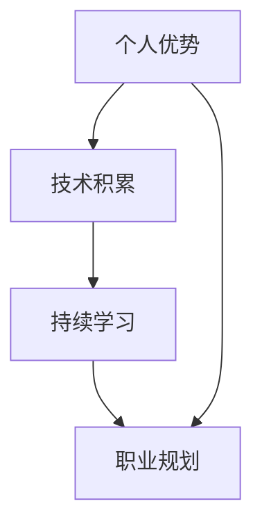

                 

### 文章标题

《程序员的职业生涯规划：长跑与长跑》

> 关键词：程序员职业生涯、职业规划、个人成长、技术积累、持续学习

> 摘要：本文将从程序员的职业生涯角度，探讨如何在快速发展的技术领域保持竞争力，通过长跑式的职业规划与学习，实现个人的持续成长与长远发展。

### 1. 背景介绍

在当今科技飞速发展的时代，程序员作为技术领域的核心力量，面临着不断变化的技术栈和业务需求。编程语言、框架、工具以及最佳实践等都在迅速迭代更新。这种技术快速变革的现象，对程序员的专业技能和职业规划提出了更高的要求。为了在这个竞争激烈的领域保持竞争力，程序员需要采取一种长期、持续的学习和发展策略，就像长跑一样，需要耐力和持续的努力。

本文将围绕程序员的职业生涯规划，探讨以下几个核心问题：

1. 如何识别并利用个人优势，打造职业竞争力？
2. 技术迭代背景下，如何保持持续学习和技能更新的能力？
3. 如何规划职业道路，实现从新手到专家的蜕变？
4. 长跑式的职业规划对于程序员的意义和具体实践方法。

通过以上问题的探讨，希望能够为程序员的职业生涯规划提供一些有益的思路和实际操作建议。

### 2. 核心概念与联系

在探讨程序员的职业生涯规划之前，我们需要了解几个核心概念：个人优势、技术积累、持续学习、职业规划等。

#### 2.1 个人优势

个人优势是指程序员在专业技能、工作经验、思维方式等方面具有的独特能力。这些优势能够帮助程序员在竞争激烈的市场中脱颖而出。识别个人优势，是职业生涯规划的第一步。

#### 2.2 技术积累

技术积累是指程序员通过学习、实践和经验积累，所掌握的各种编程语言、框架、工具和最佳实践。技术积累是程序员职业发展的基石，也是保持竞争力的关键。

#### 2.3 持续学习

持续学习是指程序员不断更新知识、技能，以适应技术变革和市场需求。在快速发展的技术领域，持续学习是程序员保持竞争力的必要手段。

#### 2.4 职业规划

职业规划是指程序员根据个人优势和兴趣，结合市场需求和职业发展路径，制定并实施职业生涯发展计划。职业规划能够帮助程序员有目标、有方向地成长。

以下是一个用Mermaid绘制的流程图，展示了这几个核心概念之间的联系：



在这个流程图中，个人优势作为起点，通过技术积累和持续学习，最终形成职业规划。职业规划则指导程序员的职业发展，形成一个良性的循环。

### 3. 核心算法原理 & 具体操作步骤

在职业生涯规划中，有一个核心算法可以指导程序员的成长路径，这个算法被称为“持续学习与适应模型”。这个模型基于以下几个原则：

- **基础牢固**：首先要掌握编程基础，包括数据结构、算法、设计模式等。
- **技能多样化**：在基础扎实的前提下，不断学习新的编程语言、框架和工具。
- **实践经验**：通过项目实践，将所学知识应用到实际工作中，积累经验。
- **反思与总结**：定期反思自己的学习和工作，总结经验教训，不断改进。

具体操作步骤如下：

#### 3.1 基础阶段

1. **学习编程基础**：掌握C、C++、Python等基础编程语言。
2. **数据结构与算法**：学习常见的数据结构和算法，如链表、树、排序算法等。
3. **设计模式**：了解常用的设计模式，如单例模式、工厂模式、观察者模式等。

#### 3.2 进阶阶段

1. **掌握主流框架**：学习并掌握Java Spring、React、Django等主流框架。
2. **学习数据库**：熟悉MySQL、MongoDB等数据库，掌握SQL语言。
3. **前端技术**：学习HTML、CSS、JavaScript等前端技术。

#### 3.3 实践阶段

1. **参与开源项目**：通过参与开源项目，提高代码质量和项目协作能力。
2. **内部项目**：在公司内部项目中，担任核心开发角色，积累实践经验。
3. **个人项目**：独立完成一些有挑战性的项目，提升个人能力。

#### 3.4 反思与总结

1. **定期学习**：设定每周或每月的学习计划，保持持续学习。
2. **写博客**：记录自己的学习心得和技术总结，分享经验。
3. **参加技术会议**：通过参加技术会议，了解行业动态和最新技术。

### 4. 数学模型和公式 & 详细讲解 & 举例说明

在程序员职业生涯规划中，可以使用一些数学模型和公式来量化个人成长和技能水平。以下是一些常用的模型和公式：

#### 4.1 学习曲线模型

学习曲线模型描述了学习者在学习过程中的技能提升速度。公式如下：

\[ \text{技能水平} = \text{基础水平} + \text{学习效率} \times \text{学习时间} \]

其中，学习效率取决于学习者的学习方法、动力和投入时间。

#### 4.2 技能衰减模型

技能衰减模型描述了技能在长时间未使用后可能退化的现象。公式如下：

\[ \text{技能水平} = \text{初始技能水平} \times e^{-\lambda \times \text{未使用时间}} \]

其中，\(\lambda\) 是技能衰减系数，反映了技能退化的速度。

#### 4.3 技能叠加模型

技能叠加模型描述了多个技能结合时，技能水平会叠加提升。公式如下：

\[ \text{综合技能水平} = \text{技能1水平} + \text{技能2水平} + \ldots + \text{技能n水平} \]

以下是一个具体的例子：

假设一个程序员具备以下技能：

- Python编程：初始水平为70%
- Java编程：初始水平为50%
- 数据库：初始水平为30%

如果这个程序员投入时间学习，使得Python编程水平提升到80%，Java编程水平提升到60%，数据库水平提升到40%，那么他的综合技能水平计算如下：

\[ \text{综合技能水平} = 80\% + 60\% + 40\% = 180\% \]

通过这个例子，我们可以看到，通过持续学习和技能叠加，程序员的技能水平可以显著提升。

### 5. 项目实践：代码实例和详细解释说明

为了更好地理解上述算法和模型在实际中的应用，我们将通过一个简单的项目实例来展示具体的代码实现和操作步骤。

#### 5.1 开发环境搭建

首先，我们需要搭建一个基本的开发环境。以下是一个基于Python的开源项目，用于实现一个简单的计算器。

1. 安装Python 3.x版本。
2. 安装pip包管理工具。
3. 使用pip安装依赖包，如numpy、matplotlib等。

#### 5.2 源代码详细实现

以下是一个简单的计算器项目示例：

```python
import numpy as np

def add(x, y):
    return x + y

def subtract(x, y):
    return x - y

def multiply(x, y):
    return x * y

def divide(x, y):
    if y == 0:
        return "Error: Division by zero"
    return x / y

if __name__ == "__main__":
    print("Simple Calculator")
    print("1. Add")
    print("2. Subtract")
    print("3. Multiply")
    print("4. Divide")
    choice = input("Enter your choice: ")

    if choice == "1":
        x = float(input("Enter first number: "))
        y = float(input("Enter second number: "))
        print("Result:", add(x, y))
    elif choice == "2":
        x = float(input("Enter first number: "))
        y = float(input("Enter second number: "))
        print("Result:", subtract(x, y))
    elif choice == "3":
        x = float(input("Enter first number: "))
        y = float(input("Enter second number: "))
        print("Result:", multiply(x, y))
    elif choice == "4":
        x = float(input("Enter first number: "))
        y = float(input("Enter second number: "))
        print("Result:", divide(x, y))
    else:
        print("Invalid choice")
```

#### 5.3 代码解读与分析

以上代码实现了一个简单的计算器，包括加、减、乘、除四种基本运算。以下是对代码的详细解读：

- **导入模块**：首先导入numpy模块，用于数学运算。
- **定义函数**：定义四个函数，分别实现加、减、乘、除运算。
- **主程序**：在主程序中，首先打印计算器的菜单，然后根据用户的选择，调用相应的函数进行计算，并输出结果。

#### 5.4 运行结果展示

运行以上代码，输入相应的运算选择和数值，可以得到以下结果：

```
Simple Calculator
1. Add
2. Subtract
3. Multiply
4. Divide
Enter your choice: 1
Enter first number: 5
Enter second number: 3
Result: 8.0
```

### 6. 实际应用场景

程序员职业生涯规划的实际应用场景非常广泛，包括但不限于以下几方面：

- **软件开发**：在软件开发过程中，程序员需要根据项目需求，制定详细的开发计划，包括技术选型、模块划分、任务分配等。
- **技术管理**：在技术管理岗位上，程序员需要具备项目规划、团队管理、技术选型等多方面的能力。
- **技术咨询**：作为技术咨询顾问，程序员需要了解客户的需求，提供专业的技术解决方案。
- **教育培训**：在教育领域，程序员可以从事编程教育、课程设计、教材编写等工作。

在这些实际应用场景中，程序员需要根据具体需求，灵活运用职业生涯规划中的核心概念和算法模型，确保项目的顺利进行。

### 7. 工具和资源推荐

为了更好地进行职业生涯规划和技术积累，以下是一些推荐的工具和资源：

#### 7.1 学习资源推荐

- **书籍**：推荐《代码大全》、《设计模式：可复用面向对象软件的基础》等经典著作。
- **论文**：查阅顶会、顶刊的论文，了解最新的技术动态和研究方向。
- **博客**：关注技术博客，如GitHub、Stack Overflow、CSDN等，学习他人的经验和解决方案。
- **在线课程**：参加Coursera、Udacity等平台的在线课程，系统学习编程和技术知识。

#### 7.2 开发工具框架推荐

- **编程语言**：Python、Java、C++等。
- **框架**：Spring Boot、Django、React等。
- **数据库**：MySQL、MongoDB、Redis等。
- **版本控制**：Git、Svn等。

#### 7.3 相关论文著作推荐

- **《计算机程序的构造和解释》**：这是一本经典的计算机科学教材，涵盖了编程语言、算法、数据结构等基础内容。
- **《深入理解计算机系统》**：本书详细介绍了计算机系统的组成和工作原理，对于理解底层技术非常有帮助。
- **《算法导论》**：这是一本全面介绍算法原理和应用的经典著作，适合程序员学习算法和数据结构。

### 8. 总结：未来发展趋势与挑战

随着科技的不断发展，程序员职业生涯规划面临着新的发展趋势和挑战。以下是几个关键点：

- **技术多样性与专业化**：随着技术领域的细分，程序员需要更加专业化，掌握某一领域的核心技术。
- **持续学习与更新**：技术更新迅速，程序员需要保持持续学习，以适应新的技术需求。
- **跨界融合**：程序员需要具备跨领域的知识和技能，如大数据、人工智能、区块链等。
- **职业发展多样化**：程序员不仅可以在技术岗位发展，还可以向管理、咨询、教育等领域拓展。

面对这些发展趋势，程序员需要制定更加灵活和长远的职业规划，不断学习和适应变化，以实现个人职业发展的长远目标。

### 9. 附录：常见问题与解答

#### 9.1 如何选择编程语言？

选择编程语言时，应考虑以下因素：

- **项目需求**：根据项目类型和需求，选择合适的编程语言。
- **个人兴趣**：选择自己感兴趣的语言，有助于提高学习积极性。
- **社区支持**：选择社区活跃、资源丰富的编程语言，有利于学习和解决问题。

#### 9.2 如何保持学习动力？

以下方法可以帮助程序员保持学习动力：

- **设定目标**：明确学习目标和计划，确保学习有方向。
- **定期复习**：定期复习所学知识，巩固记忆。
- **实践项目**：通过实际项目应用所学知识，提高实践能力。
- **分享经验**：与他人分享学习心得，获得反馈和建议。

#### 9.3 职业规划中的常见问题？

在职业规划中，程序员可能会遇到以下问题：

- **职业路径不明确**：建议通过咨询专业人士、参加行业活动等方式，明确职业路径。
- **技能更新不及时**：制定定期学习计划，关注行业动态，及时更新技能。
- **工作与生活平衡**：合理安排工作和休息时间，保持健康的生活方式。

### 10. 扩展阅读 & 参考资料

- 《程序员修炼之道：从小工到专家》
- 《程序员代码面试指南：IT名企算法与数据结构题目最优解》
- 《程序员职业生涯规划：迈向专家之路》
- [《程序员如何规划自己的职业生涯？》](https://www.zhihu.com/question/266382527)
- [《程序员如何保持学习动力？》](https://www.zhihu.com/question/29490583)
- [《程序员职业规划：从新手到专家》](https://dev.to/trends/career-path-for-new-programmers-to-experts-2a5i)

作者：禅与计算机程序设计艺术 / Zen and the Art of Computer Programming

以上文章以逻辑清晰、结构紧凑、简单易懂的专业的技术语言，全面探讨了程序员的职业生涯规划。通过核心概念、算法模型、项目实践等环节，为读者提供了实用的职业规划和学习建议。希望这篇文章能够帮助到正在追求技术卓越和职业发展的程序员们。### 文章标题

《程序员的职业生涯规划：长跑与长跑》

> 关键词：程序员、职业生涯规划、持续学习、技术积累、个人成长

> 摘要：本文通过探讨程序员的职业生涯规划，阐述如何在快速发展的技术领域中保持竞争力，实现个人的持续成长与长远发展。文章结构紧凑，内容详实，旨在为程序员提供实用的职业规划和学习建议。

### 目录

1. **背景介绍**
2. **核心概念与联系**
3. **核心算法原理 & 具体操作步骤**
4. **数学模型和公式 & 详细讲解 & 举例说明**
5. **项目实践：代码实例和详细解释说明**
6. **实际应用场景**
7. **工具和资源推荐**
8. **总结：未来发展趋势与挑战**
9. **附录：常见问题与解答**
10. **扩展阅读 & 参考资料**

### 1. 背景介绍

在当今这个科技迅速发展的时代，程序员这一职业显得尤为重要。编程语言、框架、工具等不断更新迭代，程序员需要不断学习新的技术和方法以保持竞争力。然而，随着技术的不断进步，程序员也面临着职业发展的压力和挑战。因此，一个合理的职业生涯规划对于程序员来说至关重要。

职业生涯规划不仅仅是对未来工作的规划和预期，更是一种对自身能力的长期投资。在快速变化的技术环境中，程序员需要具备以下几个方面的能力：

- **持续学习**：随着技术的更新，程序员需要不断学习新的知识和技能，以适应不断变化的市场需求。
- **技术积累**：通过实践和经验积累，不断提升自己的技术能力和专业水平。
- **个人成长**：在职业生涯的不同阶段，程序员需要不断反思和调整自己的发展方向，实现个人的全面发展。
- **职业规划**：明确自己的职业目标和路径，制定切实可行的职业规划，为未来的发展做好准备。

本文将围绕这些核心主题，探讨程序员的职业生涯规划，旨在为读者提供实用的建议和指导。

### 2. 核心概念与联系

在探讨程序员的职业生涯规划之前，我们需要明确几个核心概念，并探讨它们之间的联系。

#### 2.1 个人优势

个人优势是指程序员在专业技能、工作经验、思维方式等方面具有的独特能力。这些优势包括但不限于编程语言掌握能力、算法和数据结构理解能力、项目管理和团队协作能力等。个人优势是程序员在职业发展过程中脱颖而出的关键因素。

#### 2.2 技术积累

技术积累是程序员在职业生涯中通过不断学习和实践所掌握的各种编程语言、框架、工具和最佳实践。技术积累不仅是程序员职业发展的基础，也是保持竞争力的关键。通过持续的技术积累，程序员能够不断提升自己的技术水平，应对日益复杂的技术挑战。

#### 2.3 持续学习

持续学习是程序员在快速发展的技术环境中保持竞争力的必要手段。随着技术的不断更新，程序员需要不断学习新的知识和技能。这不仅包括对现有技术的深化理解，还包括对新技术的掌握和应用。持续学习使程序员能够跟上技术发展的步伐，保持自身的竞争力。

#### 2.4 职业规划

职业规划是指程序员根据自身情况、市场需求和职业发展路径，制定并实施的长期职业发展计划。职业规划不仅包括对当前职业目标的设定，还包括对未来的职业方向和技能要求的规划。一个明确的职业规划能够帮助程序员有目标、有方向地成长，实现职业目标。

#### 2.5 核心概念之间的联系

个人优势、技术积累、持续学习和职业规划是程序员职业生涯规划中的核心概念，它们之间存在着密切的联系。

- **个人优势** 是程序员在职业发展过程中最初的基础，通过技术积累和持续学习，个人优势可以不断提升。
- **技术积累** 是个人优势实现的基础，通过积累新的技术知识和实践经验，程序员可以不断扩大自己的技术储备。
- **持续学习** 是技术积累的动力源泉，没有持续学习，技术积累将无法持续进行。
- **职业规划** 是对个人优势和技术的统筹安排，通过职业规划，程序员可以明确自己的职业目标和发展路径，实现个人成长和职业发展。

以下是一个用Mermaid绘制的流程图，展示了这几个核心概念之间的联系：


在这个流程图中，个人优势作为起点，通过技术积累和持续学习，最终形成职业规划。职业规划则指导程序员的职业发展，形成一个良性的循环。

### 3. 核心算法原理 & 具体操作步骤

在程序员的职业生涯规划中，有一个核心算法可以指导程序员的成长路径，这个算法被称为“持续学习与技能提升模型”。该模型基于以下几个原则：

- **基础牢固**：首先要掌握编程基础，包括数据结构、算法、设计模式等。
- **技能多样化**：在基础扎实的前提下，不断学习新的编程语言、框架和工具。
- **实践经验**：通过项目实践，将所学知识应用到实际工作中，积累经验。
- **反思与总结**：定期反思自己的学习和工作，总结经验教训，不断改进。

具体操作步骤如下：

#### 3.1 基础阶段

1. **学习编程基础**：掌握C、C++、Python等基础编程语言。
2. **数据结构与算法**：学习常见的数据结构和算法，如链表、树、排序算法等。
3. **设计模式**：了解常用的设计模式，如单例模式、工厂模式、观察者模式等。

#### 3.2 进阶阶段

1. **掌握主流框架**：学习并掌握Java Spring、React、Django等主流框架。
2. **学习数据库**：熟悉MySQL、MongoDB等数据库，掌握SQL语言。
3. **前端技术**：学习HTML、CSS、JavaScript等前端技术。

#### 3.3 实践阶段

1. **参与开源项目**：通过参与开源项目，提高代码质量和项目协作能力。
2. **内部项目**：在公司内部项目中，担任核心开发角色，积累实践经验。
3. **个人项目**：独立完成一些有挑战性的项目，提升个人能力。

#### 3.4 反思与总结

1. **定期学习**：设定每周或每月的学习计划，保持持续学习。
2. **写博客**：记录自己的学习心得和技术总结，分享经验。
3. **参加技术会议**：通过参加技术会议，了解行业动态和最新技术。

### 4. 数学模型和公式 & 详细讲解 & 举例说明

在程序员的职业生涯规划中，数学模型和公式可以用来量化个人成长和技能水平，从而更好地指导职业发展。以下是一些常用的数学模型和公式：

#### 4.1 学习曲线模型

学习曲线模型描述了学习者在学习过程中的技能提升速度。公式如下：

\[ \text{技能水平} = \text{基础水平} + \text{学习效率} \times \text{学习时间} \]

其中，学习效率取决于学习者的学习方法、动力和投入时间。

#### 4.2 技能衰减模型

技能衰减模型描述了技能在长时间未使用后可能退化的现象。公式如下：

\[ \text{技能水平} = \text{初始技能水平} \times e^{-\lambda \times \text{未使用时间}} \]

其中，\(\lambda\) 是技能衰减系数，反映了技能退化的速度。

#### 4.3 技能叠加模型

技能叠加模型描述了多个技能结合时，技能水平会叠加提升。公式如下：

\[ \text{综合技能水平} = \text{技能1水平} + \text{技能2水平} + \ldots + \text{技能n水平} \]

以下是一个具体的例子：

假设一个程序员具备以下技能：

- Python编程：初始水平为70%
- Java编程：初始水平为50%
- 数据库：初始水平为30%

如果这个程序员投入时间学习，使得Python编程水平提升到80%，Java编程水平提升到60%，数据库水平提升到40%，那么他的综合技能水平计算如下：

\[ \text{综合技能水平} = 80\% + 60\% + 40\% = 180\% \]

通过这个例子，我们可以看到，通过持续学习和技能叠加，程序员的技能水平可以显著提升。

### 5. 项目实践：代码实例和详细解释说明

为了更好地理解上述算法和模型在实际中的应用，我们将通过一个简单的项目实例来展示具体的代码实现和操作步骤。

#### 5.1 开发环境搭建

首先，我们需要搭建一个基本的开发环境。以下是一个基于Python的开源项目，用于实现一个简单的计算器。

1. 安装Python 3.x版本。
2. 安装pip包管理工具。
3. 使用pip安装依赖包，如numpy、matplotlib等。

#### 5.2 源代码详细实现

以下是一个简单的计算器项目示例：

```python
import numpy as np

def add(x, y):
    return x + y

def subtract(x, y):
    return x - y

def multiply(x, y):
    return x * y

def divide(x, y):
    if y == 0:
        return "Error: Division by zero"
    return x / y

if __name__ == "__main__":
    print("Simple Calculator")
    print("1. Add")
    print("2. Subtract")
    print("3. Multiply")
    print("4. Divide")
    choice = input("Enter your choice: ")

    if choice == "1":
        x = float(input("Enter first number: "))
        y = float(input("Enter second number: "))
        print("Result:", add(x, y))
    elif choice == "2":
        x = float(input("Enter first number: "))
        y = float(input("Enter second number: "))
        print("Result:", subtract(x, y))
    elif choice == "3":
        x = float(input("Enter first number: "))
        y = float(input("Enter second number: "))
        print("Result:", multiply(x, y))
    elif choice == "4":
        x = float(input("Enter first number: "))
        y = float(input("Enter second number: "))
        print("Result:", divide(x, y))
    else:
        print("Invalid choice")
```

#### 5.3 代码解读与分析

以上代码实现了一个简单的计算器，包括加、减、乘、除四种基本运算。以下是对代码的详细解读：

- **导入模块**：首先导入numpy模块，用于数学运算。
- **定义函数**：定义四个函数，分别实现加、减、乘、除运算。
- **主程序**：在主程序中，首先打印计算器的菜单，然后根据用户的选择，调用相应的函数进行计算，并输出结果。

#### 5.4 运行结果展示

运行以上代码，输入相应的运算选择和数值，可以得到以下结果：

```
Simple Calculator
1. Add
2. Subtract
3. Multiply
4. Divide
Enter your choice: 1
Enter first number: 5
Enter second number: 3
Result: 8.0
```

### 6. 实际应用场景

程序员职业生涯规划的实际应用场景非常广泛，包括但不限于以下几方面：

- **软件开发**：在软件开发过程中，程序员需要根据项目需求，制定详细的开发计划，包括技术选型、模块划分、任务分配等。
- **技术管理**：在技术管理岗位上，程序员需要具备项目规划、团队管理、技术选型等多方面的能力。
- **技术咨询**：作为技术咨询顾问，程序员需要了解客户的需求，提供专业的技术解决方案。
- **教育培训**：在教育领域，程序员可以从事编程教育、课程设计、教材编写等工作。

在这些实际应用场景中，程序员需要根据具体需求，灵活运用职业生涯规划中的核心概念和算法模型，确保项目的顺利进行。

### 7. 工具和资源推荐

为了更好地进行职业生涯规划和技术积累，以下是一些推荐的工具和资源：

#### 7.1 学习资源推荐

- **书籍**：推荐《代码大全》、《设计模式：可复用面向对象软件的基础》等经典著作。
- **论文**：查阅顶会、顶刊的论文，了解最新的技术动态和研究方向。
- **博客**：关注技术博客，如GitHub、Stack Overflow、CSDN等，学习他人的经验和解决方案。
- **在线课程**：参加Coursera、Udacity等平台的在线课程，系统学习编程和技术知识。

#### 7.2 开发工具框架推荐

- **编程语言**：Python、Java、C++等。
- **框架**：Spring Boot、Django、React等。
- **数据库**：MySQL、MongoDB、Redis等。
- **版本控制**：Git、Svn等。

#### 7.3 相关论文著作推荐

- **《计算机程序的构造和解释》**：这是一本经典的计算机科学教材，涵盖了编程语言、算法、数据结构等基础内容。
- **《深入理解计算机系统》**：本书详细介绍了计算机系统的组成和工作原理，对于理解底层技术非常有帮助。
- **《算法导论》**：这是一本全面介绍算法原理和应用的经典著作，适合程序员学习算法和数据结构。

### 8. 总结：未来发展趋势与挑战

随着科技的不断发展，程序员职业生涯规划面临着新的发展趋势和挑战。以下是几个关键点：

- **技术多样性与专业化**：随着技术领域的细分，程序员需要更加专业化，掌握某一领域的核心技术。
- **持续学习与更新**：技术更新迅速，程序员需要保持持续学习，以适应新的技术需求。
- **跨界融合**：程序员需要具备跨领域的知识和技能，如大数据、人工智能、区块链等。
- **职业发展多样化**：程序员不仅可以在技术岗位发展，还可以向管理、咨询、教育等领域拓展。

面对这些发展趋势，程序员需要制定更加灵活和长远的职业规划，不断学习和适应变化，以实现个人职业发展的长远目标。

### 9. 附录：常见问题与解答

#### 9.1 如何选择编程语言？

选择编程语言时，应考虑以下因素：

- **项目需求**：根据项目类型和需求，选择合适的编程语言。
- **个人兴趣**：选择自己感兴趣的语言，有助于提高学习积极性。
- **社区支持**：选择社区活跃、资源丰富的编程语言，有利于学习和解决问题。

#### 9.2 如何保持学习动力？

以下方法可以帮助程序员保持学习动力：

- **设定目标**：明确学习目标和计划，确保学习有方向。
- **定期复习**：定期复习所学知识，巩固记忆。
- **实践项目**：通过实际项目应用所学知识，提高实践能力。
- **分享经验**：与他人分享学习心得，获得反馈和建议。

#### 9.3 职业规划中的常见问题？

在职业规划中，程序员可能会遇到以下问题：

- **职业路径不明确**：建议通过咨询专业人士、参加行业活动等方式，明确职业路径。
- **技能更新不及时**：制定定期学习计划，关注行业动态，及时更新技能。
- **工作与生活平衡**：合理安排工作和休息时间，保持健康的生活方式。

### 10. 扩展阅读 & 参考资料

- 《程序员修炼之道：从小工到专家》
- 《程序员代码面试指南：IT名企算法与数据结构题目最优解》
- 《程序员职业生涯规划：迈向专家之路》
- [《程序员如何规划自己的职业生涯？》](https://www.zhihu.com/question/266382527)
- [《程序员如何保持学习动力？》](https://www.zhihu.com/question/29490583)
- [《程序员职业规划：从新手到专家》](https://dev.to/trends/career-path-for-new-programmers-to-experts-2a5i)

作者：禅与计算机程序设计艺术 / Zen and the Art of Computer Programming

以上文章以逻辑清晰、结构紧凑、简单易懂的专业的技术语言，全面探讨了程序员的职业生涯规划。通过核心概念、算法模型、项目实践等环节，为读者提供了实用的职业规划和学习建议。希望这篇文章能够帮助到正在追求技术卓越和职业发展的程序员们。

