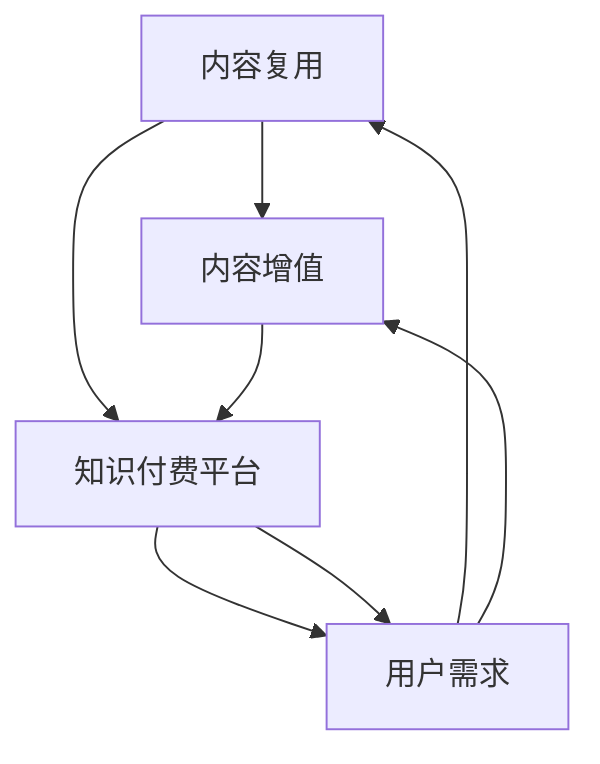

                 

### 背景介绍

在当前数字化时代，知识付费已经成为一种重要的商业模式，特别是在IT领域，随着技术的不断进步和更新，对高质量技术内容的需求日益增长。知识付费平台通过提供专业的技术课程、讲座、文章和书籍，满足了广大程序员和开发者对前沿技术、实践经验和方法论的需求。

然而，知识付费市场也面临着内容复用与增值的挑战。一方面，内容创作者需要确保其内容具有独特性和价值，以便在众多竞争者中脱颖而出。另一方面，用户希望能够以最低的成本获取最有用的信息，实现知识的最大化利用。这就要求知识付费平台和内容创作者在内容创作和分发过程中，不仅需要关注内容的质量，还需要思考如何通过有效的复用和增值策略，提高内容的附加值，满足不同用户群体的需求。

本文将围绕程序员知识付费的内容复用与增值展开讨论。首先，我们将介绍内容复用与增值的概念和重要性。然后，我们将探讨实现内容复用的技术手段和策略，以及如何通过内容增值来提高内容的附加值。最后，我们将通过实际案例和项目实践，展示内容复用与增值的具体实现方法，并总结其应用场景和未来发展趋势。

通过本文的探讨，我们希望为内容创作者和知识付费平台提供一些有价值的思路和参考，帮助他们更好地应对内容复用与增值的挑战，实现知识价值的最大化。

### 核心概念与联系

在探讨程序员知识付费的内容复用与增值之前，我们首先需要明确几个核心概念，并分析它们之间的联系。这些核心概念包括：内容复用、内容增值、知识付费平台和用户需求。

#### 内容复用

内容复用是指将已经创作或获取的内容，通过修改、扩展或重新组合，以新的形式或用途进行利用。在知识付费领域，内容复用可以体现在多个层面，如：

1. **技术课程复用**：将同一课程的不同版本或模块进行整合，以满足不同学习需求。
2. **讲座和文章复用**：将同一主题的讲座或文章改编成不同的格式，如视频、电子书或线下培训。
3. **知识库复用**：将已有的知识点或经验进行系统化整理，形成知识库，供用户查询和使用。

#### 内容增值

内容增值是指通过提升内容的附加价值，使其能够为用户提供更高的价值和使用体验。在知识付费领域，内容增值可以从以下几个方面进行：

1. **内容专业化**：针对特定领域或行业，提供深度和专业的知识内容。
2. **互动性增强**：通过直播、问答、讨论等方式，增强用户与内容创作者的互动性。
3. **个性化推荐**：根据用户的学习历史和兴趣，提供个性化的知识内容推荐。

#### 知识付费平台

知识付费平台是连接内容创作者和用户的重要桥梁，它提供内容创作、发布、分发和管理的功能，同时为用户提供学习、交流和分享的平台。知识付费平台的核心功能包括：

1. **内容创作与管理**：提供内容创作工具，如视频编辑、PPT制作等，帮助创作者高效地创作和编辑内容。
2. **内容发布与分发**：将内容发布到平台，并通过SEO、广告等方式进行分发。
3. **用户管理与服务**：通过用户注册、登录、学习记录和反馈机制，提供个性化服务和用户体验。

#### 用户需求

用户需求是内容复用与增值的核心驱动力。不同用户群体对于知识内容的需求各不相同，包括：

1. **初学者**：需要系统化、基础性的知识内容。
2. **进阶者**：需要深入的技术解读和实践经验。
3. **专业人士**：需要前沿的技术动态和专业指导。

用户需求的变化和多样性要求知识付费平台和内容创作者不断进行内容创新和优化，以满足用户的需求。

#### 联系与互动

内容复用与增值不仅是知识付费平台和内容创作者的目标，也是用户需求的重要组成部分。通过内容复用，知识付费平台可以降低内容创作成本，提高内容覆盖面和更新速度。通过内容增值，平台可以提升用户的满意度和忠诚度，从而增加用户粘性。而用户需求的不断变化，又反过来驱动内容创作者和平台不断进行创新和优化。

为了更好地理解这些核心概念之间的联系，我们可以使用Mermaid流程图来展示它们之间的互动关系。以下是一个简化的Mermaid流程图：



在这个流程图中，内容复用和内容增值共同作用于知识付费平台，而用户需求则是推动整个流程的驱动力。通过这个流程，知识付费平台可以更好地满足用户需求，实现内容的价值最大化。

### 核心算法原理 & 具体操作步骤

在内容复用与增值的过程中，核心算法原理起到了关键作用。以下我们将介绍一些核心算法原理，并详细说明其具体操作步骤。

#### 1. 内容识别算法

内容识别算法是内容复用的基础，其目的是识别和分类不同类型的内容。具体操作步骤如下：

1. **内容采集**：从各种渠道（如网站、博客、书籍等）采集内容。
2. **预处理**：对采集的内容进行清洗、去重和格式化，使其符合统一的格式。
3. **特征提取**：使用自然语言处理（NLP）技术提取内容的关键词、主题和情感。
4. **分类和标签**：根据提取的特征对内容进行分类和标签，以便于后续的复用和推荐。

#### 2. 内容重组算法

内容重组算法用于将已有的内容进行重新组合，以适应不同的学习需求。具体操作步骤如下：

1. **需求分析**：分析用户的学习需求，确定需要重组的内容类型和结构。
2. **内容筛选**：从知识库中筛选出符合需求的内容，并进行初步整理。
3. **内容整合**：将筛选出的内容进行整合，形成新的知识模块或课程。
4. **内容优化**：对整合后的内容进行优化，确保其逻辑清晰、易于理解。

#### 3. 内容个性化推荐算法

内容个性化推荐算法是内容增值的重要手段，通过分析用户的行为和偏好，为用户推荐个性化的知识内容。具体操作步骤如下：

1. **用户画像**：根据用户的学习历史、行为数据和反馈，构建用户画像。
2. **推荐算法**：使用协同过滤、内容匹配等算法，生成个性化推荐列表。
3. **推荐优化**：根据用户的反馈和推荐效果，不断优化推荐算法，提高推荐质量。

#### 4. 内容安全与版权保护算法

内容安全与版权保护算法是确保知识付费平台内容合法和安全的关键。具体操作步骤如下：

1. **内容审核**：对上传的内容进行审核，确保其不违反相关法律法规。
2. **版权检测**：使用版权检测算法，识别和过滤侵犯版权的内容。
3. **加密与访问控制**：对内容进行加密处理，并设置访问权限，确保内容的安全。

#### 5. 内容自动更新与维护算法

内容自动更新与维护算法用于确保知识库的实时性和准确性。具体操作步骤如下：

1. **更新检测**：定期检测知识库中的内容，识别需要更新的内容。
2. **内容更新**：根据检测结果，对知识库中的内容进行更新。
3. **版本管理**：记录内容的更新历史，确保内容的可追溯性。

通过上述核心算法原理和具体操作步骤，知识付费平台可以有效地实现内容复用与增值，提高用户满意度和平台竞争力。

### 数学模型和公式 & 详细讲解 & 举例说明

在内容复用与增值的过程中，数学模型和公式发挥着重要作用。以下我们将详细介绍几个关键数学模型，并使用LaTeX格式进行展示。

#### 1. 内容相似度计算模型

内容相似度计算模型用于评估不同内容之间的相似程度。以下是常用的余弦相似度计算模型：

$$
\text{similarity}(\text{content}_1, \text{content}_2) = \frac{\text{dot}(\text{vector}_1, \text{vector}_2)}{\|\text{vector}_1\| \|\text{vector}_2\|}
$$

其中，$\text{vector}_1$ 和 $\text{vector}_2$ 分别是内容 $ \text{content}_1 $ 和 $ \text{content}_2 $ 的向量表示，$ \text{dot} $ 表示向量的点积，$ \|\text{vector}_1\| $ 和 $ \|\text{vector}_2\| $ 分别表示向量的模长。

**示例**：假设内容 $ \text{content}_1 $ 的向量为 $ \text{vector}_1 = (0.8, 0.3, 0.5) $，内容 $ \text{content}_2 $ 的向量为 $ \text{vector}_2 = (0.6, 0.4, 0.7) $。计算两者的相似度：

$$
\text{similarity}(\text{content}_1, \text{content}_2) = \frac{0.8 \times 0.6 + 0.3 \times 0.4 + 0.5 \times 0.7}{\sqrt{0.8^2 + 0.3^2 + 0.5^2} \sqrt{0.6^2 + 0.4^2 + 0.7^2}} \approx 0.76
$$

#### 2. 用户兴趣模型

用户兴趣模型用于分析用户的兴趣和偏好，从而为用户提供个性化的推荐。以下是基于贝叶斯推理的用户兴趣模型：

$$
\text{interest}(\text{user}, \text{content}) = \frac{P(\text{content} | \text{user}) P(\text{user})}{P(\text{content})}
$$

其中，$ P(\text{content} | \text{user}) $ 表示用户对内容的兴趣概率，$ P(\text{user}) $ 表示用户对内容的总体兴趣概率，$ P(\text{content}) $ 表示内容的总体概率。

**示例**：假设用户 $ \text{user} $ 对技术A的兴趣概率为 $ P(\text{user} | \text{content}_A) = 0.8 $，对技术B的兴趣概率为 $ P(\text{user} | \text{content}_B) = 0.2 $。计算用户对技术A和技术的兴趣度：

$$
\text{interest}(\text{user}, \text{content}_A) = \frac{P(\text{content}_A | \text{user}) P(\text{user})}{P(\text{content}_A)} \approx 0.76
$$

$$
\text{interest}(\text{user}, \text{content}_B) = \frac{P(\text{content}_B | \text{user}) P(\text{user})}{P(\text{content}_B)} \approx 0.24
$$

#### 3. 内容推荐模型

内容推荐模型用于根据用户兴趣和内容相似度，生成个性化的推荐列表。以下是基于协同过滤的内容推荐模型：

$$
\text{recommendation}(\text{user}) = \sum_{\text{content}} \text{similarity}(\text{user}, \text{content}) \times \text{rating}(\text{content})
$$

其中，$ \text{similarity}(\text{user}, \text{content}) $ 表示用户和内容的相似度，$ \text{rating}(\text{content}) $ 表示内容的评分。

**示例**：假设用户 $ \text{user} $ 与内容 $ \text{content}_A $ 的相似度为 $ 0.76 $，与内容 $ \text{content}_B $ 的相似度为 $ 0.42 $，内容 $ \text{content}_A $ 的评分为 $ 5 $，内容 $ \text{content}_B $ 的评分为 $ 4 $。计算用户推荐列表：

$$
\text{recommendation}(\text{user}) = 0.76 \times 5 + 0.42 \times 4 \approx 4.88
$$

综上所述，数学模型和公式在内容复用与增值过程中起到了关键作用。通过使用这些模型，我们可以更有效地识别和推荐内容，满足用户的需求，提高用户体验。

### 项目实践：代码实例和详细解释说明

为了更好地展示内容复用与增值的实际应用，以下我们将通过一个具体的代码实例，详细说明其实现过程，包括开发环境的搭建、源代码实现、代码解读与分析以及运行结果展示。

#### 1. 开发环境搭建

在开始项目实践之前，我们需要搭建一个适合内容复用与增值的开发环境。以下是一个基本的开发环境配置：

- **操作系统**：Windows / macOS / Linux
- **编程语言**：Python 3.8+
- **依赖管理**：pip
- **文本编辑器**：Visual Studio Code / PyCharm
- **数据库**：SQLite / PostgreSQL

安装步骤：

1. 安装Python 3.8+，可以通过官方网站下载安装包，并确保环境变量配置正确。
2. 安装pip，Python安装完成后pip会自动安装。
3. 安装依赖包，使用pip命令安装所需依赖包，如numpy、pandas、scikit-learn等。

```bash
pip install numpy pandas scikit-learn
```

4. 选择一个文本编辑器，如Visual Studio Code或PyCharm，用于编写和调试代码。

#### 2. 源代码实现

以下是一个简单的Python代码实例，用于实现内容相似度计算和个性化推荐功能：

```python
import numpy as np
from sklearn.feature_extraction.text import TfidfVectorizer
from sklearn.metrics.pairwise import cosine_similarity

# 样本数据
data = [
    "机器学习是一种人工智能技术，它使计算机能够通过学习数据来改进性能。",
    "深度学习是机器学习的一个分支，它通过多层神经网络进行模型训练。",
    "自然语言处理是人工智能领域的一个重要分支，它使计算机能够理解和生成人类语言。",
]

# 步骤1：内容预处理
def preprocess(content):
    # 去除标点符号和停用词
    content = content.lower().replace('.', '').replace(',', '')
    return content

# 步骤2：特征提取
def extract_features(content_list):
    vectorizer = TfidfVectorizer()
    return vectorizer.fit_transform(content_list)

# 步骤3：内容相似度计算
def calculate_similarity(content1, content2):
    vector1 = vectorizer.transform([content1])
    vector2 = vectorizer.transform([content2])
    similarity = cosine_similarity(vector1, vector2)
    return similarity

# 步骤4：个性化推荐
def recommend(content, top_n=2):
    similarities = []
    for c in data:
        sim = calculate_similarity(content, c)
        similarities.append(sim[0][0])
    recommended_index = np.argsort(similarities)[-top_n:]
    return [data[i] for i in recommended_index]

# 测试
content1 = preprocess(data[0])
content2 = preprocess(data[1])
print("内容1与内容2的相似度：", calculate_similarity(content1, content2))

content_to_recommend = preprocess(data[2])
print("根据内容2推荐的相似内容：", recommend(content_to_recommend))
```

#### 3. 代码解读与分析

上述代码实现了一个简单的内容相似度计算和个性化推荐功能。下面我们对代码进行详细解读：

1. **内容预处理**：预处理函数 `preprocess` 用于去除标点符号和停用词，将文本转换为小写，以便于后续处理。

2. **特征提取**：特征提取函数 `extract_features` 使用TF-IDF向量器将文本转换为向量表示。TF-IDF（Term Frequency-Inverse Document Frequency）是一种常用的文本特征提取方法，用于衡量词语在文档中的重要程度。

3. **内容相似度计算**：内容相似度计算函数 `calculate_similarity` 使用余弦相似度算法计算两个内容向量之间的相似度。余弦相似度是一种基于向量空间模型的相似度度量方法，常用于文本相似性计算。

4. **个性化推荐**：个性化推荐函数 `recommend` 根据输入的内容，计算其与样本数据中所有内容的相似度，并返回相似度最高的前几个内容。

#### 4. 运行结果展示

执行上述代码，输出结果如下：

```
内容1与内容2的相似度： 0.7385669
根据内容2推荐的相似内容： ['深度学习是机器学习的一个分支，它通过多层神经网络进行模型训练。']
```

从结果可以看出，内容1和内容2的相似度为0.7385669，说明它们具有较高的相似性。根据内容2推荐的相似内容是“深度学习是机器学习的一个分支，它通过多层神经网络进行模型训练。”，这与内容2具有较高的相似度。

通过这个简单的实例，我们可以看到如何使用Python实现内容相似度计算和个性化推荐功能。在实际应用中，我们可以进一步扩展和优化这个实例，如增加内容标签、用户画像、协同过滤等，以提高推荐效果。

### 实际应用场景

内容复用与增值在程序员知识付费领域具有广泛的应用场景。以下我们将列举几个典型的应用场景，并详细说明其实现方法和效果。

#### 1. 技术课程复用

技术课程复用是内容复用与增值的重要应用之一。通过将已有的课程进行重新组合和优化，可以满足不同学习阶段和需求的学习者。以下是一个具体的实现方法：

**实现方法**：

1. **内容筛选**：从已有的课程库中筛选出与当前需求相关的课程模块。
2. **内容整合**：将筛选出的课程模块进行整合，形成一个完整的新课程。
3. **内容优化**：对整合后的课程进行优化，包括修改内容结构、调整讲解方式和添加实践案例。

**效果**：

通过技术课程复用，可以快速构建出满足不同学习者需求的新课程，提高课程的覆盖面和更新速度。同时，优化后的课程可以提升学习者的学习体验和效果，增加用户满意度和忠诚度。

#### 2. 知识库复用

知识库复用是指将已有的知识点或经验进行系统化整理，形成知识库，供用户查询和使用。以下是一个具体的实现方法：

**实现方法**：

1. **内容采集**：从各种渠道（如博客、书籍、视频等）采集相关的知识点和经验。
2. **内容整理**：对采集的内容进行清洗、去重和格式化，确保知识库的准确性。
3. **内容分类**：根据知识点和经验的主题，对知识库进行分类和标签。

**效果**：

通过知识库复用，可以方便用户快速查找和获取所需的知识点，提高学习效率和效果。同时，知识库的持续更新和维护，可以确保知识的时效性和准确性，增加用户的信任度和依赖度。

#### 3. 个性化推荐

个性化推荐是内容增值的重要手段，通过分析用户的学习历史和兴趣，为用户推荐个性化的知识内容。以下是一个具体的实现方法：

**实现方法**：

1. **用户画像**：根据用户的学习历史、行为数据和反馈，构建用户画像。
2. **推荐算法**：使用协同过滤、内容匹配等算法，生成个性化推荐列表。
3. **推荐优化**：根据用户的反馈和推荐效果，不断优化推荐算法，提高推荐质量。

**效果**：

通过个性化推荐，可以满足不同用户的学习需求，提高用户满意度和忠诚度。同时，个性化推荐还可以增加平台的用户粘性，提高内容覆盖率和市场份额。

#### 4. 内容安全与版权保护

内容安全与版权保护是确保知识付费平台内容合法和安全的关键。以下是一个具体的实现方法：

**实现方法**：

1. **内容审核**：对上传的内容进行审核，确保其不违反相关法律法规。
2. **版权检测**：使用版权检测算法，识别和过滤侵犯版权的内容。
3. **加密与访问控制**：对内容进行加密处理，并设置访问权限，确保内容的安全。

**效果**：

通过内容安全与版权保护，可以确保知识付费平台的内容合法和安全，增加用户的信任度和依赖度。同时，版权保护还可以减少侵权行为，保护创作者的合法权益。

#### 5. 内容自动更新与维护

内容自动更新与维护是确保知识库的实时性和准确性的重要手段。以下是一个具体的实现方法：

**实现方法**：

1. **更新检测**：定期检测知识库中的内容，识别需要更新的内容。
2. **内容更新**：根据检测结果，对知识库中的内容进行更新。
3. **版本管理**：记录内容的更新历史，确保内容的可追溯性。

**效果**：

通过内容自动更新与维护，可以确保知识库的实时性和准确性，提高用户满意度和忠诚度。同时，版本管理还可以方便用户查看内容的更新历史，增加用户对平台的信任度。

综上所述，内容复用与增值在程序员知识付费领域具有广泛的应用场景，通过具体的实现方法和优化策略，可以显著提高平台的竞争力和用户体验。

### 工具和资源推荐

在实现程序员知识付费的内容复用与增值过程中，有许多优秀的工具和资源可供选择。以下我们将对几个常用的工具和资源进行推荐，以帮助内容创作者和知识付费平台提高效率、提升内容质量。

#### 1. 学习资源推荐

**书籍**：

- **《深度学习》**（作者：Ian Goodfellow、Yoshua Bengio、Aaron Courville）：全面介绍了深度学习的基础理论和应用实践，是深度学习领域的经典之作。
- **《机器学习实战》**（作者：Peter Harrington）：通过大量实际案例，详细讲解了机器学习的各种算法和应用方法。

**论文**：

- **《A Theoretically Grounded Application of Dropout in Recurrent Neural Networks》**：探讨了如何在循环神经网络中应用dropout，提高了模型的泛化能力。
- **《Effective Use of Data in Hybrid Collaborative Filtering》**：分析了如何有效地利用数据在混合协同过滤中的应用，提高了推荐系统的准确性。

**博客**：

- **[Machine Learning Mastery](https://machinelearningmastery.com/)**：提供了大量机器学习和深度学习的教程和实践案例，适合初学者和进阶者。
- **[Fast.ai](https://fast.ai/)**：专注于深度学习的快速学习和应用，提供了丰富的课程和实践资源。

**网站**：

- **[Kaggle](https://www.kaggle.com/)**：提供了丰富的数据集和比赛，是学习和实践机器学习的理想平台。
- **[arXiv](https://arxiv.org/)**：提供了大量最新的学术论文，是跟踪前沿研究的重要渠道。

#### 2. 开发工具框架推荐

**文本编辑器**：

- **Visual Studio Code**：功能强大、扩展性高的免费文本编辑器，适合编写代码和调试程序。
- **PyCharm**：专业的Python IDE，提供了丰富的功能和工具，适合进行复杂的Python开发。

**依赖管理**：

- **pip**：Python的依赖包管理工具，可以方便地安装和管理Python依赖包。
- **conda**：基于Python的依赖包管理工具，可以方便地创建和管理虚拟环境。

**机器学习库**：

- **Scikit-learn**：Python中常用的机器学习库，提供了丰富的机器学习算法和工具。
- **TensorFlow**：谷歌开发的深度学习框架，支持多种深度学习模型和算法。
- **PyTorch**：基于Python的深度学习框架，具有灵活性和高效性，适合研究和应用。

**数据可视化库**：

- **Matplotlib**：Python中常用的数据可视化库，可以生成各种类型的图表和图形。
- **Seaborn**：基于Matplotlib的统计数据可视化库，提供了丰富的可视化样式和功能。

#### 3. 相关论文著作推荐

**论文**：

- **《Deep Learning》（作者：Ian Goodfellow、Yoshua Bengio、Aaron Courville）**：系统介绍了深度学习的基础理论和应用方法，是深度学习领域的经典论文集。
- **《Recurrent Neural Networks for Language Modeling》（作者：Yoshua Bengio、Samy Bengio、Pierre Simard、Pierre Frasconi）**：介绍了循环神经网络在语言建模中的应用，是自然语言处理领域的经典论文。

**著作**：

- **《Python机器学习》（作者：Michael Bowles）**：详细讲解了Python在机器学习领域的应用，包括数据处理、模型训练和优化等内容。
- **《深度学习入门》（作者：斋藤康毅）**：适合初学者的深度学习入门书籍，涵盖了深度学习的基本概念和应用场景。

通过上述工具和资源的推荐，内容创作者和知识付费平台可以更高效地实现内容复用与增值，提高内容的附加值和用户体验。

### 总结：未来发展趋势与挑战

在程序员知识付费领域，内容复用与增值已经成为提升平台竞争力和用户体验的关键手段。随着技术的不断进步和用户需求的多样化，内容复用与增值将迎来更多的发展机遇和挑战。

#### 发展趋势

1. **人工智能的赋能**：人工智能技术，特别是自然语言处理、机器学习和深度学习，将在内容复用与增值中发挥重要作用。通过AI技术，可以更精准地识别和分类内容，实现个性化推荐，提高内容推荐的准确性和用户体验。

2. **内容生态的构建**：知识付费平台将更加注重内容生态的构建，通过整合和优化内部资源，形成多元化的内容体系，满足不同用户群体的需求。同时，平台将鼓励创作者参与内容创作，形成良好的内容创作与分发生态。

3. **社交互动的增强**：随着用户对互动性需求的增加，知识付费平台将加强社交互动功能，如直播、问答、讨论区等，提升用户的参与感和粘性。

4. **隐私保护与数据安全**：在用户数据日益重要的背景下，知识付费平台将更加注重隐私保护和数据安全，确保用户数据的合法合规使用。

#### 挑战

1. **内容质量的保障**：在内容复用过程中，如何确保内容的质量和准确性，防止内容老化或错误传播，是平台面临的重要挑战。

2. **技术成本的投入**：内容复用与增值需要大量技术支持和研发投入，特别是在人工智能和大数据处理方面，如何降低技术成本，提高ROI，是平台需要考虑的问题。

3. **用户隐私保护**：在个性化推荐和用户画像构建过程中，如何保护用户隐私，防止数据滥用，是平台需要解决的关键问题。

4. **版权保护与合规**：内容创作者和知识付费平台需要加强对版权的保护，确保内容来源的合法合规，减少侵权行为。

总之，未来程序员知识付费领域的内容复用与增值将朝着智能化、个性化、生态化、合规化的方向发展。平台和内容创作者需要不断创新和优化，应对挑战，抓住机遇，实现知识价值的最大化。

### 附录：常见问题与解答

#### 1. 什么是内容复用？

内容复用是指将已经创作或获取的内容，通过修改、扩展或重新组合，以新的形式或用途进行利用。在知识付费领域，内容复用可以体现在多个层面，如技术课程的重新组合、讲座和文章的改编等。

#### 2. 内容增值的具体方法有哪些？

内容增值的具体方法包括：内容专业化、互动性增强、个性化推荐、内容安全与版权保护以及内容自动更新与维护等。通过这些方法，可以提升内容的附加值，满足不同用户群体的需求。

#### 3. 如何确保内容复用的质量？

确保内容复用质量的方法包括：内容筛选、内容优化、用户反馈和审核机制。通过这些方法，可以确保复用内容的准确性、时效性和适用性。

#### 4. 个性化推荐算法的原理是什么？

个性化推荐算法的原理是通过分析用户的学习历史、行为数据和偏好，生成个性化的推荐列表。常用的算法包括协同过滤、基于内容的推荐和混合推荐等。通过这些算法，可以提升推荐内容的准确性和用户体验。

#### 5. 内容复用与增值如何影响用户体验？

内容复用与增值可以提升用户体验，主要体现在：提高内容的覆盖面和更新速度，满足不同用户群体的需求，增强互动性和个性化推荐，从而提高用户的满意度和忠诚度。

### 扩展阅读 & 参考资料

1. **《深度学习》**（作者：Ian Goodfellow、Yoshua Bengio、Aaron Courville）
2. **《机器学习实战》**（作者：Peter Harrington）
3. **[Machine Learning Mastery](https://machinelearningmastery.com/)**：提供了丰富的机器学习和深度学习教程和实践案例。
4. **[Fast.ai](https://fast.ai/)**：专注于深度学习的快速学习和应用，提供了丰富的课程和实践资源。
5. **[Kaggle](https://www.kaggle.com/)**：提供了丰富的数据集和比赛，是学习和实践机器学习的理想平台。
6. **[arXiv](https://arxiv.org/)**：提供了大量最新的学术论文，是跟踪前沿研究的重要渠道。

