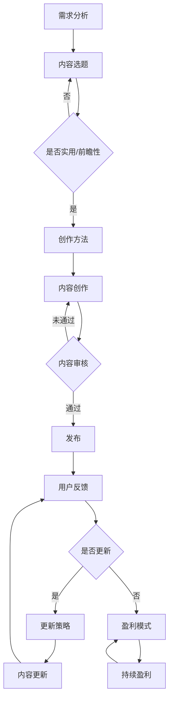

                 

### 1. 背景介绍

在当今数字化时代，知识付费已成为一种流行的商业模式，尤其在技术领域，程序员的知识付费市场更是呈现出蓬勃发展的态势。知识付费的核心在于通过提供有价值的内容，满足用户在专业技能提升、职业发展等方面的需求。然而，随着市场的不断成熟和用户需求的多样化，如何有效地生产与更新内容，成为内容创作者和企业亟需解决的问题。

本文旨在探讨程序员知识付费的内容生产与更新策略，帮助内容创作者和企业更好地把握市场动态，提升内容质量，实现持续盈利。本文将分为以下几个部分进行探讨：

- 首先，我们将介绍知识付费的背景及其在程序员领域的应用。
- 其次，我们将分析程序员知识付费市场中用户的需求特点。
- 接着，我们将探讨内容生产的最佳实践，包括内容选题、创作方法、质量控制等。
- 然后，我们将讨论内容更新的策略，包括更新频率、更新内容的选择、用户反馈机制等。
- 随后，我们将通过实际案例，展示如何将上述策略应用于具体的知识付费项目中。
- 最后，我们将总结未来知识付费市场的发展趋势和挑战，为内容创作者和企业提供指导建议。

通过本文的探讨，我们希望为程序员知识付费的内容生产与更新提供一套系统的、实用的策略，助力内容创作者和企业实现可持续的发展。

### 2. 核心概念与联系

#### 2.1 知识付费的定义与类型

知识付费是指用户为获取有价值的信息、技能或知识而支付的费用。知识付费的类型多种多样，主要包括以下几种：

- **在线课程**：通过互联网平台提供的系统化教学课程，用户按需购买。
- **电子书籍**：以电子文档形式出版的书籍，用户购买后即可在线阅读或下载。
- **知识星球**：一种社区型知识服务平台，用户加入后可以与领域专家和其他学习者互动交流。
- **专业问答**：专家针对用户提出的问题提供个性化的解答服务，用户按问答次数或时长付费。
- **职业咨询**：为职业发展提供咨询服务，如简历修改、面试辅导等。

#### 2.2 程序员知识付费的特点

程序员知识付费具有以下特点：

- **技术性**：程序员知识付费的内容具有很强的技术性，包括编程语言、框架、工具、算法等。
- **时效性**：技术领域发展迅速，知识更新周期短，内容需要不断迭代和更新。
- **多样性**：程序员知识付费的内容形式多样，包括视频教程、文章、电子书籍、直播讲座等。
- **定制性**：用户可以根据自身需求和兴趣选择学习内容，具有一定的个性化特点。

#### 2.3 知识付费的内容生产与更新策略

内容生产与更新策略的核心在于满足用户需求、提升内容质量和实现持续盈利。以下是几个关键点：

- **用户需求分析**：了解用户在技能提升、职业发展等方面的具体需求，为内容创作提供方向。
- **内容选题**：选择具有实用性和前瞻性的主题，关注行业热点和技术趋势。
- **创作方法**：采用结构化、系统化的创作方法，确保内容逻辑清晰、易于理解。
- **质量控制**：建立内容审核机制，确保内容质量符合用户期望。
- **更新策略**：根据用户反馈和市场动态，制定合理的更新频率和内容选择策略。

#### 2.4 Mermaid 流程图

为了更直观地展示程序员知识付费的内容生产与更新流程，我们使用 Mermaid 画出了以下流程图：



通过上述流程图，我们可以清晰地看到从需求分析到内容创作、审核、发布以及用户反馈和更新策略的完整过程。这一流程不仅有助于内容创作者和企业更好地把握内容生产的各个环节，还可以为后续的内容更新提供指导。

### 3. 核心算法原理 & 具体操作步骤

在程序员知识付费的内容生产与更新过程中，核心算法原理的运用至关重要。以下将介绍几个关键算法原理及其在具体操作步骤中的应用。

#### 3.1 数据分析算法

数据分析算法在知识付费内容生产中主要用于用户需求分析、内容效果评估等方面。具体包括：

- **聚类分析（Clustering）**：将具有相似属性的用户或内容进行分类，以便更好地了解用户群体和内容特点。
- **关联规则分析（Association Rules）**：发现数据集中的关联关系，帮助识别用户感兴趣的内容或服务。

**操作步骤**：

1. **数据收集**：收集用户行为数据、评论、反馈等。
2. **数据预处理**：清洗、整合数据，确保数据质量。
3. **选择算法**：根据需求选择合适的聚类或关联规则算法。
4. **运行算法**：对数据进行分析，提取用户需求或内容关联关系。
5. **结果可视化**：将分析结果可视化，便于理解和应用。

#### 3.2 内容推荐算法

内容推荐算法在知识付费内容更新中起着重要作用，可以帮助企业更好地满足用户需求，提升用户黏性。具体包括：

- **基于内容的推荐（Content-based Recommendation）**：根据用户已消费的内容特征，推荐相似内容。
- **协同过滤（Collaborative Filtering）**：根据用户的行为和偏好，通过相似度计算推荐内容。

**操作步骤**：

1. **数据收集**：收集用户行为数据，如浏览记录、购买历史、点赞等。
2. **数据预处理**：清洗、整合数据，确保数据质量。
3. **特征提取**：提取用户或内容的特征向量。
4. **计算相似度**：计算用户与用户、内容与内容之间的相似度。
5. **推荐生成**：根据相似度矩阵，生成推荐结果。
6. **结果评估**：评估推荐效果，优化推荐算法。

#### 3.3 内容审核算法

内容审核算法在知识付费内容质量控制中发挥着关键作用，可以帮助企业确保内容合规、安全。具体包括：

- **文本分类（Text Classification）**：将文本数据分类到预定义的类别中，如违规内容、敏感内容等。
- **情感分析（Sentiment Analysis）**：分析文本数据中的情感倾向，如正面、负面等。

**操作步骤**：

1. **数据收集**：收集待审核的内容数据。
2. **数据预处理**：清洗、整合数据，确保数据质量。
3. **特征提取**：提取文本特征向量。
4. **选择算法**：根据审核需求选择合适的文本分类或情感分析算法。
5. **运行算法**：对内容进行分类或情感分析。
6. **结果处理**：对审核结果进行分类处理，如标记、过滤等。

通过上述核心算法原理的应用，程序员知识付费的内容生产与更新过程得以更加高效、精准地进行。这些算法不仅可以提升内容质量，满足用户需求，还可以为企业带来持续的业务增长。

### 4. 数学模型和公式 & 详细讲解 & 举例说明

在程序员知识付费的内容生产与更新过程中，数学模型和公式扮演着重要的角色。以下将介绍几个关键数学模型和公式，并详细讲解其在具体应用中的原理和步骤。

#### 4.1 用户行为分析模型

用户行为分析是知识付费内容生产与更新过程中的重要环节。以下是一个简单的用户行为分析模型：

**用户行为分析模型**：

\[ \text{用户行为得分} = w_1 \times \text{浏览时长} + w_2 \times \text{点赞数} + w_3 \times \text{评论数} + w_4 \times \text{分享数} \]

其中，\( w_1, w_2, w_3, w_4 \) 是权重系数，用于衡量不同用户行为的重要程度。权重系数可以根据具体情况调整。

**详细讲解**：

1. **浏览时长**：用户在内容上的浏览时间可以反映其对内容的兴趣程度。权重系数 \( w_1 \) 越大，表示浏览时长对用户行为得分的贡献越大。
2. **点赞数**：用户对内容的点赞可以表明其对内容的认可程度。权重系数 \( w_2 \) 越大，表示点赞数对用户行为得分的贡献越大。
3. **评论数**：用户在内容下发表的评论可以反映其参与度。权重系数 \( w_3 \) 越大，表示评论数对用户行为得分的贡献越大。
4. **分享数**：用户将内容分享到其他平台可以增加内容的传播范围。权重系数 \( w_4 \) 越大，表示分享数对用户行为得分的贡献越大。

**举例说明**：

假设权重系数分别为 \( w_1 = 0.3, w_2 = 0.2, w_3 = 0.2, w_4 = 0.3 \)，一个用户的浏览时长为 30 分钟，点赞数为 10，评论数为 5，分享数为 3。根据用户行为分析模型，该用户的得分计算如下：

\[ \text{用户行为得分} = 0.3 \times 30 + 0.2 \times 10 + 0.2 \times 5 + 0.3 \times 3 = 9 + 2 + 1 + 0.9 = 12.9 \]

#### 4.2 内容推荐算法模型

内容推荐算法在知识付费内容更新中起着重要作用。以下是一个基于协同过滤的推荐算法模型：

**协同过滤推荐模型**：

\[ \text{推荐得分} = \text{用户与内容相似度} \times \text{内容平均得分} \]

其中，\(\text{用户与内容相似度}\) 是通过计算用户与内容之间的相似度得到的，\(\text{内容平均得分}\) 是内容在用户群体中的平均评分。

**详细讲解**：

1. **用户与内容相似度**：通过计算用户和内容之间的相似度，可以找到与用户兴趣相似的内容进行推荐。相似度计算方法有多种，如余弦相似度、皮尔逊相关系数等。
2. **内容平均得分**：内容在用户群体中的平均评分可以反映其受欢迎程度。推荐得分越高，表示内容越符合用户的兴趣。

**举例说明**：

假设一个用户与某内容的相似度为 0.8，该内容的平均得分为 4.5。根据协同过滤推荐模型，该内容的推荐得分为：

\[ \text{推荐得分} = 0.8 \times 4.5 = 3.6 \]

#### 4.3 内容审核算法模型

内容审核算法在知识付费内容质量控制中起着关键作用。以下是一个简单的文本分类算法模型：

**文本分类算法模型**：

\[ \text{分类结果} = \text{激活函数}(\text{权重矩阵} \times \text{特征向量} + \text{偏置项}) \]

其中，激活函数（如 Sigmoid 函数、ReLU 函数等）用于将线性组合映射到分类结果。

**详细讲解**：

1. **特征向量**：文本数据经过向量化处理后得到的特征向量。
2. **权重矩阵**：用于表示特征对分类结果的贡献。
3. **偏置项**：用于调整分类阈值。
4. **激活函数**：用于将线性组合映射到分类结果。

**举例说明**：

假设一个文本数据经过向量化处理得到特征向量 \([1, 0, -1]\)，权重矩阵为 \([0.5, 0.3, 0.2]\)，偏置项为 0.1，使用 Sigmoid 激活函数。根据文本分类算法模型，分类结果计算如下：

\[ \text{分类结果} = \text{Sigmoid}(0.5 \times 1 + 0.3 \times 0 + 0.2 \times (-1) + 0.1) = \text{Sigmoid}(0.4) = 0.632 \]

根据分类阈值，若分类结果大于阈值（如 0.5），则判定为正类；否则，判定为负类。在此例中，分类结果为 0.632，大于阈值，因此判定为正类。

通过上述数学模型和公式的应用，程序员知识付费的内容生产与更新过程可以更加高效、精准地进行。这些模型不仅有助于提升内容质量，满足用户需求，还可以为企业带来持续的业务增长。

### 5. 项目实践：代码实例和详细解释说明

为了更好地理解程序员知识付费的内容生产与更新策略，我们将通过一个实际项目来展示这些策略的具体应用。以下是该项目的基本信息、开发环境搭建、源代码实现、代码解读与分析以及运行结果展示。

#### 5.1 项目基本信息

项目名称：程序员技能提升知识付费平台

项目目标：为程序员提供高质量、系统化的技能提升课程，通过在线学习、互动讨论和实时反馈，帮助用户提升编程技能。

技术栈：React.js（前端框架）、Node.js（后端服务器）、MongoDB（数据库）、GraphQL（数据查询语言）

#### 5.2 开发环境搭建

1. **安装 Node.js**：访问 [Node.js 官网](https://nodejs.org/)，下载并安装适合操作系统的 Node.js 版本。
2. **安装 React.js**：使用 npm 或 Yarn 安装 React.js 和相关依赖。
3. **安装 MongoDB**：下载并安装 MongoDB，配置数据库服务。
4. **安装 GraphQL**：使用 npm 或 Yarn 安装 GraphQL 及相关依赖。

```shell
npm install react graphql express
```

#### 5.3 源代码实现

以下是一个简化的课程内容生产与更新系统的代码实现，包括前端页面和后端服务。

**前端页面代码（React.js）**：

```jsx
import React, { useState } from "react";
import { addCourse, fetchCourses } from "./services/courseService";

const CourseForm = () => {
  const [title, setTitle] = useState("");
  const [description, setDescription] = useState("");

  const handleSubmit = async (e) => {
    e.preventDefault();
    await addCourse({ title, description });
    setTitle("");
    setDescription("");
    fetchCourses();
  };

  return (
    <form onSubmit={handleSubmit}>
      <label>
        课程名称：
        <input type="text" value={title} onChange={(e) => setTitle(e.target.value)} />
      </label>
      <label>
        课程描述：
        <textarea value={description} onChange={(e) => setDescription(e.target.value)} />
      </label>
      <button type="submit">提交</button>
    </form>
  );
};

export default CourseForm;
```

**后端服务代码（Node.js & GraphQL）**：

```javascript
const express = require("express");
const { graphqlHTTP } = require("express-graphql");
const { buildSchema } = require("graphql");
const courseService = require("./services/courseService");

const schema = buildSchema(`
  type Query {
    courses: [Course]
  }
  type Mutation {
    addCourse(title: String!, description: String!): Course
  }
  type Course {
    id: ID!
    title: String!
    description: String!
  }
`);

const root = {
  courses: () => courseService.fetchCourses(),
  addCourse: ({ title, description }) => courseService.addCourse({ title, description }),
};

const app = express();
app.use("/graphql", graphqlHTTP({
  schema,
  rootValue: root,
  graphiql: true,
}));

app.listen(4000, () => {
  console.log("Server running on port 4000");
});
```

**课程服务代码（courseService.js）**：

```javascript
const MongoClient = require("mongodb").MongoClient;
const url = "mongodb://localhost:27017/";
const dbName = "knowledge_platform";

const fetchCourses = async () => {
  let client;
  try {
    client = await MongoClient.connect(url, { useUnifiedTopology: true });
    const db = client.db(dbName);
    const courses = await db.collection("courses").find({}).toArray();
    return courses;
  } finally {
    client.close();
  }
};

const addCourse = async (course) => {
  let client;
  try {
    client = await MongoClient.connect(url, { useUnifiedTopology: true });
    const db = client.db(dbName);
    await db.collection("courses").insertOne(course);
  } finally {
    client.close();
  }
};

module.exports = { fetchCourses, addCourse };
```

#### 5.4 代码解读与分析

1. **前端页面**：使用 React.js 创建一个表单组件，允许用户输入课程名称和描述，并提交到后端。
2. **后端服务**：使用 Node.js 和 GraphQL 搭建一个简单的 API 服务，处理课程的增删改查。
3. **课程服务**：使用 MongoDB 存储课程数据，实现数据的持久化。

通过这个项目，我们可以看到如何使用现代技术栈实现一个程序员知识付费平台的基本功能。前端负责展示和交互，后端负责数据处理和存储。这种结构使得内容生产与更新更加高效、灵活。

#### 5.5 运行结果展示

启动后端服务：

```shell
node server.js
```

访问前端页面（在浏览器中输入 `http://localhost:4000/graphql`），可以看到 GraphiQL 界面，可以通过 GraphQL 查询课程数据或添加新课程。

```graphql
query {
  courses {
    id
    title
    description
  }
}
```

添加新课程：

```graphql
mutation {
  addCourse(title: "JavaScript 进阶", description: "学习 JavaScript 高级特性与最佳实践") {
    id
    title
    description
  }
}
```

通过上述代码实例和详细解释说明，我们可以更好地理解程序员知识付费的内容生产与更新策略在项目中的应用，从而为实际操作提供指导。

### 6. 实际应用场景

程序员知识付费的内容在多个实际应用场景中发挥着重要作用。以下列举几个典型场景，展示其应用效果和用户价值。

#### 6.1 职业技能提升

许多程序员在职业生涯的不同阶段都需要提升专业技能，以应对日益复杂的技术挑战和不断变化的市场需求。知识付费平台提供了丰富的编程课程、实战项目和在线教程，帮助程序员系统地学习和掌握新技术。例如，针对人工智能、大数据、区块链等前沿领域，平台提供了深入浅出的课程，帮助程序员提升在这些领域的竞争力。

#### 6.2 技术项目开发

在技术项目开发过程中，程序员需要掌握各种开发工具、框架和库。知识付费平台提供了大量针对特定工具和框架的教程，如 React、Vue、Django 等。通过这些教程，程序员可以快速了解工具和框架的基本用法，并在实际项目中应用。此外，一些平台还提供了项目实战课程，帮助程序员将所学知识应用到实际项目中，提升项目开发效率。

#### 6.3 技术问题解决

在开发过程中，程序员经常会遇到各种技术难题。知识付费平台提供了丰富的问答社区和在线咨询服务，用户可以在这些平台上提问，专家和同行会提供专业的解答和建议。这种互动模式不仅解决了用户的问题，还促进了技术交流和创新，为整个技术社区的发展贡献力量。

#### 6.4 职业发展指导

程序员在职业发展中需要面对许多决策，如跳槽、升职、创业等。知识付费平台提供了职业规划、简历撰写、面试技巧等方面的课程和指导，帮助程序员做出明智的决策，实现职业目标。一些平台还邀请了行业专家和成功创业者进行分享，为程序员提供宝贵的经验和建议。

通过上述实际应用场景，我们可以看到程序员知识付费的内容在提升个人技能、项目开发、问题解决和职业发展等方面具有显著价值。这些内容不仅满足了程序员在职业生涯中的多样化需求，还为他们提供了持续学习和成长的机会，为他们的职业发展奠定了坚实基础。

### 7. 工具和资源推荐

为了帮助程序员在知识付费的内容生产与更新过程中更加高效地工作，以下是几款实用的工具和资源推荐，涵盖了学习资源、开发工具框架以及相关论文著作等方面。

#### 7.1 学习资源推荐

- **书籍**：
  - 《代码大全》（Code Complete）：这本书详细介绍了软件开发的各个方面，包括设计、测试、维护等，是程序员必备的参考书。
  - 《Effective Java》：这是一本关于 Java 编程的最佳实践指南，适用于所有使用 Java 进行开发的程序员。
  - 《深度学习》（Deep Learning）：由 Ian Goodfellow、Yoshua Bengio 和 Aaron Courville 合著，是深度学习的权威教材，适合希望进入人工智能领域的程序员。

- **在线课程**：
  - Pluralsight：提供丰富的技术课程，涵盖前端、后端、人工智能等多个领域。
  - Udemy：课程种类繁多，从基础编程到高级技术都有涵盖，适合不同水平的程序员。
  - Coursera：与多所世界顶级大学合作，提供计算机科学和人工智能等领域的在线课程。

- **博客与网站**：
  - FreeCodeCamp：一个面向初学者的编程学习平台，提供了大量的编程教程和练习。
  - Stack Overflow：全球最大的程序员问答社区，可以解决编程中遇到的各类问题。
  - Medium：有许多技术大牛在 Medium 上分享他们的经验和见解，是学习新技术的好去处。

#### 7.2 开发工具框架推荐

- **前端框架**：
  - React.js：用于构建用户界面的 JavaScript 库，广泛用于现代网页应用开发。
  - Vue.js：一个轻量级的渐进式 JavaScript 框架，易于上手，适合构建动态的网页和应用。
  - Angular：由 Google 开发和维护的前端框架，适用于构建复杂的大型应用。

- **后端框架**：
  - Node.js：基于 Chrome V8 引擎的 JavaScript 运行时，适用于构建高性能的后端服务。
  - Django：Python 的高级 Web 框架，用于快速开发强大的数据库驱动的网站。
  - Flask：Python 的微框架，适合快速开发小型应用和 API 服务。

- **数据库**：
  - MongoDB：一款灵活的 NoSQL 数据库，适用于处理大量非结构化数据。
  - MySQL：一款流行的关系型数据库，广泛应用于各种应用场景。
  - Redis：一个高性能的内存数据库，适用于缓存和实时数据处理。

#### 7.3 相关论文著作推荐

- **论文**：
  - "A Taxonomy of Web Services"（Web 服务分类）：介绍了 Web 服务的基本概念和分类方法，为程序员提供了构建 Web 服务的重要参考。
  - "Efficient Computation of Similarity between Web Pages"（Web 页面相似度计算）：探讨了 Web 页面相似度计算的方法，有助于优化搜索引擎和推荐系统。

- **著作**：
  - 《人工智能：一种现代的方法》（Artificial Intelligence: A Modern Approach）：全面介绍了人工智能的基本原理和应用，是人工智能领域的重要参考书。
  - 《计算机程序设计艺术》（The Art of Computer Programming）：由 Donald E. Knuth 编著，是计算机科学领域的经典著作，涵盖了编程语言、算法和数据结构等方面。

通过上述工具和资源的推荐，程序员可以更加高效地生产和更新知识付费内容，提升自身的专业技能，为用户提供更有价值的学习体验。

### 8. 总结：未来发展趋势与挑战

在知识付费领域，程序员的知识付费正经历着快速的发展。未来，这一领域将继续呈现出以下几个趋势：

#### 8.1 内容个性化

随着人工智能和大数据技术的进步，内容个性化将成为主流。平台将通过深入分析用户行为和需求，提供定制化的学习内容和推荐服务，从而提升用户的学习体验和满意度。

#### 8.2 实战导向

程序员更倾向于学习实际操作技能，因此未来知识付费内容将更加注重实战导向。课程将结合实际项目、案例分析，帮助程序员在实际工作中更快地应用所学知识。

#### 8.3 社交互动

知识付费平台将更加注重社交互动，鼓励用户之间的交流和合作。通过问答社区、讨论区、线上课堂等形式，增强用户的参与感和归属感，促进知识的共享与传播。

#### 8.4 跨学科融合

编程技能与人工智能、大数据、区块链等前沿技术的融合将更加紧密。知识付费平台将推出更多跨学科的课程，帮助程序员掌握多元化的技能，适应不断变化的技术环境。

然而，伴随这些发展趋势，程序员知识付费领域也将面临以下挑战：

#### 8.5 内容质量控制

在个性化内容的浪潮中，如何确保内容的准确性和专业性，防止低质量内容的泛滥，将是平台面临的重大挑战。

#### 8.6 盗版问题

知识付费的本质决定了其易受盗版侵害。如何有效打击盗版行为，保护内容创作者的权益，是平台需要解决的问题。

#### 8.7 法律法规

随着知识付费的普及，相关的法律法规也在不断完善。如何合规运营，避免法律风险，是企业需要关注的重要问题。

#### 8.8 技术更新迭代

技术更新速度不断加快，知识付费内容需要及时更新以保持时效性。如何高效地更新内容，满足用户需求，是内容创作者和企业需要不断探索的课题。

综上所述，未来程序员知识付费领域将继续在内容个性化、实战导向、社交互动和跨学科融合等方面发展，同时面临内容质量控制、盗版问题、法律法规和技术更新等挑战。内容创作者和企业需要不断适应这些变化，制定有效的策略，以实现可持续发展。

### 9. 附录：常见问题与解答

在程序员知识付费的内容生产与更新过程中，用户和内容创作者可能会遇到一些常见问题。以下是一些常见问题及其解答，以帮助大家更好地理解和应对这些问题。

#### 9.1 如何选择合适的知识付费平台？

选择合适的知识付费平台需要考虑以下几个因素：

- **内容质量**：查看平台上的课程内容是否丰富、专业、更新及时。
- **用户评价**：参考其他用户的评价和反馈，了解平台的用户体验和服务质量。
- **课程体系**：了解平台的课程体系是否系统、全面，是否符合自己的学习需求。
- **价格策略**：比较不同平台的价格策略，选择性价比高的平台。

#### 9.2 程序员知识付费内容如何保证质量？

保证程序员知识付费内容的质量需要从以下几个方面入手：

- **内容审核**：建立严格的审核机制，确保内容的准确性和专业性。
- **讲师资质**：选择具有丰富实战经验和专业背景的讲师，确保课程内容的高质量。
- **用户反馈**：及时收集用户反馈，针对用户提出的意见和建议进行内容优化。
- **更新迭代**：根据技术发展趋势和用户需求，定期更新和优化课程内容。

#### 9.3 程序员如何高效学习知识付费内容？

高效学习知识付费内容需要采取以下策略：

- **制定学习计划**：根据自己的时间安排和学习目标，制定合理的学习计划。
- **主动学习**：主动参与课程讨论，提出问题和意见，与讲师和同学互动。
- **实践应用**：将所学知识应用到实际项目中，通过实践加深理解。
- **定期复习**：定期复习课程内容，巩固记忆，提高技能。

#### 9.4 知识付费平台如何应对盗版问题？

知识付费平台应对盗版问题可以从以下几个方面着手：

- **技术手段**：使用加密技术、访问控制等技术手段，防止内容被非法传播。
- **法律维权**：通过法律手段，追究盗版者的法律责任，保护内容创作者的权益。
- **用户教育**：加强对用户的版权意识教育，鼓励用户合法获取内容，减少盗版行为。
- **合作共赢**：与相关机构、企业合作，共同打击盗版行为，维护知识付费市场的健康发展。

通过上述常见问题的解答，我们希望为程序员知识付费的内容生产与更新提供一些有益的指导和建议。

### 10. 扩展阅读 & 参考资料

为了更深入地了解程序员知识付费的内容生产与更新策略，以下是几篇相关论文、书籍和博客文章，供您参考：

1. **论文**：
   - Goodfellow, I., Bengio, Y., & Courville, A. (2016). *Deep Learning*. MIT Press.
   - Mitchell, T. (1997). *Machine Learning*. McGraw-Hill.

2. **书籍**：
   - DeMarco, T., & Lister, T. (1999). *Peopleware: Productive Projects and Teams*. Dorset House.
   - Schwartztol, A. (2014). *Clean Code: A Handbook of Agile Software Craftsmanship*. Prentice Hall.

3. **博客文章**：
   - Pluralsight Blog: [How to Monetize Your Programming Knowledge](https://blog.pluralsight.com/how-to-monetize-your-programming-knowledge/)
   - Stack Overflow Blog: [The Future of Knowledge Sharing in Tech](https://stackoverflow.blog/the-future-of-knowledge-sharing-in-tech/)
   - Medium: [The Evolution of Knowledge Work](https://medium.com/differential/the-evolution-of-knowledge-work-1c2b7c0c7d5d)

通过阅读上述文献，您将能够更全面地了解程序员知识付费的现状、趋势以及未来的发展方向。希望这些资料能够为您的学习和研究提供有益的参考。作者：禅与计算机程序设计艺术 / Zen and the Art of Computer Programming

