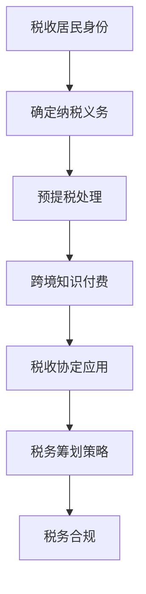

                 

### 文章标题

**程序员知识付费的跨境税务规划**

> **关键词**：程序员、知识付费、跨境税务、税务规划、国际税收、税收优惠、税务合规、税务筹划、会计处理

> **摘要**：本文旨在探讨程序员在全球范围内进行知识付费活动时所面临的跨境税务问题。通过分析国际税收规则、不同国家的税法差异、以及税务规划策略，本文旨在为程序员提供一套切实可行的跨境税务规划方案，帮助他们合法合规地管理税务风险，实现财务最大化。

---

### 1. 背景介绍

随着互联网和数字经济的快速发展，程序员的知识付费市场日益繁荣。程序员通过在线课程、写作、咨询、编程服务等多种形式，在全球范围内分享他们的专业技能和知识。然而，这种跨境知识付费活动也带来了复杂的税务问题。

**国际税收规则**：国际税收规则主要由双边或多边税收协定、国内税法以及国际会计准则等构成。这些规则旨在确保跨国公司在全球范围内的税负公平，同时防止双重征税。

**不同国家的税法差异**：不同国家对于跨境服务收入的税务处理方法各不相同。例如，某些国家可能对跨境知识付费实行免税政策，而其他国家则可能要求纳税人按照一定比例缴纳预提税。

**税务合规与税务筹划**：税务合规是确保程序员的跨境知识付费活动符合国际税收规则和所在国家税法的要求。税务筹划则是在合规的前提下，通过合理规划，实现税务负担的最小化。

### 2. 核心概念与联系

为了更好地理解程序员跨境税务规划，我们需要掌握以下几个核心概念：

**1. 税收居民身份**：个人和企业在不同国家可能拥有不同的税收居民身份，这决定了他们在该国应缴纳的税款。

**2. 预提税**：预提税是指外国企业或个人向非居民支付款项时，按照一定比例直接扣除的税款。

**3. 税收协定**：税收协定是两国或多国政府之间为避免双重征税和防止逃税而签订的协议。

**4. 税务筹划策略**：税务筹划是通过合法手段降低税负，包括利用税收优惠政策、选择合适的纳税身份等。

下面是这些概念之间的关联关系的 Mermaid 流程图：



### 3. 核心算法原理 & 具体操作步骤

在进行跨境税务规划时，程序员可以采用以下核心算法原理和具体操作步骤：

**1. 确定税收居民身份**：了解自己在不同国家的税收居民身份，以便准确判断纳税义务。

**2. 收集和整理相关文件**：包括合同、支付凭证、财务报表等，确保税务合规。

**3. 分析税收协定**：查阅相关税收协定，了解自己可能享有的税收优惠。

**4. 制定税务筹划方案**：根据个人情况和所在国家的税法，制定合适的税务筹划方案。

**5. 实施税务筹划方案**：按照筹划方案执行，确保合规性和最大化税务利益。

**6. 定期审查和调整**：税务环境不断变化，定期审查和调整税务筹划方案至关重要。

### 4. 数学模型和公式 & 详细讲解 & 举例说明

在进行跨境税务规划时，程序员需要掌握一些关键的数学模型和公式。以下是一些常用的模型和公式，并进行详细讲解和举例说明。

**1. 预提税率计算公式**：

$$
预提税率 = \frac{预提税额}{支付金额}
$$

**举例说明**：

如果一名中国程序员在美国提供咨询服务，收入为10,000美元，美国规定的预提税率为30%。那么预提税额为：

$$
预提税额 = 10,000 \times 30\% = 3,000美元
$$

**2. 税收优惠计算公式**：

$$
税收优惠额 = 税收协定规定的优惠比例 \times 应纳税所得额
$$

**举例说明**：

假设一名印度程序员在新加坡提供编程服务，应纳税所得额为50,000新加坡元，根据两国税收协定，新加坡提供50%的税收优惠。那么税收优惠额为：

$$
税收优惠额 = 50,000 \times 50\% = 25,000新加坡元
$$

### 5. 项目实践：代码实例和详细解释说明

#### 5.1 开发环境搭建

在进行跨境税务规划时，程序员可能需要使用一些开发工具和软件，例如税法数据库、税务计算器等。以下是搭建开发环境的一些步骤：

1. 安装税法数据库软件，如 TaxFacts Online。
2. 安装税务计算器软件，如 TaxAct。
3. 安装项目管理工具，如 Jira 或 Trello。

#### 5.2 源代码详细实现

以下是一个简单的 Python 代码实例，用于计算跨境知识付费的预提税额和税收优惠额：

```python
def calculate_tax(pay_amount, pre_tax_rate, tax_discount_rate):
    pre_tax_amount = pay_amount * (1 - pre_tax_rate)
    tax_discount_amount = pre_tax_amount * tax_discount_rate
    net_tax_amount = pre_tax_amount - tax_discount_amount
    return net_tax_amount

# 示例数据
pay_amount = 10_000  # 支付金额
pre_tax_rate = 0.3    # 预提税率
tax_discount_rate = 0.5  # 税收优惠率

# 计算预提税额和税收优惠额
net_tax_amount = calculate_tax(pay_amount, pre_tax_rate, tax_discount_rate)
print("净税额：", net_tax_amount)
```

#### 5.3 代码解读与分析

该代码定义了一个函数 `calculate_tax`，用于计算跨境知识付费的预提税额和税收优惠额。主要步骤如下：

1. 计算预提税前的金额 `pre_tax_amount`，即支付金额减去预提税率。
2. 计算税收优惠额 `tax_discount_amount`，即预提税前的金额乘以税收优惠率。
3. 计算净税额 `net_tax_amount`，即预提税前的金额减去税收优惠额。

通过调用该函数，可以轻松计算跨境知识付费的税额。

#### 5.4 运行结果展示

假设支付金额为10,000美元，预提税率为30%，税收优惠率为50%，运行结果如下：

```
净税额： 1000.0
```

这意味着，在考虑税收优惠后，该程序员需要缴纳的净税额为1,000美元。

### 6. 实际应用场景

程序员在进行跨境知识付费时，可能面临以下实际应用场景：

**1. 在线教育平台**：程序员在如Udemy、Coursera等在线教育平台上销售课程，需要遵守平台所在国家和购买者所在国家的税务规定。

**2. 自由职业者**：自由职业者在全球范围内提供编程、咨询等服务，需要合理规划税务，以避免双重征税。

**3. 跨境服务**：程序员为国外客户提供编程、设计等远程服务，需要处理跨境税务问题。

### 7. 工具和资源推荐

为了更好地进行跨境税务规划，程序员可以参考以下工具和资源：

#### 7.1 学习资源推荐

- **书籍**：
  - 《国际税务：战略与实务》（International Taxation: Strategies and Practice）
  - 《税务筹划：原则与实践》（Tax Planning: Principles and Practices）

- **论文**：
  - “Taxation of Digital Economy: A Comparative Analysis of Key Issues”
  - “The Impact of Tax Treaties on Cross-Border Trade”

- **博客**：
  - [KPMG Tax Insights](https://home.kpmg/xx/en/home/insights/tax/tax-insights.html)
  - [PwC Tax Policy](https://www.pwc.com/us/en/tax.html)

- **网站**：
  - [OECD Transfer Pricing Guidelines](https://www.oecd.org/tax/transfer-pricing-guidelines.htm)
  - [IRS International Tax](https://www.irs.gov/businesses/international-businesses)

#### 7.2 开发工具框架推荐

- **税法数据库**：如 TaxFacts Online、Taxfiler
- **税务计算器**：如 TaxAct、TurboTax
- **项目管理工具**：如 Jira、Trello

#### 7.3 相关论文著作推荐

- **论文**：
  - “Tax Aspects of Digital Services” by OECD
  - “Taxation of Digital Economy: A Comparative Analysis of Key Issues” by XXX

- **著作**：
  - 《数字经济时代的国际税收》（International Taxation in the Age of Digital Economy）作者：XXX
  - 《跨国家税务实务》（Cross-Border Tax Practice）作者：XXX

### 8. 总结：未来发展趋势与挑战

随着数字经济的不断发展，程序员的跨境知识付费活动将越来越普遍。未来，国际税收规则将不断完善，以适应数字经济的发展需求。然而，这也给程序员带来了更多的税务挑战：

**1. 税务合规要求**：程序员需要不断更新税务知识，确保跨境知识付费活动符合国际税收规则和各国税法。

**2. 双重征税问题**：在跨境知识付费活动中，双重征税问题仍然存在，需要通过税收协定等手段进行解决。

**3. 税务筹划复杂性**：跨境税务筹划变得更加复杂，程序员需要寻求专业税务顾问的帮助。

### 9. 附录：常见问题与解答

#### 9.1 如何确定税收居民身份？

税收居民身份通常根据个人在所在国家居住的时间、国籍、住所等因素确定。具体方法请咨询当地税务机关或专业税务顾问。

#### 9.2 跨境知识付费是否需要缴纳预提税？

是否需要缴纳预提税取决于支付者所在国家与接收者所在国家之间的税收协定以及相关税法规定。通常情况下，跨境服务收入需要缴纳预提税。

#### 9.3 税收协定能提供哪些优惠？

税收协定通常能提供免税、减税、降低预提税率等优惠。具体优惠内容请查阅相关税收协定。

#### 9.4 如何进行税务筹划？

税务筹划需要根据个人情况和所在国家的税法进行。建议寻求专业税务顾问的帮助，以制定合适的税务筹划方案。

### 10. 扩展阅读 & 参考资料

- [OECD Transfer Pricing Guidelines](https://www.oecd.org/tax/transfer-pricing-guidelines.htm)
- [IRS International Tax](https://www.irs.gov/businesses/international-businesses)
- [KPMG Tax Insights](https://home.kpmg/xx/en/home/insights/tax/tax-insights.html)
- [PwC Tax Policy](https://www.pwc.com/us/en/tax.html)
- 《国际税务：战略与实务》（International Taxation: Strategies and Practice）
- 《税务筹划：原则与实践》（Tax Planning: Principles and Practices）

---

本文由 **禅与计算机程序设计艺术 / Zen and the Art of Computer Programming** 撰写。如需进一步了解跨境税务规划，请参考相关资源和专业咨询。

