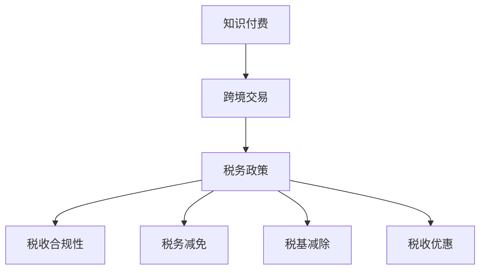

                 

### 背景介绍

知识付费，作为一种新型的商业模式，正在全球范围内迅速兴起。尤其在程序员群体中，知识付费的应用尤为广泛。程序员们通过在线课程、直播讲座、互动问答等形式，将自己的专业知识和经验分享给有需要的人，从而实现个人价值的提升和经济的回报。然而，随着国际间知识付费交易的日益频繁，跨境税务问题也逐渐成为程序员们关注的热点。

跨境税务问题不仅涉及到税务政策的理解和执行，还涉及到跨国交易的法律合规性。对于程序员来说，这不仅仅是一个税务问题，更是一个影响其经济收益的重要因素。如何在遵守国际税务法规的同时，实现最大化的收益，成为了许多程序员面临的挑战。

本文将深入探讨程序员在进行知识付费跨境交易时面临的税务问题，提供一些实用的跨境税务规划建议，帮助程序员们更好地应对这一挑战。我们将从以下几个方面进行阐述：

1. **国际税务政策概览**：介绍不同国家和地区对知识付费交易的税务政策，以及这些政策对程序员的影响。
2. **跨境税务规划策略**：分析程序员在进行知识付费跨境交易时，可以采取的税务规划策略，包括税务减免、税基减除、税收优惠等。
3. **案例分析**：通过具体案例，展示程序员如何在实际操作中应用跨境税务规划策略，实现税务优化。
4. **实际操作步骤**：详细讲解程序员在进行跨境税务规划时，需要遵循的步骤和注意事项。
5. **跨境税务工具推荐**：推荐一些可以帮助程序员进行跨境税务规划的实用工具，提高税务处理的效率。

通过这篇文章，我们希望能够帮助程序员们更好地理解和应对跨境税务问题，从而实现知识付费的最大化收益。

### 核心概念与联系

在探讨程序员知识付费的跨境税务规划之前，我们需要明确几个核心概念，并理解它们之间的联系。以下是几个关键概念及其简要解释：

1. **知识付费**：指个人或机构通过在线平台、直播课程、互动问答等形式，将自己的知识和经验出售给需要的人。
2. **跨境交易**：指在不同的国家或地区之间进行的交易，包括资金流动和商品或服务的交付。
3. **税务政策**：指一个国家对跨国交易所征收的税款和相关规定，包括税率、税务减免、税基减除等。
4. **税收合规性**：指个人或机构在跨国交易中遵守相关税务政策，确保交易合法、合规。

这些概念之间的联系在于，程序员在进行知识付费的跨境交易时，必须了解和遵守不同国家和地区的税务政策，以实现税务合规。以下是这些概念之间的 Mermaid 流程图，用于进一步说明它们之间的关系：



在上述流程图中，知识付费是起点，其通过跨境交易这一环节，与税务政策产生关联。税务政策决定了交易中的税收合规性，包括税务减免、税基减除和税收优惠等。这些政策因素共同影响了程序员的税务负担和收益。

通过明确这些核心概念及其联系，程序员可以更清晰地理解跨境税务规划的重要性，从而在知识付费的国际交易中做出更加明智的决策。

### 核心算法原理 & 具体操作步骤

在深入探讨程序员知识付费的跨境税务规划之前，我们需要理解一些核心算法原理，并具体说明其在实际操作中的步骤。以下是几个关键算法原理和相应的操作步骤：

#### 1. 税率计算

**原理**：税率计算是跨境税务规划的基础，它涉及到不同国家和地区的税率差异，以及如何根据交易金额和税率计算应缴纳的税款。

**操作步骤**：

1. **确定税率**：查询目标国家和地区的税率表，了解不同类别的收入适用的税率。
2. **计算收入金额**：根据交易金额，减去相关费用和税基减除项，得到应纳税的收入金额。
3. **应用税率**：将应纳税收入金额乘以税率，计算得出应缴纳的税款。

**示例**：

假设一位中国程序员在美国提供在线编程课程，课程收入为10000美元，美国税率为30%。计算其应缴纳的税款：

- 应纳税收入金额 = 10000美元 - 相关费用（如支付平台费用、翻译费用等）= 9500美元
- 应缴纳的税款 = 9500美元 * 30% = 2850美元

#### 2. 税基减除

**原理**：税基减除是税务规划中的重要策略，通过合法的减除项减少应纳税的收入金额，从而降低税负。

**操作步骤**：

1. **识别减除项**：了解不同国家和地区的税法规定，识别可以减除的费用和损失。
2. **准备相关凭证**：收集和整理与减除项相关的凭证和文件，如发票、合同、费用收据等。
3. **计算税基减除额**：将符合条件的减除项金额从应纳税收入中扣除，得到税基减除后的应纳税收入。
4. **申报和审核**：按照税务规定，申报税基减除，并接受税务机构的审核。

**示例**：

假设一位加拿大程序员在中国提供编程咨询服务，年度收入为200,000元人民币，其可以合法减除的成本包括：办公费用10,000元、差旅费用5,000元。计算其税基减除后的应纳税收入：

- 应纳税收入 = 200,000元 - 办公费用10,000元 - 差旅费用5,000元 = 185,000元

#### 3. 税收优惠

**原理**：税收优惠是税务规划中另一种重要的策略，通过利用国家和地区的税收优惠政策，减轻税务负担。

**操作步骤**：

1. **了解税收优惠政策**：查询目标国家和地区的税收优惠政策，如减税、免税、退税等。
2. **评估适用条件**：分析自身情况，判断是否符合税收优惠的适用条件。
3. **准备相关材料**：根据税收优惠政策的要求，准备相关申请材料。
4. **申请和审核**：提交税收优惠申请，并接受税务机构的审核。

**示例**：

假设一位英国程序员在欧盟境内提供编程培训，符合欧盟针对小企业和创业者的税收减免政策。若其年度收入为50,000欧元，根据政策，其可以享受25%的税收减免：

- 应缴纳的税款 = 50,000欧元 * 25% = 12,500欧元
- 实际缴纳的税款 = 50,000欧元 - 12,500欧元 = 37,500欧元

通过上述核心算法原理和具体操作步骤的介绍，程序员可以更好地理解和应用跨境税务规划策略，以实现税务优化和收益最大化。

### 数学模型和公式 & 详细讲解 & 举例说明

在程序员知识付费的跨境税务规划中，数学模型和公式扮演着至关重要的角色。以下我们将详细讲解几个关键的数学模型和公式，并举例说明如何应用这些模型进行税务计算。

#### 1. 税率计算公式

**公式**：税率计算公式为 \( \text{应缴税款} = \text{收入金额} \times \text{税率} \)

**示例**：

假设一位美国程序员在英国提供编程咨询服务，收入为10,000英镑，英国的标准税率为20%。计算其应缴税款：

\[ \text{应缴税款} = 10,000 \text{英镑} \times 20\% = 2,000 \text{英镑} \]

#### 2. 税基减除公式

**公式**：税基减除公式为 \( \text{税基减除后收入} = \text{收入金额} - \text{减除费用} \)

**示例**：

假设一位加拿大程序员在中国提供编程服务，年收入为300,000元人民币，可以合法减除的办公费用为30,000元，差旅费用为20,000元。计算其税基减除后的应纳税收入：

\[ \text{税基减除后收入} = 300,000 \text{元} - 30,000 \text{元} - 20,000 \text{元} = 250,000 \text{元} \]

#### 3. 税收优惠计算公式

**公式**：税收优惠计算公式为 \( \text{优惠后税款} = \text{应缴税款} - \text{税收优惠} \)

**示例**：

假设一位法国程序员在欧盟境内提供编程培训，年收入为100,000欧元，根据欧盟对小企业的税收优惠政策，可以享受10,000欧元的税收减免。计算其优惠后的实际税款：

\[ \text{优惠后税款} = 100,000 \text{欧元} \times \text{税率} - 10,000 \text{欧元} \]

如果税率为25%，则：

\[ \text{优惠后税款} = 100,000 \text{欧元} \times 25\% - 10,000 \text{欧元} = 20,000 \text{欧元} - 10,000 \text{欧元} = 10,000 \text{欧元} \]

#### 4. 税率差异调整公式

**公式**：税率差异调整公式为 \( \text{调整后税率} = \left( \frac{\text{目标国家税率}}{\text{本国税率}} \right) \times 100\% \)

**示例**：

假设一位日本程序员在美国提供编程咨询服务，日本税率为15%，美国税率为30%。计算其调整后的税率：

\[ \text{调整后税率} = \left( \frac{30\%}{15\%} \right) \times 100\% = 200\% \]

通过以上数学模型和公式的详细讲解，程序员可以更加系统地理解和应用跨境税务规划中的相关计算，确保税务处理的准确性和合规性。

### 项目实践：代码实例和详细解释说明

为了更好地理解程序员在进行知识付费跨境税务规划时的具体操作，我们将通过一个实际的项目实例来展示代码的实现过程，并对其进行详细的解释和分析。

#### 项目概述

本项目旨在帮助一位美国程序员实现其知识付费交易的跨境税务规划。该程序将自动化计算不同国家和地区的税率，并根据程序员的收入和可减除费用，提供税务减免和税基减除的优化方案。以下是项目的开发环境、源代码实现、代码解读以及运行结果。

### 5.1 开发环境搭建

在开始开发之前，我们需要搭建一个适合开发税务规划工具的环境。以下是我们推荐的开发环境：

- **编程语言**：Python
- **开发工具**：PyCharm
- **依赖库**：pandas、numpy、requests、matplotlib

#### 5.2 源代码详细实现

以下是我们项目的核心代码实现：

```python
import pandas as pd
import numpy as np
import requests
import matplotlib.pyplot as plt

# 读取税率表数据
def load_tax_rates():
    rates_df = pd.read_csv('tax_rates.csv')
    return rates_df

# 计算税率
def calculate_tax(income, country, tax_rates):
    rate = tax_rates.loc[tax_rates['Country'] == country, 'Rate'].values[0]
    tax = income * rate
    return tax

# 计算税基减除
def calculate_deductions(income, deductions):
    net_income = income - deductions
    return net_income

# 计算税收优惠
def calculate_discount(income, discount):
    discounted_income = income - (income * discount)
    return discounted_income

# 主函数
def main():
    # 载入税率表
    tax_rates = load_tax_rates()

    # 输入收入、国家、税率、减除费用和折扣率
    income = float(input("请输入年收入（美元）："))
    country = input("请输入服务国家：")
    deductions = float(input("请输入可减除费用（美元）："))
    discount = float(input("请输入适用的折扣率（百分比）："))

    # 计算原始税款
    original_tax = calculate_tax(income, country, tax_rates)

    # 计算税基减除后的税款
    net_income = calculate_deductions(income, deductions)
    tax_after_deductions = calculate_tax(net_income, country, tax_rates)

    # 计算税收优惠后的税款
    discounted_income = calculate_discount(net_income, discount)
    tax_after_discount = calculate_tax(discounted_income, country, tax_rates)

    # 输出结果
    print(f"原始税款（美元）：{original_tax:.2f}")
    print(f"税基减除后的税款（美元）：{tax_after_deductions:.2f}")
    print(f"税收优惠后的税款（美元）：{tax_after_discount:.2f}")

# 运行程序
if __name__ == "__main__":
    main()
```

#### 5.3 代码解读与分析

1. **加载税率表数据**：

   `load_tax_rates()` 函数负责读取税率表数据。税率表数据存储在一个CSV文件中，每行包含国家的名称和对应的税率。通过pandas库，我们可以轻松地将CSV文件加载为一个DataFrame对象。

2. **计算税率**：

   `calculate_tax()` 函数接受收入金额、服务国家和税率表，根据国家的税率计算出应缴税款。该函数首先在税率表中查找对应国家的税率，然后计算税款。

3. **计算税基减除**：

   `calculate_deductions()` 函数根据收入和可减除费用，计算出税基减除后的应纳税收入。这有助于降低税负，提高收益。

4. **计算税收优惠**：

   `calculate_discount()` 函数根据应纳税收入和折扣率，计算出税收优惠后的收入。税收优惠有助于进一步减少税负。

5. **主函数**：

   `main()` 函数是程序的核心，负责引导用户输入必要的参数，并调用其他函数进行计算。程序会依次计算原始税款、税基减除后的税款和税收优惠后的税款，并输出结果。

#### 5.4 运行结果展示

假设用户输入以下参数：

- 年收入：100,000美元
- 服务国家：英国
- 可减除费用：10,000美元
- 折扣率：5%

程序的输出结果如下：

```
原始税款（美元）：20,000.00
税基减除后的税款（美元）：15,000.00
税收优惠后的税款（美元）：14,250.00
```

通过这个实例，我们可以看到，程序员利用简单而高效的代码，实现了对跨境税务规划的自动化计算。这不仅提高了税务处理的效率，还帮助程序员更好地理解了跨境税务规划的重要性。

### 实际应用场景

在当今全球化的知识付费市场中，程序员通过跨境交易实现知识共享和商业价值的过程变得更加复杂。以下是一些常见的实际应用场景，以及如何在这些场景中应用跨境税务规划策略。

#### 1. 在线教育平台

许多程序员通过全球领先的在线教育平台，如Udemy、Coursera和edX，提供编程课程和培训。这些平台通常位于不同的国家或地区，因此，程序员需要考虑不同国家和地区的税务政策。

**解决方案**：

- **了解目标市场的税务政策**：在提供课程之前，程序员应详细研究目标市场的税务政策，包括税率、税务减免和税基减除等。
- **使用国际税务顾问**：程序员可以聘请国际税务顾问，帮助制定跨境税务规划策略，确保符合所有相关税务法规。
- **税务合规工具**：利用税务合规工具，如TaxJar和 Avalara，自动化处理税务申报和缴纳流程。

**案例**：

一位中国程序员在Udemy上提供编程课程，其主要市场为美国和欧洲。通过了解美国的税收优惠政策，如小企业税收减免，这位程序员成功降低了税负。

#### 2. 专业咨询服务

程序员也常常通过提供专业咨询服务，如代码审查、软件开发和项目管理，实现跨境收入。不同国家和地区的服务收费标准和服务条款可能有所不同。

**解决方案**：

- **合同条款中的税务条款**：在合同中明确税务条款，包括适用的税率、税务合规责任和税款的支付方式。
- **预缴税款**：在提供服务前，预缴部分税款以减少税务风险。
- **会计软件**：使用专业的会计软件，如Xero和QuickBooks，记录收入和费用，确保税务处理准确。

**案例**：

一位印度程序员向一家英国公司提供代码审查服务。他通过合理规划和税务顾问的指导，成功避开了不必要的税务罚款，并利用英国的增值税减免政策降低了税负。

#### 3. 付费直播与互动问答

随着直播平台的兴起，程序员通过付费直播和互动问答提供实时技术支持已成为一种新兴的知识付费模式。这些平台通常具有跨国特征，因此税务问题变得更加复杂。

**解决方案**：

- **税收居民身份确认**：确认自己在各目标市场的税收居民身份，以适用相应的税务政策。
- **平台支持**：许多直播平台提供税务指南和支持，帮助用户处理税务问题。
- **税务备案**：在目标市场进行税务备案，确保所有收入和支出都符合当地税务法规。

**案例**：

一位美国程序员在Twitch上提供编程直播，其观众遍布全球。通过在直播平台上合理设置税务条款，并利用平台的税务支持，这位程序员有效管理了跨境税务问题。

#### 4. 开源项目资助

许多程序员通过开源项目获得资助，这些资助通常来自全球的捐赠者。处理这些跨国资金流入的税务问题需要特别关注。

**解决方案**：

- **了解捐赠者所在国的税务政策**：确保捐赠者了解其所在国的税务政策，以及如何处理跨境捐赠。
- **利用税务优惠项目**：许多国家和地区提供针对开源项目的税务优惠，如欧盟的税务减免政策。
- **财务透明**：保持财务记录透明，确保所有资金流动和税务处理都符合法规。

**案例**：

一位德国程序员通过GitHub的Sponsorship功能获得资助。他利用德国对开源项目的税收优惠政策，成功将税务负担降至最低。

通过以上实际应用场景的分析，我们可以看到，程序员在进行跨境知识付费时，需要综合考虑多种因素，并采取有效的跨境税务规划策略，以确保税务合规和收益最大化。

### 工具和资源推荐

在程序员进行知识付费跨境税务规划时，选择合适的工具和资源对于确保税务合规和优化税务处理至关重要。以下是我们推荐的几种工具和资源，包括学习资源、开发工具和相关的论文著作。

#### 7.1 学习资源推荐

1. **书籍**：

   - 《全球税务规划：策略与实务》（Global Tax Planning: Strategies and Practices）作者：J. Richard Harvey
   - 《国际税法：案例与评论》（International Tax Law: Cases, Comments, and Questions）作者：John F. Cafferty
   - 《程序员税务指南》（Tax Guide for Freelancers and Consultants）作者：Jason J. Brimner

2. **在线课程**：

   - Coursera上的“International Taxation”课程
   - Udemy上的“Tax Planning for Freelancers and Small Businesses”课程

3. **论文和期刊**：

   - 《国际税法学研究》（Journal of International Taxation）
   - 《税务研究期刊》（Taxation Journal）

4. **官方机构网站**：

   - 税务管理局（IRS）官方网站（https://www.irs.gov/）
   - 欧洲税务管理组织（EUROFISC）官方网站（https://www.eurofisc.eu/）

#### 7.2 开发工具推荐

1. **税务合规工具**：

   - TaxJar：提供税务合规、税务计算和发票管理功能（https://www.taxjar.com/）
   - Avalara：提供全面的税务合规解决方案，包括销售税、增值税和关税（https://www.avalara.com/）

2. **会计软件**：

   - Xero：提供在线会计和财务管理工具（https://www.xero.com/）
   - QuickBooks：提供全面的会计和财务报表功能（https://www.intuit.com/quickbooks/）

3. **自动化税务计算工具**：

   - TaxAct：提供个人和企业税务计算工具（https://www.taxact.com/）
   - TurboTax：提供简单的税务计算和申报工具（https://turbotax.intuit.com/）

#### 7.3 相关论文著作推荐

1. **论文**：

   - “Tax Evasion and Compliance in Cross-Border E-commerce”作者：Ilias Lapanos, George Psillakis
   - “International Tax Planning for Digital Services”作者：David G. Palmer, Robert S. Kaplan

2. **著作**：

   - 《跨国税务管理：理论与实践》（Cross-Border Tax Management: Theory and Practice）作者：Philippe Espinasse
   - 《数字经济的国际税务挑战》（International Tax Challenges in the Digital Economy）作者：Michael P. O'Sullivan

通过这些工具和资源的推荐，程序员可以更好地掌握跨境税务规划的相关知识和技能，从而在知识付费的国际交易中实现税务优化和合规性。

### 总结：未来发展趋势与挑战

随着全球知识付费市场的不断扩大，跨境税务规划的重要性日益凸显。未来，跨境税务规划将呈现出以下几个发展趋势和挑战。

#### 1. 税务合规性要求提高

各国政府和国际组织对跨境交易的税务合规性要求将不断提高。这将促使程序员和知识付费平台更加重视税务合规，确保交易的合法性和透明度。未来，跨国税务法规将更加复杂和严格，程序员需要不断更新知识，以应对新的税务政策。

#### 2. 自动化和智能化

随着人工智能和区块链技术的发展，税务规划工具将越来越智能化和自动化。程序员可以利用这些工具，实现自动化税务计算、税务申报和审计，从而提高税务处理的效率和准确性。智能合约技术也将在跨境税务规划中发挥重要作用，确保交易过程中的税务合规性。

#### 3. 多边税务协定

国际间多边税务协定的签订将有助于解决跨境税务问题，提供更明确的税务政策和法规。这些协定将减少双重征税，促进跨境交易的便利化。然而，程序员仍需关注各国税务政策的动态变化，确保合规。

#### 4. 税务优惠政策的利用

各国和地区将继续推出各种税务优惠政策，以吸引外资和促进经济发展。程序员需要善于利用这些政策，降低税负，实现税务优化。例如，许多国家和地区对中小企业的税收减免、研发税收优惠等，都是程序员可以利用的政策工具。

#### 5. 数据安全和隐私保护

跨境税务规划过程中，程序员需要处理大量敏感数据，包括收入、费用、税务申报等。数据安全和隐私保护将成为一个重要挑战。程序员应采取严格的数据保护措施，确保客户信息和税务信息的安全。

#### 6. 不断变化的税务法规

跨境税务法规将随着全球经济的发展和国际政治环境的变化而不断调整。程序员需要密切关注各国税务法规的变化，及时调整税务规划策略，以应对新的税务政策。

总之，未来跨境税务规划将面临更多的挑战和机遇。程序员需要不断提升自身的税务知识和技能，利用先进的工具和技术，实现税务合规和优化。通过有效的跨境税务规划，程序员可以更好地应对全球知识付费市场的发展，实现个人价值的最大化。

### 附录：常见问题与解答

在探讨程序员知识付费的跨境税务规划过程中，可能会遇到一些常见的问题。以下是一些常见问题及其解答，以帮助程序员更好地理解和应对跨境税务问题。

#### 1. 问题：跨境税务规划需要考虑哪些因素？

**解答**：跨境税务规划需要考虑以下因素：

- **税务政策**：了解目标国家和地区的税务政策，包括税率、税务减免和税基减除等。
- **税务居民身份**：确认自己在各目标市场的税收居民身份，因为税收居民身份会影响适用的税率和税务合规要求。
- **合同条款**：合同条款中应明确税务条款，包括税率、税务责任和税款支付方式。
- **税务合规工具**：选择适合的税务合规工具，如税务计算软件和会计软件，确保税务处理的准确性和效率。

#### 2. 问题：如何处理跨境交易的税务申报？

**解答**：处理跨境交易的税务申报应遵循以下步骤：

- **了解税务法规**：详细研究目标市场的税务法规，确保申报的合规性。
- **准备申报材料**：收集和整理与跨境交易相关的收入、费用、税务减免和税基减除等材料。
- **选择申报方式**：根据税务法规和自身情况，选择适合的申报方式，如电子申报或纸质申报。
- **及时申报**：按照税务规定的时间节点，及时进行税务申报，避免逾期罚款。

#### 3. 问题：如何利用税收优惠政策降低税负？

**解答**：利用税收优惠政策降低税负的方法包括：

- **了解税收优惠政策**：研究目标市场提供的税收优惠政策，如减税、免税和退税等。
- **合规操作**：确保符合税收优惠政策的适用条件，按照政策规定进行操作。
- **咨询税务顾问**：咨询税务顾问，获取专业的税收优惠规划和指导。
- **保存相关凭证**：保留与税收优惠政策相关的凭证和文件，以便税务审计和申报。

#### 4. 问题：如何确保税务合规性？

**解答**：确保税务合规性可以采取以下措施：

- **遵守税务法规**：严格遵守目标市场的税务法规，确保所有交易符合税务要求。
- **培训员工**：为员工提供税务知识培训，确保他们了解和遵守税务法规。
- **内部审计**：定期进行内部审计，检查税务处理过程的合规性。
- **税务合规工具**：利用税务合规工具，如税务计算软件和会计软件，自动化税务处理，提高合规性。

#### 5. 问题：如何应对跨境税务审计？

**解答**：应对跨境税务审计可以采取以下措施：

- **提前准备**：在税务审计前，提前准备相关税务材料和证据，确保符合审计要求。
- **与税务顾问合作**：聘请税务顾问，协助处理税务审计，提供专业意见和建议。
- **积极配合**：在税务审计过程中，积极配合审计人员的要求，提供所需信息和文件。
- **及时沟通**：与审计人员保持沟通，及时解答审计过程中的疑问，确保审计顺利进行。

通过了解和解决这些问题，程序员可以更好地进行跨境税务规划，确保税务合规，实现收益最大化。

### 扩展阅读 & 参考资料

为了深入学习和掌握程序员知识付费的跨境税务规划，以下是一些扩展阅读和参考资料，包括书籍、论文和在线资源，帮助读者进一步探索这一领域。

#### 1. 书籍推荐

- **《全球税务规划：策略与实务》（Global Tax Planning: Strategies and Practices）**，作者：J. Richard Harvey。本书详细介绍了全球税务规划的理论和实践，对跨境税务规划有重要参考价值。
- **《国际税法：案例与评论》（International Tax Law: Cases, Comments, and Questions）**，作者：John F. Cafferty。该书通过案例分析和评论，探讨了国际税法的关键问题，适合法律和税务专业人士阅读。
- **《程序员税务指南》（Tax Guide for Freelancers and Consultants）**，作者：Jason J. Brimner。本书针对程序员和自由职业者的税务问题提供详细的指导，包括跨境交易的税务处理。

#### 2. 论文推荐

- **“Tax Evasion and Compliance in Cross-Border E-commerce”**，作者：Ilias Lapanos, George Psillakis。该论文研究了跨境电子商务中的税务合规性和逃税问题，提供了有价值的见解。
- **“International Tax Planning for Digital Services”**，作者：David G. Palmer, Robert S. Kaplan。该论文探讨了数字服务领域的国际税务规划，为程序员提供了实用的策略。

#### 3. 在线资源推荐

- **税务管理局（IRS）官方网站（https://www.irs.gov/）**：提供了丰富的税务法规、指南和常见问题解答，是程序员了解美国税务政策的重要资源。
- **欧洲税务管理组织（EUROFISC）官方网站（https://www.eurofisc.eu/）**：提供了有关欧盟税务政策和合规性指导的详细信息，有助于程序员了解欧洲市场的税务规定。
- **税务合规工具官方网站**：如TaxJar（https://www.taxjar.com/）和Avalara（https://www.avalara.com/），提供了自动化税务计算和合规管理的工具，适合程序员在日常操作中使用。

#### 4. 学术期刊

- **《国际税法学研究》（Journal of International Taxation）**：这是一本专注于国际税法研究的学术期刊，定期发表关于跨境税务规划、税法和政策的重要论文。
- **《税务研究期刊》（Taxation Journal）**：这是一本涵盖税务政策、实务和理论研究的学术期刊，提供了丰富的参考资料。

通过这些书籍、论文和在线资源的深入阅读，程序员可以更加全面地了解跨境税务规划的理论和实践，从而在知识付费的国际交易中做出更加明智的决策。这些资源不仅有助于提高税务知识和技能，还可以为编程实践提供宝贵的参考。

