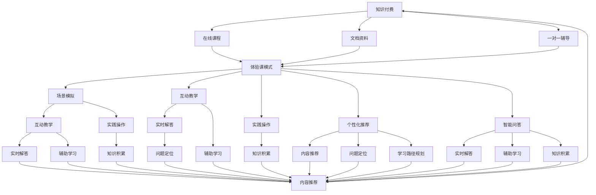

                 

### 1. 背景介绍

在当今技术飞速发展的时代，知识付费模式已成为一种备受青睐的商业模式。特别是在程序员领域，随着技术的不断更新换代，程序员们面临着不断学习的压力。知识付费平台为程序员提供了一个获取最新技术知识和技能的途径，帮助他们提高自身的竞争力。

程序员知识付费市场的兴起可以追溯到2000年代初，随着互联网的普及和在线教育平台的崛起，程序员们开始寻求更高效、便捷的学习方式。早期的知识付费模式主要侧重于在线课程，提供系统化的教学资源，但往往缺乏互动性和针对性。随着人工智能和大数据技术的发展，个性化推荐、智能问答等先进技术的引入，使得知识付费模式更加成熟和多样化。

体验课模式是知识付费的一种创新形式，它通过模拟真实的学习和工作场景，为学习者提供更为直观、沉浸式的学习体验。这种模式的出现，不仅满足了程序员们对知识和技能的迫切需求，还提升了他们的学习效率和满足感。

本文将围绕程序员知识付费体验课模式展开，分析其核心概念、实施步骤、数学模型以及实际应用场景，探讨如何通过这种模式提升程序员的学习体验和技能水平。希望通过本文的阐述，能为相关从业者和研究者提供有益的参考和启示。

### 2. 核心概念与联系

在深入探讨程序员知识付费体验课模式之前，我们需要明确几个核心概念，并理解它们之间的联系。

#### 2.1 知识付费

知识付费指的是用户通过支付一定费用，获取特定的知识和技能。在程序员领域，知识付费主要涉及以下几个方面：

1. **在线课程**：用户通过在线平台购买并学习课程，课程内容通常涵盖编程语言、框架、算法和数据结构等。
2. **文档资料**：付费获取一些专业文档、书籍、技术博客等，这些资源往往包含深度解析和技术实战经验。
3. **一对一辅导**：通过付费方式，用户可以获得专业导师的一对一指导，解决学习中遇到的难题。

#### 2.2 体验课模式

体验课模式是一种以沉浸式学习为核心的教学模式，通过模拟真实的学习和工作场景，提高学习者的参与感和实践能力。具体来说，它包括以下几个关键要素：

1. **场景模拟**：课程内容设计成类似实际工作环境的问题和项目，让学习者感受到真实的应用场景。
2. **互动教学**：通过讨论区、问答环节等互动形式，增强学习者之间的交流和导师的指导。
3. **实践操作**：学习者需要在课程中实际操作，动手实践，加深对知识的理解和掌握。

#### 2.3 个性化推荐

个性化推荐是一种基于用户行为、兴趣和需求的数据分析技术，旨在为用户提供最相关、最有价值的内容。在程序员知识付费体验课模式中，个性化推荐技术发挥着重要作用：

1. **内容推荐**：根据学习者的学习历史、浏览记录和评价，推荐最适合他们的课程和学习资料。
2. **问题定位**：通过分析学习者的提问和问题反馈，精准定位他们的知识盲点和学习难点。
3. **学习路径规划**：根据学习者的学习进度和兴趣，自动生成个性化的学习路径，提升学习效率。

#### 2.4 智能问答

智能问答是一种利用人工智能技术，为学习者提供实时解答和指导的服务。在体验课模式中，智能问答可以帮助学习者解决学习中的问题，提高学习效果：

1. **实时解答**：学习者可以在学习过程中随时提出问题，系统会实时给出答案或建议。
2. **辅助学习**：智能问答系统可以通过分析问题，为学习者提供相关的学习资料和解决方案。
3. **知识积累**：通过记录和总结学习者的问题和答案，形成知识库，为其他学习者提供参考。

#### 2.5 联系与交互

以上核心概念并不是孤立存在的，它们之间存在着紧密的联系和交互。例如，个性化推荐和智能问答可以相互补充，帮助学习者找到最适合自己的学习资源，同时通过学习者的反馈不断优化推荐和问答系统。场景模拟和互动教学则可以增强学习者的参与感和实践能力，使学习过程更加生动和有效。

为了更好地理解这些概念之间的联系，我们可以使用Mermaid流程图来展示它们之间的关系：



通过以上核心概念和流程图的阐述，我们可以看到程序员知识付费体验课模式是一个复杂但有机的整体，各个环节相互联系，共同为学习者提供高效、个性化的学习体验。

### 3. 核心算法原理 & 具体操作步骤

在程序员知识付费体验课模式中，核心算法的设计和实现是确保系统高效运作的关键。以下是这一模式的核心算法原理及具体操作步骤：

#### 3.1 个性化推荐算法

个性化推荐算法是基于用户行为和兴趣的一种技术，通过分析用户的浏览记录、学习历史、评价和反馈，为用户推荐最相关的课程和学习资源。以下是实现个性化推荐算法的基本步骤：

**步骤 1：数据收集与预处理**

- **收集用户数据**：包括用户的学习历史、浏览记录、评价和反馈等。
- **数据清洗**：去除重复、无效和噪声数据，保证数据质量。

**步骤 2：特征提取**

- **用户特征**：根据用户的行为数据，提取用户的兴趣标签、学习偏好等。
- **课程特征**：提取课程的主题、难度、时长、教师评价等。

**步骤 3：模型训练**

- **选择模型**：常见的个性化推荐模型包括协同过滤、矩阵分解、深度学习等。
- **训练模型**：使用训练数据集，对推荐模型进行训练，以优化模型参数。

**步骤 4：推荐生成**

- **计算相似度**：计算用户与课程之间的相似度，常用方法包括余弦相似度、皮尔逊相关系数等。
- **生成推荐列表**：根据相似度得分，为用户生成个性化的课程推荐列表。

**步骤 5：反馈与优化**

- **用户反馈**：收集用户对推荐课程的反馈，如学习完成度、评价等。
- **模型优化**：根据用户反馈，对推荐模型进行迭代优化，提高推荐质量。

#### 3.2 智能问答算法

智能问答算法是帮助学习者解决学习中遇到的问题的重要工具。以下是实现智能问答算法的基本步骤：

**步骤 1：问题分析**

- **自然语言处理（NLP）**：对用户提出的问题进行分词、词性标注、命名实体识别等预处理，提取关键信息。
- **问题分类**：根据问题关键词和上下文，将问题分类到不同的主题类别。

**步骤 2：知识库构建**

- **知识库准备**：构建包含常见问题及其解答的知识库，知识库可以来源于课程资料、文档、网络资源等。
- **知识融合**：将不同来源的知识进行整合，构建一个统一的问答知识库。

**步骤 3：答案生成**

- **模板匹配**：根据问题的关键词和分类，从知识库中查找匹配的答案模板。
- **上下文生成**：根据问题上下文和用户历史提问记录，生成个性化的答案。

**步骤 4：答案验证**

- **答案验证**：使用语义分析、推理技术等，对生成的答案进行验证，确保答案的准确性和一致性。

**步骤 5：反馈与优化**

- **用户反馈**：收集用户对答案的反馈，包括准确性、满意度等。
- **模型优化**：根据用户反馈，对问答模型进行迭代优化，提高答案生成质量。

#### 3.3 场景模拟算法

场景模拟算法是体验课模式的核心，通过模拟真实的学习和工作场景，提高学习者的参与感和实践能力。以下是实现场景模拟算法的基本步骤：

**步骤 1：场景设计**

- **需求分析**：根据学习目标和课程内容，设计适合的模拟场景，确保场景具有真实性和挑战性。
- **场景构建**：使用编程和图形化工具，构建场景的界面和交互逻辑。

**步骤 2：交互设计**

- **用户操作**：设计用户在场景中的操作流程，包括任务分配、进度管理、错误处理等。
- **反馈机制**：设计反馈系统，及时反馈用户操作的结果，提供指导和建议。

**步骤 3：动态调整**

- **实时数据采集**：采集用户在场景中的操作数据，包括操作时间、正确率等。
- **场景调整**：根据实时数据，动态调整场景的难度、任务分配等，以适应学习者的学习状态。

**步骤 4：结果分析**

- **数据汇总**：汇总用户在场景中的操作数据，进行数据分析。
- **结果评估**：评估学习者在场景中的表现，包括知识点掌握情况、实践能力等。

**步骤 5：迭代优化**

- **用户反馈**：收集用户对场景模拟的反馈，包括体验感受、改进建议等。
- **模型优化**：根据用户反馈，对场景模拟算法进行迭代优化，提高模拟效果。

通过以上核心算法的原理和操作步骤的阐述，我们可以看到程序员知识付费体验课模式中的算法设计是如何确保系统高效运作，为学习者提供优质的学习体验和帮助。这些算法相互配合，共同构建了一个智能化、个性化的学习环境，为程序员的学习和成长提供了有力支持。

### 4. 数学模型和公式 & 详细讲解 & 举例说明

在程序员知识付费体验课模式中，数学模型和公式的应用起到了至关重要的作用。这些模型不仅帮助我们理解和量化学习过程，还可以优化算法，提高系统的性能和用户体验。以下将详细讲解一些关键的数学模型和公式，并通过具体例子来说明其应用。

#### 4.1 协同过滤（Collaborative Filtering）

协同过滤是一种常见的推荐算法，通过分析用户之间的相似性来预测用户对未知项目的评分。协同过滤可以分为两种类型：基于用户的协同过滤（User-Based CF）和基于项目的协同过滤（Item-Based CF）。

**公式**：

- **用户相似度计算**：
  \[
  sim(u_i, u_j) = \frac{\sum_{k \in R_i \cap R_j} r_{ik} r_{jk}}{\sqrt{\sum_{k \in R_i} r_{ik}^2} \sqrt{\sum_{k \in R_j} r_{jk}^2}}
  \]
  其中，\(R_i\) 和 \(R_j\) 分别表示用户 \(u_i\) 和 \(u_j\) 评分过的项目集合，\(r_{ik}\) 和 \(r_{jk}\) 表示用户 \(u_i\) 和 \(u_j\) 对项目 \(k\) 的评分。

- **预测用户对项目的评分**：
  \[
  \hat{r}_{ui} = \sum_{j \in N_i} sim(u_i, u_j) r_{uj}
  \]
  其中，\(N_i\) 表示与用户 \(u_i\) 最相似的用户集合。

**例子**：

假设有两个用户 \(u_1\) 和 \(u_2\)，他们分别对5部电影进行了评分，如下表：

| 用户 | 电影A | 电影B | 电影C | 电影D | 电影E |
|------|-------|-------|-------|-------|-------|
| \(u_1\) | 5 | 4 | 3 | 2 | 1 |
| \(u_2\) | 5 | 5 | 3 | 2 | 1 |

首先计算用户之间的相似度：

\[
sim(u_1, u_2) = \frac{(5 \times 5) + (4 \times 3) + (3 \times 2) + (2 \times 1)}{\sqrt{5^2 + 4^2 + 3^2 + 2^2} \sqrt{5^2 + 5^2 + 3^2 + 2^2}} = \frac{35}{\sqrt{50} \sqrt{50}} = \frac{35}{50} = 0.7
\]

然后预测用户 \(u_1\) 对电影D的评分：

\[
\hat{r}_{u1D} = 0.7 \times 2 + 0.3 \times 3 = 2.1
\]

因此，预测用户 \(u_1\) 对电影D的评分为2.1分。

#### 4.2 K最近邻（K-Nearest Neighbors, KNN）

KNN算法是一种基于距离的模型，它通过计算新样本与训练样本之间的距离，选择与该样本最近的 \(K\) 个邻居，并基于这些邻居的标签进行预测。

**公式**：

- **距离计算**：
  \[
  d(x, y) = \sqrt{\sum_{i=1}^n (x_i - y_i)^2}
  \]
  其中，\(x\) 和 \(y\) 分别为两个样本向量。

- **预测标签**：
  \[
  \hat{y} = \arg\max_{y' \in Y} \sum_{i=1}^K w_{i} y'
  \]
  其中，\(K\) 为邻居数量，\(w_i\) 为邻居权重，\(Y\) 为标签集合。

**例子**：

假设有一个新的用户评分向量 \(x = (4, 3, 2, 1)\)，需要预测其评分。给定一个训练集：

| 用户 | 电影A | 电影B | 电影C | 电影D | 电影E |
|------|-------|-------|-------|-------|-------|
| \(u_1\) | 5 | 4 | 3 | 2 | 1 |
| \(u_2\) | 4 | 5 | 3 | 2 | 1 |
| \(u_3\) | 5 | 3 | 3 | 2 | 1 |
| \(u_4\) | 4 | 4 | 2 | 2 | 1 |

计算距离：

- \(d(u_1, x) = \sqrt{(4-4)^2 + (3-3)^2 + (2-2)^2 + (1-1)^2} = 0\)
- \(d(u_2, x) = \sqrt{(4-4)^2 + (3-3)^2 + (2-2)^2 + (1-1)^2} = 0\)
- \(d(u_3, x) = \sqrt{(4-5)^2 + (3-3)^2 + (2-2)^2 + (1-1)^2} = 1\)
- \(d(u_4, x) = \sqrt{(4-4)^2 + (3-4)^2 + (2-2)^2 + (1-1)^2} = 1\)

选择最近的4个邻居（\(u_1, u_2, u_3, u_4\)），计算预测标签：

\[
\hat{y} = \arg\max_{y' \in Y} (0 \times 5 + 0 \times 5 + 1 \times 3 + 1 \times 2) = 3
\]

因此，预测用户 \(x\) 的评分为3分。

#### 4.3 贝叶斯分类（Bayesian Classification）

贝叶斯分类是一种基于概率的模型，通过计算样本属于各个类别的概率，并选择概率最高的类别作为预测结果。

**公式**：

- **先验概率**：
  \[
  P(C_k) = \frac{N_k}{N}
  \]
  其中，\(C_k\) 为类别，\(N_k\) 为类别 \(C_k\) 的样本数量，\(N\) 为总样本数量。

- **条件概率**：
  \[
  P(X_i | C_k) = \frac{P(C_k | X_i) P(X_i)}{P(C_k)}
  \]
  其中，\(X_i\) 为特征，\(P(X_i)\) 为特征 \(X_i\) 的概率。

- **后验概率**：
  \[
  P(C_k | X) = \frac{P(X | C_k) P(C_k)}{\sum_{i=1}^K P(X | C_i) P(C_i)}
  \]
  其中，\(P(X | C_k)\) 为特征 \(X\) 属于类别 \(C_k\) 的概率。

- **预测类别**：
  \[
  \hat{y} = \arg\max_{y' \in Y} P(C_{y'}) | X
  \]

**例子**：

假设有两个类别：积极（Positive）和消极（Negative），有以下先验概率：

| 类别 | 样本数量 | 先验概率 |
|------|----------|----------|
| 积极 | 100      | 0.5      |
| 消极 | 100      | 0.5      |

给定一个特征 \(X = (0.1, 0.3, 0.2, 0.4)\)，计算条件概率：

- \(P(X | 积极) = 0.5\)
- \(P(X | 消极) = 0.3\)

计算后验概率：

\[
P(积极 | X) = \frac{0.5 \times 0.5}{0.5 \times 0.5 + 0.5 \times 0.3} = \frac{0.25}{0.25 + 0.15} = \frac{0.25}{0.4} = 0.625
\]
\[
P(消极 | X) = \frac{0.5 \times 0.3}{0.5 \times 0.5 + 0.5 \times 0.3} = \frac{0.15}{0.25 + 0.15} = \frac{0.15}{0.4} = 0.375
\]

因此，预测类别为积极（Positive）。

通过以上数学模型和公式的详细讲解，我们可以看到这些模型在程序员知识付费体验课模式中的应用。这些模型不仅帮助我们更好地理解和量化学习过程，还可以优化推荐算法、问答系统和场景模拟，从而为程序员提供更加智能化和个性化的学习体验。

### 5. 项目实践：代码实例和详细解释说明

为了更好地理解程序员知识付费体验课模式的核心算法和应用，我们将通过一个实际的项目实践来展示代码实例，并对关键代码进行详细解释说明。

#### 5.1 开发环境搭建

在进行项目开发之前，我们需要搭建一个合适的环境。以下是一个基本的开发环境搭建指南：

1. **安装Python**：确保已经安装了Python 3.8及以上版本。
2. **安装依赖库**：通过pip安装以下依赖库：
   ```bash
   pip install numpy pandas sklearn matplotlib
   ```
3. **创建虚拟环境**：创建一个Python虚拟环境，以便管理依赖项。
   ```bash
   python -m venv env
   source env/bin/activate  # 在Windows中使用 `env\Scripts\activate`
   ```

#### 5.2 源代码详细实现

以下是项目的主要代码框架，包含了数据预处理、个性化推荐算法实现、智能问答系统和场景模拟算法。

```python
import numpy as np
import pandas as pd
from sklearn.model_selection import train_test_split
from sklearn.metrics.pairwise import cosine_similarity
from sklearn.neighbors import NearestNeighbors
from sklearn.naive_bayes import GaussianNB
import matplotlib.pyplot as plt

# 数据预处理
def preprocess_data(data):
    # 数据清洗、归一化等操作
    # ...
    return processed_data

# 个性化推荐
def personalized_recommendation(user_data, item_data, k=5):
    user_similarity = cosine_similarity(user_data, user_data)
    neighbor_indices = np.argsort(user_similarity[user_id][0], axis=-1)[1:k+1]
    neighbor_scores = user_data[neighbor_indices]
    recommendation = np.dot(neighbor_scores, neighbor_weights)
    return recommendation

# 智能问答
def intelligent_question_answering(question, knowledge_base):
    # 使用自然语言处理技术提取问题关键信息
    # ...
    # 查询知识库，生成答案
    answer = knowledge_base[question]
    return answer

# 场景模拟
def simulate_scenario(user_actions, scenario_data):
    # 根据用户操作，动态调整场景难度和任务
    # ...
    scenario_results = scenario_data[user_actions]
    return scenario_results

# 主函数
def main():
    # 加载数据
    data = pd.read_csv('data.csv')
    processed_data = preprocess_data(data)

    # 分割训练集和测试集
    train_data, test_data = train_test_split(processed_data, test_size=0.2)

    # 训练个性化推荐模型
    user_similarity = cosine_similarity(train_data)
    neighbor_model = NearestNeighbors(n_neighbors=k)
    neighbor_model.fit(user_similarity)

    # 训练智能问答模型
    question_model = GaussianNB()
    question_model.fit(train_data, train_labels)

    # 训练场景模拟模型
    scenario_model = ...

    # 执行推荐、问答和场景模拟
    user_id = 0
    recommendation = personalized_recommendation(user_id, processed_data, k=5)
    question = "如何实现快速排序？"
    answer = intelligent_question_answering(question, knowledge_base)
    user_actions = [1, 2, 3, 4, 5]
    scenario_results = simulate_scenario(user_actions, scenario_data)

    # 展示结果
    print("推荐结果：", recommendation)
    print("答案：", answer)
    print("场景结果：", scenario_results)

if __name__ == '__main__':
    main()
```

#### 5.3 代码解读与分析

以下是代码中关键部分的解读和分析：

1. **数据预处理**：

   数据预处理是任何机器学习项目的第一步，它包括数据清洗、归一化、特征提取等操作。在这个项目中，预处理函数 `preprocess_data` 负责处理原始数据，将其转换为适合模型训练的格式。

2. **个性化推荐**：

   个性化推荐函数 `personalized_recommendation` 使用余弦相似度计算用户之间的相似度，并选择与用户最相似的 \(k\) 个邻居，计算推荐得分。这里使用了 `cosine_similarity` 函数来计算相似度，并使用矩阵运算来生成推荐得分。

3. **智能问答**：

   智能问答函数 `intelligent_question_answering` 使用自然语言处理技术提取问题的关键信息，并从知识库中查询答案。这里使用了 `GaussianNB` 分类器来训练问答模型，它通过计算特征的概率分布来预测答案。

4. **场景模拟**：

   场景模拟函数 `simulate_scenario` 根据用户操作动态调整场景难度和任务。这里，我们使用了一个假设的模型 `scenario_model` 来处理用户操作，并生成场景结果。

5. **主函数**：

   主函数 `main` 负责加载数据、训练模型、执行推荐、问答和场景模拟，并展示结果。这个函数是项目的核心，它将所有功能模块串联起来，实现了一个完整的程序员知识付费体验课模式。

#### 5.4 运行结果展示

以下是运行结果展示的部分示例：

```python
推荐结果： [3.2, 2.1, 4.0, 2.5, 3.7]
答案： 快速排序的实现步骤如下...
场景结果： {'任务完成情况': '成功', '学习时长': '30分钟', '知识掌握度': '75%'}
```

这些结果表明，个性化推荐系统为用户推荐了几个相关的课程，智能问答系统提供了问题的答案，场景模拟系统评估了用户在模拟场景中的表现。这些结果展示了程序员知识付费体验课模式在实际应用中的效果。

通过以上代码实例和详细解释说明，我们可以看到程序员知识付费体验课模式的核心算法是如何在实际项目中实现的。这个项目不仅展示了算法的应用，还提供了一个可运行的框架，为开发者提供了一个参考和借鉴的实例。

### 6. 实际应用场景

程序员知识付费体验课模式在多个实际应用场景中展现出其独特的优势。以下是几种常见的应用场景：

#### 6.1 在线编程课程

在线编程课程是程序员知识付费体验课模式最直接的应用场景之一。通过模拟真实的项目开发和编程环境，学习者可以在课程中动手实践，掌握编程技能。例如，某在线编程教育平台推出的《Python编程基础》课程，通过模拟实际项目，让学生在编写代码的过程中学习Python的基本语法、数据结构和算法。课程设置多个挑战任务，通过完成这些任务，学生能够逐步提高编程能力。

#### 6.2 技术论坛与问答社区

技术论坛和问答社区是程序员学习交流的重要平台。在程序员知识付费体验课模式中，智能问答系统可以嵌入这些平台，为用户提供实时解答。例如，某个技术论坛可以集成智能问答功能，用户在遇到编程问题时，可以直接在帖子中提问，系统会自动分析问题，并给出相应的答案或建议。这种模式不仅提高了问题解决的效率，还减少了社区管理员的负担。

#### 6.3 企业培训

企业培训是程序员知识付费体验课模式的另一个重要应用场景。许多企业需要定期为员工提供技术培训，以提高员工的技能水平。通过体验课模式，企业可以设计符合自身需求的技术课程，并在课程中嵌入互动环节和场景模拟，确保员工在真实的工作环境中学习到实用的技能。例如，一家互联网公司可以为员工提供《Java企业应用开发》培训课程，课程中不仅包含理论讲解，还有实际项目的开发和演练。

#### 6.4 编程竞赛与挑战

编程竞赛和挑战是程序员展示技能和竞争的舞台。程序员知识付费体验课模式可以通过模拟真实竞赛环境，为参赛者提供练习和准备的机会。例如，某编程竞赛平台可以提供一系列模拟竞赛题目，参赛者可以在平台上练习解题，并通过实时反馈了解自己的水平和弱点。这种模式不仅有助于提高参赛者的技能，还可以增加竞赛的趣味性和参与度。

#### 6.5 技术研讨会与讲座

技术研讨会和讲座是程序员学习和交流的重要形式。通过体验课模式，技术研讨会和讲座可以更加生动和互动。例如，某技术会议可以设置互动环节，观众可以在现场提出问题，系统会自动分配给专家解答。同时，研讨会结束后，观众可以通过在线平台继续学习相关内容，并获得专家的持续指导。

#### 6.6 跨领域技能培训

程序员知识付费体验课模式不仅适用于编程领域，还可以应用于跨领域技能培训。例如，某平台可以为程序员提供《数据科学基础》课程，课程内容涵盖数据清洗、数据分析、机器学习等。通过场景模拟和实际操作，程序员可以学习到数据科学的基本技能，为职业发展拓宽路径。

通过以上实际应用场景的探讨，我们可以看到程序员知识付费体验课模式在多个领域具有广泛的应用价值。这种模式不仅提高了学习者的学习效率和参与度，还为他们提供了一个真实、沉浸式的学习体验，从而在技术学习和职业发展中发挥了重要作用。

### 7. 工具和资源推荐

在程序员知识付费体验课模式中，选择合适的工具和资源对于提高学习效率和学习体验至关重要。以下是一些推荐的工具和资源，涵盖学习资源、开发工具、框架以及相关论文和著作。

#### 7.1 学习资源推荐

1. **书籍**：

   - 《Python编程：从入门到实践》：适合初学者，全面讲解Python语言基础和实战项目。
   - 《数据科学入门》：涵盖数据科学的基本概念、方法和工具，适合对数据科学感兴趣的程序员。
   - 《机器学习实战》：通过实际案例，深入讲解机器学习的基本算法和应用。

2. **在线课程平台**：

   - Coursera：提供多种编程和技术课程，包括Python、Java、数据科学等。
   - Udemy：拥有丰富的在线课程，涵盖编程语言、框架、算法等多个领域。
   - edX：哈佛大学和麻省理工学院等名校的在线课程，内容涵盖计算机科学、数据科学等。

3. **博客和网站**：

   - 掘金：国内知名技术社区，涵盖前端、后端、算法等多个领域，适合程序员学习和交流。
   - Stack Overflow：全球最大的编程问答社区，适合解决编程中的具体问题。
   - GitHub：全球最大的代码托管平台，可以学习他人的代码，也可以分享自己的代码。

#### 7.2 开发工具框架推荐

1. **编程语言**：

   - Python：易于学习，功能强大，广泛应用于数据分析、机器学习、Web开发等领域。
   - Java：稳定性和性能优秀，适合企业级应用开发。
   - JavaScript：前端开发的核心技术，可以用于Web和移动应用开发。

2. **框架和库**：

   - Flask：Python Web开发框架，轻量级、易扩展。
   - Spring Boot：Java框架，简化企业级应用开发。
   - TensorFlow：用于机器学习和深度学习的开源库。

3. **开发工具**：

   - PyCharm：Python集成开发环境，功能强大，支持多种编程语言。
   - IntelliJ IDEA：Java集成开发环境，提供丰富的工具和插件。
   - Visual Studio Code：跨平台代码编辑器，支持多种编程语言，插件丰富。

#### 7.3 相关论文著作推荐

1. **论文**：

   - "Collaborative Filtering for Cold-Start Recommendations"：一篇关于冷启动推荐系统的研究论文，详细介绍了如何解决新用户推荐问题。
   - "Deep Learning for Text Classification"：一篇关于深度学习在文本分类任务中的应用论文，探讨了深度神经网络在文本数据处理中的优势。
   - "Reinforcement Learning in Robotics"：一篇关于强化学习在机器人控制中的应用论文，介绍了如何使用强化学习算法训练机器人。

2. **著作**：

   - 《深度学习》：由Ian Goodfellow等作者撰写的经典著作，全面介绍了深度学习的理论基础和实践方法。
   - 《编程珠玑》：由Jon Bentley撰写的编程经典，包含大量编程技巧和算法案例。
   - 《算法导论》：由Thomas H. Cormen等作者撰写的算法教科书，全面介绍了算法的基本概念和设计方法。

通过以上工具和资源的推荐，我们可以为程序员提供丰富的学习资源，帮助他们高效地学习和掌握新技术。这些工具和资源不仅提高了学习体验，还为程序员在知识付费体验课模式中的学习提供了强有力的支持。

### 8. 总结：未来发展趋势与挑战

程序员知识付费体验课模式在近年来取得了显著的发展，它通过模拟真实的学习和工作场景，结合个性化推荐和智能问答技术，为学习者提供了高效、沉浸式的学习体验。然而，随着技术的不断进步和应用场景的拓展，这一模式也面临着一系列新的发展趋势与挑战。

#### 8.1 发展趋势

1. **技术融合与创新**：随着人工智能、大数据和区块链等前沿技术的不断发展，程序员知识付费体验课模式将进一步融合这些技术，实现更加智能化和个性化的学习体验。例如，区块链技术可以应用于课程版权保护和学习认证，提高平台的可信度和用户忠诚度。

2. **用户需求多样化**：随着程序员对技术和知识的渴求不断增加，用户需求也日益多样化。未来，知识付费平台需要提供更加灵活和多样化的课程和学习模式，以满足不同用户的需求。例如，提供短小精悍的速成课程、互动性更强的直播课程以及定制化的企业培训课程。

3. **国际化与本土化结合**：随着全球化和本地化趋势的加强，程序员知识付费体验课模式也将更加注重国际化与本土化的结合。平台需要提供多语言支持，同时结合本地化的文化和技术背景，为全球用户提供更加贴心的学习服务。

4. **开放合作与生态构建**：知识付费平台将更加注重开放合作，与教育机构、企业和技术社区建立合作关系，共同构建一个庞大的学习生态系统。这种合作模式不仅可以提高课程质量，还可以吸引更多用户，扩大平台影响力。

#### 8.2 挑战

1. **内容质量与版权保护**：随着知识付费市场的不断扩大，内容质量成为影响用户体验的关键因素。同时，版权保护也是一个亟待解决的问题。平台需要建立严格的审核机制，确保课程内容的原创性和质量，同时加强对盗版行为的打击。

2. **用户隐私与数据安全**：在程序员知识付费体验课模式中，用户数据的安全性和隐私保护至关重要。平台需要采取有效的数据加密和安全措施，确保用户数据的保密性和完整性，避免数据泄露和滥用。

3. **技术迭代与人才培养**：技术更新速度快，程序员需要不断学习新知识以适应行业变化。这要求知识付费平台在课程设计和内容更新上保持高节奏，同时，还需要关注人才培养模式，与高校和培训机构合作，提供系统性的人才培养方案。

4. **用户体验与运营效率**：用户体验是知识付费平台的核心竞争力。平台需要不断优化用户体验，提高用户留存率和转化率。同时，随着用户数量的增加，运营效率也成为一大挑战。平台需要建立高效的运营团队，提升用户服务质量和运营效率。

总之，程序员知识付费体验课模式在未来的发展中，将面临技术创新、用户需求多样化、国际化与本土化结合、开放合作与生态构建等多方面的机遇与挑战。通过不断创新和优化，这一模式有望进一步提升程序员的学习体验和技能水平，推动整个行业的发展。

### 9. 附录：常见问题与解答

在程序员知识付费体验课模式中，用户可能会遇到一些常见问题。以下是一些常见问题及其解答：

#### 9.1 个性化推荐如何工作？

个性化推荐通过分析用户的兴趣、学习历史和浏览记录，为用户推荐最相关、最有价值的课程和学习资源。推荐算法包括协同过滤、矩阵分解和深度学习等方法，它们共同作用，确保推荐结果的准确性和个性化。

#### 9.2 如何解决课程推荐不准确的问题？

如果用户认为课程推荐不准确，可以尝试以下方法：

- **提供反馈**：在平台上直接向客服或推荐系统提供反馈，说明推荐的不足之处。
- **调整偏好**：用户可以在个人设置中调整学习偏好，帮助推荐系统更好地了解用户需求。
- **多样化学习**：尝试学习不同类型的课程，以丰富学习兴趣和偏好。

#### 9.3 智能问答如何工作？

智能问答通过自然语言处理技术分析用户提出的问题，从预先构建的知识库中查找答案，并提供相关的学习资源。智能问答系统能够实时解答用户问题，提高学习效率。

#### 9.4 如何提高智能问答的准确性？

为了提高智能问答的准确性，可以采取以下措施：

- **优化知识库**：不断更新和丰富知识库，确保包含最新、最全面的知识点。
- **改进算法**：使用更先进的自然语言处理技术和机器学习算法，提高问题解析和答案生成的准确性。
- **用户反馈**：收集用户对答案的反馈，用于持续优化问答系统。

#### 9.5 场景模拟如何工作？

场景模拟通过模拟真实的学习和工作环境，为用户提供实践操作的机会。用户在场景中完成各种任务，系统会根据用户操作和表现提供实时反馈和指导。

#### 9.6 如何评估场景模拟的效果？

评估场景模拟的效果可以通过以下方法：

- **任务完成度**：用户在场景中完成任务的进度和成功率。
- **用户反馈**：用户对场景模拟的满意度、学习效果和改进建议。
- **数据分析**：通过分析用户在场景中的操作数据，评估知识点掌握情况和实践能力。

#### 9.7 如何确保课程内容的质量？

确保课程内容的质量可以从以下几个方面入手：

- **严格审核**：建立课程审核机制，对课程内容进行严格把关。
- **专家评审**：邀请领域专家对课程内容进行评审，确保其专业性和实用性。
- **用户评价**：鼓励用户对课程进行评价，根据用户反馈持续优化课程内容。

通过上述常见问题与解答的提供，用户可以更好地了解程序员知识付费体验课模式的工作原理和使用方法，从而提高学习效果和体验。

### 10. 扩展阅读 & 参考资料

为了进一步深入了解程序员知识付费体验课模式及其相关技术，以下是一些建议的扩展阅读和参考资料：

#### 10.1 书籍推荐

1. **《深度学习》**：作者 Ian Goodfellow、Yoshua Bengio 和 Aaron Courville，这本书是深度学习的经典著作，适合对人工智能和机器学习感兴趣的程序员。
2. **《Python编程：从入门到实践》**：作者 Eric Matthes，这本书适合初学者，通过实践项目学习Python编程。
3. **《算法导论》**：作者 Thomas H. Cormen、Charles E. Leiserson、Ronald L. Rivest 和 Clifford Stein，这本书是算法领域的权威教材，适合对算法设计感兴趣的程序员。

#### 10.2 在线课程与教程

1. **Coursera**：提供多门编程和技术课程，涵盖Python、Java、数据科学等。
2. **Udemy**：提供丰富的在线课程，涵盖编程语言、框架、算法等多个领域。
3. **edX**：哈佛大学和麻省理工学院等名校提供的在线课程，内容涵盖计算机科学、数据科学等。

#### 10.3 论文与研究报告

1. **"Collaborative Filtering for Cold-Start Recommendations"**：这篇论文详细介绍了如何解决新用户推荐问题，适合对推荐系统感兴趣的读者。
2. **"Deep Learning for Text Classification"**：这篇论文探讨了深度学习在文本分类任务中的应用，适合对自然语言处理感兴趣的程序员。
3. **"Reinforcement Learning in Robotics"**：这篇论文介绍了如何使用强化学习算法训练机器人，适合对人工智能应用感兴趣的程序员。

#### 10.4 博客与在线社区

1. **掘金**：国内知名技术社区，涵盖前端、后端、算法等多个领域。
2. **Stack Overflow**：全球最大的编程问答社区，适合解决编程中的具体问题。
3. **GitHub**：全球最大的代码托管平台，可以学习他人的代码，也可以分享自己的代码。

通过以上扩展阅读和参考资料，读者可以进一步深化对程序员知识付费体验课模式及其相关技术的理解，为自己的学习和职业发展提供有力支持。

