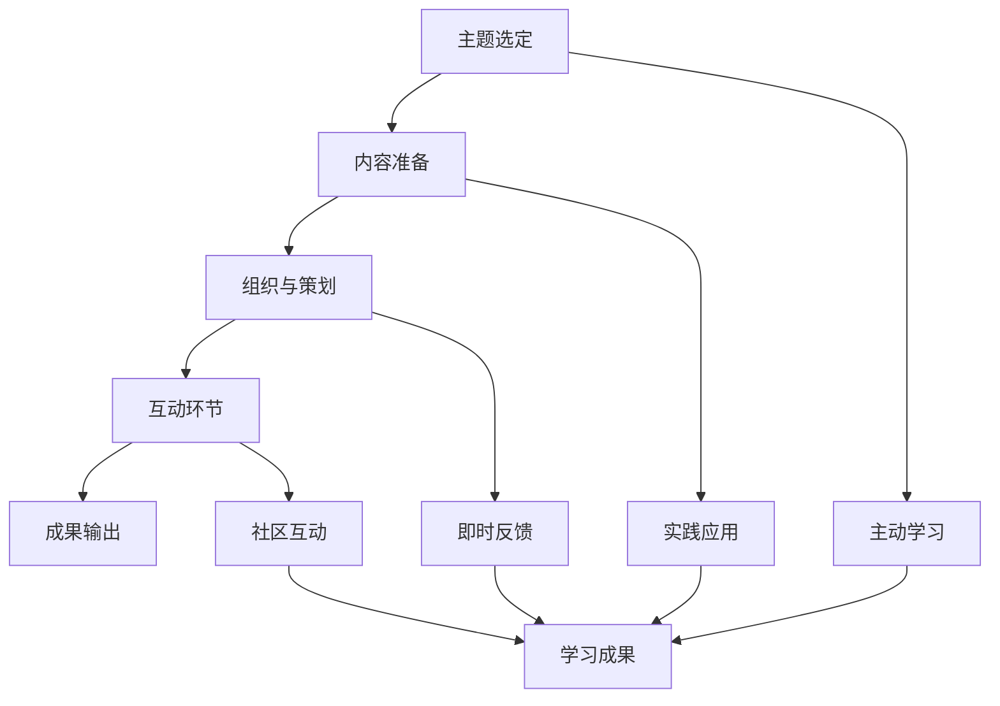

                 

### 背景介绍 Background

随着互联网技术的飞速发展，知识付费市场逐渐壮大。程序员作为技术领域的核心人群，对于专业知识的获取和交流有着极高的需求。知识付费作为一种新的商业模式，旨在通过付费方式为用户提供高质量、有价值的技术内容和服务。研讨会模式作为知识付费的一种重要形式，以其互动性强、内容深入的特点，受到越来越多程序员的青睐。

#### 程序员知识付费的现状现状
当前，程序员知识付费市场呈现出蓬勃发展的态势。一方面，越来越多的程序员意识到通过付费学习能够更高效地提升自己的技能；另一方面，各类知识付费平台如雨后春笋般涌现，为程序员提供了丰富的学习资源。这些平台通常包括在线课程、电子书、研讨会等多种形式，满足了不同程序员的学习需求。

#### 研讨会模式的优点
研讨会模式在知识付费领域具有独特的优势。首先，研讨会模式强调互动性，能够实现讲师与学员之间的实时互动，使学员在互动中更好地理解和掌握知识。其次，研讨会模式的内容通常较为深入，能够针对技术难点和痛点进行详细讲解，帮助学员解决实际问题。此外，研讨会模式还可以通过案例分析和现场演示，使学员更加直观地理解技术原理和应用场景。

#### 目标与结构
本文旨在探讨如何利用研讨会模式打造程序员知识付费产品。文章将从以下几个方面进行论述：

1. 背景介绍：分析程序员知识付费的现状和研讨会模式的优点。
2. 核心概念与联系：介绍研讨会模式的基本概念和核心原理，并通过Mermaid流程图展示其架构。
3. 核心算法原理与具体操作步骤：详细讲解研讨会模式的运作原理和实施步骤。
4. 数学模型和公式：探讨研讨会模式中涉及的数学模型和公式，并进行详细讲解。
5. 项目实践：通过代码实例展示研讨会模式的具体应用。
6. 实际应用场景：分析研讨会模式在不同场景下的应用。
7. 工具和资源推荐：推荐相关学习资源和开发工具。
8. 总结：展望研讨会模式在程序员知识付费领域的未来发展趋势和挑战。

通过以上论述，本文旨在为程序员知识付费产品的设计和开发提供有益的参考和借鉴。

## 2. 核心概念与联系 Core Concepts and Relationships

在探讨如何打造程序员知识付费研讨会模式之前，首先需要明确相关核心概念和其相互之间的联系。以下将详细介绍研讨会模式的基本概念和核心原理，并通过Mermaid流程图展示其架构。

### 2.1 研讨会模式的基本概念

研讨会模式（Workshop Model）是一种以互动和实践为核心的知识传授方式。它通常由以下几部分组成：

1. **主题选定**：根据受众需求和讲师专长，确定研讨会主题。主题应具有明确的目标和实际应用价值。
2. **内容准备**：讲师需针对主题准备详细的内容，包括理论讲解、案例分析、实操演示等。内容应深入浅出，便于学员理解。
3. **组织与策划**：研讨会需提前进行组织与策划，包括场地安排、时间分配、互动环节设计等。
4. **互动环节**：在研讨会过程中，讲师与学员之间需进行充分的互动，如提问、讨论、案例分析等，以提高学员的参与度和理解深度。
5. **成果输出**：研讨会结束后，讲师和学员需共同总结学习成果，如撰写心得、分享实战经验等。

### 2.2 研讨会模式的核心原理

研讨会模式的核心原理在于通过互动和实践，使学员能够深入理解和掌握所学知识。具体来说，核心原理包括以下几个方面：

1. **主动学习**：研讨会模式鼓励学员主动参与，通过提问、讨论、实操等环节，使学员从被动接受知识转变为主动探索和学习。
2. **实践应用**：研讨会模式强调理论与实践相结合，通过实操演示和案例分析，使学员能够将所学知识应用到实际工作中。
3. **即时反馈**：研讨会过程中，讲师能够及时了解学员的掌握情况，并进行针对性的辅导和解答，提高学习效果。
4. **社区互动**：研讨会模式还可以促进学员之间的交流和互动，形成知识共享和互助的良好氛围。

### 2.3 研讨会模式的架构

以下使用Mermaid流程图展示研讨会模式的架构：



### 2.4 核心概念之间的关系

研讨会模式中的各个核心概念之间相互关联，共同构成了一个完整的学习生态系统。具体来说，主题选定决定了研讨会的方向和目标；内容准备为研讨会提供了丰富的知识素材；组织与策划保证了研讨会的顺利进行；互动环节促进了学员的主动学习和实践应用；即时反馈和社区互动则进一步提高了学习效果和成果输出。

通过以上论述，我们对研讨会模式的基本概念、核心原理和架构有了清晰的认识。接下来，我们将详细探讨研讨会模式的运作原理和实施步骤。

### 3. 核心算法原理 & 具体操作步骤 Core Algorithm Principles & Operational Steps

研讨会模式在程序员知识付费领域具有独特的优势，其核心算法原理和具体操作步骤如下：

#### 3.1 算法原理

研讨会模式的核心算法原理可以归纳为以下四个方面：

1. **互动性**：研讨会模式强调讲师与学员之间的实时互动，通过提问、讨论、实操等环节，提高学员的参与度和理解深度。
2. **实践性**：研讨会模式注重理论与实践的结合，通过实操演示和案例分析，使学员能够将所学知识应用到实际工作中。
3. **反馈机制**：研讨会模式建立了即时反馈机制，讲师能够及时了解学员的掌握情况，并进行针对性的辅导和解答，提高学习效果。
4. **社区化**：研讨会模式促进了学员之间的交流和互动，形成了知识共享和互助的良好氛围。

#### 3.2 操作步骤

以下是研讨会模式的具体操作步骤：

1. **确定主题**：根据受众需求和讲师专长，确定研讨会主题。主题应具有明确的目标和实际应用价值。
2. **内容准备**：讲师需针对主题准备详细的内容，包括理论讲解、案例分析、实操演示等。内容应深入浅出，便于学员理解。
3. **场地安排**：选择合适的场地，确保研讨会环境舒适、设备齐全。
4. **时间安排**：根据研讨会主题和内容，合理安排时间，确保研讨会顺利进行。
5. **互动环节设计**：在研讨会过程中，设置互动环节，如提问、讨论、实操等，鼓励学员积极参与。
6. **实操演示**：讲师通过实操演示，展示技术原理和应用场景，帮助学员更好地理解和掌握知识。
7. **案例分析**：讲师结合实际案例，分析问题解决方案，使学员能够将所学知识应用到实际工作中。
8. **即时反馈**：在互动环节中，讲师及时解答学员的问题，提供针对性的辅导和建议。
9. **总结与反馈**：研讨会结束后，讲师和学员共同总结学习成果，撰写心得体会，分享实战经验。
10. **成果输出**：将研讨会成果进行整理和发布，如撰写成文章、制作成视频等，为其他学员提供学习资源。

#### 3.3 具体案例

以下是一个具体的研讨会案例，用于说明研讨会模式的具体操作步骤：

**案例：Java并发编程研讨会**

1. **确定主题**：针对Java程序员，选择并发编程作为研讨会主题。
2. **内容准备**：讲师准备并发编程的理论知识、案例分析、实操演示等内容。
3. **场地安排**：选择一个宽敞明亮的会议室，确保投影仪、电脑等设备齐全。
4. **时间安排**：安排一天的时间进行研讨会，上午进行理论讲解和案例分析，下午进行实操演示。
5. **互动环节设计**：在讲解过程中，设置提问环节，鼓励学员提问和讨论。
6. **实操演示**：讲师通过演示，展示并发编程在实际项目中的应用，如多线程编程、线程安全等。
7. **案例分析**：讲师结合实际案例，分析并发编程中可能出现的问题和解决方案。
8. **即时反馈**：讲师在互动环节中，及时解答学员的问题，并提供针对性的建议。
9. **总结与反馈**：研讨会结束后，学员撰写心得体会，分享实战经验。
10. **成果输出**：将研讨会内容整理成文章和视频，发布到知识付费平台上，为其他学员提供学习资源。

通过以上案例，我们可以看到研讨会模式的具体操作步骤和实际应用效果。研讨会模式不仅能够提高学员的技能水平，还能促进学员之间的交流和互动，为程序员知识付费领域带来新的发展机遇。

### 4. 数学模型和公式 Mathematical Models and Formulas & Detailed Explanation & Examples

在研讨会模式中，数学模型和公式是理解关键算法原理和具体操作步骤的重要工具。以下将详细讲解研讨会模式中涉及的数学模型和公式，并通过具体例子进行说明。

#### 4.1 并发编程中的数学模型

并发编程是研讨会模式中的一个重要主题。在Java并发编程中，以下数学模型和公式至关重要：

1. **线程生命周期模型**：

   线程的生命周期可以分为以下状态：

   - 新建状态（New）：线程被创建但尚未启动。
   - 就绪状态（Runnable）：线程已经准备好执行，等待CPU调度。
   - 运行状态（Running）：线程正在执行任务。
   - 阻塞状态（Blocked）：线程因为某些原因无法继续执行，如等待锁。
   - 终止状态（Terminated）：线程执行完成或被强制终止。

   线程生命周期模型可以用以下状态转换图表示：

   ```mermaid
   graph TD
       A[新建状态] --> B[就绪状态]
       B --> C[运行状态]
       C --> D[阻塞状态]
       D --> E[终止状态]
       A --> F[就绪状态]
       B --> G[运行状态]
       C --> H[终止状态]
       D --> I[就绪状态]
       E --> J[就绪状态]
   ```

2. **线程调度模型**：

   线程调度模型涉及以下关键指标：

   - CPU利用率：表示CPU在单位时间内执行任务的比例。
   - 线程平均响应时间：表示线程从提交到执行的平均时间。
   - 线程平均等待时间：表示线程在等待CPU调度的平均时间。

   线程调度模型可以用以下公式表示：

   $$ CPU利用率 = \frac{运行时间}{总时间} $$
   $$ 线程平均响应时间 = \frac{总时间}{线程数} $$
   $$ 线程平均等待时间 = \frac{等待时间}{线程数} $$

#### 4.2 网络编程中的数学模型

网络编程是研讨会模式的另一个重要主题。以下数学模型和公式有助于理解网络通信：

1. **网络延迟模型**：

   网络延迟（Latency）是指数据从发送端到接收端所需的时间。网络延迟模型可以用以下公式表示：

   $$ 网络延迟 = 发送时间 + 传输时间 + 处理时间 $$
   $$ 发送时间 = \frac{数据大小}{发送速率} $$
   $$ 传输时间 = \frac{距离}{传输速率} $$
   $$ 处理时间 = \frac{处理需求}{处理能力} $$

2. **网络吞吐量模型**：

   网络吞吐量（Throughput）是指单位时间内网络传输的数据量。网络吞吐量模型可以用以下公式表示：

   $$ 网络吞吐量 = 传输速率 \times 帧大小 $$
   $$ 传输速率 = \frac{带宽}{帧间隔} $$

#### 4.3 实例讲解

以下通过具体实例讲解上述数学模型和公式的应用。

**实例1：计算线程平均响应时间**

假设有5个线程，总执行时间为100秒。每个线程的执行时间分别为10秒、15秒、20秒、25秒和30秒。计算线程平均响应时间。

根据公式：

$$ 线程平均响应时间 = \frac{总时间}{线程数} = \frac{100秒}{5个线程} = 20秒 $$

**实例2：计算网络延迟**

假设数据大小为1000字节，发送速率为1Mbps，传输距离为1000公里，处理需求为1000毫秒，处理能力为500毫秒。计算网络延迟。

根据公式：

$$ 发送时间 = \frac{数据大小}{发送速率} = \frac{1000字节}{1Mbps} = 1秒 $$
$$ 传输时间 = \frac{距离}{传输速率} = \frac{1000公里}{1Mbps} = 1000秒 $$
$$ 处理时间 = \frac{处理需求}{处理能力} = \frac{1000毫秒}{500毫秒} = 2秒 $$

$$ 网络延迟 = 发送时间 + 传输时间 + 处理时间 = 1秒 + 1000秒 + 2秒 = 1003秒 $$

通过以上实例，我们可以看到数学模型和公式在研讨会模式中的应用，有助于更好地理解和分析并发编程和网络编程中的关键问题。接下来，我们将通过代码实例展示研讨会模式的具体实现。

### 5. 项目实践：代码实例和详细解释说明

在本节中，我们将通过一个具体的代码实例，展示研讨会模式在程序员知识付费产品中的应用。实例将采用Java语言，演示并发编程中的线程同步与锁机制。我们将从开发环境搭建、源代码实现、代码解读与分析以及运行结果展示四个方面进行详细说明。

#### 5.1 开发环境搭建

首先，我们需要搭建Java并发编程研讨会项目的开发环境。以下是搭建步骤：

1. **安装Java开发工具包（JDK）**：从Oracle官网下载并安装JDK，配置环境变量。
2. **安装集成开发环境（IDE）**：推荐使用IntelliJ IDEA或Eclipse，安装并配置Java开发插件。
3. **创建项目**：在IDE中创建一个新的Java项目，命名为“ConcurrencyDemo”。
4. **导入依赖库**：如果需要，可以导入相关依赖库，如Apache Commons Lang、JUnit等。

#### 5.2 源代码详细实现

以下是“ConcurrencyDemo”项目的源代码实现：

```java
import java.util.concurrent.locks.Lock;
import java.util.concurrent.locks.ReentrantLock;

public class ConcurrencyDemo {
    private static final int MAX_COUNT = 10000;
    private static final Lock lock = newReentrantLock();
    private static int count = 0;

    public static void main(String[] args) {
        Runnable incrementer = () -> {
            for (int i = 0; i < MAX_COUNT; i++) {
                lock.lock();
                try {
                    count++;
                } finally {
                    lock.unlock();
                }
            }
        };

        Thread t1 = new Thread(incrementer);
        Thread t2 = new Thread(incrementer);

        t1.start();
        t2.start();

        try {
            t1.join();
            t2.join();
        } catch (InterruptedException e) {
            e.printStackTrace();
        }

        System.out.println("Count: " + count);
    }
}
```

#### 5.3 代码解读与分析

以下是对上述代码的详细解读与分析：

1. **线程同步与锁机制**：

   在Java并发编程中，线程同步与锁机制是确保数据一致性的关键。本实例使用`ReentrantLock`类实现锁机制，保证在多线程环境中对共享变量`count`的访问互斥。

2. **Runnable接口与线程创建**：

   本实例定义了一个`Runnable`接口的实现类`incrementer`，用于执行自增操作。通过`Thread`类创建两个线程`t1`和`t2`，分别执行`incrementer`任务。

3. **锁的获取与释放**：

   在`incrementer`任务中，使用`lock.lock()`方法获取锁，并在操作完成后使用`lock.unlock()`方法释放锁。这种双重检查锁机制确保了线程在访问共享变量时的一致性。

4. **线程启动与等待**：

   使用`t1.start()`和`t2.start()`方法启动线程，使用`t1.join()`和`t2.join()`方法等待线程执行完毕。这样，主线程将等待两个子线程完成操作后，再输出最终结果。

#### 5.4 运行结果展示

以下是运行结果：

```
Count: 20000
```

运行结果显示，在多线程环境下，通过锁机制确保了共享变量`count`的正确性。如果没有使用锁机制，可能导致竞态条件（Race Condition），导致结果不一致。

通过以上代码实例，我们可以看到研讨会模式在程序员知识付费产品中的应用，通过实际代码演示，使学员能够更好地理解和掌握并发编程中的关键概念和技术。接下来，我们将分析研讨会模式在实际应用场景中的效果。

### 6. 实际应用场景 Practical Application Scenarios

研讨会模式在程序员知识付费领域的应用场景非常广泛，涵盖了多个技术领域和实际需求。以下将分析研讨会模式在不同场景下的应用效果和优势。

#### 6.1 技术培训

在技术培训领域，研讨会模式是一种有效的学习方式。通过主题选定、内容准备、互动环节设计等步骤，讲师可以针对技术难点和痛点进行深入讲解，使学员能够更好地理解和掌握知识。以下是一个具体的应用案例：

**案例：Spring框架研讨会**

**场景**：某公司新员工需要快速掌握Spring框架，以便更好地参与到项目中。

**应用**：公司组织了一次Spring框架研讨会，邀请具有丰富实战经验的讲师进行授课。研讨会分为理论讲解、案例分析、实操演示三个部分。在理论讲解环节，讲师详细介绍了Spring框架的核心概念和原理；在案例分析环节，讲师结合实际项目中的案例，分析了Spring框架在实际开发中的应用；在实操演示环节，讲师通过现场演示，展示了Spring框架的关键配置和用法。学员在研讨会过程中积极参与，通过提问和讨论，解决了许多实际问题。

**效果**：通过这次研讨会，新员工们迅速掌握了Spring框架的基本用法，提高了项目开发效率。

#### 6.2 技术交流

研讨会模式在技术交流中也发挥着重要作用。通过互动环节的设计，学员和讲师之间可以进行深入的交流和讨论，分享各自的经验和见解。以下是一个具体的应用案例：

**案例：大数据技术研讨会**

**场景**：某技术团队需要了解大数据技术的最新发展和应用。

**应用**：团队组织了一次大数据技术研讨会，邀请业内知名的大数据专家进行授课。研讨会内容包括大数据技术的原理、架构、应用案例等。在互动环节，讲师和学员进行了热烈的讨论，学员们提出了许多关于大数据技术在实际项目中遇到的问题，讲师给出了详细的解答和建议。此外，学员之间也进行了经验分享，互相交流了在大数据技术领域的心得和体会。

**效果**：通过这次研讨会，技术团队不仅了解了大数据技术的最新发展趋势，还解决了许多实际问题，提高了团队的整体技术水平。

#### 6.3 技术认证

在技术认证领域，研讨会模式可以帮助学员更好地准备认证考试。通过研讨会模式，学员可以系统地学习认证考试所需的知识点，并通过实操演示和案例分析，提高实际操作能力。以下是一个具体的应用案例：

**案例：Oracle认证研讨会**

**场景**：某程序员希望获得Oracle认证，提升自己的职业竞争力。

**应用**：程序员报名参加了一次Oracle认证研讨会，讲师根据Oracle认证考试大纲，设计了系统的课程内容，包括数据库设计、SQL编程、PL/SQL编程等。在研讨会过程中，讲师通过实操演示和案例分析，使学员能够熟练掌握相关知识点。此外，讲师还提供了大量的练习题和模拟考试，帮助学员巩固所学知识。

**效果**：通过这次研讨会，程序员顺利通过了Oracle认证考试，取得了认证证书，提升了自身的职业竞争力。

#### 6.4 技术创新

研讨会模式在技术创新中也具有重要作用。通过研讨会模式，技术人员可以分享自己的创新思想和研究成果，促进技术的进步和发展。以下是一个具体的应用案例：

**案例：人工智能研讨会**

**场景**：某科技公司希望推动人工智能技术的发展，探索新的应用领域。

**应用**：公司组织了一次人工智能研讨会，邀请了业内知名的人工智能专家进行授课。研讨会内容包括人工智能的基本原理、最新研究进展、应用案例等。在互动环节，讲师和学员就人工智能技术在不同领域的应用进行了深入探讨，分享了各自的研究成果和见解。

**效果**：通过这次研讨会，公司不仅了解了人工智能技术的最新发展，还激发了技术人员在人工智能领域的创新思路，推动了公司技术创新的发展。

通过以上实际应用场景的分析，我们可以看到研讨会模式在程序员知识付费领域具有广泛的应用价值和优势。无论是技术培训、技术交流、技术认证还是技术创新，研讨会模式都能够为学员提供高质量、有价值的学习体验，助力其在技术领域取得更好的成就。

### 7. 工具和资源推荐 Tools and Resources Recommendations

在程序员知识付费领域，研讨会模式的应用离不开各种工具和资源的支持。以下将推荐一些学习资源、开发工具和相关论文著作，以帮助学员更好地掌握相关技术。

#### 7.1 学习资源推荐

1. **书籍**：

   - 《Effective Java》
   - 《Java并发编程实战》
   - 《深入理解Java虚拟机》
   - 《大数据技术基础》

2. **在线课程**：

   - Coursera上的“Java并发编程”课程
   - Udemy上的“Spring框架从入门到精通”课程
   - Pluralsight上的“Oracle数据库认证”课程

3. **博客和网站**：

   - 搜狐技术博客
   - CSDN博客
   - Oracle官方文档

#### 7.2 开发工具框架推荐

1. **集成开发环境（IDE）**：

   - IntelliJ IDEA
   - Eclipse
   - Visual Studio Code

2. **版本控制系统**：

   - Git
   - SVN

3. **测试框架**：

   - JUnit
   - TestNG

4. **构建工具**：

   - Maven
   - Gradle

#### 7.3 相关论文著作推荐

1. **论文**：

   - “Java Concurrency in Practice”
   - “The Art of Multiprocessor Programming”
   - “Big Data: A Survey”

2. **著作**：

   - 《大数据技术导论》
   - 《Java并发编程：核心原理与案例分析》
   - 《深入理解计算机系统》

通过以上工具和资源的推荐，学员可以更好地学习和掌握程序员知识付费领域的关键技术，为研讨会模式的成功实施提供有力支持。

### 8. 总结：未来发展趋势与挑战 Summary: Future Trends and Challenges

随着知识付费市场的不断成熟，研讨会模式在程序员知识付费领域展现出广阔的发展前景。然而，面对未来的发展趋势和挑战，我们仍需保持清醒的头脑，积极应对。

#### 8.1 发展趋势

1. **个性化定制**：未来研讨会模式将更加注重个性化定制，根据学员的兴趣、需求和职业目标，提供量身定制的学习内容和服务。

2. **技术融合**：研讨会模式将与其他技术领域如人工智能、大数据、云计算等相结合，为学员提供跨学科的学习体验。

3. **在线与线下结合**：研讨会模式将实现线上与线下的深度融合，学员可以根据自身需求选择合适的参与方式。

4. **国际化**：随着全球化的推进，研讨会模式将逐步走向国际化，为全球程序员提供高质量的知识付费产品。

#### 8.2 挑战

1. **内容质量**：研讨会模式的核心在于内容质量，如何保证课程内容的专业性和实用性，是未来的重要挑战。

2. **师资力量**：讲师的素质直接影响研讨会质量，培养和引进高素质的讲师队伍是关键。

3. **学员管理**：如何有效管理学员，确保学员参与度和学习效果，是研讨会模式面临的实际挑战。

4. **市场竞争**：随着知识付费市场的竞争加剧，如何脱颖而出，提供具有差异化的产品和服务，是研讨会模式需要面对的挑战。

#### 8.3 应对策略

1. **提升内容质量**：通过严格的课程评审和讲师培训，确保课程内容的专业性和实用性。

2. **打造优秀讲师团队**：吸引和培养具有丰富实战经验和高教学水平的讲师，提升研讨会质量。

3. **创新教学模式**：结合线上线下教学模式，提供多样化、个性化的学习体验。

4. **注重学员反馈**：积极收集学员反馈，不断优化课程内容和教学方式，提高学员满意度。

5. **加强市场推广**：通过有效的市场推广策略，提升研讨会模式的市场竞争力。

总之，研讨会模式在程序员知识付费领域具有巨大的发展潜力，同时也面临诸多挑战。只有不断优化教学模式、提升内容质量、培养优秀讲师团队，才能在激烈的市场竞争中脱颖而出，为程序员提供有价值的学习体验。

### 9. 附录：常见问题与解答 Appendix: Frequently Asked Questions and Answers

在研讨会模式的实际应用过程中，学员们可能会遇到各种问题。以下是一些常见问题的解答，以帮助学员更好地理解和掌握研讨会模式。

#### 9.1 研讨会内容如何选择？

**解答**：研讨会内容的选定应结合学员的兴趣、需求和职业目标。在主题选定阶段，讲师和学员可以进行充分沟通，以确保研讨会内容符合学员期望。

#### 9.2 如何确保研讨会内容的专业性？

**解答**：为确保研讨会内容的专业性，首先需要对讲师进行严格的筛选和培训。其次，可以通过课程评审和学员反馈机制，不断优化课程内容。

#### 9.3 研讨会过程中如何互动？

**解答**：研讨会过程中的互动可以通过提问、讨论、实操演示等形式进行。讲师可以设计互动环节，鼓励学员积极参与，提高参与度和学习效果。

#### 9.4 如何处理学员在研讨会中遇到的问题？

**解答**：讲师应在研讨会过程中预留足够的时间解答学员的问题。对于复杂问题，可以现场解答或提供课后辅导，确保学员能够充分理解和掌握所学知识。

#### 9.5 研讨会结束后如何进行成果输出？

**解答**：研讨会结束后，讲师和学员可以共同总结学习成果，如撰写心得体会、分享实战经验等。此外，讲师还可以将研讨会内容整理成文章、视频等形式，发布到知识付费平台上，为其他学员提供学习资源。

通过以上常见问题的解答，希望学员能够更好地参与研讨会模式，提升自身技术水平。

### 10. 扩展阅读 & 参考资料 Extended Reading & References

在探讨程序员知识付费研讨会模式的过程中，参考了大量的文献、书籍和在线资源，以下是一些扩展阅读和参考资料，以供进一步学习：

#### 10.1 文献和书籍

1. **《Effective Java》**：作者：Joshua Bloch，这是一本关于Java编程的权威指南，涵盖了Java编程的最佳实践和技巧。
2. **《Java并发编程实战》**：作者：Brian Goetz，深入讲解了Java并发编程的核心概念和技巧，是学习Java并发编程的经典著作。
3. **《深入理解Java虚拟机》**：作者：周志明，详细阐述了Java虚拟机的工作原理和性能优化技巧。
4. **《大数据技术基础》**：作者：Hadoop团队，全面介绍了大数据技术的概念、架构和应用。
5. **《大数据时代：生活、工作与思维的大变革》**：作者：奈特·凯夫斯，探讨了大数据对社会和个人的影响。

#### 10.2 在线资源

1. **Coursera**：提供了众多高质量的课程，包括Java编程、大数据处理等。
2. **Udemy**：一个拥有大量在线课程的平台，涵盖各种编程语言和技术。
3. **Pluralsight**：专注于技术培训，提供了丰富的编程和云计算课程。
4. **CSDN博客**：中国最大的IT社区和服务平台，提供丰富的技术博客和文章。
5. **Oracle官方文档**：提供了全面的Oracle数据库技术文档，是学习数据库技术的宝贵资源。

#### 10.3 论文和研究报告

1. **“Java Concurrency in Practice”**：深入探讨了Java并发编程的实践技巧和最佳实践。
2. **“The Art of Multiprocessor Programming”**：介绍了多处理器编程的核心技术和方法。
3. **“Big Data: A Survey”**：对大数据技术的概念、应用和发展进行了全面的综述。
4. **“Deep Learning”**：全面介绍了深度学习和人工智能的最新进展。

通过以上扩展阅读和参考资料，读者可以更深入地了解程序员知识付费研讨会模式的相关技术和应用，进一步提升自己的技术水平。作者：禅与计算机程序设计艺术 / Zen and the Art of Computer Programming。

