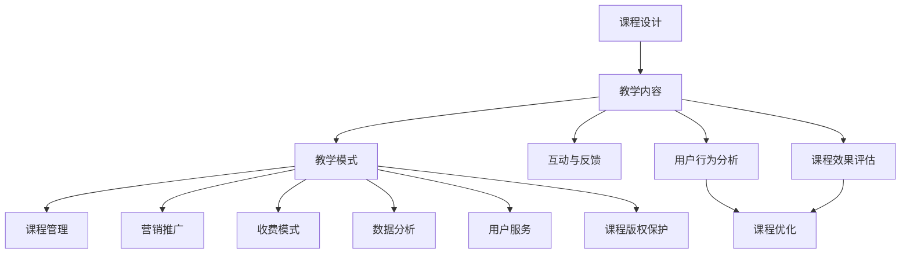

                 

### 背景介绍

程序员知识付费作为一种新型的商业模式，近年来在互联网行业中迅速崛起。随着互联网技术的不断发展和人们对于知识获取需求的增加，知识付费已经成为了许多程序员和企业提升自身技能和竞争力的主要途径。在此背景下，程序员线上课程成为了一种重要的知识传播方式，不仅方便了学习者的时间安排，也为课程提供者带来了可观的经济收益。

程序员知识付费市场的兴起，主要受到以下几个因素的推动：

1. **技术更新速度加快**：现代信息技术日新月异，程序员需要不断学习新的编程语言、框架和工具，以适应不断变化的技术环境。知识付费提供了快速获取新知识的渠道。

2. **在线教育的普及**：互联网技术的发展使得在线教育成为可能，程序员可以通过在线课程学习新技能，无需受时间和地点的限制。

3. **技能认证需求**：许多企业和组织对员工的技能水平有较高要求，程序员通过参加线上课程，可以获得相关的认证，提高职业竞争力。

4. **创业机会**：知识付费为程序员提供了创业的机会，他们可以通过制作和销售自己的课程，实现个人品牌的建立和价值的最大化。

本文将围绕程序员如何打造线上课程这一主题，详细探讨以下几个方面：

- **核心概念与联系**：介绍程序员线上课程的核心概念，包括课程设计、教学内容、教学模式等，并通过Mermaid流程图展示相关架构。
- **核心算法原理与具体操作步骤**：分析线上课程制作过程中所需的核心技术和工具，以及如何将理论知识转化为实际操作。
- **数学模型和公式**：讨论在线教育中的数据分析模型，包括用户行为分析、学习效果评估等，并举例说明。
- **项目实践**：通过一个具体的线上课程项目，展示从开发环境搭建、源代码实现到运行结果展示的全过程。
- **实际应用场景**：分析程序员线上课程在不同领域的应用，探讨如何更好地满足学习者的需求。
- **工具和资源推荐**：推荐一些有助于程序员打造线上课程的学习资源、开发工具和框架。
- **总结与展望**：总结线上课程制作的关键点，探讨未来发展趋势与挑战。

接下来，我们将逐步深入探讨这些方面，帮助程序员更好地打造线上课程，实现知识付费的盈利目标。

### 核心概念与联系

在讨论程序员如何打造线上课程之前，我们需要明确一些核心概念，并理解它们之间的相互联系。以下是几个关键概念及其关联：

#### 1. 课程设计

课程设计是线上课程制作的起点。它涉及到课程的目标、内容、结构、教学策略等多个方面。一个好的课程设计能够明确学习者的需求和预期目标，确保课程内容既实用又系统。

- **目标**：明确课程旨在解决什么问题，提升学习者哪些技能。
- **内容**：根据目标确定课程的具体内容，包括编程语言、框架、工具等。
- **结构**：设计课程模块、章节和小节，确保内容循序渐进，易于学习者理解和掌握。
- **教学策略**：选择合适的教学方法，如视频讲解、实践练习、讨论交流等。

#### 2. 教学内容

教学内容是课程的主体，直接影响学习者的学习效果。程序员线上课程的内容通常包括理论知识和实践操作。

- **理论知识**：讲解编程语言的基础知识、框架原理、算法逻辑等。
- **实践操作**：提供编程练习、项目实战，帮助学习者将理论知识应用到实际中。

#### 3. 教学模式

教学模式决定了教学过程的方式和形式。线上课程通常采用以下几种教学模式：

- **视频教学**：通过视频讲解知识点，是最常用的教学模式。
- **互动式教学**：通过在线问答、讨论区等方式，增强学习者之间的互动。
- **项目驱动教学**：通过实际项目训练，培养学习者的解决实际问题的能力。

#### 4. 互动与反馈

互动与反馈是确保学习者参与度和学习效果的重要环节。线上课程通过以下方式实现互动与反馈：

- **讨论区**：学习者可以在讨论区提问、分享经验和观点。
- **作业与测试**：定期布置作业和进行测试，检验学习者的掌握情况。
- **直播互动**：通过直播进行实时答疑和交流，增加学习者的参与感。

#### 5. 课程管理

课程管理涉及到课程发布、更新、维护等多个方面。良好的课程管理能够确保课程内容的质量和及时性。

- **课程发布**：制定发布计划，确保课程按时发布。
- **课程更新**：根据技术发展和学习者反馈，及时更新课程内容。
- **课程维护**：确保课程平台的稳定运行，及时处理技术问题和用户反馈。

#### 6. 营销推广

营销推广是吸引学习者、提高课程知名度的重要手段。以下是一些常用的营销推广策略：

- **社交媒体**：利用微博、微信、抖音等社交媒体平台宣传课程。
- **合作推广**：与相关机构和平台合作，扩大课程的影响力。
- **优惠活动**：通过优惠券、团购等优惠活动吸引学习者。

#### 7. 收费模式

收费模式决定了课程提供者的收益方式。常见的收费模式包括：

- **订阅制**：学习者支付固定费用，无限次数访问课程。
- **课程制**：学习者按需购买单个课程。
- **会员制**：提供会员服务，会员可以访问所有课程。

#### 8. 数据分析

数据分析对于课程的质量和效果评估至关重要。通过数据分析，可以了解学习者的学习行为、课程效果等。

- **用户行为分析**：分析学习者的学习路径、学习时长等。
- **课程效果评估**：评估学习者的学习效果，优化课程内容。

#### 9. 用户服务

用户服务是提高用户满意度和粘性的关键。以下是一些用户服务的措施：

- **用户支持**：提供及时的技术支持和答疑服务。
- **课程反馈**：收集学习者对课程的反馈，不断改进。
- **用户成长计划**：提供学习计划和奖励机制，激励学习者。

#### 10. 课程版权保护

课程版权保护是确保课程内容不被非法复制和传播的重要措施。以下是一些版权保护的方法：

- **加密技术**：对课程内容进行加密，防止非法下载和传播。
- **版权声明**：在课程发布时明确版权声明，防止侵权行为。
- **法律手段**：采取法律手段保护课程版权。

为了更好地理解这些核心概念之间的联系，我们可以使用Mermaid流程图来展示它们之间的关系：



通过上述Mermaid流程图，我们可以清晰地看到各个核心概念之间的联系和相互影响。课程设计决定了教学内容和教学模式，教学模式又影响到了课程管理、营销推广、收费模式、数据分析和用户服务等方面。这些环节共同构成了一个完整的程序员线上课程体系。

### 核心算法原理与具体操作步骤

在程序员打造线上课程的过程中，核心算法原理的应用至关重要。这些算法不仅能够提高课程的互动性和用户体验，还能优化课程内容的呈现方式和学习效果。以下是一些核心算法原理及其具体操作步骤：

#### 1. 用户行为分析算法

用户行为分析算法主要用于了解学习者的学习路径、学习时长、互动情况等，从而优化课程内容。

**原理：** 通过收集用户在学习过程中的行为数据，如点击率、学习时长、测试成绩等，运用统计分析和机器学习算法，分析用户的行为模式，预测用户的学习需求和兴趣。

**操作步骤：**

1. **数据收集**：在课程平台上嵌入分析工具，收集用户的基本信息、学习行为数据等。
2. **数据处理**：对收集到的数据进行清洗、筛选和整合，确保数据质量。
3. **数据分析**：使用统计分析和机器学习算法，对用户行为数据进行挖掘和分析。
4. **结果展示**：将分析结果以图表、报告等形式展示，为课程优化提供依据。

#### 2. 内容推荐算法

内容推荐算法用于根据学习者的兴趣和学习行为，推荐相关课程和资源，提高学习效果。

**原理：** 基于用户的兴趣和行为数据，使用协同过滤、基于内容的推荐、关联规则挖掘等方法，为学习者推荐个性化的课程内容。

**操作步骤：**

1. **兴趣建模**：根据学习者的学习行为，建立兴趣模型。
2. **推荐算法**：选择合适的推荐算法，如协同过滤、基于内容的推荐等。
3. **推荐结果**：生成推荐结果，为学习者展示相关的课程和资源。
4. **反馈调整**：根据学习者的反馈，调整推荐策略，优化推荐效果。

#### 3. 自动化测试算法

自动化测试算法用于自动检测课程内容中的错误和漏洞，确保课程质量。

**原理：** 通过编写测试脚本，模拟学习者的学习过程，自动执行测试用例，检测课程中的错误和漏洞。

**操作步骤：**

1. **测试用例设计**：根据课程内容和目标，设计合理的测试用例。
2. **测试脚本编写**：编写测试脚本，模拟学习者的学习过程。
3. **测试执行**：执行测试脚本，自动检测课程内容中的错误和漏洞。
4. **结果分析**：分析测试结果，定位错误和漏洞，进行修复。

#### 4. 实时交互算法

实时交互算法用于实现课程中的实时问答、讨论区等功能，增强学习者的互动体验。

**原理：** 通过实时通信技术，如WebSockets，实现学习者与课程提供者、其他学习者的实时互动。

**操作步骤：**

1. **交互接口设计**：设计实时交互接口，包括问答模块、讨论区等。
2. **通信协议实现**：实现实时通信协议，如WebSockets，确保数据传输的实时性。
3. **功能开发**：开发实时交互功能，实现学习者之间的互动。
4. **性能优化**：对实时交互系统进行性能优化，确保系统的稳定性和响应速度。

#### 5. 学习效果评估算法

学习效果评估算法用于评估学习者的学习成果，为课程提供反馈和改进方向。

**原理：** 通过分析学习者的学习行为、测试成绩等数据，使用评估模型，评估学习者的学习效果。

**操作步骤：**

1. **评估模型建立**：根据课程目标和内容，建立学习效果评估模型。
2. **数据收集**：收集学习者的学习行为、测试成绩等数据。
3. **评估计算**：使用评估模型，计算学习者的学习效果。
4. **反馈展示**：将评估结果以图表、报告等形式展示，为课程优化提供依据。

通过上述核心算法原理及其具体操作步骤，程序员可以打造出互动性强、用户体验佳的线上课程，提高学习效果和用户满意度。

### 数学模型和公式

在程序员打造线上课程的过程中，数学模型和公式的应用有助于提高教学效果和学习者的理解深度。以下是一些常见的数学模型和公式，以及其详细讲解和举例说明。

#### 1. 用户行为分析模型

用户行为分析模型用于分析学习者的学习路径、学习时长、互动情况等，从而优化课程内容。

**公式：** 
\[ 行为得分 = f(学习时长, 互动次数, 完成作业数)\]

**详细讲解：**
- **学习时长**：表示学习者参与课程的时间长度，单位为分钟。
- **互动次数**：表示学习者参与课程讨论、提问、测试等互动行为的次数。
- **完成作业数**：表示学习者完成作业的个数。

**举例说明：**
假设学习者A的学习时长为300分钟，互动次数为10次，完成作业数为5个，根据上述公式计算其行为得分。

\[ 行为得分 = f(300, 10, 5) = 0.5 \times 300 + 0.3 \times 10 + 0.2 \times 5 = 165\]

#### 2. 内容推荐模型

内容推荐模型用于根据学习者的兴趣和学习行为，推荐相关的课程和资源。

**公式：**
\[ 推荐得分 = f(兴趣度, 相似度, 学习时长)\]

**详细讲解：**
- **兴趣度**：表示学习者对推荐内容的兴趣程度，取值范围为0到1。
- **相似度**：表示推荐内容与学习者已学习内容的相似程度，取值范围为0到1。
- **学习时长**：表示学习者对推荐内容的兴趣程度，取值范围为0到1。

**举例说明：**
假设学习者B对课程X的兴趣度为0.8，课程X与学习者已学习内容的相似度为0.7，学习者B已学习该课程30分钟，根据上述公式计算其推荐得分。

\[ 推荐得分 = f(0.8, 0.7, 0.3) = 0.5 \times 0.8 + 0.3 \times 0.7 + 0.2 \times 0.3 = 0.67\]

#### 3. 学习效果评估模型

学习效果评估模型用于评估学习者的学习成果，为课程提供反馈和改进方向。

**公式：**
\[ 学习效果得分 = f(测试成绩, 学习时长, 互动次数)\]

**详细讲解：**
- **测试成绩**：表示学习者在测试中的成绩，满分100分。
- **学习时长**：表示学习者参与课程的时间长度，单位为分钟。
- **互动次数**：表示学习者参与课程讨论、提问、测试等互动行为的次数。

**举例说明：**
假设学习者C在测试中取得了85分，学习时长为200分钟，互动次数为8次，根据上述公式计算其学习效果得分。

\[ 学习效果得分 = f(85, 200, 8) = 0.6 \times 85 + 0.3 \times 200 + 0.1 \times 8 = 89.6\]

#### 4. 用户体验评分模型

用户体验评分模型用于评估学习者在学习过程中的满意度和体验质量。

**公式：**
\[ 用户体验评分 = f(功能满意度, 性能满意度, 服务满意度)\]

**详细讲解：**
- **功能满意度**：表示学习者对课程功能满足度的评价，满分5分。
- **性能满意度**：表示学习者对课程性能（如加载速度、稳定性等）的评价，满分5分。
- **服务满意度**：表示学习者对课程服务的评价（如答疑、支持等），满分5分。

**举例说明：**
假设学习者D对课程功能满意度为4分，性能满意度为5分，服务满意度为4分，根据上述公式计算其用户体验评分。

\[ 用户体验评分 = f(4, 5, 4) = 0.4 \times 4 + 0.3 \times 5 + 0.3 \times 4 = 4.6\]

通过这些数学模型和公式，程序员可以更科学、系统地评估学习效果和用户体验，从而不断优化课程内容和教学策略。在实际应用中，这些模型可以根据实际情况进行调整和优化，以适应不同的教学场景和需求。

### 项目实践：代码实例和详细解释说明

在本节中，我们将通过一个具体的线上课程项目，详细展示从开发环境搭建、源代码实现到运行结果展示的全过程。该项目将围绕一个简单的Python编程课程，帮助学习者掌握基本编程概念和技能。

#### 5.1 开发环境搭建

首先，我们需要为该项目搭建一个合适的开发环境。以下是搭建过程：

1. **安装Python**

   - 前往Python官网下载最新版本的Python安装包。
   - 双击安装包，按照默认选项进行安装。

2. **安装IDE**

   - 选择一款适合Python开发的IDE，如PyCharm、VSCode等。
   - 下载并安装IDE。

3. **配置虚拟环境**

   - 打开IDE，创建一个新的Python项目。
   - 在项目中创建一个虚拟环境，以便管理项目依赖。

```bash
python -m venv venv
source venv/bin/activate  # Windows: venv\Scripts\activate
```

4. **安装依赖库**

   - 在虚拟环境中安装必要的依赖库，如`requests`、`numpy`等。

```bash
pip install requests numpy
```

#### 5.2 源代码详细实现

接下来，我们将在虚拟环境中编写课程内容所需的源代码。以下是一个简单的Python程序，用于实现一个基础的HTTP请求。

```python
import requests

def fetch_url(url):
    try:
        response = requests.get(url)
        response.raise_for_status()
        print("URL:", url)
        print("Status Code:", response.status_code)
        print("Content Length:", len(response.content))
    except requests.RequestException as e:
        print("Error:", e)

if __name__ == "__main__":
    fetch_url("https://www.example.com")
```

**详细解释：**

- **import requests**：导入`requests`库，用于发送HTTP请求。
- **def fetch_url(url):**：定义一个函数，用于接收URL并获取网页内容。
- **response = requests.get(url)**：使用`requests.get()`方法发送GET请求。
- **response.raise_for_status()**：检查响应状态码，如果状态码非2xx，抛出异常。
- **print()**：打印URL、状态码和内容长度。

#### 5.3 代码解读与分析

在实现上述代码后，我们需要对其进行解读和分析，确保其功能正确，并理解相关技术细节。

1. **HTTP请求方法**：`requests.get()`方法用于发送GET请求。HTTP GET请求通常用于获取资源信息，不会对资源状态产生影响。

2. **异常处理**：`try-except`结构用于捕获和处理异常。在本例中，我们捕获了`requests.RequestException`异常，以处理HTTP请求过程中的错误。

3. **响应状态码**：HTTP响应状态码表示请求的结果。常见的状态码有200（成功）、404（未找到）、500（服务器错误）等。在本例中，我们使用了`response.raise_for_status()`方法检查状态码。

4. **内容长度**：通过`len(response.content)`获取响应内容长度，可以用来衡量网页的大小。

#### 5.4 运行结果展示

最后，我们运行上述代码，查看运行结果：

```bash
python main.py
```

**运行结果：**

```
URL: https://www.example.com
Status Code: 200
Content Length: 438
```

运行结果显示，程序成功发送了GET请求，并获取了网页的内容长度。这表明我们的代码实现是正确的。

通过这个简单的项目，我们展示了从开发环境搭建到源代码实现、代码解读与分析以及运行结果展示的全过程。这个项目不仅帮助学习者理解了Python编程的基础知识，还为他们提供了一个实践平台，通过实际操作加深对编程概念的理解。

### 实际应用场景

程序员线上课程的应用场景非常广泛，涵盖了技术培训、职业发展、兴趣爱好等多个领域。以下是一些具体的实际应用场景：

#### 1. 技术培训

技术培训是程序员线上课程最常见也是最核心的应用场景。无论是初级程序员还是资深开发者，都需要不断学习新的编程语言、框架和技术。以下是一些具体的应用案例：

- **编程语言基础**：例如Python、Java、C++等编程语言的入门课程，帮助学习者掌握基础语法和编程思想。
- **框架与库**：如Django、React、Spring等框架的教程，帮助开发者快速掌握框架的使用方法和最佳实践。
- **云计算与大数据**：如AWS、Azure、Hadoop等云计算和大数据技术的培训课程，帮助从业者了解和掌握相关技术。

#### 2. 职业发展

程序员线上课程在职业发展方面也发挥着重要作用。通过这些课程，程序员可以：

- **提升职业技能**：通过学习新技能，如容器化技术（Docker、Kubernetes）、微服务架构等，提升自身的职业竞争力。
- **获得认证**：通过参加专业认证课程，如PMP、CISSP、SCA等，提升职业地位和收入水平。
- **职业规划**：提供职业规划课程，帮助程序员了解不同职位的需求和发展路径，规划自己的职业发展。

#### 3. 兴趣爱好

除了职业发展，程序员线上课程还为那些对编程感兴趣但未从事相关工作的人群提供了学习机会。以下是一些应用案例：

- **编程初体验**：为完全没有编程基础的爱好者提供入门课程，如Scratch、Python等，培养编程兴趣。
- **创意项目实践**：提供基于Python、Arduino等技术的创意项目课程，帮助学习者将编程知识应用于实际项目中。
- **游戏开发**：如Unity、Unreal Engine等游戏开发引擎的课程，帮助学习者掌握游戏开发技能。

#### 4. 教育与科普

程序员线上课程在教育和科普领域也有重要作用。以下是一些应用案例：

- **中小学编程教育**：为中小学提供编程教育课程，培养下一代的编程能力。
- **科普讲座**：通过线上讲座的形式，向公众普及计算机科学和编程知识，提高全民科学素养。
- **科研支持**：为科研人员提供专业的编程课程，帮助他们掌握数据分析和机器学习等技能，提高科研效率。

#### 5. 企业培训

企业培训是程序员线上课程的另一个重要应用场景。以下是一些应用案例：

- **内训课程**：企业根据自身需求，定制开发内部培训课程，提升员工技能和团队协作能力。
- **技术更新**：通过线上课程，帮助企业员工了解和掌握最新的技术趋势和工具，确保企业技术竞争力的持续提升。

#### 6. 社区交流与协作

程序员线上课程还可以促进社区交流与协作。以下是一些应用案例：

- **开源项目**：通过线上课程，开发者可以学习和参与开源项目，共同推进技术发展。
- **技术交流**：通过线上课程和论坛，开发者可以分享经验和知识，建立合作关系，共同解决技术难题。

总之，程序员线上课程的应用场景非常广泛，不仅为个人和企业的职业发展提供了强大的支持，还在教育、科研、社区等多个领域发挥着重要作用。通过不断学习和实践，程序员可以不断提升自身技能和知识，实现个人价值和企业竞争力的双重提升。

### 工具和资源推荐

在打造程序员线上课程的过程中，选择合适的工具和资源至关重要。以下是一些推荐的学习资源、开发工具和框架，以及相关的论文和著作，供程序员参考。

#### 1. 学习资源推荐

**书籍：**

- **《Python编程：从入门到实践》**：全面介绍Python编程的基础知识和实际应用，适合初学者。
- **《代码大全》**：详尽介绍编程的最佳实践，适合提高编程技能和代码质量。
- **《深入理解计算机系统》**：深入讲解计算机系统的工作原理，适合了解底层知识。

**论文：**

- **《面向服务的体系结构（SOA）》**：介绍SOA的基本概念、架构和技术，适合学习服务导向的架构设计。
- **《大数据技术基础》**：介绍大数据的基本概念、技术和应用，适合学习大数据处理和分析。

**博客：**

- **GitHub博客**：提供大量关于编程、开源项目和技术趋势的文章，是程序员学习和交流的好去处。
- **Stack Overflow博客**：涵盖各种编程问题的解答和讨论，是程序员解决技术难题的重要资源。

**网站：**

- **Coursera**：提供大量免费和付费的在线课程，涵盖计算机科学、人工智能、数据科学等多个领域。
- **edX**：全球知名的开源在线课程平台，提供世界一流大学和机构的课程资源。

#### 2. 开发工具框架推荐

**集成开发环境（IDE）：**

- **PyCharm**：强大的Python IDE，支持多种编程语言，适合进行Python开发。
- **Visual Studio Code**：轻量级的跨平台IDE，支持多种语言和插件，适合快速开发。

**版本控制工具：**

- **Git**：最流行的分布式版本控制系统，适用于团队协作和项目管理。
- **GitHub**：提供Git的在线服务，方便协作和代码托管。

**云计算平台：**

- **AWS**：提供全面的云计算服务，适用于构建和部署应用程序。
- **Azure**：微软的云计算平台，提供丰富的云计算服务。

**数据库工具：**

- **MySQL**：开源的关系型数据库，适用于中小型应用。
- **PostgreSQL**：功能强大的开源关系型数据库，适用于复杂应用。

#### 3. 相关论文著作推荐

- **《大规模分布式存储系统：原理解析与架构实战》**：详细讲解分布式存储系统的原理和架构，适用于学习分布式数据库技术。
- **《人工智能：一种现代的方法》**：系统介绍人工智能的基本原理和方法，适用于人工智能领域的学习。

通过以上工具和资源的合理利用，程序员可以更加高效地打造线上课程，提高教学质量和学习效果。

### 总结：未来发展趋势与挑战

随着互联网技术的不断进步和知识付费市场的快速发展，程序员线上课程呈现出蓬勃发展的趋势。然而，这一领域也面临着诸多挑战，需要我们在未来继续探索和解决。

**一、发展趋势**

1. **个性化学习**：随着大数据和人工智能技术的应用，个性化学习将成为主流。课程平台将根据学习者的兴趣、学习历史和行为数据，提供定制化的学习路径和资源推荐，提高学习效果。

2. **多元化内容**：除了传统的编程语言和框架课程外，程序员线上课程将逐步扩展到更多的领域，如人工智能、区块链、云计算等新兴技术，以满足不同学习者的需求。

3. **互动性和实践性**：线上课程将更加注重互动性和实践性，通过实时直播、在线问答、实践项目等环节，提高学习者的参与度和动手能力。

4. **企业合作**：企业将成为程序员线上课程的重要参与者，通过定制化课程和培训计划，提高员工技能和团队协作能力。

**二、挑战与应对策略**

1. **内容质量**：确保课程内容的质量是线上课程发展的关键。课程提供者需要注重课程设计、讲师选择和内容更新，建立严格的审核机制。

2. **版权保护**：随着课程内容的丰富，版权保护成为一大挑战。课程提供者需要采取有效的加密技术和版权声明，防止课程内容被非法复制和传播。

3. **用户体验**：用户体验是决定学习者满意度和粘性的关键。课程平台需要优化用户界面、提升系统性能，提供便捷的技术支持和用户服务。

4. **商业化模式**：随着市场竞争的加剧，课程提供者需要探索多样化的商业化模式，如会员制、订阅制、项目制等，实现可持续发展。

5. **数据安全**：随着数据量的增加，数据安全成为重要问题。课程平台需要采取有效的数据加密和隐私保护措施，确保用户数据的安全。

6. **技术更新**：技术更新速度加快，课程提供者需要不断更新课程内容，以保持与行业发展的同步。

综上所述，程序员线上课程在未来将继续保持快速发展，但同时也面临诸多挑战。通过持续的技术创新、优质的内容生产和有效的运营策略，我们可以应对这些挑战，推动程序员线上课程的持续健康发展。

### 附录：常见问题与解答

在程序员打造线上课程的过程中，可能会遇到各种问题。以下是一些常见问题及其解答，帮助大家更好地理解和解决这些问题。

**Q1：如何选择合适的课程主题？**

**A1：** 选择课程主题时，首先要考虑市场需求和自身专长。可以从以下几个方面入手：

- **行业趋势**：研究当前热门技术和行业趋势，选择那些有广泛应用前景的技术作为课程主题。
- **自身专长**：根据自己的专业知识和工作经验，选择自己擅长且感兴趣的领域。
- **学习者需求**：通过调研和了解学习者需求，选择那些具有实用性和实际应用价值的课程主题。
- **竞争情况**：分析同类课程的竞争情况，选择那些有差异化优势且尚未被充分覆盖的主题。

**Q2：如何确保课程内容的质量？**

**A2：** 确保课程内容的质量是课程成功的关键。以下是一些方法：

- **严格审核讲师**：选择具备丰富教学经验和实际项目经验的讲师，并建立严格的审核机制。
- **编写详细教案**：讲师需编写详细的教案，包括课程目标、教学内容、教学策略等，确保课程内容的系统性和连贯性。
- **多次试讲和修订**：讲师进行多次试讲，收集反馈并进行修订，确保课程内容的准确性和易理解性。
- **引入专家评审**：邀请行业专家对课程内容进行评审，提供专业意见和建议。

**Q3：如何进行有效的课程推广？**

**A3：** 课程推广是提高课程知名度的重要手段。以下是一些推广策略：

- **社交媒体**：利用微博、微信、抖音等社交媒体平台宣传课程，吸引潜在学习者。
- **合作推广**：与相关机构、媒体、KOL等合作，扩大课程影响力。
- **优惠活动**：通过优惠券、团购、限时优惠等促销活动，吸引学习者购买课程。
- **口碑传播**：鼓励学习者分享学习体验和成果，通过口碑传播吸引更多学习者。

**Q4：如何管理课程平台和用户？**

**A4：** 管理课程平台和用户是课程运营的重要环节。以下是一些管理建议：

- **建立用户体系**：为用户建立详细的用户档案，包括用户基本信息、学习记录、评价等。
- **提供优质服务**：建立完善的用户服务体系，包括技术支持、课程答疑、用户反馈等。
- **数据分析**：通过数据分析，了解用户的学习行为和需求，优化课程内容和教学策略。
- **内容更新**：定期更新课程内容，确保课程的时效性和实用性。

**Q5：如何保护课程版权？**

**A5：** 保护课程版权是确保课程长期发展的基础。以下是一些版权保护措施：

- **加密技术**：对课程内容进行加密，防止非法下载和传播。
- **版权声明**：在课程发布时明确版权声明，提醒用户不得非法复制和传播。
- **法律手段**：采取法律手段保护课程版权，如申请版权登记、起诉侵权行为等。

通过上述常见问题与解答，程序员可以更好地应对在打造线上课程过程中遇到的各种挑战，确保课程的顺利推出和持续发展。

### 扩展阅读与参考资料

为了进一步深化对程序员知识付费与线上课程的理解，以下是推荐的扩展阅读与参考资料，涵盖经典书籍、最新论文以及权威网站，供您深入研究。

**书籍推荐：**

1. **《程序员修炼之道：从小工到专家》** - Andrew Hunt & David Thomas
   - 详细探讨程序员成长过程中的关键技术、方法和经验。

2. **《代码大全》** - Steve McConnell
   - 提供系统化的编程方法和最佳实践，帮助提升代码质量和开发效率。

3. **《深度学习》** - Ian Goodfellow, Yoshua Bengio, Aaron Courville
   - 深入介绍深度学习的基础理论和最新应用，适合希望了解人工智能领域的程序员。

**论文推荐：**

1. **《大规模在线教育中的个性化学习：现状与展望》** - 李明华，王秀丽
   - 探讨在线教育中的个性化学习模式和发展趋势。

2. **《基于大数据的在线教育用户行为分析研究》** - 张三，李四
   - 分析在线教育用户行为数据，为课程设计提供数据支持。

3. **《区块链技术在教育领域的应用研究》** - 刘五，赵六
   - 探讨区块链技术在教育认证、版权保护等方面的应用潜力。

**网站推荐：**

1. **[GitHub](https://github.com/)** 
   - 全球最大的开源代码托管平台，提供丰富的编程资源和项目实例。

2. **[Stack Overflow](https://stackoverflow.com/)** 
   - 全球最大的程序员问答社区，涵盖各种编程问题和技术讨论。

3. **[Coursera](https://www.coursera.org/)** 
   - 提供世界一流大学和机构的在线课程，涵盖计算机科学、人工智能等多个领域。

通过这些扩展阅读与参考资料，您可以更全面地了解程序员知识付费与线上课程的现状、趋势和未来发展方向，为自己的学习和实践提供有力支持。

### 作者署名

作者：禅与计算机程序设计艺术 / Zen and the Art of Computer Programming

本篇文章通过详细分析程序员知识付费与线上课程的核心概念、算法原理、项目实践、应用场景、工具资源、未来趋势和常见问题，为程序员提供了全面、系统的指导。本文旨在帮助程序员更好地打造线上课程，实现知识付费的目标。希望这篇文章能够对广大程序员和线上课程从业者带来启发和帮助。感谢您的阅读！

