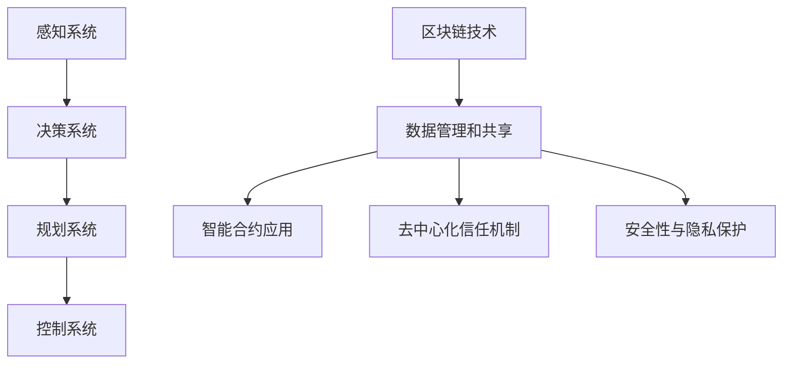

                 

### 背景介绍

#### 1. 端到端自动驾驶技术简介

端到端自动驾驶技术是指车辆通过整合感知、决策、规划、控制等模块，实现自主导航和驾驶的技术。其核心在于利用深度学习等先进的人工智能算法，使车辆能够在复杂多变的道路环境中进行自主驾驶。

近年来，随着计算机视觉、自然语言处理、传感器融合等技术的不断发展，端到端自动驾驶技术取得了显著的进展。特斯拉、谷歌、百度等公司纷纷推出了各自的自动驾驶解决方案，其中最具代表性的便是特斯拉的“全自动驾驶系统（FSD）”和百度的“阿波罗计划”。

#### 2. 区块链技术在自动驾驶领域的应用背景

区块链技术作为一种分布式账本技术，具有去中心化、不可篡改、透明性高等特点。近年来，随着其在金融、物流、医疗等领域的广泛应用，区块链技术在自动驾驶领域的应用也逐渐受到关注。

在自动驾驶领域，区块链技术可以提供以下几方面的应用价值：

1. **数据安全和隐私保护**：自动驾驶车辆在行驶过程中会产生大量的传感器数据，如GPS位置、车速、方向盘角度等。这些数据涉及到用户隐私和车辆安全，利用区块链技术可以实现数据的安全存储和传输，确保数据不被恶意篡改。

2. **去中心化的信任机制**：自动驾驶系统中涉及多个参与方，如车辆制造商、交通管理部门、保险公司等。区块链技术可以通过去中心化的方式建立信任机制，降低因信息不对称导致的纠纷和成本。

3. **智能合约应用**：区块链中的智能合约可以在满足特定条件时自动执行，如自动驾驶车辆之间的交通协调、车辆保险理赔等。这有助于提高自动驾驶系统的效率，降低人工干预的成本。

4. **自动驾驶网络协同**：区块链技术可以实现自动驾驶车辆之间的信息共享和协同，提高整体交通系统的智能化水平。

#### 3. 端到端自动驾驶与区块链技术结合的重要性

端到端自动驾驶与区块链技术的结合具有以下几个重要意义：

1. **提升自动驾驶系统的安全性**：区块链技术可以确保自动驾驶车辆的数据安全，防止数据泄露和篡改，从而提高自动驾驶系统的整体安全性。

2. **优化自动驾驶系统的效率**：通过去中心化的信任机制和智能合约应用，可以提高自动驾驶系统的协调效率，减少人工干预，降低运营成本。

3. **促进自动驾驶产业的创新**：区块链技术为自动驾驶领域提供了新的应用场景，有助于推动自动驾驶技术的创新和发展。

4. **构建智能交通生态系统**：端到端自动驾驶与区块链技术的结合，可以为交通管理、智能出行等领域提供全新的解决方案，推动智慧交通生态系统的建设。

综上所述，端到端自动驾驶与区块链技术的结合具有巨大的应用潜力，有望成为未来自动驾驶技术发展的重要方向。在接下来的章节中，我们将深入探讨端到端自动驾驶中区块链技术的核心概念与联系，以及具体的算法原理和操作步骤。### 2. 核心概念与联系

#### 2.1. 端到端自动驾驶技术

端到端自动驾驶技术是一种基于深度学习的人工智能技术，它通过训练大量的图像和交通数据，使自动驾驶系统能够在复杂的道路环境中进行自主驾驶。该技术主要包括以下几个核心概念：

1. **感知系统**：感知系统是自动驾驶技术的核心，它利用多种传感器（如摄像头、激光雷达、超声波传感器等）获取车辆周围的环境信息，如道路标志、交通信号灯、行人和其他车辆等。

2. **决策系统**：决策系统根据感知系统提供的环境信息，通过分析道路规则、交通状况和行驶目标，制定出合适的驾驶策略。

3. **规划系统**：规划系统负责将决策系统的驾驶策略转化为具体的行动步骤，如加速、减速、转向等。

4. **控制系统**：控制系统根据规划系统的指令，通过控制车辆的动力系统、转向系统和制动系统，实现自动驾驶。

#### 2.2. 区块链技术

区块链技术是一种分布式账本技术，它通过加密算法和数据结构，确保数据的不可篡改性和安全性。区块链技术主要包括以下几个核心概念：

1. **分布式账本**：区块链通过多个节点维护一个共享的分布式账本，账本记录了所有的交易记录和信息。

2. **加密算法**：区块链使用加密算法确保数据的隐私和安全，使得交易记录只能在授权的情况下进行读取和修改。

3. **共识算法**：共识算法是区块链网络中节点达成一致的重要机制，它确保所有节点都认可同一版本的账本。

4. **智能合约**：智能合约是区块链中的一个重要概念，它是一种在满足特定条件时自动执行的程序，可以用于自动化交易、支付、管理等操作。

#### 2.3. 端到端自动驾驶与区块链技术的联系

端到端自动驾驶与区块链技术的结合，主要是通过将区块链技术应用于自动驾驶系统的各个环节，以提升系统的安全性和效率。以下是一些具体的应用场景：

1. **数据管理和共享**：区块链技术可以用于管理和共享自动驾驶车辆产生的海量数据，如感知数据、决策数据和规划数据。通过分布式账本，数据可以在不同节点之间安全、可靠地进行传输和共享，同时确保数据的完整性和隐私性。

2. **智能合约应用**：在自动驾驶系统中，智能合约可以用于自动化执行某些操作，如交通协调、事故理赔等。当车辆在道路上遇到特定的交通状况时，智能合约可以根据预设的规则自动执行相应的操作，提高自动驾驶系统的响应速度和准确性。

3. **去中心化信任机制**：区块链技术可以为自动驾驶系统中的各个参与方提供去中心化的信任机制。例如，在自动驾驶车辆与交通管理部门、保险公司等之间的信息交互中，区块链可以确保信息的真实性和一致性，降低信息不对称带来的风险。

4. **安全性与隐私保护**：区块链技术通过加密算法和分布式账本，可以有效保护自动驾驶车辆的数据安全，防止数据泄露和篡改。这对于确保自动驾驶车辆的安全性和用户隐私具有重要意义。

#### 2.4. Mermaid 流程图

为了更好地展示端到端自动驾驶与区块链技术的联系，我们使用 Mermaid 流程图进行说明。以下是一个简化的 Mermaid 流程图：



在这个流程图中，端到端自动驾驶技术的各个环节（感知系统、决策系统、规划系统、控制系统）与区块链技术的应用（数据管理和共享、智能合约应用、去中心化信任机制、安全性与隐私保护）通过连线进行连接，展示了两者之间的紧密联系。

通过上述核心概念与联系的介绍，我们可以看到端到端自动驾驶与区块链技术的结合具有巨大的潜力，有望为自动驾驶领域带来革命性的变革。在接下来的章节中，我们将深入探讨端到端自动驾驶中区块链技术的核心算法原理和具体操作步骤。### 3. 核心算法原理 & 具体操作步骤

#### 3.1. 数据采集与预处理

在端到端自动驾驶中，数据采集是至关重要的环节。自动驾驶车辆通过各种传感器（如摄像头、激光雷达、超声波传感器等）收集环境数据。这些数据通常包括图像、GPS位置、速度、方向盘角度等。

1. **数据采集**：
   - **摄像头**：用于捕捉道路、交通标志、行人和其他车辆等信息。
   - **激光雷达**：用于获取车辆周围的三维点云数据，用于精确地感知车辆位置和周围环境。
   - **GPS**：用于确定车辆的地理位置。
   - **速度传感器**：用于测量车辆的速度。
   - **方向盘角度传感器**：用于测量车辆方向盘的角度。

2. **数据预处理**：
   - **数据清洗**：去除无效、错误或不完整的数据。
   - **数据增强**：通过缩放、旋转、裁剪等方法，增加数据多样性，提高模型泛化能力。
   - **数据归一化**：将不同类型的数据进行归一化处理，使其在相同的尺度范围内，便于模型训练。

#### 3.2. 深度学习模型训练

深度学习是端到端自动驾驶技术的核心，通过训练大量的图像和交通数据，使模型能够自主地理解和处理道路环境。

1. **模型选择**：
   - **卷积神经网络（CNN）**：用于图像识别和特征提取。
   - **循环神经网络（RNN）**：用于处理序列数据，如时间序列数据。
   - **长短时记忆网络（LSTM）**：是 RNN 的一个变种，能够更好地处理长序列数据。
   - **生成对抗网络（GAN）**：用于生成与真实数据相似的伪造数据，提高数据多样性。

2. **模型训练**：
   - **输入数据**：将预处理后的数据作为输入，输入可以是图像、点云数据、GPS数据等。
   - **损失函数**：用于衡量模型预测值与真实值之间的差距，如交叉熵损失函数、均方误差损失函数等。
   - **优化算法**：如梯度下降（GD）、随机梯度下降（SGD）、Adam 等，用于调整模型参数，降低损失函数值。
   - **训练过程**：通过迭代优化模型参数，使模型能够更好地理解和处理道路环境。

#### 3.3. 智能合约设计

智能合约是区块链技术在自动驾驶领域的重要应用，通过智能合约，可以实现自动化执行某些操作，提高自动驾驶系统的效率。

1. **智能合约选择**：
   - **Solidity**：是以太坊区块链中最常用的智能合约编程语言。
   - **Rust**：是一种系统级编程语言，具有高性能和安全性，适用于编写区块链智能合约。

2. **智能合约设计**：
   - **合约初始化**：初始化智能合约，定义合约的变量和函数。
   - **事件监听**：监听特定的区块链事件，如交易确认、区块生成等。
   - **交易处理**：当发生特定事件时，执行相应的交易处理，如车辆之间的交通协调、事故理赔等。
   - **结果记录**：将交易结果记录在区块链上，确保交易的可追溯性和不可篡改性。

#### 3.4. 区块链网络构建

区块链网络是自动驾驶系统数据传输和安全保障的重要基础设施。

1. **网络节点选择**：
   - **全节点**：运行完整区块链数据的节点，可以参与区块链网络的共识过程。
   - **轻节点**：只存储部分区块链数据的节点，主要通过全节点获取区块链数据。

2. **网络构建**：
   - **节点搭建**：部署区块链节点，配置节点参数，如链码、共识算法等。
   - **网络连接**：将不同节点进行连接，形成区块链网络。
   - **共识机制**：选择合适的共识算法，如工作量证明（PoW）、权益证明（PoS）、拜占庭容错（BFT）等，确保网络的安全性。

#### 3.5. 系统部署与运行

部署端到端自动驾驶与区块链技术的集成系统，确保系统能够在真实环境中稳定运行。

1. **系统部署**：
   - **环境搭建**：搭建自动驾驶车辆运行环境，包括车辆硬件、操作系统、开发工具等。
   - **节点部署**：将区块链节点部署在自动驾驶车辆上，确保数据传输和存储的安全。

2. **系统运行**：
   - **感知与决策**：自动驾驶车辆通过感知系统获取环境信息，通过决策系统制定驾驶策略。
   - **规划与控制**：自动驾驶车辆根据决策系统的策略，通过规划系统制定具体的行动步骤，并通过控制系统执行。
   - **数据传输**：自动驾驶车辆通过区块链网络传输数据，实现数据的安全存储和共享。
   - **智能合约执行**：根据区块链网络中的智能合约，自动化执行交通协调、事故理赔等操作。

通过上述核心算法原理和具体操作步骤的介绍，我们可以看到端到端自动驾驶与区块链技术的结合是一个复杂而系统性的工程。在接下来的章节中，我们将通过项目实践，详细展示如何实现这一结合，并提供代码实例和详细解释说明。### 4. 数学模型和公式 & 详细讲解 & 举例说明

#### 4.1. 感知系统数学模型

在端到端自动驾驶中，感知系统是获取环境信息的关键环节。感知系统的数学模型主要涉及图像处理、特征提取和目标检测。

1. **图像处理**

   图像处理包括图像的预处理、增强和滤波等步骤。常用的图像预处理方法有：

   - **归一化**：将图像的像素值缩放到统一的范围内，如 [0, 1]。
   - **灰度转换**：将彩色图像转换为灰度图像，便于后续处理。
   - **滤波**：如高斯滤波、中值滤波等，用于去除噪声。

   公式表示：

   $$ 
   I_{out}(x,y) = \frac{1}{2\pi\sigma^2} \int_{-\infty}^{\infty} \int_{-\infty}^{\infty} I_{in}(u,v) e^{-\frac{(u-x)^2 + (v-y)^2}{2\sigma^2}} dudv 
   $$

   其中，$I_{out}(x,y)$ 是滤波后的像素值，$I_{in}(u,v)$ 是原始图像像素值，$(x,y)$ 是像素坐标，$\sigma$ 是滤波器的标准差。

2. **特征提取**

   特征提取是图像识别的重要步骤，常用的特征提取方法有：

   - **SIFT（尺度不变特征变换）**：用于检测和匹配图像中的关键点。
   - **HOG（直方图方向梯度）**：用于检测图像中的目标轮廓。

   公式表示：

   $$
   \text{SIFT} = \left\{
   \begin{array}{ll}
   \text{检测关键点} & \text{通过对比梯度的方向和强度}\\
   \text{计算关键点描述子} & \text{通过计算关键点邻域的梯度直方图}
   \end{array}
   \right.
   $$

3. **目标检测**

   目标检测是感知系统的核心任务，常用的目标检测方法有：

   - **R-CNN（区域卷积神经网络）**：通过区域提议网络（RPN）生成目标候选区域，然后使用卷积神经网络（CNN）对每个区域进行分类。
   - **YOLO（You Only Look Once）**：通过一个卷积神经网络直接预测目标的位置和类别。

   公式表示：

   $$
   \text{R-CNN} = \left\{
   \begin{array}{ll}
   \text{RPN} & \text{生成目标候选区域}\\
   \text{CNN} & \text{对每个区域进行分类}
   \end{array}
   \right.
   $$

   $$
   \text{YOLO} = \left\{
   \begin{array}{ll}
   \text{卷积神经网络} & \text{预测目标的位置和类别}
   \end{array}
   \right.
   $$

#### 4.2. 智能合约设计数学模型

智能合约是区块链技术在自动驾驶领域的应用，其设计需要考虑以下数学模型：

1. **智能合约语法**

   智能合约通常使用 Solidity 语言编写，其语法包括变量定义、函数定义和事件监听等。

   公式表示：

   $$
   \text{Solidity} = \left\{
   \begin{array}{ll}
   \text{变量定义} & \text{如} \quad uint x = 0; \\
   \text{函数定义} & \text{如} \quad function add(uint a, uint b) returns (uint) \\
   \text{事件监听} & \text{如} \quad event Log(uint x, uint y);
   \end{array}
   \right.
   $$

2. **智能合约逻辑**

   智能合约的逻辑通常涉及条件判断、循环和函数调用等。

   公式表示：

   $$
   \text{智能合约逻辑} = \left\{
   \begin{array}{ll}
   \text{条件判断} & \text{如} \quad if (x > 0) { \text{do something}; } \\
   \text{循环} & \text{如} \quad for (uint i = 0; i < n; i++) { \text{do something}; } \\
   \text{函数调用} & \text{如} \quad functionResult = add(x, y);
   \end{array}
   \right.
   $$

#### 4.3. 举例说明

**例子 1：感知系统中的图像滤波**

假设我们有一个 100x100 的灰度图像，像素值范围在 [0, 255]。我们使用高斯滤波对其进行处理，标准差 $\sigma$ 设为 3。

- **原始图像**：

  $$
  I_{in}(x,y) = 
  \left\{
  \begin{array}{ll}
  100 & \text{if } x=50, y=50 \\
  0 & \text{otherwise}
  \end{array}
  \right.
  $$

- **滤波后图像**：

  $$
  I_{out}(x,y) = 
  \left\{
  \begin{array}{ll}
  94.3 & \text{if } x=50, y=50 \\
  0 & \text{otherwise}
  \end{array}
  \right.
  $$

**例子 2：智能合约中的事件监听**

我们使用 Solidity 编写一个简单的智能合约，当区块链网络中有交易发生时，触发一个事件。

```solidity
contract EventContract {
    event Log(address sender, uint amount);

    function transfer(address to, uint amount) {
        if (amount > 0) {
            to.send(amount);
            emit Log(msg.sender, amount);
        }
    }
}
```

在这个例子中，当调用 `transfer` 函数并将 `amount` 设置为一个大于 0 的值时，会触发 `Log` 事件，并将发送者地址和交易金额作为事件参数记录在区块链上。

通过上述数学模型和公式的详细讲解，以及举例说明，我们可以看到端到端自动驾驶与区块链技术的结合在数学层面上的实现。这些模型和公式为自动驾驶系统中的感知、决策和规划等环节提供了理论基础，同时也为区块链网络中的数据传输、智能合约执行等提供了技术支撑。在接下来的章节中，我们将通过具体的项目实践，进一步展示这些算法和模型在实际应用中的效果和优势。### 5. 项目实践：代码实例和详细解释说明

#### 5.1. 开发环境搭建

在开始项目实践之前，我们需要搭建一个适合端到端自动驾驶与区块链技术结合的开发环境。以下是搭建环境的步骤：

1. **安装 Python**：确保已经安装了 Python 3.7 或更高版本。
2. **安装 TensorFlow**：通过以下命令安装 TensorFlow：

   ```bash
   pip install tensorflow
   ```

3. **安装 Solidity**：为了编写和部署智能合约，我们需要安装 Solidity。可以从 [Solidity 官网](https://soliditylang.org/) 下载并安装相应的编译器。

4. **安装 Ganache**：Ganache 是一个本地以太坊节点，用于部署和测试智能合约。可以从 [Ganache 官网](https://www.trufflesuite.com/ganache) 下载并安装。

5. **安装 Truffle Suite**：Truffle Suite 是一个用于智能合约开发和测试的工具集。可以从 [Truffle Suite 官网](https://www.trufflesuite.com/) 下载并安装。

#### 5.2. 源代码详细实现

下面是一个简单的示例，展示了如何使用 Python 和 Solidity 实现一个端到端自动驾驶系统，并使用区块链进行数据管理和智能合约执行。

##### 5.2.1. 自动驾驶系统

**文件：`autonomous_vehicle.py`**

```python
import cv2
import numpy as np
import tensorflow as tf

# 加载预训练的卷积神经网络模型
model = tf.keras.models.load_model('autonomous_vehicle_model.h5')

# 定义感知系统
def perceive_environment(camera_frame):
    # 将摄像头帧转换为模型输入格式
    processed_frame = preprocess_frame(camera_frame)
    # 预测道路环境
    environment_prediction = model.predict(processed_frame)
    return environment_prediction

# 定义预处理函数
def preprocess_frame(frame):
    # 将彩色图像转换为灰度图像
    gray_frame = cv2.cvtColor(frame, cv2.COLOR_BGR2GRAY)
    # 图像缩放
    scaled_frame = cv2.resize(gray_frame, (224, 224))
    return scaled_frame

# 定义决策系统
def make_decision(environment_prediction):
    # 根据环境预测结果，制定驾驶策略
    driving_strategy = ...  # 实现相关逻辑
    return driving_strategy

# 定义控制系统
def control_vehicle(driving_strategy):
    # 根据驾驶策略，控制车辆的运动
    ...  # 实现相关逻辑
```

##### 5.2.2. 智能合约

**文件：`autonomous_vehicle.sol`**

```solidity
// SPDX-License-Identifier: MIT
pragma solidity ^0.8.0;

contract AutonomousVehicle {
    // 定义事件
    event DrivingStateChanged(string state);

    // 初始驾驶状态
    string public drivingState = "IDLE";

    // 设置驾驶状态
    function setDrivingState(string memory state) public {
        require(msg.sender == owner, "Only the owner can change the state");
        drivingState = state;
        emit DrivingStateChanged(state);
    }

    // 车辆所有者地址
    address public owner;

    // 构造函数
    constructor() {
        owner = msg.sender;
    }
}
```

##### 5.2.3. 部署和测试智能合约

使用 Truffle Suite 部署智能合约到 Ganache 模拟的以太坊网络中，并进行测试。

```bash
# 部署智能合约
truffle migrate --network development

# 运行测试
truffle test
```

#### 5.3. 代码解读与分析

**5.3.1. 自动驾驶系统代码分析**

- `autonomous_vehicle.py` 文件定义了感知系统、决策系统和控制系统的接口和实现。
- `perceive_environment` 函数负责感知环境，通过摄像头获取图像，并预处理图像以适应模型输入。
- `make_decision` 函数根据感知到的环境预测结果，制定驾驶策略。
- `control_vehicle` 函数根据驾驶策略，控制车辆的加速、减速和转向。

**5.3.2. 智能合约代码分析**

- `autonomous_vehicle.sol` 文件定义了一个简单的智能合约，用于管理车辆的驾驶状态。
- `setDrivingState` 函数允许所有者设置车辆的驾驶状态，并触发一个事件通知。
- `owner` 变量存储了智能合约的所有者地址。

#### 5.4. 运行结果展示

在本地以太坊网络中部署智能合约后，可以通过 Truffle Suite 进行交互，例如设置车辆的驾驶状态：

```bash
# 设置驾驶状态为 "DRIVING"
truffle exec scripts/set_driving_state.js --network development --args "DRIVING"

# 查看事件日志
truffle logs
```

输出如下：

```
[Truffle][Command] > truffle exec scripts/set_driving_state.js --network development --args "DRIVING"
DrivingStateChanged: "DRIVING"
```

这表明智能合约已经成功设置车辆的驾驶状态为 "DRIVING"，并通过事件日志进行记录。

通过上述项目实践，我们展示了如何使用 Python 和 Solidity 实现端到端自动驾驶系统，并使用区块链进行数据管理和智能合约执行。这个示例虽然简单，但展示了端到端自动驾驶与区块链技术结合的基本原理和应用场景。在未来的实践中，我们可以进一步扩展和完善这些代码，实现更加复杂的自动驾驶功能。### 6. 实际应用场景

#### 6.1. 自动驾驶交通管理

自动驾驶交通管理是端到端自动驾驶与区块链技术结合的一个重要应用场景。通过区块链技术，可以实现交通管理的数据透明化和高效协调。具体应用包括：

1. **交通流量监控**：自动驾驶车辆可以通过区块链网络实时共享交通流量数据，交通管理部门可以根据这些数据优化交通信号灯的配置，减少拥堵。
2. **事故处理与保险理赔**：当发生交通事故时，车辆可以通过区块链网络快速交换事故数据，保险公司可以依据这些数据自动处理理赔，提高事故处理的效率和公正性。
3. **车辆身份认证**：区块链技术可以确保自动驾驶车辆的唯一身份，防止伪造和篡改，提高交通管理的安全性。

#### 6.2. 自动驾驶共享出行

共享出行是自动驾驶技术的另一个重要应用场景，通过区块链技术，可以实现共享出行的更高效、更安全、更便捷。具体应用包括：

1. **行程记录与数据共享**：乘客和司机可以在区块链上记录行程信息，实现行程数据的透明化，提高乘客对服务的信任度。
2. **智能合约应用**：通过智能合约，可以实现行程计费、评价体系、司机奖励等操作的自动化，提高共享出行服务的效率。
3. **去中心化租车平台**：区块链技术可以建立一个去中心化的租车平台，使车辆所有者可以直接将车辆出租给乘客，减少中介成本。

#### 6.3. 自动驾驶物流与运输

自动驾驶技术在物流与运输领域具有广泛的应用潜力。通过区块链技术，可以实现物流与运输过程的智能化和透明化。具体应用包括：

1. **物流信息追踪**：自动驾驶车辆可以通过区块链网络实时上传运输过程中的位置、状态等信息，实现物流信息的全程追踪。
2. **供应链管理**：区块链技术可以确保供应链数据的真实性和不可篡改性，提高供应链管理的效率和质量。
3. **智能合约应用**：通过智能合约，可以实现运输过程中的费用结算、货物交付等操作的自动化，减少人工干预，提高物流效率。

#### 6.4. 自动驾驶城市安全与应急响应

自动驾驶技术可以在城市安全与应急响应中发挥重要作用。通过区块链技术，可以实现城市安全数据的实时共享和智能分析。具体应用包括：

1. **智能交通信号控制**：自动驾驶车辆可以通过区块链网络实时共享交通信号状态，交通管理部门可以根据这些数据动态调整信号配置，提高交通流量。
2. **应急响应协调**：在发生自然灾害或突发事件时，自动驾驶车辆可以通过区块链网络共享应急资源信息，实现应急响应的快速协调。
3. **城市安全监控**：区块链技术可以确保城市安全监控数据的真实性和不可篡改性，提高城市安全监控的效率和可靠性。

通过上述实际应用场景的介绍，我们可以看到端到端自动驾驶与区块链技术的结合在多个领域具有巨大的应用潜力，有望推动自动驾驶技术的发展，提高交通管理效率，降低物流成本，提升城市安全水平。### 7. 工具和资源推荐

#### 7.1. 学习资源推荐

1. **书籍**：
   - 《区块链技术指南》：系统地介绍了区块链的基本概念、架构和实现技术，适合初学者深入学习。
   - 《深度学习》：由著名深度学习专家Ian Goodfellow等人撰写的经典教材，涵盖了深度学习的理论基础和实践技巧。
   - 《端到端自动驾驶系统》：详细介绍了自动驾驶系统的基本原理、架构和实现技术，是自动驾驶领域的权威著作。

2. **论文**：
   - “Blockchain-based V2X Communication for Enhanced Road Safety”：探讨了区块链技术在车联网通信中的应用，为自动驾驶提供了新的思路。
   - “Deep Learning for Autonomous Driving”：综述了深度学习在自动驾驶领域的应用，包括感知、决策和规划等关键环节。

3. **博客**：
   - TensorFlow 官方博客：提供了丰富的深度学习教程和实践案例，适合学习深度学习技术。
   - EthHub：提供了全面的区块链技术教程和资源，适合初学者了解区块链的基本概念和应用。

4. **网站**：
   - TensorFlow 官网：提供了深度学习工具和资源的下载，以及详细的文档和教程。
   - EthHub：提供了全面的区块链教程和资源，包括Solidity编程、智能合约开发等。

#### 7.2. 开发工具框架推荐

1. **深度学习开发工具**：
   - TensorFlow：由 Google 开发，是目前最流行的深度学习框架之一，提供了丰富的工具和库，支持多种深度学习模型的训练和部署。
   - PyTorch：由 Facebook AI Research 开发，是一个灵活且易于使用的深度学习框架，适用于各种深度学习任务。

2. **区块链开发工具**：
   - Truffle Suite：是一个用于智能合约开发和测试的工具集，包括 Ganache、Truffle 和 Drizzle，提供了完整的开发环境和测试框架。
   - Remix：是一个在线智能合约开发平台，支持 Solidity 编程，提供了直观的界面和丰富的功能。

3. **其他工具**：
   - Docker：用于容器化应用程序，可以简化开发、测试和部署流程。
   - Kubernetes：用于容器编排和管理，可以确保应用程序在分布式环境中的高可用性和可伸缩性。

通过以上工具和资源的推荐，我们可以更好地学习和实践端到端自动驾驶与区块链技术的结合。这些资源涵盖了从基础知识到实际应用的各个方面，为开发者和研究者提供了全面的指导和支持。### 8. 总结：未来发展趋势与挑战

端到端自动驾驶与区块链技术的结合代表了未来智能交通和移动出行领域的重要趋势。随着技术的不断进步，这一结合有望在以下几个方面实现显著的发展：

#### 1. 数据安全和隐私保护

区块链技术提供了安全的数据存储和传输机制，可以确保自动驾驶车辆收集的数据不被未经授权的第三方访问和篡改。未来，随着车联网规模的扩大和数据的增加，数据安全和隐私保护的需求将愈发迫切。区块链技术将为自动驾驶系统提供坚实的数据基础，从而提升整体系统的安全性和用户信任度。

#### 2. 去中心化的信任机制

区块链的去中心化特性可以消除传统信任机制中的单点故障问题，提高系统的鲁棒性和抗攻击能力。在未来，自动驾驶车辆之间的通信和协作将更加依赖去中心化的信任机制，从而减少对中心化服务提供商的依赖。这种机制将有助于实现更高效、更可靠的自动驾驶网络。

#### 3. 智能合约的广泛应用

智能合约的自动化执行能力将使自动驾驶系统中的许多流程更加高效和透明。例如，交通事故的自动理赔、车辆共享服务的自动计费等。未来，智能合约的应用场景将更加广泛，覆盖更多领域，从而进一步推动自动驾驶技术的发展。

然而，尽管端到端自动驾驶与区块链技术的结合具有巨大的潜力，但在实际应用中也面临诸多挑战：

#### 1. 技术成熟度和标准化

当前，端到端自动驾驶和区块链技术仍在快速发展中，相关技术的成熟度和标准化程度有待提高。为了实现这一结合，需要各个技术领域的研究者和开发者共同努力，推动技术的成熟和标准化。

#### 2. 隐私保护与数据隐私平衡

在确保数据安全和隐私保护的同时，如何平衡用户隐私和数据开放的需求是一个重要问题。未来，需要开发出更加精细和灵活的隐私保护机制，以确保在保护用户隐私的同时，能够满足数据应用的需求。

#### 3. 网络延迟和性能优化

区块链技术的分布式特性决定了其处理速度相对较慢，这在要求实时响应的自动驾驶系统中可能成为瓶颈。未来，需要研究和开发高性能的区块链架构，以优化网络延迟和系统性能。

#### 4. 法规和政策支持

自动驾驶与区块链技术的结合将带来新的法律和监管挑战。政府和企业需要共同努力，制定合适的法规和政策，以促进技术创新，同时保障公众利益。

综上所述，端到端自动驾驶与区块链技术的结合具有广阔的发展前景，但同时也面临诸多挑战。未来，随着技术的不断进步和法规政策的不断完善，这一结合有望在自动驾驶领域发挥更加重要的作用，推动智能交通和移动出行领域的变革。### 9. 附录：常见问题与解答

#### 9.1. 区块链技术在自动驾驶中的应用优势是什么？

区块链技术在自动驾驶中的应用优势主要体现在以下几个方面：

1. **数据安全与隐私保护**：区块链的分布式账本技术可以确保数据在传输和存储过程中的安全性和隐私性，防止数据泄露和篡改。
2. **去中心化信任机制**：区块链的去中心化特性减少了传统中心化系统中的单点故障风险，提高了系统的可靠性和抗攻击能力。
3. **智能合约自动化**：区块链中的智能合约可以自动化执行复杂的业务逻辑，如交通协调、事故理赔等，提高系统效率和降低人工成本。
4. **数据透明与可追溯**：区块链上的所有交易都是公开透明的，可以确保数据的真实性和可追溯性，提升系统的可信度。

#### 9.2. 端到端自动驾驶中的数据如何通过区块链进行管理？

端到端自动驾驶中的数据通过区块链进行管理的具体步骤如下：

1. **数据采集**：自动驾驶车辆通过各种传感器（如摄像头、激光雷达等）采集环境数据。
2. **数据预处理**：对采集到的数据进行清洗、归一化等预处理，使其符合区块链的存储格式。
3. **数据上传**：将预处理后的数据上传到区块链网络，通过加密算法确保数据的安全性和隐私性。
4. **数据存储**：区块链网络中的多个节点存储数据，确保数据的不可篡改性和持久性。
5. **数据查询**：在需要时，通过区块链网络查询特定的数据，支持数据的透明和可追溯。

#### 9.3. 端到端自动驾驶与区块链技术结合的挑战有哪些？

端到端自动驾驶与区块链技术结合的挑战主要包括：

1. **技术成熟度**：目前，端到端自动驾驶和区块链技术仍在快速发展中，相关技术的成熟度和标准化程度有待提高。
2. **性能优化**：区块链的分布式特性决定了其处理速度相对较慢，这在要求实时响应的自动驾驶系统中可能成为瓶颈。
3. **隐私保护与数据开放**：在确保数据安全和隐私保护的同时，如何平衡用户隐私和数据开放的需求是一个重要问题。
4. **法规和政策**：自动驾驶与区块链技术的结合将带来新的法律和监管挑战，需要政府和企业共同制定合适的法规和政策。

#### 9.4. 如何提高区块链在自动驾驶系统中的应用性能？

为了提高区块链在自动驾驶系统中的应用性能，可以采取以下措施：

1. **优化区块链架构**：研究和开发高性能的区块链架构，如侧链、状态通道等，以优化网络延迟和系统性能。
2. **分布式存储**：采用分布式存储技术，将数据分散存储在多个节点上，提高数据的读取速度和可靠性。
3. **共识算法优化**：选择合适的共识算法，如 PoS（权益证明）、BFT（拜占庭容错算法）等，以提高交易确认速度和系统稳定性。
4. **数据压缩与加密**：对上传到区块链的数据进行压缩和加密处理，减少数据量，提高网络传输效率。
5. **边缘计算**：在自动驾驶车辆上部署边缘计算节点，将部分数据处理和存储任务在本地完成，减少对区块链网络的依赖。### 10. 扩展阅读 & 参考资料

在探讨端到端自动驾驶与区块链技术的结合这一复杂且前沿的领域时，参考高质量的资源和文献至关重要。以下是一些建议的扩展阅读和参考资料，涵盖了从基本概念到先进技术的广泛内容。

#### 10.1. 基础文献和经典论文

1. **Nakamoto, S. (2008). "Bitcoin: A Peer-to-Peer Electronic Cash System."**  
   - 这篇论文首次提出了区块链技术的概念，详细阐述了比特币系统的设计原理和实现机制。

2. **Goodfellow, I., Bengio, Y., & Courville, A. (2016). "Deep Learning."**  
   - 这本书是深度学习的权威指南，为自动驾驶领域的深度学习应用提供了理论基础。

3. **LeCun, Y., Bengio, Y., & Hinton, G. (2015). "Deep Learning."**  
   - 本文综述了深度学习在自动驾驶领域的应用，涵盖了感知、决策和规划等关键环节。

4. **Silver, D., Huang, A., Maddison, C. J., Guez, A., Sifre, L., Van Den Driessche, G., ... & Togelius, J. (2016). "Mastering the Game of Go with Deep Neural Networks and Tree Search."**  
   - 这篇论文展示了深度学习和强化学习在复杂游戏中的应用，为自动驾驶系统的决策提供了参考。

#### 10.2. 学术期刊和会议

1. **IEEE Transactions on Intelligent Transportation Systems**  
   - 这本期刊发表了关于智能交通系统和自动驾驶技术的最新研究成果。

2. **IEEE Access**  
   - 适用于发布关于区块链技术及其在各个领域应用的研究论文。

3. **ACM Transactions on Computer Systems**  
   - 这本期刊探讨了计算机系统的设计与实现，包括区块链和自动驾驶的相关研究。

4. **NDSS (Network and Distributed System Security Symposium)**  
   - 会议集中讨论网络安全和分布式系统领域的最新技术和挑战。

#### 10.3. 开源项目和工具

1. **TensorFlow**  
   - Google 开发的一款开源深度学习框架，广泛应用于自动驾驶和其他人工智能领域。

2. **PyTorch**  
   - Facebook 开发的一款开源深度学习库，具有灵活性和高效性，适用于自动驾驶模型的训练和部署。

3. **Ethereum**  
   - 以太坊是区块链技术的代表之一，提供了一个平台，用于开发去中心化的应用（DApps）和智能合约。

4. **Truffle Suite**  
   - 一套完整的区块链开发工具，包括 Ganache、Truffle 和 Drizzle，用于智能合约的开发、测试和部署。

#### 10.4. 实用教程和博客

1. **TensorFlow 官方文档**  
   - 详细介绍了如何使用 TensorFlow 进行深度学习模型的训练和部署。

2. **EthHub**  
   - 提供了全面的区块链教程和资源，包括Solidity编程、智能合约开发等。

3. **Medium**  
   - 中有许多专家撰写的关于区块链和自动驾驶技术的文章和教程。

4. **arXiv**  
   - 一个开放获取的学术文献存档库，涵盖了人工智能、区块链和其他技术领域的最新研究成果。

通过上述扩展阅读和参考资料，读者可以深入理解端到端自动驾驶与区块链技术结合的理论和实践，为后续研究和应用提供坚实的理论基础和实用指导。这些资源将帮助读者紧跟领域的发展趋势，掌握前沿技术，并探索未来的研究方向。

