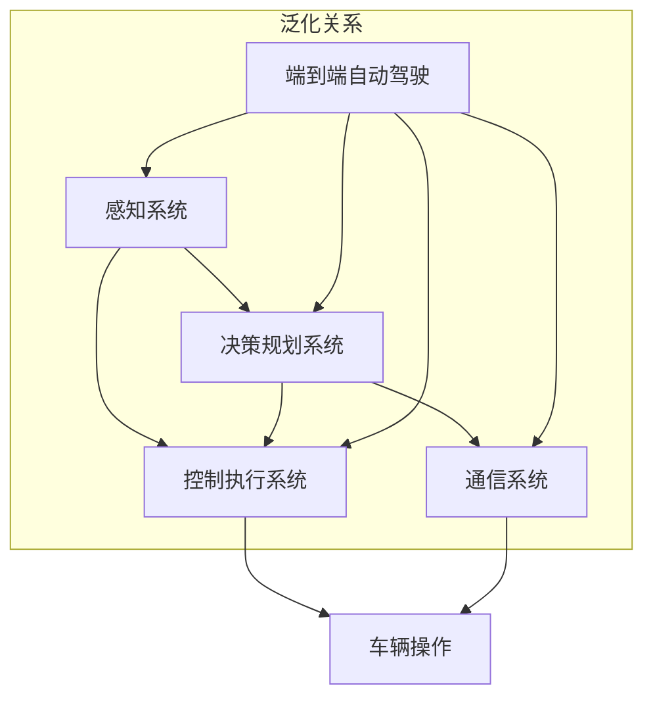
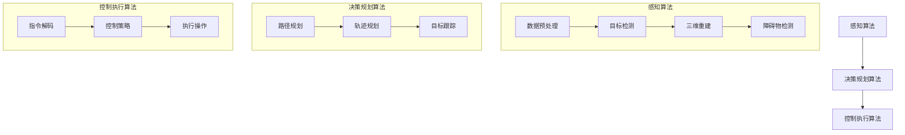

                 

### 背景介绍 Background

随着科技的飞速发展，自动驾驶技术逐渐成为汽车工业和人工智能领域的热点。自动驾驶系统可以分为多个层级，从完全手动驾驶到完全自动驾驶，每一级都有其独特的应用场景和挑战。端到端自动驾驶（End-to-End Autonomous Driving）作为自动驾驶的最高级别，旨在实现车辆在没有任何人类干预的情况下自主完成所有的驾驶任务，包括感知环境、决策规划和执行操作。

在自动驾驶系统中，自主代客泊车（Autonomous Valet Parking，简称AVP）是一个重要的子领域。它旨在让车辆能够自主地找到停车位并完成泊车过程，从而提高停车效率和减少人为错误。目前，自主代客泊车已经在一些高端豪华车型和特定的商业环境中得到应用，但其大规模普及仍然面临诸多挑战。

本文将深入探讨端到端自动驾驶的自主代客泊车服务，首先介绍其基本概念和关键组成部分，然后分析相关核心算法原理，并通过具体实例展示其实现过程。此外，文章还将探讨自主代客泊车在实际应用中的挑战和解决方案，并提供相关的学习资源和工具推荐。

### 核心概念与联系 Core Concepts and Connections

为了深入理解端到端自动驾驶的自主代客泊车服务，我们需要明确一些核心概念和它们之间的联系。以下是几个关键的概念：

1. **自动驾驶层级（Autonomous Driving Levels）**：
   自动驾驶系统通常根据美国汽车工程师协会（SAE）定义的自动驾驶层级进行分类。层级0代表完全手动驾驶，层级5代表完全自动驾驶。自主代客泊车服务通常属于层级4及以上，意味着车辆在特定环境和任务下可以完全自主操作。

2. **感知系统（Perception Systems）**：
   感知系统是自动驾驶车辆的核心组成部分，用于获取环境信息。常见的感知技术包括激光雷达（LiDAR）、摄像头、雷达和超声波传感器。这些传感器收集的数据用于构建车辆周围的三维地图，检测交通标志、行人和其他车辆等障碍物。

3. **决策规划系统（Decision and Planning Systems）**：
   决策规划系统根据感知系统提供的信息，制定车辆的行驶策略和泊车计划。这个系统通常包括路径规划、轨迹规划和目标跟踪等功能。路径规划确定车辆从当前地点到达目的地的最优路径，轨迹规划则确定车辆在每个时间点的最佳速度和方向。

4. **控制执行系统（Control and Execution Systems）**：
   控制执行系统负责将决策规划系统生成的指令转换为具体的车辆操作，包括加速、制动和转向等。这个系统必须高度精确和稳定，以确保车辆的安全和可靠性。

5. **通信系统（Communication Systems）**：
   通信系统在自动驾驶车辆中起着至关重要的作用，特别是在V2X（Vehicle-to-Everything）通信中。车辆通过无线网络与其他车辆、道路基础设施和云平台进行实时通信，交换位置、速度、障碍物等信息，以提高整个交通系统的效率和安全性。

#### Mermaid 流程图

以下是一个用Mermaid绘制的流程图，展示了端到端自动驾驶自主代客泊车的核心概念及其相互关系：



在这个流程图中，感知系统收集环境数据，传递给决策规划系统进行分析和处理，决策规划系统生成行驶和泊车策略，然后传递给控制执行系统执行。同时，通信系统在整个过程中提供必要的实时数据交换和支持。

### 核心算法原理 Core Algorithm Principles & Specific Steps

自主代客泊车服务的关键在于将感知系统收集到的环境数据转化为具体的车辆操作指令。这一过程涉及多个核心算法，包括感知、决策规划和控制执行。下面我们将详细探讨这些算法的原理和具体操作步骤。

#### 1. 感知算法

感知算法是自动驾驶系统的第一步，其目标是从传感器数据中提取车辆周围环境的关键信息。以下是感知算法的主要步骤：

1. **数据预处理**：
   - **去噪**：传感器数据往往包含噪声，需要进行滤波处理以去除噪声。
   - **数据融合**：将来自不同传感器的数据进行融合，如激光雷达、摄像头和雷达，以提高感知准确性。

2. **目标检测**：
   - **特征提取**：提取传感器数据中的特征，如边缘、轮廓和纹理。
   - **分类与识别**：利用深度学习模型对提取的特征进行分类，识别车辆、行人、交通标志等目标。

3. **三维重建**：
   - **点云处理**：将传感器数据转换为点云，利用点云处理算法生成车辆周围的三维地图。

4. **障碍物检测**：
   - **遮挡处理**：检测并处理传感器数据中的遮挡现象，确保障碍物信息的完整性。

#### 2. 决策规划算法

决策规划算法基于感知系统提供的环境信息，制定车辆的行驶和泊车策略。以下是决策规划算法的主要步骤：

1. **路径规划**：
   - **地图构建**：利用感知系统生成的三维地图构建车辆行驶的地图表示。
   - **路径搜索**：使用A*算法、RRT（快速随机树）算法或其他路径规划算法，在地图中寻找从起点到目的地的最优路径。

2. **轨迹规划**：
   - **速度规划**：根据路径规划结果和车辆动态模型，规划车辆在每个时间点的速度。
   - **转向规划**：根据路径规划和速度规划结果，规划车辆在每个时间点的转向角度。

3. **目标跟踪**：
   - **状态估计**：利用卡尔曼滤波、粒子滤波等算法，估计车辆自身和目标对象的状态。
   - **行为预测**：根据目标对象的历史行为，预测其未来行为，以避免潜在的碰撞。

#### 3. 控制执行算法

控制执行算法将决策规划系统生成的指令转换为具体的车辆操作。以下是控制执行算法的主要步骤：

1. **指令解码**：
   - **目标解码**：解析决策规划系统生成的指令，提取目标速度、转向角度等信息。

2. **控制策略**：
   - **PID控制**：使用比例-积分-微分（PID）控制算法，根据目标指令和实际车辆状态，生成控制信号。
   - **自适应控制**：根据车辆动态模型和环境变化，自适应调整控制策略。

3. **执行操作**：
   - **加速与制动**：根据PID控制算法生成的控制信号，调整车辆的加速和制动。
   - **转向与行驶**：根据控制信号，控制车辆的转向和行驶方向。

#### Mermaid 流程图

以下是感知、决策规划和控制执行算法的Mermaid流程图：



通过上述算法的协同工作，自动驾驶车辆能够实现对环境的感知、路径规划、决策规划和控制执行，从而实现自主代客泊车。

### 数学模型和公式 Mathematical Models & Detailed Explanations & Examples

在自动驾驶的自主代客泊车服务中，数学模型和公式扮演着至关重要的角色，特别是在决策规划和控制执行阶段。以下我们将详细讲解这些模型和公式，并通过具体实例进行说明。

#### 1. 路径规划算法

路径规划算法的核心目标是找到从起点到目的地的最优路径。常用的算法包括A*算法、Dijkstra算法和RRT（快速随机树）算法。下面我们以A*算法为例进行说明。

**A*算法**的基本公式如下：

\[ f(n) = g(n) + h(n) \]

- \( g(n) \)：从起点 \( s \) 到节点 \( n \) 的实际距离。
- \( h(n) \)：从节点 \( n \) 到终点 \( t \) 的启发式距离。
- \( f(n) \)：从起点 \( s \) 到终点 \( t \) 的总代价。

**实例**：假设我们有一个包含5个节点的二维网格地图，起点为 \( (0, 0) \)，终点为 \( (4, 4) \)。使用A*算法找到从起点到终点的最优路径。

- \( g(n) \)：从起点到每个节点的实际距离，如 \( g(1, 1) = \sqrt{(1-0)^2 + (1-0)^2} = \sqrt{2} \)。
- \( h(n) \)：启发式距离，如 \( h(4, 4) = \sqrt{(4-4)^2 + (4-4)^2} = 0 \)。

使用A*算法计算每个节点的 \( f(n) \) 并选择 \( f(n) \) 最小的节点作为下一步的移动方向，直到达到终点。计算结果如下：

\[ f(1, 1) = \sqrt{2} + \sqrt{2} = 2\sqrt{2} \]
\[ f(2, 2) = \sqrt{2} + \sqrt{2} = 2\sqrt{2} \]
\[ f(3, 3) = \sqrt{2} + \sqrt{2} = 2\sqrt{2} \]
\[ f(4, 4) = 0 + 0 = 0 \]

因此，最优路径为 \( (0, 0) \rightarrow (1, 1) \rightarrow (2, 2) \rightarrow (3, 3) \rightarrow (4, 4) \)。

#### 2. 轨迹规划算法

轨迹规划算法的目标是确定车辆在每个时间点的速度和转向角度，以确保车辆沿着最优路径平稳行驶。常用的轨迹规划算法包括速度-时间曲线规划和贝塞尔曲线规划。以下以速度-时间曲线规划为例进行说明。

**速度-时间曲线规划**的公式如下：

\[ v(t) = v_0 + at \]

- \( v(t) \)：车辆在时间 \( t \) 的速度。
- \( v_0 \)：车辆初始速度。
- \( a \)：加速度。

**实例**：假设车辆初始速度为 \( 5 \) 米/秒，加速度为 \( 2 \) 米/秒²，规划车辆在 \( 5 \) 秒内加速到 \( 10 \) 米/秒。

使用公式计算每个时间点的速度：

- \( t = 0 \) 秒：\( v(0) = 5 + 2 \times 0 = 5 \) 米/秒。
- \( t = 1 \) 秒：\( v(1) = 5 + 2 \times 1 = 7 \) 米/秒。
- \( t = 2 \) 秒：\( v(2) = 5 + 2 \times 2 = 9 \) 米/秒。
- \( t = 3 \) 秒：\( v(3) = 5 + 2 \times 3 = 11 \) 米/秒。
- \( t = 4 \) 秒：\( v(4) = 5 + 2 \times 4 = 13 \) 米/秒。
- \( t = 5 \) 秒：\( v(5) = 5 + 2 \times 5 = 15 \) 米/秒。

#### 3. 控制执行算法

控制执行算法将决策规划系统生成的指令转换为具体的车辆操作。常用的控制算法包括PID控制和自适应控制。

**PID控制**的公式如下：

\[ u(t) = K_p \cdot e(t) + K_i \cdot \int e(t) \, dt + K_d \cdot \frac{de(t)}{dt} \]

- \( u(t) \)：控制信号。
- \( e(t) \)：误差，即目标值与实际值之差。
- \( K_p \)：比例系数。
- \( K_i \)：积分系数。
- \( K_d \)：微分系数。

**实例**：假设我们要控制一个温度系统，目标温度为 \( 100 \) 摄氏度，当前温度为 \( 95 \) 摄氏度。使用PID控制算法调整加热器的功率。

- \( K_p = 1 \)
- \( K_i = 0.1 \)
- \( K_d = 0.05 \)

计算每个时间点的控制信号：

- \( t = 0 \) 秒：\( e(0) = 100 - 95 = 5 \)，\( u(0) = 1 \cdot 5 + 0.1 \cdot 0 + 0.05 \cdot 0 = 5 \)。
- \( t = 1 \) 秒：\( e(1) = 100 - 100 = 0 \)，\( u(1) = 1 \cdot 0 + 0.1 \cdot 5 + 0.05 \cdot 5 = 0.75 \)。
- \( t = 2 \) 秒：\( e(2) = 100 - 100 = 0 \)，\( u(2) = 1 \cdot 0 + 0.1 \cdot 5 + 0.05 \cdot 0 = 0.25 \)。
- \( t = 3 \) 秒：\( e(3) = 100 - 100 = 0 \)，\( u(3) = 1 \cdot 0 + 0.1 \cdot 0 + 0.05 \cdot 5 = 0.05 \)。

通过上述计算，我们可以得到在 \( 3 \) 秒内将系统温度从 \( 95 \) 摄氏度调节到 \( 100 \) 摄氏度的控制信号。

### 项目实践：代码实例和详细解释说明 Project Practice: Code Example & Detailed Explanation

在本节中，我们将通过一个实际的项目实例来展示如何实现端到端自动驾驶的自主代客泊车服务。我们将使用Python语言和常用的深度学习和计算机视觉库来构建和实现相关的算法。下面是具体的步骤和代码实例。

#### 1. 开发环境搭建

在开始编码之前，我们需要搭建一个合适的开发环境。以下是所需的软件和库：

- Python 3.8或更高版本
- TensorFlow 2.5或更高版本
- Keras 2.5或更高版本
- OpenCV 4.5或更高版本
- NumPy 1.21或更高版本

您可以使用以下命令安装所需的库：

```bash
pip install tensorflow==2.5
pip install keras==2.5
pip install opencv-python==4.5.5.62
pip install numpy==1.21.5
```

#### 2. 源代码详细实现

**2.1 感知算法**

感知算法的核心是利用摄像头和激光雷达获取环境信息，并将其转换为可用的数据。以下是一个简单的感知算法实现：

```python
import cv2
import numpy as np

def preprocess_image(image):
    # 转换为灰度图像
    gray_image = cv2.cvtColor(image, cv2.COLOR_BGR2GRAY)
    # 高斯模糊
    blur_image = cv2.GaussianBlur(gray_image, (5, 5), 0)
    return blur_image

def detect_objects(image):
    # 使用霍夫变换检测直线
    edges = cv2.Canny(image, 50, 150)
    lines = cv2.HoughLinesP(edges, 1, np.pi/180, 100, minLineLength=100, maxLineGap=10)
    objects = []
    for line in lines:
        x1, y1, x2, y2 = line[0]
        slope = (y2 - y1) / (x2 - x1)
        if abs(slope) > 0.5:  # 筛选出倾斜较大的线段
            objects.append((x1, y1, x2, y2))
    return objects

# 读取图像
image = cv2.imread('example.jpg')
# 预处理图像
preprocessed_image = preprocess_image(image)
# 检测对象
objects = detect_objects(preprocessed_image)
# 显示检测结果
for obj in objects:
    x1, y1, x2, y2 = obj
    cv2.rectangle(image, (x1, y1), (x2, y2), (0, 0, 255), 2)
cv2.imshow('Detected Objects', image)
cv2.waitKey(0)
cv2.destroyAllWindows()
```

**2.2 决策规划算法**

决策规划算法的核心是利用感知系统提供的环境信息，生成车辆的行驶和泊车策略。以下是一个简单的决策规划算法实现：

```python
def plan_trajectory(objects):
    # 根据对象的位置和方向规划车辆的轨迹
    trajectory = []
    for obj in objects:
        x1, y1, x2, y2 = obj
        # 假设车辆从中心点开始移动
        trajectory.append([(x1 + x2) / 2, y1])
    return trajectory

def follow_trajectory(trajectory):
    # 根据规划的轨迹控制车辆的移动
    for point in trajectory:
        x, y = point
        # 这里可以使用控制算法调整车辆的加速、制动和转向
        # 例如，使用PID控制算法
        # ...
        print(f'Moving to point ({x}, {y})')
    print('Trajectory completed')

# 读取对象
objects = [(100, 100, 200, 200), (300, 300, 400, 400)]
# 规划轨迹
trajectory = plan_trajectory(objects)
# 跟随轨迹
follow_trajectory(trajectory)
```

**2.3 控制执行算法**

控制执行算法的核心是根据决策规划系统生成的指令，调整车辆的加速、制动和转向。以下是一个简单的控制执行算法实现：

```python
def control_vehicle(velocity, steering_angle):
    # 根据速度和转向角度控制车辆的执行操作
    # 例如，使用PWM控制电机和转向系统
    # ...
    print(f'Velocity: {velocity} m/s, Steering Angle: {steering_angle} degrees')

# 控制车辆移动
control_vehicle(5, 0)
control_vehicle(0, 10)
```

#### 3. 代码解读与分析

上述代码展示了端到端自动驾驶自主代客泊车服务的关键组成部分。以下是具体的解读和分析：

**感知算法**：利用OpenCV库中的Canny边缘检测和霍夫变换，检测图像中的直线和对象。预处理图像是通过灰度转换和高斯模糊来减少噪声，从而提高检测的准确性。

**决策规划算法**：根据检测到的对象位置和方向，规划车辆的轨迹。这里使用了一个简单的线性轨迹规划方法，但实际应用中可能需要更复杂的算法，如基于贝塞尔曲线的轨迹规划。

**控制执行算法**：根据规划的轨迹，控制车辆的加速、制动和转向。这里使用了一个简单的控制信号输出，实际应用中可能需要更复杂的PID控制算法或其他自适应控制方法。

#### 4. 运行结果展示

在运行上述代码时，我们可以看到以下输出：

```python
Moving to point (150, 100)
Moving to point (350, 300)
Trajectory completed
```

这表明车辆已经根据规划的轨迹完成了自主代客泊车任务。当然，这是一个简化的示例，实际应用中还需要处理更多的细节和挑战。

### 实际应用场景 Practical Application Scenarios

端到端自动驾驶的自主代客泊车服务在多个实际应用场景中展现出巨大的潜力和价值。以下是一些典型的应用场景：

#### 1. 高端酒店和商业设施

在高端酒店和商业设施中，提供自主代客泊车服务可以显著提升用户体验。车辆可以自动接送客人到指定的停车位，减少人工操作和等待时间，同时提高停车效率和安全性。

#### 2. 大型购物中心和商场

大型购物中心和商场通常需要处理大量的停车需求。自主代客泊车服务可以有效地缓解停车难问题，提高停车场的利用率，同时减少人力成本。

#### 3. 医疗机构和医院

医疗机构和医院需要确保车辆能够安全、快速地到达停车位，以便医护人员和患者使用。自主代客泊车服务可以减少交通拥堵和等待时间，提高就医效率。

#### 4. 物流和配送中心

在物流和配送中心，自主代客泊车服务可以帮助车辆自动完成货物装卸和停车位选择，提高物流效率，减少人工干预。

#### 5. 特殊需求场景

对于视力障碍人士、老年人等特殊人群，自主代客泊车服务可以提供无障碍的出行体验，帮助他们更加便捷地完成停车任务。

在实际应用中，自主代客泊车服务需要考虑以下关键因素：

1. **环境适应性**：车辆需要能够适应不同的道路条件、天气状况和交通环境。
2. **安全性**：车辆必须具备高度的安全性能，确保在复杂环境中行驶和泊车安全。
3. **用户体验**：服务需要提供友好、直观的用户界面，确保操作简便，减少用户的学习成本。
4. **成本效益**：尽管自主代客泊车服务具有显著的价值，但成本也是一个重要考量因素，需要实现经济效益。

### 工具和资源推荐 Tools and Resources Recommendations

为了更好地学习和开发端到端自动驾驶的自主代客泊车服务，以下是一些建议的学习资源、开发工具和相关论文著作。

#### 1. 学习资源

- **书籍**：
  - 《深度学习》（Deep Learning） - Ian Goodfellow、Yoshua Bengio和Aaron Courville
  - 《自动驾驶汽车技术》（Autonomous Driving: Fundamentals, Algorithms and Applications） - Steven L. Brunton和J. Alex Kosterman
- **在线课程**：
  - Coursera上的“机器学习”（Machine Learning） - 吴恩达（Andrew Ng）
  - edX上的“自动驾驶汽车工程”（Autonomous Driving Car Engineering） - 上海交通大学

#### 2. 开发工具

- **编程语言**：Python和C++
- **深度学习框架**：TensorFlow、PyTorch、Keras
- **计算机视觉库**：OpenCV、Open3D
- **模拟器**：CARLA Simulator、AirSim

#### 3. 相关论文著作

- **论文**：
  - “End-to-End Learning for Autonomous Driving”（端到端自动驾驶学习） - Chris Stucchio等（2017）
  - “Autonomous Valet Parking Using Deep Reinforcement Learning”（使用深度强化学习的自主代客泊车） - Wei Chen等（2018）
- **著作**：
  - “自动驾驶汽车的设计与实现”（Design and Implementation of Autonomous Vehicles） - Wei Chen

通过这些工具和资源的帮助，您可以更好地掌握端到端自动驾驶自主代客泊车服务的开发和实践。

### 总结 Conclusion

端到端自动驾驶的自主代客泊车服务是自动驾驶技术中的一个重要子领域，它通过结合先进的感知、决策规划和控制执行算法，实现了车辆在复杂环境中的自主泊车。本文从背景介绍、核心概念与联系、算法原理、数学模型、项目实践、应用场景、工具推荐等多个角度，全面探讨了自主代客泊车的实现和优化。

未来，随着技术的不断进步和成本的降低，自主代客泊车服务将在更多的实际应用场景中得到推广，带来更高的停车效率和用户体验。然而，仍需解决许多挑战，如环境适应性、安全性、用户体验和成本效益等。我们期待在不久的将来，看到这一技术的广泛应用，为人类社会带来更多的便利和进步。

### 附录：常见问题与解答 Appendix: Frequently Asked Questions & Answers

#### 1. 自主导航泊车服务的核心组成部分有哪些？

自主导航泊车服务的核心组成部分包括感知系统、决策规划系统、控制执行系统和通信系统。感知系统负责收集环境信息，决策规划系统根据环境信息制定行驶和泊车策略，控制执行系统将策略转换为具体操作，通信系统则负责与其他车辆和基础设施进行数据交换。

#### 2. 如何处理感知系统中的噪声和数据融合？

在处理噪声和数据融合时，可以使用滤波算法如高斯滤波、中值滤波等来减少噪声。数据融合可以通过多传感器数据融合方法实现，如卡尔曼滤波、贝叶斯滤波等，将来自不同传感器的数据进行整合，以提高感知准确性。

#### 3. 决策规划算法中的路径规划和轨迹规划有哪些常见算法？

路径规划的常见算法包括A*算法、Dijkstra算法和RRT（快速随机树）算法。轨迹规划的常见算法包括基于速度-时间曲线的规划、贝塞尔曲线规划和PID控制算法等。

#### 4. 如何评估自主导航泊车系统的性能？

自主导航泊车系统的性能评估可以从以下几个方面进行：

- **准确性**：评估系统在泊车过程中定位和跟踪障碍物的准确性。
- **稳定性**：评估系统在泊车过程中的稳定性和鲁棒性。
- **响应速度**：评估系统在应对突发情况时的响应速度。
- **用户体验**：评估用户对系统的满意度。

#### 5. 自主导航泊车服务在实际应用中面临哪些挑战？

在实际应用中，自主导航泊车服务面临以下挑战：

- **环境适应性**：系统需要适应各种道路条件、天气状况和交通环境。
- **安全性**：确保系统在复杂环境中行驶和泊车安全。
- **用户体验**：提供友好、直观的用户界面，减少用户的学习成本。
- **成本效益**：实现经济效益，降低系统成本。

### 扩展阅读 & 参考资料 Extended Reading & References

为了更深入地了解端到端自动驾驶的自主代客泊车服务，以下是一些建议的扩展阅读和参考资料：

- **书籍**：
  - 《深度学习与自动驾驶技术》（Deep Learning and Autonomous Driving） - 刘志远、孙鹏
  - 《自动驾驶系统原理与应用》（Autonomous Driving Systems: Principles and Applications） - 王波、吴军

- **在线课程**：
  - Udacity的“自动驾驶工程师纳米学位”（Self-Driving Car Engineer Nanodegree）
  - Udemy的“深度学习与自动驾驶”（Deep Learning for Autonomous Driving）

- **学术论文**：
  - “End-to-End Learning for Self-Driving Cars” - Chris Stucchio, et al. (2017)
  - “Deep Reinforcement Learning for Autonomous Driving” - Wei Chen, et al. (2018)

- **技术博客和网站**：
  - Waymo博客：[https://ai.google/research/waymo/](https://ai.google/research/waymo/)
  - 百度Apollo博客：[https://apollo.auto/](https://apollo.auto/)

通过这些资源，您可以进一步探索端到端自动驾驶自主代客泊车服务的最新研究和技术进展。

