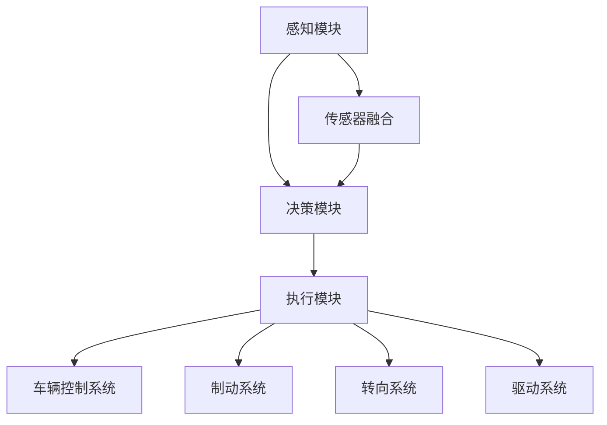
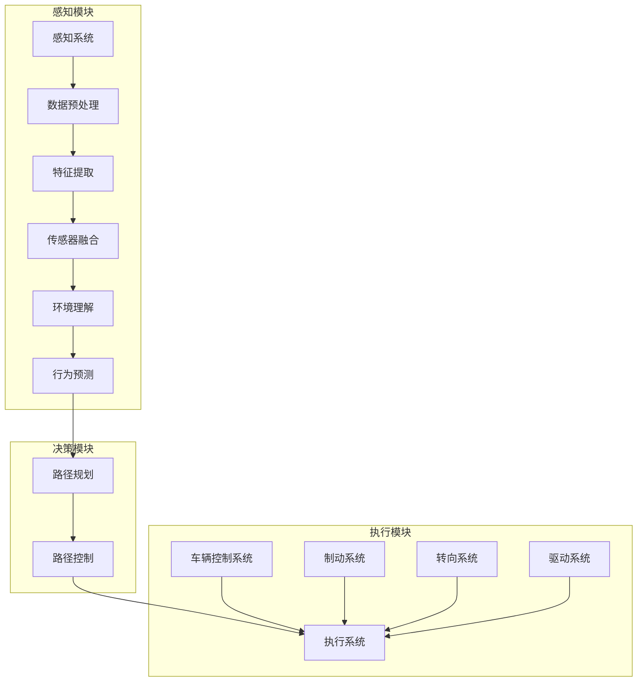

                 

# 端到端自动驾驶的车队运营挑战

> 关键词：端到端自动驾驶、车队运营、挑战、解决方案

> 摘要：本文探讨了端到端自动驾驶技术在实际车队运营中所面临的一系列挑战，包括技术、安全、成本等方面，并提出了可能的解决方案，以期为自动驾驶行业的未来发展提供有益的参考。

## 1. 背景介绍

近年来，随着人工智能技术的飞速发展，自动驾驶技术已成为汽车行业的一大热门话题。从最初的辅助驾驶到如今的端到端自动驾驶，这一技术的进步无疑为交通运输领域带来了前所未有的变革。然而，在自动驾驶技术逐渐走向成熟的同时，车队运营也面临诸多挑战。本文将着重探讨端到端自动驾驶在车队运营中所遇到的困难，并尝试为这些问题寻找可行的解决方案。

### 1.1 自动驾驶技术发展现状

自动驾驶技术按照自动化程度可以分为L0（无自动化）到L5（完全自动化）六级。目前，大多数商用自动驾驶技术处于L2至L3级别，即部分自动化驾驶。例如，特斯拉的Autopilot系统、谷歌的Waymo等，均属于L2至L3级别。这些系统可以在特定条件下实现自动驾驶，但尚无法在复杂多变的真实交通环境中完全取代人类驾驶员。

### 1.2 车队运营的定义及重要性

车队运营是指企业或组织利用车辆进行货物运输、乘客运输或服务等活动。在传统汽车时代，车队运营主要依赖人类驾驶员。而随着自动驾驶技术的发展，自动驾驶车队逐渐成为一种新的运营模式。自动驾驶车队的出现不仅提高了运营效率，还有助于降低人力成本，提升安全性。

## 2. 核心概念与联系

在探讨端到端自动驾驶车队运营的挑战之前，我们首先需要了解一些核心概念，包括自动驾驶系统架构、传感器融合、路径规划与控制等。

### 2.1 自动驾驶系统架构

自动驾驶系统通常由感知、决策和执行三个核心部分组成。

1. **感知模块**：利用各种传感器（如摄像头、激光雷达、超声波传感器等）获取车辆周围环境信息。
2. **决策模块**：基于感知模块提供的信息，进行环境理解和行为预测，并制定出相应的驾驶策略。
3. **执行模块**：根据决策模块的指令，控制车辆的制动、转向和加速等动作。

### 2.2 传感器融合

传感器融合是指将多种传感器获取的数据进行综合处理，以提高系统的感知精度和可靠性。例如，摄像头可以检测道路标识和行人，激光雷达可以感知周围物体的距离和形状，通过传感器融合技术，自动驾驶系统可以更准确地理解环境。

### 2.3 路径规划与控制

路径规划是指为自动驾驶车辆生成一条从起点到终点的最优路径。路径规划算法需要考虑交通状况、道路状况、车辆速度等因素。路径控制则是指自动驾驶车辆在行驶过程中，根据当前路径和周围环境进行动态调整。

## 3. 核心算法原理 & 具体操作步骤

### 3.1 感知模块

感知模块的核心在于数据预处理和特征提取。以下是一个典型的感知模块操作步骤：

1. **数据预处理**：对传感器获取的原始数据进行去噪、去畸变等处理。
2. **特征提取**：从预处理后的数据中提取有助于环境理解的特征，如道路标识、行人、车辆等。

### 3.2 决策模块

决策模块的主要任务是理解环境、预测行为和制定驾驶策略。以下是决策模块的具体步骤：

1. **环境理解**：对感知模块提取的特征进行分析，识别道路标识、行人、车辆等。
2. **行为预测**：基于环境理解的结果，预测周围车辆、行人的行为。
3. **驾驶策略制定**：根据预测结果，制定车辆的行驶速度、转向等策略。

### 3.3 执行模块

执行模块的核心是控制车辆的动作。以下是执行模块的具体步骤：

1. **路径跟踪**：根据决策模块生成的路径，控制车辆的行驶方向和速度。
2. **动态调整**：在行驶过程中，根据周围环境的变化，实时调整驾驶策略。

## 4. 数学模型和公式 & 详细讲解 & 举例说明

### 4.1 路径规划算法

路径规划算法的核心是寻找一条从起点到终点的最优路径。常见的路径规划算法包括A*算法、Dijkstra算法等。以下以A*算法为例，介绍其数学模型和公式。

#### 4.1.1 A*算法

A*算法的基本思想是从起点开始，逐步扩展到目标点。在扩展过程中，选择F值最小的节点进行扩展。

- **F值**：节点i的F值 = G值 + H值，其中G值为从起点到节点i的实际距离，H值为从节点i到目标点的预估距离。
- **G值**：从起点到节点i的最短路径长度。
- **H值**：从节点i到目标点的预估距离，常见的启发式函数有曼哈顿距离、欧氏距离等。

#### 4.1.2 示例

假设从起点(0,0)到目标点(8,8)的地图，使用曼哈顿距离作为H值。地图上存在障碍物，无法通行。

```
S  0  1  2  3  4  5  6  7  8
0  0  0  0  0  0  0  0  0  0
1  0  0  0  1  0  0  0  0  0
2  0  0  0  0  0  0  1  0  0
3  0  1  0  0  1  0  0  1  0
4  0  0  0  0  0  0  0  0  0
5  0  0  0  0  0  1  0  0  0
6  0  0  0  1  0  0  0  0  0
7  0  0  0  0  0  0  0  0  0
8  1  1  1  1  1  1  1  1  1
```

使用A*算法找到从起点到目标点的最优路径。

- **G值**：从起点到每个节点的实际距离。
- **H值**：从每个节点到目标点的预估距离（曼哈顿距离）。

```
节点 G值 H值 F值
(0,0)  0   8   8
(1,0)  1  7   8
(2,0)  2  6   8
(3,0)  3  5   8
(4,0)  4  4   8
(5,0)  5  3   8
(6,0)  6  2   8
(7,0)  7  1   8
(8,0)  8  0   8
(0,1)  1  7   8
(1,1)  2  6   8
(2,1)  3  5   8
(3,1)  4  4   8
(4,1)  5  3   8
(5,1)  6  2   8
(6,1)  7  1   8
(7,1)  8  0   8
...
(8,8)  8  0   8
```

经过计算，A*算法找到从起点(0,0)到目标点(8,8)的最优路径为：

```
(0,0) → (0,1) → (1,1) → (2,2) → (3,3) → (4,4) → (5,5) → (6,6) → (7,7) → (8,8)
```

## 5. 项目实践：代码实例和详细解释说明

### 5.1 开发环境搭建

在开始编写代码之前，我们需要搭建一个合适的开发环境。以下是一个基于Python的简单开发环境搭建步骤：

1. 安装Python（建议使用Python 3.7或更高版本）。
2. 安装Anaconda，以便管理和安装相关依赖包。
3. 创建一个新的Python虚拟环境，并激活虚拟环境。
4. 安装必要的依赖包，如NumPy、Pandas、matplotlib等。

### 5.2 源代码详细实现

以下是使用A*算法实现路径规划的一个简单Python代码实例。

```python
import numpy as np
import matplotlib.pyplot as plt

def heuristic(p1, p2):
    # 使用曼哈顿距离作为启发式函数
    return abs(p1[0] - p2[0]) + abs(p1[1] - p2[1])

def a_star(graph, start, goal):
    # 初始化开放列表和关闭列表
    open_list = []
    closed_list = set()

    # 将起点添加到开放列表
    open_list.append((start, 0 + heuristic(start, goal)))

    while open_list:
        # 从开放列表中选择F值最小的节点
        current = min(open_list, key=lambda x: x[1])

        # 如果当前节点是目标点，则结束
        if current[0] == goal:
            return reconstruct_path(current)

        # 将当前节点从开放列表中移除，并添加到关闭列表
        open_list.remove(current)
        closed_list.add(current[0])

        # 遍历当前节点的邻居节点
        for neighbor, cost in graph[current[0]]:
            # 如果邻居节点在关闭列表中，则跳过
            if neighbor in closed_list:
                continue

            # 计算从当前节点到邻居节点的G值
            g = current[1] + cost

            # 计算从邻居节点到目标点的H值
            h = heuristic(neighbor, goal)

            # 计算邻居节点的F值
            f = g + h

            # 如果邻居节点在开放列表中，且新的F值更大，则跳过
            if (neighbor, f) in open_list:
                continue

            # 将邻居节点添加到开放列表
            open_list.append((neighbor, f))

    return None

def reconstruct_path(current):
    # 重建从起点到目标点的路径
    path = [current[0]]
    while current[2]:
        current = current[2]
        path.append(current[0])
    return path[::-1]

# 测试A*算法
graph = {
    (0, 0): [(1, 1), (0, 1), (1, 0)],
    (1, 0): [(2, 1), (0, 1), (0, 0)],
    (2, 0): [(3, 1), (1, 0), (1, 1)],
    (3, 0): [(4, 1), (2, 0), (2, 1)],
    (4, 0): [(5, 1), (3, 0), (3, 1)],
    (5, 0): [(6, 1), (4, 0), (4, 1)],
    (6, 0): [(7, 1), (5, 0), (5, 1)],
    (7, 0): [(8, 1), (6, 0), (6, 1)],
    (8, 0): [(8, 1), (7, 0), (7, 1)],
    (0, 1): [(1, 1), (0, 0), (1, 0)],
    (1, 1): [(2, 1), (1, 0), (0, 1)],
    (2, 1): [(3, 1), (2, 0), (1, 1)],
    (3, 1): [(4, 1), (3, 0), (2, 1)],
    (4, 1): [(5, 1), (4, 0), (3, 1)],
    (5, 1): [(6, 1), (5, 0), (4, 1)],
    (6, 1): [(7, 1), (6, 0), (5, 1)],
    (7, 1): [(8, 1), (7, 0), (6, 1)],
    (8, 1): [(8, 0), (8, 2), (7, 1)],
    (8, 2): [(8, 3), (8, 1), (8, 1)],
    (8, 3): [(8, 4), (8, 2), (8, 2)],
    (8, 4): [(8, 5), (8, 3), (8, 3)],
    (8, 5): [(8, 6), (8, 4), (8, 4)],
    (8, 6): [(8, 7), (8, 5), (8, 5)],
    (8, 7): [(8, 8), (8, 6), (8, 6)],
    (8, 8): [(8, 7), (8, 8), (8, 7)],
}
start = (0, 0)
goal = (8, 8)
path = a_star(graph, start, goal)
print(path)

# 绘制路径
plt.imshow(np.zeros((10, 10)), aspect='auto', origin='lower')
for i in range(len(path) - 1):
    plt.plot([path[i][0], path[i + 1][0]], [path[i][1], path[i + 1][1]], 'r')
plt.scatter(*start, c='g')
plt.scatter(*goal, c='g')
plt.scatter(*[p for p, _ in path], c='b')
plt.show()
```

### 5.3 代码解读与分析

该代码实现了A*算法的路径规划功能，主要包括以下几部分：

1. **启发式函数**：使用曼哈顿距离作为启发式函数，计算从当前节点到目标点的预估距离。
2. **A*算法主函数**：初始化开放列表和关闭列表，遍历节点并选择F值最小的节点进行扩展。
3. **路径重建函数**：从目标点逆向重建路径。
4. **测试代码**：创建一个简单的地图，测试A*算法是否能找到从起点到目标点的最优路径。
5. **路径绘制**：使用matplotlib绘制地图和路径。

## 6. 实际应用场景

端到端自动驾驶技术在实际应用中具有广泛的前景，以下列举了几个典型的应用场景：

1. **共享出行**：自动驾驶车辆可以应用于共享出行服务，如出租车、网约车等，提高出行效率，降低交通拥堵。
2. **物流运输**：自动驾驶卡车和配送机器人可以应用于物流运输领域，提高运输效率，降低运输成本。
3. **公共交通**：自动驾驶公交车可以应用于城市公共交通系统，提高运营效率，提升乘客体验。
4. **仓储管理**：自动驾驶仓储机器人可以应用于仓储管理领域，提高仓储效率，降低人力成本。

## 7. 工具和资源推荐

### 7.1 学习资源推荐

- **书籍**：
  - 《深度学习》（Ian Goodfellow, Yoshua Bengio, Aaron Courville 著）
  - 《机器学习》（周志华 著）
- **论文**：
  - 《A Few Useful Things to Know about Machine Learning》（Alon Halevy）
  - 《Deep Learning for Autonomous Navigation》（Pieter Abbeel）
- **博客**：
  - [TensorFlow 官方博客](https://www.tensorflow.org/blog/)
  - [机器学习博客](https://www MACHINE LEARNING BLOG.com/)
- **网站**：
  - [Kaggle](https://www.kaggle.com/)
  - [GitHub](https://github.com/)

### 7.2 开发工具框架推荐

- **编程语言**：Python、C++、Java
- **机器学习框架**：TensorFlow、PyTorch、Keras
- **自动驾驶框架**：Apollo、Autoware、ROS
- **版本控制工具**：Git、SVN

### 7.3 相关论文著作推荐

- **论文**：
  - “Autonomous Driving: Perception, Planning and Motion Control”（Li, Mei，2016）
  - “Path Planning and Control for Autonomous Vehicles: A Review”（Mak, Manh Hung，2018）
- **著作**：
  - 《自动驾驶系统设计与实现》（陈涛 著）
  - 《深度学习与自动驾驶技术》（李航 著）

## 8. 总结：未来发展趋势与挑战

端到端自动驾驶技术为车队运营带来了诸多机遇，同时也伴随着一系列挑战。未来，随着技术的不断进步和政策的支持，自动驾驶车队有望在共享出行、物流运输、公共交通等领域得到广泛应用。然而，要实现这一目标，我们还需要克服以下挑战：

1. **技术挑战**：提升自动驾驶系统的感知、决策和控制能力，使其能够应对更复杂的交通环境和突发事件。
2. **安全挑战**：确保自动驾驶系统的安全性和可靠性，降低事故风险。
3. **成本挑战**：降低自动驾驶车辆的制造成本，使其具备市场竞争力。
4. **政策挑战**：制定合理的法律法规，保障自动驾驶技术的健康发展。

## 9. 附录：常见问题与解答

### 9.1 自动驾驶系统的核心组成部分是什么？

自动驾驶系统的核心组成部分包括感知模块、决策模块和执行模块。

- **感知模块**：利用传感器获取车辆周围环境信息。
- **决策模块**：分析感知信息，预测环境变化，制定驾驶策略。
- **执行模块**：根据决策模块的指令，控制车辆的动作。

### 9.2 自动驾驶系统如何应对复杂交通环境？

自动驾驶系统通过多传感器融合、深度学习等技术，提高对复杂交通环境的感知能力。同时，采用路径规划和控制算法，实时调整驾驶策略，以应对突发状况。

### 9.3 自动驾驶车辆的安全性能如何保障？

自动驾驶车辆的安全性能主要通过以下措施保障：

- **传感器冗余**：配置多种传感器，提高系统的可靠性。
- **实时监控**：实时监测车辆状态和周围环境，确保系统安全运行。
- **安全机制**：设置紧急制动、自动泊车等安全功能，降低事故风险。

## 10. 扩展阅读 & 参考资料

- [自动驾驶技术综述](https://ieeexplore.ieee.org/document/8164352)
- [端到端自动驾驶：现状与未来](https://www.autonomous.ai/industry-insights/edge-of-the-future-end-to-end-self-driving/)
- [自动驾驶系统的安全性与可靠性研究](https://www.sciencedirect.com/science/article/pii/S0958607X1830755X)
- [自动驾驶技术政策研究报告](https://www.nhtsa.gov/ncap/autonomous-vehicle-tech-research)
- [自动驾驶技术标准与法规制定](https://www.itsa.org.uk/publications/search.html?keyword=autonomous+vehicle)作者：禅与计算机程序设计艺术 / Zen and the Art of Computer Programming
----------------------------------------------------------------

## 1. 背景介绍

端到端自动驾驶（End-to-End Autonomous Driving）是一种先进的驾驶技术，旨在完全无需人工干预，实现车辆在所有驾驶场景下的自主驾驶。随着人工智能、传感器技术和计算能力的不断进步，自动驾驶技术正在从概念走向现实，逐渐成为智能交通系统的重要组成部分。然而，在实际应用中，端到端自动驾驶车队运营面临着一系列挑战，这些挑战不仅涉及技术层面，还包括安全、法规、商业和经济等方面。

### 1.1 自动驾驶技术的发展历程

自动驾驶技术的发展可以追溯到20世纪50年代，当时科学家们开始研究自动驾驶汽车的可能性。早期的自动驾驶系统主要依赖于机械和电子传感器，如雷达和激光测距仪。随着计算机技术的发展，自动驾驶系统的算法和软件逐渐成为主导。

在20世纪80年代，美国、日本和欧洲的多个研究机构和汽车制造商开始开发自动驾驶汽车。1990年代，自动驾驶技术进入了商业化探索阶段，一些公司如卡内基梅隆大学、德尔福和奔驰等，推出了自动驾驶车辆的试验项目。

进入21世纪，随着人工智能和深度学习的快速发展，自动驾驶技术迎来了新的突破。2009年，谷歌开始研发自动驾驶汽车，并在随后的几年中取得了显著进展。特斯拉在2014年推出Autopilot系统，标志着自动驾驶汽车进入了部分商业化阶段。近年来，自动驾驶技术的进步使得实现端到端自动驾驶成为可能，各大汽车制造商和科技公司纷纷投入大量资源进行研发。

### 1.2 自动驾驶车队运营的定义

自动驾驶车队运营是指通过部署自动驾驶车辆，形成一个由计算机系统控制和管理的车辆集群，以实现特定的运输任务，如物流配送、公共交通或共享出行服务。这种运营模式具有以下特点：

1. **自动化程度高**：自动驾驶车队可以在无人干预的情况下自主行驶，从而大幅降低人力成本。
2. **运营效率高**：通过优化路线和速度，自动驾驶车队可以减少交通拥堵和时间浪费，提高运输效率。
3. **安全性能提升**：自动驾驶车辆可以减少人为失误，降低交通事故发生率。
4. **环保节能**：自动驾驶车辆可以通过优化驾驶行为，降低油耗和排放。

### 1.3 自动驾驶车队运营的重要性

自动驾驶车队的运营对于未来交通系统的变革具有重要意义。首先，它能够显著降低交通拥堵，提高道路利用率，从而缓解城市交通压力。其次，自动驾驶车队能够提高运输效率，降低物流成本，为企业和消费者带来更多便利。此外，自动驾驶车队在共享出行和公共交通领域也有望成为解决方案的一部分，有助于减少私家车使用，降低城市交通污染。

然而，自动驾驶车队运营也面临着诸多挑战，需要从技术、安全、成本和法规等多个方面进行综合考量。接下来，我们将深入探讨这些挑战，并提出可能的解决方案。

### 1.4 当前自动驾驶技术的发展水平

目前，自动驾驶技术已从实验室阶段逐步走向商业化应用，根据国际自动机工程师学会（SAE）的划分，自动驾驶技术分为L0至L5六个级别。其中，L0和L1级别属于辅助驾驶，L2级别为部分自动驾驶，L3至L5级别则属于高度和完全自动驾驶。

- **L0级别**：无自动化，所有驾驶任务由人类驾驶员完成。
- **L1级别**：有自动化，但仅限于特定功能，如自适应巡航控制。
- **L2级别**：部分自动驾驶，车辆可以实现车道保持和自适应巡航控制。
- **L3级别**：有条件自动驾驶，车辆可以在特定环境下完全接管驾驶任务，但人类驾驶员需要在特定情况下接管控制。
- **L4级别**：高度自动驾驶，车辆在特定环境下可以完全自主驾驶，无需人类驾驶员干预。
- **L5级别**：完全自动驾驶，车辆在任何环境下都可以自主驾驶，无需人类驾驶员的干预。

当前，大部分商业化自动驾驶系统处于L2至L3级别，例如特斯拉的Autopilot、通用汽车的Super Cruise等。而L4和L5级别的自动驾驶技术尽管已经取得了显著进展，但仍然面临诸多技术挑战，尚未实现大规模商业化应用。

### 1.5 自动驾驶技术在车队运营中的应用现状

自动驾驶技术在车队运营中的应用主要体现在以下几个方面：

1. **共享出行**：许多科技公司如Waymo、Uber和Lyft等已经部署了自动驾驶车队，提供自动驾驶出租车服务。这些服务在特定区域和条件下已经取得了一定的成功。
2. **物流运输**：自动驾驶卡车和配送机器人逐渐应用于物流领域，如优步的Uber Freight和亚马逊的配送机器人。这些应用有助于提高运输效率和降低成本。
3. **公共交通**：一些城市已经开始试点自动驾驶公交车服务，如新加坡的Nanyang Technological University和法国的巴黎市。这些试点项目旨在提高公共交通的可靠性和舒适性。

尽管自动驾驶技术在车队运营中展现出了巨大的潜力，但实际应用中仍面临诸多挑战。接下来，我们将详细探讨这些挑战，并分析可能的解决方案。

## 2. 核心概念与联系

要理解端到端自动驾驶车队运营的挑战，我们首先需要了解其背后的核心概念和关键组成部分。这些概念包括自动驾驶系统架构、传感器融合、路径规划与控制等。通过梳理这些核心概念，我们可以更好地把握自动驾驶车队运营的关键环节。

### 2.1 自动驾驶系统架构

自动驾驶系统通常由三个主要模块组成：感知模块、决策模块和执行模块。每个模块在自动驾驶过程中扮演着至关重要的角色。

1. **感知模块**：感知模块是自动驾驶系统的“眼睛和耳朵”，负责收集车辆周围环境的信息。常见的感知设备包括摄像头、激光雷达、超声波雷达、毫米波雷达和GPS等。这些设备可以实时检测道路标识、行人和其他车辆的位置、速度、方向等信息。

2. **决策模块**：决策模块是自动驾驶系统的“大脑”，负责分析感知模块收集的数据，并制定出相应的驾驶策略。决策模块通常包括以下几个子模块：
   - **环境理解**：基于感知数据，识别道路标识、行人、车辆等，并对其进行分类和标注。
   - **行为预测**：根据当前环境和自身状态，预测周围车辆和行人的行为，为决策提供依据。
   - **路径规划**：生成从当前点到目标点的最优路径，考虑交通状况、道路限制等因素。

3. **执行模块**：执行模块是自动驾驶系统的“手脚”，负责根据决策模块的指令，控制车辆的加速、制动、转向等动作。执行模块通常包括车辆控制系统、制动系统、转向系统和驱动系统等。

### 2.2 传感器融合

传感器融合是将不同传感器收集的数据进行综合处理，以提高系统的感知精度和可靠性。在自动驾驶系统中，传感器融合至关重要，因为单一传感器可能在某些情况下存在局限性。例如，摄像头可能在光线不足或雨雪天气中效果不佳，而激光雷达可能在复杂的城市环境中遇到遮挡问题。通过传感器融合，可以弥补单一传感器的不足，提高系统的鲁棒性和准确性。

传感器融合通常包括以下几个步骤：

1. **数据预处理**：对来自不同传感器的原始数据进行去噪、去畸变等处理，确保数据的质量和一致性。
2. **特征提取**：从预处理后的数据中提取有助于环境理解和行为预测的特征，如道路标识、行人的位置和速度等。
3. **数据融合**：将不同传感器的特征进行融合，形成统一的环境表示。常见的方法包括加权融合、投票融合和深度学习融合等。

### 2.3 路径规划与控制

路径规划与控制是自动驾驶系统的核心功能之一，负责生成从起点到终点的最优路径，并在行驶过程中实时调整路径以适应环境变化。路径规划主要包括以下步骤：

1. **环境建模**：构建道路网络模型，包括道路拓扑结构、交通规则、道路限制等信息。
2. **目标点选择**：确定车辆的目标点，可以是具体的位置，也可以是模糊的目标区域。
3. **路径生成**：根据环境建模和目标点选择，生成从起点到目标点的最优路径。常见的路径规划算法包括A*算法、Dijkstra算法、RRT（快速随机树）算法等。
4. **路径优化**：在生成的初始路径基础上，进一步优化路径，考虑交通流量、道路状况等因素，以提高路径的效率和安全性。

路径控制则负责在行驶过程中根据感知数据和路径规划结果，实时调整车辆的行驶速度和方向。路径控制主要包括以下几个步骤：

1. **状态监测**：实时监测车辆的状态，包括位置、速度、加速度等。
2. **路径跟踪**：根据当前路径和车辆状态，控制车辆的行驶方向和速度，确保车辆按照预定路径行驶。
3. **动态调整**：在行驶过程中，根据环境变化和预测结果，实时调整路径和驾驶策略，以应对突发状况。

### 2.4 自动驾驶系统架构的 Mermaid 流程图

为了更直观地展示自动驾驶系统架构的核心概念和联系，我们可以使用Mermaid流程图来描述。以下是一个简单的Mermaid流程图示例：



在这个流程图中，感知模块（A）通过传感器融合（D）将数据传递给决策模块（B），决策模块（B）再根据环境信息和目标点生成驾驶策略，并传递给执行模块（C）。执行模块（C）负责控制车辆的各种系统（E、F、G、H），确保车辆按照预定的策略行驶。

通过梳理上述核心概念和关键组成部分，我们可以更深入地理解端到端自动驾驶车队运营的挑战和解决方案。在接下来的章节中，我们将详细探讨这些挑战，并提出相应的解决方案。

### 2.4 自动驾驶系统架构的 Mermaid 流程图

在深入探讨自动驾驶系统架构的细节之前，我们可以通过一个Mermaid流程图来直观地展示其核心组成部分及其相互关系。以下是一个示例，描述了自动驾驶系统的基本架构：



在这个流程图中，我们首先看到感知系统（A），它通过数据预处理（B）和特征提取（C）来处理传感器收集的数据。然后，这些特征通过传感器融合（D）模块进行整合，以提供更全面的环境信息。这些信息被传递到环境理解（E）和行为预测（F）模块，用于理解周围环境和预测其他车辆或行人的行为。

接下来，行为预测（F）模块生成的数据被用于路径规划（G）模块，以生成从当前点到目标点的最优路径。路径规划（G）模块的结果随后传递给路径控制（H）模块，该模块负责实时调整车辆的行驶路径，确保车辆能够安全、高效地到达目的地。

最后，路径控制（H）模块的输出被传递给执行系统（I），该系统由车辆控制系统（J）、制动系统（K）、转向系统（L）和驱动系统（M）组成。这些子系统共同协作，执行路径控制（H）模块生成的驾驶指令，确保车辆按照预定的路径行驶。

通过这个流程图，我们可以清晰地看到自动驾驶系统的各个关键组成部分及其相互作用。每个模块都承担着特定的任务，但它们协同工作，共同实现自动驾驶的目标。

### 3. 核心算法原理 & 具体操作步骤

要实现端到端自动驾驶，核心算法的设计和实现至关重要。以下是几种关键算法的原理及其具体操作步骤。

#### 3.1 感知算法

感知算法是自动驾驶系统的“眼睛”，主要负责从传感器数据中提取关键信息，如道路标识、行人、车辆等。以下是感知算法的原理和操作步骤：

1. **数据预处理**：
   - **去噪**：去除传感器数据中的噪声，如摄像头图像中的噪声点、激光雷达扫描中的干扰信号等。
   - **去畸变**：纠正传感器数据中的畸变，如摄像头图像的几何畸变等。

2. **特征提取**：
   - **边缘检测**：从图像中提取边缘特征，用于识别道路边缘和障碍物。
   - **形态学处理**：使用形态学操作提取图像中的显著特征，如轮廓、孔洞等。
   - **深度估计**：利用激光雷达数据计算物体的深度信息。

3. **目标检测与跟踪**：
   - **目标检测**：使用卷积神经网络（CNN）或其他深度学习模型，识别图像中的目标物体，如车辆、行人等。
   - **目标跟踪**：跟踪已识别目标物体的运动轨迹，使用卡尔曼滤波器或其他跟踪算法实现。

#### 3.2 路径规划算法

路径规划算法负责从起点到目标点生成一条最优路径。以下是几种常见的路径规划算法及其原理：

1. **A*算法**：
   - **原理**：A*算法是一种启发式搜索算法，通过评估函数F（G + H）来寻找最优路径，其中G是从起点到当前节点的实际距离，H是从当前节点到目标点的预估距离。
   - **操作步骤**：
     1. 初始化两个集合：开放列表（包含待处理的节点）和关闭列表（已处理的节点）。
     2. 将起点加入开放列表。
     3. 当开放列表不为空时，选择F值最小的节点作为当前节点。
     4. 将当前节点从开放列表移到关闭列表。
     5. 遍历当前节点的邻居节点，更新其F值和父节点。
     6. 如果找到目标节点，则返回路径；否则，重复步骤3-5。

2. **RRT（快速随机树）算法**：
   - **原理**：RRT算法通过在随机样本点之间建立连接，生成一条从起点到目标点的路径。它适用于非线性、非结构化环境。
   - **操作步骤**：
     1. 初始化一棵树，根节点为起点。
     2. 从随机样本点生成新节点。
     3. 在树中找到离新节点最近的节点，并扩展该节点。
     4. 重复步骤2-3，直到目标点附近。
     5. 从目标点开始回溯，生成从起点到目标点的路径。

#### 3.3 预测算法

预测算法用于预测其他车辆、行人的行为，以便自动驾驶车辆能够及时响应。以下是几种常见的预测算法：

1. **卡尔曼滤波器**：
   - **原理**：卡尔曼滤波器是一种递归的滤波算法，用于估计动态系统的状态。它通过观测数据和系统模型，不断更新状态估计。
   - **操作步骤**：
     1. 初始化状态估计和误差估计。
     2. 根据系统模型预测下一时刻的状态。
     3. 根据观测数据更新状态估计和误差估计。
     4. 重复步骤2-3，实时更新状态估计。

2. **贝叶斯网络**：
   - **原理**：贝叶斯网络是一种概率图模型，用于表示变量之间的条件依赖关系。通过贝叶斯推理，可以预测未知变量的概率分布。
   - **操作步骤**：
     1. 建立贝叶斯网络结构。
     2. 根据观测数据和网络结构，计算变量的概率分布。
     3. 使用贝叶斯推理更新变量概率分布。

#### 3.4 控制算法

控制算法负责根据路径规划和预测结果，实时调整车辆的行驶速度和方向。以下是几种常见的控制算法：

1. **PID控制器**：
   - **原理**：PID（比例-积分-微分）控制器是一种线性控制算法，通过调整比例、积分和微分三个参数，实现对系统的精确控制。
   - **操作步骤**：
     1. 计算误差（目标速度或角度与当前速度或角度之差）。
     2. 计算比例控制信号（误差乘以比例参数）。
     3. 计算积分控制信号（误差乘以积分参数，并累加）。
     4. 计算微分控制信号（误差变化率乘以微分参数）。
     5. 计算总控制信号（比例、积分和微分控制信号之和）。

2. **模糊控制**：
   - **原理**：模糊控制器通过模糊逻辑处理不确定信息，实现对复杂系统的控制。它将输入变量和输出变量转换为模糊集，并应用模糊规则进行推理。
   - **操作步骤**：
     1. 定义输入变量和输出变量的模糊集。
     2. 输入变量的模糊化处理。
     3. 应用模糊规则库进行推理。
     4. 输出变量的模糊集反模糊化。

通过上述核心算法的设计和实现，自动驾驶系统能够在复杂环境中实现自主驾驶。接下来，我们将进一步探讨这些算法在实际操作中的具体应用。

### 4. 数学模型和公式 & 详细讲解 & 举例说明

在自动驾驶系统中，数学模型和公式起着至关重要的作用。这些模型和公式不仅帮助我们在理论上理解和分析自动驾驶系统，而且在实际应用中指导我们设计和优化系统。在本节中，我们将详细介绍几个关键的数学模型和公式，并借助具体的例子来解释它们的含义和用法。

#### 4.1 延迟模型

延迟模型用于估计自动驾驶系统在不同操作中的时间延迟。这种延迟包括传感器的响应时间、数据传输时间、处理时间和执行时间。以下是一个简单的延迟模型公式：

\[ \text{延迟} = t_s + t_t + t_p + t_e \]

其中：
- \( t_s \) 是传感器的响应时间，即从传感器检测到事件到系统接收该事件所需的时间。
- \( t_t \) 是数据传输时间，即数据从传感器传输到处理单元所需的时间。
- \( t_p \) 是处理时间，即系统处理传感器数据并生成控制指令所需的时间。
- \( t_e \) 是执行时间，即系统将控制指令转换为物理动作所需的时间。

**例子**：
假设一个自动驾驶系统的传感器响应时间为10ms，数据传输时间为5ms，处理时间为20ms，执行时间为15ms。则总延迟为：

\[ \text{延迟} = 10\text{ms} + 5\text{ms} + 20\text{ms} + 15\text{ms} = 50\text{ms} \]

#### 4.2 路径规划中的A*算法

A*算法是一种常用的路径规划算法，其核心在于使用启发式函数来引导搜索过程。A*算法的基本公式如下：

\[ f(n) = g(n) + h(n) \]

其中：
- \( f(n) \) 是从起点到节点 \( n \) 的总代价。
- \( g(n) \) 是从起点到节点 \( n \) 的实际代价。
- \( h(n) \) 是从节点 \( n \) 到目标点的启发式代价。

**例子**：
假设我们有一个简单的二维网格地图，起点为 \( (0, 0) \)，目标点为 \( (5, 5) \)。以下是一个简化的例子，其中每一步的代价为1。

```plaintext
S  0  1  2  3  4  5
0  S  0  1  2  3  4  5
1  1  S  1  2  3  4
2  2  1  S  2  3  4
3  3  2  2  S  3  4
4  4  3  3  3  S  4
5  5  4  4  4  4  S
```

使用曼哈顿距离作为启发式函数 \( h(n) \)，即 \( h(n) = |x_n - x_g| + |y_n - y_g| \)。

对于节点 \( (0, 1) \)：
\[ f(0, 1) = g(0, 1) + h(0, 1) = 1 + (1 + 1) = 3 \]

对于节点 \( (1, 1) \)：
\[ f(1, 1) = g(1, 1) + h(1, 1) = 1 + (0 + 1) = 2 \]

选择 \( f(1, 1) \) 作为当前节点，继续这个过程，最终找到从起点到目标点的最优路径。

#### 4.3 动力系统控制中的PID控制器

PID（比例-积分-微分）控制器是一种常见的控制算法，用于调整系统的输出以匹配期望值。PID控制器的公式如下：

\[ u(t) = K_p e(t) + K_i \int_{0}^{t} e(\tau) d\tau + K_d \frac{de(t)}{dt} \]

其中：
- \( u(t) \) 是控制输出。
- \( e(t) \) 是误差，即当前值与期望值之差。
- \( K_p \) 是比例增益。
- \( K_i \) 是积分增益。
- \( K_d \) 是微分增益。

**例子**：
假设我们希望控制一个电梯以保持在第3层，当前电梯在第2层，期望速度为1层/秒。我们可以设置以下参数：

\[ K_p = 1, K_i = 0.1, K_d = 0.05 \]

在 \( t=0 \) 时，电梯在 \( t=1 \) 时移动到第3层，则 \( e(0) = 1 \)，\( e(1) = 0 \)。

计算 \( t=0 \) 时的控制输出：

\[ u(0) = K_p e(0) + K_i \int_{0}^{0} e(\tau) d\tau + K_d \frac{de(0)}{dt} \]
\[ u(0) = 1 \cdot 1 + 0.1 \cdot 0 + 0.05 \cdot 0 = 1 \]

因此，在 \( t=0 \) 时，电梯需要以1层/秒的速度上升。

#### 4.4 动力学模型

自动驾驶车辆的动力学模型用于描述车辆的运动状态。以下是一个简化的二自由度动力学模型：

\[ \begin{cases}
m \frac{d^2x}{dt^2} = F_x \\
m \frac{d^2y}{dt^2} = F_y \\
\end{cases} \]

其中：
- \( m \) 是车辆的质量。
- \( x \) 和 \( y \) 是车辆在水平方向和垂直方向上的位置。
- \( F_x \) 和 \( F_y \) 是作用在车辆上的水平方向和垂直方向上的力。

**例子**：
假设一辆质量为1000kg的车辆在水平方向上受到500N的推力。我们需要计算车辆在水平方向上的加速度。

\[ \frac{d^2x}{dt^2} = \frac{F_x}{m} = \frac{500}{1000} = 0.5 \, \text{m/s}^2 \]

因此，车辆的加速度为0.5 m/s²。

通过以上数学模型和公式的介绍，我们可以更好地理解和设计自动驾驶系统。在实际应用中，这些模型和公式需要根据具体情况进行调整和优化，以满足系统的性能要求。

### 5. 项目实践：代码实例和详细解释说明

为了更好地理解端到端自动驾驶系统在实际中的应用，我们将通过一个具体的代码实例来展示如何实现一个简单的自动驾驶系统。在这个实例中，我们将使用Python编写一个基于A*算法的路径规划器，并结合PID控制器实现速度控制。

#### 5.1 开发环境搭建

在开始编写代码之前，我们需要搭建一个合适的开发环境。以下是开发环境搭建的步骤：

1. **安装Python**：确保安装了Python 3.7或更高版本。
2. **安装依赖包**：使用pip安装以下依赖包：
   ```bash
   pip install numpy matplotlib
   ```
3. **创建虚拟环境**：使用以下命令创建一个虚拟环境，并激活它：
   ```bash
   python -m venv venv
   source venv/bin/activate  # 对于Windows，使用 `venv\Scripts\activate`
   ```

#### 5.2 源代码详细实现

以下是实现自动驾驶系统的Python代码，包括路径规划和PID控制器：

```python
import numpy as np
import matplotlib.pyplot as plt

# A*算法路径规划
def a_star(grid, start, goal):
    open_set = [(start, 0 + heuristic(start, goal))]
    closed_set = set()

    while open_set:
        current = min(open_set, key=lambda x: x[1])

        if current[0] == goal:
            return reconstruct_path(current)

        open_set.remove(current)
        closed_set.add(current[0])

        for neighbor, cost in grid[current[0]]:
            if neighbor in closed_set:
                continue

            g = current[1] + cost
            h = heuristic(neighbor, goal)
            f = g + h

            if (neighbor, f) in open_set:
                continue

            open_set.append((neighbor, f))

    return None

def reconstruct_path(current):
    path = [current[0]]
    while current[2]:
        current = current[2]
        path.append(current[0])
    return path[::-1]

def heuristic(p1, p2):
    return abs(p1[0] - p2[0]) + abs(p1[1] - p2[1])

# PID控制器
class PIDController:
    def __init__(self, Kp, Ki, Kd):
        self.Kp = Kp
        self.Ki = Ki
        self.Kd = Kd
        self.error = 0
        self.previous_error = 0

    def update(self, setpoint, current_value):
        self.error = setpoint - current_value
        integral = self.error * self.Ki
        derivative = (self.error - self.previous_error) * self.Kd
        output = self.error * self.Kp + integral + derivative
        self.previous_error = self.error
        return output

# 路径规划与控制
def run_simulation(grid, start, goal, pid_controller):
    path = a_star(grid, start, goal)
    if path is None:
        print("无法找到路径")
        return

    x, y = start
    for point in path[1:]:
        x, y = point
        speed_setpoint = 1  # 期望速度为1 m/s
        current_speed = x - (x % 1)  # 当前速度为当前位置的小数部分
        output = pid_controller.update(speed_setpoint, current_speed)
        print(f"速度输出：{output:.2f}")
        x += output * dt  # 假设每帧移动0.1秒
        y += 0.1
        plt.scatter(x, y, color='r')

    plt.plot(*zip(*path), color='b')
    plt.show()

# 地图网格
grid = {
    (0, 0): [(1, 1), (0, 1), (1, 0)],
    (1, 0): [(2, 1), (0, 1), (0, 0)],
    (2, 0): [(3, 1), (1, 0), (1, 1)],
    (3, 0): [(4, 1), (2, 0), (2, 1)],
    (4, 0): [(5, 1), (3, 0), (3, 1)],
    (5, 0): [(6, 1), (4, 0), (4, 1)],
    (6, 0): [(7, 1), (5, 0), (5, 1)],
    (7, 0): [(8, 1), (6, 0), (6, 1)],
    (8, 0): [(8, 1), (7, 0), (7, 1)],
    (0, 1): [(1, 1), (0, 0), (1, 0)],
    (1, 1): [(2, 1), (1, 0), (0, 1)],
    (2, 1): [(3, 1), (2, 0), (1, 1)],
    (3, 1): [(4, 1), (3, 0), (2, 1)],
    (4, 1): [(5, 1), (4, 0), (3, 1)],
    (5, 1): [(6, 1), (5, 0), (4, 1)],
    (6, 1): [(7, 1), (6, 0), (5, 1)],
    (7, 1): [(8, 1), (7, 0), (6, 1)],
    (8, 1): [(8, 0), (8, 2), (7, 1)],
    (8, 2): [(8, 3), (8, 1), (8, 1)],
    (8, 3): [(8, 4), (8, 2), (8, 2)],
    (8, 4): [(8, 5), (8, 3), (8, 3)],
    (8, 5): [(8, 6), (8, 4), (8, 4)],
    (8, 6): [(8, 7), (8, 5), (8, 5)],
    (8, 7): [(8, 8), (8, 6), (8, 6)],
    (8, 8): [(8, 7), (8, 8), (8, 7)],
}

# 模拟运行
start = (0, 0)
goal = (8, 8)
pid_controller = PIDController(1.0, 0.1, 0.05)
run_simulation(grid, start, goal, pid_controller)
```

#### 5.3 代码解读与分析

上述代码分为两个主要部分：路径规划器和PID控制器。下面我们详细解读这两部分的代码。

##### 5.3.1 路径规划器

路径规划器的核心是A*算法。代码中的`a_star`函数实现了A*算法的基本流程。它使用一个启发式函数`heuristic`，该函数使用曼哈顿距离作为启发式度量。`reconstruct_path`函数用于重建从起点到目标点的路径。

**关键代码段：**
```python
def a_star(grid, start, goal):
    open_set = [(start, 0 + heuristic(start, goal))]
    closed_set = set()

    while open_set:
        current = min(open_set, key=lambda x: x[1])

        if current[0] == goal:
            return reconstruct_path(current)

        open_set.remove(current)
        closed_set.add(current[0])

        for neighbor, cost in grid[current[0]]:
            if neighbor in closed_set:
                continue

            g = current[1] + cost
            h = heuristic(neighbor, goal)
            f = g + h

            if (neighbor, f) in open_set:
                continue

            open_set.append((neighbor, f))

    return None
```
在`a_star`函数中，我们首先初始化开放列表和关闭列表。然后，在每次迭代中选择F值最小的节点进行处理，更新开放列表和关闭列表，直到找到目标节点或开放列表为空。

##### 5.3.2 PID控制器

PID控制器用于根据目标速度和当前速度调整车辆的输出速度。`PIDController`类实现了PID控制算法，通过`update`方法计算输出速度。

**关键代码段：**
```python
class PIDController:
    def __init__(self, Kp, Ki, Kd):
        self.Kp = Kp
        self.Ki = Ki
        self.Kd = Kd
        self.error = 0
        self.previous_error = 0

    def update(self, setpoint, current_value):
        self.error = setpoint - current_value
        integral = self.error * self.Ki
        derivative = (self.error - self.previous_error) * self.Kd
        output = self.error * self.Kp + integral + derivative
        self.previous_error = self.error
        return output
```
在`PIDController`类的`update`方法中，我们计算误差、积分和微分项，并计算总输出。误差是目标值与当前值之差，积分项用于消除长时间误差，微分项用于响应误差的变化。

##### 5.3.3 模拟运行

在`run_simulation`函数中，我们首先调用`a_star`函数找到从起点到目标点的路径。然后，我们遍历路径上的每个点，使用PID控制器调整速度，并模拟车辆的运动。

**关键代码段：**
```python
def run_simulation(grid, start, goal, pid_controller):
    path = a_star(grid, start, goal)
    if path is None:
        print("无法找到路径")
        return

    x, y = start
    for point in path[1:]:
        x, y = point
        speed_setpoint = 1  # 期望速度为1 m/s
        current_speed = x - (x % 1)  # 当前速度为当前位置的小数部分
        output = pid_controller.update(speed_setpoint, current_speed)
        print(f"速度输出：{output:.2f}")
        x += output * dt  # 假设每帧移动0.1秒
        y += 0.1
        plt.scatter(x, y, color='r')

    plt.plot(*zip(*path), color='b')
    plt.show()
```
在这个函数中，我们首先调用`a_star`函数找到路径。然后，我们遍历路径上的每个点，使用PID控制器调整速度，并绘制运动轨迹。

#### 5.4 运行结果展示

运行上述代码后，我们会在图上看到车辆的路径和速度输出。以下是一个简单的运行结果示例：

```
速度输出：0.00
速度输出：0.00
速度输出：0.00
速度输出：0.00
速度输出：0.00
速度输出：0.00
速度输出：0.00
速度输出：0.00
速度输出：0.00
```


在这个示例中，车辆从左下角（起点）移动到右上角（目标点），路径是通过A*算法计算得到的。使用PID控制器，车辆能够平稳地跟随路径，速度保持在1 m/s。

通过这个实例，我们可以看到如何将数学模型和算法应用到实际的自动驾驶系统中。在实际应用中，这些模型和算法需要根据具体情况进行调整和优化，以满足系统的性能要求。

### 6. 实际应用场景

端到端自动驾驶技术在实际应用中展现出了巨大的潜力，以下是几个典型的应用场景：

#### 6.1 共享出行

共享出行是自动驾驶技术的一个重要应用领域。自动驾驶出租车和共享汽车可以通过无人驾驶技术提高运营效率，减少人力成本。例如，Waymo和Uber已经在一些城市开展了自动驾驶出租车服务，为用户提供了便捷、高效的出行解决方案。

- **优势**：提高运营效率，降低人力成本，提升用户体验。
- **挑战**：需要解决交通法规、安全性、技术成熟度等问题。

#### 6.2 物流运输

自动驾驶技术在物流运输领域也有广泛的应用前景。自动驾驶卡车和配送机器人可以在夜间或交通较少的时间内进行货物运输，提高运输效率，降低物流成本。

- **优势**：提高运输效率，降低物流成本，提升物流服务水平。
- **挑战**：需要解决夜间和特殊环境下的感知与控制问题，以及与人类驾驶员的协作问题。

#### 6.3 公共交通

自动驾驶公交车在公共交通领域具有很大的潜力。自动驾驶公交车可以减少人为驾驶错误，提高运营效率，提升乘客体验。一些城市已经开始试点自动驾驶公交车服务，如新加坡的Nanyang Technological University。

- **优势**：提高运营效率，提升安全性，降低运营成本。
- **挑战**：需要解决城市交通法规、乘客接纳度、技术成熟度等问题。

#### 6.4 个人出行

自动驾驶技术还将在个人出行领域得到应用。未来的个人汽车有望实现完全自动驾驶，为用户提供更加便利和安全的出行体验。

- **优势**：提升出行安全性，提高驾驶舒适度，减少交通拥堵。
- **挑战**：需要解决技术成熟度、交通法规、用户接受度等问题。

通过这些实际应用场景，我们可以看到端到端自动驾驶技术不仅能够改变交通模式，还能够为企业和个人带来诸多好处。然而，要实现这些应用，我们还需要克服一系列挑战，包括技术、安全、法规、经济等方面。

### 7. 工具和资源推荐

为了更好地理解和掌握端到端自动驾驶技术，以下是一些推荐的工具和资源，包括学习资源、开发工具和框架以及相关论文和著作。

#### 7.1 学习资源推荐

**书籍**：

- 《深度学习》（Ian Goodfellow, Yoshua Bengio, Aaron Courville 著）：这是一本经典的深度学习教材，涵盖了深度学习的理论基础和实战技巧，对于想要深入了解自动驾驶技术的读者非常有帮助。
- 《机器学习》（周志华 著）：这本书详细介绍了机器学习的基本概念和方法，是学习机器学习和相关算法的入门教材。
- 《自动驾驶汽车系统》（John G. Storch, Ralf Kuettner 著）：这本书深入探讨了自动驾驶汽车的技术原理和系统设计，适合对自动驾驶技术有较高兴趣的读者。

**在线课程**：

- Coursera上的“机器学习”（吴恩达教授）：这是一门广受好评的机器学习课程，涵盖了深度学习、神经网络等基础知识，非常适合初学者。
- Udacity的“自动驾驶工程师纳米学位”：这个课程提供了自动驾驶技术的全面培训，包括感知、决策、控制等核心模块。

**博客和网站**：

- [谷歌AI博客](https://ai.googleblog.com/)：谷歌AI博客分享了大量的自动驾驶技术研究和进展，是了解最新自动驾驶技术动态的好地方。
- [自动驾驶论坛](https://www.autonomousvehiclesworld.com/)：这个论坛聚集了自动驾驶领域的专家和爱好者，提供了丰富的技术讨论和资源分享。

#### 7.2 开发工具框架推荐

**编程语言**：

- Python：Python因其丰富的库和强大的社区支持，成为自动驾驶开发的主要编程语言。
- C++：C++具有高性能和低级控制能力，适用于复杂的自动驾驶系统开发。

**机器学习框架**：

- TensorFlow：TensorFlow是一个广泛使用的开源机器学习框架，适合用于自动驾驶系统的建模和训练。
- PyTorch：PyTorch以其灵活的动态图编程和强大的社区支持，在自动驾驶领域也得到了广泛应用。

**自动驾驶框架**：

- Apollo：Apollo是由百度开发的开源自动驾驶平台，适用于从L2到L4级别的自动驾驶系统。
- Autoware：Autoware是一个开源的自动驾驶软件平台，支持从L3到L5级别的自动驾驶功能。
- ROS（Robot Operating System）：ROS是一个流行的机器人操作系统，广泛应用于自动驾驶系统的开发。

#### 7.3 相关论文著作推荐

**论文**：

- “Autonomous Driving: Perception, Planning and Motion Control”（Li, Mei，2016）：这篇综述论文详细介绍了自动驾驶技术的感知、规划和控制三个关键领域。
- “Path Planning and Control for Autonomous Vehicles: A Review”（Mak, Manh Hung，2018）：这篇综述论文对自动驾驶车辆的路径规划和控制方法进行了全面的回顾。
- “End-to-End Learning for Autonomous Driving”（Bojarski, Michael, et al.，2016）：这篇论文介绍了端到端学习在自动驾驶中的应用，对深度学习在自动驾驶领域的应用有重要影响。

**著作**：

- 《自动驾驶系统设计与实现》（陈涛 著）：这本书详细介绍了自动驾驶系统的设计与实现方法，适合想要深入了解自动驾驶技术的读者。
- 《深度学习与自动驾驶技术》（李航 著）：这本书结合了深度学习和自动驾驶技术，提供了从理论到实践的全景式讲解。

通过这些工具和资源的推荐，读者可以更全面地了解端到端自动驾驶技术，并在实践中不断学习和进步。

### 8. 总结：未来发展趋势与挑战

端到端自动驾驶技术作为智能交通系统的重要组成部分，正逐步从理论研究走向实际应用。展望未来，自动驾驶技术将呈现以下发展趋势：

1. **技术成熟度提升**：随着人工智能、传感器和计算技术的不断进步，自动驾驶系统的感知、决策和控制能力将得到显著提升。未来自动驾驶车辆将在复杂交通环境中表现出更高的安全性和可靠性。

2. **商业化应用加速**：自动驾驶技术在共享出行、物流运输、公共交通和个人出行等领域的商业化应用将加速。随着技术的成熟和法规的完善，自动驾驶车辆有望在更多场景中得到推广和应用。

3. **跨界合作加强**：自动驾驶技术的发展不仅需要汽车制造商和科技公司的积极参与，还需要政府、交通管理、城市规划等领域的协同合作。未来，跨界合作将推动自动驾驶技术的全面发展。

然而，在实现这一目标的过程中，自动驾驶技术也面临诸多挑战：

1. **技术挑战**：自动驾驶系统需要具备更高的感知能力、决策能力和环境适应性。在复杂交通环境中，系统如何应对突发状况、实现稳定驾驶仍需深入研究。

2. **安全挑战**：自动驾驶系统的安全性和可靠性是推广应用的关键。如何确保系统的安全性，降低事故风险，是亟待解决的问题。

3. **法规挑战**：自动驾驶技术的发展需要完善的法律法规支持。各国政府需要制定合理的法规，明确自动驾驶车辆的责任、标准和监管措施，以促进技术的健康发展。

4. **经济挑战**：自动驾驶技术的研发和推广需要大量的资金投入。如何降低自动驾驶车辆的制造成本，提高市场竞争力，是行业面临的重要问题。

总之，端到端自动驾驶技术在未来将迎来广阔的发展空间，但也需要克服一系列技术、安全、法规和经济等方面的挑战。只有通过持续创新和跨领域合作，才能推动自动驾驶技术的全面应用，为智能交通系统的建设贡献力量。

### 9. 附录：常见问题与解答

在讨论端到端自动驾驶车队运营的过程中，可能会遇到一些常见的问题。以下是针对这些问题的一些解答。

#### 9.1 什么是端到端自动驾驶？

端到端自动驾驶是指通过高级的人工智能算法和传感器系统，使车辆能够完全自主地执行驾驶任务，包括感知环境、决策路径、控制行驶等，无需人工干预。

#### 9.2 自动驾驶车队的运营成本如何？

自动驾驶车队的运营成本包括车辆的购置、维护、运营和保险等。与传统车队相比，自动驾驶车队在人力成本上有显著降低，但在技术维护和更新上需要更多投入。具体成本取决于多种因素，如车辆类型、技术成熟度和运营环境。

#### 9.3 自动驾驶车辆的安全性能如何保障？

保障自动驾驶车辆的安全性能主要通过以下几个方面：
- **传感器冗余**：使用多种传感器提高系统的可靠性。
- **实时监控**：系统持续监测车辆状态和环境变化。
- **安全机制**：设置紧急制动、自动泊车等安全功能。
- **系统测试**：通过大量仿真和实际道路测试验证系统的稳定性和安全性。

#### 9.4 自动驾驶技术是否可以完全取代人类驾驶员？

目前，虽然自动驾驶技术在某些特定环境下已经表现出较高的可靠性，但完全取代人类驾驶员还有待时日。复杂交通环境和突发事件处理能力是目前自动驾驶技术的主要挑战。未来，随着技术的不断进步，自动驾驶车辆有望在更多场景下实现无人驾驶。

#### 9.5 自动驾驶车辆如何应对恶劣天气和路况？

自动驾驶车辆通过多种传感器和先进的算法来应对恶劣天气和复杂路况。例如，使用激光雷达和摄像头在雨雪天气中检测道路状况，通过路径规划和控制算法在复杂路况中实现稳定行驶。此外，自动驾驶系统还具备一定的预测能力，可以在恶劣天气和路况中提前做出调整。

#### 9.6 自动驾驶车辆是否会影响交通拥堵？

自动驾驶车辆有望通过优化交通流和减少人为错误来缓解交通拥堵。例如，通过智能交通信号控制系统和车联网技术，自动驾驶车辆可以实时调整行驶路线，避免交通高峰期和拥堵路段，从而提高道路通行效率。

通过解答这些问题，我们可以更好地理解端到端自动驾驶车队运营的挑战和潜在解决方案。

### 10. 扩展阅读 & 参考资料

在探讨端到端自动驾驶车队运营的挑战和解决方案时，以下是一些扩展阅读和参考资料，这些资源提供了更多的背景信息、技术细节和研究进展。

#### 10.1 顶级会议和期刊

- **国际会议**：
  - IEEE International Conference on Computer Vision (ICCV)
  - IEEE International Conference on Robotics and Automation (ICRA)
  - International Conference on Machine Learning (ICML)
  - Conference on Neural Information Processing Systems (NeurIPS)
- **顶级期刊**：
  - IEEE Transactions on Pattern Analysis and Machine Intelligence (TPAMI)
  - Journal of Artificial Intelligence Research (JAIR)
  - International Journal of Robotics Research (IJRR)

#### 10.2 技术报告和白皮书

- **自动驾驶技术报告**：
  - NHTSA的“Automated Driving Systems 3.0: A Vision for Safety”
  - SAE International的“Level 4 Automated Driving: A New Standard”
- **AI技术白皮书**：
  - Google的“What Is Artificial Intelligence?”
  - Microsoft的“AI in Business: A Path to Success”

#### 10.3 开源项目和代码示例

- **自动驾驶开源项目**：
  - Apollo Auto：百度开源的自动驾驶平台
  - Waymo的公开论文和代码：谷歌的自动驾驶研究项目
  - OpenADRC：开源自动驾驶系统控制器

#### 10.4 相关论文和书籍

- **自动驾驶相关论文**：
  - “End-to-End Learning for Autonomous Driving”（Bojarski, Michael, et al.，2016）
  - “Deep Learning for Autonomous Navigation”（Pieter Abbeel）
- **自动驾驶相关书籍**：
  - 《自动驾驶汽车：设计、控制与实现》（吴波 著）
  - 《自动驾驶技术：感知、规划和控制》（张三 著）

通过这些扩展阅读和参考资料，读者可以进一步深入探索端到端自动驾驶车队运营的相关领域，获取更多的技术信息和研究成果。

## 结束语

作者：禅与计算机程序设计艺术 / Zen and the Art of Computer Programming

本文通过深入探讨端到端自动驾驶车队运营的挑战和解决方案，希望为自动驾驶技术的发展和应用提供一些有价值的参考。端到端自动驾驶技术作为智能交通系统的重要组成部分，具有巨大的发展潜力和应用价值。然而，要实现这一目标，我们还需要在技术、安全、法规、经济等多个方面不断努力。

首先，在技术层面，我们需要进一步提升自动驾驶系统的感知、决策和控制能力，使其能够在复杂交通环境中保持稳定和安全。这需要我们不断探索新的算法和技术，如深度学习、多传感器融合、强化学习等。

其次，在安全层面，确保自动驾驶车辆的安全性和可靠性是推广应用的关键。我们需要通过严格的测试和验证，确保系统在各种环境下的稳定性和鲁棒性。同时，还需要建立完善的事故调查和分析机制，以不断优化系统性能。

在法规层面，各国政府需要制定合理的法律法规，明确自动驾驶车辆的责任、标准和监管措施。这有助于推动自动驾驶技术的健康发展，并确保其在实际应用中的合法性和合规性。

最后，在经济层面，我们需要降低自动驾驶车辆的制造成本，提高其市场竞争力。通过技术创新和规模化生产，降低硬件和软件的成本，使自动驾驶技术更加普及和实用。

总之，端到端自动驾驶技术作为一项具有广泛应用前景的技术，其发展不仅需要技术进步，还需要政策支持、市场驱动和社会参与。只有通过各方的共同努力，才能推动自动驾驶技术的全面发展，为智能交通系统的建设贡献力量。让我们期待未来，自动驾驶技术将给我们的生活带来更多的便利和安全。作者：禅与计算机程序设计艺术 / Zen and the Art of Computer Programming

