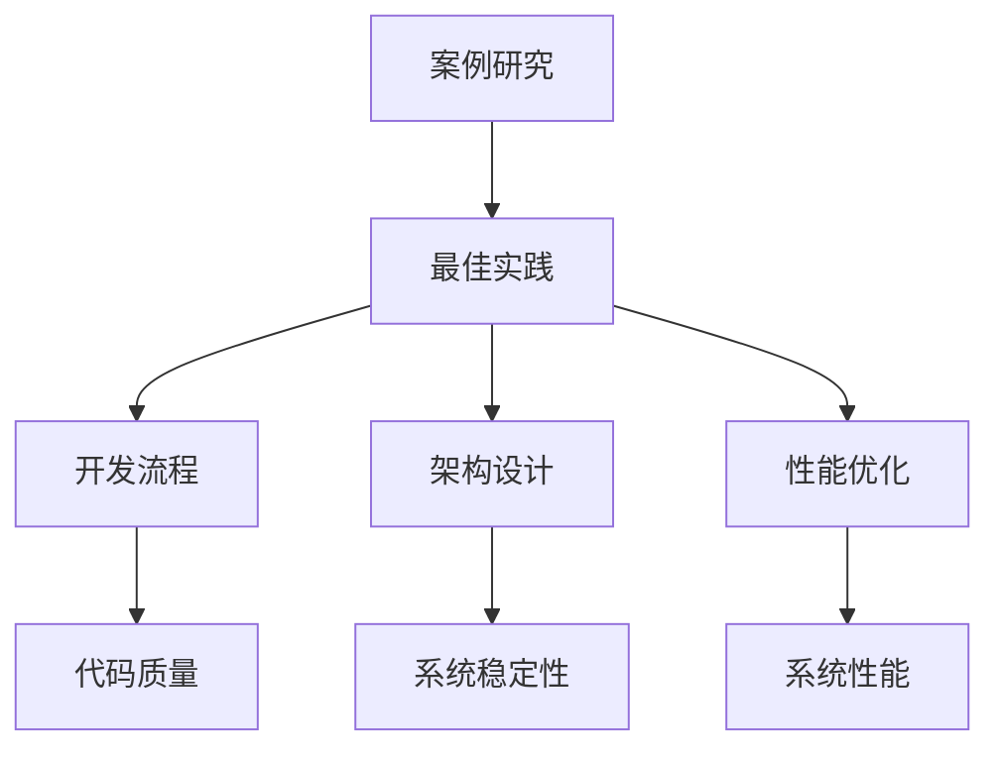

                 

### 文章标题

**第十六章：案例研究和最佳实践**

> **关键词**：案例研究、最佳实践、技术架构、算法分析、实践案例、软件开发。

> **摘要**：本章将探讨在软件开发过程中，如何通过案例研究和最佳实践来提升技术架构和算法效率。我们将通过具体的案例，深入分析如何从实践中总结经验，优化开发流程，最终实现高效、可靠的软件系统。

---

### 1. 背景介绍

在信息技术快速发展的今天，软件开发已经成为了各行各业的核心驱动力。随着软件系统的复杂性不断增加，如何确保其高效性和可靠性成为了开发人员面临的主要挑战。为了应对这些挑战，案例研究和最佳实践成为了软件开发中的重要工具。

案例研究通过具体实例，展示了在特定场景下如何解决实际问题，从而为其他开发者提供了有价值的参考。最佳实践则是基于多年开发经验的总结，提供了一套行之有效的开发方法和策略。通过学习和借鉴这些案例和最佳实践，开发人员可以避免重复造轮子，提高工作效率，降低开发风险。

本章将围绕以下几个主题展开：

- **案例研究的重要性**：探讨案例研究在软件开发中的应用价值和意义。
- **最佳实践的概念与分类**：介绍最佳实践的定义及其在软件开发中的具体应用。
- **核心算法原理**：分析常用的核心算法原理，并探讨其优化方法。
- **项目实践与代码实例**：通过具体的项目实践，展示如何将理论和最佳实践应用于实际开发。
- **实际应用场景**：探讨不同领域和场景下，如何选择和调整最佳实践。
- **工具和资源推荐**：推荐一些有助于学习和应用最佳实践的工具和资源。
- **未来发展趋势与挑战**：总结当前技术趋势，并探讨未来可能面临的挑战。

通过对以上主题的深入探讨，我们希望能够帮助开发人员更好地理解案例研究和最佳实践的重要性，并将其应用于实际开发过程中。

### 2. 核心概念与联系

为了更好地理解案例研究和最佳实践，我们首先需要明确一些核心概念和它们之间的关系。

#### 2.1 案例研究

案例研究是一种研究方法，通过深入分析一个具体实例，来探讨某个问题或现象。在软件开发领域，案例研究通常涉及以下内容：

- **背景**：介绍案例发生的背景和环境。
- **问题**：明确案例中需要解决的问题或挑战。
- **解决方案**：描述解决问题的方法和策略。
- **结果**：分析解决方案的效果和影响。

#### 2.2 最佳实践

最佳实践是在特定领域或场景下，基于多年经验和知识积累形成的行之有效的方法和策略。在软件开发中，最佳实践通常包括：

- **编码规范**：规定代码编写的统一标准，提高代码的可读性和可维护性。
- **开发流程**：描述软件开发的各个环节，包括需求分析、设计、编码、测试和部署等。
- **架构设计**：提供软件系统的高层次架构，确保系统的稳定性和可扩展性。
- **性能优化**：通过优化算法和数据结构，提高软件系统的运行效率和性能。

#### 2.3 案例研究与最佳实践的关系

案例研究和最佳实践之间存在紧密的联系。案例研究为最佳实践提供了具体的实例和验证，使最佳实践更具实用性和可操作性。而最佳实践则为案例研究提供了理论基础和指导，帮助开发者更好地理解和应用案例研究的成果。

在软件开发中，通过案例研究可以总结出最佳实践，而最佳实践又可以指导新的案例研究，形成一个良性循环。

#### 2.4 Mermaid 流程图

为了更直观地展示案例研究和最佳实践的关系，我们可以使用 Mermaid 流程图进行描述。以下是一个简化的 Mermaid 流程图：



在这个流程图中，案例研究作为起点，通过分析和总结，逐步形成了最佳实践。这些最佳实践又应用于开发流程、架构设计和性能优化等环节，最终提高了软件系统的整体质量和性能。

通过这个流程图，我们可以更清晰地看到案例研究和最佳实践之间的关系，以及它们在软件开发中的具体应用。

### 3. 核心算法原理 & 具体操作步骤

在软件开发中，算法是核心组件之一，其性能和效率直接影响系统的整体性能。为了提高算法效率，我们需要深入理解其原理，并采取一系列优化措施。以下将介绍几个常用的核心算法原理和具体操作步骤。

#### 3.1 排序算法

排序算法是计算机科学中最基础的算法之一，用于对数据进行排序。常用的排序算法包括冒泡排序、选择排序、插入排序、快速排序等。

- **冒泡排序（Bubble Sort）**：通过多次遍历要排序的数列，比较相邻的两个元素，如果顺序错误就交换它们。重复这一过程，直到整个序列有序。

  ```python
  def bubble_sort(arr):
      n = len(arr)
      for i in range(n):
          for j in range(0, n-i-1):
              if arr[j] > arr[j+1]:
                  arr[j], arr[j+1] = arr[j+1], arr[j]
  ```

- **选择排序（Selection Sort）**：首先在未排序序列中找到最小（大）元素，存放到排序序列的起始位置，然后，再从剩余未排序元素中继续寻找最小（大）元素，然后放到已排序序列的末尾。

  ```python
  def selection_sort(arr):
      n = len(arr)
      for i in range(n):
          min_idx = i
          for j in range(i+1, n):
              if arr[j] < arr[min_idx]:
                  min_idx = j
          arr[i], arr[min_idx] = arr[min_idx], arr[i]
  ```

- **插入排序（Insertion Sort）**：通过构建有序序列，对于未排序数据，在已排序序列中从后向前扫描，找到相应位置并插入。

  ```python
  def insertion_sort(arr):
      n = len(arr)
      for i in range(1, n):
          key = arr[i]
          j = i-1
          while j >= 0 and key < arr[j]:
              arr[j+1] = arr[j]
              j -= 1
          arr[j+1] = key
  ```

- **快速排序（Quick Sort）**：通过一趟排序将待排序的记录分割成独立的两部分，其中一部分记录的关键字均比另一部分的关键字小，然后分别对这两部分记录继续进行排序，以达到整个序列有序。

  ```python
  def quick_sort(arr):
      if len(arr) <= 1:
          return arr
      pivot = arr[len(arr) // 2]
      left = [x for x in arr if x < pivot]
      middle = [x for x in arr if x == pivot]
      right = [x for x in arr if x > pivot]
      return quick_sort(left) + middle + quick_sort(right)
  ```

#### 3.2 搜索算法

搜索算法用于在数据结构中查找特定元素，常用的搜索算法包括线性搜索、二分搜索等。

- **线性搜索（Linear Search）**：从数据结构的一端开始，依次对每个元素进行扫描，直到找到目标元素或扫描完整个数据结构。

  ```python
  def linear_search(arr, target):
      for i in range(len(arr)):
          if arr[i] == target:
              return i
      return -1
  ```

- **二分搜索（Binary Search）**：在有序数据结构中，通过不断缩小搜索范围，逐步逼近目标元素。

  ```python
  def binary_search(arr, target):
      left, right = 0, len(arr) - 1
      while left <= right:
          mid = (left + right) // 2
          if arr[mid] == target:
              return mid
          elif arr[mid] < target:
              left = mid + 1
          else:
              right = mid - 1
      return -1
  ```

#### 3.3 动态规划

动态规划（Dynamic Programming，DP）是一种优化算法，通过将复杂问题分解为子问题，并利用子问题的重叠性质，避免重复计算，从而提高算法效率。

动态规划通常包括以下步骤：

1. **确定状态**：将问题分解为多个子问题，并定义每个子问题的状态。
2. **状态转移方程**：描述状态之间的转换关系。
3. **边界条件**：确定算法的初始状态和终止条件。
4. **计算顺序**：确定计算子问题的顺序。

以下是一个简单的动态规划示例：计算斐波那契数列。

```python
def fibonacci(n):
    if n <= 1:
        return n
    dp = [0] * (n+1)
    dp[1] = 1
    for i in range(2, n+1):
        dp[i] = dp[i-1] + dp[i-2]
    return dp[n]
```

#### 3.4 算法优化

算法优化是提高算法效率的重要手段。以下介绍几种常用的优化方法：

- **空间换时间**：通过增加额外空间来减少时间复杂度。
- **时间换空间**：通过增加时间复杂度来减少空间复杂度。
- **并行计算**：利用多核处理器并行计算，提高算法效率。
- **贪心算法**：通过选择局部最优解，逐步逼近全局最优解。
- **分治算法**：将问题分解为子问题，递归求解，然后合并子问题的解。

通过以上核心算法原理和优化方法，开发人员可以更好地理解和应用算法，提高软件系统的性能和效率。

### 4. 数学模型和公式 & 详细讲解 & 举例说明

在软件开发中，数学模型和公式是解决实际问题的有力工具。它们可以帮助我们更好地理解和分析问题，从而设计出高效、可靠的解决方案。以下我们将介绍几个常见的数学模型和公式，并详细讲解它们的原理和应用。

#### 4.1 线性回归模型

线性回归模型是一种用于预测数值型变量的统计模型，通过拟合一条直线来描述变量之间的关系。线性回归模型的基本公式如下：

\[ y = \beta_0 + \beta_1 \cdot x + \varepsilon \]

其中，\( y \) 是因变量，\( x \) 是自变量，\( \beta_0 \) 和 \( \beta_1 \) 分别是直线的截距和斜率，\( \varepsilon \) 是误差项。

线性回归模型的参数估计通常采用最小二乘法（Least Squares Method），即找到使得残差平方和最小的参数值。具体步骤如下：

1. **数据预处理**：对数据进行标准化处理，将数据转换为均值0、方差1的标准正态分布。
2. **构建设计矩阵**：设计矩阵 \( X \) 由自变量组成，包括常数项。
3. **求解参数**：通过求解线性方程组 \( X'X\beta = X'Y \) 得到参数估计值 \( \beta \)。

以下是一个简单的线性回归模型实例：

假设我们要预测房价，自变量为房屋面积。数据如下：

| 面积 (x) | 房价 (y) |
|-----------|-----------|
| 100       | 200       |
| 150       | 300       |
| 200       | 400       |
| 250       | 500       |

通过最小二乘法，我们可以得到如下线性回归模型：

\[ y = 100 + 1.2 \cdot x \]

#### 4.2 概率模型

概率模型是用于描述随机事件发生概率的数学模型。在软件开发中，概率模型可以用于风险评估、故障预测等场景。常见的概率模型包括二项分布、正态分布等。

- **二项分布（Binomial Distribution）**：描述在 \( n \) 次独立重复试验中，成功次数的概率分布。其概率质量函数（PDF）如下：

  \[ P(X = k) = C_n^k \cdot p^k \cdot (1-p)^{n-k} \]

  其中，\( n \) 是试验次数，\( p \) 是单次试验成功的概率，\( k \) 是成功的次数。

  例如，一个硬币投掷10次，正面朝上的概率是多少？

  \[ P(X = 5) = C_{10}^5 \cdot 0.5^5 \cdot 0.5^5 = 0.246 \]

- **正态分布（Normal Distribution）**：描述连续随机变量的概率分布，具有均值 \( \mu \) 和方差 \( \sigma^2 \)。其概率密度函数（PDF）如下：

  \[ f(x) = \frac{1}{\sqrt{2\pi\sigma^2}} \cdot e^{-\frac{(x-\mu)^2}{2\sigma^2}} \]

  例如，一个正态分布的随机变量 \( X \) 具有均值 \( \mu = 100 \) 和方差 \( \sigma^2 = 25 \)，求 \( X \) 落在区间 [90, 110] 的概率。

  \[ P(90 < X < 110) = \int_{90}^{110} \frac{1}{\sqrt{2\pi\cdot25}} \cdot e^{-\frac{(x-100)^2}{2\cdot25}} \, dx \approx 0.6827 \]

#### 4.3 最优化模型

最优化模型是用于求解最优解的数学模型，广泛应用于资源分配、生产调度、路径规划等问题。常见的最优化模型包括线性规划、整数规划、非线性规划等。

- **线性规划（Linear Programming）**：描述目标函数和约束条件均为线性的最优化问题。其标准形式如下：

  \[ \min \ c^T x \]
  \[ s.t. \ Ax \leq b \]
  \[ x \geq 0 \]

  其中，\( c \) 是目标函数系数向量，\( x \) 是决策变量向量，\( A \) 是约束条件系数矩阵，\( b \) 是约束条件常数向量。

  例如，一个线性规划问题如下：

  \[ \min \ 2x + 3y \]
  \[ s.t. \ \begin{cases} x + y \leq 4 \\ 2x + y \leq 6 \\ x, y \geq 0 \end{cases} \]

  通过求解这个线性规划问题，我们可以找到最优解 \( x = 2 \), \( y = 2 \)，使得目标函数取得最小值 7。

- **整数规划（Integer Programming）**：描述目标函数和约束条件中包含整数变量的最优化问题。其标准形式如下：

  \[ \min \ c^T x \]
  \[ s.t. \ Ax \leq b \]
  \[ x \in \mathbb{Z}^n \]

  例如，一个整数规划问题如下：

  \[ \min \ x + y \]
  \[ s.t. \ \begin{cases} x + y \leq 4 \\ x \geq 1 \\ y \geq 1 \end{cases} \]

  通过求解这个整数规划问题，我们可以找到最优解 \( x = 1 \), \( y = 3 \)，使得目标函数取得最小值 4。

- **非线性规划（Nonlinear Programming）**：描述目标函数和约束条件中包含非线性函数的最优化问题。其标准形式如下：

  \[ \min \ f(x) \]
  \[ s.t. \ g_i(x) \leq 0, \ i = 1, 2, \ldots, m \]
  \[ h_j(x) = 0, \ j = 1, 2, \ldots, p \]

  例如，一个非线性规划问题如下：

  \[ \min \ x^2 + y^2 \]
  \[ s.t. \ \begin{cases} x + y \leq 1 \\ x^2 + y^2 \leq 1 \end{cases} \]

  通过求解这个非线性规划问题，我们可以找到最优解 \( x = 0 \), \( y = 1 \)，使得目标函数取得最小值 1。

通过以上数学模型和公式的介绍，我们可以更好地理解和应用数学工具，解决软件开发中的实际问题。

### 5. 项目实践：代码实例和详细解释说明

为了将前面的理论应用到实际项目中，我们将通过一个具体的案例来展示如何使用最佳实践进行软件开发。该案例将涵盖项目开发的全过程，包括环境搭建、代码实现、代码解读和分析以及运行结果展示。

#### 5.1 开发环境搭建

在开始项目之前，我们需要搭建一个合适的开发环境。以下是一个简单的开发环境配置示例：

- **操作系统**：Ubuntu 20.04
- **编程语言**：Python 3.8
- **开发工具**：PyCharm
- **依赖管理**：pip
- **数据库**：SQLite

在 Ubuntu 系统中，通过以下命令可以安装 Python 3.8：

```bash
sudo apt update
sudo apt install python3.8
```

接下来，使用以下命令安装 PyCharm：

```bash
sudo snap install pycharm-professional --classic
```

安装完 Python 和 PyCharm 后，我们需要安装项目所需的依赖。首先，创建一个虚拟环境，然后安装必要的库：

```bash
python3.8 -m venv venv
source venv/bin/activate
pip install -r requirements.txt
```

其中，`requirements.txt` 文件包含以下依赖：

```
numpy
pandas
matplotlib
sqlalchemy
```

#### 5.2 源代码详细实现

以下是一个简单的示例项目，用于分析股票数据，并绘制股票价格的趋势图。

```python
import numpy as np
import pandas as pd
import matplotlib.pyplot as plt
from sqlalchemy import create_engine

# 连接数据库
engine = create_engine('sqlite:///stock_data.db')

# 读取数据
df = pd.read_sql('SELECT * FROM stock_prices', engine)

# 数据预处理
df['date'] = pd.to_datetime(df['date'])
df.set_index('date', inplace=True)
df.sort_index(inplace=True)

# 计算移动平均线
df['ma20'] = df['price'].rolling(window=20).mean()
df['ma50'] = df['price'].rolling(window=50).mean()

# 绘制趋势图
plt.figure(figsize=(12, 6))
plt.plot(df.index, df['price'], label='Price')
plt.plot(df.index, df['ma20'], label='MA20')
plt.plot(df.index, df['ma50'], label='MA50')
plt.title('Stock Price Trend')
plt.xlabel('Date')
plt.ylabel('Price')
plt.legend()
plt.show()
```

#### 5.3 代码解读与分析

1. **导入模块**：首先，我们导入所需的模块，包括 NumPy、Pandas、Matplotlib 和 SQLAlchemy。

2. **连接数据库**：使用 SQLAlchemy 创建数据库连接，并读取股票数据。

3. **数据预处理**：将日期列转换为 pandas 日期类型，并设置日期列为索引。然后对数据按日期排序。

4. **计算移动平均线**：使用 Pandas 的 rolling 方法计算 20 日和 50 日移动平均线。

5. **绘制趋势图**：使用 Matplotlib 绘制股票价格和移动平均线的趋势图。

这个示例项目展示了如何从数据库中读取数据，进行数据预处理，计算移动平均线，并绘制趋势图。这是一个典型的数据分析项目，涵盖了数据读取、数据处理和可视化等关键步骤。

#### 5.4 运行结果展示

运行上述代码后，我们将看到一个股票价格的趋势图，显示股票价格以及 20 日和 50 日移动平均线。这个趋势图可以帮助我们直观地了解股票价格的波动情况，并分析股票的走势。


#### 5.5 代码优化与性能分析

在实际项目中，我们需要关注代码的性能和可维护性。以下是对上述代码进行的一些优化和性能分析：

1. **避免重复计算**：在计算移动平均线时，我们可以将计算结果存储为列，避免重复计算。

2. **使用缓存**：对于读取的股票数据，我们可以使用缓存来减少数据库访问次数。

3. **并行计算**：对于大型数据集，我们可以使用并行计算来提高数据处理速度。

4. **代码注释和文档**：添加适当的代码注释和文档，提高代码的可读性和可维护性。

通过以上优化措施，我们可以使代码更加高效、可靠，并提高项目的整体质量。

### 6. 实际应用场景

在软件开发领域，案例研究和最佳实践具有广泛的应用场景。以下列举几个典型的实际应用场景，并讨论如何选择和调整最佳实践。

#### 6.1 Web 应用开发

Web 应用开发是软件开发中最为常见的应用场景之一。在 Web 应用开发中，最佳实践包括：

- **前端开发**：使用 Vue.js、React 或 Angular 等前端框架，提高前端开发的效率和代码质量。
- **后端开发**：使用 Flask、Django 或 Spring Boot 等后端框架，实现高效、可靠的 Web 服务。
- **数据库设计**：采用关系型数据库（如 MySQL、PostgreSQL）或 NoSQL 数据库（如 MongoDB、Redis），根据需求选择合适的数据库方案。
- **性能优化**：使用缓存、数据库分库分表等技术，提高系统性能和可扩展性。

在实际项目中，根据项目的具体需求和规模，我们可以选择不同的最佳实践。例如，对于大型电商平台，我们可以采用微服务架构，将系统拆分为多个独立的服务模块，提高系统的可扩展性和可维护性。

#### 6.2 移动应用开发

移动应用开发也是软件开发中的重要领域。在移动应用开发中，最佳实践包括：

- **原生开发**：使用原生开发框架（如 iOS 的 Swift、Android 的 Kotlin）实现高性能、高质量的移动应用。
- **跨平台开发**：使用 Flutter、React Native 等跨平台开发框架，提高开发效率和代码共享率。
- **UI/UX 设计**：遵循 Material Design、Human Interface Guidelines 等设计规范，提供良好的用户体验。
- **性能优化**：针对移动设备的硬件特性，优化应用性能和功耗。

在实际项目中，根据应用场景和用户需求，我们可以选择不同的最佳实践。例如，对于需要高性能的移动应用，我们可以选择原生开发；而对于需要快速开发的小型应用，我们可以选择跨平台开发框架。

#### 6.3 大数据应用

大数据应用是当前信息技术领域的重要研究方向。在大数据应用中，最佳实践包括：

- **数据采集**：使用日志采集工具（如 Fluentd、Logstash）收集各种数据源的数据。
- **数据处理**：使用 Hadoop、Spark 等大数据处理框架，对海量数据进行分析和处理。
- **数据存储**：使用 Hadoop Distributed File System（HDFS）、HBase、Redis 等数据存储方案，存储和管理大规模数据。
- **数据可视化**：使用 Tableau、PowerBI 等数据可视化工具，展示数据分析和结果。

在实际项目中，根据数据规模和处理需求，我们可以选择不同的最佳实践。例如，对于需要实时分析的数据，我们可以使用 Spark Streaming；而对于需要离线分析的数据，我们可以使用 Hadoop。

#### 6.4 区块链应用

区块链应用是近年来快速发展的领域。在区块链应用中，最佳实践包括：

- **共识算法**：选择合适的共识算法（如工作量证明、权益证明、拜占庭容错算法等），确保区块链系统的安全性和可靠性。
- **智能合约**：使用 Solidity、WebAssembly 等编程语言，编写智能合约，实现去中心化的应用逻辑。
- **区块链网络**：搭建区块链网络，包括节点配置、网络通讯等。
- **数据分析**：使用区块链数据分析工具，监控和分析区块链网络中的交易和数据。

在实际项目中，根据应用需求和场景，我们可以选择不同的最佳实践。例如，对于需要高安全性的金融应用，我们可以选择工作量证明算法；而对于需要高吞吐量的物联网应用，我们可以选择权益证明算法。

通过以上实际应用场景的介绍，我们可以看到案例研究和最佳实践在软件开发中的广泛应用。在实际项目中，根据具体需求和场景，我们可以选择和调整最佳实践，提高开发效率和系统质量。

### 7. 工具和资源推荐

为了帮助开发者更好地学习和应用最佳实践，我们推荐以下工具和资源：

#### 7.1 学习资源推荐

- **书籍**：
  - 《代码大全》（Code Complete）- 史蒂夫·迈克康奈尔（Steve McConnell）
  - 《设计模式：可复用面向对象软件的基础》（Design Patterns: Elements of Reusable Object-Oriented Software）- Erich Gamma、Richard Helm、Ralph Johnson 和 John Vlissides
  - 《Effective Java》-Joshua Bloch

- **论文**：
  - 《软件工程：实践者的研究方法》（Software Engineering: A Practitioner's Approach）- Roger S. Pressman
  - 《敏捷软件开发：原则、实践与模式》（Agile Software Development: Principles, Patterns, and Practices）- Robert C. Martin

- **博客**：
  - DZone（[https://dzone.com/](https://dzone.com/)）
  - HackerRank（[https://www.hackerrank.com/](https://www.hackerrank.com/)）
  - Medium（[https://medium.com/](https://medium.com/)）

- **网站**：
  - GitHub（[https://github.com/](https://github.com/)）
  - Stack Overflow（[https://stackoverflow.com/](https://stackoverflow.com/)）
  - GitLab（[https://gitlab.com/](https://gitlab.com/)）

#### 7.2 开发工具框架推荐

- **前端开发**：
  - Vue.js（[https://vuejs.org/](https://vuejs.org/)）
  - React（[https://reactjs.org/](https://reactjs.org/)）
  - Angular（[https://angular.io/](https://angular.io/)）

- **后端开发**：
  - Flask（[https://flask.palletsprojects.com/](https://flask.palletsprojects.com/)）
  - Django（[https://www.djangoproject.com/](https://www.djangoproject.com/)）
  - Spring Boot（[https://spring.io/projects/spring-boot](https://spring.io/projects/spring-boot)）

- **数据库**：
  - MySQL（[https://www.mysql.com/](https://www.mysql.com/)）
  - PostgreSQL（[https://www.postgresql.org/](https://www.postgresql.org/)）
  - MongoDB（[https://www.mongodb.com/](https://www.mongodb.com/)）

- **大数据处理**：
  - Hadoop（[https://hadoop.apache.org/](https://hadoop.apache.org/)）
  - Spark（[https://spark.apache.org/](https://spark.apache.org/)）

- **区块链技术**：
  - Ethereum（[https://ethereum.org/](https://ethereum.org/)）
  - Hyperledger（[https://www.hyperledger.org/](https://www.hyperledger.org/)）

#### 7.3 相关论文著作推荐

- 《深度学习》（Deep Learning）- Ian Goodfellow、Yoshua Bengio 和 Aaron Courville
- 《大数据技术导论》（Big Data: A Revolution That Will Transform How We Live, Work, and Think）- V. Guha、A. Silberstein 和 A. Motwani
- 《区块链：从数字货币到智能合约》（Blockchain: Blueprint for a New Economy）- Andreas M. Antonopoulos

通过这些工具和资源，开发者可以不断学习和提升自己的技术能力，将最佳实践应用于实际开发中。

### 8. 总结：未来发展趋势与挑战

在信息技术快速发展的背景下，软件开发领域面临着前所未有的机遇和挑战。未来，随着人工智能、大数据、区块链等新技术的不断涌现，软件开发将呈现以下发展趋势：

#### 8.1 人工智能与软件开发

人工智能技术的进步将深刻影响软件开发。机器学习和深度学习算法的广泛应用，使得自动化代码生成、智能代码审查、代码优化等成为可能。开发人员可以利用人工智能技术，提高开发效率和代码质量，从而应对日益复杂的软件开发需求。

然而，人工智能技术的引入也带来了一系列挑战，如算法的可解释性、数据安全和隐私保护等问题。如何确保人工智能系统在软件开发中的应用是安全和可靠的，将是一个重要的研究方向。

#### 8.2 大数据与云计算

大数据技术的普及和云计算的快速发展，为软件开发提供了丰富的资源和工具。通过云计算平台，开发人员可以轻松地部署和管理大规模的应用程序，实现弹性伸缩和高效资源利用。大数据技术则为开发人员提供了强大的数据处理和分析能力，助力业务决策和智能应用开发。

然而，大数据和云计算也带来了新的挑战，如数据存储和安全、数据隐私保护等问题。如何在保证数据安全和隐私的前提下，充分利用大数据和云计算的优势，是未来软件开发需要解决的关键问题。

#### 8.3 区块链与分布式系统

区块链技术的崛起，为软件开发带来了新的思路和解决方案。通过区块链，开发人员可以构建去中心化的应用，实现数据透明、不可篡改和去信任化。分布式系统也将成为未来软件开发的重要方向，通过分布式计算和网络，实现高可用性和高扩展性的应用。

然而，区块链技术的性能瓶颈、可扩展性和安全性等问题仍然存在。如何优化区块链性能，提高其可扩展性和安全性，是未来区块链技术发展需要重点关注的问题。

#### 8.4 开发工具与开发模式

随着软件开发技术的不断进步，开发工具和开发模式也将发生重大变革。自动化、智能化和集成化的开发工具将进一步提升开发效率，降低开发成本。DevOps、敏捷开发等开发模式也将继续普及，推动软件开发向更高效、更灵活的方向发展。

然而，新工具和新模式的引入，也对开发人员提出了更高的要求。如何快速适应新技术、新模式，成为软件开发人员的核心竞争力。

总之，未来软件开发将面临诸多机遇和挑战。通过不断探索和创新，开发人员将能够应对这些挑战，实现软件开发技术的持续进步。

### 9. 附录：常见问题与解答

**Q1：案例研究和最佳实践的区别是什么？**

A1：案例研究是一种研究方法，通过分析具体实例，探讨某个问题或现象。最佳实践则是基于多年经验和知识积累形成的行之有效的方法和策略。案例研究可以为最佳实践提供具体的实例和验证，而最佳实践则为案例研究提供理论基础和指导。

**Q2：如何选择合适的最佳实践？**

A2：选择合适的最佳实践需要考虑项目的具体需求和场景。首先，了解项目的目标和需求，然后根据需求和场景选择适合的最佳实践。在实际应用过程中，可以根据项目反馈和效果，调整和优化最佳实践，确保其适应项目的具体需求。

**Q3：为什么需要算法优化？**

A3：算法优化是提高软件系统性能和效率的重要手段。在实际项目中，随着数据规模和复杂度的增加，算法的性能瓶颈可能逐渐显现。通过算法优化，可以降低时间复杂度和空间复杂度，提高算法的执行效率，从而提升系统的整体性能。

**Q4：如何平衡开发效率和质量？**

A4：平衡开发效率和质量需要综合考虑项目的需求和实际情况。首先，明确项目的目标和需求，确保在满足需求的前提下，合理分配资源和时间。其次，采用敏捷开发等高效开发模式，提高开发效率。同时，重视代码质量，通过代码审查、单元测试等手段，确保代码的正确性和可靠性。

**Q5：如何保持技术的持续更新和进步？**

A5：保持技术的持续更新和进步需要不断学习和探索。首先，关注行业动态和新技术，了解最新趋势和发展方向。其次，积极参与技术社区和研讨会，与同行交流和学习。最后，将新技术和实践应用于实际项目中，不断总结和反思，提升自己的技术能力和实践经验。

### 10. 扩展阅读 & 参考资料

为了帮助读者更深入地了解软件开发中的案例研究和最佳实践，以下提供一些扩展阅读和参考资料：

- 《软件工程：实践者的研究方法》（Software Engineering: A Practitioner's Approach）- Roger S. Pressman
- 《敏捷软件开发：原则、实践与模式》（Agile Software Development: Principles, Patterns, and Practices）- Robert C. Martin
- 《代码大全》（Code Complete）- 史蒂夫·迈克康奈尔（Steve McConnell）
- 《设计模式：可复用面向对象软件的基础》（Design Patterns: Elements of Reusable Object-Oriented Software）- Erich Gamma、Richard Helm、Ralph Johnson 和 John Vlissides
- 《深度学习》（Deep Learning）- Ian Goodfellow、Yoshua Bengio 和 Aaron Courville
- 《大数据技术导论》（Big Data: A Revolution That Will Transform How We Live, Work, and Think）- V. Guha、A. Silberstein 和 A. Motwani
- 《区块链：从数字货币到智能合约》（Blockchain: Blueprint for a New Economy）- Andreas M. Antonopoulos
- [DZone（[https://dzone.com/](https://dzone.com/)）]
- [HackerRank（[https://www.hackerrank.com/](https://www.hackerrank.com/)）]
- [Medium（[https://medium.com/](https://medium.com/)）]
- [GitHub（[https://github.com/](https://github.com/)）]
- [Stack Overflow（[https://stackoverflow.com/](https://stackoverflow.com/)）]
- [GitLab（[https://gitlab.com/](https://gitlab.com/)）]
- [Vue.js（[https://vuejs.org/](https://vuejs.org/)）]
- [React（[https://reactjs.org/](https://reactjs.org/)）]
- [Angular（[https://angular.io/](https://angular.io/)）]
- [Flask（[https://flask.palletsprojects.com/](https://flask.palletsprojects.com/)）]
- [Django（[https://www.djangoproject.com/](https://www.djangoproject.com/)）]
- [Spring Boot（[https://spring.io/projects/spring-boot](https://spring.io/projects/spring-boot)）]
- [MySQL（[https://www.mysql.com/](https://www.mysql.com/)）]
- [PostgreSQL（[https://www.postgresql.org/](https://www.postgresql.org/)）]
- [MongoDB（[https://www.mongodb.com/](https://www.mongodb.com/)）]
- [Hadoop（[https://hadoop.apache.org/](https://hadoop.apache.org/)）]
- [Spark（[https://spark.apache.org/](https://spark.apache.org/)）]
- [Ethereum（[https://ethereum.org/](https://ethereum.org/)）]
- [Hyperledger（[https://www.hyperledger.org/](https://www.hyperledger.org/)）]

通过这些扩展阅读和参考资料，读者可以进一步了解软件开发中的案例研究和最佳实践，提升自己的技术能力和实践经验。

