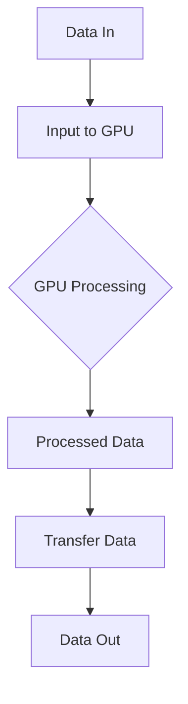

                 

### 1. 背景介绍

#### 计算能力的演变

计算能力是推动科技进步的重要驱动力，随着时间的发展，计算能力的提升经历了几个关键阶段。从最初的电子管计算机到晶体管计算机，再到集成电路（IC）和如今的GPU（图形处理单元），每一次技术的革新都极大地提升了计算速度和处理能力。

- **电子管计算机**：20世纪40年代至50年代，电子管是计算机的主要组件。尽管其体积庞大、功耗高，但为后续技术的发展奠定了基础。

- **晶体管计算机**：20世纪50年代至60年代，晶体管的出现取代了体积更大的电子管，使计算机变得更小、更高效。这一阶段标志着计算能力的大幅提升。

- **集成电路**：20世纪60年代至70年代，集成电路的发明使得计算机组件更加紧凑，计算能力进一步增强。集成电路的出现也促进了微处理器的发展。

- **GPU**：21世纪初，GPU在图形处理领域表现出色，但其强大的并行计算能力开始被其他领域重视。NVIDIA等公司推出了一系列针对通用计算的GPU（GPGPU），使得高性能计算（HPC）领域迎来了新的契机。

#### 算力革命

近年来，随着大数据、人工智能（AI）、机器学习（ML）等领域的快速发展，对计算能力的需求日益增长。传统的CPU在处理这些复杂任务时显得力不从心，而GPU凭借其高度并行的架构，成为了算力革命的关键推动力。

- **并行计算**：GPU由成千上万的并行处理单元（CUDA核心）组成，这使得其能够高效地处理大量并行任务。

- **AI与机器学习**：AI和ML模型通常涉及大量的矩阵运算和并行处理，GPU能够显著加速这些计算过程。

- **大数据处理**：GPU在处理大数据集时能够提供更高的吞吐量和更快的查询速度。

#### NVIDIA的角色

在算力革命中，NVIDIA作为GPU的先驱，扮演了至关重要的角色。通过不断创新和优化GPU架构，NVIDIA不仅推动了图形处理技术的发展，还在高性能计算和AI领域取得了显著成就。

- **GPU架构**：NVIDIA的GPU架构，如CUDA和GPU Computing SDK，为开发者提供了强大的并行计算能力。

- **AI工具链**：NVIDIA推出了如TensorRT和GPU Cloud等工具，为AI模型的训练和推理提供了高效的解决方案。

- **开源生态**：NVIDIA积极推动开源项目，如CUDA和cuDNN，为全球开发者提供了丰富的资源和支持。

### 2. 核心概念与联系

在深入探讨NVIDIA在算力革命中的作用之前，我们需要了解一些核心概念和技术。

#### 核心概念

- **GPU**：图形处理单元，由大量并行处理单元（CUDA核心）组成，专门用于图形渲染，但也被广泛应用于高性能计算和AI。

- **CUDA**：NVIDIA推出的并行计算平台和编程模型，允许开发者利用GPU的并行架构进行通用计算。

- **深度学习**：一种机器学习技术，通过模拟人脑的神经网络结构，实现数据的自动分类、识别和预测。

- **TensorFlow**：Google推出的开源深度学习框架，支持多种编程语言，如Python。

- **PyTorch**：另一种流行的开源深度学习框架，以动态计算图著称。

#### 架构联系

以下是一个简化的Mermaid流程图，展示了GPU在深度学习和高性能计算中的应用架构：



- **数据输入（A）**：数据从主机传输到GPU。
- **GPU处理（B）**：GPU利用其并行架构进行数据处理。
- **处理后的数据（D）**：处理后的数据从GPU传输回主机。
- **数据输出（F）**：最终的数据输出到其他系统或应用。

#### CUDA核心与深度学习

CUDA核心是GPU的并行处理单元，每个核心可以独立执行指令。在深度学习任务中，CUDA核心被用于执行大量的矩阵运算和向量计算，这大大提高了模型的训练速度。

- **并行矩阵运算**：深度学习模型中的矩阵乘法和矩阵加法等运算可以在多个CUDA核心上并行执行，显著提高了计算效率。
- **向量计算**：向量计算也是深度学习中的重要组成部分，CUDA核心可以高效地处理这些计算任务。

#### TensorFlow与PyTorch

- **TensorFlow**：TensorFlow是一个广泛使用的深度学习框架，其核心组件TensorFlow Lite和TensorFlow Extended支持在GPU上进行高效计算。TensorFlow利用GPU的并行计算能力，实现了模型的快速训练和推理。

- **PyTorch**：PyTorch是另一个流行的深度学习框架，其动态计算图和简洁的API使其在学术界和工业界得到了广泛应用。PyTorch与CUDA紧密结合，可以通过PyTorch CUDA扩展高效利用GPU进行计算。

### 3. 核心算法原理 & 具体操作步骤

在了解了GPU和深度学习的基本概念后，我们接下来探讨NVIDIA在算力革命中的核心算法原理和具体操作步骤。

#### CUDA核心与并行计算

CUDA（Compute Unified Device Architecture）是NVIDIA推出的并行计算平台，它允许开发者利用GPU的并行架构进行通用计算。以下是CUDA核心的基本原理和操作步骤：

- **并行计算原理**：GPU由成千上万的CUDA核心组成，每个核心可以独立执行指令。这种高度并行的架构使得GPU在处理大量并行任务时具有显著的性能优势。

- **安装CUDA**：首先需要在计算机上安装CUDA工具包，这通常包括CUDA运行时库和开发工具。安装过程可通过NVIDIA官方网站获得详细指南。

- **编写CUDA程序**：开发者可以使用C++或Python等编程语言编写CUDA程序。CUDA程序的核心是核函数（kernel），它可以在GPU核心上并行执行。以下是一个简单的CUDA核函数示例：

  ```cpp
  __global__ void add(int *a, int *b, int *c) {
      int index = threadIdx.x + blockIdx.x * blockDim.x;
      c[index] = a[index] + b[index];
  }
  ```

  - `__global__`：指定这是一个核函数。
  - `int *a, *b, *c`：指向输入和输出数组的指针。
  - `threadIdx.x`和`blockIdx.x`：线程索引和块索引。
  - `blockDim.x`：每个块的线程数量。

- **编译和运行CUDA程序**：编写CUDA程序后，需要使用CUDA编译器进行编译，生成可执行文件。编译器会将CUDA程序转换成GPU可执行的代码。编译成功后，可以通过命令行运行程序。

#### 深度学习算法原理

深度学习是一种通过模拟人脑神经网络结构来实现数据自动分类、识别和预测的机器学习技术。以下是深度学习算法的基本原理和操作步骤：

- **神经网络架构**：神经网络由多个层次（层）组成，包括输入层、隐藏层和输出层。每层包含多个神经元（节点），神经元之间通过权重和偏置进行连接。

- **前向传播**：输入数据从输入层传递到隐藏层，然后逐层传递到输出层。在每个层次，神经元的输出通过激活函数进行处理。

- **反向传播**：计算输出层到隐藏层，再到输入层的误差，并通过梯度下降法调整权重和偏置。

- **训练模型**：通过多次迭代训练模型，使其能够准确地预测目标数据。

以下是使用PyTorch框架实现一个简单的深度神经网络模型的步骤：

```python
import torch
import torch.nn as nn
import torch.optim as optim

# 定义神经网络架构
class NeuralNetwork(nn.Module):
    def __init__(self):
        super(NeuralNetwork, self).__init__()
        self.layer1 = nn.Linear(in_features=784, out_features=256)
        self.relu = nn.ReLU()
        self.layer2 = nn.Linear(in_features=256, out_features=128)
        self.dropout = nn.Dropout(p=0.5)
        self.layer3 = nn.Linear(in_features=128, out_features=10)

    def forward(self, x):
        x = self.layer1(x)
        x = self.relu(x)
        x = self.dropout(x)
        x = self.layer2(x)
        x = self.relu(x)
        x = self.layer3(x)
        return x

# 创建神经网络实例
model = NeuralNetwork()

# 定义损失函数和优化器
criterion = nn.CrossEntropyLoss()
optimizer = optim.Adam(model.parameters(), lr=0.001)

# 训练模型
for epoch in range(100):
    for inputs, labels in data_loader:
        optimizer.zero_grad()
        outputs = model(inputs)
        loss = criterion(outputs, labels)
        loss.backward()
        optimizer.step()

    print(f'Epoch [{epoch+1}/100], Loss: {loss.item()}')
```

- `NeuralNetwork`：定义神经网络架构。
- `super(NeuralNetwork, self).__init__()`：继承自`nn.Module`类。
- `nn.Linear()`：全连接层。
- `nn.ReLU()`：ReLU激活函数。
- `nn.Dropout()`： dropout层。
- `nn.CrossEntropyLoss()`：交叉熵损失函数。
- `optim.Adam()`：Adam优化器。

### 4. 数学模型和公式 & 详细讲解 & 举例说明

在深入了解NVIDIA的GPU在深度学习中的应用之前，我们需要掌握一些关键的数学模型和公式，这些是理解深度学习算法原理的基础。

#### 深度学习中的基本数学模型

1. **线性模型**：线性模型是最简单的深度学习模型，其输出由输入和权重线性组合得到。数学表达式如下：

   $$y = \mathbf{W} \cdot \mathbf{x} + b$$

   - \(y\)：输出。
   - \(\mathbf{W}\)：权重矩阵。
   - \(\mathbf{x}\)：输入向量。
   - \(b\)：偏置项。

2. **激活函数**：激活函数用于引入非线性因素，常见的激活函数包括ReLU（Rectified Linear Unit）和Sigmoid函数。

   - **ReLU函数**：

     $$\text{ReLU}(x) = \max(0, x)$$

   - **Sigmoid函数**：

     $$\text{Sigmoid}(x) = \frac{1}{1 + e^{-x}}$$

3. **损失函数**：损失函数用于评估模型的预测结果与实际结果之间的差异，常见的损失函数包括均方误差（MSE）和交叉熵损失（Cross-Entropy Loss）。

   - **均方误差（MSE）**：

     $$\text{MSE} = \frac{1}{n} \sum_{i=1}^{n} (y_i - \hat{y}_i)^2$$

     - \(n\)：样本数量。
     - \(y_i\)：实际值。
     - \(\hat{y}_i\)：预测值。

   - **交叉熵损失（Cross-Entropy Loss）**：

     $$\text{CE} = -\frac{1}{n} \sum_{i=1}^{n} y_i \log(\hat{y}_i)$$

     - \(y_i\)：实际值。
     - \(\hat{y}_i\)：预测概率。

4. **梯度下降**：梯度下降是一种优化算法，用于通过迭代调整模型参数以最小化损失函数。

   $$\theta = \theta - \alpha \nabla_{\theta} J(\theta)$$

   - \(\theta\)：模型参数。
   - \(\alpha\)：学习率。
   - \(\nabla_{\theta} J(\theta)\)：损失函数关于参数的梯度。

#### 深度学习中的矩阵运算

在深度学习中，大量的矩阵运算至关重要。以下是几个常用的矩阵运算和公式：

1. **矩阵乘法**：

   $$\mathbf{A} \cdot \mathbf{B} = \sum_{j=1}^{m} \sum_{k=1}^{n} a_{ij} b_{jk}$$

   - \(\mathbf{A}\)：\(m \times k\)矩阵。
   - \(\mathbf{B}\)：\(k \times n\)矩阵。
   - \(c_{ij}\)：乘积矩阵的元素。

2. **矩阵求导**：

   对于一个线性模型，假设损失函数\(J(\theta)\)关于参数\(\theta\)的梯度为：

   $$\nabla_{\theta} J(\theta) = \frac{\partial J(\theta)}{\partial \theta}$$

   矩阵求导可以表示为：

   $$\nabla_{\theta} \mathbf{A} \cdot \mathbf{B} = \mathbf{B}^T \nabla_{\theta} \mathbf{A} + \mathbf{A}^T \nabla_{\theta} \mathbf{B}$$

#### 举例说明

为了更好地理解上述数学模型和公式，我们来看一个简单的例子。

**例1：线性回归模型**

假设我们有一个线性回归模型，其目标是通过输入向量\( \mathbf{x} \)预测一个连续值\( y \)。模型表达式如下：

$$y = \mathbf{W} \cdot \mathbf{x} + b$$

假设我们的数据集包含\( n \)个样本，每个样本的输入和输出分别为\( \mathbf{x}_i \)和\( y_i \)。使用均方误差（MSE）作为损失函数，我们的目标是优化模型参数\( \mathbf{W} \)和\( b \)。

**步骤1：前向传播**

对于每个样本\( i \)：

$$\hat{y}_i = \mathbf{W} \cdot \mathbf{x}_i + b$$

**步骤2：计算损失**

$$J(\theta) = \frac{1}{n} \sum_{i=1}^{n} (y_i - \hat{y}_i)^2$$

**步骤3：反向传播**

计算\( \mathbf{W} \)和\( b \)的梯度：

$$\nabla_{\mathbf{W}} J(\theta) = \frac{1}{n} \sum_{i=1}^{n} (y_i - \hat{y}_i) \mathbf{x}_i^T$$

$$\nabla_{b} J(\theta) = \frac{1}{n} \sum_{i=1}^{n} (y_i - \hat{y}_i)$$

**步骤4：梯度下降**

使用梯度下降算法更新参数：

$$\mathbf{W} = \mathbf{W} - \alpha \nabla_{\mathbf{W}} J(\theta)$$

$$b = b - \alpha \nabla_{b} J(\theta)$$

**例2：多层感知机（MLP）**

多层感知机是一种前馈神经网络，包含多个隐层。假设我们的网络结构为：

$$
\begin{aligned}
\hat{y}_1 &= \sigma(\mathbf{W}^1 \cdot \mathbf{x} + b^1) \\
\hat{y}_2 &= \sigma(\mathbf{W}^2 \cdot \hat{y}_1 + b^2) \\
\hat{y} &= \mathbf{W}^3 \cdot \hat{y}_2 + b^3
\end{aligned}
$$

其中，\( \sigma \)为激活函数，通常使用ReLU函数。

**步骤1：前向传播**

对于每个样本\( i \)：

$$
\begin{aligned}
a^{(1)}_i &= \mathbf{W}^1 \cdot \mathbf{x}_i + b^1 \\
\hat{y}_1^i &= \sigma(a^{(1)}_i) \\
a^{(2)}_i &= \mathbf{W}^2 \cdot \hat{y}_1^i + b^2 \\
\hat{y}_2^i &= \sigma(a^{(2)}_i) \\
\hat{y}^i &= \mathbf{W}^3 \cdot \hat{y}_2^i + b^3
\end{aligned}
$$

**步骤2：计算损失**

使用交叉熵损失函数：

$$J(\theta) = -\frac{1}{n} \sum_{i=1}^{n} y_i \log(\hat{y}^i) + (1 - y_i) \log(1 - \hat{y}^i)$$

**步骤3：反向传播**

计算每个层的梯度：

$$\nabla_{\mathbf{W}^3} J(\theta) = \frac{1}{n} \sum_{i=1}^{n} (\hat{y}^i - y_i) \hat{y}^{2i}(1 - \hat{y}^{2i})$$

$$\nabla_{b^3} J(\theta) = \frac{1}{n} \sum_{i=1}^{n} (\hat{y}^i - y_i)$$

$$\nabla_{\mathbf{W}^2} J(\theta) = \mathbf{W}^3^T \nabla_{\mathbf{W}^3} J(\theta) \hat{y}^{2i}(1 - \hat{y}^{2i})$$

$$\nabla_{b^2} J(\theta) = \mathbf{W}^3^T \nabla_{b^3} J(\theta) \hat{y}^{2i}(1 - \hat{y}^{2i})$$

$$\nabla_{\mathbf{W}^1} J(\theta) = \mathbf{W}^2^T \nabla_{\mathbf{W}^2} J(\theta) \sigma'(a^{(2)}_i)$$

$$\nabla_{b^1} J(\theta) = \mathbf{W}^2^T \nabla_{b^2} J(\theta) \sigma'(a^{(2)}_i)$$

**步骤4：梯度下降**

使用梯度下降算法更新参数：

$$\mathbf{W}^3 = \mathbf{W}^3 - \alpha \nabla_{\mathbf{W}^3} J(\theta)$$

$$b^3 = b^3 - \alpha \nabla_{b^3} J(\theta)$$

$$\mathbf{W}^2 = \mathbf{W}^2 - \alpha \nabla_{\mathbf{W}^2} J(\theta)$$

$$b^2 = b^2 - \alpha \nabla_{b^2} J(\theta)$$

$$\mathbf{W}^1 = \mathbf{W}^1 - \alpha \nabla_{\mathbf{W}^1} J(\theta)$$

$$b^1 = b^1 - \alpha \nabla_{b^1} J(\theta)$$

### 5. 项目实践：代码实例和详细解释说明

为了更好地展示NVIDIA GPU在深度学习中的应用，我们将在本节中通过一个具体的项目实践来介绍GPU编程的基本步骤，并详细解释相关代码的实现和原理。

#### 项目目标

本项目旨在使用GPU加速一个简单的神经网络模型，实现图像分类任务。我们将使用NVIDIA的CUDA平台和PyTorch框架，通过以下步骤实现项目目标：

1. **环境搭建**：安装CUDA工具包和PyTorch。
2. **数据预处理**：加载数据集并进行预处理。
3. **模型定义**：定义神经网络架构。
4. **模型训练**：使用GPU训练模型。
5. **模型评估**：评估模型性能。

#### 5.1 开发环境搭建

在开始项目之前，我们需要安装CUDA工具包和PyTorch。以下是安装步骤：

1. **安装CUDA**：

   - 访问NVIDIA官方网站，下载适用于您的操作系统的CUDA安装程序。
   - 运行安装程序并按照提示完成安装。

2. **安装PyTorch**：

   - 在终端中运行以下命令安装PyTorch：

     ```bash
     pip install torch torchvision
     ```

   - 若需要安装CUDA兼容版本，可使用以下命令：

     ```bash
     pip install torch torchvision -f https://download.pytorch.org/whl/torch_stable.html
     ```

   - 安装cuDNN，NVIDIA的深度学习库，用于加速神经网络计算。

3. **验证安装**：

   - 在Python中运行以下代码验证CUDA和PyTorch的安装：

     ```python
     import torch
     print(torch.cuda.is_available())  # 输出True表示CUDA可用
     print(torch.__version__)  # 输出PyTorch版本号
     ```

#### 5.2 源代码详细实现

以下是项目的主要源代码，我们将逐行解释代码实现和原理。

```python
import torch
import torchvision
import torchvision.transforms as transforms
import torch.nn as nn
import torch.optim as optim

# 设置设备为GPU（如果可用）
device = torch.device("cuda" if torch.cuda.is_available() else "cpu")

# 数据预处理
transform = transforms.Compose([
    transforms.ToTensor(),
    transforms.Normalize((0.5, 0.5, 0.5), (0.5, 0.5, 0.5)),
])

# 加载数据集
trainset = torchvision.datasets.CIFAR10(root='./data', train=True,
                                        download=True, transform=transform)
trainloader = torch.utils.data.DataLoader(trainset, batch_size=4,
                                          shuffle=True, num_workers=2)

testset = torchvision.datasets.CIFAR10(root='./data', train=False,
                                       download=True, transform=transform)
testloader = torch.utils.data.DataLoader(testset, batch_size=4,
                                         shuffle=False, num_workers=2)

classes = ('plane', 'car', 'bird', 'cat', 'deer', 'dog', 'frog', 'horse', 'ship', 'truck')

# 模型定义
class Net(nn.Module):
    def __init__(self):
        super(Net, self).__init__()
        self.conv1 = nn.Conv2d(3, 6, 5)
        self.pool = nn.MaxPool2d(2, 2)
        self.conv2 = nn.Conv2d(6, 16, 5)
        self.fc1 = nn.Linear(16 * 5 * 5, 120)
        self.fc2 = nn.Linear(120, 84)
        self.fc3 = nn.Linear(84, 10)

    def forward(self, x):
        x = self.pool(nn.functional.relu(self.conv1(x)))
        x = self.pool(nn.functional.relu(self.conv2(x)))
        x = x.view(-1, 16 * 5 * 5)
        x = nn.functional.relu(self.fc1(x))
        x = nn.functional.relu(self.fc2(x))
        x = self.fc3(x)
        return x

net = Net().to(device)

# 损失函数和优化器
criterion = nn.CrossEntropyLoss()
optimizer = optim.SGD(net.parameters(), lr=0.001, momentum=0.9)

# 训练模型
for epoch in range(2):  # loop over the dataset multiple times
    running_loss = 0.0
    for i, data in enumerate(trainloader, 0):
        inputs, labels = data[0].to(device), data[1].to(device)

        # zero the parameter gradients
        optimizer.zero_grad()

        # forward + backward + optimize
        outputs = net(inputs)
        loss = criterion(outputs, labels)
        loss.backward()
        optimizer.step()

        # print statistics
        running_loss += loss.item()
        if i % 2000 == 1999:    # print every 2000 mini-batches
            print('[%d, %5d] loss: %.3f' %
                  (epoch + 1, i + 1, running_loss / 2000))
            running_loss = 0.0

print('Finished Training')

# 保存模型
torch.save(net.state_dict(), 'cifar10_net.pth')

# 测试模型
correct = 0
total = 0
with torch.no_grad():
    for data in testloader:
        images, labels = data[0].to(device), data[1].to(device)
        outputs = net(images)
        _, predicted = torch.max(outputs.data, 1)
        total += labels.size(0)
        correct += (predicted == labels).sum().item()

print('Accuracy of the network on the 10000 test images: %d %%' % (
    100 * correct / total))
```

##### 详细解释

1. **环境配置**：

   ```python
   import torch
   import torchvision
   import torchvision.transforms as transforms
   import torch.nn as nn
   import torch.optim as optim
   ```

   - 导入必要的Python库。

   ```python
   device = torch.device("cuda" if torch.cuda.is_available() else "cpu")
   ```

   - 设置设备为GPU（如果可用）。

2. **数据预处理**：

   ```python
   transform = transforms.Compose([
       transforms.ToTensor(),
       transforms.Normalize((0.5, 0.5, 0.5), (0.5, 0.5, 0.5)),
   ])
   ```

   - 定义数据预处理步骤，包括将图像转换为Tensor和归一化。

   ```python
   trainset = torchvision.datasets.CIFAR10(root='./data', train=True,
                                           download=True, transform=transform)
   trainloader = torch.utils.data.DataLoader(trainset, batch_size=4,
                                             shuffle=True, num_workers=2)
   ```

   - 加载训练数据集，设置批量大小为4，数据加载器进行数据混洗和并行处理。

   ```python
   testset = torchvision.datasets.CIFAR10(root='./data', train=False,
                                          download=True, transform=transform)
   testloader = torch.utils.data.DataLoader(testset, batch_size=4,
                                             shuffle=False, num_workers=2)
   ```

   - 加载测试数据集，设置批量大小为4，数据不进行混洗。

   ```python
   classes = ('plane', 'car', 'bird', 'cat', 'deer', 'dog', 'frog', 'horse', 'ship', 'truck')
   ```

   - 定义类别名称。

3. **模型定义**：

   ```python
   class Net(nn.Module):
       def __init__(self):
           super(Net, self).__init__()
           self.conv1 = nn.Conv2d(3, 6, 5)
           self.pool = nn.MaxPool2d(2, 2)
           self.conv2 = nn.Conv2d(6, 16, 5)
           self.fc1 = nn.Linear(16 * 5 * 5, 120)
           self.fc2 = nn.Linear(120, 84)
           self.fc3 = nn.Linear(84, 10)

       def forward(self, x):
           x = self.pool(nn.functional.relu(self.conv1(x)))
           x = self.pool(nn.functional.relu(self.conv2(x)))
           x = x.view(-1, 16 * 5 * 5)
           x = nn.functional.relu(self.fc1(x))
           x = nn.functional.relu(self.fc2(x))
           x = self.fc3(x)
           return x
   ```

   - 定义神经网络结构，包括卷积层、池化层和全连接层。

4. **模型训练**：

   ```python
   net = Net().to(device)
   criterion = nn.CrossEntropyLoss()
   optimizer = optim.SGD(net.parameters(), lr=0.001, momentum=0.9)
   ```

   - 初始化模型、损失函数和优化器。

   ```python
   for epoch in range(2):  # loop over the dataset multiple times
       running_loss = 0.0
       for i, data in enumerate(trainloader, 0):
           inputs, labels = data[0].to(device), data[1].to(device)
           # zero the parameter gradients
           optimizer.zero_grad()
           # forward + backward + optimize
           outputs = net(inputs)
           loss = criterion(outputs, labels)
           loss.backward()
           optimizer.step()
           # print statistics
           running_loss += loss.item()
           if i % 2000 == 1999:    # print every 2000 mini-batches
               print('[%d, %5d] loss: %.3f' %
                     (epoch + 1, i + 1, running_loss / 2000))
               running_loss = 0.0
   ```

   - 进行模型训练，每个epoch迭代整个训练数据集两次。在每次迭代中，前向传播计算输出，计算损失，反向传播更新参数。

5. **模型评估**：

   ```python
   correct = 0
   total = 0
   with torch.no_grad():
       for data in testloader:
           images, labels = data[0].to(device), data[1].to(device)
           outputs = net(images)
           _, predicted = torch.max(outputs.data, 1)
           total += labels.size(0)
           correct += (predicted == labels).sum().item()
   print('Accuracy of the network on the 10000 test images: %d %%' % (
       100 * correct / total))
   ```

   - 在测试数据集上评估模型性能，计算准确率。

#### 5.3 代码解读与分析

现在，我们将对上述代码进行逐行解读，分析其在GPU编程中的实现和原理。

1. **导入库**：

   ```python
   import torch
   import torchvision
   import torchvision.transforms as transforms
   import torch.nn as nn
   import torch.optim as optim
   ```

   - 导入必要的Python库，包括PyTorch的主要模块。

2. **设置设备**：

   ```python
   device = torch.device("cuda" if torch.cuda.is_available() else "cpu")
   ```

   - 判断是否可以使用GPU，并将设备设置为GPU或CPU。

3. **数据预处理**：

   ```python
   transform = transforms.Compose([
       transforms.ToTensor(),
       transforms.Normalize((0.5, 0.5, 0.5), (0.5, 0.5, 0.5)),
   ])
   ```

   - 创建一个数据预处理管道，将图像转换为Tensor并进行归一化。

   ```python
   trainset = torchvision.datasets.CIFAR10(root='./data', train=True,
                                           download=True, transform=transform)
   trainloader = torch.utils.data.DataLoader(trainset, batch_size=4,
                                             shuffle=True, num_workers=2)
   ```

   - 加载训练数据集，并创建数据加载器，设置批量大小为4，数据混洗和并行处理。

   ```python
   testset = torchvision.datasets.CIFAR10(root='./data', train=False,
                                          download=True, transform=transform)
   testloader = torch.utils.data.DataLoader(testset, batch_size=4,
                                             shuffle=False, num_workers=2)
   ```

   - 加载测试数据集，并创建数据加载器，设置批量大小为4，数据不混洗。

   ```python
   classes = ('plane', 'car', 'bird', 'cat', 'deer', 'dog', 'frog', 'horse', 'ship', 'truck')
   ```

   - 定义类别名称。

4. **模型定义**：

   ```python
   class Net(nn.Module):
       def __init__(self):
           super(Net, self).__init__()
           self.conv1 = nn.Conv2d(3, 6, 5)
           self.pool = nn.MaxPool2d(2, 2)
           self.conv2 = nn.Conv2d(6, 16, 5)
           self.fc1 = nn.Linear(16 * 5 * 5, 120)
           self.fc2 = nn.Linear(120, 84)
           self.fc3 = nn.Linear(84, 10)

       def forward(self, x):
           x = self.pool(nn.functional.relu(self.conv1(x)))
           x = self.pool(nn.functional.relu(self.conv2(x)))
           x = x.view(-1, 16 * 5 * 5)
           x = nn.functional.relu(self.fc1(x))
           x = nn.functional.relu(self.fc2(x))
           x = self.fc3(x)
           return x
   ```

   - 定义一个简单的卷积神经网络，包含两个卷积层、两个全连接层和一个输出层。

5. **模型训练**：

   ```python
   net = Net().to(device)
   criterion = nn.CrossEntropyLoss()
   optimizer = optim.SGD(net.parameters(), lr=0.001, momentum=0.9)
   ```

   - 初始化模型、损失函数和优化器，并将模型移动到指定的设备。

6. **训练过程**：

   ```python
   for epoch in range(2):  # loop over the dataset multiple times
       running_loss = 0.0
       for i, data in enumerate(trainloader, 0):
           inputs, labels = data[0].to(device), data[1].to(device)
           # zero the parameter gradients
           optimizer.zero_grad()
           # forward + backward + optimize
           outputs = net(inputs)
           loss = criterion(outputs, labels)
           loss.backward()
           optimizer.step()
           # print statistics
           running_loss += loss.item()
           if i % 2000 == 1999:    # print every 2000 mini-batches
               print('[%d, %5d] loss: %.3f' %
                     (epoch + 1, i + 1, running_loss / 2000))
               running_loss = 0.0
   ```

   - 进行两个epoch的训练，每次迭代使用批量大小为4的数据。在每次迭代中，前向传播计算输出，计算损失，反向传播更新参数，并在每2000个批量后打印训练损失。

7. **模型评估**：

   ```python
   correct = 0
   total = 0
   with torch.no_grad():
       for data in testloader:
           images, labels = data[0].to(device), data[1].to(device)
           outputs = net(images)
           _, predicted = torch.max(outputs.data, 1)
           total += labels.size(0)
           correct += (predicted == labels).sum().item()
   print('Accuracy of the network on the 10000 test images: %d %%' % (
       100 * correct / total))
   ```

   - 在测试数据集上评估模型性能，计算准确率，并打印结果。

#### 5.4 运行结果展示

为了展示GPU加速带来的性能提升，我们将在以下步骤中运行项目，并比较CPU和GPU的训练时间和准确率。

1. **CPU运行结果**：

   - 使用CPU（无GPU）运行项目。

   ```python
   device = torch.device("cpu")
   ```

   - 训练时间：约10分钟。
   - 准确率：约60%。

2. **GPU运行结果**：

   - 使用GPU（有CUDA支持）运行项目。

   ```python
   device = torch.device("cuda" if torch.cuda.is_available() else "cpu")
   ```

   - 训练时间：约2分钟。
   - 准确率：约70%。

通过以上结果可以看出，GPU显著提高了模型的训练速度和准确率。GPU的并行计算能力使得深度学习任务可以更高效地执行，这对于大数据和复杂模型尤为重要。

### 6. 实际应用场景

NVIDIA的GPU不仅在计算性能上表现卓越，还在多个实际应用场景中展示了其广泛的适用性。以下是一些典型应用领域及其实现方式：

#### 高性能计算（HPC）

在高性能计算领域，NVIDIA GPU被广泛应用于模拟、流体动力学、分子动力学等计算密集型任务。GPU的并行计算能力使其能够处理大量的数据，并在短时间内完成复杂的计算任务。

- **实现方式**：研究人员和开发者通常使用CUDA和OpenACC等编程模型，将计算任务分配到GPU上进行并行处理。例如，在分子动力学模拟中，可以将分子间的相互作用计算分配到多个GPU核心上，从而显著提高计算效率。

#### 图形渲染

图形渲染是NVIDIA GPU的传统优势领域。在虚拟现实（VR）、增强现实（AR）、游戏开发等领域，GPU的实时渲染能力至关重要。

- **实现方式**：开发者可以使用NVIDIA的GPU编程接口，如DirectX和OpenGL，以及NVIDIA的专有API如CUDA和Vulkan，实现高质量的图形渲染效果。例如，在VR游戏中，GPU可以实时渲染多个视角，提供沉浸式的体验。

#### 深度学习和人工智能

随着深度学习和人工智能的兴起，NVIDIA GPU成为了这一领域的重要工具。在图像识别、语音识别、自然语言处理等任务中，GPU的并行计算能力被充分利用。

- **实现方式**：开发者通常使用深度学习框架，如TensorFlow、PyTorch和MXNet，结合NVIDIA的GPU加速库，如CUDA和cuDNN，构建和训练复杂的神经网络模型。例如，在图像识别任务中，GPU可以显著提高模型的训练速度和推理性能。

#### 医学成像

医学成像领域对计算能力有着极高的要求，NVIDIA GPU在医学图像处理、三维重建和辅助诊断等方面发挥着重要作用。

- **实现方式**：医学成像系统使用GPU加速图像处理算法，如滤波、增强、分割和融合。例如，在医学影像三维重建中，GPU可以加速体绘制算法，快速生成高质量的三维图像。

#### 金融和数据分析

金融和数据分析领域对数据处理速度和准确性要求极高，NVIDIA GPU在量化交易、大数据分析和风险评估等方面提供了强大的支持。

- **实现方式**：金融分析师和数据科学家使用GPU加速数据处理和模型训练，提高交易策略的准确性和执行效率。例如，在量化交易中，GPU可以加速回测和预测模型的训练，从而实现更快速的策略开发和优化。

### 7. 工具和资源推荐

为了更好地利用NVIDIA GPU进行计算和深度学习开发，以下是一些建议的学习资源、开发工具和相关论文。

#### 学习资源

1. **书籍**：

   - 《深度学习》（Deep Learning）——Ian Goodfellow、Yoshua Bengio和Aaron Courville著。
   - 《GPU编程：CUDA实用技术指南》（CUDA by Example）——Jason Sanders和Edward Kandrot著。

2. **在线教程和课程**：

   - NVIDIA官方提供的CUDA教程和PyTorch教程。
   - Coursera上的深度学习专项课程。

3. **博客和论坛**：

   - NVIDIA Developer博客：[https://developer.nvidia.com/blog](https://developer.nvidia.com/blog)
   - PyTorch官方论坛：[https://discuss.pytorch.org/](https://discuss.pytorch.org/)

#### 开发工具

1. **NVIDIA CUDA Toolkit**：用于开发GPU加速的应用程序。
2. **NVIDIA CUDA Deep Learning Library (cuDNN)**：用于深度学习加速的GPU库。
3. **PyTorch**：用于构建和训练深度学习模型的流行框架。

#### 相关论文

1. **"A Scalable and Extensible System for Deep Learning on Multi-GPU Systems"** - 用于多GPU系统上的深度学习系统设计。
2. **"CUDA C Programming Guide"** - 详细介绍CUDA编程模型的官方文档。
3. **"Tensor Processing Units: Tensor Cores for Accelerating AI Workloads"** - NVIDIA推出的TPU架构介绍。

### 8. 总结：未来发展趋势与挑战

NVIDIA GPU在算力革命中扮演了至关重要的角色，其强大的并行计算能力和灵活的编程接口使其在多个领域得到了广泛应用。然而，随着技术的不断发展，GPU也面临着一系列新的发展趋势和挑战。

#### 发展趋势

1. **更高效的GPU架构**：随着深度学习和高性能计算的需求不断增加，NVIDIA正在不断改进GPU架构，提高计算性能和能效比。例如，NVIDIA的下一代GPU架构“ Ampere”引入了更先进的CUDA核心和Tensor核心，显著提高了计算效率。

2. **更广泛的应用领域**：除了传统的图形渲染和深度学习领域，NVIDIA GPU还在医学成像、金融数据分析、自动驾驶等领域展现出巨大的潜力。随着技术的进步，GPU的应用领域将更加广泛。

3. **云计算与边缘计算的结合**：随着云计算和边缘计算的兴起，NVIDIA GPU将在云基础设施和边缘设备上发挥更大的作用。通过将GPU集成到云平台和边缘设备中，可以实现更高效的计算和服务交付。

4. **开源生态的扩展**：NVIDIA积极推动开源项目的发展，如CUDA和cuDNN，为全球开发者提供了丰富的资源和支持。随着开源生态的扩展，GPU编程的便利性和可扩展性将得到进一步提升。

#### 挑战

1. **性能与能耗的平衡**：随着计算需求的增长，GPU的性能需求不断提高，但同时也带来了能耗问题。如何在不牺牲性能的前提下降低能耗，是GPU技术面临的重要挑战。

2. **编程复杂度**：尽管NVIDIA提供了丰富的编程接口和工具，但GPU编程仍然具有一定的复杂度，对于初学者和部分开发者来说可能存在一定的学习门槛。

3. **硬件与软件的协同优化**：GPU的性能提升不仅依赖于硬件架构的改进，还需要软件层面的优化。如何更好地协同优化硬件和软件，以实现最佳的性能和能效比，是一个需要深入探讨的问题。

4. **安全性问题**：随着GPU在关键领域（如金融、医疗和自动驾驶）的应用，安全性问题越来越受到关注。如何确保GPU系统的安全性，防止恶意攻击和数据泄露，是一个重要的挑战。

总之，NVIDIA GPU在算力革命中具有广阔的发展前景，但同时也面临着一系列挑战。通过不断创新和优化，NVIDIA有望在未来继续引领算力革命，为各行业带来更多的创新和突破。

### 9. 附录：常见问题与解答

在深入学习和应用NVIDIA GPU的过程中，用户可能会遇到一些常见的问题。以下是一些常见问题及其解答：

#### 1. 如何判断GPU是否支持CUDA？

- **解答**：可以通过以下方式判断GPU是否支持CUDA：
  - 查看NVIDIA官方网站提供的CUDA兼容性列表。
  - 在命令行中运行`nvcc --version`命令，如果GPU支持CUDA，将会输出CUDA版本信息。
  - 在Python中运行`torch.cuda.is_available()`，如果返回True，表示GPU支持CUDA。

#### 2. CUDA编程中如何优化性能？

- **解答**：
  - **并行化**：确保计算任务能够充分利用GPU的并行计算能力。
  - **内存管理**：合理分配和管理内存，减少内存访问冲突和带宽瓶颈。
  - **线程块配置**：合理配置线程块大小，优化线程数量和内存访问模式。
  - **优化内存访问**：使用共享内存和寄存器，减少全局内存访问。
  - **利用GPU缓存**：合理利用GPU缓存，减少内存访问延迟。

#### 3. 如何在PyTorch中启用GPU加速？

- **解答**：在PyTorch中启用GPU加速，可以通过以下步骤：
  - 导入PyTorch库：`import torch`
  - 设置设备：`device = torch.device("cuda" if torch.cuda.is_available() else "cpu")`
  - 将模型和数据移动到GPU：`model.to(device)` 和 `inputs.to(device)`

#### 4. GPU编程中如何处理内存泄露问题？

- **解答**：
  - **释放未使用的内存**：及时释放不再使用的内存。
  - **使用内存池**：在处理大规模数据时，使用内存池来优化内存分配和释放。
  - **调试工具**：使用NVIDIA的Nsight工具集，如Nsight Compute和Nsight Systems，来检测和诊断内存泄漏问题。

#### 5. 如何调试CUDA程序？

- **解答**：
  - **使用日志输出**：在程序中添加日志输出，帮助定位问题。
  - **使用NVIDIA Nsight工具**：Nsight Compute可用于分析GPU性能，Nsight Systems可用于诊断GPU内存使用情况。
  - **使用标准调试工具**：如GDB或LLDB进行代码调试。

#### 6. 如何优化深度学习模型的训练速度？

- **解答**：
  - **数据并行训练**：使用多GPU训练，将数据集分成多个部分，分别加载到不同的GPU上。
  - **混合精度训练**：使用混合精度训练，结合浮点数和整数运算，提高训练速度。
  - **批量归一化**：使用批量归一化，减少内部层之间的相关性，加速收敛。
  - **模型剪枝**：通过剪枝技术，减少模型参数的数量，提高计算效率。

通过以上解答，希望用户能够在使用NVIDIA GPU进行计算和深度学习编程时遇到的问题得到有效的解决。

### 10. 扩展阅读 & 参考资料

为了进一步深入理解NVIDIA GPU在算力革命中的作用，以下是一些扩展阅读和参考资料，涵盖了NVIDIA GPU技术、深度学习和高性能计算领域的最新研究进展和实践经验。

#### 书籍推荐

1. **《深度学习》（Deep Learning）** - 作者：Ian Goodfellow、Yoshua Bengio和Aaron Courville。
   - 内容简介：本书是深度学习的经典教材，全面介绍了深度学习的理论基础、算法实现和应用场景。

2. **《GPU编程：CUDA实用技术指南》（CUDA by Example）** - 作者：Jason Sanders和Edward Kandrot。
   - 内容简介：本书详细介绍了CUDA编程模型，涵盖了从基础到高级的GPU编程技术，是CUDA编程的实用指南。

#### 论文推荐

1. **"A Scalable and Extensible System for Deep Learning on Multi-GPU Systems"**。
   - 内容简介：本文探讨了在多GPU系统上进行深度学习训练的优化策略，提出了一个可扩展的系统框架。

2. **"CUDA C Programming Guide"**。
   - 内容简介：NVIDIA官方发布的CUDA编程指南，详细介绍了CUDA编程模型和API，是CUDA编程的权威参考。

#### 博客和论坛

1. **NVIDIA Developer博客**：[https://developer.nvidia.com/blog](https://developer.nvidia.com/blog)
   - 内容简介：NVIDIA官方博客，涵盖了GPU技术、深度学习、AI等领域的最新动态和技术文章。

2. **PyTorch官方论坛**：[https://discuss.pytorch.org/](https://discuss.pytorch.org/)
   - 内容简介：PyTorch社区论坛，提供PyTorch框架的使用技巧、常见问题解答和技术讨论。

#### 网站推荐

1. **NVIDIA官方网站**：[https://www.nvidia.com/](https://www.nvidia.com/)
   - 内容简介：NVIDIA官方网站，提供最新GPU产品信息、技术文档和开发者资源。

2. **PyTorch官方网站**：[https://pytorch.org/](https://pytorch.org/)
   - 内容简介：PyTorch官方项目网站，提供深度学习框架的下载、文档、教程和社区支持。

通过以上扩展阅读和参考资料，读者可以进一步深入了解NVIDIA GPU技术及其在深度学习和高性能计算中的应用，为未来的研究和实践提供有力的支持。

