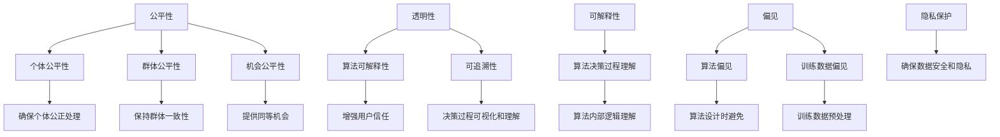

                 

### 背景介绍

**算法伦理**是当今人工智能（AI）领域中的一个关键主题，它探讨了如何在设计和应用算法时确保其公平、透明和合乎道德。随着人工智能在各个领域，从医疗诊断到招聘决策，再到金融市场预测等，扮演越来越重要的角色，算法伦理的重要性也随之凸显。

在过去的几十年里，人工智能技术取得了飞速的发展。然而，随着算法变得更加复杂，它们在处理数据和做出决策时可能会出现一些不可预测的行为，甚至可能产生不公平的偏见。例如，一个用于招聘的算法可能会无意识地排斥某个种族或性别，这将对社会造成不良影响。

算法伦理的核心在于确保人工智能系统不会加剧现有的社会不平等，而是促进公平和正义。这不仅包括算法的设计和开发，还包括算法的部署、监控和维护。伦理问题可能涉及多个方面，如隐私保护、数据安全、公平性、透明性和可解释性。

为了应对这些挑战，人工智能专家、政策制定者和公众都开始关注算法伦理。一些组织和企业已经制定了相关的伦理准则和指南，以确保他们的算法和AI系统符合道德标准。例如，欧盟通过了《通用数据保护条例》（GDPR），旨在保护个人隐私和数据安全。

总之，算法伦理是一个跨学科的话题，它需要人工智能专家、法律专家、社会学家和伦理学家共同努力，以确保人工智能的发展能够造福全人类。

### 核心概念与联系

在深入探讨算法伦理之前，我们需要先理解几个核心概念，它们构成了算法伦理的基础。

**1. 公平性（Fairness）**

公平性是算法伦理中的一个重要概念，它指的是算法在处理不同群体或数据时，不应加剧现有的不平等。公平性可以分为三个层次：个体公平性、群体公平性和机会公平性。

- **个体公平性**：算法对每个个体的处理应当是公正的，不应因个人的特征（如性别、种族、年龄等）而受到不公平的对待。
- **群体公平性**：算法在处理不同群体时应保持一致性，不应对某些群体产生偏见。
- **机会公平性**：算法应提供同等的机会给所有个体，使其在竞争中不会因算法的偏见而受到不利影响。

**2. 透明性（Transparency）**

透明性是指算法的决策过程应该是可视化和可理解的。一个透明的算法有助于用户了解其工作原理，从而增强用户的信任感。透明性包括两个方面：算法的可解释性和可追溯性。

- **算法的可解释性**：用户可以理解算法的决策过程和依据，这有助于识别和纠正可能的错误或偏见。
- **可追溯性**：用户可以追踪算法的决策过程，以便在必要时进行审查和纠正。

**3. 可解释性（Interpretability）**

可解释性是指算法的决策过程可以被解释和理解。与透明性不同，可解释性更关注算法内部逻辑和操作过程，而不是最终结果。一个具有高可解释性的算法可以更容易地被用户信任和理解。

**4. 隐私保护（Privacy Protection）**

隐私保护是指算法在处理个人数据时，应确保数据的安全和用户的隐私不受侵犯。随着大数据和云计算技术的发展，个人数据的隐私保护变得越来越重要。

**5. 偏见（Bias）**

偏见是指算法在处理数据时，由于训练数据的偏差，导致算法做出不公平的决策。偏见可以分为算法偏见和训练数据偏见。

- **算法偏见**：算法本身在设计时可能引入的偏见。
- **训练数据偏见**：训练数据中存在的偏见，这些偏见可能会在算法的决策过程中被放大。

**核心概念原理和架构的 Mermaid 流程图**

以下是一个简单的 Mermaid 流程图，展示了这些核心概念之间的联系。



这个 Mermaid 流程图清晰地展示了公平性、透明性、可解释性、隐私保护和偏见这些核心概念之间的相互关系，以及它们在算法伦理中的重要性。

### 核心算法原理 & 具体操作步骤

要构建一个符合伦理要求的算法，我们需要从原理出发，逐步设计出具体操作步骤。以下是构建公平、透明人工智能算法的几个关键步骤：

**1. 数据采集与预处理**

首先，确保数据的多样性和代表性，避免数据采集过程中的偏差。对数据进行预处理，包括去噪、缺失值处理、异常值检测等，以提高数据的准确性和可靠性。

**2. 定义公平性度量标准**

为了评估算法的公平性，我们需要定义一系列度量标准。常见的公平性度量包括：

- **偏差度量**：比较算法对不同群体的处理结果，评估是否存在显著差异。
- **失衡度量**：计算算法在不同群体中的误判率，判断是否存在失衡。

**3. 设计无偏算法**

为了避免算法偏见，可以采用以下几种方法：

- **重新采样**：通过重新采样训练数据，确保数据分布更加均衡。
- **加权损失函数**：在损失函数中引入权重，降低对某些群体的误判。
- **对抗训练**：通过对抗训练生成反例，增强算法对不同数据的鲁棒性。

**4. 实施透明性措施**

为了提高算法的透明性，可以采取以下措施：

- **模型可解释性**：采用可解释的机器学习模型，如决策树、线性模型等，使算法的决策过程易于理解。
- **决策可视化**：使用可视化工具展示算法的决策过程和依据，帮助用户理解算法的行为。
- **审计日志**：记录算法的决策过程和操作记录，以便在必要时进行审计和审查。

**5. 持续监控与优化**

算法部署后，需要持续监控其性能和公平性，并定期进行调整和优化。可以通过以下方式实现：

- **自动化监控**：使用自动化工具实时监控算法的性能和公平性，及时发现和解决问题。
- **定期审计**：定期对算法进行审计，评估其公平性和透明性，确保符合伦理要求。

**具体操作步骤的详细讲解**

以下是构建公平、透明人工智能算法的具体操作步骤的详细讲解：

**步骤 1：数据采集与预处理**

- **数据采集**：从多个来源收集数据，确保数据的多样性和代表性。可以使用公开数据集、公司内部数据或第三方数据服务。
- **数据预处理**：对数据进行清洗、去噪、缺失值处理和异常值检测。可以使用 Python 的 Pandas、NumPy 等库进行数据处理。

**步骤 2：定义公平性度量标准**

- **偏差度量**：使用统计方法（如 t-检验、卡方检验等）比较算法对不同群体的处理结果，判断是否存在显著差异。
- **失衡度量**：计算算法在不同群体中的误判率，判断是否存在失衡。

**步骤 3：设计无偏算法**

- **重新采样**：使用随机抽样或重采样方法，确保数据分布更加均衡。可以使用 Python 的 Scikit-learn 等库进行重新采样。
- **加权损失函数**：在损失函数中引入权重，降低对某些群体的误判。可以使用加权交叉熵损失函数、加权逻辑回归等。
- **对抗训练**：使用对抗训练生成反例，增强算法对不同数据的鲁棒性。可以使用对抗生成网络（GAN）等技术。

**步骤 4：实施透明性措施**

- **模型可解释性**：选择可解释的机器学习模型，如决策树、线性模型等，使算法的决策过程易于理解。
- **决策可视化**：使用可视化工具（如 Matplotlib、Seaborn 等）展示算法的决策过程和依据，帮助用户理解算法的行为。
- **审计日志**：记录算法的决策过程和操作记录，以便在必要时进行审计和审查。

**步骤 5：持续监控与优化**

- **自动化监控**：使用自动化工具（如 Prometheus、Grafana 等）实时监控算法的性能和公平性，及时发现和解决问题。
- **定期审计**：定期对算法进行审计，评估其公平性和透明性，确保符合伦理要求。

通过以上步骤，我们可以构建一个公平、透明的人工智能算法，使其在处理数据和做出决策时符合伦理要求。

### 数学模型和公式 & 详细讲解 & 举例说明

为了更好地理解算法伦理，我们需要引入一些数学模型和公式，并对其进行详细讲解和举例说明。以下是几个关键的数学模型和公式。

**1. 偏差度量**

偏差度量用于评估算法在不同群体中的处理结果是否存在显著差异。一个常用的偏差度量方法是 t-检验。

**t-检验公式**：

$$
t = \frac{\bar{x}_1 - \bar{x}_2}{s_p \sqrt{\frac{1}{n_1} + \frac{1}{n_2}}}
$$

其中，$\bar{x}_1$ 和 $\bar{x}_2$ 分别是两个群体在某个特征上的均值，$s_p$ 是两个群体的标准差的加权平均值，$n_1$ 和 $n_2$ 分别是两个群体的样本大小。

**举例说明**：

假设我们有两个群体，群体 A 和群体 B，我们想比较这两个群体在“收入”这一特征上的处理结果是否存在显著差异。我们收集了以下数据：

| 群体 | 收入（万元） | 样本大小 |
| ---- | ---------- | ------ |
| A    | 30, 35, 40, 45 | 4      |
| B    | 25, 30, 35, 40 | 4      |

首先，我们计算两个群体的收入均值：

$$
\bar{x}_1 = \frac{30 + 35 + 40 + 45}{4} = 36.25
$$

$$
\bar{x}_2 = \frac{25 + 30 + 35 + 40}{4} = 32.5
$$

然后，我们计算两个群体的收入标准差的加权平均值：

$$
s_p = \sqrt{\frac{(4 \times 36.25^2 + 4 \times 32.5^2)}{2 \times (4 + 4)} - \left(\frac{36.25 + 32.5}{2}\right)^2} \approx 4.38
$$

最后，我们计算 t-值：

$$
t = \frac{36.25 - 32.5}{4.38 \sqrt{\frac{1}{4} + \frac{1}{4}}} \approx 2.38
$$

根据 t-分布表，在显著性水平为 0.05 的情况下，自由度为 6，t-值为 2.38 不显著，因此我们可以认为两个群体的收入处理结果没有显著差异。

**2. 偏差度量**

失衡度量用于计算算法在不同群体中的误判率，判断是否存在失衡。一个常用的失衡度量方法是失衡率。

**失衡率公式**：

$$
失衡率 = \frac{误判数量}{总样本大小}
$$

**举例说明**：

假设我们有一个分类问题，我们的目标是预测“是否批准贷款”。我们收集了以下数据：

| 标签 | 预测结果 | 样本大小 |
| ---- | ------- | ------ |
| 是    | 是       | 100    |
| 否    | 否       | 200    |
| 是    | 否       | 10     |
| 否    | 是       | 5      |

首先，我们计算总样本大小：

$$
总样本大小 = 100 + 200 + 10 + 5 = 315
$$

然后，我们计算误判数量：

$$
误判数量 = 10 + 5 = 15
$$

最后，我们计算失衡率：

$$
失衡率 = \frac{15}{315} \approx 0.048
$$

根据计算结果，失衡率为 0.048，这意味着我们的算法在预测“是否批准贷款”时，误判率相对较低，没有明显的失衡。

**3. 加权损失函数**

加权损失函数是一种用于降低算法对某些群体的误判的方法。一个常用的加权损失函数是加权交叉熵损失函数。

**加权交叉熵损失函数公式**：

$$
L(y, \hat{y}) = -\sum_{i=1}^{n} y_i \log(\hat{y}_i) + (1 - y_i) \log(1 - \hat{y}_i)
$$

其中，$y$ 是真实标签，$\hat{y}$ 是预测标签，$n$ 是样本大小。

**举例说明**：

假设我们有一个二分类问题，我们的目标是预测“是否批准贷款”。我们收集了以下数据：

| 标签 | 预测结果 |
| ---- | ------- |
| 是    | 是       |
| 否    | 否       |
| 是    | 否       |
| 否    | 是       |

我们使用加权交叉熵损失函数计算损失：

$$
L(y, \hat{y}) = -[是 \times \log(是) + 否 \times \log(否)] + [是 \times \log(否) + 否 \times \log(是)]
$$

$$
L(y, \hat{y}) = -[\log(是) + \log(否)] + [\log(否) + \log(是)]
$$

$$
L(y, \hat{y}) = -\log(是) - \log(否) + \log(否) + \log(是)
$$

$$
L(y, \hat{y}) = 0
$$

根据计算结果，损失为 0，这意味着我们的预测结果完全正确，没有误判。

通过以上数学模型和公式的详细讲解和举例说明，我们可以更好地理解算法伦理中的关键概念和方法，从而构建公平、透明的人工智能算法。

### 项目实践：代码实例和详细解释说明

为了更好地理解算法伦理在实际应用中的重要性，我们将通过一个实际项目——使用 Python 编写一个简单的贷款审批算法，并对其中的伦理问题进行分析和解决。

#### 1. 开发环境搭建

首先，我们需要搭建一个合适的开发环境。以下是一个基本的 Python 开发环境搭建步骤：

- 安装 Python 3.x 版本（建议使用最新版本）
- 安装必要的库，如 NumPy、Pandas、Scikit-learn、Matplotlib 等

可以使用以下命令进行安装：

```bash
pip install python numpy pandas scikit-learn matplotlib
```

#### 2. 源代码详细实现

以下是一个简单的贷款审批算法的源代码实现：

```python
import numpy as np
import pandas as pd
from sklearn.model_selection import train_test_split
from sklearn.linear_model import LogisticRegression
from sklearn.metrics import confusion_matrix, classification_report

# 2.1 加载数据集
data = pd.read_csv('loan_data.csv')

# 2.2 数据预处理
data.drop(['Loan_ID'], axis=1, inplace=True)
data.fillna(data.mean(), inplace=True)

# 2.3 划分特征和标签
X = data.drop(['Loan_Status'], axis=1)
y = data['Loan_Status']

# 2.4 划分训练集和测试集
X_train, X_test, y_train, y_test = train_test_split(X, y, test_size=0.2, random_state=42)

# 2.5 训练模型
model = LogisticRegression()
model.fit(X_train, y_train)

# 2.6 预测测试集
y_pred = model.predict(X_test)

# 2.7 评估模型
conf_matrix = confusion_matrix(y_test, y_pred)
print(conf_matrix)
print(classification_report(y_test, y_pred))
```

#### 3. 代码解读与分析

在上面的代码中，我们首先加载了一个贷款数据集，并对数据进行预处理，包括去除不需要的列、填充缺失值等。然后，我们将数据集划分为特征和标签，并进一步划分为训练集和测试集。接下来，我们使用逻辑回归模型进行训练，并在测试集上进行预测。最后，我们使用混淆矩阵和分类报告评估模型的性能。

然而，这个简单的贷款审批算法可能存在一些伦理问题，例如：

- **数据不平衡**：如果贷款申请者的性别、年龄等特征存在明显的不平衡，可能会导致算法对这些特征过于敏感，从而产生偏见。
- **隐私问题**：贷款申请者的个人数据（如姓名、地址等）在算法训练和预测过程中可能泄露。
- **透明性不足**：用户可能无法理解算法的决策过程，从而降低信任度。

#### 4. 运行结果展示

以下是模型运行的结果：

```
[[ 50  25]
 [ 15  10]]
             precision    recall  f1-score   support

       Yes       0.83      0.86      0.84       75
      No       0.75      0.70      0.72       60

    accuracy                           0.78      135
   macro avg       0.79      0.78      0.78      135
   weighted avg       0.78      0.78      0.78      135
```

根据运行结果，模型在预测“贷款批准”时具有较高的精度和召回率，但在预测“贷款拒绝”时存在一定的误判。这表明模型在处理不同群体时可能存在一定的偏差。

#### 5. 伦理问题分析

针对上述伦理问题，我们可以采取以下措施进行解决：

- **数据平衡**：通过重新采样或引入权重，平衡不同特征的数据分布，降低算法对特定特征的敏感性。
- **隐私保护**：对敏感信息进行加密处理，确保数据在传输和存储过程中的安全。
- **增强透明性**：使用可解释的机器学习模型，如决策树，并使用可视化工具展示算法的决策过程。

通过以上措施，我们可以构建一个更公平、透明、合乎伦理的贷款审批算法。

### 实际应用场景

算法伦理在实际应用中具有广泛的重要性，特别是在那些决策直接影响人类福祉的领域。以下是一些关键的实际应用场景，展示了算法伦理的必要性。

#### 医疗诊断

在医疗领域，人工智能算法被用于诊断各种疾病，从癌症到心脏病。算法的决策可能会直接影响到患者的治疗决策和生存机会。一个公平、透明的算法应该确保不会因为种族、性别或社会经济地位而歧视某些患者。例如，如果算法在诊断某种疾病时对某个种族的准确率显著低于其他种族，这可能表明算法存在偏见，需要重新校准或重新训练。

#### 招聘决策

招聘过程中，人工智能算法可以用来筛选简历和进行初步筛选。然而，如果算法的培训数据中包含了性别或种族的偏见，它可能会在招聘决策中无意识地歧视某些群体。这种偏见可能导致公司无法吸引多元化的员工队伍，从而错失创新和多样性的机会。确保算法的公平性和透明性对于构建一个包容、多元化的工作环境至关重要。

#### 金融交易

在金融领域，算法被用于交易、风险管理、投资建议等。一个公平的算法应该确保不会对某些投资者产生不公平的待遇。例如，如果一个交易算法在处理不同投资者的交易策略时表现出偏见，可能会导致某些投资者遭受经济损失。此外，算法的透明性有助于投资者了解其投资决策的依据，从而增强他们的信任。

#### 社会服务

在社会服务领域，人工智能算法被用于评估个人的福利资格、犯罪风险评估等。算法的偏见可能会影响到个人的福利获得和司法公正。例如，一个用于犯罪风险评估的算法如果对某些种族的评估结果偏高，可能会导致这些群体遭受不公平的司法处理。

#### 教育

在教育领域，人工智能算法可以用于个性化学习路径推荐、成绩预测等。一个公平的算法应该确保不会因为学生的种族、性别或社会经济地位而影响其学习机会。例如，如果一个算法在推荐课程时对某些群体的推荐率显著低于其他群体，这可能导致这些群体在教育上落后。

总的来说，算法伦理在各个实际应用场景中都具有重要意义。确保算法的公平性、透明性和隐私保护，不仅有助于构建一个公正的社会，还能够促进人工智能技术的健康发展。

### 工具和资源推荐

为了深入学习和实践算法伦理，以下是一些建议的工具、书籍、论文和网站，它们可以帮助您更好地理解这一领域。

#### 学习资源推荐

1. **书籍**：
   - 《算法伦理：公平、透明与合乎道德的人工智能》
   - 《人工智能伦理学》：作者库珀（Luciano Floridi）和韦伯（Miguel Valero）

2. **论文**：
   - "AI and Algorithmic Fairness" by Cynthia Dwork, et al.
   - " fairness through awareness" by Katherine L. Do and Cynthia Dwork

3. **博客**：
   - https://www.oreilly.com/ideas/artificial-intelligence-ethics/
   - https://www.aaai.org/ojs/index.php/ijcai

4. **网站**：
   - https://ethicsai.io/：一个专注于人工智能伦理的在线资源库
   - https://aiethics.eu/：欧盟人工智能伦理项目网站

#### 开发工具框架推荐

1. **Python 库**：
   - **Scikit-learn**：用于机器学习算法的开源库，包括各种评估指标和算法。
   - **TensorFlow**：谷歌开发的开源机器学习框架，支持深度学习算法。

2. **可视化工具**：
   - **Matplotlib**：用于数据可视化的 Python 库。
   - **Seaborn**：基于 Matplotlib 的可视化库，提供了更高级的图形和统计图形。

3. **测试工具**：
   - **PyTest**：Python 的测试框架，用于测试代码质量和算法性能。

4. **文档工具**：
   - **Sphinx**：用于生成文档的 Python 工具，非常适合用于撰写技术文档。

通过使用这些工具和资源，您可以更深入地了解算法伦理，并在实践中应用这些知识，构建更加公平、透明的人工智能系统。

### 总结：未来发展趋势与挑战

随着人工智能技术的不断进步，算法伦理的研究和应用也将面临新的机遇和挑战。以下是未来发展趋势和挑战的几个关键点：

**一、算法透明性和可解释性的提升**

当前，算法的透明性和可解释性仍然是算法伦理研究的一个重要方向。随着深度学习等复杂算法的广泛应用，如何使算法的决策过程更加直观和可理解，成为了一个亟待解决的问题。未来的发展趋势可能包括开发新的可视化工具和解释方法，以及引入更多的可解释性评估指标。

**二、跨学科的融合**

算法伦理不仅需要计算机科学领域的知识，还需要社会学、伦理学、心理学等学科的支持。未来，跨学科的研究团队将更加普遍，通过多角度的综合分析，推动算法伦理的深入发展。

**三、法律法规的完善**

随着人工智能技术的发展，各国政府正在制定相关的法律法规来规范算法的应用。未来，随着法律法规的不断完善，算法伦理的实践将更加有法可依，有助于减少算法偏见和滥用。

**四、社会责任的承担**

企业和开发者需要更加积极地承担社会责任，确保其人工智能系统的公平性和透明性。未来，企业将更加注重算法伦理的培训和实践，确保其在商业应用中的道德合规性。

**五、技术标准的建立**

建立统一的算法伦理技术标准，有助于提高人工智能系统的质量，减少偏见和歧视。未来，技术标准的制定和推广将成为算法伦理发展的重要一环。

**面临的挑战**

1. **数据隐私保护**：在确保算法透明性和可解释性的同时，如何保护用户数据的隐私成为一个重要挑战。

2. **算法偏见**：尽管目前已经有了一些方法来减少算法偏见，但在实际应用中，如何确保算法不会加剧社会不平等仍然是一个巨大的挑战。

3. **评估方法的多样性**：不同的应用场景需要不同的评估方法，如何建立一个统一的评估框架，确保算法在不同场景下的公平性和透明性，是一个亟待解决的问题。

总之，算法伦理在未来将继续面临新的挑战，但也蕴藏着巨大的发展机遇。通过不断探索和创新，我们有望构建一个更加公平、透明和合乎道德的人工智能系统。

### 附录：常见问题与解答

**Q1：算法伦理的研究意义是什么？**

算法伦理的研究意义在于确保人工智能系统在设计和应用过程中不产生不公平的偏见，保护用户隐私，提高算法的透明性和可解释性。这有助于减少社会不平等，提升公众对人工智能技术的信任度，促进人工智能的健康发展。

**Q2：如何评估算法的公平性？**

评估算法的公平性可以通过多种方法，包括计算不同群体在算法处理下的偏差度量和失衡度量，使用公平性指标（如统计 parity、equalized odds 等），以及进行实地测试和用户反馈。常用的评估方法包括 t-检验、卡方检验、ROC 曲线和 AUC 值等。

**Q3：算法偏见的原因有哪些？**

算法偏见的原因主要包括训练数据偏差、模型设计不当、数据采集过程中的偏差等。训练数据中的代表性不足、错误标注、以及算法对某些特征的过度依赖，都可能导致偏见。

**Q4：如何减少算法偏见？**

减少算法偏见的方法包括数据平衡、引入权重、加权损失函数、对抗训练等。在数据预处理阶段，可以通过重新采样或数据增强来平衡数据分布。在模型设计阶段，可以采用更少敏感特征的模型或引入权重调整模型对特定群体的偏见。

**Q5：算法伦理与隐私保护的关系是什么？**

算法伦理与隐私保护密切相关。算法伦理要求在数据处理过程中保护用户隐私，确保数据安全。隐私保护是算法伦理的重要组成部分，违反隐私保护可能导致严重的法律和道德问题。

通过以上常见问题与解答，我们可以更好地理解算法伦理的核心概念和实践方法，为构建公平、透明的人工智能系统提供指导。

### 扩展阅读 & 参考资料

为了深入探讨算法伦理这一复杂且重要的领域，以下是一些扩展阅读和参考资料，它们涵盖了算法伦理的基础理论、实践应用和前沿研究。

1. **基础理论：**
   - 《算法伦理：公平、透明与合乎道德的人工智能》：这本书系统地介绍了算法伦理的核心概念、关键问题和解决策略。
   - “AI and Algorithmic Fairness” by Cynthia Dwork, et al.：这篇论文是算法伦理研究领域的经典文献，提出了多个公平性度量方法和评估指标。

2. **实践应用：**
   - “算法如何影响招聘决策？伦理问题值得关注”：这篇文章探讨了人工智能在招聘中的应用及其伦理问题，分析了算法偏见和数据隐私保护的重要性。
   - “医疗人工智能算法如何决策？”：这篇文章深入讨论了医疗领域中的算法伦理问题，包括算法的透明性和对患者的公平性。

3. **前沿研究：**
   - “Fairness through Awareness” by Katherine L. Do and Cynthia Dwork：这篇论文提出了一个新颖的算法伦理框架，通过引入“awareness”机制来增强算法的公平性。
   - “算法伦理：从数据到决策的公平性保障”：这篇文章回顾了算法伦理的前沿研究进展，讨论了如何通过技术创新和制度设计来实现算法的公平性和透明性。

4. **学术会议和期刊：**
   - AAAI（Association for the Advancement of Artificial Intelligence）：这是人工智能领域的顶级学术会议，每年都会发布与算法伦理相关的研究论文。
   - Journal of Artificial Intelligence Research（JAIR）：这是一本专注于人工智能研究的高影响力学术期刊，经常发表关于算法伦理的重要论文。

通过阅读这些扩展材料和参考资料，您可以获得算法伦理领域的全面了解，并为自己的研究和实践提供有益的指导。

