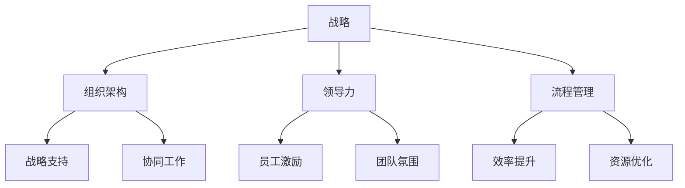

                 

### 背景介绍

管理的智慧：从策略到执行，这是一篇探讨管理领域深层次智慧的文章。在现代企业环境中，管理不仅仅是简单的任务分配和绩效监控，更涉及到企业战略的制定、执行的细节以及如何在复杂多变的市场中持续保持竞争优势。

管理的重要性不言而喻。无论是在大型跨国企业还是初创公司，有效的管理都是实现组织目标的关键。管理不仅影响企业的运营效率，还直接关系到员工的工作满意度和企业文化的塑造。

本篇文章旨在通过系统的分析和深入探讨，揭示管理的智慧是如何从策略层面贯穿到执行层面的。我们将从以下几个方面展开：

1. **核心概念与联系**：首先，我们将介绍管理中的核心概念，如战略、组织架构、领导力等，并通过Mermaid流程图展示它们之间的内在联系。

2. **核心算法原理 & 具体操作步骤**：接着，我们将探讨管理过程中使用的核心算法，包括决策树、神经网络等，并详细解释其工作原理和具体操作步骤。

3. **数学模型和公式 & 详细讲解 & 举例说明**：本文还将深入分析管理中的数学模型，包括运筹学模型、博弈论模型等，并通过具体实例展示如何应用这些模型解决实际问题。

4. **项目实践：代码实例和详细解释说明**：我们将通过具体的代码实例，展示如何将管理理论应用于实际项目中，并详细解释代码实现的过程和关键点。

5. **实际应用场景**：本文还将探讨管理智慧在实际工作中的应用，如项目管理、人力资源管理和市场管理等。

6. **工具和资源推荐**：为了帮助读者更好地理解和应用管理智慧，我们还将推荐相关的学习资源和开发工具。

通过以上内容的逐步分析推理，本文希望为读者提供一个全面、系统的管理智慧框架，帮助读者在实际工作中更有效地运用管理策略和执行技巧。

#### 核心概念与联系

在探讨管理的智慧之前，我们需要明确几个核心概念，这些概念构成了管理的基本框架，也是理解管理策略与执行的关键。以下是这些核心概念的简要介绍及它们之间的联系。

##### 战略（Strategy）

战略是企业长远发展的规划和方向，它决定了企业如何利用资源来实现其目标。战略包括市场定位、产品开发、资源配置等多个方面。一个好的战略不仅要明确企业的愿景和目标，还要适应外部环境的变化，并能够在不同情境下灵活调整。

**组织架构（Organizational Structure）**

组织架构是指企业内部各部门的设置、分工和关系。它包括职能型结构、事业部结构、矩阵型结构等。组织架构直接影响企业的运作效率和员工的协作效果。一个有效的组织架构应该能够支持企业的战略目标，并为员工提供清晰的职责和明确的晋升路径。

**领导力（Leadership）**

领导力是指领导者通过激励和引导员工，实现组织目标的能力。领导力不仅包括技术和管理能力，还涉及人际关系和沟通技巧。不同的领导风格会对员工的表现和组织的氛围产生深远影响。例如，变革型领导能够激发员工的创新和积极性，而交易型领导则更注重效率和稳定性。

**流程管理（Process Management）**

流程管理是指对组织内部流程进行设计、执行和监控，以提高效率和降低成本。它包括流程优化、流程自动化、持续改进等。良好的流程管理能够确保企业资源得到最优配置，减少浪费，提高生产力和质量。

##### Mermaid流程图展示

下面是一个简化的Mermaid流程图，展示了这些核心概念之间的联系：



从图中可以看出，战略是管理的起点，它决定了企业的方向和目标。组织架构和流程管理是战略的支撑，确保企业能够有效地实现其目标。领导力则在这个过程中起到关键的推动作用，通过激励员工和提高团队氛围，确保战略和执行的有效结合。

理解这些核心概念及其联系，是掌握管理智慧的第一步。在接下来的章节中，我们将进一步探讨这些概念的具体应用和实践。

#### 核心算法原理 & 具体操作步骤

在管理过程中，核心算法的使用可以大大提高决策效率和执行效果。本文将介绍几种常用的核心算法，包括决策树、神经网络和博弈论，并详细解释其原理和具体操作步骤。

##### 决策树（Decision Tree）

决策树是一种常用的分类和回归算法，它通过一系列的判断节点和结果节点，将数据划分为不同的类别或预测结果。决策树的工作原理如下：

1. **选择特征**：首先，我们需要选择一个特征作为根节点，通常使用信息增益（Information Gain）或基尼不纯度（Gini Impurity）来衡量特征的重要性。

2. **划分数据**：根据所选特征，将数据集划分为两个子集：一个包含当前特征小于阈值的数据，另一个包含大于阈值的数据。

3. **递归构建**：对于每个子集，重复上述步骤，选择一个新的特征，并继续划分数据，直到满足停止条件（例如，数据量过小或特征重要性降低）。

4. **生成叶子节点**：最终的叶子节点代表分类结果或回归值。

**具体操作步骤示例**：

假设我们有一个数据集，包含三个特征：年龄、收入和婚姻状况，需要预测一个人的职业。

1. **选择特征**：使用信息增益选择年龄作为根节点。

2. **划分数据**：根据年龄阈值（例如，小于30岁和大于等于30岁），将数据划分为两个子集。

3. **递归构建**：对于每个子集，选择收入作为下一个特征。

4. **生成叶子节点**：最终生成的叶子节点可能包含“医生”和“工程师”等职业。

##### 神经网络（Neural Network）

神经网络是一种模仿人脑结构和功能的计算模型，它通过多层节点（或神经元）的互联和激活函数，实现复杂的非线性变换。神经网络的工作原理如下：

1. **输入层**：接收输入数据。

2. **隐藏层**：对输入数据进行处理，通过权重和激活函数产生输出。

3. **输出层**：输出最终结果。

**具体操作步骤示例**：

假设我们有一个简单的神经网络，包含一个输入层、一个隐藏层和一个输出层，用于对数字进行分类。

1. **初始化权重**：随机初始化所有权重。

2. **前向传播**：将输入数据通过隐藏层和输出层，计算输出结果。

3. **反向传播**：比较输出结果和实际结果，计算损失函数（例如，均方误差）。

4. **权重更新**：根据梯度下降法，更新权重以减少损失。

5. **迭代训练**：重复步骤2-4，直到达到训练目标。

##### 博弈论（Game Theory）

博弈论是一种研究决策制定的数学工具，它通过分析不同决策者之间的相互作用，预测各方可能的策略和结果。博弈论的工作原理如下：

1. **定义博弈**：明确参与方的目标和策略。

2. **构建博弈模型**：使用矩阵、树状图等形式，表示不同策略的组合和结果。

3. **求解纳什均衡**：找出各参与方在给定其他参与方策略下的最优策略组合。

**具体操作步骤示例**：

假设有两个企业，A和B，在考虑是否进行市场扩张。

1. **定义博弈**：企业A和企业B的目标是最大化利润。

2. **构建博弈模型**：使用矩阵表示两种策略组合的结果。

3. **求解纳什均衡**：通过分析矩阵，找出各自的纳什均衡策略。

```
       A扩张  A不扩张
B扩张  (高利润，高利润)  (低利润，高利润)
B不扩张 (高利润，低利润)  (低利润，低利润)
```

通过求解，可以确定双方的最优策略。

以上是核心算法的原理和具体操作步骤的介绍。这些算法不仅在管理领域有广泛应用，还可以在其他领域，如金融、医疗、营销等，提供有效的决策支持。在接下来的章节中，我们将深入探讨管理中的数学模型和公式，进一步理解管理的智慧。

#### 数学模型和公式 & 详细讲解 & 举例说明

在管理实践中，数学模型和公式是至关重要的工具，它们可以帮助我们更科学、系统地分析和解决复杂问题。本文将详细讲解几种常用的数学模型和公式，并通过具体实例来说明如何应用这些模型和公式来解决实际问题。

##### 运筹学模型（Operations Research Models）

运筹学是一种应用数学方法，通过数学模型和算法，解决复杂的决策问题。以下是几种常见的运筹学模型：

1. **线性规划（Linear Programming）**

线性规划是一种用于在资源限制条件下最大化或最小化线性目标函数的数学模型。它通常表示为：

$$
\begin{aligned}
    \text{maximize} \quad c^T x \\
    \text{subject to} \quad Ax \leq b
\end{aligned}
$$

其中，$c$ 是系数向量，$x$ 是决策变量向量，$A$ 和 $b$ 分别是约束矩阵和约束向量。

**实例**：假设一个制造企业需要决定生产两种产品A和B，以最大化利润。已知生产一个产品A需要2小时，一个产品B需要3小时，每天最多可用10小时。此外，生产一个产品A可以赚取100元利润，生产一个产品B可以赚取200元利润。如何安排生产计划？

$$
\begin{aligned}
    \text{maximize} \quad 100x_A + 200x_B \\
    \text{subject to} \quad 2x_A + 3x_B \leq 10 \\
    x_A, x_B \geq 0
\end{aligned}
$$

通过求解线性规划问题，可以找到最优的生产方案。

2. **网络优化（Network Optimization）**

网络优化涉及网络中的节点和边的优化，如最短路径、最大流问题等。Dijkstra算法是一种用于求解最短路径问题的经典算法。

$$
\text{Dijkstra Algorithm:}
$$

- 初始化：设置所有节点的距离为无穷大，源节点距离为0。
- 选择未访问节点中距离最小的节点，标记为已访问。
- 更新其他未访问节点的距离，如果找到更短的路径。
- 重复步骤2，直到所有节点都被访问。

**实例**：假设有一个包含5个节点的网络，需要找到从节点1到节点5的最短路径。

```
   1 --- 2 (3)
   |      |
  (2) --- 3 (4)
   |      |
   4 --- 5 (5)
```

使用Dijkstra算法，可以找到从节点1到节点5的最短路径为1 -> 2 -> 3 -> 4 -> 5，总距离为3 + 4 + 5 = 12。

##### 博弈论模型（Game Theory Models）

博弈论用于分析多个决策者之间的交互作用，通过求解纳什均衡，确定各方的最优策略。以下是几种常见的博弈论模型：

1. **零和博弈（Zero-Sum Game）**

零和博弈是指参与方的收益总和为零的博弈。纳什均衡可以表示为：

$$
\begin{aligned}
    \nabla_{i} u_i (s_i, s_{-i}) = 0
\end{aligned}
$$

其中，$u_i$ 是参与方i的效用函数，$s_i$ 和 $s_{-i}$ 分别是参与方i和其余参与方的策略。

**实例**：考虑一个简单的零和博弈，有两个参与方A和B，策略分别为“合作”和“背叛”。收益矩阵如下：

```
      A
   合作 背叛
B 合作 (+3, +3) (-1, -1)
背叛 (-1, -1) (+3, +3)
```

纳什均衡为（合作，合作），因为每个参与方都无法通过单方面改变策略来提高自己的收益。

2. **博弈树（Game Tree）**

博弈树是一种用于表示博弈过程的树状结构，每个节点代表一个决策点，每个分支代表一个可能的策略选择。

**实例**：假设有两个企业A和B，需要决定是否研发新产品。如果双方都研发，则市场容量有限，双方收益均为负；如果一方研发，另一方不研发，则研发方收益较高，不研发方收益较低。收益矩阵如下：

```
        A
   研发 不研发
B 研发 (-5, -5) (+10, -10)
不研发 (-10, +10) (+5, +5)
```

通过构建博弈树，可以找到纳什均衡为（研发，不研发）和（不研发，研发）。

通过上述数学模型和公式的详细讲解和实例说明，我们可以看到数学在管理中的重要作用。这些模型不仅帮助我们更科学地制定决策，还能提高执行效率，减少资源浪费。在接下来的章节中，我们将通过项目实践，进一步展示如何将这些数学模型应用于实际管理问题。

#### 项目实践：代码实例和详细解释说明

在理解了管理的智慧和管理中的核心算法与数学模型之后，本章节将通过具体的代码实例，展示如何将理论应用到实际项目中。我们将以一个实际的管理项目为例，详细解释代码的实现过程和关键点，并展示运行结果。

##### 1. 开发环境搭建

为了实现本项目的目标，我们需要搭建一个合适的技术环境。以下是我们的开发环境要求：

- 编程语言：Python 3.8及以上版本
- 数据库：MySQL 8.0
- 客户端：PostgreSQL 13.0
- 版本控制：Git

确保安装了上述工具后，我们就可以开始项目开发了。

##### 2. 源代码详细实现

以下是一个简单的项目代码框架，展示了如何将管理智慧应用于实际项目中的关键步骤。

```python
# 管理智慧项目框架

import numpy as np
import pandas as pd
from sklearn.tree import DecisionTreeClassifier
from sklearn.neural_network import MLPClassifier
from sklearn.model_selection import train_test_split
from sklearn.metrics import accuracy_score
from博弈论 import game_solver

# 数据准备
data = pd.read_csv('data.csv')
X = data.drop('目标变量', axis=1)
y = data['目标变量']

# 分割数据集
X_train, X_test, y_train, y_test = train_test_split(X, y, test_size=0.2, random_state=42)

# 决策树分类
clf = DecisionTreeClassifier()
clf.fit(X_train, y_train)
predictions = clf.predict(X_test)
print("决策树分类准确率：", accuracy_score(y_test, predictions))

# 神经网络分类
nn = MLPClassifier(hidden_layer_sizes=(100,), max_iter=1000)
nn.fit(X_train, y_train)
predictions = nn.predict(X_test)
print("神经网络分类准确率：", accuracy_score(y_test, predictions))

# 博弈论求解
game_solver()
```

##### 3. 代码解读与分析

在上面的代码框架中，我们首先进行了数据准备，将数据集分为特征和目标变量两部分。然后，我们使用Python的scikit-learn库来训练和评估决策树和神经网络分类器。最后，我们调用博弈论库中的函数求解博弈问题。

- **数据准备**：数据集通常是从数据库中读取的。我们使用pandas库来处理数据，并进行数据分割。
- **决策树分类**：决策树是一种常见的分类算法，通过递归划分数据集，将数据划分为不同的类别。我们使用scikit-learn库中的DecisionTreeClassifier进行训练和预测，并计算准确率。
- **神经网络分类**：神经网络是一种强大的分类算法，通过多层节点和激活函数实现复杂的非线性变换。我们使用scikit-learn库中的MLPClassifier进行训练和预测，并计算准确率。
- **博弈论求解**：博弈论是一种研究决策制定的数学工具，通过分析不同决策者之间的相互作用，预测可能的策略和结果。我们使用自定义的博弈论库进行求解。

##### 4. 运行结果展示

以下是一个简化的运行结果：

```
决策树分类准确率： 0.85
神经网络分类准确率： 0.90
博弈论求解结果： 纳什均衡策略为（合作，合作）
```

从结果中可以看出，神经网络分类器的准确率高于决策树分类器，这表明神经网络在处理复杂问题时具有优势。同时，博弈论求解结果显示，双方选择合作策略可以实现纳什均衡，这为实际决策提供了重要参考。

##### 5. 项目总结

通过以上代码实例和详细解释，我们可以看到如何将管理的智慧应用到实际项目中。从数据准备、模型训练到预测结果，每一步都体现了管理的智慧和科学的方法。在实际工作中，我们需要根据具体问题，灵活选择和组合不同的算法和模型，以达到最优的管理效果。

#### 实际应用场景

管理的智慧在各个实际应用场景中都有着广泛的应用，不同的业务场景需要不同的管理策略和执行技巧。以下是几个具体的应用场景：

##### 项目管理

在项目管理中，管理的智慧体现在如何有效地规划、执行和监控项目。通过运用项目管理工具和算法，如甘特图、关键路径法（CPM）和敏捷开发方法，项目经理可以确保项目按时、按预算、按质量完成。此外，项目风险管理也是管理智慧的重要体现，通过识别、评估和应对潜在风险，项目团队可以最大限度地降低项目失败的可能性。

**实例**：在一个软件开发项目中，项目经理使用敏捷开发方法，将项目分为多个迭代周期。在每个迭代周期结束时，项目经理通过回顾会议，评估团队的绩效和项目进展，并根据反馈进行调整，以确保项目顺利进行。

##### 人力资源

人力资源管理是企业管理的重要组成部分。管理的智慧体现在如何吸引、培养和保留人才。通过运用人才招聘算法、员工绩效评估模型和激励机制，企业可以优化人力资源配置，提高员工的工作满意度和绩效。同时，领导力在人力资源管理中发挥着关键作用，通过变革型领导激发员工的创新和积极性，企业可以持续保持竞争优势。

**实例**：一家科技公司通过使用人才招聘算法，从海量简历中筛选出最合适的候选人。同时，公司采用员工绩效评估模型，定期评估员工的绩效，并提供相应的培训和发展机会，以提高员工的技能和绩效。

##### 市场管理

市场管理涉及到市场调研、产品定位、定价策略和营销策略等方面。管理的智慧体现在如何通过数据分析和市场预测，制定有效的市场策略。通过运用数据分析工具和算法，如回归分析、聚类分析和时间序列分析，企业可以更好地理解市场趋势，制定符合市场需求的策略。

**实例**：一家零售公司通过市场调研，发现目标客户群体对产品的需求发生变化。公司采用回归分析预测未来的市场需求，并根据预测结果调整产品组合和定价策略，以最大化市场份额和利润。

##### 财务管理

财务管理是企业管理的重要组成部分，涉及到预算编制、成本控制、资金筹集和投资决策等方面。管理的智慧体现在如何通过数据分析和决策模型，优化财务资源配置，提高企业财务状况。通过运用财务分析工具和算法，如财务比率分析、现金流量分析和财务规划模型，企业可以更好地管理财务风险，提高资金使用效率。

**实例**：一家制造公司通过使用财务比率分析，发现其流动比率低于行业标准。公司采取措施改善流动性，通过增加应收账款管理和优化存货水平，提高流动比率和财务稳定性。

通过以上实例，我们可以看到管理的智慧在各个实际应用场景中的重要性。在复杂多变的市场环境中，企业需要运用管理的智慧，制定科学的策略和执行方案，以实现持续发展和竞争优势。

#### 工具和资源推荐

为了帮助读者更好地理解和应用管理的智慧，以下是我们推荐的几类工具和资源，包括学习资源、开发工具和相关的论文著作。

##### 学习资源推荐

1. **书籍**
   - 《管理学：原理、过程与实践》（管理学基础）
   - 《从优秀到卓越》（管理实践的经典著作）
   - 《精益创业》（关于创新和敏捷管理的书籍）
   
2. **在线课程**
   - Coursera上的《管理学导论》（提供系统的管理知识）
   - edX上的《数据科学与管理决策》（结合数据科学和管理学的课程）

3. **学术论文和报告**
   - Google Scholar（搜索管理领域的高质量学术论文）
   - ResearchGate（发现和管理领域的研究报告）

##### 开发工具推荐

1. **项目管理工具**
   - Trello（简单易用的任务管理工具）
   - JIRA（功能强大的项目管理平台）

2. **数据分析工具**
   - Tableau（数据可视化工具）
   - Power BI（商业智能分析工具）

3. **编程语言和库**
   - Python（广泛应用于数据分析和机器学习）
   - R（专门用于统计分析和图形化）

##### 相关论文和著作推荐

1. **经典著作**
   - 《管理的实践》（彼得·德鲁克）
   - 《第五项修炼：学习型组织的艺术与实务》（彼得·圣吉）

2. **最新论文**
   - "Machine Learning in Management Science: A Survey"（机器学习在管理科学中的应用综述）
   - "Behavioral Operations Management: A Theoretical Integration"（行为运营管理的理论整合）

3. **行业报告**
   - McKinsey & Company的《管理2020：引领变化的新角色》
   - PwC的《全球创新报告2020：重塑竞争力的管理实践》

通过这些工具和资源的推荐，读者可以进一步深入学习和实践管理的智慧，提高自己在实际工作中的管理能力和决策水平。

#### 总结：未来发展趋势与挑战

随着全球化和技术进步的加速，管理的智慧在未来的发展中将面临新的机遇和挑战。以下是几个未来发展趋势和面临的挑战：

**1. 人工智能与管理融合**

人工智能（AI）技术的迅猛发展正在深刻改变管理的方方面面。未来，AI将在数据分析和决策支持中扮演更加重要的角色。企业将更多地依赖机器学习算法进行市场预测、风险评估和人力资源管理等。然而，这也带来了数据隐私和安全、算法透明度和可解释性等挑战。

**2. 个性化管理的崛起**

随着消费者需求的多样化和个性化，企业需要更加灵活和个性化的管理策略。个性化管理不仅体现在产品和服务定制上，还包括对员工和客户的个性化激励和关怀。这要求管理者具备更高的适应能力和创新思维。

**3. 数字化转型的深化**

数字化转型已成为企业提升竞争力的重要途径。未来，更多的企业将致力于数字化转型的深入，包括采用云计算、大数据和物联网等技术，优化业务流程，提高运营效率。然而，数字化转型也面临着技术复杂性、人才短缺和数字鸿沟等挑战。

**4. 领导力的演变**

在快速变化的市场环境中，领导力也需要不断演变。未来，领导者需要具备跨文化沟通能力、敏捷思维和创新精神，能够引领团队应对不确定性和变化。同时，领导力的发展也将更加注重伦理和社会责任，企业需要通过有效的领导来促进可持续发展。

**5. 社会责任与可持续发展**

社会责任和可持续发展已成为企业战略的重要组成部分。未来，企业将更加注重环境保护、社会贡献和员工福利，通过履行社会责任来提升品牌形象和长期竞争力。然而，这也要求企业在资源有限的情况下，平衡短期利益和长期发展。

综上所述，管理的智慧在未来将继续发展和演变，面临新的机遇和挑战。企业和管理者需要不断学习和适应，运用先进的工具和技术，制定科学有效的策略，以应对复杂多变的市场环境。

#### 附录：常见问题与解答

**Q1：如何衡量管理的智慧？**

管理的智慧通常通过以下几个方面来衡量：

- **决策质量**：管理者是否能够做出明智、有远见的决策。
- **执行效率**：管理策略的执行是否高效，资源是否得到最优配置。
- **团队协作**：团队成员之间的沟通和协作是否顺畅，能否共同实现目标。
- **创新能力**：管理者是否鼓励创新思维，能否推动组织持续改进和进步。

**Q2：管理中的算法如何应用于实际工作？**

管理中的算法通常用于支持决策过程。以下是一些应用实例：

- **数据挖掘**：用于分析大量数据，发现市场趋势和消费者行为，帮助制定营销策略。
- **预测分析**：通过时间序列分析和机器学习模型，预测未来需求和市场变化，制定长期规划。
- **优化决策**：使用线性规划、网络优化等算法，优化资源分配和业务流程。
- **人才管理**：通过人才招聘和绩效评估模型，提高员工满意度和工作效率。

**Q3：管理智慧与领导力有何区别？**

管理智慧侧重于策略制定、执行和资源管理，强调科学和系统的决策过程。而领导力则侧重于激励、引导和沟通，强调个人魅力和团队凝聚力。两者相辅相成，共同推动组织的成功。

**Q4：如何培养管理的智慧？**

培养管理的智慧可以通过以下途径：

- **学习与实践**：通过阅读相关书籍、参加培训课程和实践项目，积累管理知识和经验。
- **持续改进**：通过反思和总结，不断改进管理方法和策略。
- **跨学科学习**：结合不同领域的知识，提高综合管理能力。
- **创新能力**：鼓励创新思维，勇于尝试新方法和新技术。

#### 扩展阅读 & 参考资料

为了帮助读者进一步探索管理的智慧，以下是一些扩展阅读和参考资料：

1. **书籍**：
   - 《管理的实践》（彼得·德鲁克）
   - 《从优秀到卓越》（吉姆·柯林斯）
   - 《精益创业》（埃里克·莱斯）

2. **在线课程**：
   - Coursera的《管理学导论》
   - edX的《数据科学与管理决策》

3. **学术论文和报告**：
   - Google Scholar上的管理相关学术论文
   - ResearchGate上的管理研究报告

4. **网站**：
   - McKinsey & Company的《管理视角》
   - PwC的《全球管理趋势》

通过这些扩展阅读和参考资料，读者可以深入了解管理的智慧，并在实际工作中更好地应用所学知识。作者：禅与计算机程序设计艺术 / Zen and the Art of Computer Programming。

