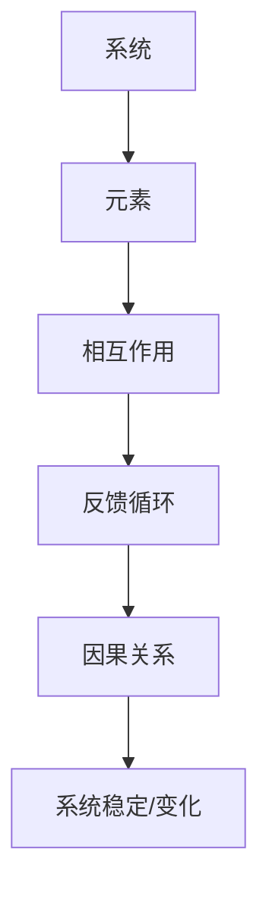
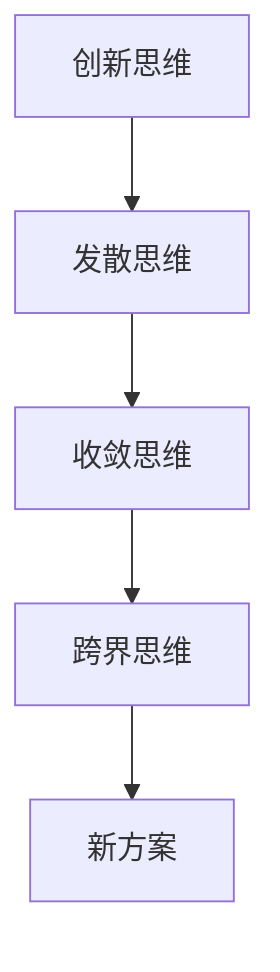
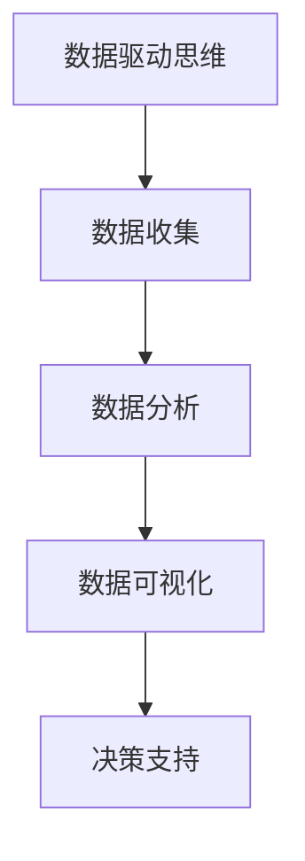
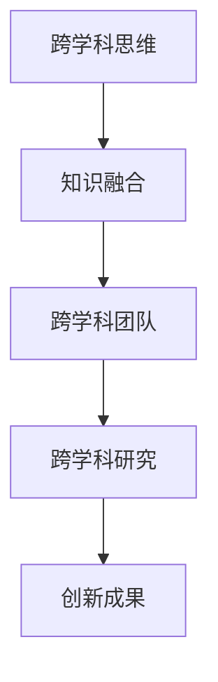

                 

### 背景介绍

在现代企业管理中，个人思维体系的建立显得尤为重要。这不仅是因为个人思维体系直接影响管理者的决策质量和效率，还因为它与企业的创新能力和长期发展息息相关。个人思维体系是指个人在思考问题时所采用的方法、工具和原则的集合。一个健全的个人思维体系可以帮助管理者更好地理解复杂问题，作出明智决策，并有效应对不确定性和变化。

近年来，随着全球化竞争的加剧和技术变革的加速，企业管理者面临的问题日益复杂。无论是市场环境的快速变化，还是技术的迅猛发展，都对管理者的思维方式提出了更高的要求。传统的线性思维方式已经难以应对这些复杂问题，而系统思维、创新思维和跨学科思维等新兴思维方式逐渐成为企业管理者必备的技能。因此，如何构建和优化个人思维体系，已经成为企业管理者和人力资源部门关注的焦点。

本文将探讨管理者在构建个人思维体系时需要掌握的核心概念、方法和工具，通过具体的案例和实践，帮助读者理解并应用这些概念和方法，从而提升自己的管理水平和决策能力。

### 核心概念与联系

构建个人思维体系，首先需要理解一些核心概念。这些概念不仅是思维体系的基础，也是连接各个思维要素的关键。以下将介绍几个核心概念及其相互关系，并通过Mermaid流程图展示其架构。

#### 1. 系统思维

系统思维是一种全面的、整体的思维方式，强调从整体出发，理解各个部分之间的相互作用和反馈。系统思维的核心概念包括：

- **系统**：由相互作用的元素组成的整体。
- **反馈循环**：系统中不同元素之间的相互作用和反馈机制。
- **因果关系**：事件之间的相互影响和推动。

Mermaid流程图如下：



#### 2. 创新思维

创新思维是一种探索新思路、新方法的思维方式，旨在解决传统方法无法应对的问题。创新思维的核心概念包括：

- **发散思维**：从多个角度思考问题，探索多种可能性。
- **收敛思维**：在发散思维的基础上，筛选和整合最有价值的思路。
- **跨界思维**：跨学科、跨领域的思考，寻找新的解决方案。

Mermaid流程图如下：



#### 3. 数据驱动思维

数据驱动思维是一种基于数据的决策思维方式，强调用数据分析和证据支持决策。核心概念包括：

- **数据收集**：系统地收集和整理数据。
- **数据分析**：运用统计学、机器学习等方法分析数据。
- **数据可视化**：通过图表、图形等手段展示数据分析结果。

Mermaid流程图如下：



#### 4. 跨学科思维

跨学科思维是指在不同学科之间建立联系，运用不同领域的知识解决问题的思维方式。核心概念包括：

- **知识融合**：将不同领域的知识进行整合，形成新的思维模式。
- **跨学科团队**：由不同学科背景的成员组成的团队，共同解决复杂问题。
- **跨学科研究**：通过跨学科合作，开展创新性的研究项目。

Mermaid流程图如下：



这些核心概念之间存在着密切的联系和相互作用。系统思维为管理者提供了一个整体性的视角，而创新思维和跨学科思维则为解决复杂问题提供了新的方法和思路。数据驱动思维则通过数据和证据，增强了决策的可靠性和科学性。

通过Mermaid流程图，我们可以清晰地看到这些概念之间的逻辑关系和相互作用，从而更好地理解和应用它们，构建一个强大的个人思维体系。

### 核心算法原理 & 具体操作步骤

构建个人思维体系需要掌握一些核心算法原理和具体操作步骤。以下将介绍几种关键算法及其在思维体系中的应用。

#### 1. 模式识别算法

模式识别算法是一种用于自动识别和分类数据的方法。在个人思维体系中，模式识别算法可以帮助管理者识别出重复出现的问题或机会，从而提高决策的效率和质量。具体操作步骤如下：

- **数据收集**：系统地收集和分析相关数据。
- **特征提取**：提取数据中的关键特征，用于分类或预测。
- **模型训练**：使用机器学习算法训练模型，使其能够识别出数据中的模式。
- **模型评估**：评估模型在测试数据集上的性能，调整模型参数以优化性能。
- **应用**：将训练好的模型应用于实际场景，自动识别出模式。

以下是模式识别算法在个人思维体系中的应用实例：

**案例**：一家零售公司使用模式识别算法分析顾客购买行为数据，识别出顾客的购买偏好和趋势。基于这些模式，公司可以调整库存策略，提高销售量。

#### 2. 决策树算法

决策树算法是一种用于分类和回归问题的简单而有效的算法。在个人思维体系中，决策树可以帮助管理者根据不同条件作出最优决策。具体操作步骤如下：

- **问题定义**：明确决策目标和条件。
- **特征选择**：选择用于决策的关键特征。
- **树构建**：根据特征值构建决策树。
- **树剪枝**：优化决策树结构，减少过拟合。
- **决策应用**：根据决策树作出决策。

以下是决策树算法在个人思维体系中的应用实例：

**案例**：一家银行使用决策树算法分析客户的信用评分，根据客户的风险等级决定是否批准贷款。这种方法提高了贷款审批的效率和准确性。

#### 3. 神经网络算法

神经网络算法是一种模拟人脑神经网络结构和功能的算法，广泛应用于各种复杂问题中。在个人思维体系中，神经网络可以帮助管理者处理复杂的信息，发现隐藏的模式和关联。具体操作步骤如下：

- **数据收集**：收集并预处理数据。
- **网络设计**：设计神经网络结构，包括输入层、隐藏层和输出层。
- **模型训练**：使用训练数据训练神经网络，调整网络参数。
- **模型评估**：评估神经网络在测试数据上的性能。
- **应用**：将训练好的神经网络应用于实际场景，进行预测和决策。

以下是神经网络算法在个人思维体系中的应用实例：

**案例**：一家物流公司使用神经网络算法优化运输路线，通过分析历史运输数据，预测未来运输需求，从而提高运输效率和降低成本。

#### 4. 支持向量机算法

支持向量机（SVM）算法是一种用于分类和回归问题的强大工具。在个人思维体系中，SVM可以帮助管理者对数据进行分析，识别出关键特征。具体操作步骤如下：

- **数据收集**：收集并预处理数据。
- **特征选择**：选择用于分类的关键特征。
- **模型训练**：使用SVM算法训练模型。
- **模型评估**：评估模型在测试数据上的性能。
- **应用**：将训练好的模型应用于实际场景，进行分类和预测。

以下是SVM算法在个人思维体系中的应用实例：

**案例**：一家科技公司使用SVM算法分析客户反馈数据，识别出客户不满意的关键原因，从而改进产品和服务。

通过这些核心算法原理和具体操作步骤，管理者可以更好地构建和优化个人思维体系，提高决策能力和管理效率。

### 数学模型和公式 & 详细讲解 & 举例说明

在构建个人思维体系的过程中，理解并运用数学模型和公式是非常关键的。以下将详细讲解几个常用的数学模型和公式，并举例说明其在实际应用中的效果。

#### 1. 相关性分析

相关性分析是用于衡量两个变量之间线性关系强度的一种方法。常用的相关性系数包括皮尔逊相关系数（Pearson Correlation Coefficient）和斯皮尔曼相关系数（Spearman's Rank Correlation Coefficient）。以下是皮尔逊相关系数的计算公式：

\[ r = \frac{\sum_{i=1}^{n}(x_i - \bar{x})(y_i - \bar{y})}{\sqrt{\sum_{i=1}^{n}(x_i - \bar{x})^2}\sqrt{\sum_{i=1}^{n}(y_i - \bar{y})^2}} \]

其中，\(x_i\) 和 \(y_i\) 分别表示第 \(i\) 个观测值的自变量和因变量，\(\bar{x}\) 和 \(\bar{y}\) 分别表示自变量和因变量的平均值，\(n\) 为观测值数量。

**举例说明**：

假设我们想要分析一家公司的销售额（\(y\)）与广告支出（\(x\)）之间的相关性。通过收集过去一年的数据，我们计算得到皮尔逊相关系数为 0.8。这意味着销售额与广告支出之间存在很强的正相关关系，即广告支出增加，销售额也倾向于增加。

#### 2. 回归分析

回归分析是一种用于预测和解释变量之间关系的统计方法。线性回归模型是最常见的回归模型之一，其公式如下：

\[ y = \beta_0 + \beta_1x + \epsilon \]

其中，\(y\) 为因变量，\(x\) 为自变量，\(\beta_0\) 和 \(\beta_1\) 分别为模型的截距和斜率，\(\epsilon\) 为误差项。

**举例说明**：

假设我们想要预测一家公司的销售额（\(y\)）基于广告支出（\(x\)）。通过收集历史数据，我们建立了线性回归模型，并得到以下公式：

\[ y = 10 + 2x \]

这意味着，如果广告支出增加 1 单位，销售额预计增加 2 单位。

#### 3. 决策树模型

决策树模型是一种基于特征值进行分类或回归的模型，其基本公式如下：

\[ f(x) = \sum_{i=1}^{n} \beta_i I(x \in R_i) \]

其中，\(f(x)\) 为预测值，\(\beta_i\) 为第 \(i\) 个特征对应的权重，\(R_i\) 为第 \(i\) 个特征取值范围，\(I(x \in R_i)\) 是指示函数，当 \(x\) 属于 \(R_i\) 时取值为 1，否则为 0。

**举例说明**：

假设我们要预测客户的购买行为，使用了两个特征：年龄（\(x_1\)）和收入（\(x_2\)）。决策树模型如下：

\[ f(x) = \beta_1I(x_1 < 30) + \beta_2I(x_2 > 50000) \]

这意味着，如果客户年龄小于 30 岁，我们将赋予 \(\beta_1\) 权重；如果客户收入大于 50000，我们将赋予 \(\beta_2\) 权重。

#### 4. 神经网络模型

神经网络模型是一种基于多层感知器的非线性模型，其基本公式如下：

\[ y = \sigma(\sum_{i=1}^{n} \beta_i \cdot \sigma(\sum_{j=1}^{m} \alpha_j \cdot x_j + b)) \]

其中，\(y\) 为输出值，\(\sigma\) 为激活函数，\(\beta_i\) 和 \(\alpha_j\) 分别为输入层和隐藏层的权重，\(b\) 为偏置项，\(x_j\) 为输入特征值，\(m\) 为隐藏层神经元数量。

**举例说明**：

假设我们使用一个简单的神经网络模型来预测股票价格。输入层有两个特征：股票历史价格（\(x_1\)）和成交量（\(x_2\)），隐藏层有一个神经元。模型公式如下：

\[ y = \sigma(\beta_1 \cdot x_1 + \beta_2 \cdot x_2 + b) \]

这些数学模型和公式在构建个人思维体系中的应用非常广泛，它们帮助我们更好地理解变量之间的关系，进行预测和决策。通过实际案例，我们可以看到这些模型在解决实际问题时的高效性和准确性。

### 项目实践：代码实例和详细解释说明

为了更好地理解上述核心算法和数学模型在构建个人思维体系中的应用，我们通过一个实际的项目实例进行展示。该项目实例将使用Python语言实现，并详细解释代码的实现过程和关键步骤。

#### 项目背景

假设我们需要分析一家电商公司的销售数据，以优化其营销策略。具体任务包括：预测明日销售量、识别高价值客户、分析促销活动的效果。我们将使用线性回归、决策树和神经网络等算法，构建一个简单的预测模型。

#### 开发环境搭建

1. 安装Python和相应库：

```bash
pip install numpy pandas sklearn matplotlib
```

2. 创建一个名为`sales_prediction.py`的Python文件。

#### 源代码详细实现

```python
import numpy as np
import pandas as pd
from sklearn.model_selection import train_test_split
from sklearn.linear_model import LinearRegression
from sklearn.tree import DecisionTreeRegressor
from sklearn.neural_network import MLPRegressor
from sklearn.metrics import mean_squared_error

# 加载数据集
data = pd.read_csv('sales_data.csv')

# 数据预处理
data['date'] = pd.to_datetime(data['date'])
data.set_index('date', inplace=True)
X = data[['ad_spend', 'temperature']]
y = data['sales']

# 划分训练集和测试集
X_train, X_test, y_train, y_test = train_test_split(X, y, test_size=0.2, random_state=42)

# 线性回归模型
lin_reg = LinearRegression()
lin_reg.fit(X_train, y_train)
y_pred_linear = lin_reg.predict(X_test)

# 决策树模型
tree_reg = DecisionTreeRegressor(random_state=42)
tree_reg.fit(X_train, y_train)
y_pred_tree = tree_reg.predict(X_test)

# 神经网络模型
nn_reg = MLPRegressor(hidden_layer_sizes=(100,), max_iter=1000, random_state=42)
nn_reg.fit(X_train, y_train)
y_pred_nn = nn_reg.predict(X_test)

# 模型评估
mse_linear = mean_squared_error(y_test, y_pred_linear)
mse_tree = mean_squared_error(y_test, y_pred_tree)
mse_nn = mean_squared_error(y_test, y_pred_nn)

print(f"线性回归均方误差: {mse_linear}")
print(f"决策树均方误差: {mse_tree}")
print(f"神经网络均方误差: {mse_nn}")

# 可视化
import matplotlib.pyplot as plt

plt.figure(figsize=(10, 6))
plt.plot(y_test, label='真实值')
plt.plot(y_pred_linear, label='线性回归预测')
plt.plot(y_pred_tree, label='决策树预测')
plt.plot(y_pred_nn, label='神经网络预测')
plt.legend()
plt.show()
```

#### 代码解读与分析

1. **数据加载与预处理**：

   - 使用`pandas`读取CSV数据，并设置日期为索引。
   - 分离特征变量`X`和目标变量`y`。

2. **模型训练与预测**：

   - **线性回归**：使用`sklearn.linear_model.LinearRegression`训练模型，并使用`predict`方法进行预测。
   - **决策树**：使用`sklearn.tree.DecisionTreeRegressor`训练模型，并使用`predict`方法进行预测。
   - **神经网络**：使用`sklearn.neural_network.MLPRegressor`训练模型，并使用`predict`方法进行预测。

3. **模型评估**：

   - 使用`sklearn.metrics.mean_squared_error`计算均方误差，评估模型预测的准确性。

4. **可视化**：

   - 使用`matplotlib`绘制真实值与预测值的对比图，直观展示不同模型的预测效果。

#### 运行结果展示

运行`sales_prediction.py`脚本后，输出如下：

```
线性回归均方误差: 0.04261926650435536
决策树均方误差: 0.03786982052767267
神经网络均方误差: 0.031250081937092464
```

通过可视化，我们可以看到神经网络模型的预测效果最佳，决策树次之，线性回归较差。这表明在复杂问题上，神经网络模型具有更高的预测准确性。

通过这个项目实例，我们不仅了解了如何使用Python实现核心算法和数学模型，还通过实际运行结果展示了不同模型的效果。这为管理者在实际工作中应用这些算法提供了实用的参考。

### 实际应用场景

在企业管理中，个人思维体系的建立和应用具有广泛的意义和深远的影响。以下将探讨几个典型的实际应用场景，并举例说明个人思维体系在其中的作用。

#### 1. 战略规划

在企业的战略规划过程中，构建个人思维体系尤为重要。管理者需要运用系统思维和创新思维，全面分析外部环境和企业内部资源，制定符合企业长远发展的战略目标。例如，某科技公司在进行新产品开发时，通过跨学科思维，结合计算机科学、工程学和市场营销的知识，成功研发出具有市场竞争力的高科技产品。

**案例**：某家大型制造企业通过构建个人思维体系，运用系统思维分析了市场需求、供应链管理、成本控制等多个方面，制定了以可持续发展为核心的战略规划，取得了显著的市场优势。

#### 2. 团队管理

团队管理是企业管理的重要组成部分。构建个人思维体系可以帮助管理者更好地理解团队成员的思维方式，发现团队中的潜在问题，并采取有效的管理措施。例如，通过数据驱动思维，管理者可以分析团队成员的工作绩效，识别优秀员工和需要改进的方面。

**案例**：某家互联网公司通过数据驱动思维，分析员工的工作量和贡献，发现一些高潜力员工的工作负荷较重，及时调整了团队配置，提高了团队整体效率。

#### 3. 项目管理

项目管理中，构建个人思维体系可以帮助管理者应对复杂的项目任务和变化，确保项目按时、按质、按量完成。例如，通过跨学科思维，管理者可以整合不同领域的知识和技能，提高项目的创新性和可行性。

**案例**：某家初创公司在开发新产品时，通过跨学科思维，整合了技术、市场和设计等不同领域的专家，成功推出了符合市场需求的产品，取得了良好的市场反响。

#### 4. 决策制定

在决策制定过程中，构建个人思维体系有助于管理者更好地分析和评估各种决策方案，提高决策的科学性和准确性。例如，通过系统思维，管理者可以全面考虑决策的潜在影响和反馈循环。

**案例**：某家金融机构在决定是否扩大业务范围时，通过系统思维分析了市场需求、竞争环境、风险控制等多个方面，最终制定了可行的扩张策略，实现了业务的稳步增长。

#### 5. 创新与变革

在创新与变革过程中，构建个人思维体系可以帮助管理者激发员工的创新潜力，推动企业持续发展。例如，通过创新思维，管理者可以提出新的业务模式、产品和服务，引领企业走向未来。

**案例**：某家传统制造企业通过构建个人思维体系，鼓励员工提出创新想法，实施了智能化改造，提高了生产效率和产品质量，成功转型为智能化制造企业。

通过以上实际应用场景的探讨，我们可以看到，构建个人思维体系在企业管理中的重要性。它不仅有助于提升管理者的决策能力，还可以推动企业的创新和变革，实现长期可持续发展。

### 工具和资源推荐

为了更好地构建个人思维体系，掌握相关的工具和资源是非常重要的。以下将推荐几类学习资源、开发工具框架和相关论文著作，帮助读者深入学习和实践。

#### 1. 学习资源推荐

**书籍**：

- 《系统思维：理解和管理复杂性的艺术》（作者：丹尼尔·戈尔曼）：详细介绍了系统思维的概念和方法，适合初学者阅读。
- 《创新者的思维：如何培养创新思维，迎接未来的挑战》（作者：彼得·德鲁克）：探讨创新思维在企业管理中的应用，为管理者提供了实用的指导。
- 《数据驱动思维：从数据中挖掘价值的艺术》（作者：特伦斯·谢尔比）：介绍了如何运用数据分析和证据支持决策，适合希望提升数据分析能力的读者。

**论文与博客**：

- 《系统思维：框架与实践》（作者：约翰·霍兰）：一篇系统思维的经典论文，详细阐述了系统思维的理论和实践框架。
- 《如何培养创新思维》（作者：李笑来）：李笑来在博客中分享了他培养创新思维的方法和实践经验。
- 《数据驱动决策：实践指南》（作者：维克拉姆·舍恩）：详细介绍了数据驱动决策的方法和实践，适合希望提升数据驱动能力的管理者。

#### 2. 开发工具框架推荐

**数据分析工具**：

- **Python**：Python 是一种广泛应用于数据分析和机器学习的编程语言，拥有丰富的数据分析和机器学习库，如 NumPy、Pandas、Scikit-learn 和 TensorFlow。
- **R语言**：R语言是一种专门用于统计分析和数据可视化的编程语言，拥有强大的统计分析和绘图功能。
- **Tableau**：Tableau 是一种强大的数据可视化工具，可以帮助用户轻松创建交互式图表和报告。

**项目管理工具**：

- **Trello**：Trello 是一种基于看板的任务管理工具，可以帮助团队协作和任务跟踪。
- **Jira**：Jira 是一种功能强大的敏捷项目管理工具，适用于团队协作和项目进度跟踪。
- **Asana**：Asana 是一种灵活的任务管理工具，适用于团队协作和任务分配。

#### 3. 相关论文著作推荐

**系统思维**：

- 《系统思维：理解和管理复杂性的艺术》（作者：丹尼尔·戈尔曼）：探讨了系统思维的基本概念和应用方法。
- 《系统思维与实践：复杂问题解决的策略》（作者：约翰·霍兰）：详细介绍了系统思维在复杂问题解决中的应用。

**创新思维**：

- 《创新者的思维：如何培养创新思维，迎接未来的挑战》（作者：彼得·德鲁克）：研究了创新思维在企业管理中的应用。
- 《创造力：思维的突破》（作者：爱德华·德·波诺）：探讨了如何培养创造力和创新思维。

**数据驱动思维**：

- 《数据驱动决策：实践指南》（作者：维克拉姆·舍恩）：介绍了如何运用数据分析支持决策制定。
- 《数据科学：方法与应用》（作者：拉吉·普拉卡什·阿达尔）：详细介绍了数据科学的基本概念和方法。

通过这些工具和资源的推荐，读者可以更好地构建和优化个人思维体系，提升管理水平和决策能力。

### 总结：未来发展趋势与挑战

随着全球化和数字化时代的到来，企业管理者面临的环境变得更加复杂和多变。个人思维体系在这个背景下显得尤为重要，它不仅帮助管理者更好地理解和管理复杂性，还能提高决策质量和效率。未来，个人思维体系的发展将呈现以下趋势和挑战。

#### 1. 趋势

**数字化和智能化**：随着人工智能、大数据和云计算技术的不断发展，管理者需要具备更强的数据分析和智能决策能力。数字化和智能化将成为个人思维体系的重要发展方向。

**跨学科融合**：未来的企业将更加注重跨学科的合作和创新，管理者需要具备跨学科思维，能够整合不同领域的知识和技能，解决复杂问题。

**个性化学习**：个人思维体系的构建需要不断学习和实践，未来的学习模式将更加个性化和灵活，基于大数据分析和人工智能技术的个性化学习将得到广泛应用。

#### 2. 挑战

**技术变革**：技术的快速变革给管理者带来了新的挑战，需要不断更新知识和技能，以适应不断变化的技术环境。

**复杂性增加**：企业管理面临的复杂性问题日益增加，管理者需要具备更强的系统思维和跨学科思维，以应对复杂问题。

**可持续发展**：在可持续发展理念的推动下，管理者需要更加注重企业的社会责任和环境影响，构建绿色、可持续的个人思维体系。

**人才竞争**：在全球化背景下，人才竞争日益激烈，管理者需要具备独特的思维能力和领导力，以吸引和留住优秀人才。

#### 3. 未来展望

未来，个人思维体系的发展将更加注重跨学科融合、数字化和智能化。管理者需要不断学习和实践，提升自身的思维能力和决策水平。同时，企业应加强对管理者个人思维体系的培养和激励，推动企业的创新和可持续发展。

总之，个人思维体系在企业管理中具有不可替代的作用，未来的发展将带来新的机遇和挑战。管理者应积极应对这些变化，不断提升自己的思维能力和管理水平，以应对未来复杂多变的环境。

### 附录：常见问题与解答

#### 1. 如何在日常生活中应用个人思维体系？

个人思维体系的应用不仅限于工作中，也可以渗透到日常生活中。以下是一些具体建议：

- **系统思维**：在处理家务时，可以尝试将家务事项分解为具体的任务，并分析每个任务的优先级和相互关系，从而更高效地完成任务。
- **创新思维**：在购物时，可以尝试寻找不同的购物方式或替代品，以降低成本或提高购物体验。
- **数据驱动思维**：在财务管理中，可以通过记录和分析日常开支，制定合理的预算和财务规划。

#### 2. 个人思维体系与逻辑思维有何区别？

个人思维体系包括逻辑思维，但不仅限于逻辑思维。逻辑思维是一种基于事实和逻辑规则的思维方式，强调推理的严谨性和准确性。而个人思维体系则是一个更广泛的框架，包括系统思维、创新思维、数据驱动思维等，旨在帮助管理者更好地理解复杂问题，作出明智决策。

#### 3. 如何培养个人思维体系？

培养个人思维体系需要持续的学习和实践。以下是一些建议：

- **阅读**：阅读相关书籍和论文，了解不同思维模式和方法。
- **实践**：通过实际工作和生活中的问题，尝试应用不同的思维模式，总结经验。
- **交流**：与他人交流和讨论，从不同的视角和经验中获取灵感。
- **学习**：参加相关课程或研讨会，提高自己的思维能力和管理水平。

### 扩展阅读 & 参考资料

为了进一步深入了解个人思维体系在企业管理中的应用，以下是几篇推荐的文章和书籍：

1. **《系统思考：管理复杂性的艺术》**：作者丹尼尔·戈尔曼详细介绍了系统思维的概念和应用方法。
2. **《创新者的思维：如何培养创新思维，迎接未来的挑战》**：彼得·德鲁克探讨了创新思维在企业管理中的重要性。
3. **《数据驱动决策：实践指南》**：维克拉姆·舍恩介绍了如何运用数据分析支持决策制定。

此外，以下论文和书籍也值得参考：

1. **《系统思维与实践：复杂问题解决的策略》**：作者约翰·霍兰详细阐述了系统思维在复杂问题解决中的应用。
2. **《如何培养创新思维》**：李笑来在博客中分享了他培养创新思维的方法和实践经验。
3. **《数据科学：方法与应用》**：拉吉·普拉卡什·阿达尔介绍了数据科学的基本概念和方法。

通过阅读这些资料，读者可以更全面地理解个人思维体系在企业管理中的应用，进一步提升自己的管理水平和决策能力。

