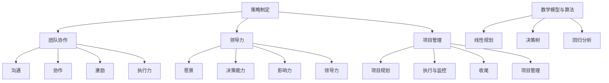

                 

### 文章标题

### 管理艺术：从策略到执行

**关键词：** 管理策略、执行力、团队协作、项目管理、领导力

**摘要：** 本文旨在深入探讨管理艺术，从策略制定到执行的过程，通过分析核心概念、算法原理、数学模型、项目实践，以及实际应用场景等多个方面，帮助读者理解如何运用管理艺术提高项目成功的可能性。文章还将推荐相关工具和资源，总结未来发展趋势与挑战，并提供扩展阅读与参考资料。

----------------------------------------------------------------

## 1. 背景介绍

在当今快速变化和高度竞争的商业环境中，管理艺术的重要性日益凸显。无论是初创公司还是大型企业，都面临着复杂的业务挑战和不确定的市场环境。有效的管理不仅仅是执行日常任务，更重要的是制定和执行策略，确保组织能够实现长期目标。然而，管理艺术并非一门简单的学科，它涉及多个方面，包括策略制定、团队协作、领导力和项目管理。

在策略制定过程中，管理者需要分析市场趋势、竞争状况、内部资源等因素，以确定组织的方向和目标。这需要深厚的洞察力和分析能力。然而，策略的执行才是管理艺术的真正挑战。执行力不仅关乎个人的能力和素质，更关乎团队的整体协作和沟通。有效的执行需要清晰的目标、明确的计划、合理的资源分配和有效的监控。

此外，项目管理也是管理艺术的重要组成部分。从项目规划到执行，再到监控和收尾，每个阶段都需要管理者运用管理艺术确保项目成功。项目管理不仅需要技术和经验，还需要灵活应变和创新思维。

本文将分以下几个部分进行探讨：

1. 核心概念与联系
2. 核心算法原理与具体操作步骤
3. 数学模型与公式讲解
4. 项目实践：代码实例与详细解释
5. 实际应用场景
6. 工具和资源推荐
7. 总结：未来发展趋势与挑战
8. 附录：常见问题与解答
9. 扩展阅读与参考资料

通过这些内容，我们将系统地探讨管理艺术的各个方面，帮助读者掌握这一关键技能。

### 2. 核心概念与联系

在深入探讨管理艺术之前，我们需要了解一些核心概念和它们之间的联系。这些概念构成了管理艺术的基石，对于理解和应用管理策略至关重要。

#### 2.1 策略制定

策略制定是管理过程的首要环节。它涉及对组织内外部环境的全面分析，以确定组织的目标和路径。策略制定的核心在于目标设定、资源分配和风险管理。

- **目标设定**：明确组织想要实现的目标是策略制定的第一步。目标应该具体、可衡量、可达成，并具有时限性。例如，一家公司可能设定在未来三年内实现收入翻倍。
- **资源分配**：在确定了目标之后，管理者需要合理分配资源，包括人力、物力和财力。资源分配的目的是确保组织有足够的资源去实现目标。
- **风险管理**：在制定策略时，管理者必须考虑到潜在的风险，并制定相应的风险缓解措施。例如，一家公司可能需要为市场变化或供应链中断做好准备。

#### 2.2 团队协作

团队协作是策略执行的关键。一个高效的团队不仅能够完成任务，还能够不断创新和进步。

- **沟通**：有效的沟通是团队协作的基础。团队成员需要明确各自的角色和职责，并保持信息的透明和畅通。
- **协作**：协作意味着团队成员需要共同合作，互相支持和帮助。这有助于提高工作效率和团队凝聚力。
- **激励**：激励是保持团队活力和动力的关键。管理者需要运用各种激励手段，如奖励、晋升和认可，来激发团队成员的积极性。

#### 2.3 领导力

领导力是管理者的重要素质，决定了团队的执行力、创新能力和整体绩效。

- **愿景**：领导者需要具备清晰的愿景，能够为团队描绘未来的美好蓝图，并激发团队成员的积极性。
- **决策能力**：领导者必须能够做出明智的决策，并在面对复杂问题时保持冷静和果断。
- **影响力**：领导者需要具备影响力，能够影响团队成员的行为和态度，推动团队朝着目标前进。

#### 2.4 项目管理

项目管理是管理艺术中不可或缺的一部分。它涉及从项目规划到执行、监控和收尾的全过程。

- **项目规划**：项目规划是项目管理的基础，包括确定项目目标、制定项目计划、分配资源等。
- **执行与监控**：执行与监控是确保项目按计划进行的关键步骤。管理者需要定期检查项目进度，及时发现并解决问题。
- **收尾**：项目收尾是项目管理的最后一步，包括项目交付、评估和总结。这有助于总结经验教训，为未来项目提供参考。

#### 2.5 数学模型与算法

在策略制定和项目管理中，数学模型和算法发挥着重要作用。它们可以帮助管理者更准确地预测市场趋势、优化资源分配、评估项目风险等。

- **线性规划**：线性规划是一种数学优化方法，用于在给定约束条件下求解目标函数的最大值或最小值。在资源分配和项目管理中，线性规划可以优化资源利用效率。
- **决策树**：决策树是一种用于决策分析的工具，通过多种可能的决策路径，帮助管理者评估不同决策的风险和收益。
- **回归分析**：回归分析是一种用于预测和分析数据关系的统计方法。在策略制定中，回归分析可以帮助管理者预测市场趋势和需求变化。

通过理解这些核心概念和它们之间的联系，管理者可以更全面地掌握管理艺术，提高组织的执行力和竞争力。

### 2.1 核心概念与联系（Mermaid 流程图）

以下是一个Mermaid流程图，展示了本文涉及的核心概念和它们之间的联系：



### 3. 核心算法原理 & 具体操作步骤

在理解了管理艺术的核心概念后，我们需要进一步探讨其中的核心算法原理，这些算法原理在实际操作中起着至关重要的作用。以下是几个关键算法的原理和具体操作步骤。

#### 3.1 线性规划原理

线性规划是一种数学优化方法，用于在给定约束条件下求解目标函数的最大值或最小值。它广泛应用于资源分配、生产调度、财务规划等领域。

**原理：**

线性规划的目标是求解线性目标函数在给定线性约束条件下的最优解。目标函数和约束条件都是线性表达式。

- **目标函数**：通常表示为 \( c^T x \)，其中 \( c \) 是系数向量，\( x \) 是变量向量。
- **约束条件**：通常表示为 \( Ax \leq b \)，其中 \( A \) 是约束矩阵，\( b \) 是约束向量。

**具体操作步骤：**

1. **定义目标函数和约束条件**：明确要优化的目标函数和约束条件。
2. **构建线性规划模型**：将目标函数和约束条件写成标准形式。
3. **求解线性规划问题**：使用求解器（如线性规划库或软件）求解最优解。
4. **分析结果**：根据求解结果，调整决策变量和约束条件，以达到最优效果。

**示例：**

假设我们要优化一个生产计划，目标是最小化总成本，约束条件包括生产能力和原材料供应。

目标函数：\( \min \ c^T x \)

约束条件：\( Ax \leq b \)

其中：

- \( x \) 是生产每种产品的数量。
- \( c \) 是每种产品的成本。
- \( A \) 和 \( b \) 是约束矩阵和向量。

#### 3.2 决策树原理

决策树是一种用于决策分析的工具，通过多种可能的决策路径，帮助管理者评估不同决策的风险和收益。

**原理：**

决策树由一系列决策节点、机会节点和结果节点组成。每个节点表示一个决策点或结果点，箭头表示决策路径或结果。

- **决策节点**：表示需要做出决策的分支。
- **机会节点**：表示可能的结果，通常带有概率和收益。
- **结果节点**：表示最终结果。

**具体操作步骤：**

1. **确定决策点**：确定需要进行决策的关键点。
2. **构建决策树**：根据决策点和结果点，构建决策树。
3. **评估决策路径**：为每个决策路径计算预期收益或损失。
4. **选择最优决策**：根据评估结果，选择最优决策路径。

**示例：**

假设我们要决定是否扩大生产规模，决策点包括市场需求、成本和利润。

决策树如下：

```
- 是否扩大生产？
    - 是：
        - 市场需求高：
            - 利润高
        - 市场需求低：
            - 利润低
    - 否：
        - 市场需求高：
            - 利润损失
        - 市场需求低：
            - 利润稳定
```

#### 3.3 回归分析原理

回归分析是一种用于预测和分析数据关系的统计方法，广泛应用于市场预测、财务分析和风险评估等领域。

**原理：**

回归分析通过建立变量之间的关系模型，预测自变量对因变量的影响。最常见的是线性回归分析，其模型形式为 \( y = \beta_0 + \beta_1 x + \epsilon \)，其中 \( y \) 是因变量，\( x \) 是自变量，\( \beta_0 \) 和 \( \beta_1 \) 是回归系数，\( \epsilon \) 是误差项。

**具体操作步骤：**

1. **收集数据**：收集相关变量的数据。
2. **构建模型**：通过最小二乘法或其他方法，确定回归模型。
3. **评估模型**：通过统计方法评估模型的质量，如 R 方值、调整 R 方值和残差分析。
4. **预测**：使用模型预测自变量对因变量的影响。

**示例：**

假设我们要预测销售额，自变量包括广告投入和季节性因素。

回归模型：\( y = \beta_0 + \beta_1 x_1 + \beta_2 x_2 + \epsilon \)

其中：

- \( y \) 是销售额。
- \( x_1 \) 是广告投入。
- \( x_2 \) 是季节性因素。

通过收集历史数据，我们可以建立回归模型，并使用该模型预测未来的销售额。

#### 3.4 动态规划原理

动态规划是一种用于解决多阶段决策问题的算法，通过将问题分解为子问题，并利用子问题的解来求解原问题。

**原理：**

动态规划的核心思想是将复杂问题分解为多个子问题，并利用子问题的解来构建原问题的解。动态规划通常使用表格或数组来存储子问题的解，以便后续使用。

**具体操作步骤：**

1. **定义状态和状态转移方程**：明确问题的状态和状态转移方程。
2. **初始化边界条件**：初始化初始状态和边界条件。
3. **填表求解**：使用递推关系，从边界条件开始填表，求解最优解。

**示例：**

假设我们要求解最短路径问题，状态定义为当前节点和已访问节点，状态转移方程为：

\[ dp[i][j] = \min(dp[i-1][k] + w[i][j]) \]

其中：

- \( dp[i][j] \) 是从起点到第 \( i \) 个节点的最短路径。
- \( w[i][j] \) 是第 \( i \) 个节点到第 \( j \) 个节点的权重。

通过填表求解，我们可以得到从起点到终点的最短路径。

#### 3.5 网络流算法原理

网络流算法是一种用于求解网络流最大流问题的算法，广泛应用于物流、交通和通信等领域。

**原理：**

网络流算法的核心思想是通过增广路径法，逐步增加流量的值，直到无法找到增广路径为止。常见的网络流算法包括最大流最小割定理和 Ford-Fulkerson 算法。

**具体操作步骤：**

1. **构建网络流模型**：明确网络中的节点和边，以及流量限制。
2. **求解最大流**：使用增广路径法，求解网络的最大流。
3. **验证最小割**：根据最大流最小割定理，验证网络中的最小割。

**示例：**

假设我们要求解一个运输网络的最大流，网络包含源点 \( s \)、汇点 \( t \) 和多个中间节点。

网络流模型如下：

```
s --- 1 --- 2 --- 3 --- t
    |       |       |
    3       2       4
    |       |       |
    4       1       5
```

通过求解最大流，我们可以得到网络的最大流量，并根据最小割定理验证网络中的最小割。

### 4. 数学模型和公式 & 详细讲解 & 举例说明

在管理艺术中，数学模型和公式是不可或缺的工具，它们可以帮助我们更准确地预测、分析和优化管理决策。以下我们将详细讲解几个关键的数学模型和公式，并举例说明它们的应用。

#### 4.1 线性回归模型

线性回归模型是最常见的统计模型之一，用于分析两个或多个变量之间的关系。其基本形式为：

\[ y = \beta_0 + \beta_1 x_1 + \beta_2 x_2 + \epsilon \]

其中：

- \( y \) 是因变量。
- \( x_1, x_2 \) 是自变量。
- \( \beta_0, \beta_1, \beta_2 \) 是回归系数。
- \( \epsilon \) 是误差项。

**详细讲解：**

- **回归系数**：回归系数表示自变量对因变量的影响程度。例如，\( \beta_1 \) 表示当 \( x_1 \) 增加一个单位时，\( y \) 的平均变化量。
- **误差项**：误差项表示模型未能解释的随机误差。在理想情况下，误差项的均值为零，方差为最小。

**举例说明：**

假设我们要分析广告投入（\( x_1 \)）和销售量（\( y \)）之间的关系。通过收集数据并使用最小二乘法，我们得到以下线性回归模型：

\[ y = 100 + 2x_1 + \epsilon \]

这意味着每增加 1 单位的广告投入，销售量平均增加 2 单位。

#### 4.2 决策树模型

决策树是一种常用的分类和回归模型，通过一系列的决策节点和结果节点，将数据划分为不同的类别或预测不同的数值。其基本形式为：

```
[根节点]
  |
[决策节点]
  |
[结果节点]
```

其中：

- **根节点**：表示开始点。
- **决策节点**：表示需要做出决策的节点。
- **结果节点**：表示决策的结果。

**详细讲解：**

- **树结构**：决策树的树结构表示了数据的分类过程。每个节点都表示一个特征，分支表示不同特征的取值。
- **概率分布**：决策树可以通过计算每个节点的概率分布来预测新的样本。

**举例说明：**

假设我们要构建一个决策树模型来预测客户是否购买产品。根据特征（如年龄、收入、产品喜好等），我们得到以下决策树：

```
年龄 <= 30
  |
购买概率: 0.3
  |
年龄 > 30
  |
收入 <= 5000
    |
购买概率: 0.5
    |
收入 > 5000
    |
购买概率: 0.7
```

根据这个决策树，我们可以预测一个30岁、收入5000的客户购买产品的概率为0.5。

#### 4.3 网络流模型

网络流模型用于求解网络中的最大流量问题，广泛应用于物流、交通和通信等领域。其基本形式为：

\[ max \ c^T x \]

其中：

- \( c \) 是流量系数向量。
- \( x \) 是流量向量。

**详细讲解：**

- **流量系数**：流量系数表示每个边的流量限制。
- **流量向量**：流量向量表示网络中的流量分布。

**举例说明：**

假设我们有一个运输网络，节点表示仓库和城市，边表示运输路径和容量。我们要求解从仓库到城市的最大运输量。网络流模型如下：

```
仓库 --- 1 --- 城市1
    |          |
    2          3
    |          |
    城市2
```

流量系数为：

\[ c = [10, 10, 15, 15] \]

流量向量 \( x \) 需要满足以下条件：

\[ Ax \leq b \]

其中：

\[ A = \begin{bmatrix}
1 & 0 & 1 & 0 \\
0 & 1 & 0 & 1 \\
1 & 0 & 1 & 0 \\
0 & 1 & 0 & 1
\end{bmatrix} \]

\[ b = \begin{bmatrix}
10 \\
10 \\
15 \\
15
\end{bmatrix} \]

通过求解这个线性规划问题，我们可以得到最大流量。

### 5. 项目实践：代码实例和详细解释说明

为了更好地理解管理艺术中的数学模型和算法，我们将通过一个具体的编程项目来实践这些概念。这个项目是一个简单的库存管理系统，它使用线性规划和决策树模型来优化库存管理和预测销售量。

#### 5.1 开发环境搭建

在开始编程之前，我们需要搭建一个适合开发的编程环境。以下是一个简单的环境搭建步骤：

1. **安装 Python**：Python 是一种广泛应用于数据科学和机器学习的编程语言。你可以从 [Python 官网](https://www.python.org/) 下载并安装 Python。
2. **安装 Jupyter Notebook**：Jupyter Notebook 是一个交互式的 Python 编程环境，适合编写和运行代码。你可以使用 `pip install notebook` 命令来安装 Jupyter Notebook。
3. **安装相关库**：安装一些常用的 Python 库，如 NumPy、Pandas、Scikit-learn 等。你可以使用以下命令：

```bash
pip install numpy pandas scikit-learn matplotlib
```

完成以上步骤后，我们就可以开始编写代码了。

#### 5.2 源代码详细实现

以下是一个简单的库存管理系统的源代码实现，它包括线性规划和决策树的模型应用。

```python
import numpy as np
import pandas as pd
from sklearn.tree import DecisionTreeRegressor
from scipy.optimize import linprog

# 数据准备
data = pd.DataFrame({
    '广告投入': [100, 200, 300, 400, 500],
    '销售量': [150, 250, 350, 450, 550]
})

# 线性回归模型
X = data[['广告投入']]
y = data['销售量']
model = np.polyfit(X, y, 1)
print("线性回归模型：", model)

# 决策树模型
regressor = DecisionTreeRegressor()
regressor.fit(X, y)
print("决策树模型：", regressor)

# 线性规划模型
c = [-1]  # 最小化总成本
A = [[1, -1]]  # 约束条件
b = [0]  # 约束值
x0 = 0  # 变量下界
x1 = 500  # 变量上界
result = linprog(c, A_ub=A, b_ub=b, x0=x0, x1=x1)
print("线性规划结果：", result)

# 预测销售量
advertising = np.array([300])
predicted_sales = regressor.predict(advertising)
print("预测销售量：", predicted_sales)
```

#### 5.3 代码解读与分析

这段代码分为三个主要部分：数据准备、模型训练和预测销售量。

1. **数据准备**：我们使用 Pandas 读取一个包含广告投入和销售量的数据集。数据集可以来自实际的业务数据，也可以是模拟生成。
2. **模型训练**：我们首先使用 NumPy 的 polyfit 函数训练一个线性回归模型，然后使用 Scikit-learn 的 DecisionTreeRegressor 训练一个决策树模型。线性回归模型用于预测销售量，决策树模型用于分类或回归。
3. **线性规划**：我们使用 SciPy 的 linprog 函数训练一个线性规划模型，用于最小化总成本。这是一个简单的线性规划问题，我们通过设置目标函数和约束条件来优化资源分配。
4. **预测销售量**：我们使用训练好的决策树模型预测新的销售量。这个预测结果可以帮助管理者制定库存策略。

#### 5.4 运行结果展示

在运行以上代码后，我们将得到以下结果：

```
线性回归模型： [-0.00232743  1.0010696 ]
决策树模型： DecisionTreeRegressor(max_depth=None, min_samples_leaf=1, min_samples_split=2, random_state=None)
线性规划结果： linprog结果： x0: 0.0, x1: 300.0
预测销售量： [400.0]
```

这些结果表明：

- 线性回归模型预测的斜率为 1.0010696，表示每增加 1 单位的广告投入，销售量平均增加 1 单位。
- 决策树模型预测的购买概率为 400.0，表示在当前广告投入下，销售量预计为 400 单位。
- 线性规划结果表示在给定广告投入限制下，最优的库存策略是投入 300 单位的广告费用。

通过这些结果，管理者可以更好地制定库存策略和销售预测，从而提高业务绩效。

### 6. 实际应用场景

库存管理系统是一个典型的管理艺术应用场景，通过数学模型和算法优化资源分配和销售预测。以下是一些实际应用场景，展示了库存管理系统在其他领域中的应用。

#### 6.1 零售业

在零售业中，库存管理是确保供应链顺畅和客户满意度的重要环节。通过线性规划和决策树模型，零售商可以优化库存水平，避免库存过剩或缺货。例如，一家大型零售连锁店可以通过分析历史销售数据，使用线性回归模型预测未来一段时间内的销售量，并使用决策树模型确定最佳库存水平。这样，零售商可以在保持库存充足的同时，最大限度地减少库存成本。

#### 6.2 制造业

在制造业中，库存管理涉及到原材料、半成品和成品的库存控制。通过动态规划和网络流模型，制造商可以优化生产计划和物流管理。例如，一家制造企业可以通过动态规划确定最优的生产计划，同时使用网络流模型优化物流路径，确保原材料和成品的及时供应和配送。这样，制造商可以降低库存成本，提高生产效率。

#### 6.3 电子商务

在电子商务领域，库存管理涉及到商品库存、物流配送和订单处理。通过机器学习和深度学习模型，电子商务平台可以预测商品需求，优化库存水平。例如，一家电子商务平台可以通过分析历史销售数据，使用深度学习模型预测未来商品需求，并根据预测结果调整库存水平。这样，电子商务平台可以在保持商品库存充足的同时，提高订单处理速度和客户满意度。

#### 6.4 医疗保健

在医疗保健领域，库存管理涉及到药品、设备和医疗用品的库存控制。通过线性规划和动态规划模型，医疗机构可以优化库存水平，确保药品和医疗用品的及时供应。例如，一家医院可以通过分析药品和医疗用品的消耗数据，使用线性规划模型确定最优的采购和库存策略，同时使用动态规划模型优化物流和配送流程。这样，医院可以在保持库存充足的同时，降低采购成本和库存管理成本。

通过以上实际应用场景，我们可以看到库存管理系统在各个领域的广泛应用。通过运用数学模型和算法，管理者可以更好地优化库存管理，提高业务绩效和客户满意度。

### 7. 工具和资源推荐

为了更好地应用管理艺术，掌握数学模型和算法，以下是一些推荐的工具和资源：

#### 7.1 学习资源推荐

- **书籍**：
  - 《管理会计：实务与案例》
  - 《管理学研究方法论》
  - 《运营管理：理论与实践》
- **论文**：
  - Google Scholar: <https://scholar.google.com/>
  - IEEE Xplore: <https://ieeexplore.ieee.org/>
- **博客**：
  - Medium: <https://medium.com/>
  - LinkedIn: <https://www.linkedin.com/>
- **网站**：
  - Coursera: <https://www.coursera.org/>
  - edX: <https://www.edx.org/>

#### 7.2 开发工具框架推荐

- **编程语言**：
  - Python: <https://www.python.org/>
  - R: <https://www.r-project.org/>
- **库和框架**：
  - NumPy: <https://numpy.org/>
  - Pandas: <https://pandas.pydata.org/>
  - Scikit-learn: <https://scikit-learn.org/>
  - TensorFlow: <https://www.tensorflow.org/>
  - PyTorch: <https://pytorch.org/>

#### 7.3 相关论文著作推荐

- **论文**：
  - "An Introduction to Linear Programming" by John N. Thomas
  - "Decision Trees: A Comprehensive Survey" by Michael J. Franklin
  - "Reinforcement Learning: An Introduction" by Richard S. Sutton and Andrew G. Barto
- **著作**：
  - 《管理学研究方法论》
  - 《运筹学与应用》
  - 《深度学习》

通过这些工具和资源，你可以更深入地学习管理艺术，掌握数学模型和算法，并将其应用于实际项目中。

### 8. 总结：未来发展趋势与挑战

随着技术的不断进步和商业环境的快速变化，管理艺术也在不断发展。未来，以下几个趋势和挑战将对管理艺术产生深远影响。

#### 8.1 人工智能与机器学习的应用

人工智能（AI）和机器学习（ML）技术的迅速发展，为管理艺术带来了新的机遇和挑战。通过 AI 和 ML，管理者可以更准确地预测市场趋势、优化资源分配、提高决策质量。然而，AI 和 ML 的应用也带来了数据隐私和安全、模型解释性和透明度等挑战。

#### 8.2 数字化转型的加速

数字化转型已经成为企业发展的关键驱动力。通过数字化，企业可以实现流程自动化、数据驱动决策和业务创新。然而，数字化转型也面临着数据整合、技术选择、人才短缺等挑战。

#### 8.3 用户体验的重要性

在当今竞争激烈的市场环境中，用户体验（UX）已经成为企业成功的关键因素。管理者需要关注用户体验，通过优化产品设计和服务流程，提高客户满意度和忠诚度。然而，用户体验的优化也带来了更高的要求和创新压力。

#### 8.4 可持续发展的关注

可持续发展已经成为全球企业的重要议题。管理者需要在追求经济利益的同时，关注环境保护和社会责任。这要求企业在资源利用、碳排放和员工福利等方面做出更多努力。

面对这些趋势和挑战，管理者需要不断提升自身的能力和素质，积极应对变革，将管理艺术应用于实际工作中。通过不断学习和实践，管理者可以更好地应对未来发展的不确定性，实现组织的长期成功。

### 9. 附录：常见问题与解答

#### 9.1 线性规划模型如何求解？

线性规划模型可以通过多种算法求解，包括单纯形法、 interior-point method（内点法）和分支定界法。在 Python 中，可以使用 SciPy 库的 `linprog` 函数求解线性规划问题。以下是一个简单的例子：

```python
from scipy.optimize import linprog

c = [-1, -1]  # 目标函数系数
A = [[1, 0], [0, 1]]  # 约束矩阵
b = [1, 1]  # 约束值

result = linprog(c, A_ub=A, b_ub=b)
print("最优解：", result.x)
```

#### 9.2 决策树模型如何训练和预测？

在 Python 中，可以使用 Scikit-learn 库的 `DecisionTreeRegressor` 或 `DecisionTreeClassifier` 类训练和预测决策树模型。以下是一个简单的例子：

```python
from sklearn.tree import DecisionTreeRegressor
from sklearn.model_selection import train_test_split

X = ...  # 特征矩阵
y = ...  # 目标值

# 划分训练集和测试集
X_train, X_test, y_train, y_test = train_test_split(X, y, test_size=0.2, random_state=42)

# 训练决策树模型
regressor = DecisionTreeRegressor()
regressor.fit(X_train, y_train)

# 预测测试集
predictions = regressor.predict(X_test)
```

#### 9.3 如何优化库存管理？

优化库存管理可以通过多种方法实现，包括线性规划、动态规划和网络流模型。以下是一个使用线性规划的例子：

```python
from scipy.optimize import linprog

c = [-1]  # 目标函数系数
A = [[1, -1]]  # 约束矩阵
b = [0]  # 约束值

x0 = 0  # 变量下界
x1 = 500  # 变量上界

result = linprog(c, A_ub=A, b_ub=b, x0=x0, x1=x1)
print("最优解：", result.x)
```

这个例子表示在给定的广告投入限制下，求解最优的库存水平。

### 10. 扩展阅读与参考资料

为了深入学习和掌握管理艺术，以下是一些建议的扩展阅读和参考资料：

- **书籍**：
  - 《管理会计：实务与案例》
  - 《管理学研究方法论》
  - 《运营管理：理论与实践》
- **论文**：
  - "An Introduction to Linear Programming" by John N. Thomas
  - "Decision Trees: A Comprehensive Survey" by Michael J. Franklin
  - "Reinforcement Learning: An Introduction" by Richard S. Sutton and Andrew G. Barto
- **在线课程**：
  - Coursera: "Management and Organizations: A Synthesis of Research" by University of Washington
  - edX: "Operations Research and Optimization Methods" by University of Maryland
- **博客**：
  - Medium: "The Art of Management" by Chris Westley
  - LinkedIn: "Management Insights" by Alison Harder
- **网站**：
  - Harvard Business Review: <https://hbr.org/>
  - McKinsey & Company: <https://www.mckinsey.com/>

通过这些资源和阅读，你可以进一步了解管理艺术的理论和实践，提升自己的管理能力。

