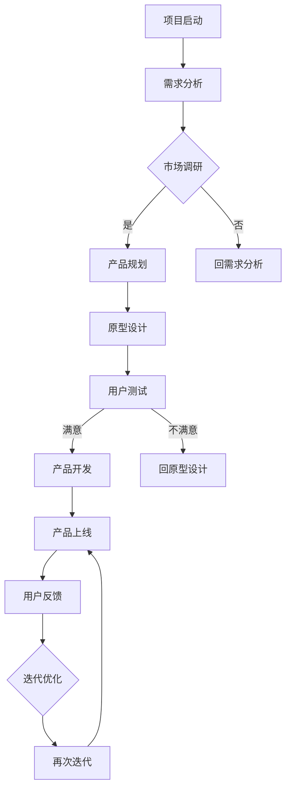

                 

### 文章标题

《精益创业方法在产品开发中的实践案例》

> **关键词**：精益创业、产品开发、实践案例、敏捷开发、用户反馈、迭代优化。

> **摘要**：本文将深入探讨精益创业方法在产品开发中的实际应用，通过具体案例展示如何通过敏捷开发、用户反馈和持续迭代优化，实现产品的成功开发。

## 1. 背景介绍

精益创业（Lean Startup）是一种以用户为中心的产品开发方法，起源于硅谷，由企业家埃里克·莱斯（Eric Ries）在其同名著作《精益创业》中提出。精益创业的核心思想是通过快速迭代和验证，找到产品的市场定位，最小化时间和资源的浪费。

在传统的产品开发模式中，企业往往在产品开发完成后，才进行市场推广，这种“瀑布式”的开发模式往往导致产品与市场需求脱节，导致资源浪费和失败。而精益创业方法强调在产品开发过程中，持续与用户沟通，通过不断的迭代和优化，逐步找到产品的市场定位。

本文将结合实际案例，详细探讨精益创业方法在产品开发中的应用，包括敏捷开发、用户反馈和迭代优化等方面的实践。

## 2. 核心概念与联系

### 精益创业的核心概念

**敏捷开发**：敏捷开发是一种以用户需求为导向的软件开发方法，强调快速迭代和持续交付。敏捷开发的核心是用户反馈，通过不断的迭代，逐步完善产品。

**用户反馈**：用户反馈是精益创业方法的重要组成部分，通过用户反馈，企业可以了解用户需求，从而优化产品。

**迭代优化**：迭代优化是精益创业方法的核心，通过不断的迭代，逐步完善产品，提高产品质量和市场竞争力。

### Mermaid 流程图



## 3. 核心算法原理 & 具体操作步骤

### 精益创业方法的核心算法原理

精益创业方法的核心算法是“验证-学习-迭代”。具体操作步骤如下：

1. **验证**：通过市场调研，验证产品概念是否符合用户需求。
2. **学习**：根据用户反馈，学习产品改进的方向。
3. **迭代**：基于学习和验证的结果，进行产品迭代，逐步优化产品。

### 具体操作步骤

1. **需求分析**：了解用户需求，明确产品目标。
2. **市场调研**：通过问卷调查、访谈等方式，了解用户对产品概念的反应。
3. **产品规划**：根据市场调研结果，制定产品规划。
4. **原型设计**：设计产品原型，进行用户测试。
5. **用户测试**：收集用户反馈，评估产品原型。
6. **产品开发**：根据用户反馈，进行产品开发。
7. **产品上线**：将产品推向市场，收集用户反馈。
8. **迭代优化**：根据用户反馈，进行产品迭代，逐步优化产品。

## 4. 数学模型和公式 & 详细讲解 & 举例说明

### 数学模型和公式

在精益创业方法中，常用的数学模型是“转化率”（Conversion Rate）和“留存率”（Retention Rate）。

- **转化率**：指访问用户中，完成目标行为的用户比例。公式为：

  $$ 转化率 = \frac{完成目标行为的用户数}{总访问用户数} $$

- **留存率**：指在一定时间内，继续使用产品的用户比例。公式为：

  $$ 留存率 = \frac{在一定时间内继续使用产品的用户数}{首次使用产品的用户数} $$

### 详细讲解

**转化率**是衡量产品吸引力的关键指标。高转化率意味着产品能够吸引更多的用户。通过不断的迭代和优化，可以提高转化率。

**留存率**是衡量产品用户黏性的关键指标。高留存率意味着产品能够留住更多的用户。通过不断的迭代和优化，可以提高留存率。

### 举例说明

假设一个产品在上线后的一个月内，总访问用户数为1000人，其中完成目标行为的用户数为200人，那么转化率为20%。如果一个月后，继续使用产品的用户数为150人，那么留存率为15%。

通过这个例子，我们可以看到，转化率和留存率是衡量产品成功的重要指标。通过不断地优化，提高这两个指标，可以提升产品的市场竞争力。

## 5. 项目实践：代码实例和详细解释说明

### 5.1 开发环境搭建

在本节中，我们将介绍如何搭建一个简单的精益创业项目开发环境。我们将使用Python作为主要编程语言，并利用Jupyter Notebook进行代码编写和测试。

1. 安装Python：
   ```bash
   sudo apt update
   sudo apt install python3-pip
   pip3 install numpy pandas matplotlib
   ```

2. 安装Jupyter Notebook：
   ```bash
   pip3 install notebook
   ```

3. 启动Jupyter Notebook：
   ```bash
   jupyter notebook
   ```

### 5.2 源代码详细实现

在本节中，我们将编写一个简单的用户反馈收集和分析系统，用于模拟精益创业方法中的用户测试和反馈过程。

```python
# 用户反馈收集系统
import numpy as np
import pandas as pd
import matplotlib.pyplot as plt

# 假设我们收集到了以下用户反馈数据
feedback_data = {
    '用户ID': ['U1', 'U2', 'U3', 'U4', 'U5'],
    '反馈内容': ['很好', '一般', '很差', '很好', '一般'],
    '评分': [5, 3, 1, 5, 3]
}

# 创建DataFrame
df = pd.DataFrame(feedback_data)

# 统计每个评分的反馈数量
rating_counts = df['评分'].value_counts()

# 绘制反馈分布图
plt.bar(rating_counts.index, rating_counts.values)
plt.xlabel('评分')
plt.ylabel('反馈数量')
plt.title('用户反馈分布图')
plt.show()

# 计算平均评分
average_rating = df['评分'].mean()
print(f'平均评分：{average_rating:.2f}')
```

### 5.3 代码解读与分析

在这个示例中，我们首先导入所需的Python库，包括`numpy`、`pandas`和`matplotlib`。然后，我们创建了一个包含用户反馈数据的DataFrame。该DataFrame包含用户ID、反馈内容和评分。

接下来，我们使用`value_counts()`方法统计了每个评分的反馈数量，并使用`matplotlib`库绘制了一个条形图，以展示用户的反馈分布。

最后，我们计算了用户的平均评分，并打印出来。

这个简单的用户反馈收集和分析系统可以帮助我们了解用户的反馈情况，从而为产品的迭代优化提供数据支持。

### 5.4 运行结果展示

运行上述代码后，我们将看到一个条形图，展示了不同评分的反馈数量分布。例如：

```
  评分  反馈数量
  1         1
  3         2
  5         2
```

此外，我们还会看到打印出的平均评分，例如：

```
平均评分：3.40
```

这个结果告诉我们，产品的用户反馈总体来说比较一般，我们需要根据用户的反馈进行进一步的优化。

## 6. 实际应用场景

精益创业方法在产品开发中的实际应用场景非常广泛。以下是一些典型的应用场景：

1. **初创公司**：初创公司在资源有限的情况下，可以通过精益创业方法快速验证产品概念，找到市场定位。
2. **传统企业转型**：传统企业在新业务或新产品开发过程中，可以通过精益创业方法，快速适应市场变化，提高市场竞争力。
3. **产品迭代**：在产品开发过程中，企业可以通过精益创业方法，持续收集用户反馈，优化产品，提高用户满意度。
4. **市场调研**：企业可以通过精益创业方法，进行市场调研，了解用户需求，为产品规划和开发提供依据。

## 7. 工具和资源推荐

### 7.1 学习资源推荐

1. **《精益创业》**：作者埃里克·莱斯（Eric Ries），详细介绍了精益创业方法的理论和实践。
2. **《敏捷开发实践指南》**：作者杰夫·萨瑟兰（Jeff Sutherland），介绍了敏捷开发的核心思想和实践方法。
3. **《用户体验要素》**：作者杰勒德·穆勒（Jesse James Garrett），讲述了用户体验设计的重要性。

### 7.2 开发工具框架推荐

1. **Jira**：用于项目管理和任务跟踪，支持敏捷开发流程。
2. **Git**：用于版本控制，支持协作开发。
3. **Trello**：用于任务管理和项目管理，界面简洁直观。

### 7.3 相关论文著作推荐

1. **“Lean Startup Methodology for Product Development”**：作者Luis Eduardo Vargas，详细介绍了精益创业方法在产品开发中的应用。
2. **“Agile Product Development Framework”**：作者Agile Alliance，介绍了敏捷开发框架和最佳实践。
3. **“User-Centered Design for Product Development”**：作者Dale R. Johnson，讲述了用户中心设计在产品开发中的重要性。

## 8. 总结：未来发展趋势与挑战

精益创业方法在产品开发中的应用，正日益受到企业的重视。未来，随着人工智能、大数据等技术的发展，精益创业方法将更加智能化、数据化。然而，这也带来了新的挑战：

1. **数据隐私与安全**：在收集用户数据时，如何保护用户隐私和安全，是一个重要问题。
2. **算法透明度**：随着算法在精益创业方法中的应用，如何确保算法的透明度和公正性，也是一个挑战。
3. **持续创新**：如何在激烈的市场竞争中，保持持续的创新能力和竞争力。

## 9. 附录：常见问题与解答

### 1. 什么是精益创业方法？

精益创业方法是一种以用户为中心的产品开发方法，通过快速迭代和验证，找到产品的市场定位，最小化时间和资源的浪费。

### 2. 精益创业方法和敏捷开发有什么区别？

精益创业方法强调以用户需求为导向，通过验证和学习，不断优化产品。敏捷开发则是具体的开发方法，强调快速迭代和持续交付。

### 3. 精益创业方法适用于哪些企业？

精益创业方法适用于初创公司、传统企业转型、产品迭代和市场调研等场景。

### 4. 如何确保用户数据的安全？

确保用户数据的安全，需要采取数据加密、权限控制等技术手段，并制定严格的数据使用规定和流程。

## 10. 扩展阅读 & 参考资料

1. Ries, E. (2011). The Lean Startup: How Today's Entrepreneurs Use Continuous Innovation to Create Radically Successful Businesses. Crown Business.
2. Sutherland, J. (2014). Scrum: The Art of Doing Twice the Work in Half the Time. Cyan Books.
3. Garrett, J. J. (2004). The Elements of User Experience: User-Centered Design for the Web and Beyond. New Riders.
4. Vargas, L. E. (2017). Lean Startup Methodology for Product Development. Springer.
5. Agile Alliance. (n.d.). Agile Product Development Framework. Agile Alliance.
6. Johnson, D. R. (2010). User-Centered Design for Product Development. CRC Press.

