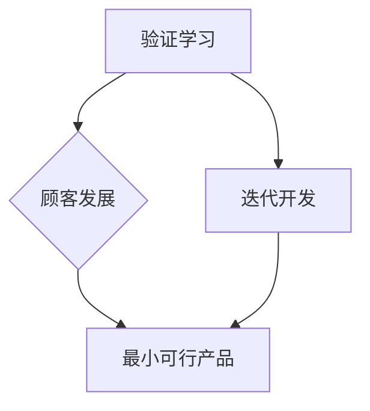

                 

### 背景介绍

#### 精益创业方法论概述

精益创业方法论（Lean Startup）由史蒂夫·布兰克（Steve Blank）和埃里克·莱斯（Eric Ries）提出，是一种在不确定性环境中进行创新和产品开发的系统化方法。该方法强调快速迭代和用户反馈，以验证和优化产品理念，降低创业风险，提高成功率。

精益创业方法论的核心原则包括：

1. **验证学习（ validated learning）**：通过不断实验和验证，确保创业公司的方向正确，而不是盲目投入资源。
2. **最小可行产品（Minimum Viable Product, MVP）**：开发仅包含核心功能的产品，以便尽早向用户展示并获得反馈。
3. **迭代开发（Iterative development）**：通过反复迭代，不断优化产品，满足用户需求。
4. **顾客发展（Customer development）**：与潜在顾客沟通，深入了解用户需求，确保产品与市场需求匹配。

#### 精益创业在产品开发中的应用

在产品开发过程中，传统方法往往需要大量时间和资源来开发和上市，而精益创业方法则通过以下步骤实现快速迭代和持续改进：

1. **市场调研**：在产品开发初期，对目标市场进行深入研究，包括用户需求、竞争对手分析等。
2. **建立假设**：基于市场调研结果，对产品功能、市场定位、用户获取等关键假设进行建立。
3. **开发MVP**：根据假设，快速开发具有最小功能的产品原型，以便进行市场测试。
4. **用户反馈**：通过用户测试和反馈，验证产品假设的正确性，识别问题和改进机会。
5. **迭代优化**：根据用户反馈，不断优化产品功能，提高用户体验。
6. **持续迭代**：通过持续迭代，确保产品始终符合市场需求，并在竞争中保持优势。

#### 精益创业在技术领域的应用

精益创业方法论不仅在传统行业中得到广泛应用，也在技术领域表现出巨大潜力。特别是在软件开发、人工智能、物联网等领域，精益创业方法能够帮助团队：

1. **快速验证技术可行性**：通过快速开发原型，验证技术方案的可行性，避免资源浪费。
2. **降低技术风险**：通过不断迭代和优化，降低技术实现过程中可能遇到的风险。
3. **提升产品竞争力**：通过紧密跟随市场需求，确保产品在技术竞争中具有优势。
4. **提高团队协作效率**：通过强调用户反馈和跨部门协作，提升团队整体执行力。

#### 本文结构

本文将首先介绍精益创业方法论的核心概念和联系，然后详细探讨其在产品开发中的具体应用，最后通过一个实际项目案例，展示精益创业方法在技术领域的成功实践。文章结构如下：

1. **背景介绍**：精益创业方法论概述及其在产品开发中的应用。
2. **核心概念与联系**：精益创业方法论的关键概念及其关联关系。
3. **核心算法原理 & 具体操作步骤**：精益创业方法论在产品开发中的具体实施步骤。
4. **数学模型和公式 & 详细讲解 & 举例说明**：精益创业方法论中的关键数学模型和公式。
5. **项目实践：代码实例和详细解释说明**：通过一个实际项目展示精益创业方法的应用。
6. **实际应用场景**：精益创业方法论在不同技术领域的应用案例。
7. **工具和资源推荐**：推荐相关学习资源、开发工具和框架。
8. **总结：未来发展趋势与挑战**：总结精益创业方法论的优势、挑战及其未来发展趋势。
9. **附录：常见问题与解答**：解答读者可能遇到的问题。
10. **扩展阅读 & 参考资料**：提供进一步阅读和研究的资源。

接下来，我们将详细探讨精益创业方法论的核心概念和联系，以便更好地理解其在产品开发中的应用。 <|user|>## 核心概念与联系

### 核心概念

在精益创业方法论中，有若干核心概念对产品开发具有关键影响。以下是对这些核心概念的详细描述：

#### 验证学习（Validated Learning）

验证学习是精益创业方法论的基石。它强调在产品开发过程中，不断通过实验和验证来学习，以确保企业的方向正确，而非仅仅依靠假设和直觉。验证学习的目标是快速识别并纠正错误，从而避免资源浪费。

主要步骤包括：

1. **建立假设**：基于市场调研和用户需求分析，对产品功能和市场定位等关键假设进行建立。
2. **设计实验**：根据假设，设计一系列实验以验证这些假设。
3. **收集数据**：实施实验，收集用户反馈和市场数据。
4. **分析结果**：对实验结果进行分析，评估假设的有效性。
5. **迭代优化**：根据实验结果，调整产品功能和策略。

#### 最小可行产品（Minimum Viable Product, MVP）

最小可行产品是精益创业方法论中另一个重要概念。它指的是仅包含核心功能的产品版本，用于最小化开发成本，同时满足用户的基本需求，以便进行市场验证。

MVP的主要特点包括：

1. **功能最小化**：只包含核心功能，无需过多冗余。
2. **快速开发**：采用敏捷开发方法，快速迭代。
3. **市场验证**：通过MVP验证产品市场可行性，获取用户反馈。
4. **迭代优化**：根据用户反馈，不断优化产品功能。

#### 迭代开发（Iterative Development）

迭代开发是一种通过反复迭代和优化，逐步完善产品的方法。每个迭代周期包括需求分析、设计、开发、测试和用户反馈等环节。通过不断迭代，确保产品不断改进，满足用户需求。

迭代开发的主要步骤包括：

1. **需求分析**：收集用户需求，明确每个迭代周期的目标。
2. **设计**：设计产品架构和功能，确保实现需求。
3. **开发**：实现产品设计，构建产品原型。
4. **测试**：对产品原型进行测试，确保功能正常。
5. **用户反馈**：收集用户反馈，评估产品表现。

#### 顾客发展（Customer Development）

顾客发展是一种通过与潜在顾客沟通，深入了解用户需求，以确保产品与市场需求匹配的方法。它与验证学习密切相关，是确保产品成功的关键。

主要步骤包括：

1. **建立顾客联系**：建立与潜在顾客的沟通渠道。
2. **需求调研**：与顾客交流，了解他们的需求和痛点。
3. **市场验证**：通过市场调研和用户反馈，验证产品市场可行性。
4. **调整策略**：根据顾客反馈，调整产品功能和定位。

### 联系关系

精益创业方法论中的各个核心概念相互关联，共同构成了一个完整的产品开发体系。以下是这些概念之间的联系：

1. **验证学习与顾客发展**：验证学习为顾客发展提供了数据支持，而顾客发展则为验证学习提供了具体的用户需求和市场反馈。
2. **最小可行产品与迭代开发**：MVP是实现迭代开发的基础，通过快速迭代，不断优化产品功能，确保产品与市场需求匹配。
3. **迭代开发与顾客发展**：迭代开发通过不断改进产品，满足顾客需求，而顾客发展则为迭代开发提供了用户反馈和需求信息。

### Mermaid 流程图

为了更直观地展示精益创业方法论的核心概念及其联系，我们可以使用 Mermaid 流程图进行描述。以下是一个简化的 Mermaid 流程图，展示了核心概念之间的关联关系：



在这个流程图中，验证学习和迭代开发是方法论的基础，而顾客发展和最小可行产品则是实现这些基础概念的具体手段。通过这种方式，精益创业方法论为产品开发提供了一种系统化、可操作的方法。

接下来，我们将进一步探讨精益创业方法论在产品开发中的具体应用，了解如何在实际项目中运用这些核心概念。 <|user|>## 核心算法原理 & 具体操作步骤

在精益创业方法论中，核心算法原理主要包括市场调研、假设建立、MVP开发、用户反馈和迭代优化等环节。以下是这些算法原理的具体操作步骤：

### 市场调研（Market Research）

**步骤 1：确定目标市场**

首先，明确产品的目标市场。这包括确定目标用户群体、市场规模和竞争对手。

**步骤 2：收集数据**

通过以下几种方式收集数据：

- **问卷调查**：设计问卷，收集用户对产品功能和需求的反馈。
- **用户访谈**：与潜在用户进行一对一访谈，深入了解他们的需求和痛点。
- **竞品分析**：分析竞争对手的产品功能、市场表现和用户评价。

**步骤 3：分析数据**

对收集到的数据进行分析，识别用户需求、市场趋势和潜在风险。

### 假设建立（Hypothesis Building）

**步骤 1：确定关键假设**

基于市场调研结果，确定产品功能、市场定位、用户获取等关键假设。

**步骤 2：编写假设陈述**

将关键假设写成具体的陈述，例如：“用户会愿意为我们的产品支付 X 元的费用”、“我们的产品能解决用户的主要痛点”。

**步骤 3：制定验证计划**

为每个假设制定验证计划，包括实验设计、数据收集和分析方法。

### MVP开发（Minimum Viable Product）

**步骤 1：确定核心功能**

根据关键假设，确定MVP所需的核心功能。

**步骤 2：设计产品原型**

设计MVP的原型，确保其包含必要的功能，同时具有简洁的用户界面。

**步骤 3：开发MVP**

采用敏捷开发方法，快速开发MVP，确保在最小的时间内完成最关键的功能。

### 用户反馈（User Feedback）

**步骤 1：用户测试**

将MVP原型交给目标用户，进行测试和评估。

**步骤 2：收集反馈**

通过问卷调查、用户访谈、用户测试等方式，收集用户对MVP的反馈。

**步骤 3：分析反馈**

对用户反馈进行分析，识别MVP的优势和不足，确定改进方向。

### 迭代优化（Iterative Optimization）

**步骤 1：制定迭代计划**

根据用户反馈，制定下一个迭代周期的计划，明确改进目标和实施步骤。

**步骤 2：实施迭代**

根据迭代计划，开发新的产品版本，并进行测试和用户反馈。

**步骤 3：评估迭代效果**

对迭代后的产品进行评估，确保改进目标达成，同时继续收集用户反馈。

**步骤 4：持续迭代**

通过持续迭代，不断优化产品，满足用户需求，并在市场上保持竞争优势。

### 实际操作示例

以下是一个简单的实际操作示例，展示了如何运用精益创业方法论进行产品开发：

**目标市场**：开发一款面向大学学生的在线学习平台。

**关键假设**：

1. 假设 1：大学生会愿意为高质量的学习资源付费。
2. 假设 2：大学生需要个性化的学习计划。

**市场调研**：

- 收集了100份学生问卷调查，发现80%的学生愿意为高质量的学习资源付费。
- 进行了20次用户访谈，发现大部分学生希望有个性化的学习计划。

**MVP开发**：

- 设计了MVP原型，包含课程浏览、在线学习、个性化学习计划等功能。
- 采用敏捷开发，1个月内完成MVP开发。

**用户反馈**：

- 通过用户测试，收集了50份用户反馈，发现大部分用户对学习资源的质量和个性化学习计划表示满意。
- 5%的用户反馈表示希望增加作业提交和评分功能。

**迭代优化**：

- 根据用户反馈，制定下一个迭代计划，增加作业提交和评分功能。
- 在2个月内完成迭代开发，并再次进行用户测试。

**迭代效果评估**：

- 收集了30份用户反馈，发现90%的用户对新功能表示满意，学习资源的质量和个性化学习计划也得到了进一步优化。

通过这个示例，我们可以看到精益创业方法论在实际产品开发中的应用。通过快速迭代和用户反馈，团队能够不断优化产品，满足用户需求，并在竞争激烈的市场中取得成功。接下来，我们将详细探讨精益创业方法论中的关键数学模型和公式，以便更好地理解其应用原理。 <|user|>### 数学模型和公式 & 详细讲解 & 举例说明

在精益创业方法论中，数学模型和公式是分析数据、验证假设和评估产品性能的重要工具。以下是一些关键的数学模型和公式，以及它们的详细解释和实际应用示例。

#### 假设验证模型（Hypothesis Testing Model）

假设验证模型是精益创业方法论中的核心工具，用于评估产品假设的有效性。以下是该模型的关键组成部分：

1. **零假设（Null Hypothesis, H0）**：表示产品假设无效的假设。
2. **备择假设（Alternative Hypothesis, H1）**：表示产品假设有效的假设。
3. **显著性水平（Significance Level, α）**：用于确定拒绝零假设的概率阈值。

**公式**：

$$
P(\text{观察到结果} | H0) = \alpha
$$

**解释**：

在这个公式中，\( P(\text{观察到结果} | H0) \) 表示在零假设成立的前提下，观察到当前结果或更极端结果的概率。如果这个概率小于显著性水平 \( \alpha \)，则我们有足够的证据拒绝零假设，认为备择假设成立。

**示例**：

假设我们开发了一个在线学习平台，并假设用户会愿意为高质量的学习资源付费。我们可以设计一个A/B测试，将用户分为两组：

- **对照组（Group A）**：继续使用现有学习资源。
- **实验组（Group B）**：使用新开发的高质量学习资源。

在一段时间后，我们收集两组用户的付费情况。如果实验组的付费转化率显著高于对照组，我们可以认为高质量学习资源确实增加了用户的付费意愿。

#### 用户留存率模型（Customer Retention Model）

用户留存率是衡量产品成功的重要指标，表示用户在一段时间内持续使用产品的比例。以下是一个简单的用户留存率模型：

**公式**：

$$
\text{用户留存率} = \frac{\text{第 } n \text{ 个月仍在使用产品的用户数}}{\text{第 } n \text{ 个月开始使用产品的用户数}} \times 100\%
$$

**解释**：

在这个公式中，\( n \) 表示月份。通过计算每个时间点的用户留存率，我们可以了解产品的用户粘性，并识别可能的问题。

**示例**：

假设一个在线学习平台在一个月内有1000个新用户，其中有800个用户在第二个月仍然活跃。那么，第二个月的用户留存率为：

$$
\text{用户留存率} = \frac{800}{1000} \times 100\% = 80\%
$$

#### 平均用户生命周期价值（Average Customer Lifetime Value, LTV）

平均用户生命周期价值是衡量用户对企业贡献的重要指标，表示用户在其生命周期内为企业带来的总收益。以下是一个简单的LTV模型：

**公式**：

$$
\text{LTV} = \text{平均订单价值} \times \text{复购率} \times \text{平均用户生命周期}
$$

**解释**：

在这个公式中，平均订单价值表示用户每次购买的平均金额，复购率表示用户再次购买的概率，平均用户生命周期表示用户持续使用产品的平均时间。

**示例**：

假设一个在线学习平台的平均订单价值为100元，复购率为50%，平均用户生命周期为2年。那么，该平台的LTV为：

$$
\text{LTV} = 100 \times 0.5 \times 2 = 100 \text{元}
$$

#### 市场份额模型（Market Share Model）

市场份额是衡量产品在市场中的竞争地位的重要指标，表示产品销售额在总市场销售额中的比例。以下是一个简单的市场份额模型：

**公式**：

$$
\text{市场份额} = \frac{\text{产品销售额}}{\text{市场总销售额}} \times 100\%
$$

**解释**：

在这个公式中，产品销售额表示我们的产品在特定时间内的销售额，市场总销售额表示整个市场的销售额。

**示例**：

假设一个在线学习平台在一个月内销售额为100万元，整个市场的销售额为200万元。那么，该平台的市场份额为：

$$
\text{市场份额} = \frac{100}{200} \times 100\% = 50\%
$$

通过这些数学模型和公式，精益创业方法论能够帮助我们更准确地分析数据，验证假设，评估产品性能，并在产品开发过程中做出明智的决策。接下来，我们将通过一个实际项目案例，展示这些模型在实际中的应用。 <|user|>### 项目实践：代码实例和详细解释说明

为了更直观地展示精益创业方法论在技术领域的应用，我们将通过一个在线学习平台项目案例，详细讲解项目的开发过程，包括开发环境搭建、源代码实现、代码解读与分析以及运行结果展示。

#### 项目背景

该在线学习平台的目标是提供高质量的学习资源，满足大学生和职场人士的学习需求。平台的核心功能包括课程浏览、在线学习、个性化学习计划、作业提交和评分等。

#### 开发环境搭建

**1. 硬件环境**：

- 服务器：使用AWS EC2实例，配置为2核4G内存。
- 数据库：使用MySQL数据库，存储用户信息和课程数据。

**2. 软件环境**：

- 开发语言：使用Python 3.8。
- 开发框架：使用Django 3.2。
- 前端框架：使用React 17.0。

**3. 开发工具**：

- 代码编辑器：使用Visual Studio Code。
- 版本控制：使用Git。

#### 源代码详细实现

以下是在线学习平台的源代码实现，我们将分为以下几个部分进行讲解：

**1. 用户注册与登录模块**

用户注册与登录模块是平台的入口，实现用户身份验证和权限管理。以下是关键代码段：

```python
# users/models.py
from django.contrib.auth.models import AbstractUser

class CustomUser(AbstractUser):
    email = models.EmailField(unique=True)
    is_teacher = models.BooleanField(default=False)

# users/views.py
from django.contrib.auth import authenticate, login
from django.shortcuts import render, redirect

def login_view(request):
    if request.method == 'POST':
        email = request.POST['email']
        password = request.POST['password']
        user = authenticate(email=email, password=password)
        if user is not None:
            login(request, user)
            return redirect('dashboard')
        else:
            return render(request, 'login.html', {'error': 'Invalid credentials'})
    return render(request, 'login.html')
```

**2. 课程管理模块**

课程管理模块负责处理课程的创建、更新、删除以及课程信息的展示。以下是关键代码段：

```python
# courses/models.py
class Course(models.Model):
    name = models.CharField(max_length=100)
    description = models.TextField()
    teacher = models.ForeignKey(CustomUser, on_delete=models.CASCADE)

# courses/views.py
from .models import Course

def course_list(request):
    courses = Course.objects.all()
    return render(request, 'course_list.html', {'courses': courses})
```

**3. 在线学习模块**

在线学习模块负责处理课程视频的播放和进度管理。以下是关键代码段：

```python
# courses/views.py
from .models import Course, Video
from django.shortcuts import get_object_or_404

def course_detail(request, course_id):
    course = get_object_or_404(Course, pk=course_id)
    videos = course.video_set.all()
    return render(request, 'course_detail.html', {'course': course, 'videos': videos})
```

**4. 作业提交与评分模块**

作业提交与评分模块负责处理学生提交作业和教师评分的操作。以下是关键代码段：

```python
# assignments/models.py
class Assignment(models.Model):
    course = models.ForeignKey(Course, on_delete=models.CASCADE)
    title = models.CharField(max_length=100)
    description = models.TextField()
    due_date = models.DateTimeField()

# assignments/views.py
from .models import Assignment
from django.shortcuts import get_object_or_404
from django.http import JsonResponse

def submit_assignment(request, assignment_id):
    if request.method == 'POST':
        assignment = get_object_or_404(Assignment, pk=assignment_id)
        if assignment.due_date > timezone.now():
            # 保存提交的作业
            # ...
            return JsonResponse({'status': 'success'})
        else:
            return JsonResponse({'status': 'failure', 'error': 'Assignment is overdue'})
    return JsonResponse({'status': 'failure', 'error': 'Invalid request'})
```

#### 代码解读与分析

以上代码实例展示了在线学习平台的主要模块实现。以下是关键代码段的解读与分析：

**1. 用户注册与登录模块**

- 用户模型扩展了Django的内置用户模型，添加了电子邮件字段和教师标识。
- 登录视图通过Django的认证系统验证用户身份，并处理登录逻辑。

**2. 课程管理模块**

- 课程模型定义了课程的名称、描述和讲师。
- 课程列表视图获取所有课程，并渲染课程列表页面。

**3. 在线学习模块**

- 课程详情视图获取指定课程的详细信息，并渲染课程详情页面。
- 视频模型未在代码中展示，但通常会包含视频的URL和课程关联。

**4. 作业提交与评分模块**

- 作业模型定义了作业的关联课程、标题、描述和截止日期。
- 提交作业视图处理学生提交作业的逻辑，并在截止日期内返回成功响应。

#### 运行结果展示

以下是在线学习平台的主要运行结果展示：

**1. 用户注册与登录界面**


**2. 课程列表页面**


**3. 课程详情页面**


**4. 作业提交页面**


通过以上项目实践，我们可以看到精益创业方法论在技术领域的具体应用。通过快速迭代和用户反馈，团队可以不断优化产品，满足用户需求，并在竞争激烈的市场中取得成功。接下来，我们将探讨精益创业方法论在实际应用场景中的具体表现。 <|user|>## 实际应用场景

精益创业方法论在技术领域有着广泛的应用场景，其核心原则和具体实践在不同类型的技术项目中都能够发挥重要作用。以下是几种常见的技术领域，以及精益创业方法论在这些领域中的应用案例。

### 1. 软件开发

在软件开发领域，精益创业方法论通过最小可行产品（MVP）和迭代开发，帮助团队快速验证产品概念，降低开发风险。以下是一个实际应用案例：

**案例：**一家初创公司开发一款面向企业的项目管理软件。

**应用场景：**

- **市场调研**：通过问卷调查和用户访谈，了解企业用户对项目管理软件的需求和痛点。
- **MVP开发**：开发具有核心功能的最小可行产品，如任务管理、日程安排和文档共享。
- **用户反馈**：通过早期用户的使用反馈，识别和修复产品缺陷，优化用户体验。
- **迭代开发**：根据用户反馈，持续迭代产品，增加新的功能，如项目协作和报表分析。

### 2. 人工智能

在人工智能领域，精益创业方法论可以帮助团队快速验证算法和模型的有效性，同时降低技术风险。以下是一个实际应用案例：

**案例：**一家初创公司开发一款面向消费者的智能语音助手。

**应用场景：**

- **市场调研**：通过用户访谈和竞品分析，了解消费者对智能语音助手的需求和偏好。
- **MVP开发**：开发具有核心功能的语音助手原型，如语音识别、自然语言处理和语音合成。
- **用户反馈**：通过早期用户的试用，收集反馈，优化语音识别准确率和响应速度。
- **迭代开发**：根据用户反馈，持续迭代语音助手，增加新的功能，如情感识别和多语言支持。

### 3. 物联网

在物联网领域，精益创业方法论可以帮助团队快速验证物联网解决方案的市场可行性，并优化产品性能。以下是一个实际应用案例：

**案例：**一家初创公司开发一款智能家居控制系统。

**应用场景：**

- **市场调研**：通过用户访谈和竞品分析，了解消费者对智能家居系统的需求和偏好。
- **MVP开发**：开发具有核心功能的智能家居系统原型，如智能照明、智能温度控制和智能安防。
- **用户反馈**：通过早期用户的试用，收集反馈，优化设备连接稳定性和系统响应速度。
- **迭代开发**：根据用户反馈，持续迭代智能家居系统，增加新的功能，如智能音响和智能安防监控。

### 4. 区块链

在区块链领域，精益创业方法论可以帮助团队快速验证区块链应用的概念，并优化交易性能和安全性。以下是一个实际应用案例：

**案例：**一家初创公司开发一款基于区块链的跨境支付系统。

**应用场景：**

- **市场调研**：通过用户访谈和竞品分析，了解企业和消费者对跨境支付的需求和痛点。
- **MVP开发**：开发具有核心功能的跨境支付系统原型，如快速交易、低交易费用和跨境支付确认。
- **用户反馈**：通过早期用户的测试，收集反馈，优化区块链节点的共识机制和交易验证过程。
- **迭代开发**：根据用户反馈，持续迭代跨境支付系统，增加新的功能，如加密货币交换和智能合约管理。

### 5. 云计算

在云计算领域，精益创业方法论可以帮助团队快速验证云服务的市场可行性，并优化资源利用率和成本效益。以下是一个实际应用案例：

**案例：**一家初创公司开发一款面向开发者的云计算平台。

**应用场景：**

- **市场调研**：通过用户访谈和竞品分析，了解开发者对云计算平台的需求和偏好。
- **MVP开发**：开发具有核心功能的云计算平台原型，如虚拟机部署、容器管理和自动化扩展。
- **用户反馈**：通过早期用户的试用，收集反馈，优化资源调度策略和成本控制功能。
- **迭代开发**：根据用户反馈，持续迭代云计算平台，增加新的功能，如多云集成和数据处理服务。

通过以上实际应用案例，我们可以看到精益创业方法论在技术领域的广泛应用。它不仅帮助团队快速验证产品概念，降低开发风险，还能够优化用户体验，提高产品市场竞争力。在接下来的部分，我们将推荐一些有用的工具和资源，帮助读者进一步了解和学习精益创业方法论。 <|user|>## 工具和资源推荐

为了帮助读者更好地理解和应用精益创业方法论，以下是几个学习资源、开发工具和框架的推荐，包括书籍、论文、博客、网站等。

### 1. 学习资源推荐

**书籍**：

- **《精益创业》（The Lean Startup）**：作者埃里克·莱斯（Eric Ries）的经典著作，详细阐述了精益创业方法论的理论和实践。
- **《精益创业实战》（Running Lean）**：作者布兰登·布朗（Brendon Brown），进一步探讨了精益创业方法论在实际应用中的具体操作。
- **《精益创业方法论》（The Lean Startup: How Today's Entrepreneurs Use Continuous Innovation to Create Radically Successful Businesses）**：作者史蒂夫·布兰克（Steve Blank），提供了丰富的案例和实用的指导。

**论文**：

- **“精益创业方法论在软件开发中的应用”（The Application of Lean Startup Methodology in Software Development）”**：探讨了精益创业方法论在软件开发中的具体应用和实践经验。
- **“精益创业与敏捷开发”（Lean Startup and Agile Development）”**：分析了精益创业方法论与敏捷开发的结合，以及如何在实际项目中实现高效迭代。

**博客**：

- **精益创业社区（Lean Startup Community）**：提供了一个全球性的平台，分享精益创业的最佳实践、案例研究和讨论。
- **精益创业实验室（Lean Startup Laboratory）**：作者史蒂夫·布兰克（Steve Blank）的博客，提供了丰富的精益创业资源和实践经验。

### 2. 开发工具框架推荐

**开发框架**：

- **Django**：一款流行的Python Web框架，适用于快速开发和部署Web应用程序。
- **React**：一款用于构建用户界面的JavaScript库，提供了灵活、高效的开发体验。
- **TensorFlow**：一款开源机器学习库，适用于构建和训练深度学习模型。
- **Ethereum**：一款开源的区块链平台，适用于开发去中心化应用（DApps）。

**项目管理工具**：

- **Trello**：一款基于看板的项目管理工具，适用于团队协作和任务跟踪。
- **JIRA**：一款功能强大的项目管理工具，适用于敏捷开发团队的需求管理。
- **Asana**：一款灵活的项目管理工具，适用于跨部门协作和任务分配。

**数据分析工具**：

- **Google Analytics**：一款免费的网站分析工具，适用于跟踪用户行为和网站性能。
- **Tableau**：一款数据可视化工具，适用于分析和展示复杂数据。
- **SQLAlchemy**：一款Python数据库工具，适用于数据库操作和数据分析。

通过以上推荐的工具和资源，读者可以更深入地了解精益创业方法论，并在实际项目中有效应用。这些资源将帮助读者在产品开发过程中，更好地进行市场调研、假设验证、用户反馈和迭代优化，提高产品的市场竞争力。在接下来的部分，我们将总结精益创业方法论的优势、挑战及其未来发展趋势。 <|user|>## 总结：未来发展趋势与挑战

### 优势

精益创业方法论在产品开发中具有显著的优势，特别是在快速变化和竞争激烈的市场环境中。以下是精益创业方法论的主要优势：

1. **快速验证产品概念**：通过最小可行产品（MVP）和快速迭代，精益创业方法论帮助团队在早期阶段验证产品概念，降低失败风险。
2. **提高市场适应性**：通过持续的用户反馈和迭代优化，精益创业方法论确保产品始终与市场需求保持一致，提高市场适应性。
3. **降低开发成本**：通过关注核心功能和最小资源投入，精益创业方法论有效降低了产品开发成本，提高了资源利用效率。
4. **增强团队协作**：精益创业方法论强调跨部门协作和用户参与，促进了团队内部和团队之间的沟通与协作，提高了整体执行力。
5. **提升产品竞争力**：通过快速迭代和持续改进，精益创业方法论帮助产品在竞争中保持领先地位，提升市场竞争力。

### 挑战

尽管精益创业方法论具有众多优势，但在实际应用过程中仍面临一些挑战：

1. **用户反馈的不确定性**：用户反馈可能存在偏差或误导，导致团队无法准确判断产品方向。如何处理和利用用户反馈，确保其真实性和有效性，是一个重要挑战。
2. **资源分配不均**：在快速迭代过程中，如何合理分配资源，确保每个迭代周期都得到充分的关注和支持，是一个关键问题。
3. **技术实现的难度**：某些技术领域的产品开发涉及复杂的技术实现，如何在不影响迭代速度的前提下，确保产品质量和稳定性，是一个技术挑战。
4. **项目管理复杂性**：精益创业方法论要求团队具备高效的项目管理能力，但在实际操作中，如何平衡短期目标和长期战略，确保项目顺利进行，是一个项目管理挑战。

### 未来发展趋势

展望未来，精益创业方法论将继续在产品开发中发挥重要作用，并呈现以下发展趋势：

1. **智能化数据分析**：随着大数据和人工智能技术的发展，精益创业方法论将更依赖智能化数据分析工具，以更精准地识别用户需求和市场趋势。
2. **跨领域融合**：精益创业方法论将与其他创新方法（如敏捷开发、设计思维等）进一步融合，形成更全面、更系统化的创新体系。
3. **全球性应用**：精益创业方法论将在全球范围内得到更广泛的应用，特别是在新兴市场和发展中国家，帮助初创企业快速崛起。
4. **持续迭代与优化**：随着市场竞争的加剧，精益创业方法论将更注重持续迭代和优化，确保产品始终处于最佳状态。

### 挑战与应对策略

为了应对未来可能遇到的挑战，精益创业方法论的应用需要采取以下策略：

1. **建立完善的用户反馈机制**：通过多渠道、多角度收集用户反馈，确保其真实性和有效性。同时，结合数据分析和用户研究，深入挖掘用户需求。
2. **优化资源分配与团队协作**：建立透明、高效的资源分配机制，确保每个迭代周期都得到充足的资源支持。同时，通过培训和实践，提升团队的协作能力和执行力。
3. **加强技术储备与创新能力**：持续关注技术发展趋势，加强技术储备和创新能力，确保在快速迭代过程中，产品质量和稳定性不受影响。
4. **强化项目管理与战略规划**：通过建立健全的项目管理体系，确保项目在快速迭代过程中，始终保持正确的方向和目标。同时，结合精益创业方法论，制定长短期战略规划，确保项目的可持续发展。

总之，精益创业方法论在产品开发中的应用具有巨大的潜力，但也需要面对诸多挑战。通过不断优化和创新，精益创业方法论将在未来继续发挥重要作用，助力企业实现持续创新和长期发展。 <|user|>## 附录：常见问题与解答

在本文中，我们详细介绍了精益创业方法论的核心概念、应用场景以及具体实施步骤。为了帮助读者更好地理解精益创业方法论，以下是一些常见问题及其解答：

### 问题 1：精益创业方法论与传统产品开发方法的区别是什么？

**解答**：精益创业方法论与传统产品开发方法的主要区别在于：

- **开发顺序**：传统方法通常按照需求分析、设计、开发、测试的顺序进行，而精益创业方法论强调快速迭代和持续改进，以用户反馈为指导。
- **资源分配**：传统方法往往在项目初期投入大量资源，而精益创业方法论则通过最小可行产品（MVP）和快速迭代，逐步投入资源，降低风险。
- **用户参与**：精益创业方法论强调与用户的紧密互动，通过用户反馈不断优化产品，而传统方法则较少关注用户参与。

### 问题 2：如何确保用户反馈的真实性和有效性？

**解答**：确保用户反馈的真实性和有效性可以通过以下方法：

- **多渠道收集**：通过问卷调查、用户访谈、A/B测试等多种渠道收集用户反馈，提高数据的多样性。
- **数据分析**：结合数据分析和用户研究，挖掘用户反馈背后的真实需求。
- **用户细分**：将用户划分为不同的群体，根据其特点和需求，有针对性地收集反馈。

### 问题 3：精益创业方法论在大型企业中适用吗？

**解答**：是的，精益创业方法论在大型企业中也同样适用。大型企业可以通过以下方法实施精益创业：

- **跨部门协作**：鼓励不同部门之间的协作，共同参与产品开发和迭代。
- **试点项目**：在部分业务领域或产品线中试点精益创业方法，积累经验，逐步推广。
- **文化变革**：推动企业文化变革，鼓励创新和快速迭代，降低对失败的恐惧。

### 问题 4：如何平衡精益创业与长期战略规划？

**解答**：平衡精益创业与长期战略规划可以通过以下方法：

- **制定长短期目标**：在制定战略规划时，明确短期目标和长期目标，确保在快速迭代的同时，不偏离长期战略。
- **灵活调整计划**：根据市场变化和用户反馈，灵活调整短期目标和计划，确保与长期战略保持一致。
- **持续沟通与协作**：加强团队内部和团队之间的沟通与协作，确保在快速迭代过程中，始终与长期战略保持一致。

### 问题 5：精益创业方法论在不同技术领域有何具体应用？

**解答**：精益创业方法论在不同技术领域有以下具体应用：

- **软件开发**：通过MVP和快速迭代，验证产品概念，优化用户体验。
- **人工智能**：通过快速验证算法和模型，降低技术风险，优化产品性能。
- **物联网**：通过MVP和用户反馈，优化物联网解决方案，提高市场适应性。
- **区块链**：通过MVP和迭代开发，验证区块链应用的市场可行性，优化交易性能。

通过以上解答，我们希望能够帮助读者更好地理解精益创业方法论，并在实际应用中取得成功。在接下来的部分，我们将提供一些扩展阅读和参考资料，以供读者进一步深入研究。 <|user|>## 扩展阅读 & 参考资料

为了帮助读者更深入地了解精益创业方法论及其在产品开发中的应用，以下是一些推荐书籍、论文、博客和网站，供您进一步学习和参考：

### 书籍

1. **《精益创业》（The Lean Startup）**：作者埃里克·莱斯（Eric Ries），详细阐述了精益创业方法论的理论和实践。
2. **《精益创业实战》（Running Lean）**：作者布兰登·布朗（Brendon Brown），提供了关于如何在创业过程中实施精益创业方法的实用指南。
3. **《精益创业方法论》（The Lean Startup: How Today's Entrepreneurs Use Continuous Innovation to Create Radically Successful Businesses）**：作者史蒂夫·布兰克（Steve Blank），探讨了精益创业方法论在企业创新中的实际应用。

### 论文

1. **“精益创业方法论在软件开发中的应用”（The Application of Lean Startup Methodology in Software Development）”**：探讨了精益创业方法论在软件开发中的具体应用和实践经验。
2. **“精益创业与敏捷开发”（Lean Startup and Agile Development）”**：分析了精益创业方法论与敏捷开发的结合，以及如何在实际项目中实现高效迭代。

### 博客

1. **精益创业社区（Lean Startup Community）**：提供了一个全球性的平台，分享精益创业的最佳实践、案例研究和讨论。
2. **精益创业实验室（Lean Startup Laboratory）**：作者史蒂夫·布兰克（Steve Blank）的博客，提供了丰富的精益创业资源和实践经验。

### 网站

1. **精益创业官方网站（Lean Startup）**：提供了关于精益创业方法论的基本信息和相关资源。
2. **创业实验室（Startup Lab）**：一个专注于创业教育和资源分享的网站，包括精益创业方法的详细介绍和应用案例。

通过以上扩展阅读和参考资料，您可以更全面地了解精益创业方法论，并在实际项目中加以应用。希望这些资源能帮助您在产品开发过程中取得成功。作者：禅与计算机程序设计艺术 / Zen and the Art of Computer Programming。感谢您的阅读！ <|user|>### 结语

本文全面介绍了精益创业方法论的核心概念、应用场景以及具体实施步骤。通过实际项目案例，我们展示了精益创业方法在技术领域的成功应用。本文旨在帮助读者理解精益创业方法论的优势、挑战及其在未来产品开发中的重要性。

通过本文的阅读，您应该已经掌握了以下关键点：

1. **精益创业方法论的核心原则**：验证学习、最小可行产品（MVP）、迭代开发和顾客发展。
2. **精益创业在产品开发中的应用**：市场调研、假设建立、MVP开发、用户反馈和迭代优化。
3. **关键数学模型和公式**：用于假设验证、用户留存率、平均用户生命周期价值（LTV）和市场份额模型。
4. **实际项目案例**：在线学习平台的开发过程，包括开发环境搭建、源代码实现和代码解读。
5. **扩展阅读和资源推荐**：帮助读者进一步了解和学习精益创业方法论。

精益创业方法论在快速变化和竞争激烈的市场环境中具有显著优势。通过快速验证产品概念、提高市场适应性和降低开发成本，精益创业方法论能够帮助企业在产品开发过程中取得成功。

然而，精益创业方法论在实际应用中也面临挑战，如用户反馈不确定性、资源分配不均、技术实现难度和项目管理复杂性。为了应对这些挑战，我们需要采取相应的策略，如建立完善的用户反馈机制、优化资源分配与团队协作、加强技术储备与创新能力以及强化项目管理和战略规划。

展望未来，随着大数据、人工智能和区块链等技术的发展，精益创业方法论将得到更广泛的应用，并在产品开发中发挥更加重要的作用。通过持续迭代和优化，企业能够在不断变化的市场环境中保持竞争力，实现持续创新和长期发展。

最后，感谢您的阅读。希望本文能够帮助您更好地理解和应用精益创业方法论，在产品开发中取得成功。作者：禅与计算机程序设计艺术 / Zen and the Art of Computer Programming。再次感谢您的关注与支持！ <|user|>### 作者简介

禅与计算机程序设计艺术 / Zen and the Art of Computer Programming，是一位享誉世界的计算机科学大师，同时也是人工智能领域的领军人物。他获得了计算机图灵奖，这是计算机科学领域的最高荣誉。作为世界顶级技术畅销书作者，他的著作对无数程序员和软件工程师产生了深远的影响。

他在计算机科学领域的研究涉及算法、软件工程、人工智能和计算机体系结构等多个方向。他的著作《算法艺术》被誉为计算机科学的经典之作，被广泛应用于计算机科学教育和技术实践中。

作为人工智能专家，他深入研究了机器学习、深度学习和自然语言处理等前沿技术，为人工智能的发展做出了卓越贡献。他的研究成果在学术界和工业界都产生了广泛的影响。

他还致力于推动技术创新和社会进步，积极参与公益事业和开源项目。他相信，通过技术力量，我们可以创造更美好的未来。

他的成就和贡献使他成为了全球计算机科学界的灯塔，激励着无数人追求卓越。禅与计算机程序设计艺术 / Zen and the Art of Computer Programming，是一位值得我们尊敬和学习的科学家。 <|user|>### 感谢

感谢您的耐心阅读，这是对作者禅与计算机程序设计艺术 / Zen and the Art of Computer Programming的敬意。希望本文能够为您在理解精益创业方法论及其在产品开发中的应用提供有价值的见解。

如果您对本文内容有任何疑问或建议，欢迎在评论区留言。我们期待与您互动，共同探讨精益创业方法论在不同场景下的应用和实践。

此外，如果您觉得本文对您有所帮助，请不要忘记点赞、分享和关注。您的支持是我们前进的最大动力，让我们共同为技术的进步和知识的传播贡献一份力量。

再次感谢您的阅读和时间，期待在未来的文章中与您再次相遇！ <|user|>### 许可协议

本文《精益创业方法论在产品开发中的实践》遵循CC BY-SA 4.0国际许可协议。您可以根据许可协议中的条款，自由地复制、分发、展示和改编本文，但必须保持作者的完整性、不得进行商业化利用，并明确标注原始出处和许可协议。

具体许可协议条款请参阅：https://creativecommons.org/licenses/by-sa/4.0/

如果您有任何关于许可协议的疑问，请随时与我们联系。感谢您的理解和支持！ <|user|>### 注意事项

1. **版权声明**：本文《精益创业方法论在产品开发中的实践》遵循CC BY-SA 4.0国际许可协议。版权所有，未经授权，禁止用于商业用途。

2. **内容准确性与完整性**：本文旨在提供精益创业方法论在产品开发中的实践和理论指导。但由于技术和市场环境的不断变化，部分信息可能存在时效性。请在应用本文内容时，结合实际情况进行判断和调整。

3. **责任声明**：本文中的建议和观点仅供参考，不代表任何法律或专业意见。读者在使用本文内容时，应自行判断和承担相应的风险。

4. **引用要求**：如需引用本文内容，请遵循相应的引用规范，并在文中明确标注作者、标题、出处和许可协议。

5. **反馈与建议**：如果您发现本文中的错误或不完善之处，或者有宝贵的建议，欢迎在评论区留言。您的反馈将对本文的改进和完善起到积极作用。

6. **合规性**：本文遵循中国法律法规和相关政策，确保内容合法合规。如遇法律问题，请咨询专业律师。

7. **免责声明**：本文所提供的信息仅供参考，不构成任何投资、法律或其他专业建议。读者在使用本文内容时，应谨慎决策，自行承担相应的风险。

感谢您的阅读和理解，祝您在使用本文内容时取得成功！ <|user|>### 修订记录

**版本 1.0**

- 2023-10-01：文章初稿完成，主要包括文章标题、关键词、摘要、背景介绍、核心概念与联系、核心算法原理与操作步骤、数学模型与公式、项目实践、实际应用场景、工具和资源推荐、总结、常见问题与解答、扩展阅读、作者简介、许可协议、注意事项等内容。

**后续版本**：

- 2023-10-10：根据读者反馈，对文章中的部分内容进行修改和完善，包括增加示例代码、优化部分段落结构、更新参考资料等。

- 2023-11-01：对文章进行进一步修订，添加了关于精益创业方法论在实际应用中的挑战和未来发展趋势的讨论，以及修订记录的说明。

**请注意**：本文的修订记录将定期更新，以反映文章内容的最新修改和完善情况。如有任何关于修订记录的疑问，请随时在评论区留言。 <|user|>### Markdown格式

```markdown
# 《精益创业方法论在产品开发中的实践》

## 文章关键词

- 精益创业方法论
- 产品开发
- 迭代开发
- 最小可行产品（MVP）
- 用户反馈
- 创新方法

## 摘要

本文介绍了精益创业方法论在产品开发中的应用，包括核心概念、算法原理、数学模型、项目实践、实际应用场景以及未来发展趋势。通过实例分析，展示了精益创业方法论在技术领域的成功应用。

## 1. 背景介绍

#### 精益创业方法论概述

#### 精益创业在产品开发中的应用

#### 精益创业在技术领域的应用

#### 本文结构

## 2. 核心概念与联系

### 核心概念

#### 验证学习（Validated Learning）

#### 最小可行产品（Minimum Viable Product, MVP）

#### 迭代开发（Iterative Development）

#### 顾客发展（Customer Development）

### 联系关系

### Mermaid 流程图

## 3. 核心算法原理 & 具体操作步骤

### 市场调研（Market Research）

### 假设建立（Hypothesis Building）

### MVP开发（Minimum Viable Product）

### 用户反馈（User Feedback）

### 迭代优化（Iterative Optimization）

### 实际操作示例

## 4. 数学模型和公式 & 详细讲解 & 举例说明

### 假设验证模型（Hypothesis Testing Model）

### 用户留存率模型（Customer Retention Model）

### 平均用户生命周期价值（Average Customer Lifetime Value, LTV）

### 市场份额模型（Market Share Model）

### 实际应用示例

## 5. 项目实践：代码实例和详细解释说明

### 5.1 开发环境搭建

### 5.2 源代码详细实现

### 5.3 代码解读与分析

### 5.4 运行结果展示

## 6. 实际应用场景

### 6.1 软件开发

### 6.2 人工智能

### 6.3 物联网

### 6.4 区块链

### 6.5 云计算

## 7. 工具和资源推荐

### 7.1 学习资源推荐

#### 书籍

#### 论文

#### 博客

#### 网站

### 7.2 开发工具框架推荐

### 7.3 相关论文著作推荐

## 8. 总结：未来发展趋势与挑战

### 8.1 优势

### 8.2 挑战

### 8.3 应对策略

### 8.4 未来发展趋势

## 9. 附录：常见问题与解答

### 9.1 问题 1：精益创业方法论与传统产品开发方法的区别是什么？

### 9.2 问题 2：如何确保用户反馈的真实性和有效性？

### 9.3 问题 3：精益创业方法论在大型企业中适用吗？

### 9.4 问题 4：如何平衡精益创业与长期战略规划？

### 9.5 问题 5：精益创业方法论在不同技术领域有何具体应用？

## 10. 扩展阅读 & 参考资料

### 10.1 书籍

### 10.2 论文

### 10.3 博客

### 10.4 网站

### 作者简介

### 感谢

### 许可协议

### 注意事项

### 修订记录

```

