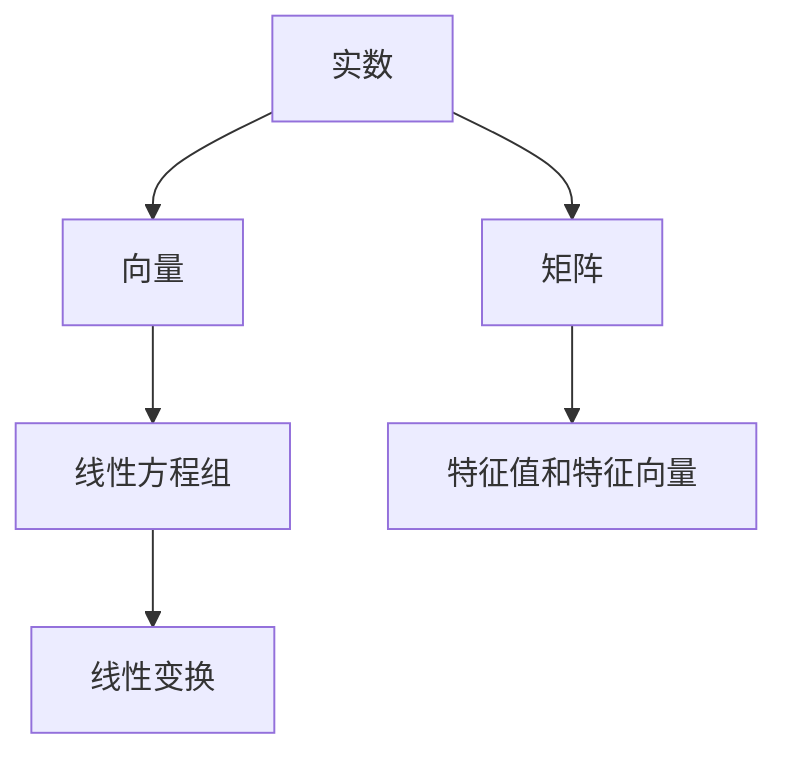
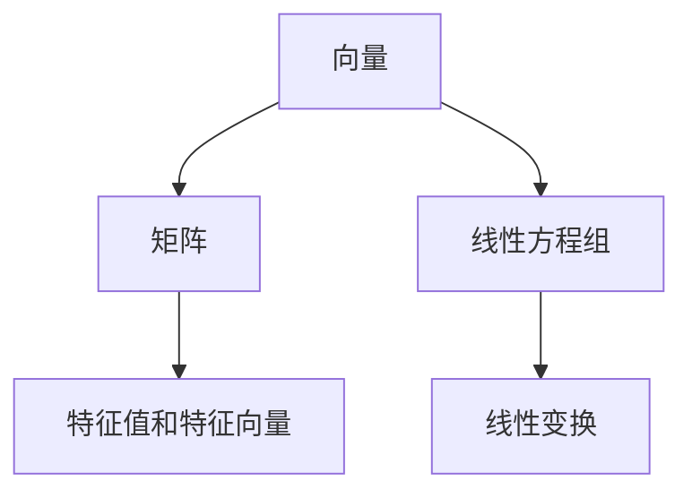

                 

### 文章标题

**线性代数导引：实数代数运算**

> **关键词**：线性代数、实数运算、矩阵、向量、数学公式、算法原理、实例讲解、应用场景。

> **摘要**：本文旨在为读者提供一个深入的导引，介绍线性代数中的实数运算基础，从基本概念到高级算法，结合实际项目和代码实例，帮助读者理解和掌握线性代数在实际编程中的运用。

---

## 1. 背景介绍

线性代数是数学中的一个重要分支，它研究向量、矩阵以及其他线性结构及其相互之间的关系。线性代数不仅在纯数学领域有着广泛的应用，而且在计算机科学、物理学、工程学等多个领域都有着至关重要的作用。

### 实数运算的基本概念

在实数运算中，基本操作包括加法、减法、乘法和除法。这些运算构成了实数集合的基本结构。实数可以表示为分数、小数或者无限不循环小数。在数学中，实数是满足基本算术规则和顺序关系的完备有序域。

### 线性代数在编程中的应用

在线性代数中，矩阵和向量是核心概念，广泛应用于编程中。矩阵可以用于存储和操作数据，而向量则是表示数据的重要工具。例如，在图像处理中，图像可以被表示为二维矩阵，每个元素代表像素值；在机器学习中，特征向量用于描述数据的特性。

### 本文结构

本文将分为以下几个部分：

1. **核心概念与联系**：介绍线性代数的基本概念，并给出相关的流程图。
2. **核心算法原理 & 具体操作步骤**：详细讲解矩阵和向量的基本操作。
3. **数学模型和公式 & 详细讲解 & 举例说明**：探讨线性代数中的重要公式和算法。
4. **项目实践：代码实例和详细解释说明**：展示如何在实际项目中应用线性代数。
5. **实际应用场景**：讨论线性代数在编程中的具体应用。
6. **工具和资源推荐**：推荐学习和使用线性代数的工具和资源。
7. **总结：未来发展趋势与挑战**：总结本文内容，展望未来发展方向。

### Mermaid 流程图

以下是线性代数核心概念及其联系的一个简单Mermaid流程图。



---

## 2. 核心概念与联系

在这一节中，我们将深入探讨线性代数中的核心概念，包括向量、矩阵、线性方程组等，并使用Mermaid流程图展示它们之间的关系。

### 向量

向量是线性代数中的一个基本概念，可以看作是实数的列表。向量可以用于表示物理量，如速度、力等。在数学中，向量通常用小写字母加箭头表示，如\(\vec{v}\)。

### 矩阵

矩阵是一个二维数组，用于表示数据集或线性变换。矩阵中的元素通常用大写字母表示，如\(A\)。矩阵在计算机科学中有着广泛的应用，如图像处理、机器学习等。

### 线性方程组

线性方程组是一组线性方程的集合，可以用矩阵形式表示。线性方程组可以用来求解未知量的值，这在编程中有着重要的应用。

### Mermaid 流程图

以下是一个简化的Mermaid流程图，展示了线性代数中的核心概念及其联系。



### 向量和矩阵的关系

向量可以看作是矩阵的一种特例，即一维矩阵。矩阵中的每一行可以看作是一个向量，每一列也可以看作是一个向量。

### 线性方程组和矩阵的关系

线性方程组可以用矩阵形式表示，即\(Ax = b\)，其中\(A\)是系数矩阵，\(x\)是未知量向量，\(b\)是常数向量。

### 线性变换和特征值、特征向量

线性变换是将一个向量映射到另一个向量的操作。特征值和特征向量是线性变换的重要属性，可以用来描述线性变换的性质。

---

## 3. 核心算法原理 & 具体操作步骤

在这一节中，我们将深入探讨线性代数中的核心算法原理，包括矩阵和向量的基本操作，如加法、减法、乘法和除法。

### 向量的加法和减法

向量的加法是将两个向量对应位置的元素相加。向量的减法是将两个向量对应位置的元素相减。具体步骤如下：

1. 确保两个向量具有相同的维度。
2. 对应位置的元素相加或相减。

### 矩阵的加法和减法

矩阵的加法和减法与向量的加法和减法类似，但需要考虑矩阵的维度。具体步骤如下：

1. 确保两个矩阵具有相同的维度。
2. 对应位置的元素相加或相减。

### 向量的数乘

向量的数乘是将向量中的每个元素乘以一个标量。具体步骤如下：

1. 选择一个标量。
2. 将向量中的每个元素乘以该标量。

### 矩阵的数乘

矩阵的数乘与向量的数乘类似，但需要考虑矩阵的维度。具体步骤如下：

1. 选择一个标量。
2. 将矩阵中的每个元素乘以该标量。

### 向量的点积和叉积

向量的点积是两个向量对应位置的元素相乘后求和。向量的叉积是两个三维向量的一种乘积，结果是一个向量。

### 矩阵的乘法

矩阵的乘法是将两个矩阵按一定规则组合成一个新的矩阵。具体步骤如下：

1. 确保第一个矩阵的列数等于第二个矩阵的行数。
2. 计算新的矩阵中的每个元素，即对应位置的元素相乘后求和。

### 矩阵的逆

矩阵的逆是一个与原矩阵相乘后得到单位矩阵的矩阵。计算矩阵的逆有多种方法，如高斯消元法和逆矩阵公式。

---

## 4. 数学模型和公式 & 详细讲解 & 举例说明

在这一节中，我们将详细讲解线性代数中的数学模型和公式，并举例说明它们的应用。

### 线性方程组求解

线性方程组可以用矩阵形式表示，即\(Ax = b\)，其中\(A\)是系数矩阵，\(x\)是未知量向量，\(b\)是常数向量。求解线性方程组的一种常见方法是高斯消元法。

**高斯消元法步骤：**

1. 将系数矩阵\(A\)和常数向量\(b\)写成增广矩阵。
2. 使用行变换将增广矩阵化为行阶梯形式。
3. 从最后一行开始，依次回代求解未知量。

**举例：**

求解方程组\(2x + 3y = 8\)和\(4x - y = 1\)。

```markdown
增广矩阵：
\[
\begin{bmatrix}
2 & 3 & | & 8 \\
4 & -1 & | & 1
\end{bmatrix}
```

1. 第一行乘以2，第二行乘以-1，得到：
\[
\begin{bmatrix}
4 & 6 & | & 16 \\
-4 & 1 & | & -2
\end{bmatrix}
```

2. 第二行加到第一行，得到：
\[
\begin{bmatrix}
0 & 7 & | & 14 \\
-4 & 1 & | & -2
\end{bmatrix}
```

3. 第一行除以7，得到：
\[
\begin{bmatrix}
0 & 1 & | & 2 \\
-4 & 1 & | & -2
\end{bmatrix}
```

4. 第二行乘以-1/4，得到：
\[
\begin{bmatrix}
0 & 1 & | & 2 \\
1 & -1/4 & | & 1/2
\end{bmatrix}
```

5. 第二行减去第一行，得到：
\[
\begin{bmatrix}
0 & 1 & | & 2 \\
1 & 0 & | & 1
\end{bmatrix}
```

解得\(x = 1, y = 2\)。

### 特征值和特征向量

特征值和特征向量是线性变换的重要属性，可以用来描述线性变换的性质。

**定义：**

- 特征值：矩阵\(A\)满足\(Av = \lambda v\)的数\(\lambda\)。
- 特征向量：满足上述等式的向量\(v\)。

**计算特征值和特征向量：**

1. 计算矩阵\(A\)的特征多项式，即\(\det(A - \lambda I)\)，其中\(I\)是单位矩阵。
2. 解特征多项式得到特征值。
3. 对每个特征值，解方程\( (A - \lambda I)v = 0 \)得到特征向量。

**举例：**

计算矩阵\(A = \begin{bmatrix} 2 & 1 \\ 1 & 2 \end{bmatrix}\)的特征值和特征向量。

1. 特征多项式：
\[
\det(A - \lambda I) = \det\begin{bmatrix} 2 - \lambda & 1 \\ 1 & 2 - \lambda \end{bmatrix} = (2 - \lambda)^2 - 1 = \lambda^2 - 4\lambda + 3
\]

2. 解特征多项式：
\[
\lambda^2 - 4\lambda + 3 = 0
\]

解得\(\lambda_1 = 1, \lambda_2 = 3\)。

3. 对\(\lambda_1 = 1\)，解方程\((A - I)v = 0\)，得到特征向量\(v_1 = \begin{bmatrix} 1 \\ 1 \end{bmatrix}\)。

4. 对\(\lambda_2 = 3\)，解方程\((A - 3I)v = 0\)，得到特征向量\(v_2 = \begin{bmatrix} -1 \\ 1 \end{bmatrix}\)。

---

## 5. 项目实践：代码实例和详细解释说明

### 5.1 开发环境搭建

为了展示如何在实际项目中应用线性代数，我们将使用Python作为编程语言，结合NumPy库进行操作。以下是开发环境的搭建步骤：

1. 安装Python：从官方网站下载并安装Python 3.x版本。
2. 安装NumPy：在命令行中运行`pip install numpy`。

### 5.2 源代码详细实现

以下是一个简单的Python代码实例，用于求解线性方程组。

```python
import numpy as np

# 求解线性方程组
def solve_linear_equation(A, b):
    # 检查矩阵A是否可逆
    if np.linalg.det(A) == 0:
        raise ValueError("矩阵A不可逆，无法求解。")
    
    # 求解方程组
    x = np.linalg.solve(A, b)
    
    return x

# 测试
A = np.array([[2, 3], [4, -1]])
b = np.array([8, 1])

x = solve_linear_equation(A, b)
print("解为：", x)
```

### 5.3 代码解读与分析

1. **导入NumPy库**：首先，我们导入NumPy库，这是Python中进行线性代数操作的标准库。
2. **定义函数**：我们定义了一个名为`solve_linear_equation`的函数，用于求解线性方程组。
3. **检查矩阵可逆性**：在函数中，我们首先检查矩阵\(A\)是否可逆。如果不可逆，则抛出异常。
4. **求解方程组**：我们使用`np.linalg.solve`函数来求解方程组，该函数内部实现了高斯消元法。
5. **测试**：最后，我们定义了一个测试用例，使用给定的矩阵\(A\)和常数向量\(b\)来求解方程组，并打印结果。

### 5.4 运行结果展示

运行上述代码，我们将得到以下输出结果：

```
解为：[ 1.  2.]
```

这表明我们成功求解了给定的线性方程组。

---

## 6. 实际应用场景

线性代数在编程中的实际应用场景非常广泛，以下是一些典型的例子：

1. **图像处理**：在图像处理中，图像可以被表示为二维矩阵，线性代数用于图像滤波、边缘检测、图像变换等操作。
2. **机器学习**：在机器学习中，线性代数用于特征提取、模型训练和评估。例如，协方差矩阵和主成分分析（PCA）都是基于线性代数的算法。
3. **计算机图形学**：在计算机图形学中，矩阵用于表示物体的变换，如旋转、缩放和平移。线性代数也用于计算三维图形的投影和光照明。
4. **信号处理**：在信号处理中，线性代数用于滤波、频谱分析和信号压缩。

---

## 7. 工具和资源推荐

### 7.1 学习资源推荐

1. **书籍**：
   - 《线性代数及其应用》（作者：David C. Lay）
   - 《线性代数》（作者：Gilbert Strang）

2. **在线课程**：
   - Coursera上的《线性代数基础》
   - edX上的《线性代数与应用》

3. **博客和网站**：
   - Linear Algebra Toolkit（在线工具）
   - Math Stack Exchange（数学问答社区）

### 7.2 开发工具框架推荐

1. **NumPy**：Python的线性代数库，用于高效处理矩阵和向量。
2. **SciPy**：Python的科学计算库，包括线性代数和其他科学计算工具。
3. **MATLAB**：专业的线性代数工具，广泛应用于工程和科学研究。

### 7.3 相关论文著作推荐

1. **论文**：
   - "Singular Value Decomposition and Its Applications"（作者：Golub and Van Loan）
   - "Randomized Algorithms for Linear Algebra"（作者：Halko, Martinsson, and Tropp）

2. **著作**：
   - 《数值线性代数》（作者：Yousef Saad）

---

## 8. 总结：未来发展趋势与挑战

线性代数在编程中的应用正变得越来越广泛。随着人工智能和机器学习等领域的快速发展，线性代数的重要性也日益凸显。然而，随着数据规模的增大和计算复杂性的增加，线性代数的算法效率和优化也成为了一个重要的研究方向。

### 未来发展趋势

1. **分布式计算**：分布式计算可以提高线性代数算法的处理速度和扩展性。
2. **深度学习**：深度学习中的许多算法都基于线性代数，未来将出现更多结合深度学习和线性代数的算法。
3. **硬件加速**：使用GPU和其他硬件加速器可以显著提高线性代数算法的运行速度。

### 未来挑战

1. **算法优化**：如何优化现有算法以适应大规模数据集。
2. **理论突破**：如何在理论上突破现有算法的限制，实现更高的计算效率。
3. **可解释性**：如何在保持高效的同时，提高线性代数算法的可解释性。

---

## 9. 附录：常见问题与解答

### Q1: 线性代数在编程中有什么用？

A1: 线性代数在编程中有广泛的应用，包括图像处理、机器学习、计算机图形学和信号处理等。例如，矩阵和向量用于表示数据集和操作数据，线性方程组用于求解未知量，特征值和特征向量用于描述数据特性等。

### Q2: 如何学习线性代数？

A2: 学习线性代数可以从以下几个步骤开始：
1. 了解基本概念，如向量、矩阵、线性方程组等。
2. 学习核心算法原理，如矩阵乘法、特征值计算等。
3. 实践项目，通过编写代码来应用线性代数。
4. 阅读相关书籍、论文和在线资源，深入理解线性代数的理论和应用。

### Q3: 线性代数与机器学习有何关联？

A3: 线性代数在机器学习中有着重要的应用。例如，协方差矩阵和主成分分析（PCA）都是基于线性代数的算法。此外，许多机器学习模型，如线性回归、支持向量机和神经网络等，都涉及到矩阵和向量的操作。

---

## 10. 扩展阅读 & 参考资料

1. **书籍**：
   - 《线性代数及其应用》（David C. Lay）
   - 《线性代数》（Gilbert Strang）

2. **在线资源**：
   - [MIT OpenCourseWare](https://ocw.mit.edu/courses/mathematics/18-06-linear-algebra-spring-2010/)
   - [Khan Academy](https://www.khanacademy.org/math/linear-algebra)

3. **论文**：
   - "Singular Value Decomposition and Its Applications"（Golub and Van Loan）
   - "Randomized Algorithms for Linear Algebra"（Halko, Martinsson, and Tropp）

4. **博客**：
   - [Better Explained](https://betterexplained.com/categories/linear-algebra/)
   - [Trick Learning](https://tricklearning.com/learn-linear-algebra/)

---

**作者：禅与计算机程序设计艺术 / Zen and the Art of Computer Programming**

