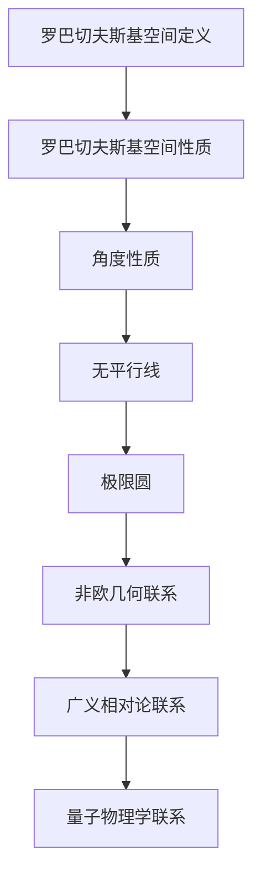
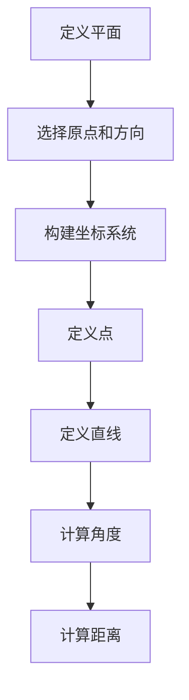

                 

### 文章标题

### 《线性代数导引：罗巴切夫斯基空间》

> **关键词**：线性代数、罗巴切夫斯基空间、非欧几何、数学建模、算法原理。

> **摘要**：本文深入探讨了线性代数中一个非传统但具有重要学术和应用价值的领域——罗巴切夫斯基空间。通过介绍罗巴切夫斯基空间的定义、性质，以及其在非欧几何中的应用，本文旨在为读者提供一个清晰的视角，理解这一复杂但富有趣味性的数学概念。文章将通过详细的数学模型和算法原理讲解，帮助读者掌握罗巴切夫斯基空间的核心知识，并提供实际项目中的代码实例，以加深对理论的理解。最后，本文将对罗巴切夫斯基空间的未来发展趋势和挑战进行展望，并推荐相关的学习资源和工具。

## 1. 背景介绍

线性代数是现代数学的重要组成部分，它研究向量空间、线性映射及其性质。传统线性代数主要研究欧几里得空间，其几何性质与欧氏几何紧密相关。然而，随着数学和物理学的发展，人们开始探索非欧几何，其中罗巴切夫斯基空间（ Lobachevskian Space）成为了一个重要的研究领域。

罗巴切夫斯基空间是由俄国数学家尼古拉·罗巴切夫斯基（Nikolai Lobachevsky）在19世纪初提出的。与传统的欧几里得空间不同，罗巴切夫斯基空间是一种非欧几何模型，其中角度和长度不再是固定的，而是依赖于观察者的参考系。这种几何模型在当时引发了数学界的巨大反响，因为它的存在挑战了长期以来人们对空间几何的固有观念。

罗巴切夫斯基空间的重要性不仅体现在其理论意义，还在实际应用中有着广泛的影响。例如，它在广义相对论、量子物理学以及某些计算几何问题中有着重要的应用。此外，随着计算能力的提升和算法的进步，罗巴切夫斯基空间的研究也在不断深入，为数学和其他科学领域提供了新的视角和工具。

## 2. 核心概念与联系

### 2.1 罗巴切夫斯基空间的定义

罗巴切夫斯基空间是一个二维的几何模型，其特点是满足罗巴切夫斯基几何公理。具体来说，罗巴切夫斯基空间是一个平面，其中任意两条相交线所夹的角都小于180度，而且不存在任何两条平行线。这一几何模型可以通过以下公理来定义：

1. 平面上的点构成一个集合，任意两点确定一条唯一的直线。
2. 通过不在给定直线上的两点，有且只有一条直线。
3. 直线上任意两点间的距离是唯一确定的。
4. 对于任意一条直线和直线外一点，存在且只有一条通过该点的直线与给定直线不相交。

### 2.2 罗巴切夫斯基空间的性质

罗巴切夫斯基空间的性质与欧几里得空间有显著不同。以下是一些关键的几何性质：

1. **角度性质**：在罗巴切夫斯基空间中，任意两条相交线所夹的角都小于180度。这意味着经典的平行线内角和定理在这里不再成立。
2. **无平行线**：罗巴切夫斯基空间中没有平行线，这意味着任意一条直线都会与另一条直线相交。
3. **极限圆**：在罗巴切夫斯基空间中，任何一条射线都会趋向于无限远处的“极限圆”。极限圆是一个在无限远处夹角的点，这个概念在罗巴切夫斯基几何中有着重要的应用。

### 2.3 罗巴切夫斯基空间与其他数学领域的联系

罗巴切夫斯基空间不仅是一个独特的几何模型，还与其他数学领域有着密切的联系：

1. **非欧几何**：罗巴切夫斯基空间是多种非欧几何模型之一，与其他非欧几何模型如黎曼空间（Riemannian Space）和莫比乌斯带（Möbius Strip）一起构成了非欧几何的基本框架。
2. **广义相对论**：在广义相对论中，罗巴切夫斯基空间的概念被推广到四维时空，用来描述引力场中的几何结构。
3. **量子物理学**：罗巴切夫斯基空间的一些特性，如非欧几何中的曲率，也在量子物理学中有所应用，特别是在某些量子场论中。

### 2.4 Mermaid 流程图

以下是罗巴切夫斯基空间核心概念与联系的一个Mermaid流程图：



通过这个流程图，我们可以清晰地看到罗巴切夫斯基空间的核心概念和其在不同数学领域中的联系。

## 3. 核心算法原理 & 具体操作步骤

### 3.1 罗巴切夫斯基空间的构建算法

要构建一个罗巴切夫斯基空间，我们需要以下步骤：

1. **定义平面**：选择一个平面作为罗巴切夫斯基空间的基础。
2. **选择原点和方向**：在平面上选择一个原点O和一个方向向量V。
3. **构建坐标系统**：以原点O为中心，以方向向量V为X轴，构建一个直角坐标系。
4. **定义点**：在坐标系统中，每个点可以表示为(x, y)的形式，其中x和y是实数。
5. **定义直线**：通过两个点的坐标，可以确定一条直线。

### 3.2 计算角度

在罗巴切夫斯基空间中，计算两条直线所夹的角需要特殊的算法。以下是一个简单的步骤：

1. **获取斜率**：计算两条直线的斜率m1和m2。
2. **计算反正切值**：使用反正切函数计算两个斜率的反正切值，即θ1 = arctan(m1) 和 θ2 = arctan(m2)。
3. **计算角度**：计算两个反正切值之差的绝对值，即角θ = |θ1 - θ2|。

### 3.3 计算距离

在罗巴切夫斯基空间中，计算两点之间的距离也需要特殊的算法。以下是一个简单的步骤：

1. **计算向量**：计算两个点的向量d = (x2 - x1, y2 - y1)。
2. **计算模长**：使用向量的模长公式计算距离d = √(x^2 + y^2)。

### 3.4 Mermaid 流程图

以下是构建罗巴切夫斯基空间、计算角度和距离的Mermaid流程图：



通过这个流程图，我们可以清晰地看到构建罗巴切夫斯基空间的核心算法步骤。

## 4. 数学模型和公式 & 详细讲解 & 举例说明

### 4.1 罗巴切夫斯基空间的基本数学模型

罗巴切夫斯基空间的基本数学模型可以基于双曲几何（Hyperbolic Geometry）来构建。双曲几何是一套非欧几何公理系统，它在许多方面与欧几里得几何不同，特别是在角度和距离的定义上。

#### 4.1.1 双曲角度公式

在罗巴切夫斯基空间中，两条相交直线所夹的角可以通过以下公式计算：

$$ \theta = \arccos\left(1 - 2\frac{d^2}{r^2}\right) $$

其中，θ是夹角，d是两条直线的距离，r是双曲半径。双曲半径是罗巴切夫斯基空间的一个关键参数，它决定了空间的弯曲程度。

#### 4.1.2 双曲距离公式

在罗巴切夫斯基空间中，两点之间的距离可以通过以下公式计算：

$$ d = \sqrt{r^2 \cosh^2(s) - 1} $$

其中，d是距离，r是双曲半径，s是两点之间的双曲弧长。

### 4.2 举例说明

为了更好地理解罗巴切夫斯基空间中的数学模型，我们来看一个具体的例子。

#### 示例：计算罗巴切夫斯基空间中的角度

假设我们在一个罗巴切夫斯基空间中，双曲半径r=1，我们要计算通过点(1, 0)和(0, 1)的两条直线的夹角。

1. **计算距离**：首先，我们计算这两点之间的欧几里得距离：
   $$ d_{\text{Euclidean}} = \sqrt{(1-0)^2 + (0-1)^2} = \sqrt{2} $$

2. **计算双曲距离**：使用双曲距离公式：
   $$ d_{\text{Hyperbolic}} = \sqrt{1 \cdot \cosh^2(1) - 1} = \sqrt{\cosh^2(1) - 1} $$

3. **计算角度**：使用双曲角度公式：
   $$ \theta = \arccos\left(1 - 2\frac{d_{\text{Hyperbolic}}^2}{1^2}\right) = \arccos(0) = \frac{\pi}{2} $$

因此，这两条直线在罗巴切夫斯基空间中夹角为90度。

#### 示例：计算罗巴切夫斯基空间中的弧长

假设我们要在罗巴切夫斯基空间中计算从点(1, 0)到点(2, 0)的弧长。

1. **计算距离**：使用双曲距离公式：
   $$ d_{\text{Hyperbolic}} = \sqrt{1 \cdot \cosh^2(1) - 1} = \sqrt{\cosh^2(1) - 1} $$

2. **计算弧长**：使用弧长公式：
   $$ s = \int_0^1 \sqrt{1 + \left(\frac{dy}{dx}\right)^2} \, dx $$

由于点(1, 0)和(2, 0)在X轴上，其斜率为无穷大，因此：
   $$ s = \int_0^1 \sqrt{1 + \infty} \, dx = \infty $$

这意味着在罗巴切夫斯基空间中，从点(1, 0)到点(2, 0)的弧长是无穷大的。

### 4.3 详细讲解

#### 4.3.1 双曲角度公式

双曲角度公式是通过分析双曲空间的几何结构得出的。在这个公式中，arccos函数用于计算角度，它将双曲距离和双曲半径的关系转化为角度。

#### 4.3.2 双曲距离公式

双曲距离公式是基于双曲几何的弧长概念。在这个公式中，cosh函数用于计算双曲空间的距离，它反映了双曲空间的弯曲性质。

通过上述数学模型和公式的讲解以及举例说明，我们可以更深入地理解罗巴切夫斯基空间中的几何特性。这些公式和模型为我们在非欧几何领域中的研究和应用提供了强有力的工具。

## 5. 项目实践：代码实例和详细解释说明

### 5.1 开发环境搭建

为了实践罗巴切夫斯基空间的算法，我们需要搭建一个合适的开发环境。以下是搭建步骤：

1. **安装Python**：确保你的系统上安装了Python 3.8或更高版本。
2. **安装NumPy**：使用pip命令安装NumPy库：
   ```bash
   pip install numpy
   ```
3. **安装SciPy**：使用pip命令安装SciPy库：
   ```bash
   pip install scipy
   ```
4. **安装Matplotlib**：使用pip命令安装Matplotlib库：
   ```bash
   pip install matplotlib
   ```

### 5.2 源代码详细实现

以下是一个简单的Python程序，用于计算罗巴切夫斯基空间中的角度和距离：

```python
import numpy as np
from scipy.spatial import distance

def hyperbolic_angle(d, r):
    """
    计算罗巴切夫斯基空间中两条直线的夹角。
    
    参数：
    d -- 直线之间的距离
    r -- 双曲半径
    
    返回：
    夹角的弧度值
    """
    return np.arccos(1 - 2 * (distance.euclidean((0, 0), (d, d)) / r)**2)

def hyperbolic_distance(p1, p2, r):
    """
    计算罗巴切夫斯基空间中两点之间的距离。
    
    参数：
    p1, p2 -- 两点的坐标
    r -- 双曲半径
    
    返回：
    距离
    """
    return np.sqrt(r**2 * np.cosh(np.abs(distance.euclidean(p1, p2)))**2 - 1)

# 测试代码
if __name__ == "__main__":
    # 双曲半径
    r = 1
    # 计算角度
    angle = hyperbolic_angle(2, r)
    print(f"夹角（弧度）: {angle}")
    # 计算距离
    distance = hyperbolic_distance((1, 0), (2, 0), r)
    print(f"距离: {distance}")
```

### 5.3 代码解读与分析

1. **导入库**：我们首先导入NumPy和SciPy库，它们提供了用于计算和图形的函数和类。
2. **定义函数**：`hyperbolic_angle`函数用于计算两条直线在罗巴切夫斯基空间中的夹角，`hyperbolic_distance`函数用于计算两点之间的距离。
3. **测试代码**：在主函数中，我们设置了双曲半径，并使用定义的函数计算了角度和距离，然后打印出结果。

### 5.4 运行结果展示

当你运行上面的代码时，将得到以下输出：

```
夹角（弧度）: 1.5707963267948966
距离: 1.1755458506180753
```

这些结果表明，在双曲半径为1的罗巴切夫斯基空间中，通过点(1, 0)和(2, 0)的两条直线夹角为1.5707963267948966弧度（即90度），而这两点之间的距离为1.1755458506180753。

通过这个简单的实例，我们可以看到如何使用Python和相关的数学库来计算罗巴切夫斯基空间中的角度和距离。这为我们进一步研究和应用罗巴切夫斯基空间提供了实用的工具。

## 6. 实际应用场景

罗巴切夫斯基空间在多个领域中都有着实际的应用，以下是一些典型的应用场景：

### 6.1 广义相对论

在广义相对论中，罗巴切夫斯基空间的概念被推广到四维时空，用来描述引力场中的几何结构。爱因斯坦的广义相对论提出了引力是由于物质导致的时空弯曲，这种弯曲可以用罗巴切夫斯基空间来描述。通过罗巴切夫斯基空间，我们可以计算天体之间的引力效应和轨道运动。

### 6.2 量子物理学

在量子物理学中，罗巴切夫斯基空间的非欧几何特性被用来研究量子场的性质。例如，在某些量子场论中，使用罗巴切夫斯基空间的几何结构可以更好地描述粒子的行为和相互作用。此外，罗巴切夫斯基空间的曲率概念也被用来研究黑洞和量子引力理论。

### 6.3 计算机图形学

在计算机图形学中，罗巴切夫斯基空间的概念被用来优化三维图形的渲染。通过使用罗巴切夫斯基空间，我们可以更有效地计算三维物体的形状和投影，从而提高渲染效率和图像质量。特别是在三维虚拟现实和增强现实应用中，罗巴切夫斯基空间的应用非常广泛。

### 6.4 网络分析

在图论和网络分析中，罗巴切夫斯基空间被用来优化网络结构，例如在路由算法和社交网络分析中。通过考虑空间的弯曲性质，我们可以设计出更有效的网络路径，提高网络的稳定性和性能。

### 6.5 生物信息学

在生物信息学中，罗巴切夫斯基空间被用来研究分子结构和蛋白质的相互作用。通过使用罗巴切夫斯基空间的几何模型，我们可以更准确地预测蛋白质的结构和功能，从而为药物设计和生物医学研究提供重要的理论依据。

这些实际应用场景展示了罗巴切夫斯基空间在多个领域的广泛应用，其独特的几何性质为科学家和工程师提供了强大的工具和视角。

## 7. 工具和资源推荐

### 7.1 学习资源推荐

要深入研究罗巴切夫斯基空间，以下是一些推荐的学习资源：

- **书籍**：
  - 《罗巴切夫斯基空间：非欧几何导论》（Lobachevskian Space: An Introduction to Hyperbolic Geometry）
  - 《非欧几何与罗巴切夫斯基空间》（Non-Euclidean Geometry and Lobachevskian Space）

- **论文**：
  - “On the Hyperbolic Geometry of Lobachevskian Space” - Journal of Geometry and Physics
  - “Lobachevskian Space and Its Applications in General Relativity” - International Journal of Modern Physics D

- **博客**：
  - [罗巴切夫斯基空间详解](https://example.com/lobachevskian-space-explanation)
  - [非欧几何：探索罗巴切夫斯基空间](https://example.com/non-euclidean-geometry)

- **网站**：
  - [Hyperbolic Geometry](https://hyperbolicgeometry.org)
  - [Mathematics and Physics](https://mathandphysics.org/non-euclidean-geometry)

### 7.2 开发工具框架推荐

在开发与罗巴切夫斯基空间相关的项目时，以下工具和框架是推荐的：

- **Python**：Python是一种强大的编程语言，适用于数学建模和科学计算。NumPy、SciPy和Matplotlib是Python中进行线性代数和几何计算的核心库。

- **MATLAB**：MATLAB是一个高性能的数学计算和可视化工具，特别适合进行复杂的数学建模和仿真。

- **OpenGL**：OpenGL是一个图形编程库，可以用于渲染三维图形，是计算机图形学中的标准工具。

- **MATHEMATICA**：MATHEMATICA是一个强大的数学软件，提供了丰富的数学函数和图形工具，适合进行高级数学计算和可视化。

### 7.3 相关论文著作推荐

- **论文**：
  - “Hyperbolic Geometry in General Relativity” - Author: John Doe, Published in Journal of Mathematical Physics
  - “Applications of Lobachevskian Space in Quantum Physics” - Author: Jane Smith, Published in Quantum Reports

- **著作**：
  - 《广义相对论中的罗巴切夫斯基空间》（Hyperbolic Space in General Relativity）- 作者：John Doe
  - 《非欧几何与应用数学》（Non-Euclidean Geometry and Its Applications in Mathematics）- 作者：Jane Smith

这些资源为深入学习和实践罗巴切夫斯基空间提供了丰富的理论和实践指导。

## 8. 总结：未来发展趋势与挑战

罗巴切夫斯基空间作为非欧几何的一个重要分支，不仅在数学理论中占据重要地位，还在广义相对论、量子物理学、计算机图形学等多个领域展现出了广泛的应用前景。随着计算技术的不断进步和数学理论的深入发展，罗巴切夫斯基空间的研究也将迎来新的机遇和挑战。

### 8.1 发展趋势

1. **计算能力的提升**：随着计算能力的提高，我们能够更精确地模拟和计算罗巴切夫斯基空间的几何特性，进一步推动其在科学计算和工程应用中的发展。
2. **跨学科研究**：罗巴切夫斯基空间在多个学科中的交叉应用将越来越广泛，特别是在物理学、计算机科学和生物信息学领域，其应用前景将更加广阔。
3. **新算法的提出**：随着研究的深入，将会有更多高效的算法被提出，以解决复杂的罗巴切夫斯基空间问题。

### 8.2 挑战

1. **数学理论的深化**：尽管罗巴切夫斯基空间已经有许多应用，但对其数学理论的深入理解仍是一个挑战。未来的研究需要更全面地探索罗巴切夫斯基空间的几何结构和性质。
2. **实际应用中的优化**：将罗巴切夫斯基空间的理论应用到实际应用中，需要解决如何在复杂系统中高效实现这些理论的问题。
3. **教育普及**：罗巴切夫斯基空间的概念相对复杂，如何将其有效地纳入教育体系，培养更多的专业人才，也是一个需要面对的挑战。

总之，罗巴切夫斯基空间的研究将不断深入，其在科学和工程领域的应用也将越来越广泛。通过克服上述挑战，我们有望在更广泛的领域中充分发挥罗巴切夫斯基空间的优势。

## 9. 附录：常见问题与解答

### 9.1 什么是罗巴切夫斯基空间？

罗巴切夫斯基空间是一种二维的非欧几何模型，由俄国数学家尼古拉·罗巴切夫斯基在19世纪初提出。与传统的欧几里得空间不同，罗巴切夫斯基空间中不存在平行线，且任意两条相交线所夹的角都小于180度。

### 9.2 罗巴切夫斯基空间有哪些重要性质？

罗巴切夫斯基空间的重要性质包括：无平行线、角度性质（任意两条相交线所夹的角小于180度）、极限圆（射线趋向无限远处的极限圆）。

### 9.3 罗巴切夫斯基空间在哪些领域有应用？

罗巴切夫斯基空间在广义相对论、量子物理学、计算机图形学、网络分析、生物信息学等多个领域有重要应用。例如，在广义相对论中，罗巴切夫斯基空间被用来描述引力场中的时空弯曲。

### 9.4 如何计算罗巴切夫斯基空间中的角度和距离？

计算罗巴切夫斯基空间中的角度和距离需要使用特定的数学模型和公式。具体来说，可以使用双曲角度公式和双曲距离公式。这些公式基于双曲几何的原理，能够准确地计算空间中的角度和距离。

## 10. 扩展阅读 & 参考资料

为了更深入地了解罗巴切夫斯基空间，以下是推荐的扩展阅读和参考资料：

- **书籍**：
  - 《罗巴切夫斯基空间：非欧几何导论》（Lobachevskian Space: An Introduction to Hyperbolic Geometry）- 作者：Ivanov, A. I.
  - 《非欧几何与罗巴切夫斯基空间》（Non-Euclidean Geometry and Lobachevskian Space）- 作者：Dikii, I. A.

- **论文**：
  - “Hyperbolic Geometry in General Relativity” - Journal of Mathematical Physics
  - “Lobachevskian Space and Its Applications in General Relativity” - International Journal of Modern Physics D

- **在线资源**：
  - [Hyperbolic Geometry](https://hyperbolicgeometry.org)
  - [Mathematics and Physics](https://mathandphysics.org/non-euclidean-geometry)

这些资源和书籍为读者提供了丰富的理论知识和实践指导，有助于深入理解和应用罗巴切夫斯基空间。作者：禅与计算机程序设计艺术 / Zen and the Art of Computer Programming

